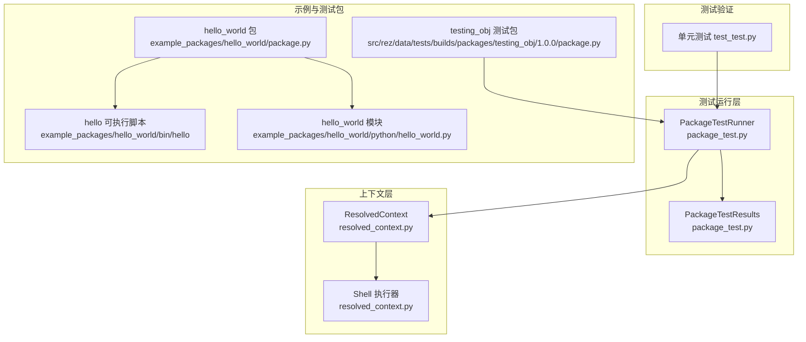
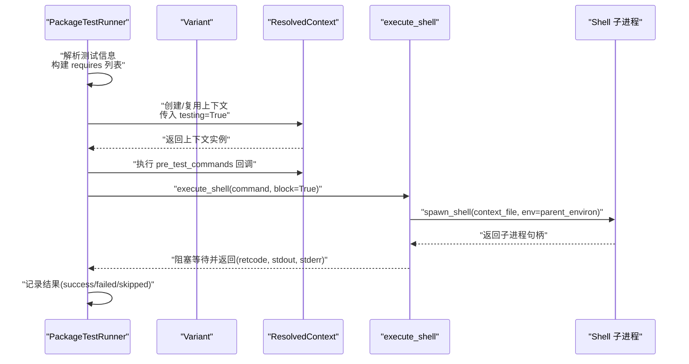
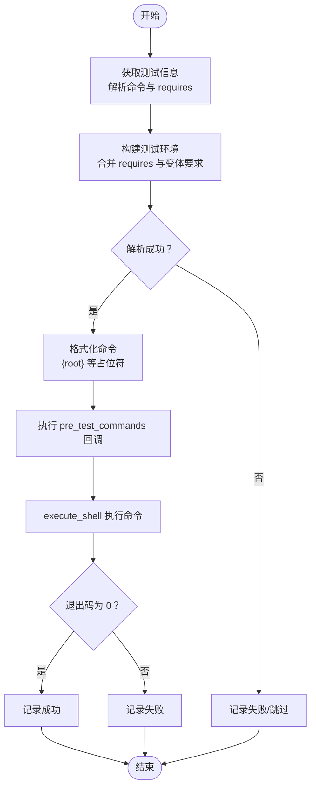
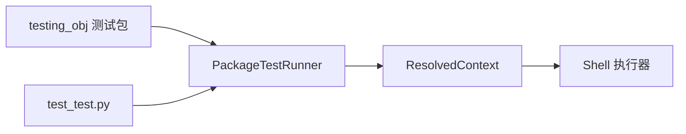

# 测试执行机制

<cite>
**本文引用的文件**
- [package_test.py](file://rez-3.3.0/src/rez/package_test.py)
- [resolved_context.py](file://rez-3.3.0/src/rez/resolved_context.py)
- [hello_world 包定义](file://rez-3.3.0/example_packages/hello_world/package.py)
- [hello_world 可执行脚本](file://rez-3.3.0/example_packages/hello_world/bin/hello)
- [hello_world Python 模块](file://rez-3.3.0/example_packages/hello_world/python/hello_world.py)
- [testing_obj 测试包](file://rez-3.3.0/src/rez/data/tests/builds/packages/testing_obj/1.0.0/package.py)
- [测试用例 test_test.py](file://rez-3.3.0/src/rez/tests/test_test.py)
</cite>

## 目录
1. [简介](#简介)
2. [项目结构](#项目结构)
3. [核心组件](#核心组件)
4. [架构总览](#架构总览)
5. [详细组件分析](#详细组件分析)
6. [依赖关系分析](#依赖关系分析)
7. [性能考量](#性能考量)
8. [故障排查指南](#故障排查指南)
9. [结论](#结论)
10. [附录](#附录)

## 简介
本文件系统化阐述 Rez 中“安装后测试”（package test）的执行机制，重点围绕以下目标：
- 解析 PackageTestRunner 如何通过 ResolvedContext 在隔离环境中执行测试；
- 详解 package.test 字典中 commands 与 requires 的作用及运行流程；
- 说明测试命令构建、执行、环境变量继承、工作目录与进程权限控制；
- 提供超时、资源限制与安全沙箱的最佳实践；
- 分析多平台（Windows/Linux/macOS）差异与兼容性方案。

## 项目结构
与测试执行直接相关的代码位于 Rez 源码树的以下位置：
- package_test.py：测试运行器与结果聚合；
- resolved_context.py：上下文解析、环境生成与 shell 执行；
- hello_world 示例包：展示工具与命令环境；
- testing_obj 测试包：包含多种测试场景（字符串命令、列表命令、requires 环境需求等）；
- 单元测试 test_test.py：验证测试运行器的行为。

图表来源
- [package_test.py](file://rez-3.3.0/src/rez/package_test.py#L1-L200)
- [resolved_context.py](file://rez-3.3.0/src/rez/resolved_context.py#L1350-L1480)
- [hello_world 包定义](file://rez-3.3.0/example_packages/hello_world/package.py#L1-L29)
- [hello_world 可执行脚本](file://rez-3.3.0/example_packages/hello_world/bin/hello#L1-L4)
- [hello_world Python 模块](file://rez-3.3.0/example_packages/hello_world/python/hello_world.py#L1-L4)
- [testing_obj 测试包](file://rez-3.3.0/src/rez/data/tests/builds/packages/testing_obj/1.0.0/package.py#L1-L43)
- [测试用例 test_test.py](file://rez-3.3.0/src/rez/tests/test_test.py#L1-L120)

章节来源
- [package_test.py](file://rez-3.3.0/src/rez/package_test.py#L1-L200)
- [resolved_context.py](file://rez-3.3.0/src/rez/resolved_context.py#L1350-L1480)
- [hello_world 包定义](file://rez-3.3.0/example_packages/hello_world/package.py#L1-L29)
- [testing_obj 测试包](file://rez-3.3.0/src/rez/data/tests/builds/packages/testing_obj/1.0.0/package.py#L1-L43)
- [测试用例 test_test.py](file://rez-3.3.0/src/rez/tests/test_test.py#L1-L120)

## 核心组件
- PackageTestRunner：负责发现、筛选、构建并执行测试；管理测试结果与失败停止策略。
- ResolvedContext：负责解析包请求、生成隔离环境、输出 shell 上下文文件并启动子进程执行命令。
- PackageTestResults：汇总测试结果，支持跨多个 Runner 聚合统计。

关键职责与交互要点：
- 测试发现与过滤：根据 run_on 标签与 on_variants 过滤规则选择测试集。
- 环境构建：将测试所需的额外包请求合并到 ResolvedContext 请求中，确保测试环境满足依赖。
- 命令扩展与注入：对 {root} 等占位符进行格式化，支持字符串或列表两种命令形式。
- 执行回调：在执行前/后注入自定义动作（如 pre_test_commands），便于测试前置准备。
- 结果记录：成功/失败/跳过状态与描述，支持累计结果。

章节来源
- [package_test.py](file://rez-3.3.0/src/rez/package_test.py#L1-L200)
- [package_test.py](file://rez-3.3.0/src/rez/package_test.py#L250-L500)
- [package_test.py](file://rez-3.3.0/src/rez/package_test.py#L584-L673)
- [package_test.py](file://rez-3.3.0/src/rez/package_test.py#L675-L749)

## 架构总览
下面以序列图展示从测试运行器到上下文执行的整体流程。

图表来源
- [package_test.py](file://rez-3.3.0/src/rez/package_test.py#L446-L499)
- [resolved_context.py](file://rez-3.3.0/src/rez/resolved_context.py#L1350-L1480)

章节来源
- [package_test.py](file://rez-3.3.0/src/rez/package_test.py#L446-L499)
- [resolved_context.py](file://rez-3.3.0/src/rez/resolved_context.py#L1350-L1480)

## 详细组件分析

### PackageTestRunner：测试运行与隔离环境
- 测试发现与过滤
  - 支持 run_on 标签过滤与 on_variants 规则（如仅在特定变体上运行）。
  - 支持通配符匹配测试名，便于批量执行。
- 隔离环境构建
  - 若 use_current_env 为真且当前环境满足要求，则直接在当前上下文中运行。
  - 否则基于 requires 创建 ResolvedContext，testing=True 表明这是测试专用解析。
  - 复用已解析上下文，避免重复求解。
- 命令构建与执行
  - 支持字符串与列表两种命令形式；列表形式直接传递给 shell，不经过 shell 解释。
  - 对命令中的 {root} 等占位符进行格式化；可附加额外参数。
  - 执行前注入 pre_test_commands，允许在测试前绑定 this、test 名称等上下文。
  - 使用 ResolvedContext.execute_shell(block=True) 同步执行命令，捕获退出码并记录结果。
- 失败策略与累计结果
  - stop_on_fail 控制遇到首个失败即停止。
  - 支持将结果写入外部 PackageTestResults，实现跨 Runner 聚合。

章节来源
- [package_test.py](file://rez-3.3.0/src/rez/package_test.py#L1-L200)
- [package_test.py](file://rez-3.3.0/src/rez/package_test.py#L250-L500)
- [package_test.py](file://rez-3.3.0/src/rez/package_test.py#L584-L673)
- [package_test.py](file://rez-3.3.0/src/rez/package_test.py#L675-L749)

### ResolvedContext：上下文解析与执行
- 解析与缓存
  - testing=True 用于测试场景；timestamp 保证同一时间点解析，避免测试间新包引入导致不稳定。
  - 缓存已解析上下文，按 requires 元组作为键。
- 环境生成与执行
  - execute_shell 会生成上下文文件（context.rxt/context.sh 等），写入 REZ_RXT_FILE、REZ_CONTEXT_FILE 等环境变量。
  - 支持 actions_callback/post_actions_callback 注入自定义动作（如 alias、变量设置）。
  - 支持 start_new_session、detached、pre_command 等高级选项，便于进程控制与终端分离。
  - 返回子进程句柄或阻塞等待并返回 (retcode, stdout, stderr)。

章节来源
- [resolved_context.py](file://rez-3.3.0/src/rez/resolved_context.py#L165-L210)
- [resolved_context.py](file://rez-3.3.0/src/rez/resolved_context.py#L1350-L1480)
- [resolved_context.py](file://rez-3.3.0/src/rez/resolved_context.py#L1429-L1478)

### package.test 字典：commands 与 requires 的作用
- commands
  - 字符串形式：作为 shell 命令执行；支持 {root} 等占位符格式化。
  - 列表形式：直接以 argv 形式启动进程，不经过 shell 解释，更安全、可控。
- requires
  - 将测试所需额外包加入解析请求，确保测试环境包含必要依赖（如 python、特定工具）。
  - 与变体的 variant_requires 合并，保证解析到期望变体。
- run_on/on_variants
  - run_on：按标签过滤测试集合；
  - on_variants：控制是否仅在首选变体或满足条件的变体上运行。

章节来源
- [package_test.py](file://rez-3.3.0/src/rez/package_test.py#L41-L48)
- [package_test.py](file://rez-3.3.0/src/rez/package_test.py#L540-L583)
- [testing_obj 测试包](file://rez-3.3.0/src/rez/data/tests/builds/packages/testing_obj/1.0.0/package.py#L24-L43)

### hello_world 示例：命令与环境
- 包定义声明 tools、requires、commands，将 bin 与 python 目录加入 PATH 与 PYTHONPATH。
- 示例脚本 hello 调用 hello_world 模块的 hello 函数，打印“Hello world!”。
- 该示例展示了工具命令在解析上下文后的可用性，可用于验证测试环境是否正确加载。

章节来源
- [hello_world 包定义](file://rez-3.3.0/example_packages/hello_world/package.py#L1-L29)
- [hello_world 可执行脚本](file://rez-3.3.0/example_packages/hello_world/bin/hello#L1-L4)
- [hello_world Python 模块](file://rez-3.3.0/example_packages/hello_world/python/hello_world.py#L1-L4)

### 测试执行流程：从测试包到命令执行

图表来源
- [package_test.py](file://rez-3.3.0/src/rez/package_test.py#L446-L499)
- [resolved_context.py](file://rez-3.3.0/src/rez/resolved_context.py#L1350-L1480)

章节来源
- [package_test.py](file://rez-3.3.0/src/rez/package_test.py#L446-L499)
- [resolved_context.py](file://rez-3.3.0/src/rez/resolved_context.py#L1350-L1480)

## 依赖关系分析
- PackageTestRunner 依赖 ResolvedContext 进行环境解析与执行；
- ResolvedContext 依赖 Shell 插件与执行器生成上下文文件并启动子进程；
- 测试包（如 testing_obj）通过 tests 字典提供测试命令与依赖；
- 单元测试 test_test.py 验证测试运行器行为与结果统计。

图表来源
- [package_test.py](file://rez-3.3.0/src/rez/package_test.py#L1-L200)
- [resolved_context.py](file://rez-3.3.0/src/rez/resolved_context.py#L1350-L1480)
- [testing_obj 测试包](file://rez-3.3.0/src/rez/data/tests/builds/packages/testing_obj/1.0.0/package.py#L1-L43)
- [测试用例 test_test.py](file://rez-3.3.0/src/rez/tests/test_test.py#L1-L120)

章节来源
- [package_test.py](file://rez-3.3.0/src/rez/package_test.py#L1-L200)
- [resolved_context.py](file://rez-3.3.0/src/rez/resolved_context.py#L1350-L1480)
- [testing_obj 测试包](file://rez-3.3.0/src/rez/data/tests/builds/packages/testing_obj/1.0.0/package.py#L1-L43)
- [测试用例 test_test.py](file://rez-3.3.0/src/rez/tests/test_test.py#L1-L120)

## 性能考量
- 解析缓存：PackageTestRunner 通过缓存已解析的 ResolvedContext，避免重复求解，提升批量测试效率。
- 时间戳一致性：统一 timestamp 防止测试间新包引入导致解析不稳定。
- 并发与批量：建议在 CI 中并行运行不同测试集，但注意共享资源竞争与日志输出同步。
- 资源限制：可在宿主侧通过 ulimit（Linux）、进程组（Windows）或容器限制实现资源约束。

[本节为通用指导，无需列出具体文件来源]

## 故障排查指南
- 环境未满足 requirements
  - 现象：测试环境解析失败或当前环境不满足要求被跳过。
  - 排查：检查 requires 是否包含测试必需包；确认 use_current_env 条件是否满足。
- 命令格式问题
  - 字符串命令：注意 shell 特殊字符转义与 {root} 占位符；
  - 列表命令：确保 argv 顺序与参数正确。
- 执行回调未生效
  - 确认 pre_test_commands 是否存在且在执行前注入；
  - 检查 actions_callback/post_actions_callback 的时机与作用域。
- 多平台差异
  - Windows CMD/CMDER：别名与命令注入需考虑 doskey 生命周期；
  - Linux/macOS：PATH、权限与终端模拟器配置可能不同。
- 超时与资源限制
  - 在 ResolvedContext 初始化时可设置 time_limit/max_fails；
  - 宿主侧可通过进程组/容器实现 CPU/内存限制。

章节来源
- [package_test.py](file://rez-3.3.0/src/rez/package_test.py#L250-L500)
- [resolved_context.py](file://rez-3.3.0/src/rez/resolved_context.py#L165-L210)
- [resolved_context.py](file://rez-3.3.0/src/rez/resolved_context.py#L1350-L1480)

## 结论
Rez 的测试执行机制通过 PackageTestRunner 与 ResolvedContext 协作，实现了对安装后测试的可靠隔离与可控执行。测试包的 tests 字典提供了灵活的命令与依赖声明，配合 pre_test_commands 回调与 execute_shell 的强大执行能力，能够在多平台上稳定运行测试。实践中应重视环境解析缓存、时间戳一致性、命令格式与平台差异，并结合宿主侧资源限制与超时策略，确保测试的稳定性与可重复性。

[本节为总结性内容，无需列出具体文件来源]

## 附录

### 最佳实践清单
- 环境隔离
  - 使用 testing=True 与统一 timestamp，避免测试间状态漂移。
  - 优先使用列表命令形式，减少 shell 解释风险。
- 命令与参数
  - 字符串命令中谨慎处理特殊字符与路径分隔符；
  - 通过 actions_callback 注入必要的环境变量或别名。
- 超时与资源限制
  - 在 ResolvedContext 初始化时设置 time_limit；
  - 在宿主侧通过进程组/容器限制 CPU/内存。
- 安全与沙箱
  - 限制可执行范围，避免访问敏感路径；
  - 在容器或受限用户下运行测试。
- 多平台兼容
  - Windows：注意 CMD 别名生命周期与终端模拟器；
  - Linux/macOS：统一 PATH 与权限模型，避免权限不足导致失败。

[本节为通用指导，无需列出具体文件来源]