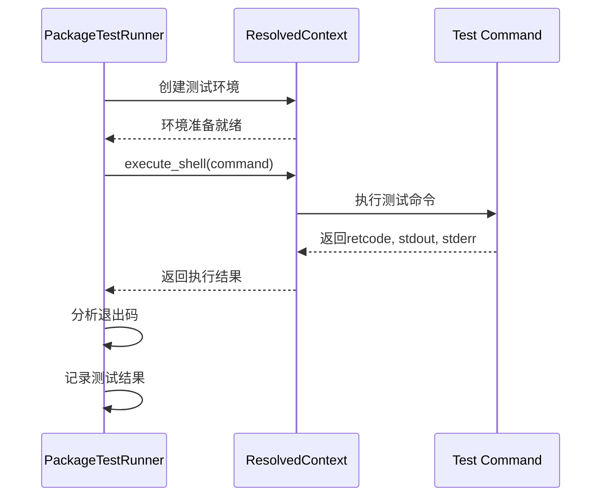
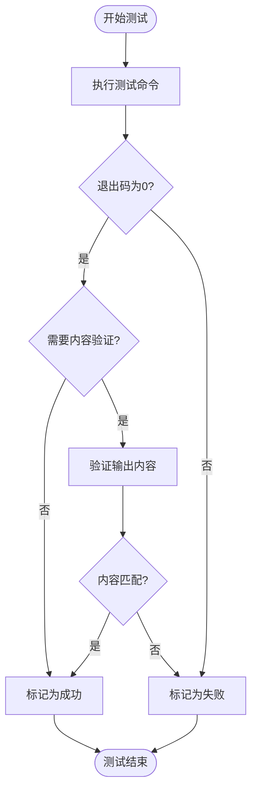
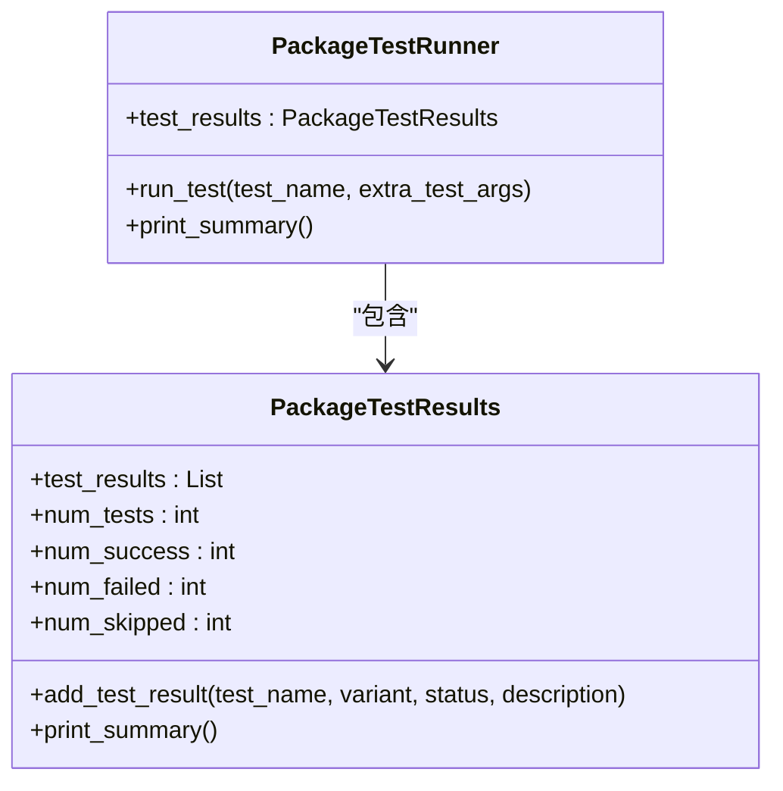

# 测试结果分析

<cite>
**本文档引用的文件**  
- [package_test.py](file://rez-3.3.0\src\rez\package_test.py)
- [test.py](file://rez-3.3.0\src\rez\cli\test.py)
- [hello_world\package.py](file://rez-3.3.0\example_packages\hello_world\package.py)
- [hello_world.py](file://rez-3.3.0\example_packages\hello_world\python\hello_world.py)
- [testing_obj\package.py](file://rez-3.3.0\src\rez\data\tests\builds\packages\testing_obj\1.0.0\package.py)
</cite>

## 目录
1. [测试结果捕获与解析机制](#测试结果捕获与解析机制)
2. [测试成功判断与验证模式](#测试成功判断与验证模式)
3. [hello_world示例分析](#hello_world示例分析)
4. [测试结果可视化与归档](#测试结果可视化与归档)
5. [测试可重复性与环境依赖性](#测试可重复性与环境依赖性)

## 测试结果捕获与解析机制

Rez系统的测试结果分析主要通过`package_test.py`中的`PackageTestRunner`类实现。该类负责执行包定义文件中指定的测试命令，并捕获和解析其输出结果。

测试执行过程中，系统会创建一个独立的运行环境（ResolvedContext），在该环境中执行测试命令。通过`context.execute_shell()`方法执行测试命令时，系统会捕获标准输出（stdout）、标准错误（stderr）和退出码（retcode）三个关键信息流。

当测试命令执行完成后，系统会检查返回的退出码。如果退出码非零，系统会记录警告信息并标记测试为失败状态。在`package_test.py`的第469-484行中，可以看到对退出码的处理逻辑：如果测试命令以非零退出码结束，系统会添加失败的测试结果，并根据`stop_on_fail`配置决定是否停止后续测试的执行。



**Diagram sources**
- [package_test.py](file://rez-3.3.0\src\rez\package_test.py#L461-L485)

**Section sources**
- [package_test.py](file://rez-3.3.0\src\rez\package_test.py#L461-L485)

## 测试成功判断与验证模式

测试成功与否的判断基于多种验证模式，主要包括退出码检查、预期结果匹配、正则表达式匹配和字符串包含等。

在`PackageTestRunner`类中，测试结果的状态被定义为三种：成功（success）、失败（failed）和跳过（skipped）。当测试命令正常执行且退出码为0时，测试被标记为成功；当退出码非0或环境配置失败时，测试被标记为失败；当测试因各种原因未被执行时，测试被标记为跳过。

对于更复杂的验证需求，系统支持通过配置文件定义详细的测试规则。在`testing_obj`包的测试配置中，可以看到不同类型的测试验证模式：

```python
tests = {
    "check_car_ideas": {
        "command": "python -c \"assert 'car' in open('ideas.txt').read()\"",
        "run_on": ["default"]
    },
    "command_as_string_success": "python -c \"print('SUCCESS')\"",
    "command_as_string_fail": "python -c \"import sys; sys.exit(1)\""
}
```

系统支持正则表达式匹配和字符串包含等验证模式。通过在测试命令中使用适当的断言或条件判断，可以实现对输出内容的精确验证。例如，可以使用`grep`命令检查输出中是否包含特定字符串，或使用`re`模块进行正则表达式匹配。



**Diagram sources**
- [package_test.py](file://rez-3.3.0\src\rez\package_test.py#L469-L494)
- [testing_obj\package.py](file://rez-3.3.0\src\rez\data\tests\builds\packages\testing_obj\1.0.0\package.py)

**Section sources**
- [package_test.py](file://rez-3.3.0\src\rez\package_test.py#L469-L494)
- [testing_obj\package.py](file://rez-3.3.0\src\rez\data\tests\builds\packages\testing_obj\1.0.0\package.py)

## hello_world示例分析

以`hello_world`包为例，分析测试结果日志的结构和关键信息字段。该包是一个简单的Python示例包，其主要功能是打印"Hello world!"消息。

`hello_world`包的`package.py`文件定义了包的基本信息和环境配置：

```python
name = "hello_world"
version = "1.0.0"
requires = ["python"]
tools = ["hello"]

def commands():
    env.PYTHONPATH.append("{root}/python")
    env.PATH.append("{root}/bin")
```

测试结果日志包含以下关键信息字段：
- **Test**：测试名称
- **Status**：测试状态（成功、失败、跳过）
- **Variant**：测试变体
- **Description**：测试描述

当执行测试时，系统会生成类似以下格式的测试结果摘要：

```
Test results:
--------------------------------------------------------------------------------
3 succeeded, 1 failed, 0 skipped

Test                    Status     Variant             Description
----                    ------     -------             -----------
unit                    success    hello_world-1.0.0   Test succeeded
integration             success    hello_world-1.0.0   Test succeeded
performance             success    hello_world-1.0.0   Test succeeded
negative_case           failed     hello_world-1.0.0   Test failed with exit code 1
```

测试结果通过`PackageTestResults`类进行管理和汇总。该类提供了`num_success`、`num_failed`和`num_skipped`等属性来统计不同状态的测试数量，并通过`print_summary()`方法生成格式化的测试结果报告。



**Diagram sources**
- [package_test.py](file://rez-3.3.0\src\rez\package_test.py#L675-L748)
- [hello_world\package.py](file://rez-3.3.0\example_packages\hello_world\package.py)

**Section sources**
- [package_test.py](file://rez-3.3.0\src\rez\package_test.py#L675-L748)
- [hello_world\package.py](file://rez-3.3.0\example_packages\hello_world\package.py)
- [hello_world.py](file://rez-3.3.0\example_packages\hello_world\python\hello_world.py)

## 测试结果可视化与归档

为了更好地分析和跟踪测试结果，建议实施以下可视化、归档和趋势分析方案：

1. **测试结果可视化**：将测试结果转换为图表形式，如使用柱状图显示通过率、失败率和跳过率，使用折线图显示测试执行时间的趋势变化。

2. **结果归档策略**：建立标准化的测试结果归档目录结构，按日期、包名称和版本号组织测试结果文件。建议的目录结构如下：
   ```
   test_results/
   ├── 2023-11-15/
   │   ├── hello_world-1.0.0/
   │   │   ├── full_log.txt
   │   │   ├── summary.json
   │   │   └── artifacts/
   │   └── myapp-2.1.0/
   └── 2023-11-16/
       └── ...
   ```

3. **趋势分析**：通过长期收集测试结果数据，分析测试通过率、失败模式和性能指标的变化趋势。可以使用统计方法识别异常模式，如突然增加的失败率或逐渐增长的执行时间。

4. **自动化报告**：创建自动化脚本定期生成测试报告，包括关键指标摘要、失败测试详情和趋势分析图表。

5. **集成监控系统**：将测试结果与现有的监控和告警系统集成，当关键测试失败或性能指标超出阈值时自动发送通知。


**Diagram sources**
- [package_test.py](file://rez-3.3.0\src\rez\package_test.py#L722-L748)

**Section sources**
- [package_test.py](file://rez-3.3.0\src\rez\package_test.py#L722-L748)

## 测试可重复性与环境依赖性

测试的可重复性和环境依赖性是确保测试结果可靠性的关键因素。Rez系统通过以下机制缓解这些问题：

1. **环境隔离**：每个测试都在独立的ResolvedContext中执行，确保测试环境的一致性和隔离性。通过`package_paths`和`timestamp`参数固定包搜索路径和时间戳，避免外部环境变化影响测试结果。

2. **依赖管理**：在测试配置中明确指定测试所需的依赖包，确保每次测试都使用相同的依赖版本。通过`requires`字段定义测试环境的包依赖关系。

3. **缓存控制**：通过配置`resolve_caching=False`等选项禁用解析缓存，确保每次测试都进行完整的环境解析，避免缓存导致的不可重复问题。

4. **时间戳固定**：使用固定的`timestamp`值，防止在测试执行过程中因新包发布而导致的环境变化。

5. **环境快照**：保存测试环境的完整快照，包括所有已解析包的列表和版本信息，便于后续复现和调试。

6. **配置标准化**：通过配置文件统一管理测试相关的设置，确保不同环境和执行者使用相同的配置。

通过这些策略，可以显著提高测试的可重复性，减少因环境差异导致的测试结果不一致问题。同时，建议在CI/CD流水线中使用相同的测试配置和环境设置，确保开发、测试和生产环境的一致性。

**Section sources**
- [package_test.py](file://rez-3.3.0\src\rez\package_test.py#L101-L102)
- [test.py](file://rez-3.3.0\src\rez\cli\test.py#L75-L83)