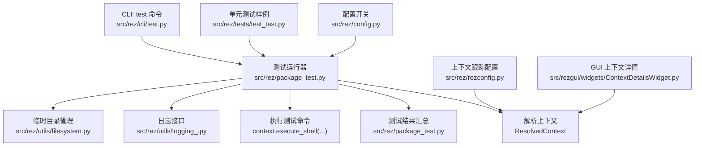
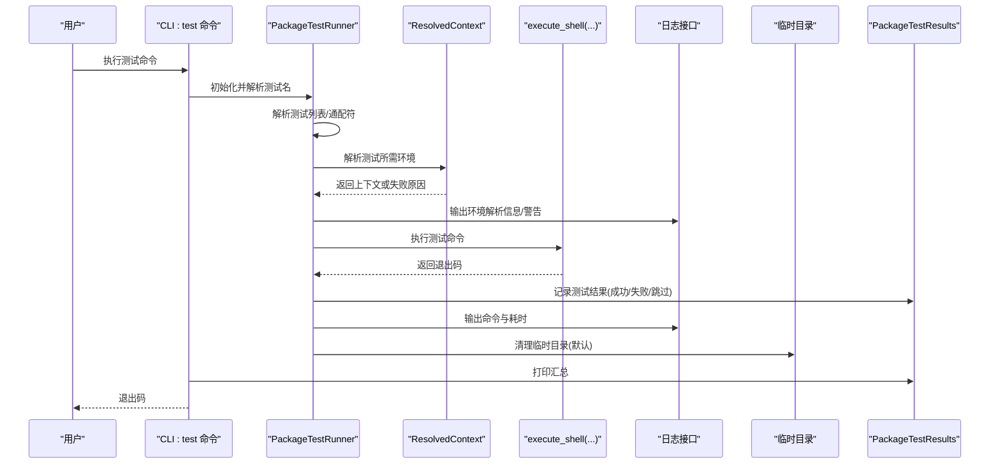
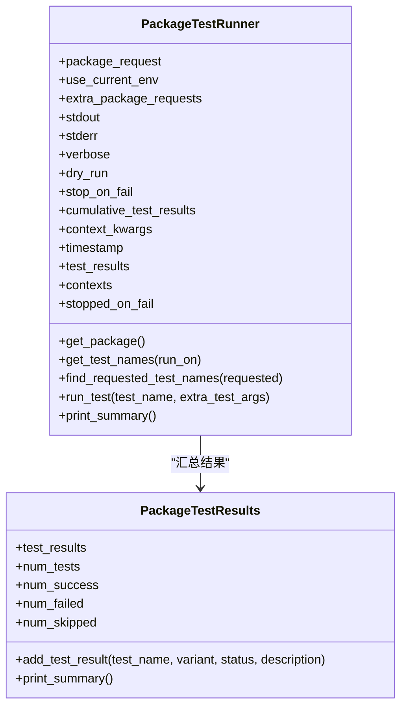
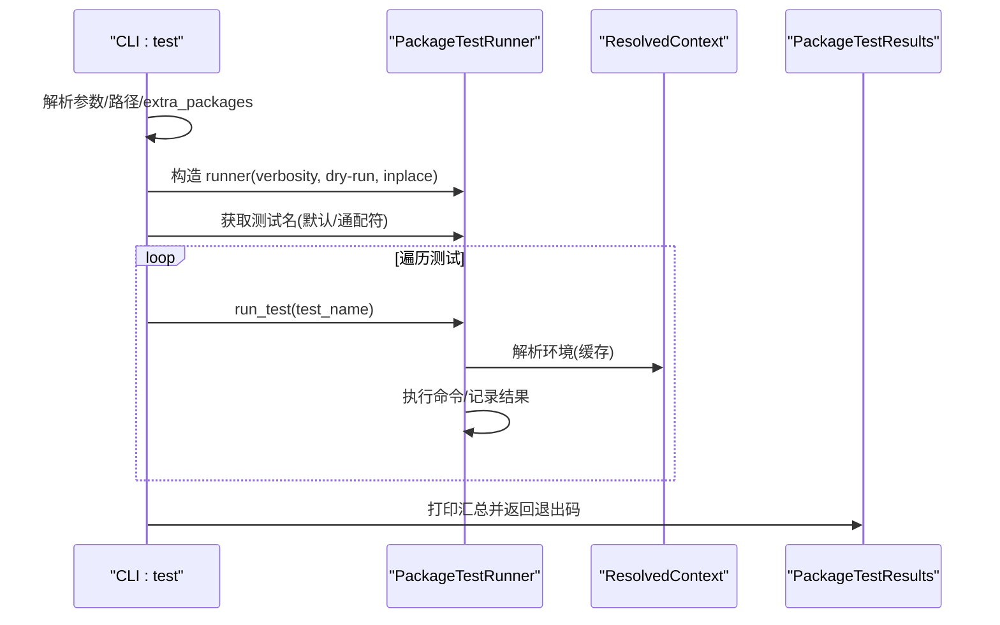
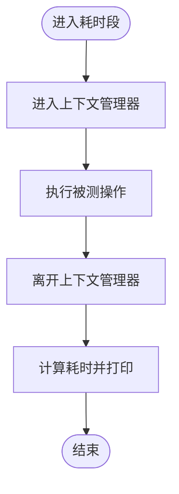
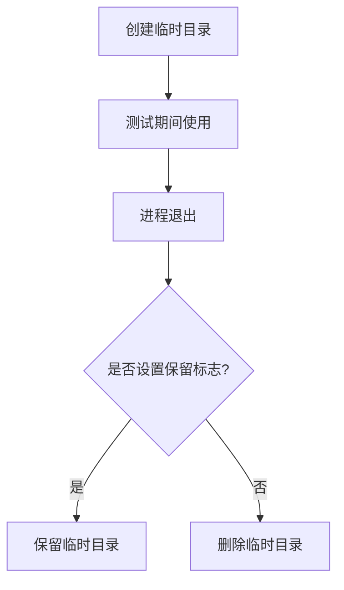
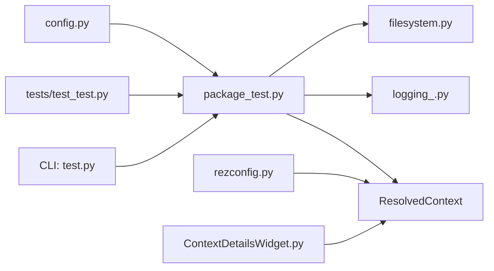
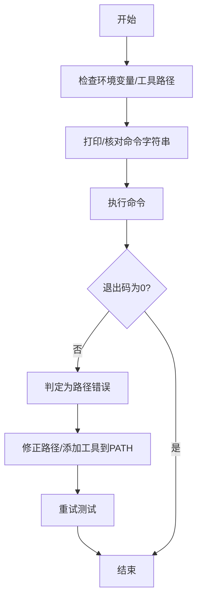

# 错误诊断与调试

<cite>
**本文引用的文件**
- [package_test.py](file://rez-3.3.0/src/rez/package_test.py)
- [test.py](file://rez-3.3.0/src/rez/cli/test.py)
- [logging_.py](file://rez-3.3.0/src/rez/utils/logging_.py)
- [filesystem.py](file://rez-3.3.0/src/rez/utils/filesystem.py)
- [test_test.py](file://rez-3.3.0/src/rez/tests/test_test.py)
- [util.py](file://rez-3.3.0/src/rez/tests/util.py)
- [hello_world/package.py](file://rez-3.3.0/example_packages/hello_world/package.py)
- [config.py](file://rez-3.3.0/src/rez/config.py)
- [rezconfig.py](file://rez-3.3.0/src/rez/rezconfig.py)
- [ContextDetailsWidget.py](file://rez-3.3.0/src/rezgui/widgets/ContextDetailsWidget.py)
</cite>

## 目录
1. [简介](#简介)
2. [项目结构](#项目结构)
3. [核心组件](#核心组件)
4. [架构总览](#架构总览)
5. [详细组件分析](#详细组件分析)
6. [依赖分析](#依赖分析)
7. [性能考虑](#性能考虑)
8. [故障排查指南](#故障排查指南)
9. [结论](#结论)
10. [附录](#附录)

## 简介
本章节面向“安装后测试失败”的场景，系统性阐述 Rez 在运行包测试时如何生成可复现、可追溯的错误报告，覆盖命令行、环境快照、执行时长与失败原因分析；并给出调试信息收集策略（保留临时测试环境、记录系统调用与依赖解析过程）、常见故障模式（路径错误、权限不足、依赖缺失）的诊断流程图与解决方法，以及如何集成外部调试工具以增强诊断能力。

## 项目结构
围绕“错误诊断与调试”，本仓库中与测试执行、日志输出、上下文打印、临时目录清理等直接相关的关键模块如下：
- 测试执行与结果汇总：PackageTestRunner、PackageTestResults
- CLI 入口：rez-cli 的 test 子命令
- 日志与耗时：utils.logging_.log_duration
- 临时目录与清理：utils.filesystem.TempDirs
- 单元测试样例：tests.test_test
- 配置开关：config.py、rezconfig.py
- GUI 上下文详情：rezgui.widgets.ContextDetailsWidget

图表来源
- [test.py](file://rez-3.3.0/src/rez/cli/test.py#L1-L121)
- [package_test.py](file://rez-3.3.0/src/rez/package_test.py#L1-L749)
- [logging_.py](file://rez-3.3.0/src/rez/utils/logging_.py#L1-L129)
- [filesystem.py](file://rez-3.3.0/src/rez/utils/filesystem.py#L1-L109)
- [test_test.py](file://rez-3.3.0/src/rez/tests/test_test.py#L1-L310)
- [config.py](file://rez-3.3.0/src/rez/config.py#L469-L492)
- [rezconfig.py](file://rez-3.3.0/src/rez/rezconfig.py#L654-L692)
- [ContextDetailsWidget.py](file://rez-3.3.0/src/rezgui/widgets/ContextDetailsWidget.py#L32-L67)

章节来源
- [test.py](file://rez-3.3.0/src/rez/cli/test.py#L1-L121)
- [package_test.py](file://rez-3.3.0/src/rez/package_test.py#L1-L749)
- [logging_.py](file://rez-3.3.0/src/rez/utils/logging_.py#L1-L129)
- [filesystem.py](file://rez-3.3.0/src/rez/utils/filesystem.py#L1-L109)
- [test_test.py](file://rez-3.3.0/src/rez/tests/test_test.py#L1-L310)
- [config.py](file://rez-3.3.0/src/rez/config.py#L469-L492)
- [rezconfig.py](file://rez-3.3.0/src/rez/rezconfig.py#L654-L692)
- [ContextDetailsWidget.py](file://rez-3.3.0/src/rezgui/widgets/ContextDetailsWidget.py#L32-L67)

## 核心组件
- PackageTestRunner：负责在受控环境中解析并执行包测试，收集每个测试的名称、状态、描述与变体信息，支持 dry-run、停止于首个失败、当前环境直跑等模式。
- PackageTestResults：聚合测试结果，提供统计与表格化输出。
- CLI test 命令：解析参数、选择测试集、驱动 PackageTestRunner 并打印最终摘要。
- 日志与耗时：通过 utils.logging_.log_duration 记录关键阶段耗时；通过 print_* 接口输出调试信息。
- 临时目录：utils.filesystem.TempDirs 在程序退出时清理临时目录，可通过环境变量保留临时目录以便排障。
- 单元测试样例：tests.test_test 展示了测试发现、通配符匹配、失败断言等行为，便于对照理解测试执行流程。
- 配置开关：config.py 与 rezconfig.py 提供大量 debug/warn 开关，用于增强诊断细节（如上下文跟踪字段、资源调试、插件调试等）。

章节来源
- [package_test.py](file://rez-3.3.0/src/rez/package_test.py#L1-L749)
- [test.py](file://rez-3.3.0/src/rez/cli/test.py#L1-L121)
- [logging_.py](file://rez-3.3.0/src/rez/utils/logging_.py#L1-L129)
- [filesystem.py](file://rez-3.3.0/src/rez/utils/filesystem.py#L1-L109)
- [test_test.py](file://rez-3.3.0/src/rez/tests/test_test.py#L1-L310)
- [config.py](file://rez-3.3.0/src/rez/config.py#L469-L492)
- [rezconfig.py](file://rez-3.3.0/src/rez/rezconfig.py#L654-L692)

## 架构总览
从 CLI 到测试执行再到结果汇总的整体流程如下：

图表来源
- [test.py](file://rez-3.3.0/src/rez/cli/test.py#L46-L121)
- [package_test.py](file://rez-3.3.0/src/rez/package_test.py#L250-L500)
- [logging_.py](file://rez-3.3.0/src/rez/utils/logging_.py#L69-L129)
- [filesystem.py](file://rez-3.3.0/src/rez/utils/filesystem.py#L32-L109)

## 详细组件分析

### 组件A：测试运行器与结果汇总（PackageTestRunner/PackageTestResults）
- 运行模式
  - 支持在当前环境直跑（--inplace），若当前环境不满足测试需求则跳过。
  - 支持 dry-run 模式，仅展示将要执行的测试而不实际运行。
  - 支持 stop-on-fail，遇到第一个失败即停止后续测试。
  - 支持 verbose 控制输出详细程度。
- 环境解析与变体选择
  - 使用 ResolvedContext 解析测试所需的包请求，缓存上下文以避免重复解析。
  - 若测试声明 on_variants=False，则仅对首选变体运行一次。
- 命令执行与结果记录
  - 支持字符串或列表形式的命令；支持在执行前绑定测试命名空间并执行 pre_test_commands。
  - 退出码非零时记录失败并写入描述；成功时记录成功。
  - 结果包含测试名、变体根目录、状态与描述，最终以表格形式汇总。
- 调试输出
  - 解析环境时打印上下文信息；命令执行前打印命令字符串；失败时打印退出码与失败原因。

图表来源
- [package_test.py](file://rez-3.3.0/src/rez/package_test.py#L50-L749)

章节来源
- [package_test.py](file://rez-3.3.0/src/rez/package_test.py#L50-L749)

### 组件B：CLI 测试入口（CLI test 命令）
- 参数解析
  - 支持列出测试、dry-run、stop-on-fail、--inplace、额外包、包搜索路径、禁用本地包等。
- 行为逻辑
  - 解析测试名（支持默认 run_on 标签与通配符）。
  - 驱动 PackageTestRunner 逐个运行测试，收集退出码并在最后打印汇总。
  - 当未找到任何测试或未指定默认标签时，输出提示并退出。

图表来源
- [test.py](file://rez-3.3.0/src/rez/cli/test.py#L46-L121)

章节来源
- [test.py](file://rez-3.3.0/src/rez/cli/test.py#L1-L121)

### 组件C：日志与耗时（utils.logging_.log_duration）
- 提供基于上下文管理器的耗时统计接口，自动计算并打印耗时。
- 提供统一的 print_* 接口（debug/info/warning/error/critical），便于在测试执行过程中输出诊断信息。

图表来源
- [logging_.py](file://rez-3.3.0/src/rez/utils/logging_.py#L69-L129)

章节来源
- [logging_.py](file://rez-3.3.0/src/rez/utils/logging_.py#L1-L129)

### 组件D：临时目录与清理（utils.filesystem.TempDirs）
- 默认在进程退出时清理临时目录，避免磁盘占用。
- 可通过环境变量保留临时目录，便于人工检查测试期间产生的中间产物。

图表来源
- [filesystem.py](file://rez-3.3.0/src/rez/utils/filesystem.py#L32-L109)

章节来源
- [filesystem.py](file://rez-3.3.0/src/rez/utils/filesystem.py#L1-L109)

### 组件E：单元测试样例（tests.test_test）
- 展示了测试发现、通配符匹配、失败断言等行为，有助于理解测试执行流程与期望输出。
- 包含多组断言，验证不同测试的预期状态（success/failed/skipped）。

章节来源
- [test_test.py](file://rez-3.3.0/src/rez/tests/test_test.py#L1-L310)

### 组件F：配置与上下文跟踪（config.py、rezconfig.py）
- config.py 提供大量 debug/warn 开关，可用于增强诊断细节（如 debug_all/debug_none、debug_context_tracking 等）。
- rezconfig.py 定义上下文跟踪字段与 AMQP 发送配置，便于将上下文构建过程中的关键指标（如 solve_time、load_time、from_cache 等）上报或打印。

章节来源
- [config.py](file://rez-3.3.0/src/rez/config.py#L469-L492)
- [rezconfig.py](file://rez-3.3.0/src/rez/rezconfig.py#L654-L692)

### 组件G：GUI 上下文详情（ContextDetailsWidget）
- GUI 中可查看上下文的 shell 代码与环境变量视图，便于在图形界面中核对解析结果与环境快照。

章节来源
- [ContextDetailsWidget.py](file://rez-3.3.0/src/rezgui/widgets/ContextDetailsWidget.py#L32-L67)

## 依赖分析
- CLI 依赖 PackageTestRunner；PackageTestRunner 依赖 ResolvedContext、上下文执行器、日志接口与临时目录管理。
- 单元测试样例依赖 PackageTestRunner 与 ResolvedContext，用于验证测试发现与断言。
- 配置与上下文跟踪影响解析阶段的行为与输出，GUI 组件用于可视化上下文详情。

图表来源
- [test.py](file://rez-3.3.0/src/rez/cli/test.py#L1-L121)
- [package_test.py](file://rez-3.3.0/src/rez/package_test.py#L1-L749)
- [logging_.py](file://rez-3.3.0/src/rez/utils/logging_.py#L1-L129)
- [filesystem.py](file://rez-3.3.0/src/rez/utils/filesystem.py#L1-L109)
- [test_test.py](file://rez-3.3.0/src/rez/tests/test_test.py#L1-L310)
- [config.py](file://rez-3.3.0/src/rez/config.py#L469-L492)
- [rezconfig.py](file://rez-3.3.0/src/rez/rezconfig.py#L654-L692)
- [ContextDetailsWidget.py](file://rez-3.3.0/src/rezgui/widgets/ContextDetailsWidget.py#L32-L67)

## 性能考虑
- 环境解析缓存：PackageTestRunner 会缓存已解析的上下文，避免重复解析同一组请求，显著降低重复测试的开销。
- 变体选择优化：当 on_variants=False 时，仅对首选变体运行一次，减少不必要的变体遍历。
- 日志级别控制：通过 config.debug_* 与 config.warn_* 控制输出量，避免在生产环境产生过多冗余日志。

[本节为通用指导，无需具体文件来源]

## 故障排查指南

### 一、安装后测试失败的错误报告生成
- 命令行与参数
  - 使用 CLI test 子命令列出测试、执行测试、停止于首个失败、在当前环境直跑等，确保输出足够详细。
- 环境快照
  - 通过 GUI 上下文详情查看 shell 代码与环境变量，或在 CLI 中打印上下文信息，确认解析到的包与环境变量。
- 执行时长
  - 使用日志耗时接口记录关键阶段耗时，便于定位慢点与异常卡顿。
- 失败原因分析
  - 查看测试结果汇总表，关注状态与描述；结合环境解析失败、命令退出码、预处理脚本执行情况等进行归因。

章节来源
- [test.py](file://rez-3.3.0/src/rez/cli/test.py#L46-L121)
- [package_test.py](file://rez-3.3.0/src/rez/package_test.py#L250-L500)
- [logging_.py](file://rez-3.3.0/src/rez/utils/logging_.py#L69-L129)
- [ContextDetailsWidget.py](file://rez-3.3.0/src/rezgui/widgets/ContextDetailsWidget.py#L32-L67)

### 二、调试信息收集策略
- 保留临时测试环境
  - 在测试失败时设置保留临时目录的环境变量，以便检查测试期间生成的日志、缓存与中间产物。
- 记录系统调用与依赖解析过程
  - 启用 debug_* 与 warn_* 配置项，增加解析阶段与资源加载阶段的诊断输出。
  - 使用上下文跟踪配置，将关键指标（solve_time、load_time、from_cache 等）输出或上报。
- 增强日志
  - 在测试执行前后使用日志耗时接口记录关键阶段耗时，便于定位瓶颈。

章节来源
- [filesystem.py](file://rez-3.3.0/src/rez/utils/filesystem.py#L32-L109)
- [config.py](file://rez-3.3.0/src/rez/config.py#L469-L492)
- [rezconfig.py](file://rez-3.3.0/src/rez/rezconfig.py#L654-L692)
- [logging_.py](file://rez-3.3.0/src/rez/utils/logging_.py#L69-L129)

### 三、常见故障模式与诊断流程

#### 1) 路径错误
- 现象
  - 命令找不到可执行文件或脚本路径拼接错误。
- 诊断步骤
  - 检查 PATH 与工具路径是否正确；在 GUI 上下文详情中核对环境变量。
  - 使用日志输出命令字符串与执行上下文，确认命令展开后的绝对路径。
- 解决方法
  - 在 package.py 中使用 {root} 等变量正确拼接路径；必要时在 pre_test_commands 中修正 PATH 或工作目录。

章节来源
- [package_test.py](file://rez-3.3.0/src/rez/package_test.py#L410-L470)
- [ContextDetailsWidget.py](file://rez-3.3.0/src/rezgui/widgets/ContextDetailsWidget.py#L32-L67)

#### 2) 权限不足
- 现象
  - 命令执行失败且提示权限问题。
- 诊断步骤
  - 检查目标文件/目录权限；确认当前用户是否具备执行权限。
  - 在临时目录保留模式下，检查测试期间生成的中间文件权限。
- 解决方法
  - 修改文件权限或切换到具备权限的用户；在 pre_test_commands 中临时提升权限或切换工作目录。

章节来源
- [filesystem.py](file://rez-3.3.0/src/rez/utils/filesystem.py#L88-L109)
- [package_test.py](file://rez-3.3.0/src/rez/package_test.py#L446-L467)

#### 3) 依赖缺失
- 现象
  - 环境解析失败或命令依赖的包不可解析。
- 诊断步骤
  - 查看环境解析失败原因；在 GUI 上下文详情中核对已解析包列表。
  - 使用上下文跟踪配置输出 solve_time、from_cache 等指标，判断是否命中缓存或解析超时。
- 解决方法
  - 修正包版本范围或添加缺失的包；调整包搜索路径；启用缓存或优化解析策略。

章节来源
- [package_test.py](file://rez-3.3.0/src/rez/package_test.py#L358-L409)
- [ContextDetailsWidget.py](file://rez-3.3.0/src/rezgui/widgets/ContextDetailsWidget.py#L32-L67)
- [rezconfig.py](file://rez-3.3.0/src/rez/rezconfig.py#L654-L692)

### 四、结合 hello_world 示例的快速定位
- hello_world 包定义了 tools、requires 与 commands，用于演示工具链与环境注入。
- 当测试失败时，可：
  - 通过 GUI 上下文详情查看 hello_world 是否被解析并注入 PATH；
  - 使用 CLI test 的 --inplace 在当前环境中直接运行，快速排除环境差异；
  - 使用日志耗时接口记录解析与执行阶段耗时，定位瓶颈。

章节来源
- [hello_world/package.py](file://rez-3.3.0/example_packages/hello_world/package.py#L1-L29)
- [test.py](file://rez-3.3.0/src/rez/cli/test.py#L46-L121)
- [ContextDetailsWidget.py](file://rez-3.3.0/src/rezgui/widgets/ContextDetailsWidget.py#L32-L67)

### 五、集成外部调试工具的建议
- 系统级调试
  - 使用 strace/ltrace（Linux）或 Process Monitor（Windows）捕获系统调用与文件/注册表访问，辅助定位路径与权限问题。
- 包管理与解析
  - 结合包缓存与上下文跟踪，将解析时间、缓存命中率等指标纳入 CI 报告，持续监控解析性能。
- 日志聚合
  - 将 CLI 输出与上下文详情导出到日志系统，配合日志检索工具进行跨节点关联分析。

[本节为通用指导，无需具体文件来源]

## 结论
通过 PackageTestRunner 的结果汇总、CLI 的参数控制、日志耗时接口、临时目录保留与上下文可视化，Rez 能够在安装后测试失败时生成完整、可追溯的错误报告。结合 debug/warn 配置与上下文跟踪，可进一步增强诊断深度。针对路径、权限、依赖缺失等常见问题，建议采用“环境快照+命令字符串+耗时定位+保留临时目录”的组合策略，并在 CI 中引入系统级调试与日志聚合，以实现快速定位与闭环修复。

[本节为总结性内容，无需具体文件来源]

## 附录
- 关键配置项参考
  - debug_* / warn_*：用于开启更详细的诊断输出。
  - context_tracking_*：用于上下文构建过程的指标采集与输出。
- 建议的最小化调试命令
  - 使用 CLI test 的 --inplace、--dry-run、--stop-on-fail 与高 verbose 输出，结合 GUI 上下文详情与临时目录保留，快速定位问题根因。

[本节为补充说明，无需具体文件来源]