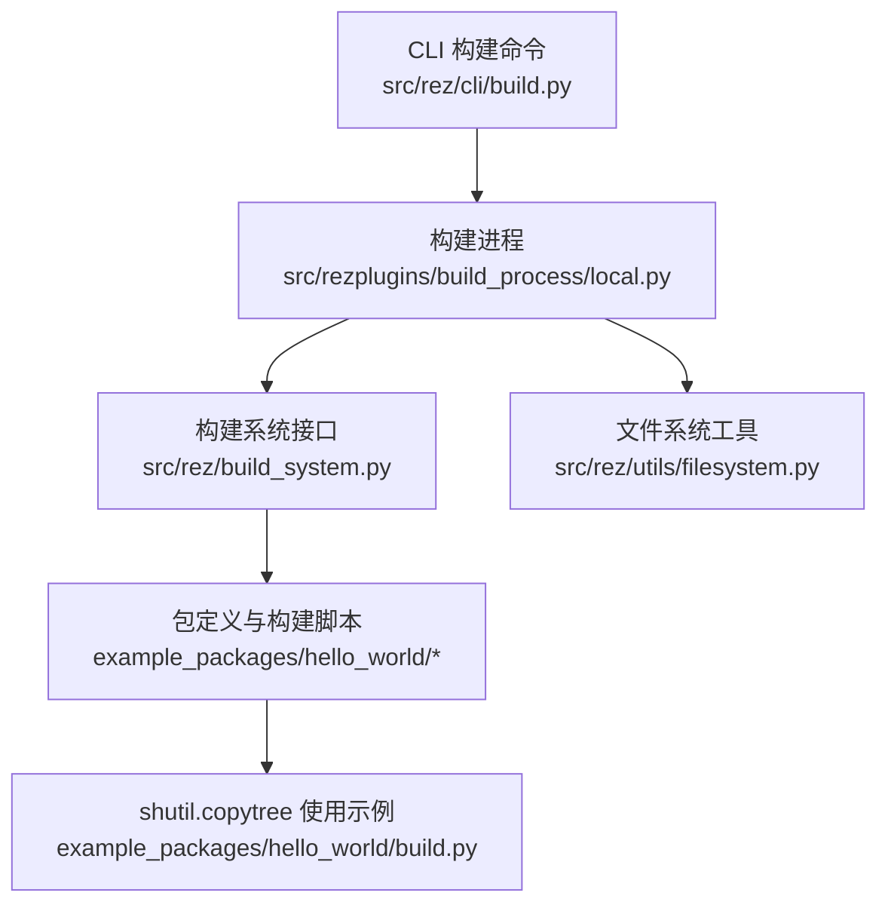
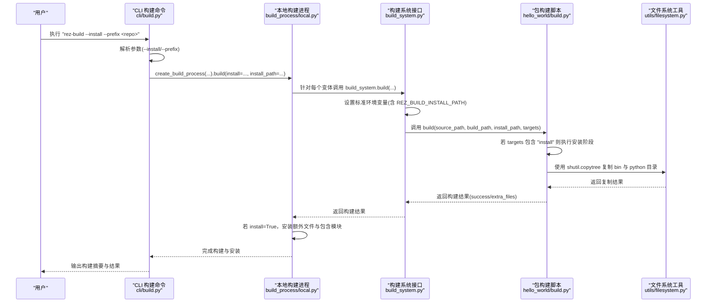
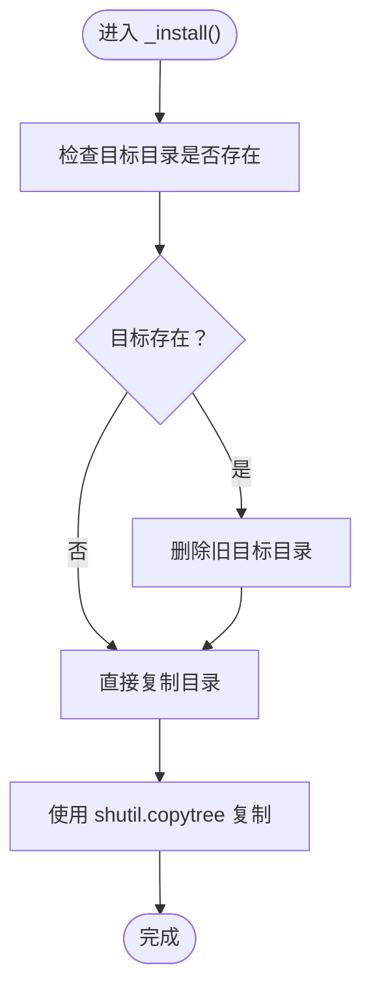
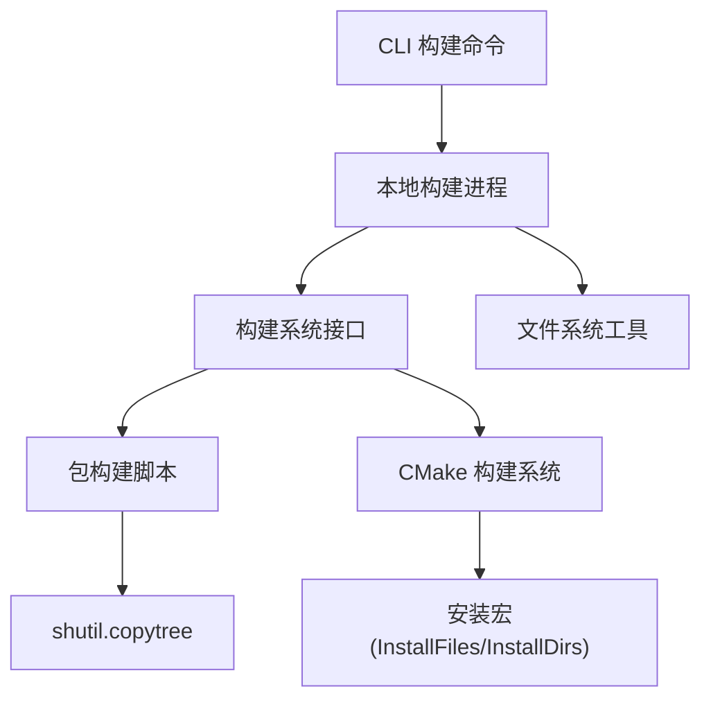

# 安装执行与部署

<cite>
**本文引用的文件列表**
- [rez-3.3.0/src/rez/cli/build.py](file://rez-3.3.0/src/rez/cli/build.py)
- [rez-3.3.0/src/rez/build_system.py](file://rez-3.3.0/src/rez/build_system.py)
- [rez-3.3.0/src/rez/build_process.py](file://rez-3.3.0/src/rez/build_process.py)
- [rez-3.3.0/src/rezplugins/build_process/local.py](file://rez-3.3.0/src/rezplugins/build_process/local.py)
- [rez-3.3.0/src/rez/utils/filesystem.py](file://rez-3.3.0/src/rez/utils/filesystem.py)
- [rez-3.3.0/example_packages/hello_world/build.py](file://rez-3.3.0/example_packages/hello_world/build.py)
- [rez-3.3.0/example_packages/hello_world/package.py](file://rez-3.3.0/example_packages/hello_world/package.py)
- [rez-3.3.0/src/rezplugins/build_system/cmake_files/InstallFiles.cmake](file://rez-3.3.0/src/rezplugins/build_system/cmake_files/InstallFiles.cmake)
- [rez-3.3.0/src/rezplugins/build_system/cmake_files/InstallDirs.cmake](file://rez-3.3.0/src/rezplugins/build_system/cmake_files/InstallDirs.cmake)
- [rez-3.3.0/src/rezplugins/build_system/cmake.py](file://rez-3.3.0/src/rezplugins/build_system/cmake.py)
- [rez-3.3.0/README.md](file://rez-3.3.0/README.md)
</cite>

## 目录
1. [简介](#简介)
2. [项目结构](#项目结构)
3. [核心组件](#核心组件)
4. [架构总览](#架构总览)
5. [详细组件分析](#详细组件分析)
6. [依赖关系分析](#依赖关系分析)
7. [性能考量](#性能考量)
8. [故障排查指南](#故障排查指南)
9. [结论](#结论)

## 简介
本文件围绕 Rez 的“安装执行与部署”主题，系统梳理从构建目录到安装路径的文件复制策略、目录覆盖处理与权限保留逻辑；结合 hello_world 示例中 shutil.copytree 的使用，解释如何将 bin 与 python 目录正确部署到 REZ_BUILD_INSTALL_PATH；阐明 targets 参数对安装流程的控制原理及命令行触发方式；并总结安装路径冲突、文件锁定与跨平台路径分隔符处理的最佳实践，以及安装失败、目录不可写与文件占用等常见问题的解决方案。

## 项目结构
- 命令入口：CLI 构建命令负责解析参数、创建构建系统与构建进程，并调用构建流程。
- 构建系统：为不同包定义提供统一的 build() 接口，注入标准环境变量（含 REZ_BUILD_INSTALL_PATH）。
- 构建进程：本地构建进程负责变体迭代、上下文创建、调用构建系统、安装与测试。
- 文件系统工具：提供安全复制、替换、重命名、路径规范化与跨平台路径转换等能力。
- 包示例：hello_world 展示了自定义构建脚本如何使用 shutil.copytree 实现安装阶段。

图表来源
- [rez-3.3.0/src/rez/cli/build.py](file://rez-3.3.0/src/rez/cli/build.py#L1-L174)
- [rez-3.3.0/src/rezplugins/build_process/local.py](file://rez-3.3.0/src/rezplugins/build_process/local.py#L1-L499)
- [rez-3.3.0/src/rez/build_system.py](file://rez-3.3.0/src/rez/build_system.py#L1-L312)
- [rez-3.3.0/src/rez/utils/filesystem.py](file://rez-3.3.0/src/rez/utils/filesystem.py#L1-L732)
- [rez-3.3.0/example_packages/hello_world/build.py](file://rez-3.3.0/example_packages/hello_world/build.py#L1-L59)

章节来源
- [rez-3.3.0/src/rez/cli/build.py](file://rez-3.3.0/src/rez/cli/build.py#L1-L174)
- [rez-3.3.0/src/rezplugins/build_process/local.py](file://rez-3.3.0/src/rezplugins/build_process/local.py#L1-L499)
- [rez-3.3.0/src/rez/build_system.py](file://rez-3.3.0/src/rez/build_system.py#L1-L312)
- [rez-3.3.0/src/rez/utils/filesystem.py](file://rez-3.3.0/src/rez/utils/filesystem.py#L1-L732)
- [rez-3.3.0/example_packages/hello_world/build.py](file://rez-3.3.0/example_packages/hello_world/build.py#L1-L59)

## 核心组件
- CLI 构建命令：解析 --install、--prefix 等参数，创建构建系统与构建进程并执行 build(install=...)。
- 构建系统：设置标准环境变量（含 REZ_BUILD_INSTALL_PATH），在 build() 中传入 install_path 与 install 标志。
- 本地构建进程：为每个变体创建构建与安装路径，必要时清理旧构建；调用构建系统后，若 install=True，则安装额外文件与包含模块。
- 文件系统工具：提供安全复制/替换、强制删除、路径规范化与跨平台路径转换等能力，保障安装稳定性。
- 包示例（hello_world）：自定义 build.py 使用 shutil.copytree 将 bin 与 python 目录复制到安装路径；targets 控制是否执行安装阶段。

章节来源
- [rez-3.3.0/src/rez/cli/build.py](file://rez-3.3.0/src/rez/cli/build.py#L1-L174)
- [rez-3.3.0/src/rez/build_system.py](file://rez-3.3.0/src/rez/build_system.py#L1-L312)
- [rez-3.3.0/src/rezplugins/build_process/local.py](file://rez-3.3.0/src/rezplugins/build_process/local.py#L1-L499)
- [rez-3.3.0/src/rez/utils/filesystem.py](file://rez-3.3.0/src/rez/utils/filesystem.py#L1-L732)
- [rez-3.3.0/example_packages/hello_world/build.py](file://rez-3.3.0/example_packages/hello_world/build.py#L1-L59)

## 架构总览
下图展示从命令行到安装完成的关键调用链路与数据流。

图表来源
- [rez-3.3.0/src/rez/cli/build.py](file://rez-3.3.0/src/rez/cli/build.py#L1-L174)
- [rez-3.3.0/src/rezplugins/build_process/local.py](file://rez-3.3.0/src/rezplugins/build_process/local.py#L1-L499)
- [rez-3.3.0/src/rez/build_system.py](file://rez-3.3.0/src/rez/build_system.py#L1-L312)
- [rez-3.3.0/example_packages/hello_world/build.py](file://rez-3.3.0/example_packages/hello_world/build.py#L1-L59)
- [rez-3.3.0/src/rez/utils/filesystem.py](file://rez-3.3.0/src/rez/utils/filesystem.py#L1-L732)

## 详细组件分析

### _build() 函数中的 _install() 阶段机制
- 目标：将构建产物从构建目录复制到安装路径，确保 bin 与 python 目录被正确部署到 REZ_BUILD_INSTALL_PATH。
- 关键点：
  - 目录覆盖：若目标已存在，先删除旧目录再复制新内容，避免残留导致版本不一致。
  - 权限保留：示例中对二进制目录设置了可执行权限；对于 Python 源码通常保持默认权限。
  - 路径来源：构建脚本通过环境变量获取 source_path、build_path、install_path；其中 install_path 对应 REZ_BUILD_INSTALL_PATH。
  - targets 控制：仅当 targets 中包含 "install" 时才执行安装阶段。

图表来源
- [rez-3.3.0/example_packages/hello_world/build.py](file://rez-3.3.0/example_packages/hello_world/build.py#L1-L59)

章节来源
- [rez-3.3.0/example_packages/hello_world/build.py](file://rez-3.3.0/example_packages/hello_world/build.py#L1-L59)

### 从构建目录到安装路径的文件复制策略
- 策略要点：
  - 先删除旧目标：保证安装干净、无残留。
  - 使用 shutil.copytree：递归复制目录树，保留文件属性。
  - 额外文件安装：本地构建进程在 install=True 时会安装额外文件（如构建上下文脚本）。
  - 包含模块安装：将装饰器 include 的源文件安装到特定子路径，便于运行时加载。

章节来源
- [rez-3.3.0/src/rezplugins/build_process/local.py](file://rez-3.3.0/src/rezplugins/build_process/local.py#L1-L499)
- [rez-3.3.0/src/rez/utils/filesystem.py](file://rez-3.3.0/src/rez/utils/filesystem.py#L1-L732)

### 目录覆盖处理与权限保留逻辑
- 目录覆盖：
  - 删除旧目标：在安装前删除目标目录，避免旧文件干扰。
  - 强制删除：文件系统工具提供 forceful_rmtree，必要时提升权限以删除受保护目录。
- 权限保留：
  - 二进制目录示例中显式设置可执行权限；Python 源码通常保持默认权限。
  - 跨平台路径分隔符：工具提供 to_nativepath、to_ntpath、to_posixpath 与 canonical_path，确保路径在不同平台下一致。

章节来源
- [rez-3.3.0/example_packages/hello_world/build.py](file://rez-3.3.0/example_packages/hello_world/build.py#L1-L59)
- [rez-3.3.0/src/rez/utils/filesystem.py](file://rez-3.3.0/src/rez/utils/filesystem.py#L1-L732)

### targets 参数控制安装流程的设计原理
- 设计思路：
  - 自定义构建脚本通过 targets 参数判断是否执行安装阶段，避免不必要的复制。
  - 当命令行传入 --install 时，CLI 会将 install 标志传递给构建系统；构建系统再将 install_path 与 install 标志传入包构建脚本。
  - 包构建脚本内部根据 targets 是否包含 "install" 决定是否调用 _install()。

章节来源
- [rez-3.3.0/src/rez/cli/build.py](file://rez-3.3.0/src/rez/cli/build.py#L1-L174)
- [rez-3.3.0/src/rez/build_system.py](file://rez-3.3.0/src/rez/build_system.py#L1-L312)
- [rez-3.3.0/example_packages/hello_world/build.py](file://rez-3.3.0/example_packages/hello_world/build.py#L1-L59)

### 命令行触发安装阶段
- 触发方式：
  - 使用 --install 开启安装；--prefix 指定安装仓库路径；--variants 可选择特定变体。
  - CLI 在 command() 中创建构建系统与构建进程，并调用 builder.build(install=opts.install, install_path=opts.prefix)。
- 示例：
  - README 提供了使用 rez-build --install 的示例，成功后可通过 rez-env hello_world 运行工具。

章节来源
- [rez-3.3.0/src/rez/cli/build.py](file://rez-3.3.0/src/rez/cli/build.py#L1-L174)
- [rez-3.3.0/README.md](file://rez-3.3.0/README.md#L140-L181)

### hello_world 示例中 shutil.copytree 的使用
- 步骤：
  - _build()：若目标目录不存在则复制源目录到构建路径下的对应位置。
  - _install()：遍历 ("bin","python")，将构建产物复制到 REZ_BUILD_INSTALL_PATH 下对应子目录。
  - 权限：对二进制目录设置可执行权限；Python 源码保持默认权限。
- 环境变量：
  - 包构建脚本通过环境变量读取 REZ_BUILD_SOURCE_PATH、REZ_BUILD_PATH、REZ_BUILD_INSTALL_PATH。

章节来源
- [rez-3.3.0/example_packages/hello_world/build.py](file://rez-3.3.0/example_packages/hello_world/build.py#L1-L59)
- [rez-3.3.0/example_packages/hello_world/package.py](file://rez-3.3.0/example_packages/hello_world/package.py#L1-L29)

### CMake 构建系统的安装行为（补充）
- CMake 构建系统在构建时会设置 CMAKE_INSTALL_PREFIX 为 install_path，并通过 Rez 的安装宏（InstallFiles/InstallDirs）进行文件与目录安装。
- 宏支持权限设置与符号链接策略，配合 REZ_BUILD_TYPE 决定安装方式（本地或中央仓库）。

章节来源
- [rez-3.3.0/src/rezplugins/build_system/cmake.py](file://rez-3.3.0/src/rezplugins/build_system/cmake.py#L106-L142)
- [rez-3.3.0/src/rezplugins/build_system/cmake_files/InstallFiles.cmake](file://rez-3.3.0/src/rezplugins/build_system/cmake_files/InstallFiles.cmake#L74-L149)
- [rez-3.3.0/src/rezplugins/build_system/cmake_files/InstallDirs.cmake](file://rez-3.3.0/src/rezplugins/build_system/cmake_files/InstallDirs.cmake#L42-L75)

## 依赖关系分析
- 组件耦合：
  - CLI 依赖构建进程与构建系统；构建进程依赖包仓库与文件系统工具；包构建脚本依赖标准库 shutil 与环境变量。
- 关键依赖链：
  - CLI -> 构建进程 -> 构建系统 -> 包构建脚本 -> shutil.copytree -> 文件系统工具。
- 外部集成点：
  - CMake 构建系统通过安装宏与 Rez 变量协作，实现统一安装路径与权限控制。

图表来源
- [rez-3.3.0/src/rez/cli/build.py](file://rez-3.3.0/src/rez/cli/build.py#L1-L174)
- [rez-3.3.0/src/rezplugins/build_process/local.py](file://rez-3.3.0/src/rezplugins/build_process/local.py#L1-L499)
- [rez-3.3.0/src/rez/build_system.py](file://rez-3.3.0/src/rez/build_system.py#L1-L312)
- [rez-3.3.0/src/rezplugins/build_system/cmake.py](file://rez-3.3.0/src/rezplugins/build_system/cmake.py#L106-L142)
- [rez-3.3.0/src/rezplugins/build_system/cmake_files/InstallFiles.cmake](file://rez-3.3.0/src/rezplugins/build_system/cmake_files/InstallFiles.cmake#L74-L149)
- [rez-3.3.0/src/rezplugins/build_system/cmake_files/InstallDirs.cmake](file://rez-3.3.0/src/rezplugins/build_system/cmake_files/InstallDirs.cmake#L42-L75)

## 性能考量
- 复制策略：
  - 使用 shutil.copytree 递归复制，适合小到中等规模目录；大规模复制建议考虑增量与硬链接策略（工具层提供硬链接支持）。
- 权限与路径：
  - 跨平台路径转换与大小写敏感处理可减少重复工作；在 Windows 上长路径与权限问题需特别注意。
- 并发与锁：
  - 包仓库层面有文件锁配置，避免多进程同时写入同一包变体导致竞争条件。

[本节为通用指导，无需具体文件引用]

## 故障排查指南
- 安装路径冲突
  - 现象：目标目录已存在且无法删除。
  - 处理：使用 forceful_rmtree 清理；确认目录权限与只读标志；必要时临时提升权限。
  - 参考：[文件系统工具](file://rez-3.3.0/src/rez/utils/filesystem.py#L1-L732)
- 目录不可写
  - 现象：复制/删除时报权限错误。
  - 处理：启用 make_path_writable 临时提升权限；检查父目录权限；在 Windows 上考虑 robocopy 回退。
  - 参考：[本地构建进程](file://rez-3.3.0/src/rezplugins/build_process/local.py#L1-L499)，[文件系统工具](file://rez-3.3.0/src/rez/utils/filesystem.py#L1-L732)
- 文件占用
  - 现象：目标文件被占用导致替换失败。
  - 处理：采用替换策略（临时名 + 原子替换）；在 Windows 上使用 rename 的回退逻辑。
  - 参考：[文件系统工具](file://rez-3.3.0/src/rez/utils/filesystem.py#L1-L732)
- 跨平台路径分隔符
  - 现象：路径在不同平台下不一致导致查找失败。
  - 处理：使用 to_nativepath、to_ntpath、to_posixpath 与 canonical_path 规范化路径。
  - 参考：[文件系统工具](file://rez-3.3.0/src/rez/utils/filesystem.py#L1-L732)
- 安装失败
  - 现象：构建系统返回失败或测试失败。
  - 处理：查看构建日志与上下文脚本；按需清理并重试；检查依赖解析与环境变量。
  - 参考：[本地构建进程](file://rez-3.3.0/src/rezplugins/build_process/local.py#L1-L499)，[CLI 构建命令](file://rez-3.3.0/src/rez/cli/build.py#L1-L174)

章节来源
- [rez-3.3.0/src/rezplugins/build_process/local.py](file://rez-3.3.0/src/rezplugins/build_process/local.py#L1-L499)
- [rez-3.3.0/src/rez/utils/filesystem.py](file://rez-3.3.0/src/rez/utils/filesystem.py#L1-L732)
- [rez-3.3.0/src/rez/cli/build.py](file://rez-3.3.0/src/rez/cli/build.py#L1-L174)

## 结论
- 安装执行的核心在于：CLI 传参 -> 构建系统注入环境变量 -> 包构建脚本按 targets 控制安装 -> 文件系统工具保障复制与权限。
- hello_world 示例清晰展示了 shutil.copytree 的使用与权限设置；targets 参数提供了灵活的安装开关。
- 面向生产部署，建议结合文件系统工具的安全复制策略、跨平台路径处理与仓库锁机制，确保安装稳定可靠。