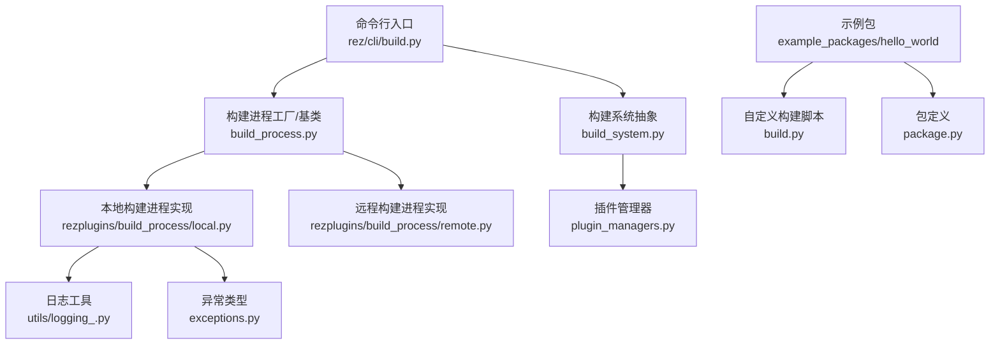
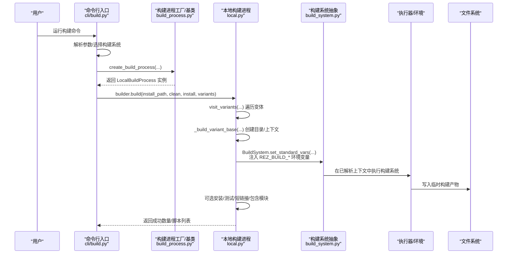
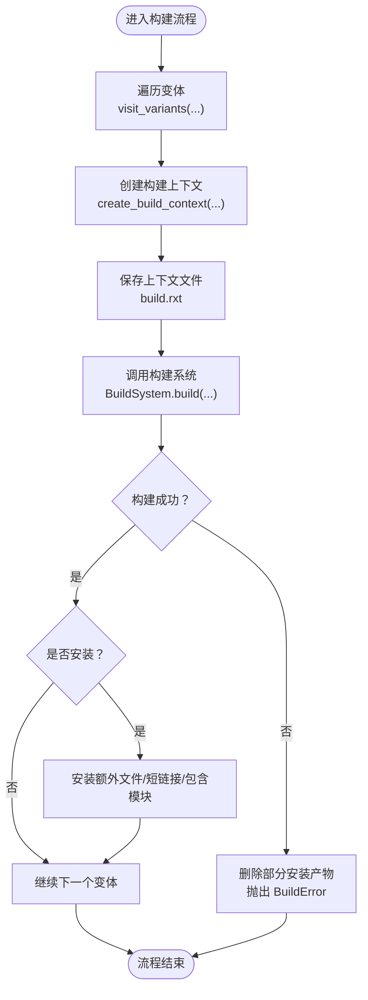
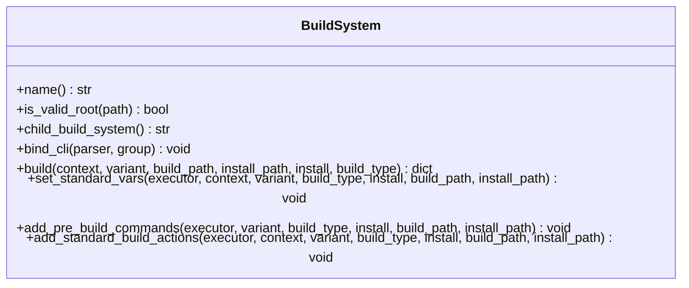
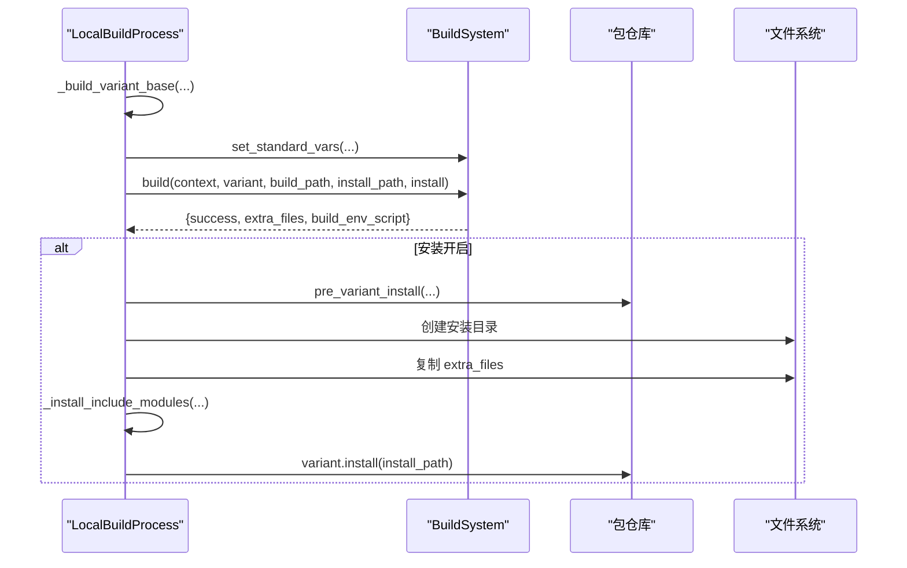
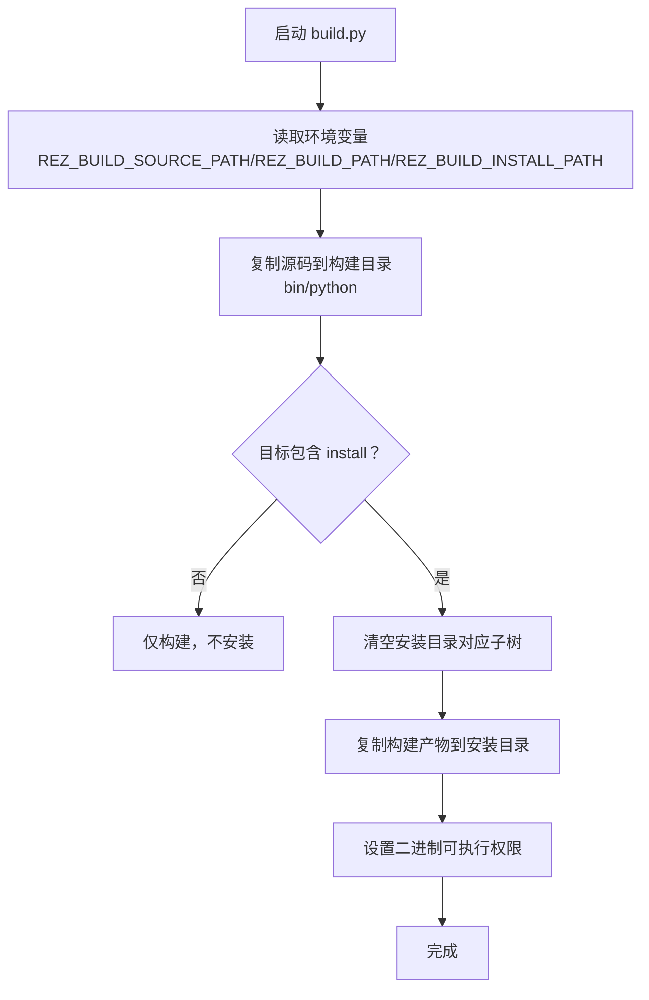
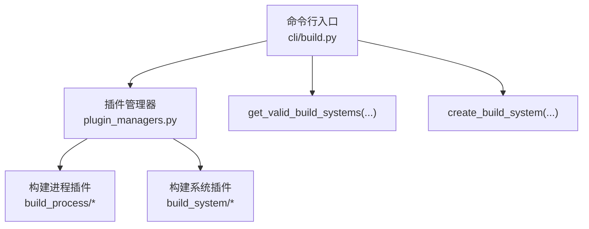
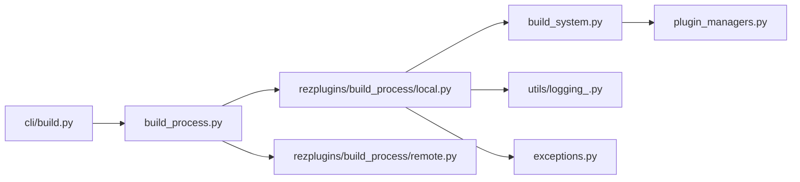

# 构建流程

<cite>
**本文引用的文件**
- [build_process.py](file://rez-3.3.0/src/rez/build_process.py)
- [build_system.py](file://rez-3.3.0/src/rez/build_system.py)
- [local.py](file://rez-3.3.0/src/rezplugins/build_process/local.py)
- [remote.py](file://rez-3.3.0/src/rezplugins/build_process/remote.py)
- [build.py](file://rez-3.3.0/example_packages/hello_world/build.py)
- [package.py](file://rez-3.3.0/example_packages/hello_world/package.py)
- [build.py（CLI）](file://rez-3.3.0/src/rez/cli/build.py)
- [plugin_managers.py](file://rez-3.3.0/src/rez/plugin_managers.py)
- [logging_.py](file://rez-3.3.0/src/rez/utils/logging_.py)
- [exceptions.py](file://rez-3.3.0/src/rez/exceptions.py)
</cite>

## 目录
1. [简介](#简介)
2. [项目结构](#项目结构)
3. [核心组件](#核心组件)
4. [架构总览](#架构总览)
5. [详细组件分析](#详细组件分析)
6. [依赖关系分析](#依赖关系分析)
7. [性能考量](#性能考量)
8. [故障排查指南](#故障排查指南)
9. [结论](#结论)
10. [附录：最佳实践与常见问题](#附录最佳实践与常见问题)

## 简介
本文件围绕 Rez 的构建流程展开，重点说明 BuildProcess 类如何协调包的构建生命周期，包括环境解析、构建目录管理、构建系统调用；结合 hello_world 示例中的 build.py，解释构建脚本如何利用 REZ_BUILD_SOURCE_PATH、REZ_BUILD_PATH 和 REZ_BUILD_INSTALL_PATH 环境变量进行源码复制、权限设置与安装；同时阐述错误处理机制、日志输出策略与调试上下文保存功能，并给出本地开发环境安全执行构建的最佳实践及常见问题与解决方案。

## 项目结构
Rez 的构建子系统由“命令入口”“构建系统抽象”“构建进程实现”“插件管理器”“异常与日志工具”等模块组成。hello_world 示例展示了自定义构建脚本如何通过 Rez 注入的标准环境变量完成复制、权限设置与安装。

图表来源
- [build.py（CLI）](file://rez-3.3.0/src/rez/cli/build.py#L124-L174)
- [build_system.py](file://rez-3.3.0/src/rez/build_system.py#L103-L207)
- [build_process.py](file://rez-3.3.0/src/rez/build_process.py#L66-L177)
- [local.py](file://rez-3.3.0/src/rezplugins/build_process/local.py#L30-L120)
- [remote.py](file://rez-3.3.0/src/rezplugins/build_process/remote.py#L11-L29)
- [plugin_managers.py](file://rez-3.3.0/src/rez/plugin_managers.py#L100-L170)
- [logging_.py](file://rez-3.3.0/src/rez/utils/logging_.py#L1-L129)
- [exceptions.py](file://rez-3.3.0/src/rez/exceptions.py#L140-L170)
- [build.py](file://rez-3.3.0/example_packages/hello_world/build.py#L10-L59)
- [package.py](file://rez-3.3.0/example_packages/hello_world/package.py#L1-L29)

章节来源
- [build.py（CLI）](file://rez-3.3.0/src/rez/cli/build.py#L1-L174)
- [build_system.py](file://rez-3.3.0/src/rez/build_system.py#L1-L312)
- [build_process.py](file://rez-3.3.0/src/rez/build_process.py#L1-L450)
- [local.py](file://rez-3.3.0/src/rezplugins/build_process/local.py#L1-L499)
- [remote.py](file://rez-3.3.0/src/rezplugins/build_process/remote.py#L1-L29)
- [plugin_managers.py](file://rez-3.3.0/src/rez/plugin_managers.py#L1-L200)
- [logging_.py](file://rez-3.3.0/src/rez/utils/logging_.py#L1-L129)
- [exceptions.py](file://rez-3.3.0/src/rez/exceptions.py#L1-L200)
- [build.py](file://rez-3.3.0/example_packages/hello_world/build.py#L1-L59)
- [package.py](file://rez-3.3.0/example_packages/hello_world/package.py#L1-L29)

## 核心组件
- 构建进程抽象与工厂
  - BuildProcess 抽象类定义了 build/release/get_changelog 等接口，BuildProcessHelper 提供变体遍历、构建上下文创建、发布前检查、钩子运行、变更日志生成等通用能力。
  - 工厂函数 create_build_process 基于插件类型创建具体构建进程实例。
- 构建系统抽象
  - BuildSystem 定义了构建系统接口与标准环境变量注入（如 REZ_BUILD_*），以及预构建命令执行、标准构建动作封装等。
  - get_valid_build_systems 与 create_build_system 负责检测与实例化合适的构建系统。
- 本地构建进程
  - LocalBuildProcess 实现了变体顺序构建、目录清理与创建、构建上下文保存、构建系统调用、安装与测试、短链接创建、包含模块安装等。
- 插件管理器
  - plugin_managers 负责从命名空间与入口点加载构建进程与构建系统插件。
- 日志与异常
  - logging_ 提供统一的日志打印接口；exceptions 定义了 BuildContextResolveError、BuildError、ReleaseError 等关键异常类型。

章节来源
- [build_process.py](file://rez-3.3.0/src/rez/build_process.py#L66-L177)
- [build_system.py](file://rez-3.3.0/src/rez/build_system.py#L103-L207)
- [local.py](file://rez-3.3.0/src/rezplugins/build_process/local.py#L30-L120)
- [plugin_managers.py](file://rez-3.3.0/src/rez/plugin_managers.py#L100-L170)
- [logging_.py](file://rez-3.3.0/src/rez/utils/logging_.py#L1-L129)
- [exceptions.py](file://rez-3.3.0/src/rez/exceptions.py#L140-L170)

## 架构总览
下图展示从命令行到构建系统再到本地构建进程的整体调用链，以及 hello_world 示例中自定义构建脚本与 Rez 环境变量的交互。

图表来源
- [build.py（CLI）](file://rez-3.3.0/src/rez/cli/build.py#L124-L174)
- [build_process.py](file://rez-3.3.0/src/rez/build_process.py#L129-L177)
- [local.py](file://rez-3.3.0/src/rezplugins/build_process/local.py#L48-L120)
- [build_system.py](file://rez-3.3.0/src/rez/build_system.py#L208-L259)

## 详细组件分析

### BuildProcess 与 BuildProcessHelper：构建生命周期协调者
- 生命周期职责
  - 变体遍历：visit_variants 支持按索引选择变体，校验索引合法性。
  - 构建上下文：create_build_context 基于变体需求解析环境，保存构建上下文为 build.rxt 文件，便于调试。
  - 发布前检查：pre_release 检查发布路径、仓库状态、标签存在性、版本顺序与 UUID 一致性。
  - 钩子与变更日志：run_hooks 执行发布钩子；get_changelog/post_release 获取与写入标签。
  - 日志与打印：_print/_print_header 控制输出级别与格式。
- 错误处理
  - 构建上下文解析失败抛出 BuildContextResolveError；发布阶段遇到 VCS/钩子/仓库错误可选择跳过或中断。
- 目录与安装路径
  - get_package_install_path 计算包级安装路径；构建进程负责变体子路径与短链接创建。

图表来源
- [build_process.py](file://rez-3.3.0/src/rez/build_process.py#L180-L276)
- [local.py](file://rez-3.3.0/src/rezplugins/build_process/local.py#L133-L285)

章节来源
- [build_process.py](file://rez-3.3.0/src/rez/build_process.py#L179-L450)
- [local.py](file://rez-3.3.0/src/rezplugins/build_process/local.py#L133-L285)

### BuildSystem：构建系统抽象与环境变量注入
- 关键能力
  - set_standard_vars：注入 REZ_BUILD_SOURCE_PATH、REZ_BUILD_PATH、REZ_BUILD_INSTALL_PATH、REZ_BUILD_REQUIRES 等标准环境变量。
  - add_pre_build_commands：执行包定义中的 pre_build_commands。
  - add_standard_build_actions：统一设置标准变量与预构建命令。
- 目录与路径
  - normalize_path 保证路径一致化，避免跨平台差异。
- 子构建系统
  - child_build_system 支持 cmake 等间接构建系统（先生成脚本再由子系统执行）。

图表来源
- [build_system.py](file://rez-3.3.0/src/rez/build_system.py#L103-L207)
- [build_system.py](file://rez-3.3.0/src/rez/build_system.py#L208-L312)

章节来源
- [build_system.py](file://rez-3.3.0/src/rez/build_system.py#L1-L312)

### LocalBuildProcess：本地构建与安装
- 目录管理
  - 清理/创建构建目录；根据变体索引计算变体子路径；必要时创建短链接。
- 构建上下文
  - 重新评估变体以启用构建期变量；保存 build.rxt 用于调试。
- 构建系统调用
  - 调用 BuildSystem.build 并根据结果决定安装与额外文件复制。
- 测试与安装
  - 可在安装前运行测试；失败则回滚安装产物并取消安装。
- 包含模块安装
  - 将 @include 装饰的源文件安装到安装库中，便于后续调试。

图表来源
- [local.py](file://rez-3.3.0/src/rezplugins/build_process/local.py#L133-L285)
- [build_system.py](file://rez-3.3.0/src/rez/build_system.py#L208-L259)

章节来源
- [local.py](file://rez-3.3.0/src/rezplugins/build_process/local.py#L1-L499)

### hello_world 示例：自定义构建脚本与环境变量
- 包定义
  - package.py 中通过 build_command 指定使用自定义脚本，并传入 install 参数控制安装。
- 自定义脚本
  - build.py 接收 source_path、build_path、install_path、targets 四个参数；
  - 使用 REZ_BUILD_SOURCE_PATH、REZ_BUILD_PATH、REZ_BUILD_INSTALL_PATH 三个环境变量分别指向源码根、构建目录、安装目录；
  - 先复制 bin 与 python 目录到构建目录；对二进制目录设置可执行权限；当 targets 包含 install 时，将构建产物复制到安装目录。

图表来源
- [build.py](file://rez-3.3.0/example_packages/hello_world/build.py#L10-L59)
- [package.py](file://rez-3.3.0/example_packages/hello_world/package.py#L24-L29)
- [build_system.py](file://rez-3.3.0/src/rez/build_system.py#L208-L259)

章节来源
- [build.py](file://rez-3.3.0/example_packages/hello_world/build.py#L1-L59)
- [package.py](file://rez-3.3.0/example_packages/hello_world/package.py#L1-L29)
- [build_system.py](file://rez-3.3.0/src/rez/build_system.py#L208-L259)

### 插件管理与构建系统选择
- 插件发现
  - plugin_managers 通过命名空间与入口点加载构建进程与构建系统插件。
- 构建系统检测
  - get_valid_build_systems 优先依据包定义字段确定构建系统，否则扫描工作目录匹配可用构建系统。
  - create_build_system 实例化唯一可用的构建系统。

图表来源
- [plugin_managers.py](file://rez-3.3.0/src/rez/plugin_managers.py#L100-L170)
- [build.py（CLI）](file://rez-3.3.0/src/rez/cli/build.py#L29-L78)
- [build_system.py](file://rez-3.3.0/src/rez/build_system.py#L19-L68)

章节来源
- [plugin_managers.py](file://rez-3.3.0/src/rez/plugin_managers.py#L1-L200)
- [build.py（CLI）](file://rez-3.3.0/src/rez/cli/build.py#L1-L174)
- [build_system.py](file://rez-3.3.0/src/rez/build_system.py#L1-L102)

## 依赖关系分析
- 组件耦合
  - LocalBuildProcess 依赖 BuildSystem、ResolvedContext、包仓库、测试框架与文件系统工具。
  - BuildProcessHelper 依赖 ResolvedContext、包仓库、VCS、发布钩子与配置。
  - CLI 依赖构建系统与构建进程工厂，负责参数解析与错误处理。
- 外部依赖
  - 插件系统通过命名空间与入口点动态加载，支持扩展新的构建系统与构建进程。
- 循环依赖
  - 代码结构采用清晰的单向依赖：CLI -> 构建系统/进程 -> 插件实现，未见循环依赖迹象。

图表来源
- [build.py（CLI）](file://rez-3.3.0/src/rez/cli/build.py#L124-L174)
- [build_process.py](file://rez-3.3.0/src/rez/build_process.py#L66-L177)
- [local.py](file://rez-3.3.0/src/rezplugins/build_process/local.py#L30-L120)
- [remote.py](file://rez-3.3.0/src/rezplugins/build_process/remote.py#L11-L29)
- [build_system.py](file://rez-3.3.0/src/rez/build_system.py#L103-L207)
- [plugin_managers.py](file://rez-3.3.0/src/rez/plugin_managers.py#L100-L170)
- [logging_.py](file://rez-3.3.0/src/rez/utils/logging_.py#L1-L129)
- [exceptions.py](file://rez-3.3.0/src/rez/exceptions.py#L140-L170)

章节来源
- [build.py（CLI）](file://rez-3.3.0/src/rez/cli/build.py#L1-L174)
- [build_process.py](file://rez-3.3.0/src/rez/build_process.py#L1-L177)
- [local.py](file://rez-3.3.0/src/rezplugins/build_process/local.py#L1-L120)
- [remote.py](file://rez-3.3.0/src/rezplugins/build_process/remote.py#L1-L29)
- [build_system.py](file://rez-3.3.0/src/rez/build_system.py#L1-L207)
- [plugin_managers.py](file://rez-3.3.0/src/rez/plugin_managers.py#L1-L170)
- [logging_.py](file://rez-3.3.0/src/rez/utils/logging_.py#L1-L129)
- [exceptions.py](file://rez-3.3.0/src/rez/exceptions.py#L1-L170)

## 性能考量
- 变体顺序构建：LocalBuildProcess 逐变体构建，避免并发开销，适合本地开发与小规模包。
- 目录清理与创建：clean 选项会删除旧构建目录，确保干净构建但增加 IO 开销。
- 短链接与包含模块：短链接减少长路径长度；包含模块一次性安装，避免重复拷贝。
- 日志与图形：CLI 在上下文解析失败时可生成冲突图，辅助定位依赖问题。

[本节为通用建议，无需特定文件来源]

## 故障排查指南
- 构建上下文解析失败
  - 现象：BuildContextResolveError，包含失败描述。
  - 处理：使用 --fail-graph 查看冲突图；检查 requires 与版本约束；确认包仓库可达。
- 发布阶段错误
  - 现象：ReleaseError/ReleaseVCSError；标签已存在、新版本已发布、UUID 不匹配。
  - 处理：修正版本/标签；确保同一包 UUID 一致；忽略现有标签需谨慎使用。
- 安装失败与回滚
  - 现象：安装后测试失败导致回滚；包仓库取消安装。
  - 处理：查看 build.rxt 与安装目录；修复测试或构建脚本。
- 日志查看
  - 使用日志工具查看日志文件，按时间排序输出，便于定位问题。

章节来源
- [exceptions.py](file://rez-3.3.0/src/rez/exceptions.py#L140-L170)
- [build.py（CLI）](file://rez-3.3.0/src/rez/cli/build.py#L124-L174)
- [local.py](file://rez-3.3.0/src/rezplugins/build_process/local.py#L335-L418)
- [logging_.py](file://rez-3.3.0/src/rez/utils/logging_.py#L79-L129)

## 结论
Rez 的构建流程通过“命令行入口 -> 构建系统 -> 构建进程”的分层设计，实现了可插拔、可扩展且可调试的包构建体系。BuildProcessHelper 提供了环境解析、上下文保存、发布检查与钩子运行等通用能力；LocalBuildProcess 则将这些能力落地到本地构建与安装流程。hello_world 示例展示了如何通过标准环境变量驱动自定义构建脚本，实现源码复制、权限设置与安装。配合完善的异常与日志机制，开发者可以在本地安全地执行构建并快速定位问题。

[本节为总结，无需特定文件来源]

## 附录：最佳实践与常见问题

### 最佳实践（本地开发）
- 明确构建系统选择：在包定义中显式指定 build_system 或 build_command，避免歧义。
- 使用 clean 选项进行干净构建，防止历史产物污染。
- 在安装前运行测试，确保安装产物质量。
- 保存并复用 build.rxt，便于后续调试与重现问题。
- 合理设置权限：对二进制文件设置可执行权限，避免运行时权限不足。

### 常见问题与解决方案
- 路径冲突
  - 症状：安装目录与已有内容冲突。
  - 解决：先清理安装目录或更换安装路径；使用短链接避免长路径问题。
- 权限不足
  - 症状：无法写入安装目录或修改二进制权限。
  - 解决：提升权限或切换到可写目录；在配置中允许临时可写。
- 依赖解析失败
  - 症状：BuildContextResolveError。
  - 解决：查看冲突图；调整 requires 版本；确认包仓库可用。

[本节为通用建议，无需特定文件来源]