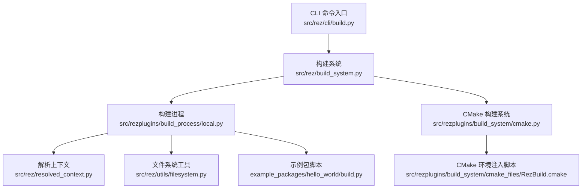
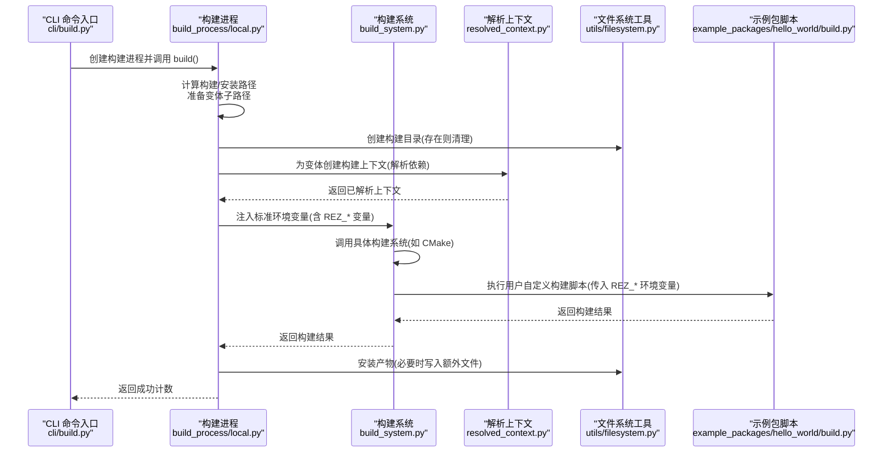
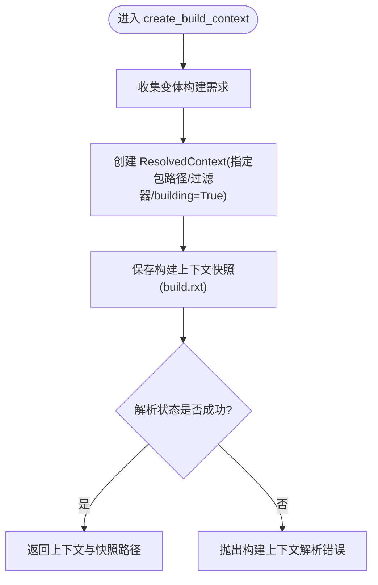
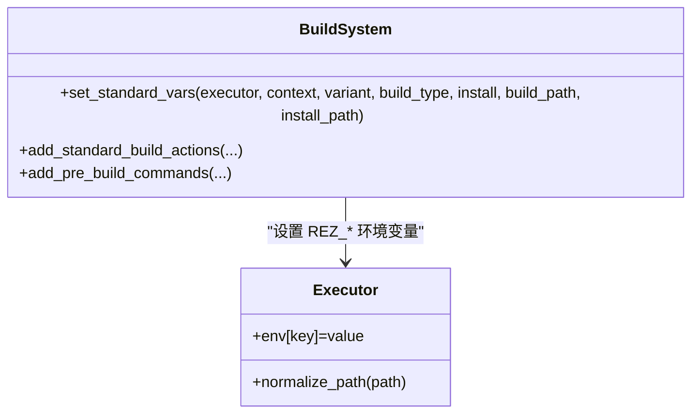
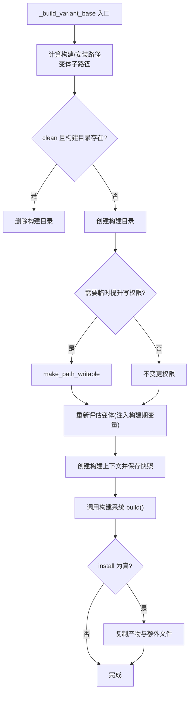
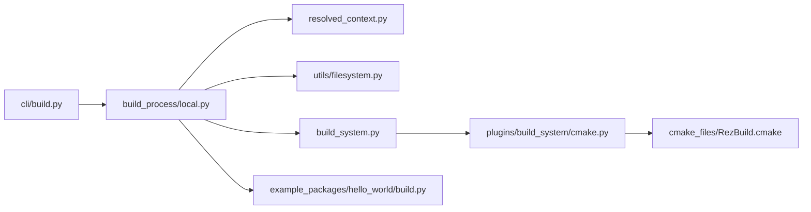

# 构建环境准备

<cite>
**本文引用的文件**
- [rez-3.3.0/src/rez/build_process.py](file://rez-3.3.0/src/rez/build_process.py)
- [rez-3.3.0/src/rez/build_system.py](file://rez-3.3.0/src/rez/build_system.py)
- [rez-3.3.0/src/rezplugins/build_process/local.py](file://rez-3.3.0/src/rezplugins/build_process/local.py)
- [rez-3.3.0/src/rez/resolved_context.py](file://rez-3.3.0/src/rez/resolved_context.py)
- [rez-3.3.0/src/rez/utils/filesystem.py](file://rez-3.3.0/src/rez/utils/filesystem.py)
- [rez-3.3.0/src/rez/cli/build.py](file://rez-3.3.0/src/rez/cli/build.py)
- [rez-3.3.0/src/rezplugins/shell/_utils/powershell_base.py](file://rez-3.3.0/src/rezplugins/shell/_utils/powershell_base.py)
- [rez-3.3.0/src/rezplugins/build_system/cmake.py](file://rez-3.3.0/src/rezplugins/build_system/cmake.py)
- [rez-3.3.0/src/rezplugins/build_system/cmake_files/RezBuild.cmake](file://rez-3.3.0/src/rezplugins/build_system/cmake_files/RezBuild.cmake)
- [rez-3.3.0/example_packages/hello_world/build.py](file://rez-3.3.0/example_packages/hello_world/build.py)
</cite>

## 目录
1. [引言](#引言)
2. [项目结构](#项目结构)
3. [核心组件](#核心组件)
4. [架构总览](#架构总览)
5. [详细组件分析](#详细组件分析)
6. [依赖关系分析](#依赖关系分析)
7. [性能考量](#性能考量)
8. [故障排查指南](#故障排查指南)
9. [结论](#结论)
10. [附录](#附录)

## 引言
本文件围绕 Rez 的“构建环境准备”主题，系统阐述 BuildProcess 类如何初始化构建环境，重点覆盖以下方面：
- 关键环境变量 REZ_BUILD_SOURCE_PATH、REZ_BUILD_PATH、REZ_BUILD_INSTALL_PATH 的来源、设置与验证机制
- 源码路径复制前的目录检查、权限配置与临时构建空间创建策略
- 构建上下文中的系统依赖解析、包变体锁定与环境隔离实现
- 多平台（Windows/Linux/macOS）环境下环境变量注入的最佳实践
- 常见问题：环境变量缺失、路径权限不足、构建目录冲突的诊断与解决

## 项目结构
Rez 的构建流程由命令入口、构建系统、构建进程与上下文解析共同组成。与“构建环境准备”直接相关的核心模块如下：
- 命令入口：负责解析参数、选择构建系统与构建进程并触发构建
- 构建系统：负责将标准环境变量注入到执行器中，并调用具体构建工具
- 构建进程：负责为每个变体创建构建上下文、准备构建目录、安装产物与测试
- 上下文解析：负责解析依赖、生成可复现的构建环境
- 文件系统工具：提供临时目录管理、权限变更、安全删除等能力

图表来源
- [rez-3.3.0/src/rez/cli/build.py](file://rez-3.3.0/src/rez/cli/build.py#L124-L174)
- [rez-3.3.0/src/rez/build_system.py](file://rez-3.3.0/src/rez/build_system.py#L177-L210)
- [rez-3.3.0/src/rezplugins/build_process/local.py](file://rez-3.3.0/src/rezplugins/build_process/local.py#L133-L210)
- [rez-3.3.0/src/rez/resolved_context.py](file://rez-3.3.0/src/rez/resolved_context.py#L165-L200)
- [rez-3.3.0/src/rez/utils/filesystem.py](file://rez-3.3.0/src/rez/utils/filesystem.py#L32-L120)
- [rez-3.3.0/src/rezplugins/build_system/cmake.py](file://rez-3.3.0/src/rezplugins/build_system/cmake.py#L106-L142)
- [rez-3.3.0/src/rezplugins/build_system/cmake_files/RezBuild.cmake](file://rez-3.3.0/src/rezplugins/build_system/cmake_files/RezBuild.cmake#L36-L66)
- [rez-3.3.0/example_packages/hello_world/build.py](file://rez-3.3.0/example_packages/hello_world/build.py#L10-L59)

章节来源
- [rez-3.3.0/src/rez/cli/build.py](file://rez-3.3.0/src/rez/cli/build.py#L124-L174)
- [rez-3.3.0/src/rez/build_system.py](file://rez-3.3.0/src/rez/build_system.py#L177-L210)
- [rez-3.3.0/src/rezplugins/build_process/local.py](file://rez-3.3.0/src/rezplugins/build_process/local.py#L133-L210)

## 核心组件
- BuildProcessHelper：提供构建上下文创建、变体遍历、发布前校验、钩子执行等通用能力
- BuildSystem.set_standard_vars：统一注入标准环境变量，包括 REZ_BUILD_SOURCE_PATH、REZ_BUILD_PATH、REZ_BUILD_INSTALL_PATH 等
- LocalBuildProcess：本地构建进程，负责为每个变体创建构建目录、安装目录、写入构建上下文快照、调用构建系统
- ResolvedContext：解析构建所需的依赖，形成可复现的构建环境
- TempDirs、make_path_writable、forceful_rmtree：提供临时目录管理与权限控制

章节来源
- [rez-3.3.0/src/rez/build_process.py](file://rez-3.3.0/src/rez/build_process.py#L233-L275)
- [rez-3.3.0/src/rez/build_system.py](file://rez-3.3.0/src/rez/build_system.py#L209-L259)
- [rez-3.3.0/src/rezplugins/build_process/local.py](file://rez-3.3.0/src/rezplugins/build_process/local.py#L133-L210)
- [rez-3.3.0/src/rez/resolved_context.py](file://rez-3.3.0/src/rez/resolved_context.py#L165-L200)
- [rez-3.3.0/src/rez/utils/filesystem.py](file://rez-3.3.0/src/rez/utils/filesystem.py#L32-L120)

## 架构总览
下面以序列图展示一次构建从命令入口到构建系统执行的关键步骤，以及环境变量注入与上下文解析的交互。

图表来源
- [rez-3.3.0/src/rez/cli/build.py](file://rez-3.3.0/src/rez/cli/build.py#L140-L174)
- [rez-3.3.0/src/rezplugins/build_process/local.py](file://rez-3.3.0/src/rezplugins/build_process/local.py#L133-L210)
- [rez-3.3.0/src/rez/build_system.py](file://rez-3.3.0/src/rez/build_system.py#L209-L259)
- [rez-3.3.0/src/rezplugins/build_system/cmake.py](file://rez-3.3.0/src/rezplugins/build_system/cmake.py#L106-L142)
- [rez-3.3.0/example_packages/hello_world/build.py](file://rez-3.3.0/example_packages/hello_world/build.py#L10-L59)

## 详细组件分析

### BuildProcessHelper：构建上下文创建与变体遍历
- create_build_context：基于变体的构建需求（含 build_requires 与私有构建依赖），在指定包仓库路径与过滤器下创建 ResolvedContext，并保存构建上下文快照用于调试
- visit_variants：按索引遍历变体，支持跳过不存在的变体索引并返回统计信息
- 预发布校验：检查发布路径、版本标签、UUID 一致性与最新性等

图表来源
- [rez-3.3.0/src/rez/build_process.py](file://rez-3.3.0/src/rez/build_process.py#L233-L275)

章节来源
- [rez-3.3.0/src/rez/build_process.py](file://rez-3.3.0/src/rez/build_process.py#L190-L217)
- [rez-3.3.0/src/rez/build_process.py](file://rez-3.3.0/src/rez/build_process.py#L233-L275)

### BuildSystem.set_standard_vars：标准环境变量注入
- 统一注入 REZ_BUILD_* 系列变量，包括：
  - REZ_BUILD_SOURCE_PATH：包定义所在目录（标准化）
  - REZ_BUILD_PATH：构建临时目录（标准化）
  - REZ_BUILD_INSTALL_PATH：安装目标目录（若提供）
  - REZ_BUILD_REQUIRES / REZ_BUILD_REQUIRES_UNVERSIONED：构建所需包列表
  - REZ_BUILD_PROJECT_NAME / VERSION / DESCRIPTION / FILE
  - REZ_BUILD_VARIANT_INDEX / SUBPATH / THREAD_COUNT / TYPE / INSTALL
- 同时支持在中央构建类型下注入兼容旧版的 REZ_IN_REZ_RELEASE（受配置开关控制）

图表来源
- [rez-3.3.0/src/rez/build_system.py](file://rez-3.3.0/src/rez/build_system.py#L209-L259)

章节来源
- [rez-3.3.0/src/rez/build_system.py](file://rez-3.3.0/src/rez/build_system.py#L209-L259)

### LocalBuildProcess：构建目录与安装策略
- 为每个变体计算构建/安装路径，支持变体子路径与短链接
- 清理/创建构建目录；在安装场景下，可能临时提升安装根目录写权限
- 重新评估变体以注入构建期变量，再创建构建上下文
- 写入 variant.json 与构建上下文快照，调用构建系统执行
- 安装阶段复制额外文件（如构建上下文快照），并可运行预安装测试

图表来源
- [rez-3.3.0/src/rezplugins/build_process/local.py](file://rez-3.3.0/src/rezplugins/build_process/local.py#L133-L210)
- [rez-3.3.0/src/rez/utils/filesystem.py](file://rez-3.3.0/src/rez/utils/filesystem.py#L88-L120)

章节来源
- [rez-3.3.0/src/rezplugins/build_process/local.py](file://rez-3.3.0/src/rezplugins/build_process/local.py#L133-L210)
- [rez-3.3.0/src/rez/utils/filesystem.py](file://rez-3.3.0/src/rez/utils/filesystem.py#L88-L120)

### 示例：hello_world 构建脚本对 REZ_* 变量的使用
- 在示例包脚本中，直接读取 REZ_BUILD_SOURCE_PATH、REZ_BUILD_PATH、REZ_BUILD_INSTALL_PATH 并据此进行源码复制、二进制权限设置与安装
- 这体现了 Rez 将构建环境变量注入到用户脚本的标准流程

章节来源
- [rez-3.3.0/example_packages/hello_world/build.py](file://rez-3.3.0/example_packages/hello_world/build.py#L10-L59)

### CMake 构建系统与 RezBuild.cmake 的环境变量校验
- CMake 构建系统会将 REZ_* 变量作为 CMake 变量传入
- RezBuild.cmake 对关键 REZ_BUILD_* 变量进行存在性校验，确保构建脚本能正确读取包名、版本等信息

章节来源
- [rez-3.3.0/src/rezplugins/build_system/cmake.py](file://rez-3.3.0/src/rezplugins/build_system/cmake.py#L106-L142)
- [rez-3.3.0/src/rezplugins/build_system/cmake_files/RezBuild.cmake](file://rez-3.3.0/src/rezplugins/build_system/cmake_files/RezBuild.cmake#L36-L66)

### 多平台环境变量注入最佳实践
- Windows PowerShell 注入：提供 setenv、prependenv、appendenv、unsetenv 等方法，注意路径分隔符与变量作用域差异
- 跨平台路径规范化：建议在包定义中明确哪些变量为路径型，以便在不同 Shell 下进行合适转换
- 临时目录清理：默认在程序退出时清理临时目录，可通过环境变量保留临时目录以便调试

章节来源
- [rez-3.3.0/src/rezplugins/shell/_utils/powershell_base.py](file://rez-3.3.0/src/rezplugins/shell/_utils/powershell_base.py#L251-L281)
- [rez-3.3.0/src/rez/utils/filesystem.py](file://rez-3.3.0/src/rez/utils/filesystem.py#L32-L86)

## 依赖关系分析
- BuildProcessHelper 依赖 ResolvedContext 进行依赖解析与环境隔离
- BuildSystem 依赖 Executor 设置环境变量，同时与具体构建系统（如 CMake）协作
- LocalBuildProcess 串联文件系统工具与包仓库接口，负责目录创建、权限调整与安装
- CLI 命令入口负责参数解析与构建流程编排

图表来源
- [rez-3.3.0/src/rez/cli/build.py](file://rez-3.3.0/src/rez/cli/build.py#L124-L174)
- [rez-3.3.0/src/rezplugins/build_process/local.py](file://rez-3.3.0/src/rezplugins/build_process/local.py#L133-L210)
- [rez-3.3.0/src/rez/build_system.py](file://rez-3.3.0/src/rez/build_system.py#L209-L259)
- [rez-3.3.0/src/rezplugins/build_system/cmake.py](file://rez-3.3.0/src/rezplugins/build_system/cmake.py#L106-L142)
- [rez-3.3.0/src/rezplugins/build_system/cmake_files/RezBuild.cmake](file://rez-3.3.0/src/rezplugins/build_system/cmake_files/RezBuild.cmake#L36-L66)
- [rez-3.3.0/example_packages/hello_world/build.py](file://rez-3.3.0/example_packages/hello_world/build.py#L10-L59)

章节来源
- [rez-3.3.0/src/rez/cli/build.py](file://rez-3.3.0/src/rez/cli/build.py#L124-L174)
- [rez-3.3.0/src/rezplugins/build_process/local.py](file://rez-3.3.0/src/rezplugins/build_process/local.py#L133-L210)

## 性能考量
- 依赖解析缓存：ResolvedContext 支持缓存以减少重复解析成本
- 临时目录清理：默认自动清理，避免磁盘占用；调试时可保留临时目录
- 权限变更最小化：仅在必要时临时提升写权限，结束后恢复原权限
- 变体短链接：哈希变体场景下创建短链接，降低路径长度与查找开销

[本节为通用指导，无需特定文件来源]

## 故障排查指南

### 环境变量缺失
- 症状：构建脚本或 CMake 报告缺少 REZ_* 变量
- 排查要点：
  - 确认 BuildSystem.set_standard_vars 已被调用
  - 检查构建系统插件是否正确注入变量（如 CMake 插件）
  - 若使用 RezBuild.cmake，请确认其对关键变量的存在性校验未触发
- 解决方案：
  - 确保使用 Rez 的构建流程（CLI -> 构建进程 -> 构建系统），而非绕过 Rez 直接调用外部工具
  - 如需自定义脚本，显式读取并打印环境变量以定位缺失项

章节来源
- [rez-3.3.0/src/rez/build_system.py](file://rez-3.3.0/src/rez/build_system.py#L209-L259)
- [rez-3.3.0/src/rezplugins/build_system/cmake_files/RezBuild.cmake](file://rez-3.3.0/src/rezplugins/build_system/cmake_files/RezBuild.cmake#L36-L66)

### 路径权限不足
- 症状：安装目录或父目录不可写导致安装失败
- 排查要点：
  - 检查安装根目录是否存在，以及其写权限
  - 观察是否启用了临时提升写权限的配置
- 解决方案：
  - 使用 Rez 默认安装路径或确保目标路径具备写权限
  - 在 CI 或受限环境中，提前赋予写权限或使用临时目录

章节来源
- [rez-3.3.0/src/rezplugins/build_process/local.py](file://rez-3.3.0/src/rezplugins/build_process/local.py#L153-L171)
- [rez-3.3.0/src/rez/utils/filesystem.py](file://rez-3.3.0/src/rez/utils/filesystem.py#L88-L120)

### 构建目录冲突
- 症状：构建目录已存在但内容不一致，导致清理/重建异常
- 排查要点：
  - 检查 clean 参数是否启用
  - 查看构建目录是否被外部进程占用
- 解决方案：
  - 显式启用 clean 选项以强制清理
  - 在并发构建场景下，为不同变体分配独立子目录

章节来源
- [rez-3.3.0/src/rezplugins/build_process/local.py](file://rez-3.3.0/src/rezplugins/build_process/local.py#L147-L152)

### 发布前校验失败
- 症状：发布路径不存在、版本标签已存在、UUID 不匹配或新版本已发布
- 排查要点：
  - 检查 release_packages_path 是否正确
  - 确认版本标签策略与忽略现有标签选项
- 解决方案：
  - 修正发布路径或先清理已有标签
  - 确保包 UUID 一致，或在允许场景下使用忽略现有标签选项

章节来源
- [rez-3.3.0/src/rez/build_process.py](file://rez-3.3.0/src/rez/build_process.py#L277-L324)

## 结论
Rez 的构建环境准备通过“构建系统注入环境变量 + 构建进程准备目录与上下文 + 上下文解析保证依赖隔离”的方式，实现了跨平台、可复现且可控的构建流程。关键在于：
- 明确 REZ_BUILD_* 环境变量的来源与用途
- 在源码复制前进行目录检查与权限配置
- 利用临时目录与权限提升工具保障安装稳定性
- 在多平台环境下采用合适的 Shell 注入策略与路径规范化

[本节为总结性内容，无需特定文件来源]

## 附录

### 关键环境变量清单与含义
- REZ_BUILD_SOURCE_PATH：包定义所在目录（标准化）
- REZ_BUILD_PATH：构建临时目录（标准化）
- REZ_BUILD_INSTALL_PATH：安装目标目录（若提供）
- REZ_BUILD_REQUIRES / REZ_BUILD_REQUIRES_UNVERSIONED：构建所需包列表
- REZ_BUILD_PROJECT_NAME / VERSION / DESCRIPTION / FILE：包元数据
- REZ_BUILD_VARIANT_INDEX / SUBPATH / THREAD_COUNT / TYPE / INSTALL：变体与构建类型信息

章节来源
- [rez-3.3.0/src/rez/build_system.py](file://rez-3.3.0/src/rez/build_system.py#L209-L259)
- [rez-3.3.0/src/rezplugins/build_system/cmake.py](file://rez-3.3.0/src/rezplugins/build_system/cmake.py#L106-L142)
- [rez-3.3.0/src/rezplugins/build_system/cmake_files/RezBuild.cmake](file://rez-3.3.0/src/rezplugins/build_system/cmake_files/RezBuild.cmake#L36-L66)
- [rez-3.3.0/example_packages/hello_world/build.py](file://rez-3.3.0/example_packages/hello_world/build.py#L10-L59)