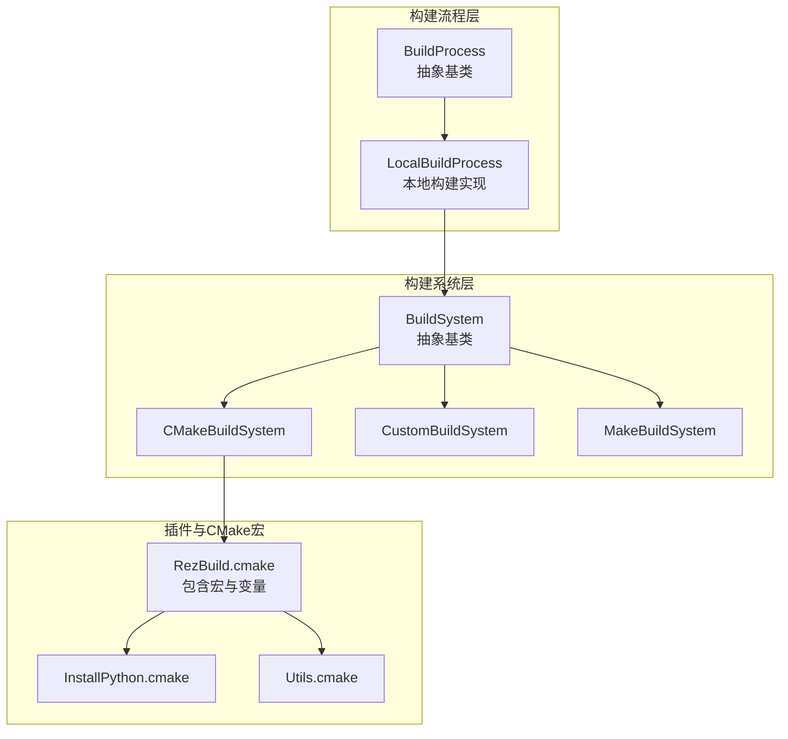
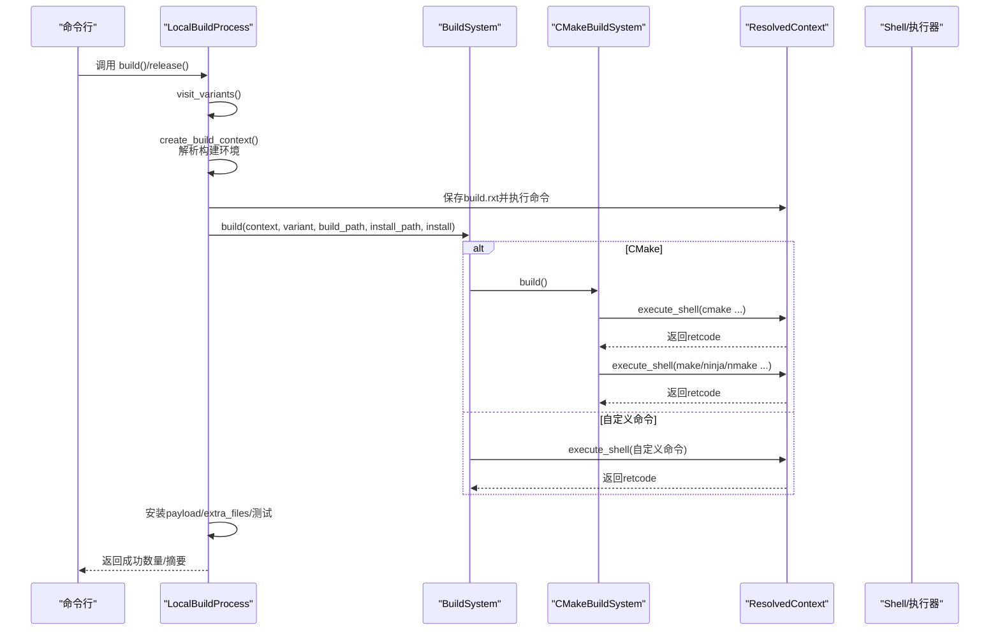
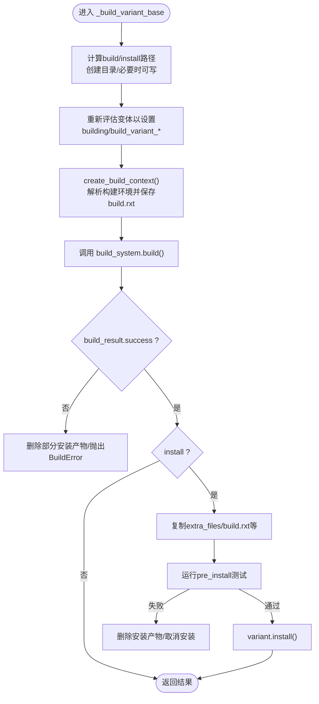
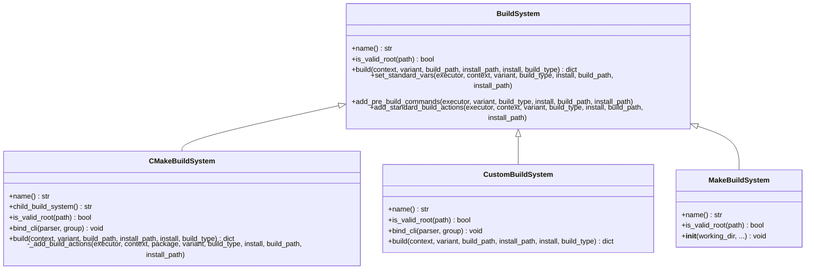
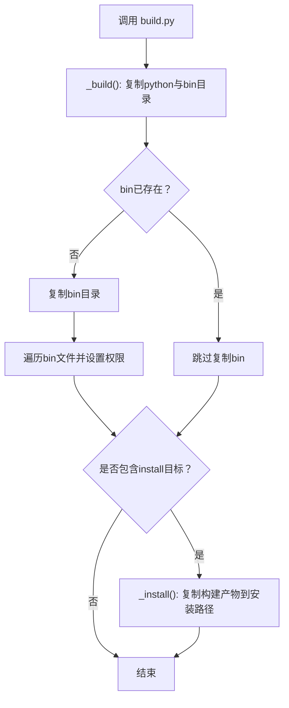
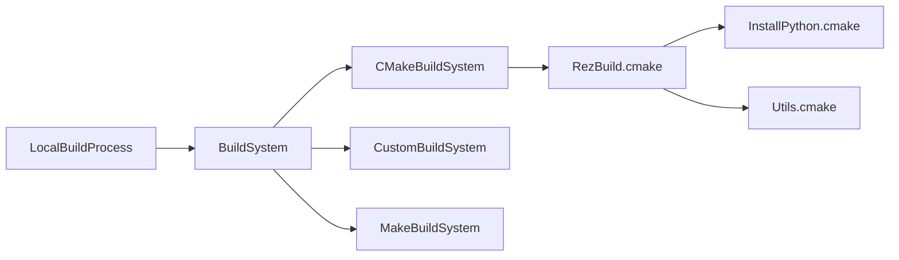

# 源码编译与构建

<cite>
**本文引用的文件列表**
- [rez-3.3.0/src/rez/build_process.py](file://rez-3.3.0/src/rez/build_process.py)
- [rez-3.3.0/src/rez/build_system.py](file://rez-3.3.0/src/rez/build_system.py)
- [rez-3.3.0/src/rezplugins/build_process/local.py](file://rez-3.3.0/src/rezplugins/build_process/local.py)
- [rez-3.3.0/src/rezplugins/build_system/cmake.py](file://rez-3.3.0/src/rezplugins/build_system/cmake.py)
- [rez-3.3.0/src/rezplugins/build_system/custom.py](file://rez-3.3.0/src/rezplugins/build_system/custom.py)
- [rez-3.3.0/src/rezplugins/build_system/make.py](file://rez-3.3.0/src/rezplugins/build_system/make.py)
- [rez-3.3.0/src/rezplugins/build_system/cmake_files/RezBuild.cmake](file://rez-3.3.0/src/rezplugins/build_system/cmake_files/RezBuild.cmake)
- [rez-3.3.0/src/rezplugins/build_system/cmake_files/InstallPython.cmake](file://rez-3.3.0/src/rezplugins/build_system/cmake_files/InstallPython.cmake)
- [rez-3.3.0/src/rezplugins/build_system/cmake_files/Utils.cmake](file://rez-3.3.0/src/rezplugins/build_system/cmake_files/Utils.cmake)
- [rez-3.3.0/src/rez/exceptions.py](file://rez-3.3.0/src/rez/exceptions.py)
- [rez-3.3.0/src/rez/config.py](file://rez-3.3.0/src/rez/config.py)
- [rez-3.3.0/example_packages/hello_world/build.py](file://rez-3.3.0/example_packages/hello_world/build.py)
- [rez-3.3.0/example_packages/hello_world/package.py](file://rez-3.3.0/example_packages/hello_world/package.py)
- [rez-3.3.0/example_packages/hello_world/CMakeLists.txt.example](file://rez-3.3.0/example_packages/hello_world/CMakeLists.txt.example)
</cite>

## 目录
1. [简介](#简介)
2. [项目结构](#项目结构)
3. [核心组件](#核心组件)
4. [架构总览](#架构总览)
5. [详细组件分析](#详细组件分析)
6. [依赖关系分析](#依赖关系分析)
7. [性能考量](#性能考量)
8. [故障排查指南](#故障排查指南)
9. [结论](#结论)
10. [附录](#附录)

## 简介
本文件面向需要在Rez环境中进行源码编译与构建的用户，系统性梳理从“构建流程入口”到“具体构建系统”的实现路径，重点解释BuildProcess如何调用构建系统（如CMake、Make、自定义命令），并深入解析build()函数中_build()阶段的实现逻辑。同时结合hello_world示例中的Python模块与二进制文件处理流程，说明shutil.copytree与os.chmod的使用场景；阐述构建脚本如何根据目标平台调整编译参数、处理依赖库链接与生成中间产物；最后给出扩展自定义构建逻辑的方法与常见问题排查步骤。

## 项目结构
Rez的构建子系统由三层组成：
- 构建流程层：负责变体遍历、环境解析、安装与发布流程协调
- 构建系统层：封装具体的构建工具（CMake、Make、自定义命令）
- 插件与CMake宏：提供跨平台构建参数、依赖查找与安装规则

图表来源
- [rez-3.3.0/src/rez/build_process.py](file://rez-3.3.0/src/rez/build_process.py#L66-L177)
- [rez-3.3.0/src/rezplugins/build_process/local.py](file://rez-3.3.0/src/rezplugins/build_process/local.py#L30-L120)
- [rez-3.3.0/src/rez/build_system.py](file://rez-3.3.0/src/rez/build_system.py#L103-L207)
- [rez-3.3.0/src/rezplugins/build_system/cmake.py](file://rez-3.3.0/src/rezplugins/build_system/cmake.py#L29-L120)
- [rez-3.3.0/src/rezplugins/build_system/custom.py](file://rez-3.3.0/src/rezplugins/build_system/custom.py#L26-L120)
- [rez-3.3.0/src/rezplugins/build_system/make.py](file://rez-3.3.0/src/rezplugins/build_system/make.py#L12-L29)
- [rez-3.3.0/src/rezplugins/build_system/cmake_files/RezBuild.cmake](file://rez-3.3.0/src/rezplugins/build_system/cmake_files/RezBuild.cmake#L1-L120)

章节来源
- [rez-3.3.0/src/rez/build_process.py](file://rez-3.3.0/src/rez/build_process.py#L66-L177)
- [rez-3.3.0/src/rezplugins/build_process/local.py](file://rez-3.3.0/src/rezplugins/build_process/local.py#L30-L120)
- [rez-3.3.0/src/rez/build_system.py](file://rez-3.3.0/src/rez/build_system.py#L103-L207)

## 核心组件
- BuildProcess与BuildProcessHelper：定义构建生命周期（build/release）、变体遍历、构建上下文创建、仓库状态校验、发布钩子与变更日志等。
- BuildSystem与具体实现：封装构建工具调用、标准环境变量注入、预构建命令执行、父子构建系统（如CMake→Make）。
- LocalBuildProcess：本地顺序构建与安装，按变体执行，支持测试、短链、临时可写目录等。
- CMakeBuildSystem：通过ResolvedContext在受控环境中执行cmake与make/ninja/nmake等，注入CMake变量与模块路径。
- CustomBuildSystem：执行package.py中定义的build_command，支持CLI参数注入与环境变量扩展。
- CMake宏与工具：RezBuild.cmake提供版本变量、包查找、安装规则；InstallPython.cmake用于Python文件安装与可选的.pyc生成。

章节来源
- [rez-3.3.0/src/rez/build_process.py](file://rez-3.3.0/src/rez/build_process.py#L179-L450)
- [rez-3.3.0/src/rez/build_system.py](file://rez-3.3.0/src/rez/build_system.py#L103-L312)
- [rez-3.3.0/src/rezplugins/build_process/local.py](file://rez-3.3.0/src/rezplugins/build_process/local.py#L133-L312)
- [rez-3.3.0/src/rezplugins/build_system/cmake.py](file://rez-3.3.0/src/rezplugins/build_system/cmake.py#L29-L120)
- [rez-3.3.0/src/rezplugins/build_system/custom.py](file://rez-3.3.0/src/rezplugins/build_system/custom.py#L26-L120)

## 架构总览
下图展示从命令行到具体构建系统调用的端到端流程，以及CMake→Make的父子关系。

图表来源
- [rez-3.3.0/src/rezplugins/build_process/local.py](file://rez-3.3.0/src/rezplugins/build_process/local.py#L133-L285)
- [rez-3.3.0/src/rezplugins/build_system/cmake.py](file://rez-3.3.0/src/rezplugins/build_system/cmake.py#L108-L244)
- [rez-3.3.0/src/rezplugins/build_system/custom.py](file://rez-3.3.0/src/rezplugins/build_system/custom.py#L100-L215)

## 详细组件分析

### BuildProcess与LocalBuildProcess：构建流程与变体调度
- 变体遍历：LocalBuildProcess通过BuildProcessHelper.visit_variants迭代变体，支持指定索引过滤。
- 构建上下文：create_build_context基于变体的requires与私有构建依赖，创建ResolvedContext，保存build.rxt便于调试。
- 构建执行：对每个变体，调用build_system.build()，并在安装模式下复制额外文件、运行测试、更新包定义。
- 发布流程：pre_release校验仓库状态与标签，post_release打标签；支持发布钩子与变更日志。

图表来源
- [rez-3.3.0/src/rezplugins/build_process/local.py](file://rez-3.3.0/src/rezplugins/build_process/local.py#L133-L285)

章节来源
- [rez-3.3.0/src/rezplugins/build_process/local.py](file://rez-3.3.0/src/rezplugins/build_process/local.py#L133-L285)
- [rez-3.3.0/src/rez/build_process.py](file://rez-3.3.0/src/rez/build_process.py#L179-L276)

### BuildSystem与CMakeBuildSystem：调用构建系统与参数注入
- BuildSystem.set_standard_vars：注入REZ_BUILD_*系列环境变量，如REZ_BUILD_THREAD_COUNT、REZ_BUILD_VARIANT_INDEX、REZ_BUILD_INSTALL等。
- BuildSystem.add_pre_build_commands：在构建前执行package.py中的pre_build_commands，绑定this与build命名空间。
- CMakeBuildSystem.build：
  - 解析cmake二进制与生成器（Unix Makefiles/Ninja/NMake/MinGW/Xcode等），组装CMake命令并传入CMAKE_INSTALL_PREFIX、CMAKE_MODULE_PATH、CMAKE_BUILD_TYPE、REZ_BUILD_TYPE、REZ_BUILD_INSTALL等。
  - 在ResolvedContext.execute_shell中执行，支持actions_callback与post_actions_callback。
  - 若write_build_scripts为真，生成build-env脚本供用户直接进入构建环境。
  - 子构建系统（make/ninja/nmake）自动拼接并行参数-j（除nmake外），随后执行make install（若install=True且未显式包含）。

图表来源
- [rez-3.3.0/src/rez/build_system.py](file://rez-3.3.0/src/rez/build_system.py#L103-L312)
- [rez-3.3.0/src/rezplugins/build_system/cmake.py](file://rez-3.3.0/src/rezplugins/build_system/cmake.py#L29-L120)
- [rez-3.3.0/src/rezplugins/build_system/custom.py](file://rez-3.3.0/src/rezplugins/build_system/custom.py#L26-L120)
- [rez-3.3.0/src/rezplugins/build_system/make.py](file://rez-3.3.0/src/rezplugins/build_system/make.py#L12-L29)

章节来源
- [rez-3.3.0/src/rez/build_system.py](file://rez-3.3.0/src/rez/build_system.py#L208-L312)
- [rez-3.3.0/src/rezplugins/build_system/cmake.py](file://rez-3.3.0/src/rezplugins/build_system/cmake.py#L108-L244)

### hello_world示例：Python模块与二进制文件处理
- package.py中通过build_command指向Python构建脚本，传递{install}占位符。
- build.py的_build()阶段：
  - 将python目录复制到构建输出目录
  - 将bin目录复制到构建输出目录，并对可执行文件赋予读取+执行权限（使用os.chmod）
- install阶段：将构建产物复制到最终安装路径

图表来源
- [rez-3.3.0/example_packages/hello_world/build.py](file://rez-3.3.0/example_packages/hello_world/build.py#L10-L50)
- [rez-3.3.0/example_packages/hello_world/package.py](file://rez-3.3.0/example_packages/hello_world/package.py#L24-L29)

章节来源
- [rez-3.3.0/example_packages/hello_world/build.py](file://rez-3.3.0/example_packages/hello_world/build.py#L10-L50)
- [rez-3.3.0/example_packages/hello_world/package.py](file://rez-3.3.0/example_packages/hello_world/package.py#L24-L29)

### CMake宏与安装规则：平台参数、依赖链接与产物生成
- RezBuild.cmake：
  - 强制要求在REZ_BUILD_ENV中执行，确保与Rez构建上下文一致
  - 注入REZ_BUILD_PROJECT_NAME/VERSION、REZ_BUILD_ALL_PKGS及各包版本变量（大中小版本）
  - 包含Colorize、Utils、RezProject、InstallFiles、RezInstallCMake、RezFindPackages、RezInstallPython等宏
  - 设置可执行文件默认权限
- InstallPython.cmake：
  - 支持FILES、RELATIVE、DESTINATION、BIN、LOCAL_SYMLINK等参数
  - 当启用LOCAL_SYMLINK时跳过.pyc生成；否则可选安装.pyc
  - 通过CMake命令生成.pyc并随目标安装
- Utils.cmake：
  - 提供list_to_string、list_contains、list_remove_regex、car/cdr、PARSE_ARGUMENTS等通用宏

章节来源
- [rez-3.3.0/src/rezplugins/build_system/cmake_files/RezBuild.cmake](file://rez-3.3.0/src/rezplugins/build_system/cmake_files/RezBuild.cmake#L1-L120)
- [rez-3.3.0/src/rezplugins/build_system/cmake_files/InstallPython.cmake](file://rez-3.3.0/src/rezplugins/build_system/cmake_files/InstallPython.cmake#L1-L133)
- [rez-3.3.0/src/rezplugins/build_system/cmake_files/Utils.cmake](file://rez-3.3.0/src/rezplugins/build_system/cmake_files/Utils.cmake#L1-L160)

### CMake示例工程：CMakeLists.txt与安装目标
- 示例CMakeLists.txt通过include(RezBuild)引入宏，使用rez_install_python安装Python模块，使用rez_install_files安装可执行文件并标记为可执行。

章节来源
- [rez-3.3.0/example_packages/hello_world/CMakeLists.txt.example](file://rez-3.3.0/example_packages/hello_world/CMakeLists.txt.example#L1-L18)

## 依赖关系分析
- 构建流程与构建系统解耦：LocalBuildProcess仅依赖BuildSystem接口，不关心具体实现细节。
- CMakeBuildSystem与Make：CMake作为父构建系统，生成Make/Ninja/NMake工程，再由子构建系统执行。
- CMake宏链路：RezBuild.cmake包含多个工具宏，InstallPython.cmake依赖Utils.cmake与InstallFiles.cmake。

图表来源
- [rez-3.3.0/src/rezplugins/build_process/local.py](file://rez-3.3.0/src/rezplugins/build_process/local.py#L243-L285)
- [rez-3.3.0/src/rezplugins/build_system/cmake.py](file://rez-3.3.0/src/rezplugins/build_system/cmake.py#L29-L120)
- [rez-3.3.0/src/rezplugins/build_system/cmake_files/RezBuild.cmake](file://rez-3.3.0/src/rezplugins/build_system/cmake_files/RezBuild.cmake#L77-L120)

章节来源
- [rez-3.3.0/src/rezplugins/build_system/cmake.py](file://rez-3.3.0/src/rezplugins/build_system/cmake.py#L108-L244)
- [rez-3.3.0/src/rezplugins/build_system/cmake_files/RezBuild.cmake](file://rez-3.3.0/src/rezplugins/build_system/cmake_files/RezBuild.cmake#L1-L120)

## 性能考量
- 并行构建：CMakeBuildSystem在非nmake子构建系统中自动追加-jN，N来自配置项build_thread_count（支持物理/逻辑核心数或固定数值）。
- 线程计数配置：config.build_thread_count支持整数、"physical_cores"、"logical_cores"三种形式，底层由平台探测决定。
- 临时可写目录：安装阶段可对目标目录进行临时可写处理，减少权限问题导致的失败重试成本。

章节来源
- [rez-3.3.0/src/rezplugins/build_system/cmake.py](file://rez-3.3.0/src/rezplugins/build_system/cmake.py#L200-L219)
- [rez-3.3.0/src/rez/config.py](file://rez-3.3.0/src/rez/config.py#L340-L363)
- [rez-3.3.0/src/rezplugins/build_process/local.py](file://rez-3.3.0/src/rezplugins/build_process/local.py#L159-L163)

## 故障排查指南
- 常见异常类型
  - BuildContextResolveError：构建环境无法解析，打印failure_description便于定位依赖冲突。
  - BuildSystemError：构建系统相关错误（如找不到cmake二进制）。
  - BuildError：构建失败，通常由构建系统返回非零退出码触发。
  - PackageTestError：安装/发布前测试失败，会回滚安装产物并取消安装。
- 典型问题与定位步骤
  - 编译失败（CMake/Make）：检查CMake输出、build.rxt与构建日志；确认CMAKE_INSTALL_PREFIX、CMAKE_MODULE_PATH、CMAKE_BUILD_TYPE等参数正确；查看子构建系统并行参数是否被覆盖。
  - 依赖缺失：确认ResolvedContext中请求的包已满足；检查pre_build_commands是否正确设置环境；核对RezBuild.cmake中REZ_BUILD_ALL_PKGS与版本变量。
  - 权限错误（可执行文件）：hello_world示例中bin文件需赋予读取+执行权限；CMake宏默认设置可执行文件权限；若自定义安装，请确保chmod或安装规则正确。
  - 发布失败：检查仓库状态、标签是否存在、最新版本限制、发布钩子是否取消发布。
- 排查建议
  - 使用write_build_scripts生成build-env脚本，手动进入构建环境复现问题。
  - 查看build.rxt与variant.json，确认变体索引与构建路径。
  - 启用verbose模式，观察CMake/Make命令行与输出。

章节来源
- [rez-3.3.0/src/rez/exceptions.py](file://rez-3.3.0/src/rez/exceptions.py#L140-L164)
- [rez-3.3.0/src/rezplugins/build_system/cmake.py](file://rez-3.3.0/src/rezplugins/build_system/cmake.py#L114-L141)
- [rez-3.3.0/src/rezplugins/build_system/custom.py](file://rez-3.3.0/src/rezplugins/build_system/custom.py#L100-L215)
- [rez-3.3.0/src/rezplugins/build_process/local.py](file://rez-3.3.0/src/rezplugins/build_process/local.py#L347-L418)

## 结论
Rez的构建体系通过“流程层-系统层-插件宏”三级抽象，实现了对多构建工具的统一接入与跨平台参数注入。LocalBuildProcess负责变体调度与安装，BuildSystem负责标准化环境变量与预构建命令，CMakeBuildSystem则在受控环境中执行cmake与make/ninja/nmake，配合RezBuild.cmake宏完成依赖解析与安装。hello_world示例展示了Python模块与二进制文件的复制与权限设置流程。通过配置build_thread_count与并行参数、利用build-env脚本与build.rxt，可以高效定位与解决编译、依赖与权限问题。

## 附录
- 扩展自定义构建逻辑
  - 预编译脚本注入：在package.py中定义pre_build_commands，使用BuildSystem.add_pre_build_commands在构建前执行。
  - 编译器选择：CMakeBuildSystem支持cmake_binary与make_binary配置；CustomBuildSystem支持CLI参数注入（./parse_build_args.py）。
  - 并行构建配置：通过config.build_thread_count设置并行度，CMakeBuildSystem自动追加-jN。
  - 目标平台适配：CMakeBuildSystem在不同平台选择合适生成器（Unix Makefiles/Ninja/NMake/MinGW/Xcode），并根据平台限制（如Xcode仅OSX）进行约束。
- 参考文件路径
  - [构建流程与上下文](file://rez-3.3.0/src/rezplugins/build_process/local.py#L133-L285)
  - [构建系统接口与标准变量](file://rez-3.3.0/src/rez/build_system.py#L208-L312)
  - [CMake构建系统实现](file://rez-3.3.0/src/rezplugins/build_system/cmake.py#L108-L244)
  - [自定义构建系统实现](file://rez-3.3.0/src/rezplugins/build_system/custom.py#L100-L215)
  - [CMake宏与安装规则](file://rez-3.3.0/src/rezplugins/build_system/cmake_files/RezBuild.cmake#L1-L120)
  - [Python安装宏](file://rez-3.3.0/src/rezplugins/build_system/cmake_files/InstallPython.cmake#L1-L133)
  - [hello_world示例](file://rez-3.3.0/example_packages/hello_world/build.py#L10-L50)