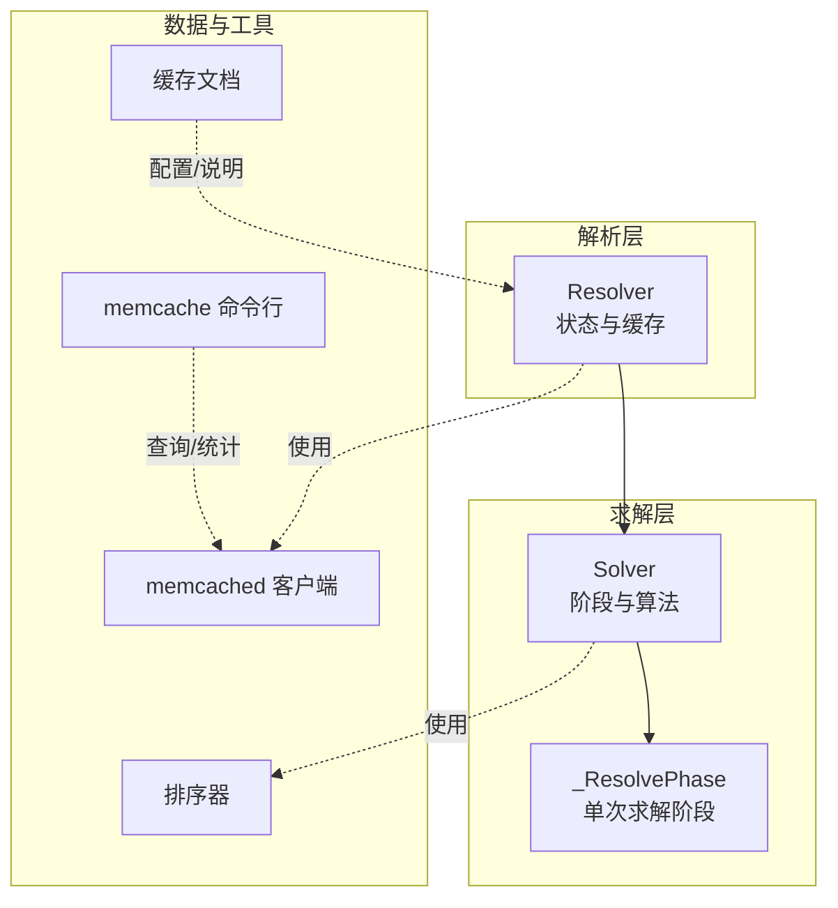
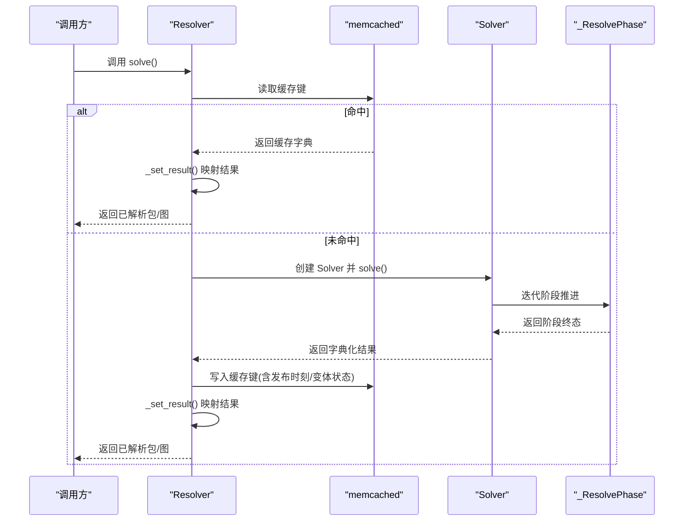
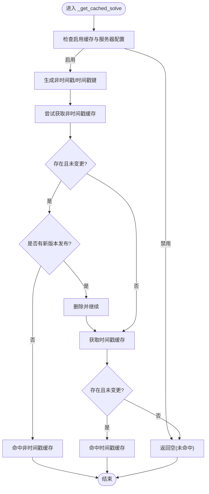
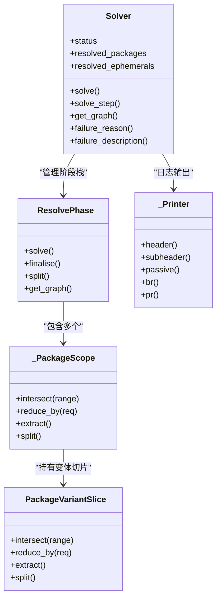
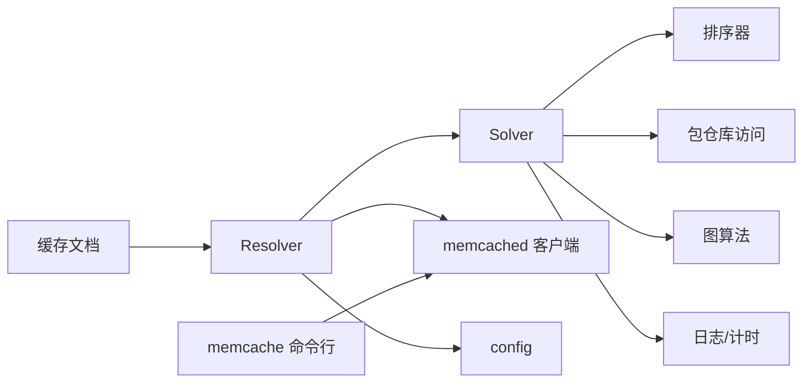

# 依赖解析算法

<cite>
**本文引用的文件**
- [resolver.py](file://rez-3.3.0/src/rez/resolver.py)
- [solver.py](file://rez-3.3.0/src/rez/solver.py)
- [SOLVER.md](file://rez-3.3.0/src/rez/SOLVER.md)
- [memcached.py](file://rez-3.3.0/src/rez/utils/memcached.py)
- [memcache.py](file://rez-3.3.0/src/rez/cli/memcache.py)
- [caching.rst](file://rez-3.3.0/docs/source/caching.rst)
- [package_order.py](file://rez-3.3.0/src/rez/package_order.py)
</cite>

## 目录
1. [简介](#简介)
2. [项目结构](#项目结构)
3. [核心组件](#核心组件)
4. [架构总览](#架构总览)
5. [详细组件分析](#详细组件分析)
6. [依赖关系分析](#依赖关系分析)
7. [性能考量](#性能考量)
8. [故障排查指南](#故障排查指南)
9. [结论](#结论)

## 简介
本文件围绕 Rez 的依赖解析算法展开，重点解释 resolver.py 中 Resolver 类如何与 solver.py 中的 Solver 类协作完成依赖求解；同时系统阐述其缓存机制（memcached）、状态管理（ResolverStatus/SolverStatus）、包请求处理、路径搜索、过滤规则、排序器、以及底层求解器的约束满足算法与图遍历策略。文档还提供基于源码路径的流程示意与排障建议，帮助读者在不直接阅读代码的前提下理解整体工作流。

## 项目结构
与依赖解析相关的关键模块：
- 解析入口与状态：resolver.py
- 求解器与阶段：solver.py
- 算法说明：SOLVER.md
- 缓存工具与命令：utils/memcached.py、cli/memcache.py
- 文档化缓存行为：docs/source/caching.rst
- 排序器：src/rez/package_order.py

图表来源
- [resolver.py](file://rez-3.3.0/src/rez/resolver.py#L1-L120)
- [solver.py](file://rez-3.3.0/src/rez/solver.py#L1883-L1999)
- [memcached.py](file://rez-3.3.0/src/rez/utils/memcached.py#L1-L45)
- [memcache.py](file://rez-3.3.0/src/rez/cli/memcache.py#L1-L47)
- [caching.rst](file://rez-3.3.0/docs/source/caching.rst#L1-L90)
- [package_order.py](file://rez-3.3.0/src/rez/package_order.py#L716-L748)

章节来源
- [resolver.py](file://rez-3.3.0/src/rez/resolver.py#L1-L120)
- [solver.py](file://rez-3.3.0/src/rez/solver.py#L1883-L1999)

## 核心组件
- Resolver：负责将用户请求转换为 Solver 实例，执行缓存命中/回填逻辑，并将结果映射为可对外使用的包集合与图。
- Solver：实现完整的约束满足算法，包含阶段推进、提取/合并/相交/新增/归约/分裂等步骤，维护阶段栈与失败原因。
- _ResolvePhase：一次“未穷尽”的求解阶段，内部对所有 scope 执行提取-相交-新增-归约循环，直至无法继续或达到终态。
- 缓存：以 memcached 为后端，缓存上次求解结果、最近发布时刻与变体状态，支持带时间戳与不带时间戳两种键空间。
- 排序器：控制变体选择优先级，影响相交/归约/分裂时的分支选择与确定性。

章节来源
- [resolver.py](file://rez-3.3.0/src/rez/resolver.py#L113-L171)
- [solver.py](file://rez-3.3.0/src/rez/solver.py#L1223-L1474)
- [SOLVER.md](file://rez-3.3.0/src/rez/SOLVER.md#L1-L146)

## 架构总览
Resolver 调用 Solver.solve()，Solver 内部维护阶段栈，按“提取-相交-新增-归约-分裂”迭代推进，最终得到成功/失败/环依赖等状态。Resolver 将 Solver 的字典化结果映射为包对象与图，并通过 memcached 进行缓存读写。

图表来源
- [resolver.py](file://rez-3.3.0/src/rez/resolver.py#L113-L171)
- [resolver.py](file://rez-3.3.0/src/rez/resolver.py#L175-L374)
- [solver.py](file://rez-3.3.0/src/rez/solver.py#L2094-L2211)
- [solver.py](file://rez-3.3.0/src/rez/solver.py#L1223-L1474)

## 详细组件分析

### Resolver 类与缓存机制
- 状态管理：ResolverStatus 枚举定义 pending/solved/failed/aborted，Resolver 维护 status_、resolved_packages_、resolved_ephemerals_、graph_ 等字段。
- 请求与过滤：构造阶段会将 timestamp 与 package_filter 合并为新的过滤器；若设置了 building/testing 等标志，也纳入缓存键。
- 缓存键生成：_memcache_key() 基于请求字符串、仓库 uid、过滤器哈希、排序器哈希、building/testing/prune_failed_graph、timestamp（可选）生成稳定键。
- 缓存读取：_get_cached_solve() 支持“非时间戳”和“时间戳”两套键空间，严格校验变体状态与最新发布时刻，避免脏缓存；命中则返回 solver 字典。
- 缓存写入：_set_cached_solve() 在成功状态下写入，同时记录每个包的“最近发布时刻”和“变体状态句柄”，用于后续校验；根据是否在 timestamp 后有新版本决定写入非时间戳或时间戳键。
- 客户端封装：_memcached_client() 使用 memcached 客户端上下文，支持调试开关。

图表来源
- [resolver.py](file://rez-3.3.0/src/rez/resolver.py#L175-L374)

章节来源
- [resolver.py](file://rez-3.3.0/src/rez/resolver.py#L113-L171)
- [resolver.py](file://rez-3.3.0/src/rez/resolver.py#L175-L374)
- [resolver.py](file://rez-3.3.0/src/rez/resolver.py#L375-L475)
- [memcached.py](file://rez-3.3.0/src/rez/utils/memcached.py#L1-L45)
- [caching.rst](file://rez-3.3.0/docs/source/caching.rst#L1-L90)

### Solver 类与求解阶段
- 初始化与请求合并：Solver.__init__() 合并请求列表，若存在冲突则直接失败；否则创建初始阶段压入栈。
- 单步推进：solve_step() 弹出顶部阶段，若为 exhausted 则 split() 分裂；调用阶段 solve()，根据结果 push 新阶段或保留失败阶段。
- 阶段 solve()：_ResolvePhase.solve() 循环执行“提取-相交-新增-归约”，直到无法再推进；期间统计计数与耗时。
- 归约与相交：_PackageVariantSlice.reduce_by()/intersect() 对变体切片进行冲突检测与范围缩减；_PackageScope.reduce_by()/intersect() 对 scope 层面进行归约与相交。
- 分裂策略：_PackageVariantSlice.split() 与 _PackageScope.split() 保证第一分支包含公共依赖，提高后续提取概率。
- 成功/失败判定：finalise() 检测环依赖并重排依赖顺序；若无环则返回 finalised 阶段；否则标记 cyclic 失败。
- 回调与日志：_do_callback() 在每一步调用外部回调，支持 abort/fail；_Printer 提供多级别输出；timed 上下文统计各阶段耗时。

图表来源
- [solver.py](file://rez-3.3.0/src/rez/solver.py#L1883-L2437)
- [solver.py](file://rez-3.3.0/src/rez/solver.py#L1223-L1881)

章节来源
- [solver.py](file://rez-3.3.0/src/rez/solver.py#L1883-L2437)
- [solver.py](file://rez-3.3.0/src/rez/solver.py#L1223-L1881)

### 包请求、路径搜索、过滤规则与排序器
- 包请求与路径：Solver 初始化时接收 package_requests 与 package_paths；_PackageVariantList.get_intersection() 从指定路径集合枚举包并加载变体。
- 过滤规则：_PackageVariantList.get_intersection() 在此处应用 PackageFilterList 的排除规则，避免过早加载包；随后在相交/归约时才触发更细粒度的过滤。
- 排序器：_PackageEntry.sort() 与 _PackageVariantSlice.sort_versions() 使用 get_orderer() 获取排序器，按“共享依赖数量优先/版本优先/附加包数量/名称/索引”等键排序，确保确定性与最优分支。
- 变体加载回调：package_load_callback 在加载包前被调用，便于外部监控或预处理。

章节来源
- [solver.py](file://rez-3.3.0/src/rez/solver.py#L461-L564)
- [solver.py](file://rez-3.3.0/src/rez/solver.py#L368-L459)
- [solver.py](file://rez-3.3.0/src/rez/solver.py#L835-L870)
- [package_order.py](file://rez-3.3.0/src/rez/package_order.py#L716-L748)

### 底层求解器的约束满足算法与图遍历策略
- 算法步骤：SOLVER.md 描述了“提取-合并提取-相交-新增-归约-分裂”的完整流程；Solver 的 _ResolvePhase.solve() 与 solve_step() 实现了该流程。
- 图遍历与环检测：finalise() 使用图算法检测环依赖；get_graph() 构建解析图，标注冲突/归约/环边，支持裁剪无关节点（prune_unfailed）。
- 确定性与优化：排序键、确定性归约顺序、浅拷贝/不可变对象设计、缓存键包含构建/测试标志等，确保不同运行环境下的可重复性。

章节来源
- [SOLVER.md](file://rez-3.3.0/src/rez/SOLVER.md#L1-L146)
- [solver.py](file://rez-3.3.0/src/rez/solver.py#L1475-L1881)

### 回调函数与日志记录
- 回调：Solver._do_callback() 将当前阶段信息封装为 SolverState 传给外部回调，支持返回 abort/fail 两类信号；Resolver 侧的 callback 会在 Solver 层面生效。
- 日志：_Printer 提供 header/subheader/passive/br/pr 等方法，配合 verbosity 控制输出级别；Solver.solve_step() 每步打印 SOLVE#/FAILED/SOLVED/EXHAUSTED 等标题。
- 统计：Solver.solve_stats 汇总提取/相交/归约次数与时长，支持在高冗余级别打印或导出。

章节来源
- [resolver.py](file://rez-3.3.0/src/rez/resolver.py#L113-L171)
- [solver.py](file://rez-3.3.0/src/rez/solver.py#L2161-L2211)
- [solver.py](file://rez-3.3.0/src/rez/solver.py#L2125-L2159)

## 依赖关系分析
- Resolver 依赖 Solver、PackageFilterList、PackageOrder、memcached 客户端、config 等。
- Solver 依赖版本/需求模型、包仓库访问、排序器、图算法、日志与计时工具。
- 缓存依赖 memcached 客户端与配置项；CLI 命令用于查询统计与刷新缓存。

图表来源
- [resolver.py](file://rez-3.3.0/src/rez/resolver.py#L1-L120)
- [solver.py](file://rez-3.3.0/src/rez/solver.py#L1883-L1999)
- [memcache.py](file://rez-3.3.0/src/rez/cli/memcache.py#L1-L47)
- [caching.rst](file://rez-3.3.0/docs/source/caching.rst#L1-L90)

章节来源
- [resolver.py](file://rez-3.3.0/src/rez/resolver.py#L1-L120)
- [solver.py](file://rez-3.3.0/src/rez/solver.py#L1883-L1999)

## 性能考量
- 变体加载延迟：PackageVariant.requires_list 采用惰性计算，仅在必要时加载包属性，减少 IO。
- 排序与确定性：排序键包含多维指标，确保最优分支与可重复性；排序在分裂后进行，降低排序成本。
- 缓存命中：非时间戳与时间戳双键空间，结合变体状态与发布时刻校验，避免无效重算。
- 统计与可观测：内置计数与时长统计，便于定位瓶颈；CLI 命令可查看命中率与服务端统计。

[本节为通用指导，无需特定文件引用]

## 故障排查指南
- 缓存问题
  - 现象：解析结果与预期不符或长时间未更新。
  - 排查：确认 memcached_uri 已正确配置；使用 CLI 命令查看命中率与统计；必要时 flush 缓存。
  - 参考：缓存文档与 CLI 命令实现。
- 环依赖
  - 现象：SolverStatus.cyclic，get_graph() 标注 CYCLE 边。
  - 排查：查看 finalise() 生成的图，定位环中的包序列。
- 回调中断
  - 现象：Solver 返回 abort/fail。
  - 排查：检查回调返回值与 abort_reason；在高冗余级别查看 SOLVE/FAILED 输出。
- 包缺失
  - 现象：PackageFamilyNotFoundError 或新增 scope 时找不到包。
  - 排查：确认 package_paths 正确；检查 PackageFilterList 是否误排除；查看新增阶段输出。

章节来源
- [caching.rst](file://rez-3.3.0/docs/source/caching.rst#L1-L90)
- [memcache.py](file://rez-3.3.0/src/rez/cli/memcache.py#L1-L47)
- [solver.py](file://rez-3.3.0/src/rez/solver.py#L1475-L1518)
- [solver.py](file://rez-3.3.0/src/rez/solver.py#L2161-L2211)

## 结论
Resolver 通过与 Solver 的紧密协作，实现了高效的依赖解析：以阶段栈驱动的提取-相交-新增-归约-分裂流程，辅以确定性的排序与缓存校验，既保证了解决的正确性与可重复性，又显著提升了大规模场景下的性能。通过回调与日志体系，用户可以实时监控求解过程并进行干预与诊断。