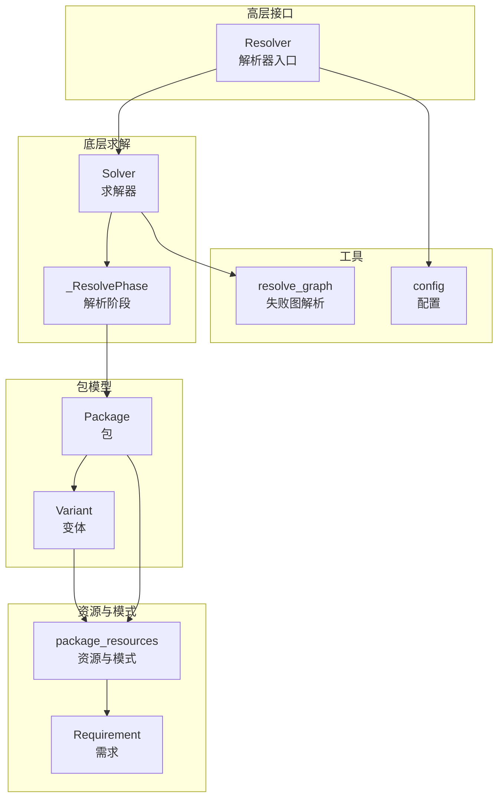
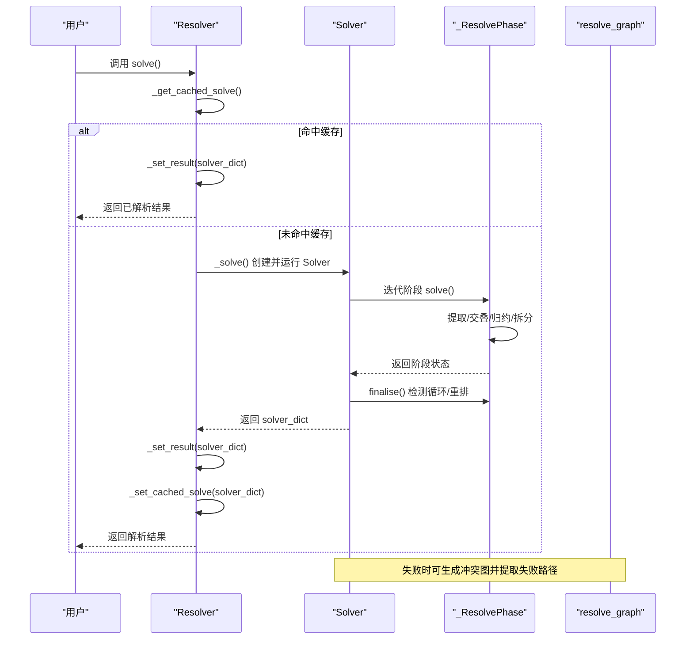
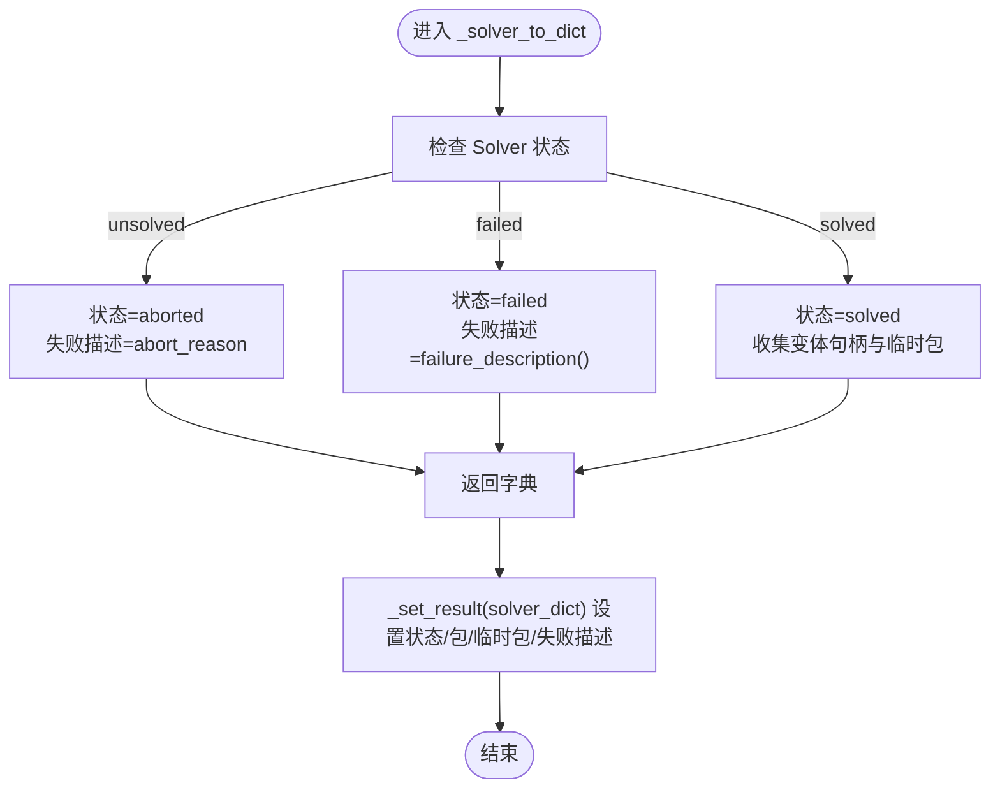
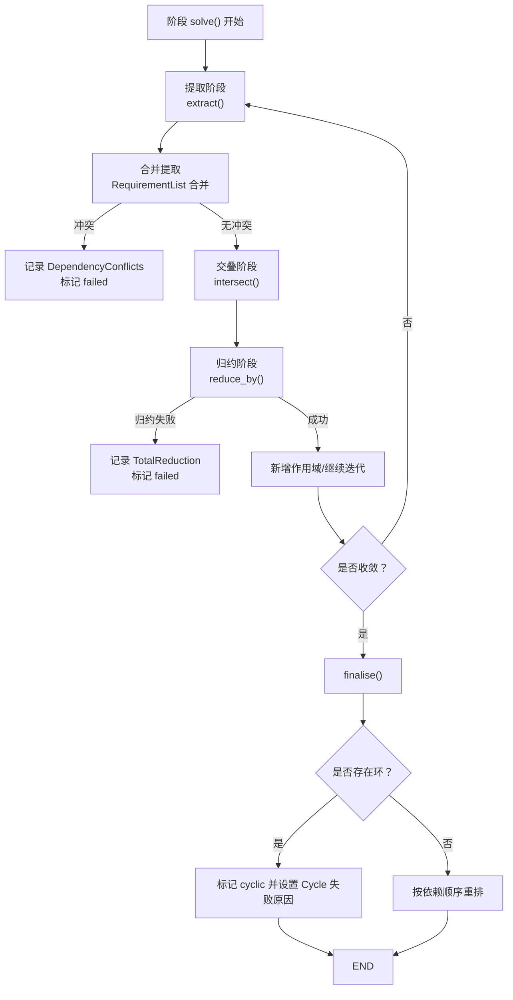
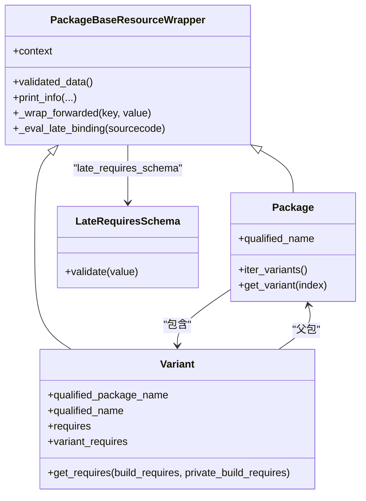
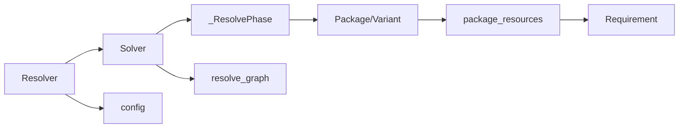

# 复杂依赖处理

<cite>
**本文引用的文件列表**
- [resolver.py](file://rez-3.3.0/src/rez/resolver.py)
- [solver.py](file://rez-3.3.0/src/rez/solver.py)
- [packages.py](file://rez-3.3.0/src/rez/packages.py)
- [_requirement.py](file://rez-3.3.0/src/rez/version/_requirement.py)
- [package_resources.py](file://rez-3.3.0/src/rez/package_resources.py)
- [resolve_graph.py](file://rez-3.3.0/src/rez/utils/resolve_graph.py)
- [SOLVER.md](file://rez-3.3.0/src/rez/SOLVER.md)
- [config.py](file://rez-3.3.0/src/rez/config.py)
- [test_rex.py](file://rez-3.3.0/src/rez/tests/test_rex.py)
</cite>

## 目录
1. [引言](#引言)
2. [项目结构](#项目结构)
3. [核心组件](#核心组件)
4. [架构总览](#架构总览)
5. [详细组件分析](#详细组件分析)
6. [依赖关系分析](#依赖关系分析)
7. [性能考量](#性能考量)
8. [故障排查指南](#故障排查指南)
9. [结论](#结论)

## 引言
本文件聚焦于Rez在复杂依赖场景下的处理机制，围绕以下目标展开：
- 解释Resolver在遇到循环依赖、版本冲突和弱引用时的具体处理策略
- 利用resolver.py中的_solve与_set_result方法，说明解析失败时的错误描述生成机制
- 通过packages.py中的Package与Variant类，展示如何加载与验证包的requires字段，以及如何处理延迟绑定的依赖（late_requires）
- 提供使用--verbose标志进行诊断的实践方法

## 项目结构
Rez的核心解析流程由两层组成：高层的Resolver负责缓存、状态管理与结果封装；底层的Solver负责具体的依赖提取、合并、交叠、归约与拆分，并在失败时输出详细的冲突图与失败原因。

图表来源
- [resolver.py](file://rez-3.3.0/src/rez/resolver.py#L114-L171)
- [solver.py](file://rez-3.3.0/src/rez/solver.py#L1883-L1975)
- [packages.py](file://rez-3.3.0/src/rez/packages.py#L186-L214)
- [package_resources.py](file://rez-3.3.0/src/rez/package_resources.py#L123-L147)
- [_requirement.py](file://rez-3.3.0/src/rez/version/_requirement.py#L106-L184)
- [resolve_graph.py](file://rez-3.3.0/src/rez/utils/resolve_graph.py#L40-L117)
- [config.py](file://rez-3.3.0/src/rez/config.py#L469-L492)

章节来源
- [resolver.py](file://rez-3.3.0/src/rez/resolver.py#L114-L171)
- [solver.py](file://rez-3.3.0/src/rez/solver.py#L1883-L1975)

## 核心组件
- Resolver：封装缓存、状态、结果转换与失败描述生成，协调Solver执行求解。
- Solver：实现依赖提取、合并、交叠、归约、拆分等算法步骤，维护阶段栈与统计信息。
- _ResolvePhase：单次求解阶段，包含提取、交叠、归约、最终化（检测循环、重排）等子过程。
- Package/Variant：包与变体对象，支持延迟绑定（late binding），对requires进行动态求值。
- Requirement：需求表达，支持冲突（!）、弱引用（~）等语义。
- package_resources：定义包与变体的schema，含late_requires_schema用于延迟绑定的requires。
- resolve_graph：从冲突图中提取失败路径与冲突链路，辅助诊断。

章节来源
- [resolver.py](file://rez-3.3.0/src/rez/resolver.py#L114-L171)
- [solver.py](file://rez-3.3.0/src/rez/solver.py#L1883-L2000)
- [packages.py](file://rez-3.3.0/src/rez/packages.py#L186-L214)
- [_requirement.py](file://rez-3.3.0/src/rez/version/_requirement.py#L106-L184)
- [package_resources.py](file://rez-3.3.0/src/rez/package_resources.py#L66-L70)
- [resolve_graph.py](file://rez-3.3.0/src/rez/utils/resolve_graph.py#L40-L117)

## 架构总览
Resolver在solve()中优先尝试从缓存命中，未命中则调用_solver创建Solver并执行求解，随后将结果转为包变体与失败描述，再写回缓存。Solver内部以阶段栈推进，每个阶段包含多轮提取、交叠、归约与拆分，最终在finalise中检测循环依赖并按依赖顺序重排。

图表来源
- [resolver.py](file://rez-3.3.0/src/rez/resolver.py#L114-L171)
- [resolver.py](file://rez-3.3.0/src/rez/resolver.py#L397-L475)
- [solver.py](file://rez-3.3.0/src/rez/solver.py#L2094-L2212)
- [solver.py](file://rez-3.3.0/src/rez/solver.py#L1475-L1518)
- [resolve_graph.py](file://rez-3.3.0/src/rez/utils/resolve_graph.py#L40-L117)

## 详细组件分析

### Resolver：解析失败的错误描述生成
- _solver_to_dict：将Solver的状态、时间、失败描述、变体句柄与临时包（ephemerals）序列化为字典，供缓存与结果转换使用。
- _set_result：根据solver_dict设置Resolver的状态、解析出的包与临时包、失败描述等。
- 失败描述来源：
  - 当Solver状态为unsolved且被回调强制失败时，使用回调提供的abort_reason。
  - 当Solver状态为failed或cyclic时，使用phase.failure_reason.description()生成人类可读描述。
  - 若phase.failure_reason为空，则返回“未知原因”。

图表来源
- [resolver.py](file://rez-3.3.0/src/rez/resolver.py#L438-L475)
- [resolver.py](file://rez-3.3.0/src/rez/resolver.py#L415-L437)
- [solver.py](file://rez-3.3.0/src/rez/solver.py#L2212-L2285)

章节来源
- [resolver.py](file://rez-3.3.0/src/rez/resolver.py#L415-L475)
- [solver.py](file://rez-3.3.0/src/rez/solver.py#L2212-L2285)

### Solver与阶段：循环依赖、版本冲突与弱引用处理
- 循环依赖检测：finalise中构建最小依赖图，若存在环，则将phase标记为cyclic并设置failure_reason=Cycle，Solver状态转为failed。
- 版本冲突处理：在多个阶段步骤中，当交叠或归约导致范围为空或冲突时，记录DependencyConflicts或TotalReduction等failure_reason，并终止当前阶段。
- 弱引用（~）语义：Requirement内部将“~foo”解析为“!~foo”，即“若出现则必须满足范围”的非强制约束；在求解过程中作为冲突的逆向逻辑参与交叠与归约。

图表来源
- [solver.py](file://rez-3.3.0/src/rez/solver.py#L1223-L1518)
- [_requirement.py](file://rez-3.3.0/src/rez/version/_requirement.py#L156-L184)

章节来源
- [solver.py](file://rez-3.3.0/src/rez/solver.py#L1223-L1518)
- [_requirement.py](file://rez-3.3.0/src/rez/version/_requirement.py#L156-L184)

### 包加载与验证：requires与late_requires
- Package/Variant类继承自PackageBaseResourceWrapper，支持任意键访问与延迟绑定。
- late_requires_schema：允许requires字段为字符串或函数形式，函数在运行时根据上下文求值，并通过schema校验。
- requires拼接：Variant.requires会合并父包的requires与自身变体特定的requires（variant_requires）。

图表来源
- [packages.py](file://rez-3.3.0/src/rez/packages.py#L71-L182)
- [packages.py](file://rez-3.3.0/src/rez/packages.py#L186-L214)
- [packages.py](file://rez-3.3.0/src/rez/packages.py#L324-L433)
- [package_resources.py](file://rez-3.3.0/src/rez/package_resources.py#L66-L70)

章节来源
- [packages.py](file://rez-3.3.0/src/rez/packages.py#L71-L182)
- [packages.py](file://rez-3.3.0/src/rez/packages.py#L324-L433)
- [package_resources.py](file://rez-3.3.0/src/rez/package_resources.py#L66-L70)

### 临时包（Ephemerals）与弱引用
- 弱引用（~）：表示“若出现则必须满足范围”的非强制约束，内部转换为冲突的逆向逻辑参与求解。
- 临时包（.foo-1）：在解析期间如同真实包一样参与交叠与冲突检测，但不会实际配置环境。
- 测试覆盖：对ephemerals.get/get_range与intersects行为进行了单元测试，确保在空集合与默认值场景下行为一致。

章节来源
- [_requirement.py](file://rez-3.3.0/src/rez/version/_requirement.py#L156-L184)
- [test_rex.py](file://rez-3.3.0/src/rez/tests/test_rex.py#L505-L552)

## 依赖关系分析
- Resolver依赖Solver与缓存系统，负责状态转换与失败描述生成。
- Solver依赖PackageVariantCache与阶段栈，驱动提取、交叠、归约与拆分。
- Package/Variant依赖package_resources的schema与late_requires_schema，支持延迟绑定。
- resolve_graph依赖Solver生成的冲突图，提取失败路径与冲突链路。

图表来源
- [resolver.py](file://rez-3.3.0/src/rez/resolver.py#L114-L171)
- [solver.py](file://rez-3.3.0/src/rez/solver.py#L1883-L1975)
- [packages.py](file://rez-3.3.0/src/rez/packages.py#L186-L214)
- [package_resources.py](file://rez-3.3.0/src/rez/package_resources.py#L123-L147)
- [resolve_graph.py](file://rez-3.3.0/src/rez/utils/resolve_graph.py#L40-L117)
- [config.py](file://rez-3.3.0/src/rez/config.py#L469-L492)

章节来源
- [resolver.py](file://rez-3.3.0/src/rez/resolver.py#L114-L171)
- [solver.py](file://rez-3.3.0/src/rez/solver.py#L1883-L1975)
- [packages.py](file://rez-3.3.0/src/rez/packages.py#L186-L214)
- [package_resources.py](file://rez-3.3.0/src/rez/package_resources.py#L123-L147)
- [resolve_graph.py](file://rez-3.3.0/src/rez/utils/resolve_graph.py#L40-L117)
- [config.py](file://rez-3.3.0/src/rez/config.py#L469-L492)

## 性能考量
- 缓存：Resolver支持Memcached缓存，通过_memcache_key组合请求、仓库ID、过滤器哈希、排序器哈希、构建/测试标记、剪枝开关与可选时间戳生成键，避免重复求解。
- 统计：Solver维护提取、交叠、归约的次数与耗时，便于定位瓶颈。
- 剪枝：失败图可按配置裁剪无关节点，减少输出体积。

章节来源
- [resolver.py](file://rez-3.3.0/src/rez/resolver.py#L375-L413)
- [resolver.py](file://rez-3.3.0/src/rez/resolver.py#L321-L374)
- [solver.py](file://rez-3.3.0/src/rez/solver.py#L2125-L2160)

## 故障排查指南

### 使用--verbose进行诊断
- verbosity级别控制打印细节：
  - verbosity>2：启用详细日志，包括请求合并、提取、交叠、归约、拆分、阶段推进等步骤。
  - verbosity>0：输出SOLVE STATS统计信息。
- 实践建议：
  - 在命令行传入--verbose或设置config.debug_resolve_memcache等调试开关，观察“request/merged request/EXTRACTING/INTERSECTING/REDUCING/SPLITTING/SOLVE STATS”等段落。
  - 结合SOLVER.md中的步骤说明理解每一步含义。

章节来源
- [solver.py](file://rez-3.3.0/src/rez/solver.py#L104-L155)
- [SOLVER.md](file://rez-3.3.0/src/rez/SOLVER.md#L186-L219)
- [config.py](file://rez-3.3.0/src/rez/config.py#L469-L492)

### 失败原因与失败图
- Solver.failure_reason/failure_description：根据最近一次失败或回调失败返回具体原因与描述。
- resolve_graph.failure_detail_from_graph：从冲突图中提取“从初始请求到冲突/循环”的路径，帮助定位问题链条。
- 常见失败类型：
  - DependencyConflicts：请求之间存在冲突。
  - TotalReduction：归约导致范围为空。
  - Cycle：检测到循环依赖。

章节来源
- [solver.py](file://rez-3.3.0/src/rez/solver.py#L2212-L2285)
- [resolve_graph.py](file://rez-3.3.0/src/rez/utils/resolve_graph.py#L40-L117)

### 包缺失与变体requires缺失
- 当从提取阶段新增作用域时，若找不到包族，Solver会尝试定位“由谁请求了该缺失包”，并在config.error_on_missing_variant_requires为False时输出更详细的错误信息后失败。
- 建议：
  - 检查package_paths与仓库可用性。
  - 确认变体requires中引用的包名正确且存在于仓库。

章节来源
- [solver.py](file://rez-3.3.0/src/rez/solver.py#L1370-L1394)

### 临时包（Ephemerals）与弱引用（~）
- 弱引用（~foo）在求解中表现为“若出现则必须满足范围”的约束，不强制存在。
- 临时包（.foo-1）参与冲突检测，但不实际配置环境。
- 可通过ephemerals.get/get_range与intersects进行查询与判断，注意默认值与范围字符串的差异。

章节来源
- [_requirement.py](file://rez-3.3.0/src/rez/version/_requirement.py#L156-L184)
- [test_rex.py](file://rez-3.3.0/src/rez/tests/test_rex.py#L505-L552)

## 结论
Rez通过Resolver与Solver的分层设计，结合缓存、统计与失败图工具，提供了对复杂依赖场景的稳健处理能力。Resolver负责失败描述生成与结果封装，Solver负责提取、交叠、归约与拆分，并在finalise中检测循环依赖。Package/Variant支持延迟绑定的requires，配合late_requires_schema实现灵活的依赖声明。借助--verbose与resolve_graph，用户可以深入理解失败路径并快速定位问题。