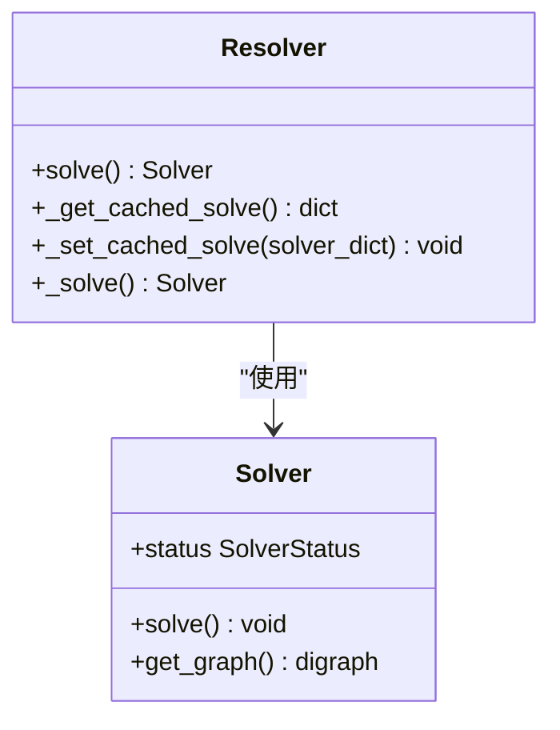
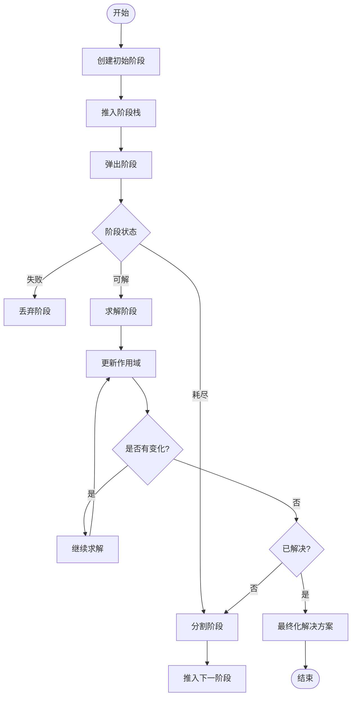
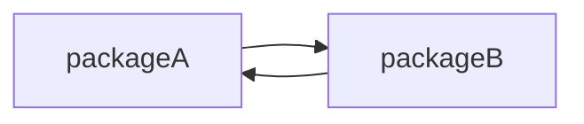

# 安装时的依赖解析

<cite>
**本文档中引用的文件**  
- [resolver.py](file://rez-3.3.0\src\rez\resolver.py)
- [solver.py](file://rez-3.3.0\src\rez\solver.py)
- [SOLVER.md](file://rez-3.3.0\src\rez\SOLVER.md)
- [myapp\1.0.0\package.py](file://my_packages\myapp\1.0.0\package.py)
- [python\3.11.0\package.py](file://my_packages\python\3.11.0\package.py)
- [python\3.9.0\package.py](file://my_packages\python\3.9.0\package.py)
</cite>

## 目录
1. [简介](#简介)
2. [依赖解析核心机制](#依赖解析核心机制)
3. [基于myapp包的依赖解析流程](#基于myapp包的依赖解析流程)
4. [循环依赖、版本冲突与弱引用处理](#循环依赖版本冲突与弱引用处理)
5. [预解析验证与诊断实践](#预解析验证与诊断实践)
6. [总结](#总结)

## 简介

在Rez包管理系统中，安装时的依赖解析是一个关键过程，它确保了所有依赖项的版本兼容性和变体一致性。通过`resolver.py`中的求解算法，系统能够动态地解析依赖树，处理复杂的依赖关系，并解决可能出现的版本冲突和循环依赖问题。本文档将详细介绍这一过程，并结合`myapp`包的`package.py`文件来展示`requires`字段如何触发递归依赖查找和版本约束求解。

## 依赖解析核心机制

### 解析器与求解器架构

Rez的依赖解析由`Resolver`类和`Solver`类共同完成。`Resolver`负责管理整个解析过程，包括缓存机制和状态跟踪，而`Solver`则专注于实际的依赖求解逻辑。



**图源**  
- [resolver.py](file://rez-3.3.0\src\rez\resolver.py#L32-L475)
- [solver.py](file://rez-3.3.0\src\rez\solver.py#L1-L2437)

### 求解算法工作流程

根据`SOLVER.md`文档，求解算法的工作流程可以分为以下几个步骤：

1. **EXTRACT（提取）**：当一个作用域内的所有变体都依赖于同一个包时，该依赖被提取出来。
2. **MERGE-EXTRACTIONS（合并提取）**：将多个提取出的依赖请求合并成一个新的请求列表。
3. **INTERSECT（交集）**：当提取出的依赖与现有作用域重叠时，进行交集操作以缩小范围。
4. **ADD（添加）**：当提取出的新依赖是一个新的包请求时，创建一个新的作用域并添加到当前作用域列表中。
5. **REDUCE（减少）**：遍历作用域中的所有变体，移除与另一个作用域冲突的变体。
6. **SPLIT（分割）**：当一个阶段被耗尽后，选择第一个包含多个变体的作用域进行分割，生成两个新的阶段。



**图源**  
- [SOLVER.md](file://rez-3.3.0\src\rez\SOLVER.md#L1-L266)

## 基于myapp包的依赖解析流程

### myapp包定义分析

`myapp`包的`package.py`文件定义了其基本属性和依赖关系：

```python
name = "myapp"
version = "1.0.0"
description = "A sample Rez package"
authors = ["Your Name"]

requires = []  # 留空表示无依赖

def commands():
    import os
    env.MYAPP_ROOT = "{root}"
    env.PATH.append("{root}/bin")
    env.PYTHONPATH.append("{root}/lib")

variants = [
    ["python-3.7"],
    ["python-3.9"],
    ["python-3.11"],
]
```

**节源**  
- [myapp\1.0.0\package.py](file://my_packages\myapp\1.0.0\package.py#L1-L33)

### 依赖触发与递归查找

尽管`myapp`包本身没有直接依赖，但其变体定义了对不同Python版本的需求。当安装`myapp`时，解析器会根据所选变体递归查找相应的Python包。

例如，如果选择了`python-3.11`变体，解析器将查找`python-3.11.0`包：

```python
name = "python"
version = "3.11.0"
description = "placeholder"
authors = ["占位"]
requires = []
variants = [[]]
```

**节源**  
- [python\3.11.0\package.py](file://my_packages\python\3.11.0\package.py#L1-L8)

### 版本约束求解

解析器会检查所选Python版本是否满足`myapp`包的要求。由于`myapp`包的`requires`字段为空，这意味着它不强制要求特定版本的Python，而是依赖于变体定义来确定兼容性。

## 循环依赖、版本冲突与弱引用处理

### 循环依赖检测

当存在循环依赖时，求解器会检测到并标记为失败。例如，如果`packageA`依赖于`packageB`，而`packageB`又依赖于`packageA`，则形成循环依赖。



**图源**  
- [SOLVER.md](file://rez-3.3.0\src\rez\SOLVER.md#L1-L266)

### 版本冲突解决

当不同包对同一依赖有不同的版本要求时，求解器会尝试找到一个满足所有条件的版本。如果无法找到，则标记为失败。

例如，`pyfoo`包需要`python-2.6`，而`pybah`包需要`python-2.5`，这会导致版本冲突：

```python
name = "pyfoo"
version = "3.1.0"
requires = ["python-2.6"]

name = "pybah"
version = "5"
requires = ["python-2.5"]
```

**节源**  
- [pyfoo\3.1.0\package.py](file://rez-3.3.0\src\rez\data\tests\solver\packages\pyfoo\3.1.0\package.py#L1-L5)
- [pybah\5\package.py](file://rez-3.3.0\src\rez\data\tests\solver\packages\pybah\5\package.py#L1-L5)

### 弱引用处理

弱引用（以`~`开头）表示可选依赖。求解器会尝试满足这些依赖，但如果无法满足也不会导致解析失败。

例如，`test_weakly_reference_requires`包定义了对两个包的弱引用：

```python
name = "test_weakly_reference_requires"
version = "2.0"
requires = ["~test_variant_split_mid1", "~test_variant_split_mid2"]
```

**节源**  
- [test_weakly_reference_requires\2.0\package.py](file://rez-3.3.0\src\rez\data\tests\solver\packages\test_weakly_reference_requires\2.0\package.py#L1-L4)

## 预解析验证与诊断实践

### 使用rez-env进行预解析验证

可以通过`rez-env`命令结合`--verbose`模式来预解析和验证依赖关系：

```bash
rez-env myapp --verbose
```

这将输出详细的解析过程信息，帮助诊断潜在问题。

### 诊断解析失败原因

当解析失败时，可以通过以下方法诊断具体原因：

1. **查看失败描述**：`Resolver`对象的`failure_description`属性提供了失败的具体原因。
2. **分析解析图**：使用`get_graph()`方法获取解析图，可视化地分析依赖关系。
3. **启用调试输出**：通过设置环境变量`REZ_DEBUG_RESOLVE=1`来启用更详细的调试输出。

```python
from rez.resolver import Resolver
from rez.package_requests import PackageRequest

requests = [PackageRequest("myapp")]
resolver = Resolver(requests, package_paths=["/path/to/packages"])
resolver.solve()

if resolver.status == ResolverStatus.failed:
    print(resolver.failure_description)
```

**节源**  
- [resolver.py](file://rez-3.3.0\src\rez\resolver.py#L32-L475)

## 总结

Rez的依赖解析机制通过`Resolver`和`Solver`类的协同工作，实现了高效且可靠的依赖管理。通过理解`requires`字段的作用、变体一致性的重要性以及如何处理循环依赖和版本冲突，开发者可以更好地设计和维护复杂的软件包依赖关系。此外，利用`rez-env`和`--verbose`模式进行预解析验证和诊断，有助于及时发现和解决问题，确保软件环境的稳定性和可靠性。