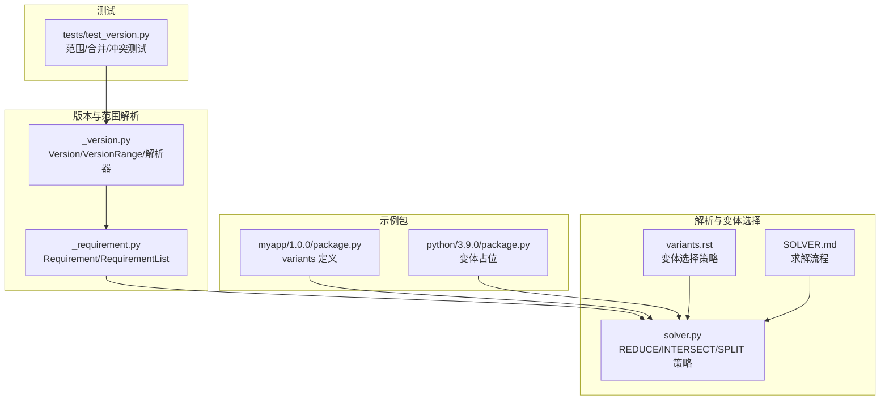
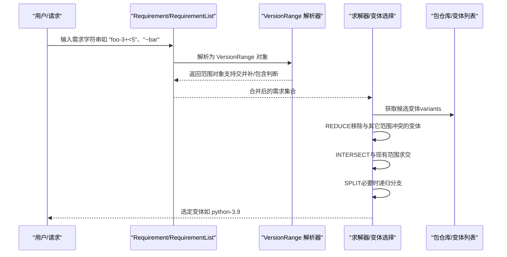
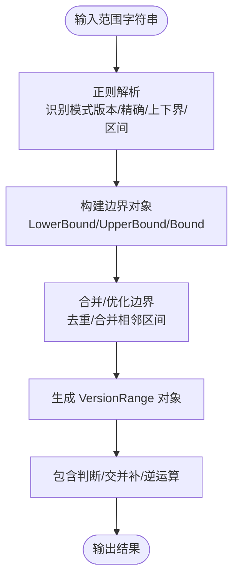
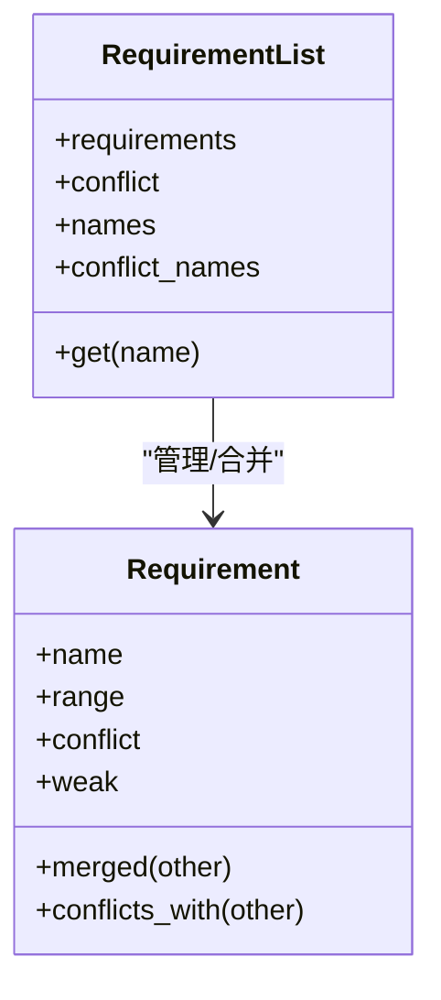
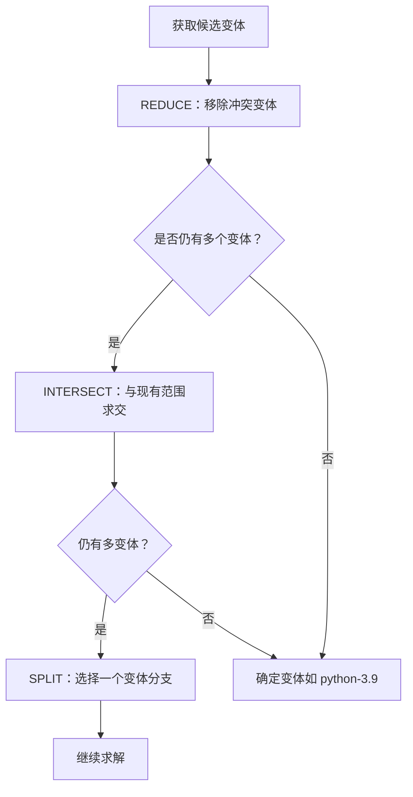
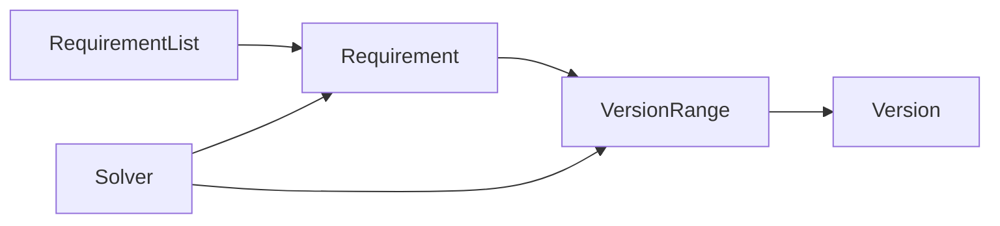

# 版本兼容性与变体一致性

<cite>
**本文引用的文件**
- [rez-3.3.0/src/rez/version/_version.py](file://rez-3.3.0/src/rez/version/_version.py)
- [rez-3.3.0/src/rez/version/_requirement.py](file://rez-3.3.0/src/rez/version/_requirement.py)
- [my_packages/myapp/1.0.0/package.py](file://my_packages/myapp/1.0.0/package.py)
- [my_packages/python/3.9.0/package.py](file://my_packages/python/3.9.0/variant/package.py)
- [rez-3.3.0/docs/source/variants.rst](file://rez-3.3.0/docs/source/variants.rst)
- [rez-3.3.0/src/rez/solver.py](file://rez-3.3.0/src/rez/solver.py)
- [rez-3.3.0/src/rez/tests/test_version.py](file://rez-3.3.0/src/rez/tests/test_version.py)
- [rez-3.3.0/SOLVER.md](file://rez-3.3.0/SOLVER.md)
</cite>

## 目录
1. [引言](#引言)
2. [项目结构](#项目结构)
3. [核心组件](#核心组件)
4. [架构总览](#架构总览)
5. [详细组件分析](#详细组件分析)
6. [依赖关系分析](#依赖关系分析)
7. [性能考量](#性能考量)
8. [故障排查指南](#故障排查指南)
9. [结论](#结论)
10. [附录](#附录)

## 引言
本文件围绕 Rez 的版本兼容性与变体一致性展开，重点解释：
- 基于版本模块对版本范围字符串的解析与匹配（如 ==、>=、~= 等）
- 结合 myapp 包的 variants 字段，说明 Python 变体如何定义与解析
- 解析器如何确保所选包的变体（如 python-3.9）与请求环境一致
- 多变体场景下的解析策略与冲突避免机制

## 项目结构
本仓库包含 Rez 源码、示例包与文档。与本主题直接相关的关键位置如下：
- 版本与范围解析：rez-3.3.0/src/rez/version/_version.py、_requirement.py
- 示例包定义：my_packages/myapp/1.0.0/package.py、my_packages/python/3.9.0/package.py
- 变体行为文档：rez-3.3.0/docs/source/variants.rst
- 解析算法与变体选择：rez-3.3.0/src/rez/solver.py、SOLVER.md
- 单元测试：rez-3.3.0/src/rez/tests/test_version.py

图表来源
- [rez-3.3.0/src/rez/version/_version.py](file://rez-3.3.0/src/rez/version/_version.py#L589-L856)
- [rez-3.3.0/src/rez/version/_requirement.py](file://rez-3.3.0/src/rez/version/_requirement.py#L106-L184)
- [my_packages/myapp/1.0.0/package.py](file://my_packages/myapp/1.0.0/package.py#L24-L33)
- [my_packages/python/3.9.0/package.py](file://my_packages/python/3.9.0/package.py#L1-L8)
- [rez-3.3.0/src/rez/solver.py](file://rez-3.3.0/src/rez/solver.py#L429-L459)
- [rez-3.3.0/docs/source/variants.rst](file://rez-3.3.0/docs/source/variants.rst#L143-L200)
- [rez-3.3.0/src/rez/tests/test_version.py](file://rez-3.3.0/src/rez/tests/test_version.py#L172-L200)
- [rez-3.3.0/SOLVER.md](file://rez-3.3.0/SOLVER.md#L11-L57)

章节来源
- [rez-3.3.0/src/rez/version/_version.py](file://rez-3.3.0/src/rez/version/_version.py#L589-L856)
- [rez-3.3.0/src/rez/version/_requirement.py](file://rez-3.3.0/src/rez/version/_requirement.py#L106-L184)
- [my_packages/myapp/1.0.0/package.py](file://my_packages/myapp/1.0.0/package.py#L24-L33)
- [my_packages/python/3.9.0/package.py](file://my_packages/python/3.9.0/package.py#L1-L8)
- [rez-3.3.0/src/rez/solver.py](file://rez-3.3.0/src/rez/solver.py#L429-L459)
- [rez-3.3.0/docs/source/variants.rst](file://rez-3.3.0/docs/source/variants.rst#L143-L200)
- [rez-3.3.0/src/rez/tests/test_version.py](file://rez-3.3.0/src/rez/tests/test_version.py#L172-L200)
- [rez-3.3.0/SOLVER.md](file://rez-3.3.0/SOLVER.md#L11-L57)

## 核心组件
- 版本与范围解析器：负责将版本字符串与范围表达式解析为内部对象，并支持交并补、包含判断等集合运算。
- 需求对象：封装对象名、版本范围、冲突/弱引用标记，支持合并与冲突检测。
- 变体系统：通过 variants 字段定义不同变体，解析器在满足依赖的前提下选择合适的变体。
- 解析器与求解器：在多变体场景中进行 REDUCE/INTERSECT/SPLIT 等步骤，避免冲突并确定最终变体。

章节来源
- [rez-3.3.0/src/rez/version/_version.py](file://rez-3.3.0/src/rez/version/_version.py#L813-L1277)
- [rez-3.3.0/src/rez/version/_requirement.py](file://rez-3.3.0/src/rez/version/_requirement.py#L106-L184)
- [rez-3.3.0/src/rez/solver.py](file://rez-3.3.0/src/rez/solver.py#L429-L459)
- [rez-3.3.0/docs/source/variants.rst](file://rez-3.3.0/docs/source/variants.rst#L143-L200)

## 架构总览
下图展示了从需求字符串到变体选择的整体流程，包括版本范围解析、需求合并、冲突检测与变体筛选。

图表来源
- [rez-3.3.0/src/rez/version/_requirement.py](file://rez-3.3.0/src/rez/version/_requirement.py#L106-L184)
- [rez-3.3.0/src/rez/version/_version.py](file://rez-3.3.0/src/rez/version/_version.py#L813-L1277)
- [rez-3.3.0/src/rez/solver.py](file://rez-3.3.0/src/rez/solver.py#L429-L459)
- [rez-3.3.0/SOLVER.md](file://rez-3.3.0/SOLVER.md#L11-L57)

## 详细组件分析

### 版本范围解析与匹配（==、>=、~= 等）
- 语法与语义
  - 支持“超集”语法（如 3 表示包含 3、3.0、3.1.4 等）、下界（>=2 或 2+）、上界（<=5）、精确匹配（==2）、区间（1..5 或 1+<5）等。
  - 范围可由 “|” 连接形成多个不连续区间，并自动优化为最小覆盖。
- 解析器实现要点
  - 使用正则将输入拆分为若干子模式（版本、精确匹配、上下界、区间、逆序区间），分别调用动作函数生成边界对象。
  - 边界对象组合为不相交的 Bound 列表，再统一为 VersionRange。
- 关键能力
  - 包含判断：对给定版本判断是否落入某范围。
  - 交并补：支持范围间的集合运算。
  - 逆运算：对范围取反，用于“弱引用”或冲突排除。

图表来源
- [rez-3.3.0/src/rez/version/_version.py](file://rez-3.3.0/src/rez/version/_version.py#L589-L856)
- [rez-3.3.0/src/rez/version/_version.py](file://rez-3.3.0/src/rez/version/_version.py#L813-L1277)

章节来源
- [rez-3.3.0/src/rez/version/_version.py](file://rez-3.3.0/src/rez/version/_version.py#L589-L856)
- [rez-3.3.0/src/rez/version/_version.py](file://rez-3.3.0/src/rez/version/_version.py#L813-L1277)
- [rez-3.3.0/src/rez/tests/test_version.py](file://rez-3.3.0/src/rez/tests/test_version.py#L172-L200)

### Requirement 类与弱引用/冲突语义
- 语义说明
  - 前缀 “!” 表示冲突需求；“~” 表示弱引用（若出现则必须满足范围，否则不强制）。
  - 若仅给出 “~foo”，等价于无效果（任何版本均可）。
- 合并与冲突检测
  - 合并规则：两个同名需求按集合运算合并，冲突需求采用并/差运算，普通需求采用交运算。
  - 冲突检测：当两需求范围不相交或一方为冲突且另一方命中该范围时判定冲突。

图表来源
- [rez-3.3.0/src/rez/version/_requirement.py](file://rez-3.3.0/src/rez/version/_requirement.py#L106-L184)
- [rez-3.3.0/src/rez/version/_requirement.py](file://rez-3.3.0/src/rez/version/_requirement.py#L366-L477)

章节来源
- [rez-3.3.0/src/rez/version/_requirement.py](file://rez-3.3.0/src/rez/version/_requirement.py#L106-L184)
- [rez-3.3.0/src/rez/version/_requirement.py](file://rez-3.3.0/src/rez/version/_requirement.py#L366-L477)

### myapp 包的 variants 字段与 Python 变体
- variants 定义
  - myapp 的 variants 字段列出多个变体，每个变体是一个依赖列表，例如 ["python-3.7"]、["python-3.9"]、["python-3.11"]。
  - 这意味着同一版本的 myapp 可以针对不同 Python 版本提供编译产物或运行时配置。
- 变体占位
  - python/3.9.0/package.py 中 variants 为空数组，作为占位符，实际变体由 myapp 的 variants 决定其依赖关系。

章节来源
- [my_packages/myapp/1.0.0/package.py](file://my_packages/myapp/1.0.0/package.py#L24-L33)
- [my_packages/python/3.9.0/package.py](file://my_packages/python/3.9.0/package.py#L1-L8)

### 解析器如何确保变体与环境一致（以 python-3.9 为例）
- 变体筛选流程
  - REDUCE：遍历当前作用域的变体，移除与其它范围冲突的变体条目。
  - INTERSECT：将提取出的依赖范围与现有范围求交，缩小可行范围。
  - SPLIT：当某作用域仍有多个变体时，选择一个变体进行分支，继续求解。
- 变体优先级
  - 默认模式为“版本优先”，优先选择更高版本的依赖；若依赖出现在请求列表中，则优先该依赖。
  - 另一种模式为“交集优先”，优先选择与请求列表有更多交集的变体。

图表来源
- [rez-3.3.0/src/rez/solver.py](file://rez-3.3.0/src/rez/solver.py#L429-L459)
- [rez-3.3.0/SOLVER.md](file://rez-3.3.0/SOLVER.md#L11-L57)
- [rez-3.3.0/docs/source/variants.rst](file://rez-3.3.0/docs/source/variants.rst#L143-L200)

章节来源
- [rez-3.3.0/src/rez/solver.py](file://rez-3.3.0/src/rez/solver.py#L429-L459)
- [rez-3.3.0/SOLVER.md](file://rez-3.3.0/SOLVER.md#L11-L57)
- [rez-3.3.0/docs/source/variants.rst](file://rez-3.3.0/docs/source/variants.rst#L143-L200)

### 多变体解析策略与冲突避免
- 冲突避免
  - REDUCE 步骤会缓存冲突测试结果，避免重复计算；当某变体的依赖与请求冲突时，将其剔除。
  - 若某一作用域的所有变体都被剔除，求解失败（称为“完全缩减”）。
- 分支策略
  - 当作用域无法进一步收敛时，选择第一个多变体的作用域进行 SPLIT，将作用域拆分为两个分支，分别尝试，直到收敛或失败。
- 弱引用与冲突
  - “~foo” 不强制 foo 出现，但若出现则必须满足范围；这在变体选择中可用于“尽量满足但不强求”的场景。

章节来源
- [rez-3.3.0/src/rez/solver.py](file://rez-3.3.0/src/rez/solver.py#L655-L723)
- [rez-3.3.0/src/rez/version/_requirement.py](file://rez-3.3.0/src/rez/version/_requirement.py#L106-L184)
- [rez-3.3.0/src/rez/tests/test_version.py](file://rez-3.3.0/src/rez/tests/test_version.py#L305-L360)

## 依赖关系分析
- 组件耦合
  - Requirement/RequirementList 依赖 VersionRange 进行范围运算与冲突检测。
  - VersionRange 依赖 Version 与自定义 Token 实现进行版本比较与排序。
  - 求解器依赖上述组件完成 REDUCE/INTERSECT/SPLIT 流程。
- 外部依赖
  - 正则表达式用于范围字符串解析。
  - 测试用例验证范围解析、集合运算与冲突处理的正确性。

图表来源
- [rez-3.3.0/src/rez/version/_requirement.py](file://rez-3.3.0/src/rez/version/_requirement.py#L106-L184)
- [rez-3.3.0/src/rez/version/_version.py](file://rez-3.3.0/src/rez/version/_version.py#L813-L1277)
- [rez-3.3.0/src/rez/solver.py](file://rez-3.3.0/src/rez/solver.py#L429-L459)

章节来源
- [rez-3.3.0/src/rez/version/_requirement.py](file://rez-3.3.0/src/rez/version/_requirement.py#L106-L184)
- [rez-3.3.0/src/rez/version/_version.py](file://rez-3.3.0/src/rez/version/_version.py#L813-L1277)
- [rez-3.3.0/src/rez/solver.py](file://rez-3.3.0/src/rez/solver.py#L429-L459)

## 性能考量
- 范围解析
  - 使用正则一次性解析并分派到对应动作，避免重复编译正则。
  - 边界合并采用排序与线性扫描，复杂度近似 O(n log n)。
- 版本包含判断
  - 小规模范围内使用线性扫描，大规模有序序列使用二分查找加速。
- 冲突检测缓存
  - 求解器对冲突测试结果进行缓存，减少重复计算。
- 变体排序
  - 变体键值综合考虑“请求中出现的依赖数量”、“与请求的交集大小”、“版本优先级”等因素，排序后选择最优变体。

章节来源
- [rez-3.3.0/src/rez/version/_version.py](file://rez-3.3.0/src/rez/version/_version.py#L1132-L1204)
- [rez-3.3.0/src/rez/solver.py](file://rez-3.3.0/src/rez/solver.py#L429-L459)

## 故障排查指南
- 常见问题
  - 无效范围语法：如 “>3<3”、“<”、“><” 等，解析器会抛出异常。
  - 范围矛盾：如 “3+<2”，下界大于上界，解析器会抛出异常。
  - 冲突需求导致无解：当所有变体均被 REDUCE 移除，求解失败。
- 排查步骤
  - 检查需求字符串是否符合范围语法规范。
  - 使用 RequirementList 合并需求，观察是否存在冲突。
  - 在变体较多的情况下启用“交集优先”模式，以提升可预测性。
  - 查看求解日志（如 solver 中的 reduction/intersect/split 输出）定位冲突来源。

章节来源
- [rez-3.3.0/src/rez/tests/test_version.py](file://rez-3.3.0/src/rez/tests/test_version.py#L305-L360)
- [rez-3.3.0/src/rez/solver.py](file://rez-3.3.0/src/rez/solver.py#L655-L723)

## 结论
- Rez 的版本范围解析器提供了灵活而严格的范围表达能力，支持多种常见语法与集合运算。
- Requirement 类通过“冲突/弱引用”语义，使变体选择更加灵活，同时保留冲突避免机制。
- 变体系统通过 variants 字段定义不同变体，解析器在 REDUCE/INTERSECT/SPLIT 流程中保证与环境一致，并在多变体场景下提供可预测的选择策略。
- 在存在多个变体时，建议明确请求范围并根据场景选择“版本优先”或“交集优先”模式，以降低不确定性。

## 附录
- 变体选择模式说明
  - 版本优先：优先更高版本的依赖，若依赖出现在请求列表中则优先该依赖。
  - 交集优先：优先与请求列表有更多交集的变体，版本优先为次优条件。
- 参考文档
  - 变体行为与选择策略：[variants.rst](file://rez-3.3.0/docs/source/variants.rst#L143-L200)
  - 求解流程概览：[SOLVER.md](file://rez-3.3.0/SOLVER.md#L11-L57)