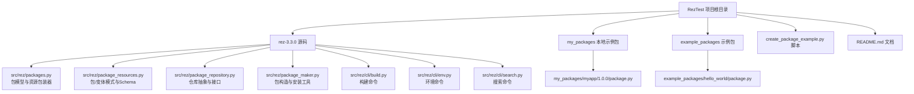
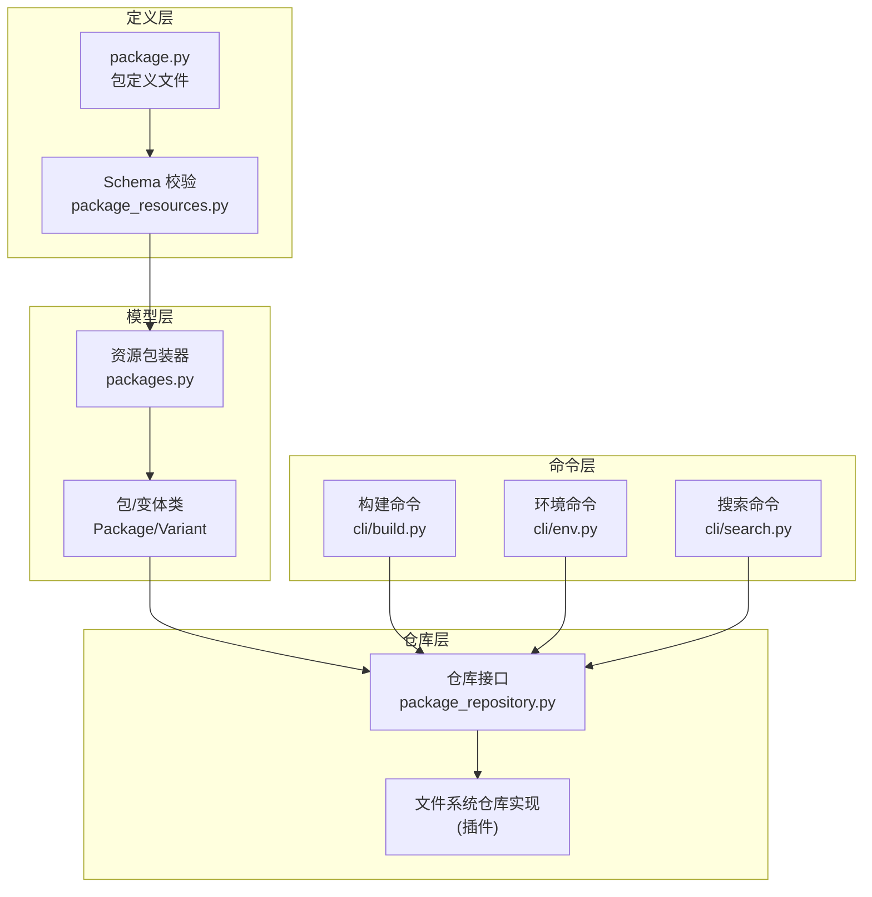
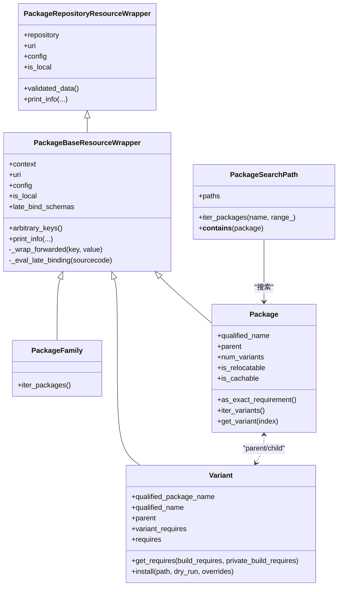
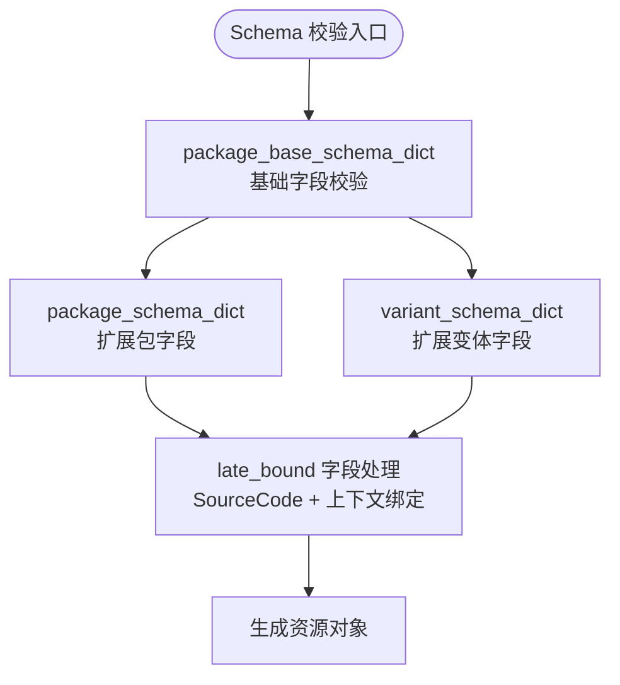
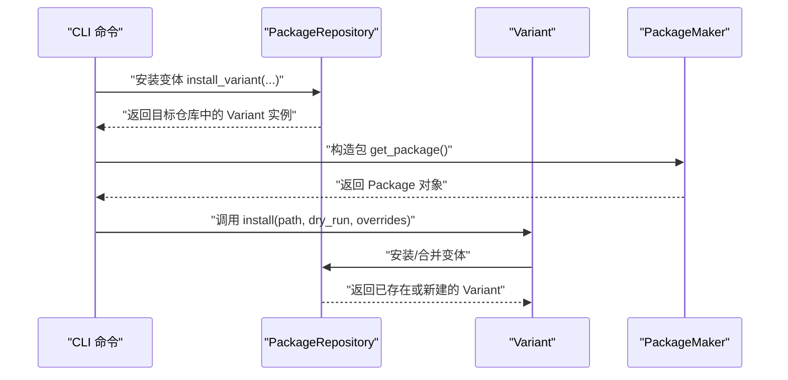
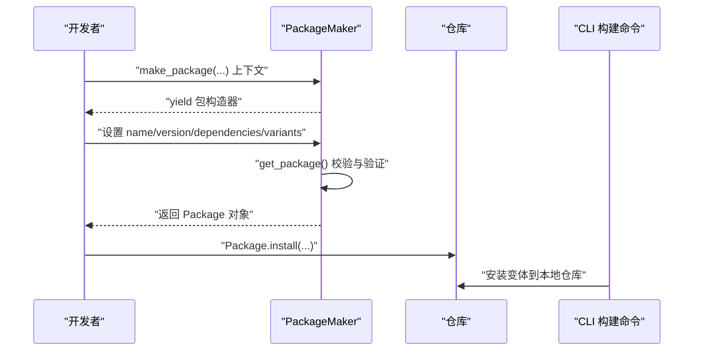
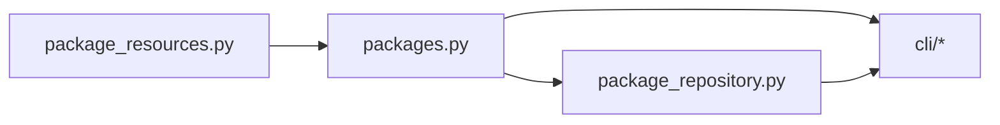

# 包管理

<cite>
**本文引用的文件**
- [packages.py](file://rez-3.3.0/src/rez/packages.py)
- [package_resources.py](file://rez-3.3.0/src/rez/package_resources.py)
- [package_repository.py](file://rez-3.3.0/src/rez/package_repository.py)
- [package_maker.py](file://rez-3.3.0/src/rez/package_maker.py)
- [build.py](file://rez-3.3.0/src/rez/cli/build.py)
- [env.py](file://rez-3.3.0/src/rez/cli/env.py)
- [search.py](file://rez-3.3.0/src/rez/cli/search.py)
- [hello_world/package.py](file://rez-3.3.0/example_packages/hello_world/package.py)
- [myapp/1.0.0/package.py](file://my_packages/myapp/1.0.0/package.py)
- [create_package_example.py](file://create_package_example.py)
- [README.md](file://README.md)
</cite>

## 目录
1. [简介](#简介)
2. [项目结构](#项目结构)
3. [核心组件](#核心组件)
4. [架构总览](#架构总览)
5. [详细组件分析](#详细组件分析)
6. [依赖关系分析](#依赖关系分析)
7. [性能考量](#性能考量)
8. [故障排查指南](#故障排查指南)
9. [结论](#结论)
10. [附录](#附录)

## 简介
本文件围绕 Rez 包管理系统的“包”这一核心对象，系统性阐述如何定义、创建、安装与卸载 Rez 包；结合 packages.py 的实现解释包的内部工作机制；通过 myapp 与 hello_world 示例包展示 package.py 的结构与字段用法；覆盖版本控制、元数据定义与依赖声明；给出从初始化到发布的完整工作流程；并总结最佳实践、常见陷阱与性能优化建议。目标是帮助读者在不深入源码的前提下，也能高效掌握 Rez 包管理。

## 项目结构
RezTest 仓库包含 Rez 源码与本地示例包，便于边学边用：
- Rez 源码位于 rez-3.3.0/src/rez 下，涵盖包模型、资源模式、仓库接口、构建与 CLI 等模块
- 示例包 hello_world 位于 example_packages/hello_world，用于演示
- 本地示例包 myapp 位于 my_packages/myapp/1.0.0，包含 package.py、bin、lib 等
- create_package_example.py 提供创建包的脚本化流程演示
- README.md 提供总体说明与学习路径

图表来源
- [README.md](file://README.md#L38-L58)
- [packages.py](file://rez-3.3.0/src/rez/packages.py#L1-L120)
- [package_resources.py](file://rez-3.3.0/src/rez/package_resources.py#L90-L170)
- [package_repository.py](file://rez-3.3.0/src/rez/package_repository.py#L1-L120)
- [package_maker.py](file://rez-3.3.0/src/rez/package_maker.py#L1-L120)
- [build.py](file://rez-3.3.0/src/rez/cli/build.py#L1-L120)
- [env.py](file://rez-3.3.0/src/rez/cli/env.py#L1-L120)
- [search.py](file://rez-3.3.0/src/rez/cli/search.py#L1-L120)
- [hello_world/package.py](file://rez-3.3.0/example_packages/hello_world/package.py#L1-L29)
- [myapp/1.0.0/package.py](file://my_packages/myapp/1.0.0/package.py#L1-L33)

章节来源
- [README.md](file://README.md#L38-L58)

## 核心组件
- 包模型与资源包装器：packages.py 定义了 Package、Variant、PackageFamily 等类，以及资源包装器与延迟绑定机制，负责包的生命周期与属性访问
- 包资源模式：package_resources.py 定义了包/变体的 Schema，约束元数据字段、依赖声明、命令块等
- 仓库接口：package_repository.py 抽象了包仓库的统一接口，支持不同存储后端
- 包构造与安装：package_maker.py 提供 PackageMaker 与 make_package 上下文，用于从数据或源码生成包并安装到仓库
- CLI 命令：build.py、env.py、search.py 分别对应构建、进入环境、搜索包等常用操作

章节来源
- [packages.py](file://rez-3.3.0/src/rez/packages.py#L186-L464)
- [package_resources.py](file://rez-3.3.0/src/rez/package_resources.py#L90-L170)
- [package_repository.py](file://rez-3.3.0/src/rez/package_repository.py#L59-L200)
- [package_maker.py](file://rez-3.3.0/src/rez/package_maker.py#L93-L200)
- [build.py](file://rez-3.3.0/src/rez/cli/build.py#L124-L174)
- [env.py](file://rez-3.3.0/src/rez/cli/env.py#L146-L200)
- [search.py](file://rez-3.3.0/src/rez/cli/search.py#L67-L121)

## 架构总览
Rez 的包管理由“资源模式 + 仓库接口 + 包模型 + CLI 命令”构成。包定义文件（package.py）经 Schema 校验后，被封装为资源对象；仓库负责检索、迭代与安装；CLI 提供构建、环境与搜索等操作入口。

图表来源
- [package_resources.py](file://rez-3.3.0/src/rez/package_resources.py#L90-L170)
- [packages.py](file://rez-3.3.0/src/rez/packages.py#L186-L464)
- [package_repository.py](file://rez-3.3.0/src/rez/package_repository.py#L59-L200)
- [build.py](file://rez-3.3.0/src/rez/cli/build.py#L124-L174)
- [env.py](file://rez-3.3.0/src/rez/cli/env.py#L146-L200)
- [search.py](file://rez-3.3.0/src/rez/cli/search.py#L67-L121)

## 详细组件分析

### 包模型与资源包装器（packages.py）
- PackageFamily：包族对象，提供遍历家族内包的能力
- Package：包对象，提供名称、版本、变体、可重定位性、缓存性等属性；支持打印信息、URI、上下文绑定等
- Variant：包变体对象，继承自包，提供索引、根路径、子路径等；支持合并依赖与安装到仓库
- PackageBaseResourceWrapper：延迟绑定与上下文绑定的核心基类，支持 late-bound 函数在解析时求值
- PackageSearchPath：多仓库搜索路径封装，支持去重与优先级

图表来源
- [packages.py](file://rez-3.3.0/src/rez/packages.py#L30-L120)
- [packages.py](file://rez-3.3.0/src/rez/packages.py#L186-L464)
- [packages.py](file://rez-3.3.0/src/rez/packages.py#L470-L515)

章节来源
- [packages.py](file://rez-3.3.0/src/rez/packages.py#L30-L120)
- [packages.py](file://rez-3.3.0/src/rez/packages.py#L186-L464)
- [packages.py](file://rez-3.3.0/src/rez/packages.py#L470-L515)

### 包资源模式与 Schema（package_resources.py）
- package_base_schema_dict：定义包的基础字段，如 name、version、description、authors、requires、build_requires、private_build_requires、tools、help、relocatable、cachable、tests、commands 等
- package_schema_dict / variant_schema_dict：分别扩展包与变体的 Schema
- late_bound：支持在解析时动态计算的字段（如 requires、commands 等），通过 SourceCode 与上下文绑定实现
- package_pod_schema_dict：面向序列化数据（如 YAML/JSON）的 Schema，支持字符串到对象的转换

图表来源
- [package_resources.py](file://rez-3.3.0/src/rez/package_resources.py#L90-L170)
- [package_resources.py](file://rez-3.3.0/src/rez/package_resources.py#L170-L260)

章节来源
- [package_resources.py](file://rez-3.3.0/src/rez/package_resources.py#L90-L170)
- [package_resources.py](file://rez-3.3.0/src/rez/package_resources.py#L170-L260)

### 仓库接口与安装（package_repository.py、packages.py）
- PackageRepository：定义仓库的统一接口，如 iter_package_families、iter_packages、iter_variants、get_package、get_package_from_uri 等
- Variant.install：将变体安装到指定仓库，支持干运行与覆盖参数；若目标仓库已存在相同变体则返回现有实例
- PackageSearchPath：多仓库搜索路径，按顺序查找并去重

图表来源
- [package_repository.py](file://rez-3.3.0/src/rez/package_repository.py#L134-L200)
- [packages.py](file://rez-3.3.0/src/rez/packages.py#L434-L464)
- [package_maker.py](file://rez-3.3.0/src/rez/package_maker.py#L93-L144)

章节来源
- [package_repository.py](file://rez-3.3.0/src/rez/package_repository.py#L134-L200)
- [packages.py](file://rez-3.3.0/src/rez/packages.py#L434-L464)
- [package_maker.py](file://rez-3.3.0/src/rez/package_maker.py#L93-L144)

### 包构造与安装（package_maker.py、build.py）
- PackageMaker：从数据或源码生成包，进行 Schema 校验与版本兼容检查，最终返回 Package 对象
- make_package：上下文管理器，允许在安装前设置包元数据与变体；支持跳过已存在变体
- CLI 构建命令：解析包定义、选择构建系统、执行构建过程，并可直接安装到本地仓库

图表来源
- [package_maker.py](file://rez-3.3.0/src/rez/package_maker.py#L93-L200)
- [build.py](file://rez-3.3.0/src/rez/cli/build.py#L124-L174)

章节来源
- [package_maker.py](file://rez-3.3.0/src/rez/package_maker.py#L93-L200)
- [build.py](file://rez-3.3.0/src/rez/cli/build.py#L124-L174)

### 示例包：hello_world 与 myapp
- hello_world：定义 name、version、authors、description、tools、requires、uuid、build_command、commands 等字段，展示最小可用包结构
- myapp：定义 name、version、description、authors、requires、system_requires、commands、variants、tools 等字段，体现更丰富的包配置

章节来源
- [hello_world/package.py](file://rez-3.3.0/example_packages/hello_world/package.py#L1-L29)
- [myapp/1.0.0/package.py](file://my_packages/myapp/1.0.0/package.py#L1-L33)

### CLI：搜索、环境与构建
- 搜索：支持按包名、类型、时间范围、格式化输出等条件搜索
- 环境：支持进入交互式 shell、执行命令、保存/加载上下文、过滤与严格模式等
- 构建：自动检测构建系统、选择变体、生成脚本或直接构建并可安装到本地仓库

章节来源
- [search.py](file://rez-3.3.0/src/rez/cli/search.py#L67-L121)
- [env.py](file://rez-3.3.0/src/rez/cli/env.py#L146-L200)
- [build.py](file://rez-3.3.0/src/rez/cli/build.py#L124-L174)

## 依赖关系分析
- 包模型依赖资源模式：Package/Variant/PackageFamily 基于 package_resources.py 的 Schema 与资源包装器
- 仓库接口抽象：PackageRepository 为具体仓库实现提供统一接口，Variant.install 通过仓库完成安装
- CLI 依赖包模型与仓库：搜索、环境、构建命令均通过包模型与仓库接口完成

图表来源
- [package_resources.py](file://rez-3.3.0/src/rez/package_resources.py#L90-L170)
- [packages.py](file://rez-3.3.0/src/rez/packages.py#L186-L464)
- [package_repository.py](file://rez-3.3.0/src/rez/package_repository.py#L59-L200)
- [build.py](file://rez-3.3.0/src/rez/cli/build.py#L124-L174)
- [env.py](file://rez-3.3.0/src/rez/cli/env.py#L146-L200)
- [search.py](file://rez-3.3.0/src/rez/cli/search.py#L67-L121)

章节来源
- [package_resources.py](file://rez-3.3.0/src/rez/package_resources.py#L90-L170)
- [packages.py](file://rez-3.3.0/src/rez/packages.py#L186-L464)
- [package_repository.py](file://rez-3.3.0/src/rez/package_repository.py#L59-L200)
- [build.py](file://rez-3.3.0/src/rez/cli/build.py#L124-L174)
- [env.py](file://rez-3.3.0/src/rez/cli/env.py#L146-L200)
- [search.py](file://rez-3.3.0/src/rez/cli/search.py#L67-L121)

## 性能考量
- 缓存与重用：PackageBaseResourceWrapper 使用 cached_property 缓存昂贵属性（如 qualified_name、is_relocatable、is_cachable），减少重复计算
- 仓库统计：PackageRepositoryGlobalStats 记录包加载耗时，便于性能监控
- 变体安装跳过：make_package 支持跳过已存在变体，避免重复安装
- CLI 缓存开关：env.py 提供禁用包缓存与异步缓存模式，平衡首次加载与稳定性

章节来源
- [packages.py](file://rez-3.3.0/src/rez/packages.py#L225-L303)
- [package_repository.py](file://rez-3.3.0/src/rez/package_repository.py#L36-L75)
- [package_maker.py](file://rez-3.3.0/src/rez/package_maker.py#L156-L200)
- [env.py](file://rez-3.3.0/src/rez/cli/env.py#L117-L127)

## 故障排查指南
- 包定义错误：package_resources.py 的 Schema 会校验字段类型与格式；若校验失败，需对照 Schema 修正字段
- 解析冲突：env.py 支持 fail-graph 输出失败的解决图，辅助定位依赖冲突
- 仓库不可达：确认 REZ_PACKAGES_PATH 是否包含本地仓库路径；使用 search.py 验证包是否可见
- 变体安装冲突：Variant.install 支持 dry_run 检测冲突；make_package 可跳过已存在变体

章节来源
- [package_resources.py](file://rez-3.3.0/src/rez/package_resources.py#L90-L170)
- [env.py](file://rez-3.3.0/src/rez/cli/env.py#L160-L200)
- [search.py](file://rez-3.3.0/src/rez/cli/search.py#L67-L121)
- [packages.py](file://rez-3.3.0/src/rez/packages.py#L434-L464)
- [package_maker.py](file://rez-3.3.0/src/rez/package_maker.py#L156-L200)

## 结论
Rez 的包管理以“Schema 驱动 + 仓库抽象 + 模型封装 + CLI 交互”的方式实现，既保证了包定义的规范性与可扩展性，又提供了灵活的安装、搜索与环境管理能力。通过示例包与脚本化的创建流程，可以快速上手并形成从定义到发布的闭环。

## 附录

### 从零到一：创建新包的完整工作流程
- 初始化与目录结构
  - 使用 create_package_example.py 的思路创建包目录与 package.py
  - 在 bin/lib 等目录放置可执行脚本与库文件
- 定义 package.py
  - 填写 name、version、description、authors 等基础字段
  - 声明 requires、build_requires、private_build_requires 等依赖
  - 定义 commands、variants、tools 等可选字段
- 校验与构建
  - 使用 CLI 构建命令进行预处理与构建
  - 若需要，直接安装到本地仓库
- 发布与使用
  - 将包发布到共享仓库或私有仓库
  - 使用 search 与 env 命令进行搜索与环境加载

章节来源
- [create_package_example.py](file://create_package_example.py#L1-L179)
- [hello_world/package.py](file://rez-3.3.0/example_packages/hello_world/package.py#L1-L29)
- [myapp/1.0.0/package.py](file://my_packages/myapp/1.0.0/package.py#L1-L33)
- [build.py](file://rez-3.3.0/src/rez/cli/build.py#L124-L174)
- [search.py](file://rez-3.3.0/src/rez/cli/search.py#L67-L121)
- [env.py](file://rez-3.3.0/src/rez/cli/env.py#L146-L200)

### 版本控制、元数据与依赖声明要点
- 版本控制：package.py 中的 version 字段决定包的版本；Schema 支持字符串或版本对象
- 元数据：description、authors、uuid、help、tests 等字段增强包的可维护性与可发现性
- 依赖声明：requires、build_requires、private_build_requires 支持 late-bound 表达式，可在解析时根据上下文动态计算

章节来源
- [package_resources.py](file://rez-3.3.0/src/rez/package_resources.py#L90-L170)
- [package_resources.py](file://rez-3.3.0/src/rez/package_resources.py#L170-L260)
- [hello_world/package.py](file://rez-3.3.0/example_packages/hello_world/package.py#L1-L29)
- [myapp/1.0.0/package.py](file://my_packages/myapp/1.0.0/package.py#L1-L33)

### 最佳实践与常见陷阱
- 最佳实践
  - 明确区分 runtime 依赖与 build 依赖，合理使用 build_requires 与 private_build_requires
  - 使用 variants 组织不同运行时配置（如不同 Python 版本）
  - 保持 package.py 的简洁与可读性，必要时拆分为多个变体
  - 使用 tools 字段暴露可执行工具，便于集成
- 常见陷阱
  - 依赖冲突：通过 env 的 fail-graph 定位冲突；必要时调整版本范围或拆分变体
  - late-bound 陷阱：确保 late-bound 函数中使用的上下文变量（如 system、request）已正确绑定
  - 安装重复：使用 make_package 的跳过逻辑避免重复安装

章节来源
- [env.py](file://rez-3.3.0/src/rez/cli/env.py#L160-L200)
- [packages.py](file://rez-3.3.0/src/rez/packages.py#L143-L184)
- [package_maker.py](file://rez-3.3.0/src/rez/package_maker.py#L156-L200)