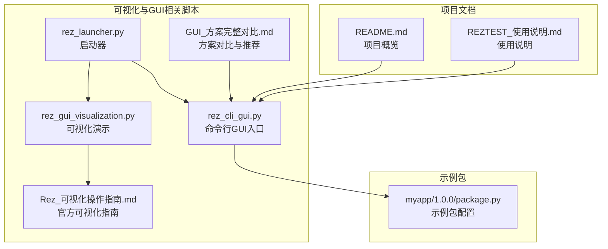
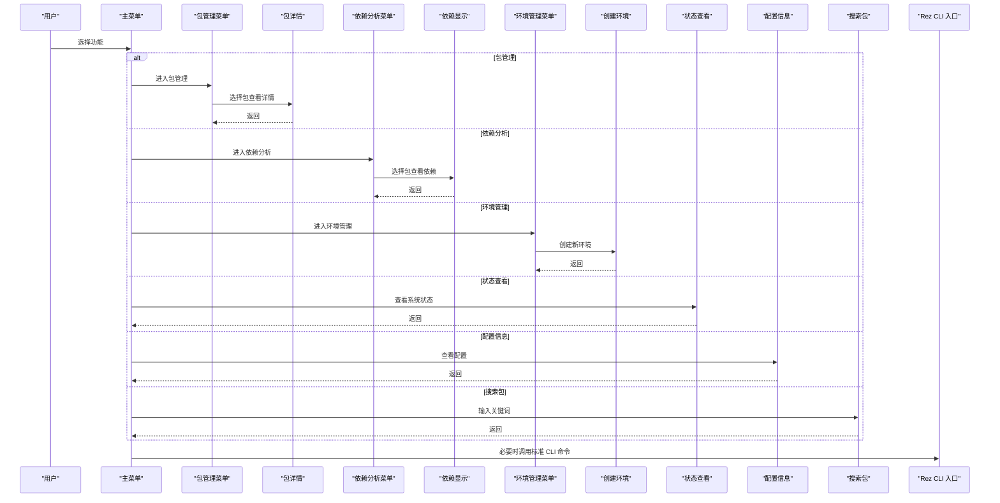
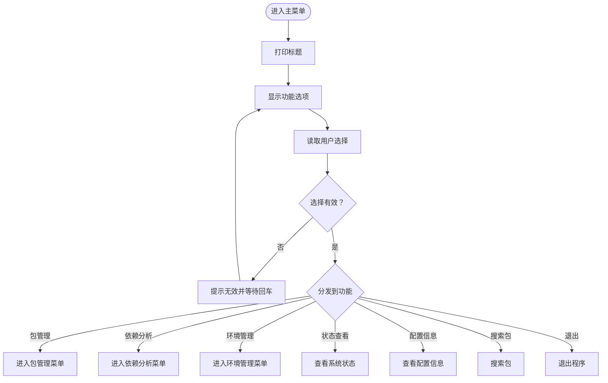
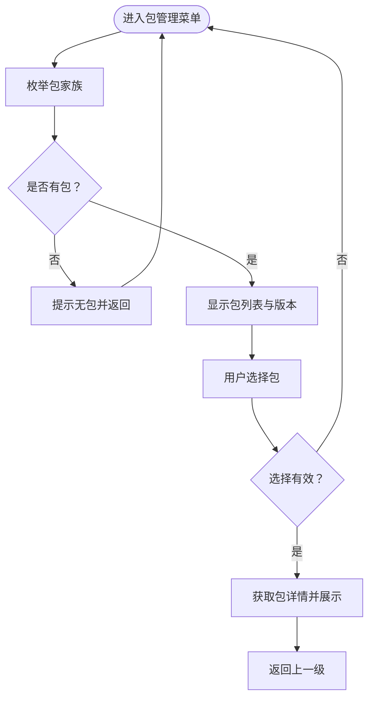
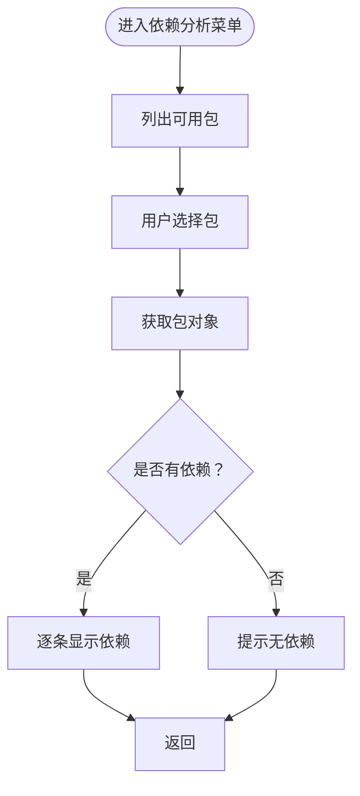
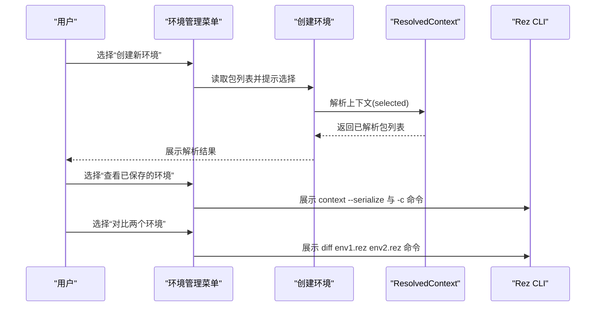
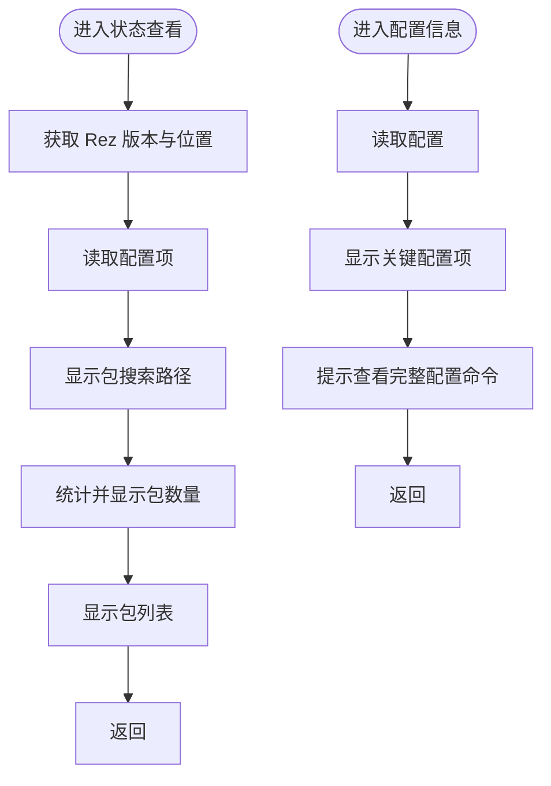
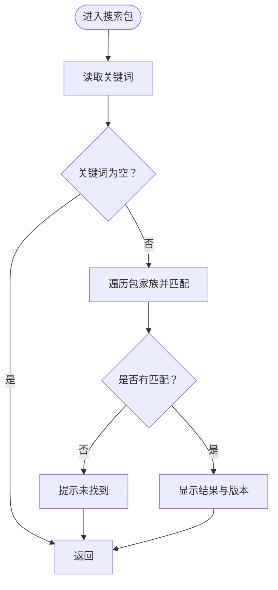
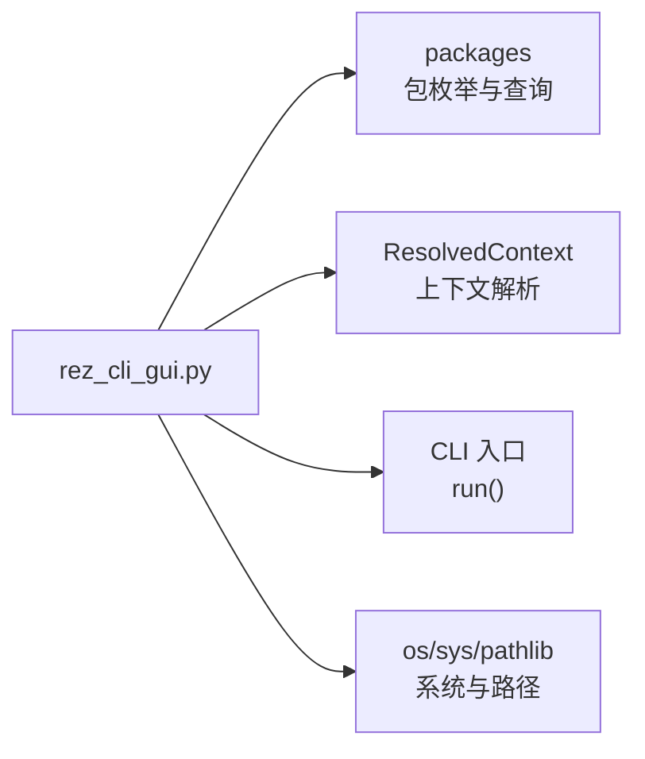

# CLI图形用户界面

<cite>
**本文引用的文件**
- [rez_cli_gui.py](file://rez_cli_gui.py)
- [Rez_可视化操作指南.md](file://Rez_可视化操作指南.md)
- [GUI_方案完整对比.md](file://GUI_方案完整对比.md)
- [rez_launcher.py](file://rez_launcher.py)
- [rez_gui_visualization.py](file://rez_gui_visualization.py)
- [README.md](file://README.md)
- [REZTEST_使用说明.md](file://REZTEST_使用说明.md)
- [my_packages/myapp/1.0.0/package.py](file://my_packages/myapp/1.0.0/package.py)
</cite>

## 目录
1. [简介](#简介)
2. [项目结构](#项目结构)
3. [核心组件](#核心组件)
4. [架构总览](#架构总览)
5. [详细组件分析](#详细组件分析)
6. [依赖分析](#依赖分析)
7. [性能考虑](#性能考虑)
8. [故障排查指南](#故障排查指南)
9. [结论](#结论)
10. [附录](#附录)

## 简介
本文件围绕 rez_cli_gui.py 的实现，系统阐述其如何通过命令行提供可视化交互功能。该脚本不依赖 Qt，采用纯文本菜单驱动的交互方式，结合 Rez 的包与上下文 API，实现包浏览、依赖分析、环境创建与管理、系统状态与配置查看、以及包搜索等功能。文档同时结合 Rez_可视化操作指南.md 的信息，说明其适用场景与最佳实践，并对比标准 CLI 与 Qt GUI 的差异与优势，给出在自动化脚本中的集成方法与使用建议。

## 项目结构
本项目包含多个与 Rez 可视化相关的脚本与文档，其中与 CLI GUI 直接相关的核心文件如下：
- rez_cli_gui.py：命令行图形用户界面入口，提供菜单驱动的交互式功能。
- Rez_可视化操作指南.md：官方可视化工具与命令的使用说明与工作流。
- GUI_方案完整对比.md：对多种可视化方案（直接命令行、CLI GUI、命令行可视化、Python API、Qt GUI）的对比与推荐。
- rez_launcher.py：统一启动器，支持快速命令行查看、交互式菜单 GUI、Qt GUI 启动等。
- rez_gui_visualization.py：可视化工具演示脚本，列出命令、展示 GUI 与可视化能力。
- README.md 与 REZTEST_使用说明.md：项目总体说明与使用建议。
- my_packages/myapp/1.0.0/package.py：示例包配置，用于演示包信息与变体等。

图表来源
- [rez_cli_gui.py](file://rez_cli_gui.py#L1-L401)
- [rez_launcher.py](file://rez_launcher.py#L1-L188)
- [rez_gui_visualization.py](file://rez_gui_visualization.py#L1-L255)
- [Rez_可视化操作指南.md](file://Rez_可视化操作指南.md#L1-L433)
- [GUI_方案完整对比.md](file://GUI_方案完整对比.md#L154-L286)
- [README.md](file://README.md#L1-L155)
- [REZTEST_使用说明.md](file://REZTEST_使用说明.md#L1-L316)
- [my_packages/myapp/1.0.0/package.py](file://my_packages/myapp/1.0.0/package.py#L1-L33)

章节来源
- [rez_cli_gui.py](file://rez_cli_gui.py#L1-L401)
- [README.md](file://README.md#L1-L155)

## 核心组件
- 清屏与标题打印：提供跨平台清屏与统一标题样式，确保菜单界面整洁。
- 主菜单与子菜单：提供“包管理”“依赖分析”“环境管理”“状态查看”“配置信息”“搜索包”“退出”等选项。
- 包管理：列出包家族与版本，支持查看包详情（名称、版本、描述、作者、依赖、变体数、位置）。
- 依赖分析：根据所选包显示其依赖关系树。
- 环境管理：支持创建新环境（基于已选包）、查看已保存环境、对比两个环境。
- 系统状态与配置：显示 Rez 版本、位置、包搜索路径、已安装包数量与列表；显示关键配置项。
- 搜索包：按关键词模糊匹配包名并列出结果与版本。
- CLI 命令桥接：通过 Rez CLI 的入口函数调用相关命令（如 status、config、context、view、depends、diff 等），实现与标准 CLI 的无缝衔接。

章节来源
- [rez_cli_gui.py](file://rez_cli_gui.py#L1-L401)

## 架构总览
CLI GUI 的控制流由主菜单驱动，用户选择功能后进入对应子菜单或执行相应逻辑。其与 Rez 的交互主要通过以下模块：
- packages：用于枚举包家族、迭代包、获取包详情。
- ResolvedContext：用于解析上下文，创建环境并获取已解析包列表。
- Rez CLI 入口：通过 run 函数桥接到标准 CLI 命令，实现状态、配置、上下文、视图、依赖、差异等命令的可视化展示。

图表来源
- [rez_cli_gui.py](file://rez_cli_gui.py#L1-L401)

## 详细组件分析

### 主菜单与交互流程
- 主菜单循环：清屏、打印标题、列出功能选项、读取用户输入并分发到对应处理函数。
- 交互健壮性：对无效输入进行提示并等待回车继续；捕获键盘中断与异常，保证退出友好。

图表来源
- [rez_cli_gui.py](file://rez_cli_gui.py#L1-L120)

章节来源
- [rez_cli_gui.py](file://rez_cli_gui.py#L1-L120)

### 包管理菜单与详情展示
- 包列表：遍历包家族，显示名称与版本列表；若无包则提示并返回。
- 包详情：根据包名获取最新版本，展示名称、版本、描述、作者、依赖、变体数量、根路径等信息；异常时输出错误信息。

图表来源
- [rez_cli_gui.py](file://rez_cli_gui.py#L74-L170)

章节来源
- [rez_cli_gui.py](file://rez_cli_gui.py#L74-L170)

### 依赖分析菜单与依赖树展示
- 依赖分析：列出可用包，用户选择后获取包对象并展示其 requires；若无依赖则提示。
- 与 Rez CLI 的关系：该功能与 Rez 的 depends 命令一致，可作为命令行可视化的补充。

图表来源
- [rez_cli_gui.py](file://rez_cli_gui.py#L152-L211)

章节来源
- [rez_cli_gui.py](file://rez_cli_gui.py#L152-L211)

### 环境管理菜单与环境创建
- 环境管理：提供“创建新环境”“查看已保存的环境”“对比两个环境”三个子功能。
- 创建环境：根据用户选择的包列表解析上下文，展示已解析包；异常时输出失败原因。
- 已保存环境与对比：提供命令示例，引导用户使用 Rez CLI 的 context 与 diff 命令。

图表来源
- [rez_cli_gui.py](file://rez_cli_gui.py#L212-L292)

章节来源
- [rez_cli_gui.py](file://rez_cli_gui.py#L212-L292)

### 系统状态与配置查看
- 系统状态：显示 Rez 版本、位置、包搜索路径、已安装包数量与列表。
- 配置信息：显示关键配置项（包搜索路径、本地/非本地包路径等），并提示查看完整配置的命令。

图表来源
- [rez_cli_gui.py](file://rez_cli_gui.py#L293-L351)

章节来源
- [rez_cli_gui.py](file://rez_cli_gui.py#L293-L351)

### 搜索包功能
- 搜索：根据关键词在包名中进行模糊匹配，列出结果与版本；异常时输出错误信息。

图表来源
- [rez_cli_gui.py](file://rez_cli_gui.py#L353-L391)

章节来源
- [rez_cli_gui.py](file://rez_cli_gui.py#L353-L391)

### 与标准 CLI 的差异与优势
- 无 Qt 依赖：CLI GUI 不依赖 Qt，可在无图形环境的服务器或容器中运行。
- 轻量级：仅需 Python 标准库与 Rez，部署与运行成本低。
- 与 Rez CLI 互补：CLI GUI 通过 Rez CLI 入口调用标准命令，实现状态、配置、上下文、视图、依赖、差异等的可视化展示。
- 适用场景：快速查看包信息、交互式包管理、环境创建与对比、系统状态与配置查看等。

章节来源
- [GUI_方案完整对比.md](file://GUI_方案完整对比.md#L154-L286)
- [Rez_可视化操作指南.md](file://Rez_可视化操作指南.md#L1-L433)

### 安装、配置与使用指南
- 安装与准备
  - 确保 Rez 已安装且版本满足要求。
  - 准备本地包目录 my_packages，并在其中放置示例包（如 myapp/1.0.0）。
- 启动方式
  - 直接运行 CLI GUI：python rez_cli_gui.py
  - 通过启动器：python rez_launcher.py，选择“交互式菜单 GUI”
- 功能菜单与操作示例
  - 包管理：浏览包家族与版本，查看包详情（名称、版本、描述、作者、依赖、变体数、位置）。
  - 依赖分析：选择包查看其依赖关系树。
  - 环境管理：创建新环境（基于所选包），查看已保存的环境，对比两个环境。
  - 状态查看：查看 Rez 版本、位置、包搜索路径、已安装包数量与列表。
  - 配置信息：查看关键配置项，提示查看完整配置的命令。
  - 搜索包：输入关键词进行模糊匹配并显示结果。
- 与 Rez CLI 的配合
  - 系统状态：python -m rez.cli status
  - 配置信息：python -m rez.cli config
  - 环境管理：python -m rez.cli context --serialize / -c / --list / --diff
  - 视图查看：python -m rez.cli view
  - 依赖可视化：python -m rez.cli depends
  - 环境对比：python -m rez.cli diff

章节来源
- [rez_cli_gui.py](file://rez_cli_gui.py#L1-L401)
- [rez_launcher.py](file://rez_launcher.py#L1-L188)
- [Rez_可视化操作指南.md](file://Rez_可视化操作指南.md#L1-L433)
- [REZTEST_使用说明.md](file://REZTEST_使用说明.md#L1-L316)

### 在自动化脚本中的集成方法
- 直接调用 CLI GUI：在 CI/CD 或批处理脚本中通过 python rez_cli_gui.py 进行交互式包管理与环境创建。
- 与 Rez CLI 结合：在脚本中组合使用 Rez CLI 命令（status、config、context、view、depends、diff）实现自动化检查、导出与对比。
- Python API 集成：在 Python 脚本中导入 packages 与 ResolvedContext，直接获取包信息与解析上下文，便于编写更复杂的自动化逻辑。

章节来源
- [rez_cli_gui.py](file://rez_cli_gui.py#L1-L401)
- [rez_gui_visualization.py](file://rez_gui_visualization.py#L1-L255)

## 依赖分析
- 外部依赖
  - Rez 核心模块：packages、ResolvedContext、CLI 入口。
  - 标准库：os、sys、pathlib。
- 内部依赖
  - 菜单与交互函数：clear_screen、print_header、print_menu、show_main_menu 等。
- 耦合与内聚
  - 各功能模块相对独立，通过主菜单进行编排，耦合度低，内聚度高。
- 潜在风险
  - 异常处理集中在顶层，避免崩溃；但部分菜单缺少输入校验，可进一步增强健壮性。

图表来源
- [rez_cli_gui.py](file://rez_cli_gui.py#L1-L401)

章节来源
- [rez_cli_gui.py](file://rez_cli_gui.py#L1-L401)

## 性能考虑
- 包枚举与查询：在大型包库中，包家族与版本的枚举可能较慢，建议在实际使用中限制搜索范围或缓存结果。
- 依赖树展示：依赖层级较深时，输出可能较长，建议结合 Rez CLI 的 depends --graph 生成图形化依赖图。
- 环境解析：解析复杂依赖时耗时较长，建议在脚本中记录解析时间并进行优化。

## 故障排查指南
- 无法找到包
  - 检查 REZ_PACKAGES_PATH 是否指向正确的 my_packages 目录。
  - 确认包目录结构与 package.py 配置正确。
- 依赖解析失败
  - 使用 Rez CLI 的 view 与 depends 命令查看解析详情与依赖树，定位冲突。
- 环境保存与加载
  - 使用 context --serialize 导出环境，使用 -c 加载；对比差异使用 diff。
- 启动器无法启动 Qt GUI
  - 按提示安装 PyQt5 或 PySide2 后再启动 GUI。

章节来源
- [rez_launcher.py](file://rez_launcher.py#L132-L154)
- [REZTEST_使用说明.md](file://REZTEST_使用说明.md#L1-L316)
- [Rez_可视化操作指南.md](file://Rez_可视化操作指南.md#L1-L433)

## 结论
rez_cli_gui.py 提供了一个轻量、无 Qt 依赖的命令行图形用户界面，通过菜单驱动的方式实现了包浏览、依赖分析、环境管理、系统状态与配置查看、以及包搜索等核心功能。它与 Rez CLI 无缝衔接，既适合初学者快速上手，也可作为自动化脚本的基础组件。结合 GUI_方案完整对比.md 与 Rez_可视化操作指南.md，用户可根据场景选择合适的可视化方案，并在脚本中灵活集成 Rez 的命令与 Python API。

## 附录
- 示例包配置：myapp/1.0.0/package.py 展示了包的基本字段（名称、版本、描述、作者、requires、variants、commands 等），可用于演示包详情与变体等。
- 项目文档：README.md 与 REZTEST_使用说明.md 提供了项目的整体介绍与使用建议，便于快速了解与上手。

章节来源
- [my_packages/myapp/1.0.0/package.py](file://my_packages/myapp/1.0.0/package.py#L1-L33)
- [README.md](file://README.md#L1-L155)
- [REZTEST_使用说明.md](file://REZTEST_使用说明.md#L1-L316)