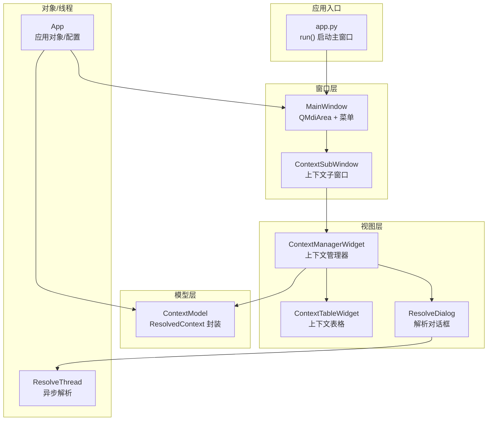
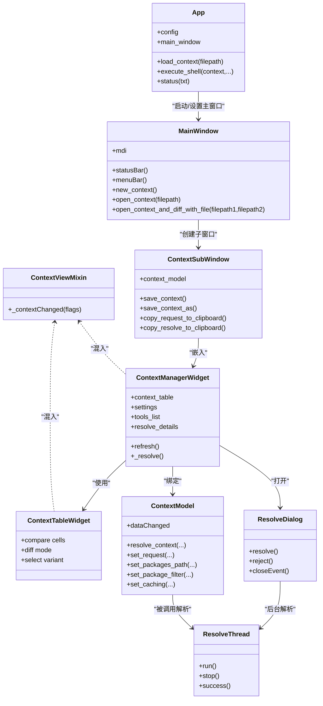
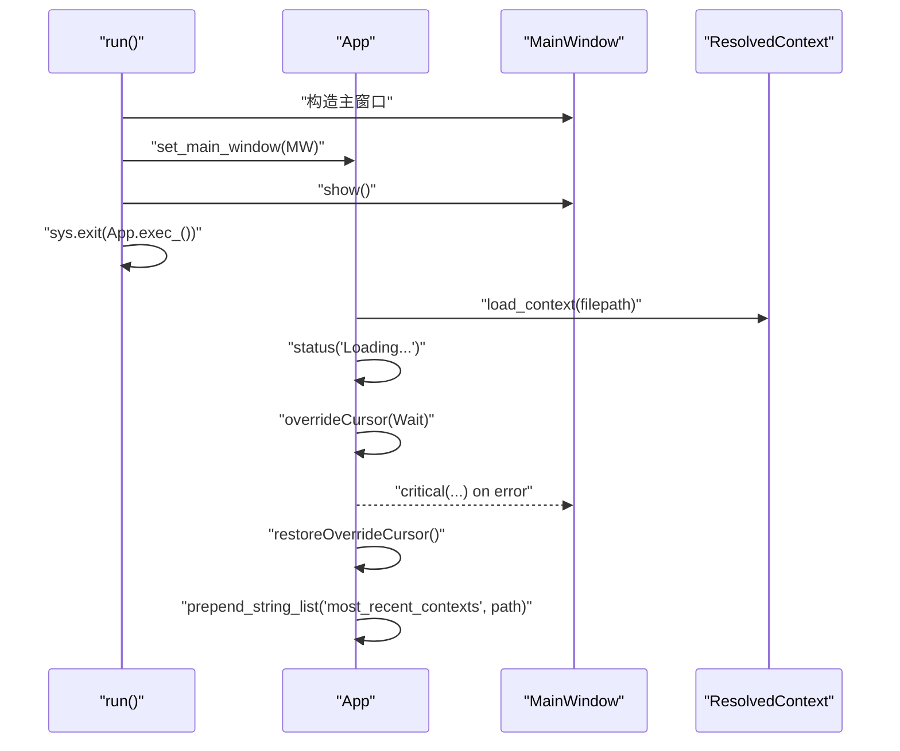
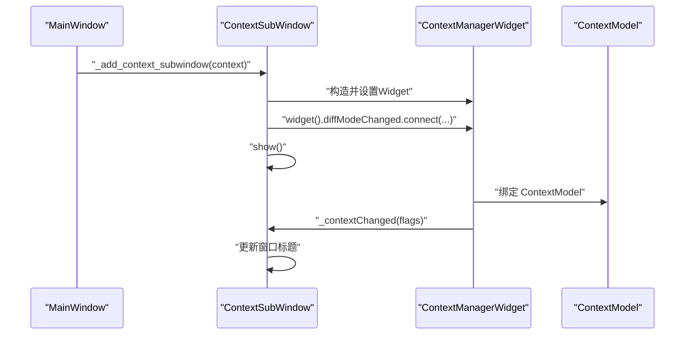
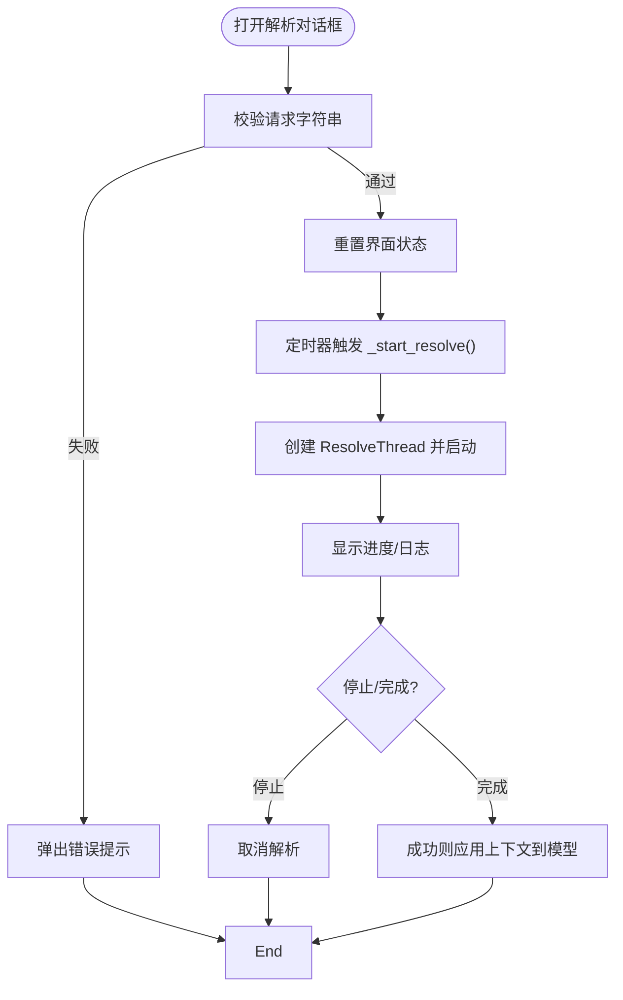
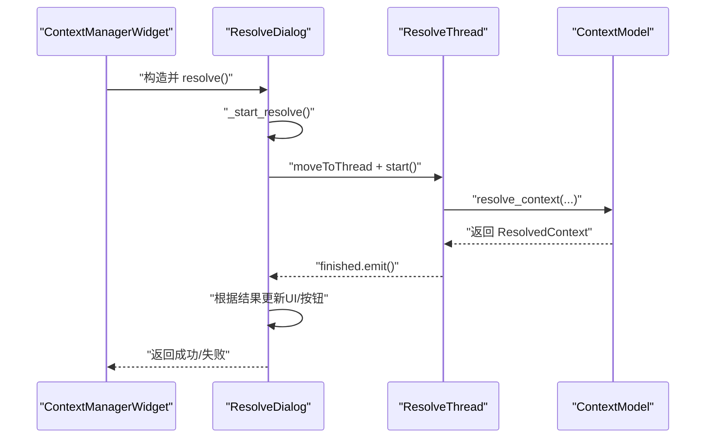
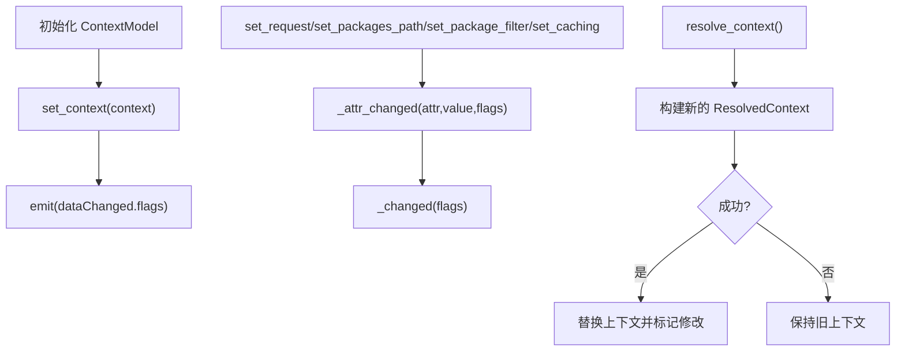
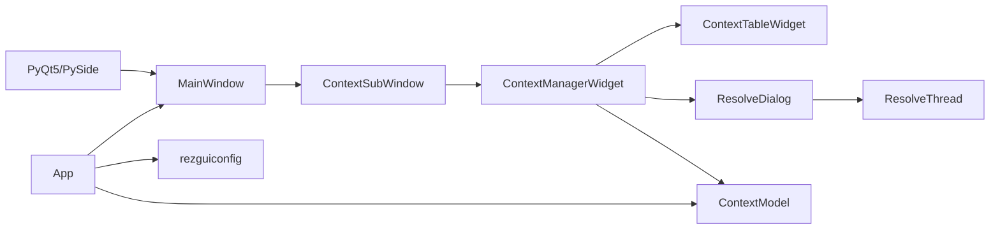

# Qt图形用户界面

<cite>
**本文引用的文件**
- [rez_qt_gui.py](file://rez_qt_gui.py)
- [app.py](file://rez-3.3.0/src/rezgui/app.py)
- [MainWindow.py](file://rez-3.3.0/src/rezgui/windows/MainWindow.py)
- [ContextSubWindow.py](file://rez-3.3.0/src/rezgui/windows/ContextSubWindow.py)
- [ContextModel.py](file://rez-3.3.0/src/rezgui/models/ContextModel.py)
- [ResolveThread.py](file://rez-3.3.0/src/rezgui/objects/ResolveThread.py)
- [ContextManagerWidget.py](file://rez-3.3.0/src/rezgui/widgets/ContextManagerWidget.py)
- [ContextTableWidget.py](file://rez-3.3.0/src/rezgui/widgets/ContextTableWidget.py)
- [ResolveDialog.py](file://rez-3.3.0/src/rezgui/dialogs/ResolveDialog.py)
- [ContextViewMixin.py](file://rez-3.3.0/src/rezgui/mixins/ContextViewMixin.py)
- [App.py](file://rez-3.3.0/src/rezgui/objects/App.py)
- [rezguiconfig](file://rez-3.3.0/src/rezgui/rezguiconfig)
- [GUI_方案完整对比.md](file://GUI_方案完整对比.md)
</cite>

## 目录
1. [简介](#简介)
2. [项目结构](#项目结构)
3. [核心组件](#核心组件)
4. [架构总览](#架构总览)
5. [详细组件分析](#详细组件分析)
6. [依赖关系分析](#依赖关系分析)
7. [性能考量](#性能考量)
8. [故障排查指南](#故障排查指南)
9. [结论](#结论)
10. [附录](#附录)

## 简介
本文件面向希望深入理解 Rez Qt 图形用户界面的开发者与使用者，围绕官方 Qt GUI（基于 Qt/MDI 架构）进行系统化文档化说明。重点覆盖：
- MVC 架构设计：模型（ContextModel）、视图（各 Widget/Dialog/SubWindow）、控制器（App 生命周期与事件调度）
- MainWindow、ContextSubWindow、ContextManagerWidget、ResolveDialog 等关键组件的职责与交互
- App 对象生命周期管理、ResolveThread 异步解析机制
- ContextModel 数据模型与变更通知
- 安装依赖、配置文件（rezguiconfig）设置与启动流程
- 结合 GUI_方案完整对比.md，从响应速度、功能完整性、用户体验与资源占用角度进行横向对比
- 界面定制、主题修改与插件扩展的高级用法

## 项目结构
官方 Qt GUI 位于 rez-3.3.0/src/rezgui 下，采用典型的 MVC 分层与模块化组织：
- windows：主窗口与子窗口（QMdiSubWindow），负责窗口级交互与菜单
- widgets：具体视图组件，承载业务展示与用户输入
- models：数据模型，封装 ResolvedContext 及其变更
- objects：应用对象与线程类，负责生命周期与后台任务
- dialogs：对话框，封装复杂交互流程（如解析对话框）
- mixins：混入类，复用上下文视图能力
- 配置：rezguiconfig 提供窗口尺寸、解析参数等配置

图表来源
- [app.py](file://rez-3.3.0/src/rezgui/app.py#L26-L49)
- [MainWindow.py](file://rez-3.3.0/src/rezgui/windows/MainWindow.py#L16-L164)
- [ContextSubWindow.py](file://rez-3.3.0/src/rezgui/windows/ContextSubWindow.py#L14-L152)
- [ContextManagerWidget.py](file://rez-3.3.0/src/rezgui/widgets/ContextManagerWidget.py#L25-L364)
- [ContextTableWidget.py](file://rez-3.3.0/src/rezgui/widgets/ContextTableWidget.py#L1-L200)
- [ResolveDialog.py](file://rez-3.3.0/src/rezgui/dialogs/ResolveDialog.py#L18-L200)
- [ContextModel.py](file://rez-3.3.0/src/rezgui/models/ContextModel.py#L14-L258)
- [ResolveThread.py](file://rez-3.3.0/src/rezgui/objects/ResolveThread.py#L9-L60)
- [App.py](file://rez-3.3.0/src/rezgui/objects/App.py#L19-L95)

章节来源
- [app.py](file://rez-3.3.0/src/rezgui/app.py#L26-L49)
- [MainWindow.py](file://rez-3.3.0/src/rezgui/windows/MainWindow.py#L16-L164)

## 核心组件
- App 对象：应用单例，负责组织名称、应用名称、配置加载、上下文加载、光标状态与外壳执行
- MainWindow：主窗口，MDI 区域承载子窗口，菜单与状态栏管理
- ContextSubWindow：上下文子窗口，封装 ContextManagerWidget，并处理保存/关闭确认
- ContextManagerWidget：上下文管理器，聚合工具栏、表格、设置、工具、解析详情等
- ContextTableWidget：上下文表格，展示包、变体、比较单元格、差异模式等
- ResolveDialog：解析对话框，封装进度条、日志、按钮与异步解析流程
- ResolveThread：后台解析线程，触发 ContextModel.resolve_context 并发出完成信号
- ContextModel：封装 ResolvedContext，提供请求、路径、过滤、缓存、补丁锁等设置，以及变更通知
- ContextViewMixin：混入类，统一订阅 ContextModel.dataChanged 并触发 _contextChanged

章节来源
- [App.py](file://rez-3.3.0/src/rezgui/objects/App.py#L19-L95)
- [MainWindow.py](file://rez-3.3.0/src/rezgui/windows/MainWindow.py#L16-L164)
- [ContextSubWindow.py](file://rez-3.3.0/src/rezgui/windows/ContextSubWindow.py#L14-L152)
- [ContextManagerWidget.py](file://rez-3.3.0/src/rezgui/widgets/ContextManagerWidget.py#L25-L364)
- [ContextTableWidget.py](file://rez-3.3.0/src/rezgui/widgets/ContextTableWidget.py#L1-L200)
- [ResolveDialog.py](file://rez-3.3.0/src/rezgui/dialogs/ResolveDialog.py#L18-L200)
- [ResolveThread.py](file://rez-3.3.0/src/rezgui/objects/ResolveThread.py#L9-L60)
- [ContextModel.py](file://rez-3.3.0/src/rezgui/models/ContextModel.py#L14-L258)
- [ContextViewMixin.py](file://rez-3.3.0/src/rezgui/mixins/ContextViewMixin.py#L1-L40)

## 架构总览
官方 Qt GUI 采用 MVC + MDI 的架构：
- 视图层由 MainWindow/ContextSubWindow/各 Widget 组成，负责渲染与交互
- 模型层由 ContextModel 承担，持有 ResolvedContext 并通过信号通知变更
- 控制器层由 App/ResolveDialog/ResolveThread 等承担，协调事件、线程与生命周期
- 通过 ContextViewMixin 统一订阅模型变更，驱动视图更新

图表来源
- [App.py](file://rez-3.3.0/src/rezgui/objects/App.py#L19-L95)
- [MainWindow.py](file://rez-3.3.0/src/rezgui/windows/MainWindow.py#L16-L164)
- [ContextSubWindow.py](file://rez-3.3.0/src/rezgui/windows/ContextSubWindow.py#L14-L152)
- [ContextManagerWidget.py](file://rez-3.3.0/src/rezgui/widgets/ContextManagerWidget.py#L25-L364)
- [ContextTableWidget.py](file://rez-3.3.0/src/rezgui/widgets/ContextTableWidget.py#L1-L200)
- [ResolveDialog.py](file://rez-3.3.0/src/rezgui/dialogs/ResolveDialog.py#L18-L200)
- [ResolveThread.py](file://rez-3.3.0/src/rezgui/objects/ResolveThread.py#L9-L60)
- [ContextModel.py](file://rez-3.3.0/src/rezgui/models/ContextModel.py#L14-L258)
- [ContextViewMixin.py](file://rez-3.3.0/src/rezgui/mixins/ContextViewMixin.py#L1-L40)

## 详细组件分析

### App 对象与生命周期
- 职责
  - 初始化 QApplication，设置组织名与应用名
  - 加载配置文件（rezguiconfig），提供窗口尺寸、解析参数等
  - 上下文加载与错误提示，光标状态切换
  - 外壳执行（终端/分离进程），清理环境变量
- 生命周期
  - run() 启动主窗口，设置主窗口引用，显示并进入事件循环
  - load_context() 在状态栏提示与忙光标下加载上下文，记录最近打开文件
  - execute_shell() 以父环境为基准启动外部 shell

图表来源
- [app.py](file://rez-3.3.0/src/rezgui/app.py#L26-L49)
- [App.py](file://rez-3.3.0/src/rezgui/objects/App.py#L55-L74)
- [App.py](file://rez-3.3.0/src/rezgui/objects/App.py#L75-L92)

章节来源
- [app.py](file://rez-3.3.0/src/rezgui/app.py#L26-L49)
- [App.py](file://rez-3.3.0/src/rezgui/objects/App.py#L19-L95)

### MainWindow 与 ContextSubWindow
- MainWindow
  - MDI 区域承载子窗口，菜单包含“打开包浏览器”“新建上下文/打开上下文/保存/退出”
  - 状态栏消息与最小显示时间控制
  - 最近上下文菜单动态生成
- ContextSubWindow
  - 组合 ContextManagerWidget，继承 ContextViewMixin/StoreSizeMixin
  - 关闭前的修改检查与保存/丢弃/取消策略
  - 保存/另存为、复制请求/解析到剪贴板

图表来源
- [MainWindow.py](file://rez-3.3.0/src/rezgui/windows/MainWindow.py#L119-L164)
- [ContextSubWindow.py](file://rez-3.3.0/src/rezgui/windows/ContextSubWindow.py#L14-L152)
- [ContextManagerWidget.py](file://rez-3.3.0/src/rezgui/widgets/ContextManagerWidget.py#L25-L120)

章节来源
- [MainWindow.py](file://rez-3.3.0/src/rezgui/windows/MainWindow.py#L16-L164)
- [ContextSubWindow.py](file://rez-3.3.0/src/rezgui/windows/ContextSubWindow.py#L14-L152)

### ContextManagerWidget 与 ContextTableWidget
- ContextManagerWidget
  - 工具栏：查找、打开终端、差异模式、锁定类型、回退、解析
  - Tab：context/settings/tools/resolve details；根据上下文状态启用/禁用
  - 解析：弹出 ResolveDialog，成功后更新模型
  - 差异模式：与当前/磁盘/其他上下文对比
- ContextTableWidget
  - 比较单元格：等价、新旧版本、缺失/新增、版本跨度图标
  - 单元格委托绘制：高亮、过期边框、渐变背景
  - 选择变体、时间锁提示、搜索

图表来源
- [ResolveDialog.py](file://rez-3.3.0/src/rezgui/dialogs/ResolveDialog.py#L137-L200)
- [ResolveThread.py](file://rez-3.3.0/src/rezgui/objects/ResolveThread.py#L28-L60)
- [ContextModel.py](file://rez-3.3.0/src/rezgui/models/ContextModel.py#L190-L208)

章节来源
- [ContextManagerWidget.py](file://rez-3.3.0/src/rezgui/widgets/ContextManagerWidget.py#L25-L364)
- [ContextTableWidget.py](file://rez-3.3.0/src/rezgui/widgets/ContextTableWidget.py#L1-L200)

### ResolveDialog 与 ResolveThread 异步解析
- ResolveDialog
  - 默认立即开始解析（非高级模式），或高级模式下允许调整最大失败次数、冗余度、是否显示包加载
  - 进度条、日志输出、按钮状态切换（取消/确定/保存/查看图）
  - 关闭事件与拒绝行为处理
- ResolveThread
  - run() 调用 ContextModel.resolve_context，捕获 RezError，发出 finished 信号
  - stop() 支持用户取消，success() 返回解析结果状态

图表来源
- [ContextManagerWidget.py](file://rez-3.3.0/src/rezgui/widgets/ContextManagerWidget.py#L208-L211)
- [ResolveDialog.py](file://rez-3.3.0/src/rezgui/dialogs/ResolveDialog.py#L137-L200)
- [ResolveThread.py](file://rez-3.3.0/src/rezgui/objects/ResolveThread.py#L28-L60)
- [ContextModel.py](file://rez-3.3.0/src/rezgui/models/ContextModel.py#L190-L208)

章节来源
- [ResolveDialog.py](file://rez-3.3.0/src/rezgui/dialogs/ResolveDialog.py#L18-L200)
- [ResolveThread.py](file://rez-3.3.0/src/rezgui/objects/ResolveThread.py#L9-L60)

### ContextModel 数据模型
- 职责
  - 封装 ResolvedContext，暴露请求、包路径、隐含包、过滤器、缓存、默认/显式补丁锁
  - resolve_context() 执行重新解析，成功后替换当前上下文并标记为已修改
  - dataChanged 信号携带多种标志位，用于精确通知视图更新
- 变更与回退
  - _changed/_attr_changed 触发脏标记与 dataChanged
  - revert()/can_revert() 支持丢弃待定更改
- 依赖关系
  - package_depends_on() 基于依赖图计算直接/间接依赖

图表来源
- [ContextModel.py](file://rez-3.3.0/src/rezgui/models/ContextModel.py#L14-L258)

章节来源
- [ContextModel.py](file://rez-3.3.0/src/rezgui/models/ContextModel.py#L14-L258)

### 本地简易 Qt GUI（补充）
仓库还提供了基于 PyQt5 的本地简易 Qt GUI 示例，包含包浏览器、依赖分析、环境管理与系统状态标签页，使用 QThread 异步加载包族列表，主线程解析环境并展示结果。该示例展示了 Qt GUI 的基础能力与异步处理思路，便于理解官方 GUI 的核心交互。

章节来源
- [rez_qt_gui.py](file://rez_qt_gui.py#L1-L520)

## 依赖关系分析
- 外部依赖
  - Qt（PyQt5/PySide）：官方 GUI 依赖 Qt 模块（QtWidgets/QtCore/QtGui）
  - Rez 核心库：packages、resolved_context、config、version 等
- 内部依赖
  - App 依赖配置文件（rezguiconfig）与 YAML 解析
  - MainWindow 依赖菜单工具与子窗口创建
  - ContextManagerWidget 依赖 ContextModel、工具栏与对话框
  - ResolveDialog 依赖 ResolveThread 与配置项
  - ContextTableWidget 依赖 ContextViewMixin 与比较单元格

图表来源
- [MainWindow.py](file://rez-3.3.0/src/rezgui/windows/MainWindow.py#L16-L164)
- [ContextSubWindow.py](file://rez-3.3.0/src/rezgui/windows/ContextSubWindow.py#L14-L152)
- [ContextManagerWidget.py](file://rez-3.3.0/src/rezgui/widgets/ContextManagerWidget.py#L25-L364)
- [ContextTableWidget.py](file://rez-3.3.0/src/rezgui/widgets/ContextTableWidget.py#L1-L200)
- [ResolveDialog.py](file://rez-3.3.0/src/rezgui/dialogs/ResolveDialog.py#L18-L200)
- [ResolveThread.py](file://rez-3.3.0/src/rezgui/objects/ResolveThread.py#L9-L60)
- [ContextModel.py](file://rez-3.3.0/src/rezgui/models/ContextModel.py#L14-L258)
- [App.py](file://rez-3.3.0/src/rezgui/objects/App.py#L19-L95)
- [rezguiconfig](file://rez-3.3.0/src/rezgui/rezguiconfig#L1-L50)

章节来源
- [App.py](file://rez-3.3.0/src/rezgui/objects/App.py#L19-L95)
- [rezguiconfig](file://rez-3.3.0/src/rezgui/rezguiconfig#L1-L50)

## 性能考量
- 异步解析
  - ResolveDialog 通过 ResolveThread 在后台线程执行解析，避免阻塞 UI
  - 日志流与进度条实时反馈，提升响应感知
- 资源占用
  - Qt GUI 依赖较重（需安装 PyQt5/PySide），但提供专业界面与拖放等高级交互
  - 本地简易 Qt GUI 无外部依赖，轻量但界面相对简陋
- 解析参数
  - 配置项（max_fails、verbosity、show_package_loads）影响解析耗时与日志量
  - 缓存开关（resolve_caching）可减少重复解析成本

章节来源
- [ResolveDialog.py](file://rez-3.3.0/src/rezgui/dialogs/ResolveDialog.py#L78-L124)
- [ContextModel.py](file://rez-3.3.0/src/rezgui/models/ContextModel.py#L190-L208)
- [rezguiconfig](file://rez-3.3.0/src/rezgui/rezguiconfig#L32-L50)

## 故障排查指南
- 解析失败
  - ResolveDialog 捕获异常并提示；检查请求字符串合法性与包路径
- 上下文加载失败
  - App.load_context() 捕获 ResolvedContextError 并弹出错误对话框
- 关闭子窗口冲突
  - ContextSubWindow 在修改状态下弹出确认对话框，支持丢弃/保存/取消
- 状态栏显示
  - MainWindow.status() 控制消息显示时长，避免闪烁

章节来源
- [ResolveDialog.py](file://rez-3.3.0/src/rezgui/dialogs/ResolveDialog.py#L166-L179)
- [App.py](file://rez-3.3.0/src/rezgui/objects/App.py#L55-L74)
- [ContextSubWindow.py](file://rez-3.3.0/src/rezgui/windows/ContextSubWindow.py#L43-L91)
- [MainWindow.py](file://rez-3.3.0/src/rezgui/windows/MainWindow.py#L100-L112)

## 结论
官方 Qt GUI 以清晰的 MVC 分层与 MDI 架构实现了专业级包与环境管理界面，具备完善的异步解析、差异对比、锁定策略与配置持久化能力。对于需要拖放、图形化依赖关系与丰富交互的场景，官方 GUI 是首选；若追求轻量与无依赖，可参考本地简易 Qt GUI 示例或命令行方案。

## 附录

### 安装与启动
- 安装依赖
  - 安装 PyQt5 或 PySide2
- 启动 GUI
  - 使用 Rez CLI 启动官方 Qt GUI
- 本地简易 Qt GUI
  - 直接运行本地脚本启动简易界面

章节来源
- [GUI_方案完整对比.md](file://GUI_方案完整对比.md#L233-L281)
- [rez_qt_gui.py](file://rez_qt_gui.py#L504-L520)

### 配置文件（rezguiconfig）
- 窗口尺寸：窗口宽高配置
- 解析参数：最大失败次数、冗余度、是否显示包加载、图默认适配等
- 最近打开文件数量上限

章节来源
- [rezguiconfig](file://rez-3.3.0/src/rezgui/rezguiconfig#L1-L50)

### 界面定制与主题
- 窗口尺寸与布局：通过 StoreSizeMixin 与配置文件保存/恢复
- 主题与样式：可通过 Qt 样式表与 Fusion 主题提升视觉一致性
- 插件扩展：通过 rezgui 插件机制扩展菜单、对话框与工具

章节来源
- [ContextSubWindow.py](file://rez-3.3.0/src/rezgui/windows/ContextSubWindow.py#L18-L21)
- [ContextManagerWidget.py](file://rez-3.3.0/src/rezgui/widgets/ContextManagerWidget.py#L148-L155)
- [App.py](file://rez-3.3.0/src/rezgui/objects/App.py#L28-L39)

### 与本地简易 Qt GUI 的对比
- 功能完整性：官方 GUI 更完整（上下文管理、差异对比、锁定、工具面板等）
- 响应速度：两者均采用异步解析，官方 GUI 在大型解析时仍保持流畅
- 用户体验：官方 GUI 提供 MDI、菜单、工具栏、对话框等，交互更丰富
- 资源占用：官方 GUI 依赖 Qt，体积较大；本地简易 GUI 无外部依赖，轻量

章节来源
- [GUI_方案完整对比.md](file://GUI_方案完整对比.md#L145-L178)
- [rez_qt_gui.py](file://rez_qt_gui.py#L1-L520)