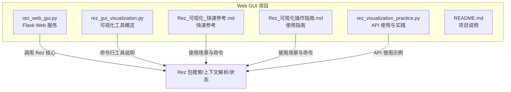
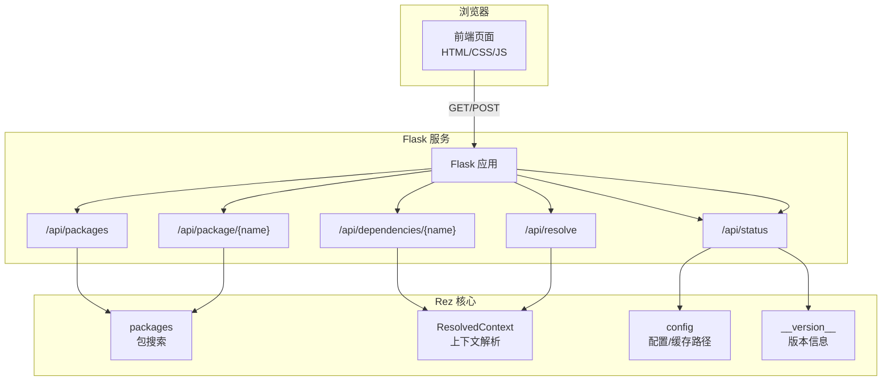
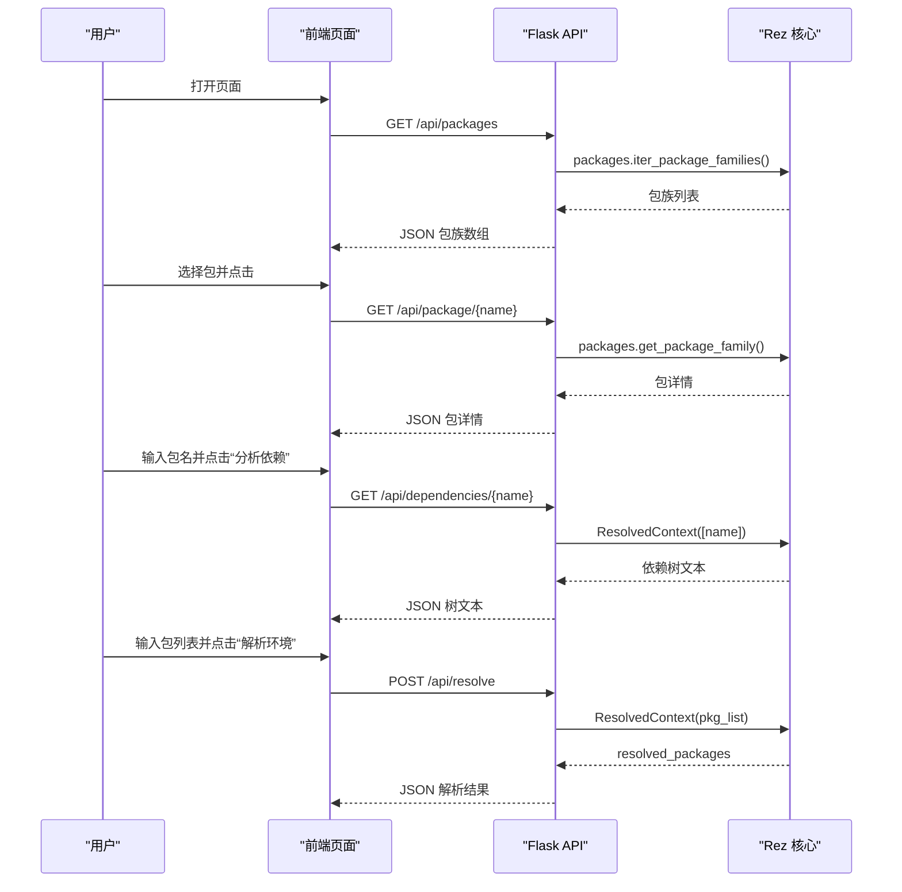
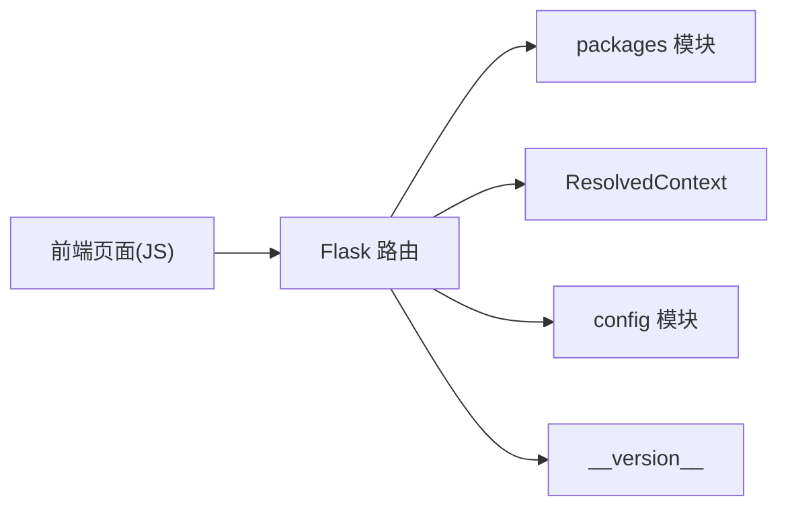

# Web图形用户界面

<cite>
**本文引用的文件**
- [rez_web_gui.py](file://rez_web_gui.py)
- [rez_gui_visualization.py](file://rez_gui_visualization.py)
- [Rez_可视化_快速参考.md](file://Rez_可视化_快速参考.md)
- [Rez_可视化操作指南.md](file://Rez_可视化操作指南.md)
- [rez_visualization_practice.py](file://rez_visualization_practice.py)
- [README.md](file://README.md)
</cite>

## 目录
1. [简介](#简介)
2. [项目结构](#项目结构)
3. [核心组件](#核心组件)
4. [架构总览](#架构总览)
5. [详细组件分析](#详细组件分析)
6. [依赖关系分析](#依赖关系分析)
7. [性能考虑](#性能考虑)
8. [故障排查指南](#故障排查指南)
9. [结论](#结论)
10. [附录](#附录)

## 简介
本文件围绕 Rez 的 Web 图形用户界面实现进行系统化说明，重点基于以下文件：
- 基于 Flask 的 Web GUI：rez_web_gui.py
- 可视化工具与 GUI 概览：rez_gui_visualization.py
- 快速参考与使用场景：Rez_可视化_快速参考.md、Rez_可视化操作指南.md
- 可视化实践与 API 使用：rez_visualization_practice.py
- 项目总体说明：README.md

目标是解释 Web GUI 如何通过前端 HTML/CSS/JavaScript 与后端 Flask 服务集成，如何调用 Rez 核心模块（包搜索、上下文解析、状态查询）实现可视化功能，并给出部署、访问、性能与安全方面的建议。

## 项目结构
本项目为 Rez 包管理的学习与演示项目，包含若干脚本与文档，其中与 Web GUI 直接相关的核心文件如下：
- Web GUI 后端：rez_web_gui.py（Flask 应用、路由与 Rez 集成）
- 可视化工具概览：rez_gui_visualization.py（命令行可视化工具说明）
- 快速参考与使用场景：Rez_可视化_快速参考.md、Rez_可视化操作指南.md
- 可视化实践与 API 使用：rez_visualization_practice.py
- 项目说明：README.md



图表来源
- [rez_web_gui.py](file://rez_web_gui.py#L1-L615)
- [rez_gui_visualization.py](file://rez_gui_visualization.py#L1-L255)
- [Rez_可视化_快速参考.md](file://Rez_可视化_快速参考.md#L1-L335)
- [Rez_可视化操作指南.md](file://Rez_可视化操作指南.md#L1-L300)
- [rez_visualization_practice.py](file://rez_visualization_practice.py#L1-L305)
- [README.md](file://README.md#L1-L155)

章节来源
- [README.md](file://README.md#L1-L155)

## 核心组件
- Web 前端模板与样式：HTML_TEMPLATE 内嵌在后端，包含“包浏览器”“依赖分析”“环境管理”“系统状态”四个标签页，使用内联 CSS 实现响应式布局与主题风格。
- 后端 Flask 服务：提供首页渲染与一组 API 接口：
  - GET /api/packages：返回包族列表（前若干项）
  - GET /api/package/{name}：返回指定包的基本信息
  - GET /api/dependencies/{name}：返回解析后的依赖树文本
  - POST /api/resolve：解析传入的包列表并返回已解析包清单
  - GET /api/status：返回 Rez 版本、包搜索路径、缓存路径等系统状态
- Rez 核心集成点：
  - 包搜索：packages.iter_package_families()/iter_packages()
  - 上下文解析：ResolvedContext([...]) 与 resolved_packages
  - 配置与状态：config、__version__、cache_dir

章节来源
- [rez_web_gui.py](file://rez_web_gui.py#L1-L615)

## 架构总览
Web GUI 采用前后端分离的轻量架构：
- 前端：静态 HTML/CSS/JS，通过 fetch 请求后端 API 获取数据；页面初始化时自动加载包列表与系统状态。
- 后端：Flask 提供 RESTful 接口，内部调用 Rez 核心模块完成数据查询与解析。
- 数据交互：JSON 格式传输，错误统一返回 error 字段与状态码。



图表来源
- [rez_web_gui.py](file://rez_web_gui.py#L1-L615)

## 详细组件分析

### Web 前端组件与交互流程
- 页面结构：顶部标题、底部页脚、四个标签页（包浏览器、依赖分析、环境管理、系统状态），每个标签页对应一组输入与输出区域。
- 初始化：页面加载完成后自动请求包列表与系统状态，提升首屏体验。
- 交互逻辑：
  - 包浏览器：点击包名触发详情请求，表格展示键值对信息；支持本地搜索过滤。
  - 依赖分析：输入包名后请求依赖树，将树形文本渲染为带换行的 HTML。
  - 环境管理：提交包列表，POST 到 /api/resolve，展示解析后的包名与版本。
  - 系统状态：请求 /api/status，展示 Rez 版本、包搜索路径、缓存路径等。



图表来源
- [rez_web_gui.py](file://rez_web_gui.py#L1-L615)

章节来源
- [rez_web_gui.py](file://rez_web_gui.py#L1-L615)

### 后端 API 设计与数据流
- 路由与职责：
  - /api/packages：遍历包族并返回名称列表（限制数量）。
  - /api/package/{name}：返回包名、版本数、最新版本、最近若干版本等信息。
  - /api/dependencies/{name}：构建依赖树文本，逐层缩进展示。
  - /api/resolve：接收 JSON 包列表，解析并返回已解析包的名称与版本。
  - /api/status：返回 Rez 版本、包搜索路径、缓存路径、Python 版本等。
- 错误处理：捕获异常并返回 JSON 错误与状态码，保证接口健壮性。
- 部署注意：默认监听 localhost:5000，生产环境建议绑定到 0.0.0.0 并配合反向代理。

```mermaid
flowchart TD
Start(["请求进入"]) --> Route{"路由匹配"}
Route --> |/api/packages| ListPkgs["遍历包族<br/>返回名称列表"]
Route --> |/api/package/{name}| PkgInfo["获取包族信息<br/>返回基本信息"]
Route --> |/api/dependencies/{name}| DepTree["解析依赖树<br/>返回树文本"]
Route --> |/api/resolve| Resolve["解析包列表<br/>返回已解析包"]
Route --> |/api/status| SysInfo["读取配置与版本<br/>返回系统状态"]
ListPkgs --> End(["返回 JSON"])
PkgInfo --> End
DepTree --> End
Resolve --> End
SysInfo --> End
```

图表来源
- [rez_web_gui.py](file://rez_web_gui.py#L1-L615)

章节来源
- [rez_web_gui.py](file://rez_web_gui.py#L1-L615)

### Rez 核心系统集成点
- 包搜索：通过 iter_package_families()/iter_packages() 获取包族与版本列表，用于前端包浏览器与搜索。
- 上下文解析：通过 ResolvedContext([...]) 解析包列表，获取 resolved_packages 用于依赖分析与环境管理。
- 配置与状态：config.package_paths/cache_dir 用于系统状态展示；__version__ 用于版本信息。
- 实践参考：rez_visualization_practice.py 展示了包浏览、包信息、依赖树、环境变量等可视化输出示例，有助于理解 Web GUI 的数据来源与呈现方式。

章节来源
- [rez_web_gui.py](file://rez_web_gui.py#L1-L615)
- [rez_visualization_practice.py](file://rez_visualization_practice.py#L1-L305)

### 可视化工具与使用场景
- 命令行 GUI：通过 python -m rez.cli gui 启动原生 GUI（需 PyQt/PySide）。
- 视图工具：view 命令用于查看上下文与环境详情。
- 环境管理：context 命令用于创建、保存、加载、比较环境。
- 依赖分析：depends 命令显示依赖树，支持图形化输出。
- 对比分析：diff 命令比较两个上下文或包版本差异。
- 快速参考与指南：Rez_可视化_快速参考.md、Rez_可视化操作指南.md 提供命令与工作流示例，便于 Web GUI 的使用场景映射。

章节来源
- [rez_gui_visualization.py](file://rez_gui_visualization.py#L1-L255)
- [Rez_可视化_快速参考.md](file://Rez_可视化_快速参考.md#L1-L335)
- [Rez_可视化操作指南.md](file://Rez_可视化操作指南.md#L1-L300)

## 依赖关系分析
- 外部依赖：Flask（Web 框架）、Rez（包管理核心库）
- 内部依赖：前端模板与 JS 逻辑内嵌于后端，通过路由暴露 API；API 内部依赖 Rez 的 packages、config、ResolvedContext。
- 耦合与内聚：后端路由职责清晰，与 Rez 的耦合集中在数据查询与解析；前端与后端通过 JSON 接口解耦，便于扩展与替换。



图表来源
- [rez_web_gui.py](file://rez_web_gui.py#L1-L615)

章节来源
- [rez_web_gui.py](file://rez_web_gui.py#L1-L615)

## 性能考虑
- 前端性能
  - 首屏加载：页面加载时一次性请求包列表与系统状态，减少后续请求次数。
  - 本地搜索：前端对包列表进行过滤，避免重复网络请求。
- 后端性能
  - 包列表限制：后端仅返回前若干项，降低响应体积与渲染压力。
  - 上下文解析：解析包列表会涉及求解过程，建议在批量解析时控制并发与超时。
- 可扩展性
  - API 可增加分页、缓存、限流等机制，以适配更大规模的包库。
  - 前端可引入虚拟滚动、懒加载等优化策略，改善长列表体验。

[本节为通用性能讨论，不直接分析具体文件]

## 故障排查指南
- 无法访问 Web GUI
  - 确认服务已启动并监听在 localhost:5000。
  - 检查防火墙与端口占用情况。
- 包列表为空
  - 确认 REZ_PACKAGES_PATH 环境变量指向正确的包目录。
  - 检查包目录结构是否符合 Rez 规范。
- 依赖分析报错
  - 确认输入的包名存在且可被解析。
  - 检查网络与 Rez 配置是否正确。
- 环境解析失败
  - 检查包列表是否合法，是否存在循环依赖或版本冲突。
  - 可参考 Rez_可视化操作指南.md 中的命令行方式进行对比验证。
- 错误返回
  - 后端统一返回 JSON 错误对象，前端根据 error 字段提示用户或记录日志。

章节来源
- [rez_web_gui.py](file://rez_web_gui.py#L1-L615)
- [Rez_可视化操作指南.md](file://Rez_可视化操作指南.md#L1-L300)

## 结论
Rez Web GUI 通过 Flask 提供简洁的 Web 界面，结合 Rez 核心模块实现了包浏览、依赖分析、环境解析与系统状态展示。其前端采用内联模板与内联样式，后端以 JSON API 形式暴露功能，具备良好的可读性与可扩展性。结合命令行 GUI 与 Rez 的可视化工具链，可在不同场景下满足团队协作、远程访问与集成开发环境的需求。

[本节为总结性内容，不直接分析具体文件]

## 附录

### 部署与访问方法
- 启动服务
  - 直接运行脚本以启动 Flask 服务，默认监听 localhost:5000。
- 访问地址
  - 在浏览器中打开 http://localhost:5000。
- 生产部署建议
  - 将服务绑定到 0.0.0.0 并通过反向代理（如 Nginx/Apache）对外提供服务。
  - 配置 HTTPS 与访问控制，确保安全性。
  - 为 API 添加限流与健康检查接口，提升稳定性。

章节来源
- [rez_web_gui.py](file://rez_web_gui.py#L600-L615)

### 团队协作与远程访问
- 团队协作
  - 通过 Web GUI 快速浏览与选择包，减少命令行记忆成本。
  - 使用 context 命令导出环境配置，便于共享与复现。
- 远程访问
  - 通过反向代理与认证网关，允许远程团队成员访问 Web GUI。
- 集成开发环境
  - 将 Web GUI 作为本地开发环境的入口，结合命令行工具进行调试与对比分析。

章节来源
- [Rez_可视化_快速参考.md](file://Rez_可视化_快速参考.md#L1-L335)
- [Rez_可视化操作指南.md](file://Rez_可视化操作指南.md#L1-L300)

### 浏览器兼容性与安全配置
- 浏览器兼容性
  - 前端使用现代 JavaScript 与标准 DOM API，建议在主流桌面浏览器上使用。
- 安全配置
  - 限制来源与方法：通过反向代理或 WSGI 层限制来源 IP 与请求方法。
  - 启用 HTTPS：为 Web GUI 提供 TLS 终止，防止中间人攻击。
  - 认证与授权：在反向代理或应用层添加登录与权限控制。
  - CORS：如需跨域访问，明确配置允许的源与方法。
  - 日志与审计：开启访问日志与错误日志，定期审计异常请求。

[本节为通用指导，不直接分析具体文件]