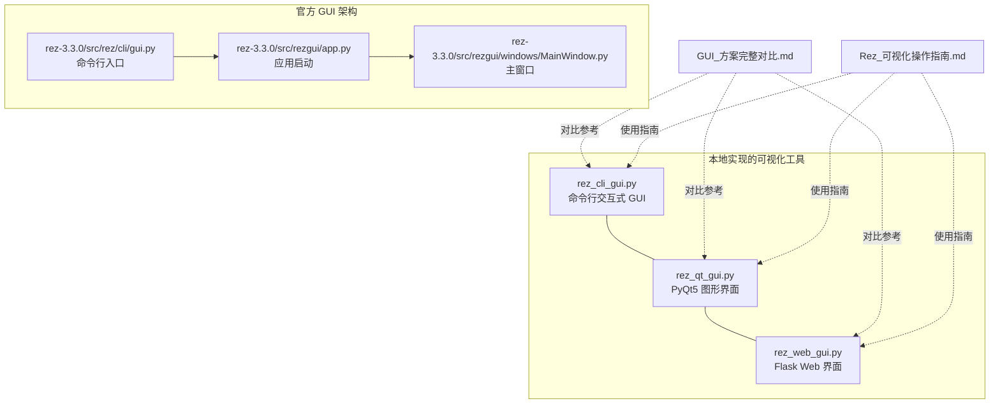
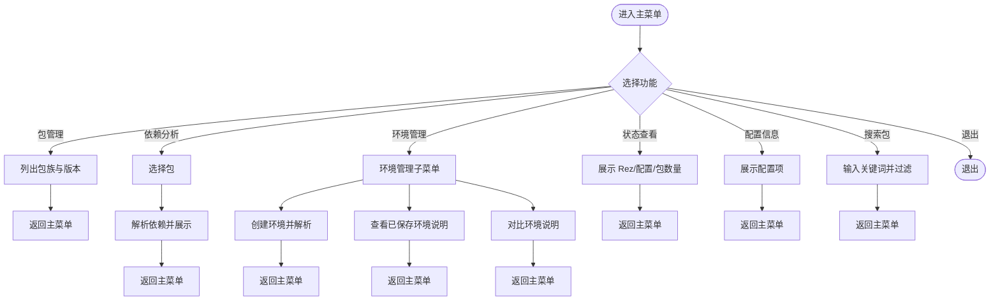
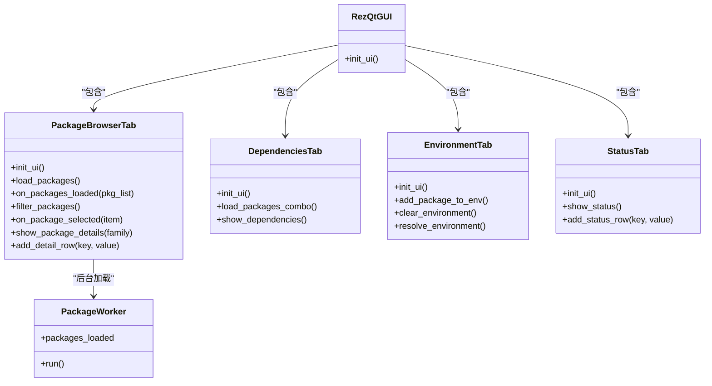
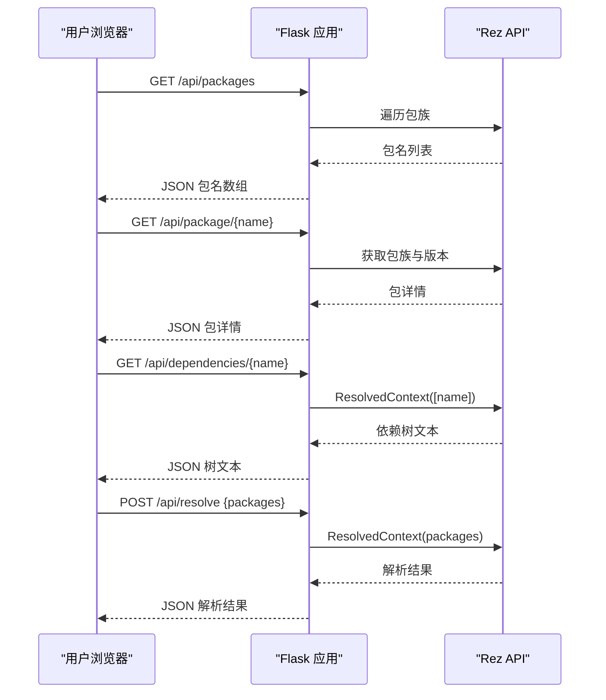
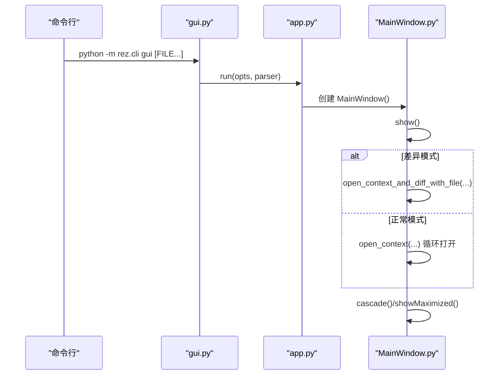
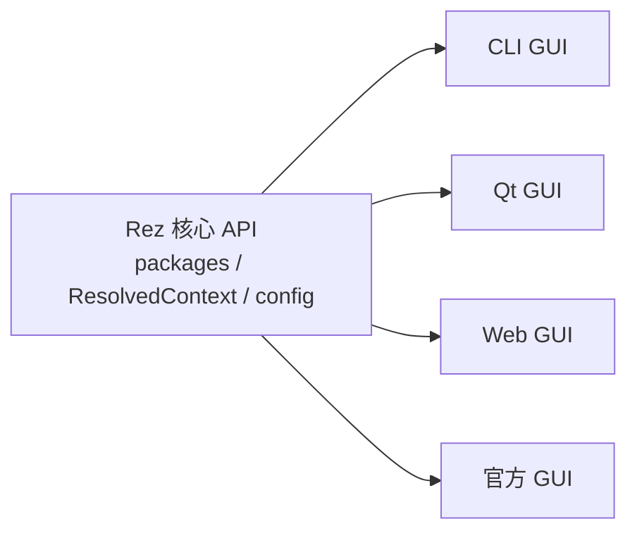

# 可视化工具

<cite>
**本文引用的文件**
- [rez_cli_gui.py](file://rez_cli_gui.py)
- [rez_qt_gui.py](file://rez_qt_gui.py)
- [rez_web_gui.py](file://rez_web_gui.py)
- [GUI_方案完整对比.md](file://GUI_方案完整对比.md)
- [Rez_可视化操作指南.md](file://Rez_可视化操作指南.md)
- [rez_gui_visualization.py](file://rez_gui_visualization.py)
- [rez_visualization_practice.py](file://rez_visualization_practice.py)
- [README.md](file://README.md)
- [rez-3.3.0/src/rez/cli/gui.py](file://rez-3.3.0/src/rez/cli/gui.py)
- [rez-3.3.0/src/rezgui/app.py](file://rez-3.3.0/src/rezgui/app.py)
- [rez-3.3.0/src/rezgui/windows/MainWindow.py](file://rez-3.3.0/src/rezgui/windows/MainWindow.py)
</cite>

## 目录
1. [简介](#简介)
2. [项目结构](#项目结构)
3. [核心组件](#核心组件)
4. [架构总览](#架构总览)
5. [详细组件分析](#详细组件分析)
6. [依赖分析](#依赖分析)
7. [性能考虑](#性能考虑)
8. [故障排查指南](#故障排查指南)
9. [结论](#结论)
10. [附录](#附录)

## 简介
本文件面向 Rez 可视化工具的使用者与开发者，系统梳理并对比三种可视化界面：CLI GUI、Qt GUI 与 Web GUI。围绕 rez_cli_gui.py、rez_qt_gui.py 与 rez_web_gui.py 的实现，解释其技术架构、界面布局、交互模式与定制选项，并结合 GUI_方案完整对比.md 与 Rez_可视化操作指南.md 提供安装、配置与使用指南。同时补充 Rez 官方 GUI 的入口与架构，帮助读者在不同场景下选择合适的可视化方案。

## 项目结构
本仓库包含三类可视化工具：
- 命令行交互式 GUI：rez_cli_gui.py
- PyQt5 图形界面：rez_qt_gui.py
- Flask Web 界面：rez_web_gui.py
- 官方 GUI 入口与架构：rez-3.3.0/src/rez/cli/gui.py、rez-3.3.0/src/rezgui/app.py、rez-3.3.0/src/rezgui/windows/MainWindow.py
- 辅助文档与演示脚本：GUI_方案完整对比.md、Rez_可视化操作指南.md、rez_gui_visualization.py、rez_visualization_practice.py、README.md

图表来源
- [rez_cli_gui.py](file://rez_cli_gui.py#L1-L401)
- [rez_qt_gui.py](file://rez_qt_gui.py#L1-L520)
- [rez_web_gui.py](file://rez_web_gui.py#L1-L615)
- [rez-3.3.0/src/rez/cli/gui.py](file://rez-3.3.0/src/rez/cli/gui.py#L1-L26)
- [rez-3.3.0/src/rezgui/app.py](file://rez-3.3.0/src/rezgui/app.py#L1-L50)
- [rez-3.3.0/src/rezgui/windows/MainWindow.py](file://rez-3.3.0/src/rezgui/windows/MainWindow.py#L1-L164)

章节来源
- [README.md](file://README.md#L1-L155)

## 核心组件
- CLI GUI（rez_cli_gui.py）
  - 基于纯 Python 的命令行菜单驱动界面，无需外部 GUI 依赖，提供包浏览、依赖分析、环境管理、状态查看、配置查看与包搜索等能力。
- Qt GUI（rez_qt_gui.py）
  - 基于 PyQt5 的桌面图形界面，包含包浏览器、依赖分析、环境管理、系统状态四个标签页，支持包搜索、版本列表、依赖树、环境解析与状态信息展示。
- Web GUI（rez_web_gui.py）
  - 基于 Flask 的 Web 界面，提供包浏览器、依赖分析、环境管理、系统状态四个标签页，通过 /api/* 接口返回 JSON 数据，前端使用 HTML/CSS/JS 渲染。
- 官方 GUI（Rez 官方）
  - 通过命令行入口 python -m rez.cli gui 启动，内部由 rezgui.app.py 与 MainWindow.py 等模块构成，提供包浏览器、上下文编辑、导出/导入、依赖可视化等专业功能。

章节来源
- [rez_cli_gui.py](file://rez_cli_gui.py#L1-L401)
- [rez_qt_gui.py](file://rez_qt_gui.py#L1-L520)
- [rez_web_gui.py](file://rez_web_gui.py#L1-L615)
- [rez-3.3.0/src/rez/cli/gui.py](file://rez-3.3.0/src/rez/cli/gui.py#L1-L26)
- [rez-3.3.0/src/rezgui/app.py](file://rez-3.3.0/src/rezgui/app.py#L1-L50)
- [rez-3.3.0/src/rezgui/windows/MainWindow.py](file://rez-3.3.0/src/rezgui/windows/MainWindow.py#L1-L164)

## 架构总览
三种可视化工具均通过 Rez 的 Python API（packages、ResolvedContext、config 等）获取包信息、解析环境与展示状态。CLI GUI 与 Web GUI 通过 Rez API 直接调用；Qt GUI 通过 Rez API 与 Qt 控件组合；官方 GUI 通过命令行入口转发至 rezgui 应用层。

```mermaid
graph TB
subgraph "CLI GUI"
CLI_MAIN["主菜单循环<br/>包浏览/依赖/环境/状态/配置/搜索"]
CLI_API["Rez API<br/>packages / ResolvedContext / config"]
end
subgraph "Qt GUI"
QT_APP["QApplication/QMainWindow"]
QT_TABS["标签页: 包浏览器/依赖分析/环境管理/系统状态"]
QT_API["Rez API<br/>packages / ResolvedContext / config"]
end
subgraph "Web GUI"
FLASK_APP["Flask 应用"]
FLASK_API["/api/* 接口<br/>packages / ResolvedContext / config"]
FRONTEND["HTML/CSS/JS 前端"]
end
subgraph "官方 GUI"
CLI_ENTRY["命令行入口<br/>python -m rez.cli gui"]
APP_RUN["应用启动<br/>rezgui.app.run"]
MAIN_WIN["主窗口<br/>MainWindow"]
end
CLI_MAIN --> CLI_API
QT_APP --> QT_TABS --> QT_API
FLASK_APP --> FLASK_API
FRONTEND --> FLASK_APP
CLI_ENTRY --> APP_RUN --> MAIN_WIN
```

图表来源
- [rez_cli_gui.py](file://rez_cli_gui.py#L1-L401)
- [rez_qt_gui.py](file://rez_qt_gui.py#L1-L520)
- [rez_web_gui.py](file://rez_web_gui.py#L1-L615)
- [rez-3.3.0/src/rez/cli/gui.py](file://rez-3.3.0/src/rez/cli/gui.py#L1-L26)
- [rez-3.3.0/src/rezgui/app.py](file://rez-3.3.0/src/rezgui/app.py#L1-L50)
- [rez-3.3.0/src/rezgui/windows/MainWindow.py](file://rez-3.3.0/src/rezgui/windows/MainWindow.py#L1-L164)

## 详细组件分析

### CLI GUI（rez_cli_gui.py）
- 技术架构
  - 基于标准库 os、sys、pathlib 与 Rez 的 packages、ResolvedContext、config 等模块。
  - 采用循环菜单与子菜单组织功能，每个功能对应独立函数，便于扩展与维护。
- 界面布局与交互
  - 主菜单包含包管理、依赖分析、环境管理、状态查看、配置信息、搜索包与退出。
  - 包管理菜单列出包族与版本，支持查看详情；依赖分析菜单选择包后展示依赖树；环境管理支持创建环境、查看已保存环境与对比环境；状态与配置菜单展示 Rez 版本、包搜索路径等信息；搜索包支持关键词过滤。
- 处理逻辑
  - 包浏览：iter_package_families 与 iter_packages 获取包族与版本列表。
  - 依赖分析：get_package 获取最新版本，再通过 ResolvedContext 解析依赖。
  - 环境管理：输入包名列表，创建 ResolvedContext 并展示解析结果。
  - 状态与配置：读取 config 配置项并汇总展示。
- 错误处理
  - 对异常进行捕获并提示错误信息，避免程序崩溃。
- 性能特征
  - 依赖解析与包枚举在本地执行，受包数量与版本数量影响；建议在大型仓库中配合搜索功能使用。

图表来源
- [rez_cli_gui.py](file://rez_cli_gui.py#L1-L401)

章节来源
- [rez_cli_gui.py](file://rez_cli_gui.py#L1-L401)

### Qt GUI（rez_qt_gui.py）
- 技术架构
  - 使用 PyQt5 构建桌面应用，包含 QApplication、QMainWindow、QTabWidget、QListWidget、QTableWidget、QTreeWidget 等控件。
  - 通过 QThread 与 pyqtSignal 异步加载包列表，避免阻塞 UI。
  - 将功能拆分为 PackageBrowserTab、DependenciesTab、EnvironmentTab、StatusTab 四个标签页。
- 界面布局与交互
  - 包浏览器：左侧包列表，右侧包详情表格与版本列表；支持搜索过滤。
  - 依赖分析：下拉选择包，点击“刷新依赖”生成依赖树。
  - 环境管理：输入包名（支持逗号分隔），添加到环境列表，点击“解析环境”展示解析结果。
  - 系统状态：展示 Rez 版本、包搜索路径、本地包路径、缓存路径、插件路径与包族数量。
- 处理逻辑
  - 包加载：后台线程遍历包族并发出信号更新 UI。
  - 依赖解析：根据所选包名创建 ResolvedContext，填充树控件。
  - 环境解析：将输入的包列表创建 ResolvedContext，展示结果表格。
  - 状态展示：读取 config 与 packages 统计信息。
- 错误处理
  - 对异常弹出警告对话框，避免崩溃；对网络/IO 异常进行捕获。
- 性能特征
  - 使用后台线程加载包列表，提升响应速度；解析环境时注意包数量与依赖深度。

图表来源
- [rez_qt_gui.py](file://rez_qt_gui.py#L1-L520)

章节来源
- [rez_qt_gui.py](file://rez_qt_gui.py#L1-L520)

### Web GUI（rez_web_gui.py）
- 技术架构
  - 使用 Flask 提供 Web 服务，HTML 模板内嵌前端脚本，通过 /api/* 接口返回 JSON 数据。
  - 前端使用原生 JavaScript 发起 fetch 请求，动态渲染包列表、详情、依赖树、解析结果与系统状态。
- 界面布局与交互
  - 标签页：包浏览器、依赖分析、环境管理、系统状态。
  - 包浏览器：输入搜索词，前端过滤列表；点击包名请求 /api/package/<name> 展示详情。
  - 依赖分析：输入包名，请求 /api/dependencies/<name> 展示依赖树文本。
  - 环境管理：输入包列表（空格或逗号分隔），POST 到 /api/resolve 展示解析结果。
  - 系统状态：GET /api/status 展示 Rez 版本、包搜索路径、缓存路径等。
- 处理逻辑
  - 包列表：遍历包族并返回前若干个名称。
  - 包详情：获取包族与版本列表，返回基本信息。
  - 依赖树：创建 ResolvedContext，生成树形文本。
  - 环境解析：接收 JSON 数组，创建 ResolvedContext，返回解析结果。
  - 系统状态：读取 Rez 版本、包族数量、配置路径等。
- 错误处理
  - 对异常返回 JSON 错误信息与相应 HTTP 状态码。
- 性能特征
  - 服务器端解析与渲染，前端负责 UI 更新；适合远程访问与团队协作。

图表来源
- [rez_web_gui.py](file://rez_web_gui.py#L1-L615)

章节来源
- [rez_web_gui.py](file://rez_web_gui.py#L1-L615)

### 官方 GUI（Rez 官方）
- 技术架构
  - 命令行入口：python -m rez.cli gui，调用命令实现中的 run 函数。
  - 应用启动：rezgui.app.py 创建 MainWindow 并进入事件循环。
  - 主窗口：rezgui.windows.MainWindow.py 提供菜单、MDI 子窗口与状态栏。
- 界面布局与交互
  - 菜单：文件（打开包浏览器、新建上下文、打开上下文、保存上下文、退出）、编辑（复制请求/解析到剪贴板）、帮助（关于）。
  - 子窗口：包浏览器子窗口、上下文子窗口，支持打开/保存上下文、最近上下文菜单、差异对比等。
- 处理逻辑
  - 启动流程：解析参数、打开上下文文件、最大化显示或级联排列。
  - 状态栏：短时消息与最小显示时长控制。
- 错误处理
  - 文件存在性校验与异常提示。
- 性能特征
  - 专业级功能与良好的用户体验，但需要安装 PyQt5/PySide2。

图表来源
- [rez-3.3.0/src/rez/cli/gui.py](file://rez-3.3.0/src/rez/cli/gui.py#L1-L26)
- [rez-3.3.0/src/rezgui/app.py](file://rez-3.3.0/src/rezgui/app.py#L1-L50)
- [rez-3.3.0/src/rezgui/windows/MainWindow.py](file://rez-3.3.0/src/rezgui/windows/MainWindow.py#L1-L164)

章节来源
- [rez-3.3.0/src/rez/cli/gui.py](file://rez-3.3.0/src/rez/cli/gui.py#L1-L26)
- [rez-3.3.0/src/rezgui/app.py](file://rez-3.3.0/src/rezgui/app.py#L1-L50)
- [rez-3.3.0/src/rezgui/windows/MainWindow.py](file://rez-3.3.0/src/rezgui/windows/MainWindow.py#L1-L164)

## 依赖分析
- 共同依赖
  - Rez 核心 API：packages（包族/包枚举）、ResolvedContext（环境解析）、config（配置读取）。
- 工具间耦合
  - CLI GUI 与 Web GUI 通过 Rez API 直接耦合；Qt GUI 通过 Rez API 与 Qt 控件耦合；官方 GUI 通过命令行入口与应用层耦合。
- 外部依赖
  - CLI GUI：无外部 GUI 依赖，仅标准库与 Rez。
  - Qt GUI：PyQt5（需安装）。
  - Web GUI：Flask（需安装）。
  - 官方 GUI：PyQt5/PySide2（需安装）。

图表来源
- [rez_cli_gui.py](file://rez_cli_gui.py#L1-L401)
- [rez_qt_gui.py](file://rez_qt_gui.py#L1-L520)
- [rez_web_gui.py](file://rez_web_gui.py#L1-L615)
- [rez-3.3.0/src/rez/cli/gui.py](file://rez-3.3.0/src/rez/cli/gui.py#L1-L26)

章节来源
- [rez_cli_gui.py](file://rez_cli_gui.py#L1-L401)
- [rez_qt_gui.py](file://rez_qt_gui.py#L1-L520)
- [rez_web_gui.py](file://rez_web_gui.py#L1-L615)
- [rez-3.3.0/src/rez/cli/gui.py](file://rez-3.3.0/src/rez/cli/gui.py#L1-L26)

## 性能考虑
- CLI GUI
  - 适合轻量使用与无 GUI 环境；包列表与依赖解析在本地执行，建议配合搜索功能减少扫描范围。
- Qt GUI
  - 使用后台线程加载包列表，避免阻塞 UI；解析环境时注意包数量与依赖深度，必要时分批解析。
- Web GUI
  - 服务器端解析与渲染，前端负责 UI 更新；适合远程访问与团队协作；注意接口限流与超时设置。
- 官方 GUI
  - 专业级界面与功能，性能稳定；依赖 Qt 库，启动时间略长但后续交互流畅。

## 故障排查指南
- CLI GUI
  - 若无法显示包列表，检查 REZ_PACKAGES_PATH 是否正确指向 my_packages 目录。
  - 依赖解析失败时，确认包名与版本是否存在；查看错误提示并重试。
- Qt GUI
  - 未安装 PyQt5 会导致启动失败；安装后重启应用。
  - 解析环境失败时，检查包名格式与分隔符；查看警告对话框中的错误信息。
- Web GUI
  - 未安装 Flask 会导致启动失败；安装后重启服务。
  - 访问 /api/* 接口报错时，检查后端异常日志与浏览器控制台错误。
- 官方 GUI
  - 未安装 PyQt5/PySide2 会导致启动失败；安装后使用 python -m rez.cli gui 启动。

章节来源
- [rez_cli_gui.py](file://rez_cli_gui.py#L1-L401)
- [rez_qt_gui.py](file://rez_qt_gui.py#L1-L520)
- [rez_web_gui.py](file://rez_web_gui.py#L1-L615)
- [rez-3.3.0/src/rez/cli/gui.py](file://rez-3.3.0/src/rez/cli/gui.py#L1-L26)

## 结论
- 若追求零依赖与轻量体验，选择 CLI GUI。
- 若需要专业桌面图形界面与拖放式环境创建，选择官方 GUI（需安装 PyQt5/PySide2）。
- 若需要跨平台浏览器访问与团队协作，选择 Web GUI（需安装 Flask）。
- Qt GUI 作为第三方实现，提供了与官方 GUI 类似的功能集合，适合在本地快速体验与二次开发。

## 附录

### 安装、配置与使用指南
- CLI GUI
  - 直接运行脚本即可；无需额外依赖。
  - 通过 REZ_PACKAGES_PATH 指向 my_packages 目录，确保包可见。
- Qt GUI
  - 安装 PyQt5：pip install PyQt5
  - 运行脚本启动图形界面。
- Web GUI
  - 安装 Flask：pip install Flask
  - 运行脚本后在浏览器访问 http://localhost:5000。
- 官方 GUI
  - 安装 PyQt5 或 PySide2：pip install PyQt5 或 pip install PySide2
  - 运行命令：python -m rez.cli gui

章节来源
- [GUI_方案完整对比.md](file://GUI_方案完整对比.md#L1-L286)
- [Rez_可视化操作指南.md](file://Rez_可视化操作指南.md#L1-L433)
- [rez-3.3.0/src/rez/cli/gui.py](file://rez-3.3.0/src/rez/cli/gui.py#L1-L26)

### 界面布局与交互模式
- CLI GUI
  - 菜单驱动，适合命令行用户；支持包浏览、依赖分析、环境管理、状态查看、配置查看与搜索。
- Qt GUI
  - 标签页布局，支持包搜索、版本列表、依赖树、环境解析与状态信息；支持后台加载与实时预览。
- Web GUI
  - 响应式布局，标签页切换；前后端分离，前端动态渲染；适合远程访问。
- 官方 GUI
  - MDI 多窗口布局，菜单丰富；支持包浏览器、上下文编辑、导出/导入、差异对比。

章节来源
- [rez_cli_gui.py](file://rez_cli_gui.py#L1-L401)
- [rez_qt_gui.py](file://rez_qt_gui.py#L1-L520)
- [rez_web_gui.py](file://rez_web_gui.py#L1-L615)
- [rez-3.3.0/src/rezgui/windows/MainWindow.py](file://rez-3.3.0/src/rezgui/windows/MainWindow.py#L1-L164)

### 定制选项
- CLI GUI
  - 可在脚本中修改包搜索路径、菜单文案与默认行为。
- Qt GUI
  - 可调整样式表、控件尺寸与布局；可扩展标签页与功能模块。
- Web GUI
  - 可修改 HTML 模板与 CSS 样式；可扩展 /api/* 接口与前端交互逻辑。
- 官方 GUI
  - 通过 Rez 插件机制扩展功能；可定制菜单与窗口行为。

章节来源
- [rez_cli_gui.py](file://rez_cli_gui.py#L1-L401)
- [rez_qt_gui.py](file://rez_qt_gui.py#L1-L520)
- [rez_web_gui.py](file://rez_web_gui.py#L1-L615)
- [rez-3.3.0/src/rezgui/app.py](file://rez-3.3.0/src/rezgui/app.py#L1-L50)

### 与 Rez 官方 GUI 的对比
- 功能覆盖
  - 官方 GUI 提供包浏览器、包搜索、版本选择、环境编辑（拖放）、依赖可视化、环境导出、实时预览等专业功能。
  - 本地实现的 Qt GUI 与 Web GUI 覆盖了包浏览、依赖分析、环境管理、状态查看等核心功能。
- 易用性
  - 官方 GUI 界面更专业，交互更丰富；CLI GUI 适合命令行用户；Qt GUI 与 Web GUI 提供图形化体验。
- 依赖与部署
  - CLI GUI 无外部依赖；Qt GUI 与 Web GUI 需安装 PyQt5/Flask；官方 GUI 需安装 PyQt5/PySide2。

章节来源
- [GUI_方案完整对比.md](file://GUI_方案完整对比.md#L1-L286)
- [Rez_可视化操作指南.md](file://Rez_可视化操作指南.md#L1-L433)
- [rez-3.3.0/src/rezgui/windows/MainWindow.py](file://rez-3.3.0/src/rezgui/windows/MainWindow.py#L1-L164)