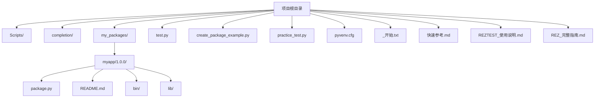
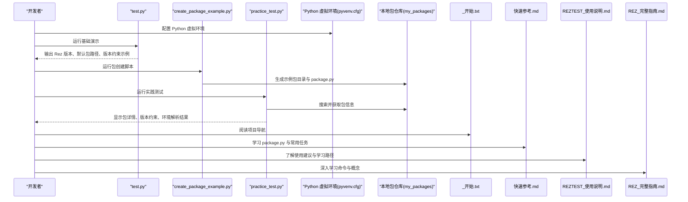
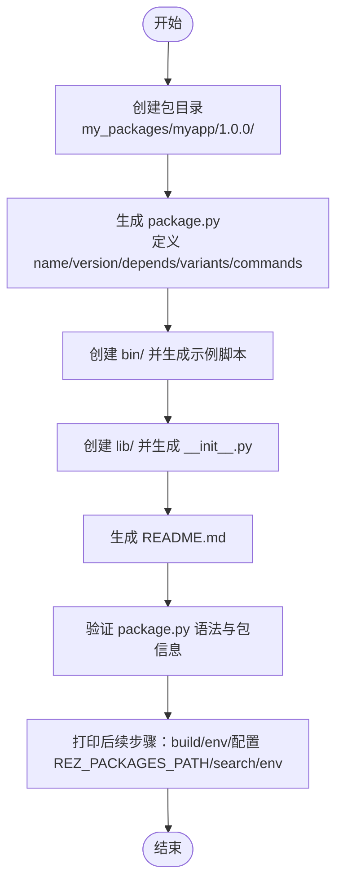
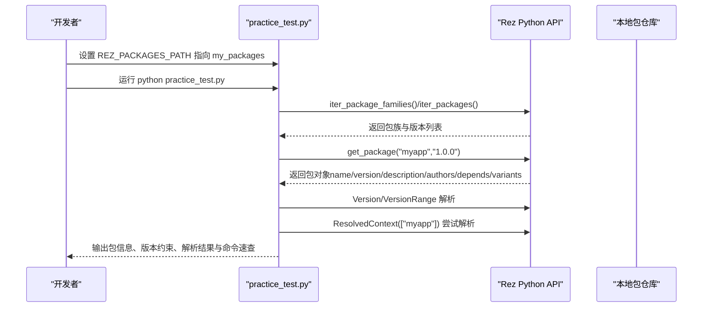
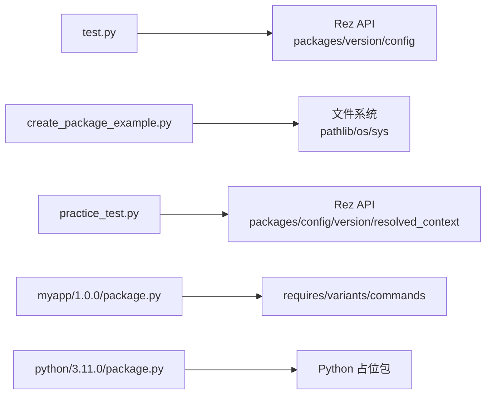

# 快速开始

<cite>
**本文引用的文件**
- [README.md](file://README.md)
- [_开始.txt](file://_开始.txt)
- [快速参考.md](file://快速参考.md)
- [REZTEST_使用说明.md](file://REZTEST_使用说明.md)
- [REZ_完整指南.md](file://REZ_完整指南.md)
- [test.py](file://test.py)
- [create_package_example.py](file://create_package_example.py)
- [practice_test.py](file://practice_test.py)
- [pyvenv.cfg](file://pyvenv.cfg)
- [my_packages/python/3.11.0/package.py](file://my_packages/python/3.11.0/package.py)
- [my_packages/myapp/1.0.0/package.py](file://my_packages/myapp/1.0.0/package.py)
</cite>

## 目录
1. [引言](#引言)
2. [项目结构](#项目结构)
3. [核心组件](#核心组件)
4. [架构总览](#架构总览)
5. [详细组件分析](#详细组件分析)
6. [依赖分析](#依赖分析)
7. [性能考虑](#性能考虑)
8. [故障排除指南](#故障排除指南)
9. [结论](#结论)
10. [附录](#附录)

## 引言
本指南面向完全没有 Rez 经验的开发者，提供从环境设置到第一个包的创建与使用的完整步骤。你将：
- 验证 Rez 已安装并了解其基本能力
- 配置 Python 虚拟环境（pyvenv.cfg）
- 使用示例脚本创建一个简单包
- 激活环境并运行测试
- 基于 test.py 中的示例代码进行实践

本指南严格依据仓库中的现有文件与脚本，确保每一步都有明确的来源与可执行性。

## 项目结构
RezTest 项目包含演示脚本、示例包以及多份学习文档。核心文件与目录如下：
- 演示脚本：test.py、create_package_example.py、practice_test.py
- 示例包：my_packages/myapp/1.0.0/（含 package.py、bin、lib、README.md）
- Python 虚拟环境配置：pyvenv.cfg
- 文档：_开始.txt、快速参考.md、REZTEST_使用说明.md、REZ_完整指南.md

图表来源
- [README.md](file://README.md#L37-L58)
- [my_packages/myapp/1.0.0/package.py](file://my_packages/myapp/1.0.0/package.py#L1-L33)

章节来源
- [README.md](file://README.md#L37-L58)

## 核心组件
- Rez 基础演示脚本：test.py，用于展示 Rez 版本、默认包搜索路径、版本约束与常用命令。
- 包创建脚本：create_package_example.py，演示如何创建示例包 myapp-1.0.0，并生成 package.py、bin、lib、README.md。
- 实践测试脚本：practice_test.py，演示如何通过 Python API 搜索包、获取包信息、版本约束、环境解析与命令速查。
- Python 虚拟环境配置：pyvenv.cfg，用于指定 Python 解释器位置、是否包含系统站点包、版本等。
- 示例包：my_packages/myapp/1.0.0/package.py，展示了 package.py 的基本字段与 commands() 环境配置。
- Python 占位包：my_packages/python/3.11.0/package.py，用于演示 Python 版本占位包的结构。

章节来源
- [test.py](file://test.py#L1-L87)
- [create_package_example.py](file://create_package_example.py#L1-L179)
- [practice_test.py](file://practice_test.py#L1-L146)
- [pyvenv.cfg](file://pyvenv.cfg#L1-L4)
- [my_packages/myapp/1.0.0/package.py](file://my_packages/myapp/1.0.0/package.py#L1-L33)
- [my_packages/python/3.11.0/package.py](file://my_packages/python/3.11.0/package.py#L1-L8)

## 架构总览
RezTest 的“快速开始”流程由三个阶段组成：
1) 环境与工具验证：运行 test.py，确认 Rez 安装与默认配置。
2) 包创建与本地使用：运行 create_package_example.py 生成示例包；通过 practice_test.py 验证本地包可用。
3) 文档学习与深入实践：阅读 _开始.txt、快速参考.md、REZTEST_使用说明.md、REZ_完整指南.md，结合示例包进行实践。

图表来源
- [test.py](file://test.py#L1-L87)
- [create_package_example.py](file://create_package_example.py#L1-L179)
- [practice_test.py](file://practice_test.py#L1-L146)
- [_开始.txt](file://_开始.txt#L79-L105)
- [快速参考.md](file://快速参考.md#L1-L40)
- [REZTEST_使用说明.md](file://REZTEST_使用说明.md#L76-L109)
- [REZ_完整指南.md](file://REZ_完整指南.md#L1-L200)

## 详细组件分析

### 步骤一：验证 Rez 安装与基础能力（test.py）
- 目标：确认 Rez 已安装，查看默认包搜索路径，了解版本约束与常用命令。
- 操作要点：
  - 运行命令：python test.py
  - 观察输出：Rez 版本、默认包搜索路径、版本约束示例、常用命令提示
- 适用场景：首次启动 RezTest 时的环境确认与基础认知建立

章节来源
- [test.py](file://test.py#L1-L87)
- [README.md](file://README.md#L12-L26)

### 步骤二：配置 Python 虚拟环境（pyvenv.cfg）
- 目标：确保使用受控的 Python 环境，避免污染系统 Python。
- 操作要点：
  - pyvenv.cfg 中 home 指向 Python 安装目录，include-system-site-packages=false 表示不包含系统站点包，version 指定 Python 版本
  - 在项目根目录创建虚拟环境并激活后，再运行 Rez 相关脚本
- 注意事项：
  - 若使用系统 Python，请确保已安装 Rez
  - 若使用虚拟环境，请确保 pip 安装了 Rez

章节来源
- [pyvenv.cfg](file://pyvenv.cfg#L1-L4)

### 步骤三：创建第一个包（create_package_example.py）
- 目标：通过脚本自动生成示例包 myapp-1.0.0，包含 package.py、bin、lib、README.md。
- 操作要点：
  - 运行命令：python create_package_example.py
  - 脚本会创建目录结构、生成 package.py、示例脚本与库文件、README.md
  - 脚本最后给出后续步骤：构建包、加载环境、配置 REZ_PACKAGES_PATH、搜索与使用包
- package.py 关键点：
  - name、version、description、authors
  - requires（依赖项）、variants（变体）、commands（环境配置）
  - 可选字段：system_requires、tools 等

图表来源
- [create_package_example.py](file://create_package_example.py#L1-L179)
- [my_packages/myapp/1.0.0/package.py](file://my_packages/myapp/1.0.0/package.py#L1-L33)

章节来源
- [create_package_example.py](file://create_package_example.py#L1-L179)
- [快速参考.md](file://快速参考.md#L23-L91)

### 步骤四：激活环境并运行测试（practice_test.py）
- 目标：通过 Python API 搜索本地包、获取包信息、演示版本约束、尝试环境解析，并提供命令速查与建议。
- 操作要点：
  - 设置环境变量 REZ_PACKAGES_PATH 指向 my_packages
  - 运行命令：python practice_test.py
  - 观察输出：包族列表、包详情、版本约束示例、环境解析尝试
  - 参考输出中的命令速查与后续建议，逐步构建包、创建环境、导出配置
- 常用命令速查（来自脚本输出）：
  - 列表/搜索/包信息
  - 环境命令（进入环境、在环境中执行命令、打印环境、创建环境）
  - 包管理（build、validate）
  - 配置与版本

图表来源
- [practice_test.py](file://practice_test.py#L1-L146)
- [my_packages/myapp/1.0.0/package.py](file://my_packages/myapp/1.0.0/package.py#L1-L33)

章节来源
- [practice_test.py](file://practice_test.py#L1-L146)

### 步骤五：阅读文档与继续实践
- 阅读顺序建议（来自项目文档）：
  - 先读本文件（REZTEST_使用说明.md），了解项目完成情况与使用建议
  - 再读「快速参考.md」的「5分钟快速入门」与「常用任务」
  - 运行 test.py 与 create_package_example.py
  - 阅读「REZ_完整指南.md」的安装、核心概念、常用命令、创建包、环境管理、版本约束、实际示例、常见问题
- 学习路径（来自项目文档）：
  - 初级：阅读 REZTEST_使用说明.md，运行 test.py，查看快速参考.md 前两部分
  - 中级：运行 create_package_example.py 与 practice_test.py，阅读快速参考.md 全部，修改示例包
  - 高级：阅读 REZ_完整指南.md，研究 package.py 字段，创建自己的 Rez 包

章节来源
- [REZTEST_使用说明.md](file://REZTEST_使用说明.md#L1-L120)
- [快速参考.md](file://快速参考.md#L1-L40)
- [_开始.txt](file://_开始.txt#L79-L105)
- [REZ_完整指南.md](file://REZ_完整指南.md#L1-L200)

## 依赖分析
- 脚本间依赖关系：
  - test.py 依赖 Rez 的 packages、version、config 模块，用于展示 Rez 基本能力
  - create_package_example.py 依赖 pathlib、sys、os，用于生成目录与文件
  - practice_test.py 依赖 Rez 的 packages、config、version、resolved_context 模块，用于包搜索、信息获取、版本约束与环境解析
- 包依赖关系：
  - 示例包 myapp/1.0.0/package.py 中可定义 requires 与 variants
  - Python 占位包 my_packages/python/3.11.0/package.py 用于演示 Python 版本占位

图表来源
- [test.py](file://test.py#L1-L87)
- [create_package_example.py](file://create_package_example.py#L1-L179)
- [practice_test.py](file://practice_test.py#L1-L146)
- [my_packages/myapp/1.0.0/package.py](file://my_packages/myapp/1.0.0/package.py#L1-L33)
- [my_packages/python/3.11.0/package.py](file://my_packages/python/3.11.0/package.py#L1-L8)

章节来源
- [test.py](file://test.py#L1-L87)
- [create_package_example.py](file://create_package_example.py#L1-L179)
- [practice_test.py](file://practice_test.py#L1-L146)
- [my_packages/myapp/1.0.0/package.py](file://my_packages/myapp/1.0.0/package.py#L1-L33)
- [my_packages/python/3.11.0/package.py](file://my_packages/python/3.11.0/package.py#L1-L8)

## 性能考虑
- 包搜索路径配置：通过 REZ_PACKAGES_PATH 指向 my_packages，可减少不必要的搜索范围，提升包搜索效率
- 版本约束：合理设置 requires 与 variants，有助于减少解析失败与回溯成本
- 环境解析：在 practice_test.py 中尝试解析环境可能因依赖缺失而失败，属于预期行为，应根据错误信息调整依赖后再试

## 故障排除指南
- 包找不到
  - 检查 REZ_PACKAGES_PATH 是否正确指向 my_packages
  - 运行 practice_test.py 验证本地包是否被识别
- package.py 格式错误
  - 确认文件编码为 UTF-8，缩进使用 4 个空格
  - 参考快速参考.md 中的 package.py 完整示例
- 版本约束错误
  - 检查版本格式是否正确，参考快速参考.md 的版本约束语法
  - 示例："1.0+<2" 表示 1.0 到 2.0（不含）
- 环境变量未生效
  - 检查 commands() 函数是否正确定义
  - 确保路径使用 {root} 占位符
- 环境解析失败
  - 可能由于依赖冲突或缺失导致，根据错误类型调整 requires 或 variants

章节来源
- [快速参考.md](file://快速参考.md#L315-L353)
- [_开始.txt](file://_开始.txt#L192-L211)
- [practice_test.py](file://practice_test.py#L90-L100)

## 结论
通过本快速入门指南，你已经完成了：
- 验证 Rez 安装与基础能力
- 配置 Python 虚拟环境
- 使用示例脚本创建第一个包
- 激活环境并运行测试
- 阅读项目文档并制定进一步学习计划

建议继续深入阅读快速参考.md 与 REZ_完整指南.md，结合示例包进行实践，逐步掌握 Rez 的高级特性与最佳实践。

## 附录
- 快速参考命令（来自项目文档）
  - 验证安装：python -c "import rez; print(f'✓ Rez {rez.__version__} 已安装')"
  - 查看本地包：$env:REZ_PACKAGES_PATH = "E:\UE\RezTest\my_packages"; python -c "from rez import packages; print([f.name for f in packages.iter_package_families()])"
  - 获取包信息：python -c "from rez import packages; pkg = packages.get_package('myapp', '1.0.0'); print(f'名称: {pkg.name}\n版本: {pkg.version}\n描述: {pkg.description}')"
  - 常用命令：python -m rez.cli --help、list、search、env --help、build --help、config --help、version

章节来源
- [快速参考.md](file://快速参考.md#L1-L40)
- [README.md](file://README.md#L12-L26)