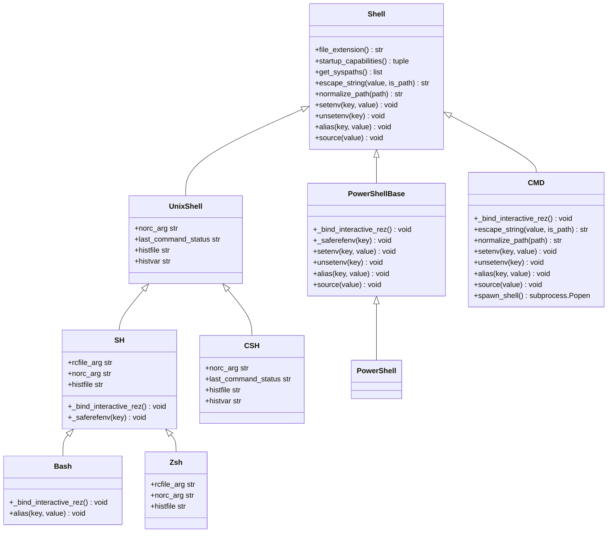
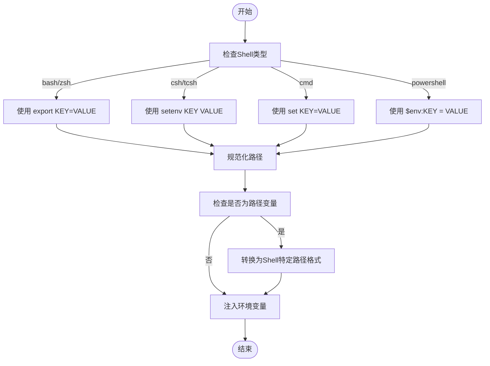
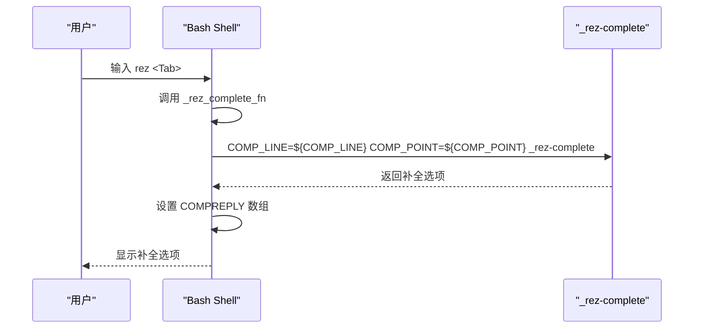
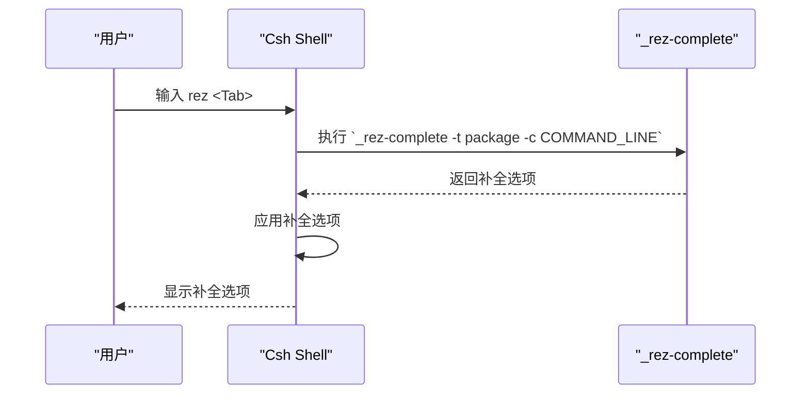
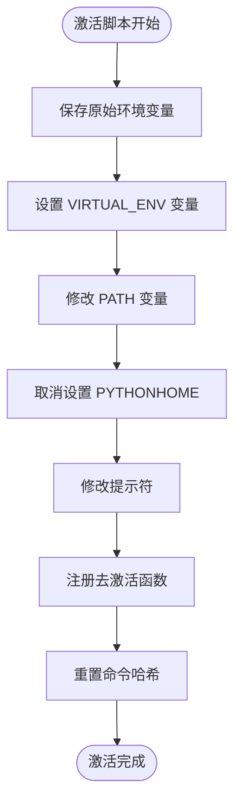
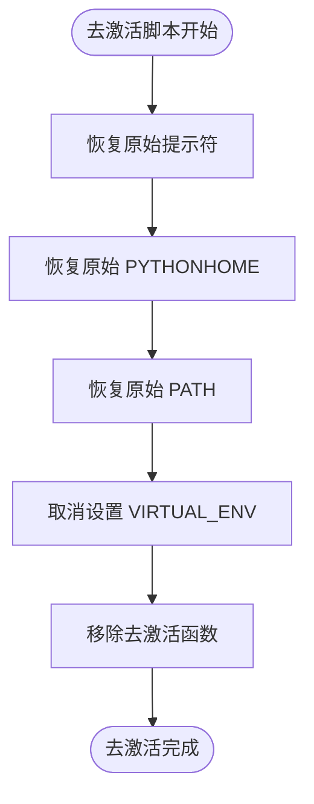
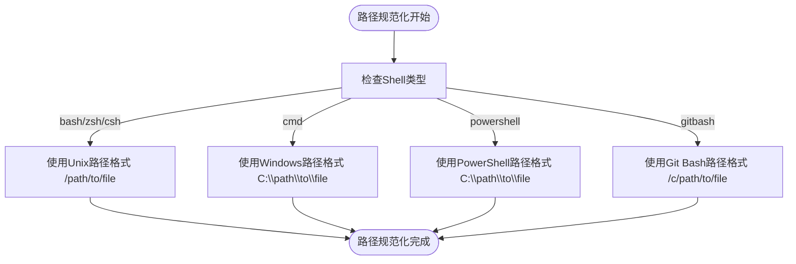
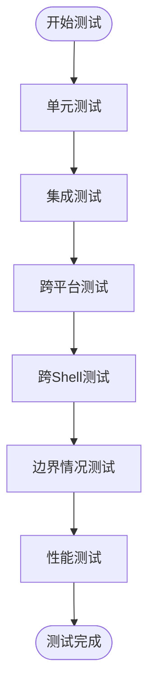

# Shell插件

<cite>
**本文档引用的文件**
- [complete.sh](file://completion/complete.sh)
- [complete.csh](file://completion/complete.csh)
- [complete.zsh](file://completion/complete.zsh)
- [activate](file://Scripts/activate)
- [Activate.ps1](file://Scripts/Activate.ps1)
- [activate.bat](file://Scripts/activate.bat)
- [deactivate.bat](file://Scripts/deactivate.bat)
- [bash.py](file://rez-3.3.0/src/rezplugins/shell/bash.py)
- [zsh.py](file://rez-3.3.0/src/rezplugins/shell/zsh.py)
- [csh.py](file://rez-3.3.0/src/rezplugins/shell/csh.py)
- [powershell.py](file://rez-3.3.0/src/rezplugins/shell/powershell.py)
- [gitbash.py](file://rez-3.3.0/src/rezplugins/shell/gitbash.py)
- [cmd.py](file://rez-3.3.0/src/rezplugins/shell/cmd.py)
- [rezconfig.py](file://rez-3.3.0/src/rezplugins/shell/rezconfig.py)
- [shells.py](file://rez-3.3.0/src/rez/shells.py)
- [2022-11-17.md](file://rez-3.3.0/ASWF/TSC/meeting-notes/2022-11-17.md)
</cite>

## 目录
1. [简介](#简介)
2. [Shell插件架构](#shell插件架构)
3. [环境变量注入机制](#环境变量注入机制)
4. [命令补全实现原理](#命令补全实现原理)
5. [会话管理与激活脚本](#会话管理与激活脚本)
6. [Shell类型支持与兼容性](#shell类型支持与兼容性)
7. [新Shell类型开发指南](#新shell类型开发指南)
8. [兼容性测试方法](#兼容性测试方法)
9. [结论](#结论)

## 简介
Shell插件系统是Rez环境的核心组件，负责在不同Shell环境中集成Rez功能。该系统支持多种Shell类型，包括bash、zsh、csh、powershell等，通过统一的插件架构实现环境变量注入、命令补全和会话管理。本文档详细分析Shell插件的集成机制，解释其工作原理，并提供新Shell类型支持的开发指南。

## Shell插件架构
Rez的Shell插件系统采用基于类继承的插件架构，每个支持的Shell类型都有一个对应的插件类。这些插件类继承自基类`Shell`，并实现了特定于Shell的功能。



**Diagram sources**
- [shells.py](file://rez-3.3.0/src/rez/shells.py#L90-L137)
- [bash.py](file://rez-3.3.0/src/rezplugins/shell/bash.py#L46-L95)
- [zsh.py](file://rez-3.3.0/src/rezplugins/shell/zsh.py#L1-L50)
- [csh.py](file://rez-3.3.0/src/rezplugins/shell/csh.py#L160-L177)
- [powershell.py](file://rez-3.3.0/src/rezplugins/shell/powershell.py#L1-L25)
- [cmd.py](file://rez-3.3.0/src/rezplugins/shell/cmd.py#L1-L340)

**Section sources**
- [shells.py](file://rez-3.3.0/src/rez/shells.py#L90-L137)
- [bash.py](file://rez-3.3.0/src/rezplugins/shell/bash.py#L46-L95)
- [zsh.py](file://rez-3.3.0/src/rezplugins/shell/zsh.py#L1-L50)

## 环境变量注入机制
Shell插件通过特定的Shell语法将环境变量注入到用户的Shell会话中。不同Shell类型使用不同的语法来设置环境变量。

### 环境变量注入流程


**Diagram sources**
- [csh.py](file://rez-3.3.0/src/rezplugins/shell/csh.py#L160-L162)
- [cmd.py](file://rez-3.3.0/src/rezplugins/shell/cmd.py#L252-L255)
- [powershell.py](file://rez-3.3.0/src/rezplugins/shell/powershell.py#L1-L25)

**Section sources**
- [csh.py](file://rez-3.3.0/src/rezplugins/shell/csh.py#L160-L162)
- [cmd.py](file://rez-3.3.0/src/rezplugins/shell/cmd.py#L252-L255)

## 命令补全实现原理
Rez的命令补全功能通过为不同Shell类型生成相应的补全脚本来实现。这些脚本利用Shell内置的补全机制来提供命令行补全功能。

### Bash补全实现
Bash补全脚本`complete.sh`定义了一个补全函数`_rez_complete_fn`，该函数调用`_rez-complete`命令获取补全选项，并将其设置为`COMPREPLY`数组。



**Diagram sources**
- [complete.sh](file://completion/complete.sh#L1-L22)

**Section sources**
- [complete.sh](file://completion/complete.sh#L1-L22)

### Zsh补全实现
Zsh补全脚本`complete.zsh`与Bash类似，也定义了一个补全函数`_rez_complete_fn`，但使用Zsh特定的`compctl`命令来注册补全函数。


**Diagram sources**
- [complete.zsh](file://completion/complete.zsh#L1-L22)

**Section sources**
- [complete.zsh](file://completion/complete.zsh#L1-L22)

### Csh补全实现
Csh补全脚本`complete.csh`使用Csh特定的`complete`命令来定义补全规则。它通过反引号执行`_rez-complete`命令来获取补全选项。



**Diagram sources**
- [complete.csh](file://completion/complete.csh#L1-L9)

**Section sources**
- [complete.csh](file://completion/complete.csh#L1-L9)

## 会话管理与激活脚本
Rez通过激活脚本来管理Shell会话，这些脚本负责设置环境变量、修改提示符和注册去激活函数。

### 激活脚本工作流程


**Diagram sources**
- [activate](file://Scripts/activate#L1-L67)
- [Activate.ps1](file://Scripts/Activate.ps1#L1-L438)
- [activate.bat](file://Scripts/activate.bat#L1-L34)

**Section sources**
- [activate](file://Scripts/activate#L1-L67)
- [Activate.ps1](file://Scripts/Activate.ps1#L1-L438)
- [activate.bat](file://Scripts/activate.bat#L1-L34)

### 去激活脚本工作流程


**Diagram sources**
- [deactivate.bat](file://Scripts/deactivate.bat#L1-L22)

**Section sources**
- [deactivate.bat](file://Scripts/deactivate.bat#L1-L22)

## Shell类型支持与兼容性
Rez支持多种Shell类型，每种类型都有特定的配置和实现细节。Shell插件的兼容性设计考虑了跨平台和跨Shell的差异。

### Shell配置参数
| Shell类型 | 提示符 | 可执行文件路径 | 特殊配置 |
|---------|------|------------|--------|
| sh | > | None | 无 |
| bash | > | None | 无 |
| csh | > | None | 无 |
| tcsh | > | None | 无 |
| zsh | % | None | 无 |
| cmd | $G | None | additional_pathext |
| powershell | > $ | None | execution_policy |
| pwsh | > $ | None | execution_policy |
| gitbash | > | None | 无 |

**Diagram sources**
- [rezconfig.py](file://rez-3.3.0/src/rezplugins/shell/rezconfig.py#L1-L45)

**Section sources**
- [rezconfig.py](file://rez-3.3.0/src/rezplugins/shell/rezconfig.py#L1-L45)

### 路径规范化策略
不同Shell类型在处理路径时有不同的要求。Rez通过`normalize_path`和`normalize_paths`方法来处理这些差异。



**Diagram sources**
- [gitbash.py](file://rez-3.3.0/src/rezplugins/shell/gitbash.py#L91-L109)
- [cmd.py](file://rez-3.3.0/src/rezplugins/shell/cmd.py#L243-L245)

**Section sources**
- [gitbash.py](file://rez-3.3.0/src/rezplugins/shell/gitbash.py#L91-L109)
- [cmd.py](file://rez-3.3.0/src/rezplugins/shell/cmd.py#L243-L245)

## 新Shell类型开发指南
开发新的Shell插件需要遵循Rez的插件架构，并实现必要的方法。

### 开发步骤
1. 创建新的插件文件
2. 继承适当的基类
3. 实现必需的方法
4. 注册插件

### 插件开发模板
```python
"""
[Shell名称] shell
"""
import os
from rez.config import config
from rez.rex import EscapedString
from rez.utils.platform_ import platform_
from rezplugins.shell.[base_shell] import [BaseShellClass]
from rez import module_root_path

class [ShellName]([BaseShellClass]):
    @classmethod
    def name(cls):
        return '[shell_name]'
    
    @classmethod
    def file_extension(cls):
        return '[file_extension]'
    
    # 实现其他必需的方法
    
def register_plugin():
    # 根据平台条件返回插件类
    if platform_.name == "[platform]":
        return [ShellName]
```

**Section sources**
- [bash.py](file://rez-3.3.0/src/rezplugins/shell/bash.py#L46-L95)
- [zsh.py](file://rez-3.3.0/src/rezplugins/shell/zsh.py#L1-L50)
- [csh.py](file://rez-3.3.0/src/rezplugins/shell/csh.py#L160-L177)

## 兼容性测试方法
确保Shell插件在不同环境下的兼容性是开发过程中的重要环节。

### 测试策略


**Diagram sources**
- [2022-11-17.md](file://rez-3.3.0/ASWF/TSC/meeting-notes/2022-11-17.md#L389-L394)

**Section sources**
- [2022-11-17.md](file://rez-3.3.0/ASWF/TSC/meeting-notes/2022-11-17.md#L389-L394)

### 测试用例示例
1. **环境变量注入测试**
   - 验证环境变量正确设置
   - 验证路径变量正确规范化
   - 验证特殊字符正确转义

2. **命令补全测试**
   - 验证补全函数正确注册
   - 验证补全选项正确返回
   - 验证补全在不同输入情况下正常工作

3. **会话管理测试**
   - 验证激活脚本正确执行
   - 验证去激活脚本正确恢复环境
   - 验证提示符正确修改和恢复

## 结论
Rez的Shell插件系统通过统一的插件架构支持多种Shell类型，实现了环境变量注入、命令补全和会话管理功能。该系统具有良好的扩展性，可以方便地添加对新Shell类型的支持。通过遵循本文档提供的开发指南和测试方法，可以确保新Shell插件的兼容性和稳定性。