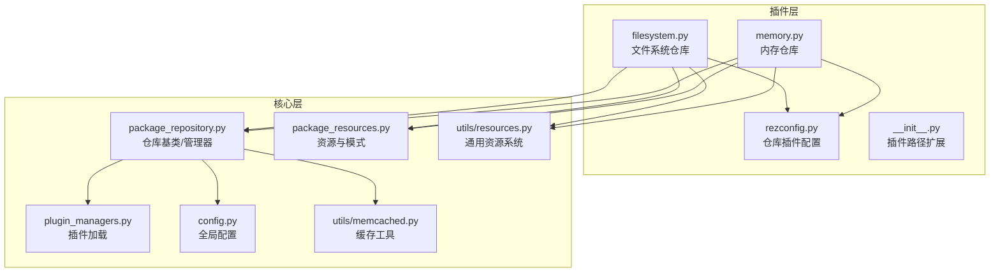
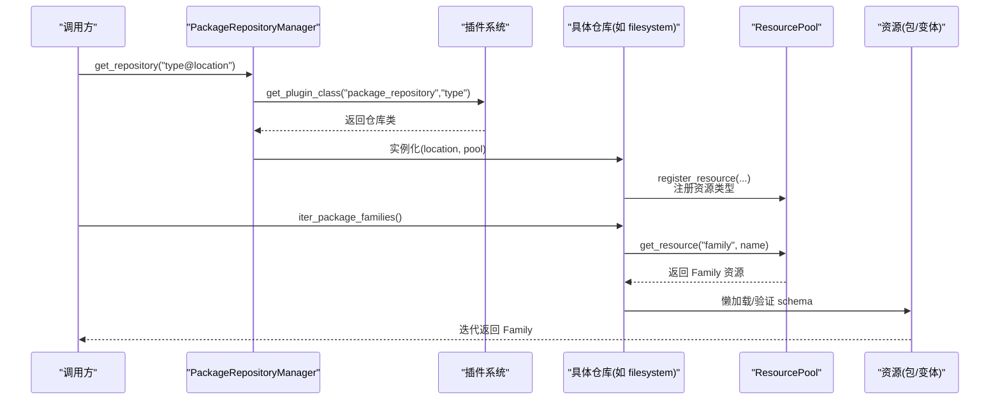
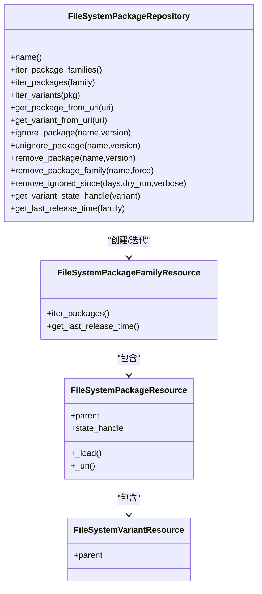
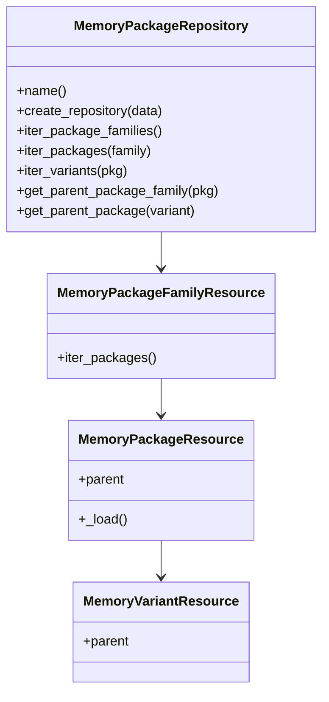
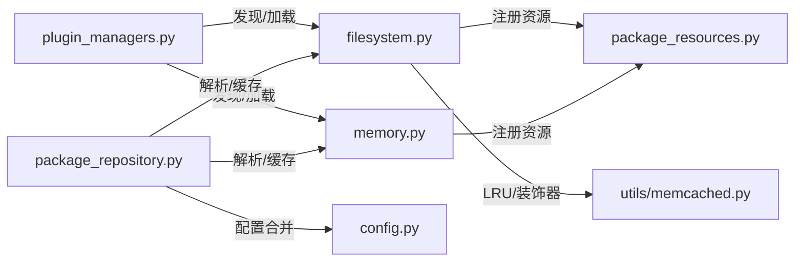

# 包仓库插件

<cite>
**本文引用的文件列表**
- [filesystem.py](file://rez-3.3.0/src/rezplugins/package_repository/filesystem.py)
- [memory.py](file://rez-3.3.0/src/rezplugins/package_repository/memory.py)
- [__init__.py（仓库插件入口）](file://rez-3.3.0/src/rezplugins/package_repository/__init__.py)
- [package_repository.py（基类与管理器）](file://rez-3.3.0/src/rez/package_repository.py)
- [package_resources.py（资源与模式）](file://rez-3.3.0/src/rez/package_resources.py)
- [resources.py（通用资源系统）](file://rez-3.3.0/src/rez/utils/resources.py)
- [rezconfig.py（仓库插件配置）](file://rez-3.3.0/src/rezplugins/package_repository/rezconfig.py)
- [developing_your_own_plugin.rst（插件开发指南）](file://rez-3.3.0/docs/source/guides/developing_your_own_plugin.rst)
- [plugin_managers.py（插件加载）](file://rez-3.3.0/src/rez/plugin_managers.py)
- [memcached.py（缓存工具）](file://rez-3.3.0/src/rez/utils/memcached.py)
- [config.py（全局配置）](file://rez-3.3.0/src/rez/config.py)
- [test_package_repository.py（仓库测试）](file://rez-3.3.0/src/rez/tests/test_package_repository.py)
</cite>

## 目录
1. [简介](#简介)
2. [项目结构](#项目结构)
3. [核心组件](#核心组件)
4. [架构总览](#架构总览)
5. [详细组件分析](#详细组件分析)
6. [依赖关系分析](#依赖关系分析)
7. [性能与缓存策略](#性能与缓存策略)
8. [网络超时与故障转移](#网络超时与故障转移)
9. [自定义仓库插件开发指南](#自定义仓库插件开发指南)
10. [本地与远程仓库集成模式](#本地与远程仓库集成模式)
11. [故障排查](#故障排查)
12. [结论](#结论)

## 简介
本文件面向需要扩展或自定义包仓库插件的开发者，系统性阐述 Rez 的包仓库插件体系：包括 filesystem 与 memory 两种内置仓库类型的工作机制，如何基于现有基类与资源模型开发自定义仓库（如云存储或数据库后端），以及包元数据读取、缓存策略、网络超时与故障转移等关键主题。同时结合 repository 目录中的示例，给出本地与远程仓库的集成模式建议。

## 项目结构
仓库插件位于插件命名空间包中，通过插件发现机制自动加载；仓库基类与管理器在核心模块中定义，资源系统提供统一的数据加载与缓存抽象。

图表来源
- [filesystem.py](file://rez-3.3.0/src/rezplugins/package_repository/filesystem.py#L1-L120)
- [memory.py](file://rez-3.3.0/src/rezplugins/package_repository/memory.py#L1-L120)
- [package_repository.py](file://rez-3.3.0/src/rez/package_repository.py#L1-L120)
- [package_resources.py](file://rez-3.3.0/src/rez/package_resources.py#L1-L120)
- [resources.py](file://rez-3.3.0/src/rez/utils/resources.py#L1-L120)
- [plugin_managers.py](file://rez-3.3.0/src/rez/plugin_managers.py#L1-L120)
- [config.py](file://rez-3.3.0/src/rez/config.py#L1-L120)
- [memcached.py](file://rez-3.3.0/src/rez/utils/memcached.py#L1-L120)
- [rezconfig.py](file://rez-3.3.0/src/rezplugins/package_repository/rezconfig.py#L1-L49)

章节来源
- [filesystem.py](file://rez-3.3.0/src/rezplugins/package_repository/filesystem.py#L1-L120)
- [memory.py](file://rez-3.3.0/src/rezplugins/package_repository/memory.py#L1-L120)
- [package_repository.py](file://rez-3.3.0/src/rez/package_repository.py#L1-L120)
- [plugin_managers.py](file://rez-3.3.0/src/rez/plugin_managers.py#L1-L120)

## 核心组件
- 仓库基类与管理器
  - 基类提供统一接口：枚举家族/包/变体、URI 解析、忽略/删除、安装等。
  - 管理器负责按字符串路径解析仓库类型与位置，缓存实例，并通过插件系统加载具体实现。
- 资源系统
  - 通过 ResourcePool 统一注册与缓存资源类型；Resource 提供延迟加载与属性校验。
  - PackageRepository 提供 make_resource_handle/get_resource 等工厂方法，确保资源变量标准化。
- 插件系统
  - 通过命名空间包与 entry points 自动发现仓库插件；支持覆盖默认实现。
- 缓存与配置
  - memcached 工具提供装饰器与连接池；仓库配置通过 rezconfig 与全局 config 合并生效。

章节来源
- [package_repository.py](file://rez-3.3.0/src/rez/package_repository.py#L59-L220)
- [resources.py](file://rez-3.3.0/src/rez/utils/resources.py#L45-L120)
- [plugin_managers.py](file://rez-3.3.0/src/rez/plugin_managers.py#L120-L200)
- [memcached.py](file://rez-3.3.0/src/rez/utils/memcached.py#L248-L282)
- [config.py](file://rez-3.3.0/src/rez/config.py#L805-L840)

## 架构总览
仓库插件采用“插件类型 + 资源模型”的分层设计：
- 插件类型：package_repository
- 具体实现：filesystem、memory 等
- 资源模型：Family/Packge/Variant 三类资源，配合 schema 验证与延迟加载
- 管理与缓存：PackageRepositoryManager 统一获取与缓存仓库；ResourcePool 缓存资源；memcached 可选加速目录/列表等

图表来源
- [package_repository.py](file://rez-3.3.0/src/rez/package_repository.py#L537-L645)
- [plugin_managers.py](file://rez-3.3.0/src/rez/plugin_managers.py#L178-L200)
- [filesystem.py](file://rez-3.3.0/src/rezplugins/package_repository/filesystem.py#L520-L560)
- [resources.py](file://rez-3.3.0/src/rez/utils/resources.py#L188-L200)

## 详细组件分析

### 文件系统仓库（filesystem）
- 职责
  - 以文件系统为后端，组织包定义文件（package.py/package.yaml）与变体。
  - 支持“组合式”单文件多版本包（combined）与普通目录式包。
  - 提供 URI 解析、忽略/删除、最后发布时间查询、状态句柄等能力。
- 关键点
  - 资源类型：Family、Package、Variant 三类资源，均继承自对应 Helper 类，实现 _load/_uri 等。
  - 缓存：对目录遍历与文件查找使用 LRU 缓存；可选 memcached 装饰器缓存目录列表。
  - 配置：file_lock_*、check_package_definition_files、package_filenames 等。
  - 安装/取消安装回调：用于并发写入保护与清理。
- 数据流
  - 从 URI 解析出包名与版本，定位文件路径，加载定义并进行格式兼容处理。
  - 对旧格式（release.yaml/.metadata）做向后兼容转换。

图表来源
- [filesystem.py](file://rez-3.3.0/src/rezplugins/package_repository/filesystem.py#L430-L800)
- [filesystem.py](file://rez-3.3.0/src/rezplugins/package_repository/filesystem.py#L82-L205)
- [filesystem.py](file://rez-3.3.0/src/rezplugins/package_repository/filesystem.py#L265-L320)
- [filesystem.py](file://rez-3.3.0/src/rezplugins/package_repository/filesystem.py#L320-L420)

章节来源
- [filesystem.py](file://rez-3.3.0/src/rezplugins/package_repository/filesystem.py#L430-L800)
- [filesystem.py](file://rez-3.3.0/src/rezplugins/package_repository/filesystem.py#L82-L205)
- [filesystem.py](file://rez-3.3.0/src/rezplugins/package_repository/filesystem.py#L265-L320)
- [filesystem.py](file://rez-3.3.0/src/rezplugins/package_repository/filesystem.py#L320-L420)
- [rezconfig.py](file://rez-3.3.0/src/rezplugins/package_repository/rezconfig.py#L1-L49)

### 内存仓库（memory）
- 职责
  - 将包定义以字典形式驻留在内存中，适合临时/开发场景与程序化构建。
- 关键点
  - 资源类型：MemoryPackageFamilyResource/MemoryPackageResource/MemoryVariantResource。
  - 通过 create_repository 静态方法创建独立仓库实例，不参与持久缓存。
- 数据流
  - 从 data 字典按家族/版本索引返回资源对象，不涉及磁盘 IO。

图表来源
- [memory.py](file://rez-3.3.0/src/rezplugins/package_repository/memory.py#L107-L202)
- [memory.py](file://rez-3.3.0/src/rezplugins/package_repository/memory.py#L21-L106)

章节来源
- [memory.py](file://rez-3.3.0/src/rezplugins/package_repository/memory.py#L107-L202)
- [memory.py](file://rez-3.3.0/src/rezplugins/package_repository/memory.py#L21-L106)

### 资源与模式
- 资源基类
  - Resource：延迟加载、属性校验、缓存句柄；ResourcePool 统一缓存与注册。
- 包资源模式
  - package_family_schema、package_schema、variant_schema 等，约束包/变体字段与类型。
- 资源包装器
  - PackageFamilyResource、PackageResourceHelper、VariantResourceHelper 等，封装访问逻辑与派生属性。

章节来源
- [resources.py](file://rez-3.3.0/src/rez/utils/resources.py#L45-L120)
- [resources.py](file://rez-3.3.0/src/rez/utils/resources.py#L188-L200)
- [package_resources.py](file://rez-3.3.0/src/rez/package_resources.py#L1-L120)
- [package_resources.py](file://rez-3.3.0/src/rez/package_resources.py#L120-L200)

## 依赖关系分析
- 插件发现
  - 通过 extend_path 扩展 rezplugins 路径，结合 entry_points 加载仓库插件。
- 仓库管理
  - PackageRepositoryManager 依据 "type@location" 形式解析仓库，缓存实例并复用。
- 资源缓存
  - ResourcePool 使用 LRU 缓存资源；PackageRepository 在部分方法上启用 memcached 装饰器。
- 配置合并
  - 插件配置由 _PluginConfigs 按插件类型懒加载并校验，与用户配置深度合并。

图表来源
- [plugin_managers.py](file://rez-3.3.0/src/rez/plugin_managers.py#L120-L200)
- [package_repository.py](file://rez-3.3.0/src/rez/package_repository.py#L537-L645)
- [filesystem.py](file://rez-3.3.0/src/rezplugins/package_repository/filesystem.py#L520-L560)
- [memcached.py](file://rez-3.3.0/src/rez/utils/memcached.py#L248-L282)
- [config.py](file://rez-3.3.0/src/rez/config.py#L805-L840)

章节来源
- [plugin_managers.py](file://rez-3.3.0/src/rez/plugin_managers.py#L120-L200)
- [package_repository.py](file://rez-3.3.0/src/rez/package_repository.py#L537-L645)
- [filesystem.py](file://rez-3.3.0/src/rezplugins/package_repository/filesystem.py#L520-L560)
- [memcached.py](file://rez-3.3.0/src/rez/utils/memcached.py#L248-L282)
- [config.py](file://rez-3.3.0/src/rez/config.py#L805-L840)

## 性能与缓存策略
- 目录遍历缓存
  - filesystem 仓库对家族/版本目录遍历使用 LRU 缓存，减少磁盘 stat 与 readdir 开销。
- memcached 列表缓存
  - 对目录列表等重操作使用 memcached 装饰器，结合 pool_memcached_connections 连接池降低服务器往返。
- 资源缓存
  - ResourcePool 缓存资源实例；PackageRepository 提供 clear_caches 清理。
- 配置开关
  - 可通过配置禁用 memcache 或调整压缩阈值、列表缓存开关等。

章节来源
- [filesystem.py](file://rez-3.3.0/src/rezplugins/package_repository/filesystem.py#L528-L560)
- [filesystem.py](file://rez-3.3.0/src/rezplugins/package_repository/filesystem.py#L534-L552)
- [memcached.py](file://rez-3.3.0/src/rez/utils/memcached.py#L248-L282)
- [package_repository.py](file://rez-3.3.0/src/rez/package_repository.py#L99-L102)

## 网络超时与故障转移
- 文件锁与并发控制
  - filesystem 仓库通过配置项 file_lock_type、file_lock_timeout、file_lock_dir 控制并发写入与锁文件位置，避免多进程/多节点同时写入导致的竞争。
- 故障转移与降级
  - 当 memcached 不可用时，装饰器与缓存工具会优雅回退到本地缓存或直接计算；仓库层未实现网络重试，建议在自定义仓库中结合外部客户端的超时与重试策略。
- URI 与路径规范化
  - 管理器对路径进行规范化，避免大小写差异等问题（在大小写不敏感平台）。

章节来源
- [rezconfig.py](file://rez-3.3.0/src/rezplugins/package_repository/rezconfig.py#L1-L49)
- [filesystem.py](file://rez-3.3.0/src/rezplugins/package_repository/filesystem.py#L590-L658)
- [test_package_repository.py](file://rez-3.3.0/src/rez/tests/test_package_repository.py#L1-L42)

## 自定义仓库插件开发指南
- 插件结构
  - 使用命名空间包 rezplugins/package_repository 下的模块作为插件；模块需提供 register_plugin() 并导出仓库类。
- 基类与接口
  - 继承 PackageRepository，至少实现：name、iter_package_families、iter_packages、iter_variants、get_package、get_variant_state_handle、get_last_release_time 等。
  - 通过 register_resource 注册 Family/Package/Variant 资源类。
- 资源与模式
  - 资源类需实现 _load/_uri 等；schema 使用 package_resources 中的 package_*_schema。
- 插件配置
  - 在模块内提供 rezconfig.py，定义插件配置项；全局配置通过 _PluginConfigs 合并。
- 插件加载
  - 通过 extend_path 与 entry_points 自动发现；也可通过 REZ_PLUGIN_PATH 或自定义入口点注册。
- 开发建议
  - 明确 URI 规范与状态句柄语义，便于缓存与失效判断。
  - 对网络/IO 操作添加超时与重试策略，必要时引入连接池。
  - 提供 ignore/unignore/remove 等运维能力，提升可维护性。

章节来源
- [developing_your_own_plugin.rst](file://rez-3.3.0/docs/source/guides/developing_your_own_plugin.rst#L1-L134)
- [package_repository.py](file://rez-3.3.0/src/rez/package_repository.py#L59-L220)
- [package_resources.py](file://rez-3.3.0/src/rez/package_resources.py#L120-L200)
- [plugin_managers.py](file://rez-3.3.0/src/rez/plugin_managers.py#L120-L200)
- [config.py](file://rez-3.3.0/src/rez/config.py#L805-L840)

## 本地与远程仓库集成模式
- 本地仓库
  - filesystem 仓库直接挂载共享文件系统或本地目录，适合团队协作与 CI 缓存。
- 远程仓库
  - 可基于自定义仓库插件对接云存储（如 S3）、制品库（Artifactory/Nexus）或数据库后端。
  - 推荐模式
    - 两层缓存：远程仓库作为“远端仓库”，本地磁盘作为“本地缓存”；通过复制/同步实现缓存命中。
    - 变体安装：实现 install_variant/dry_run 等，保证变体在目标后端存在且一致。
    - URI 与状态：提供稳定的 URI 表达与状态句柄，便于缓存失效与增量更新。
- 集成要点
  - 保持与现有资源模型一致，确保包元数据 schema 与变体定义兼容。
  - 通过配置项控制认证、超时、重试与缓存行为。

章节来源
- [filesystem.py](file://rez-3.3.0/src/rezplugins/package_repository/filesystem.py#L590-L658)
- [package_repository.py](file://rez-3.3.0/src/rez/package_repository.py#L324-L364)
- [memcached.py](file://rez-3.3.0/src/rez/utils/memcached.py#L248-L282)

## 故障排查
- 插件未加载
  - 检查插件路径是否加入 REZ_PLUGIN_PATH；确认模块名与 register_plugin() 正确。
- 资源加载失败
  - 查看 schema 校验错误；确认包定义文件格式与字段正确。
- 缓存异常
  - memcache 不可用时检查服务器连通性；必要时禁用 memcache 或调整压缩阈值。
- 并发冲突
  - 检查 file_lock_* 配置；确认锁文件目录权限与可见性。

章节来源
- [plugin_managers.py](file://rez-3.3.0/src/rez/plugin_managers.py#L120-L200)
- [package_resources.py](file://rez-3.3.0/src/rez/package_resources.py#L120-L200)
- [memcached.py](file://rez-3.3.0/src/rez/utils/memcached.py#L66-L120)
- [rezconfig.py](file://rez-3.3.0/src/rezplugins/package_repository/rezconfig.py#L1-L49)

## 结论
Rez 的包仓库插件体系以清晰的资源模型与插件机制为基础，filesystem 与 memory 两类内置仓库分别覆盖了本地与临时场景。通过统一的基类接口、资源缓存与可选的 memcached 加速，开发者可以快速扩展自定义仓库以适配云存储或数据库后端。建议在自定义实现中重视 URI 规范、状态句柄、并发控制与缓存策略，以获得稳定高效的包解析与安装体验。