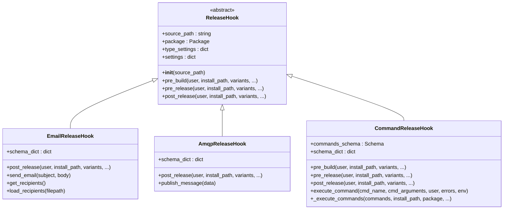
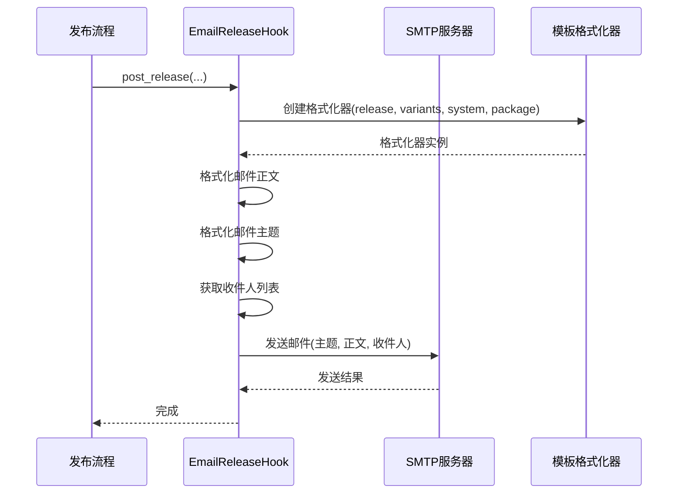
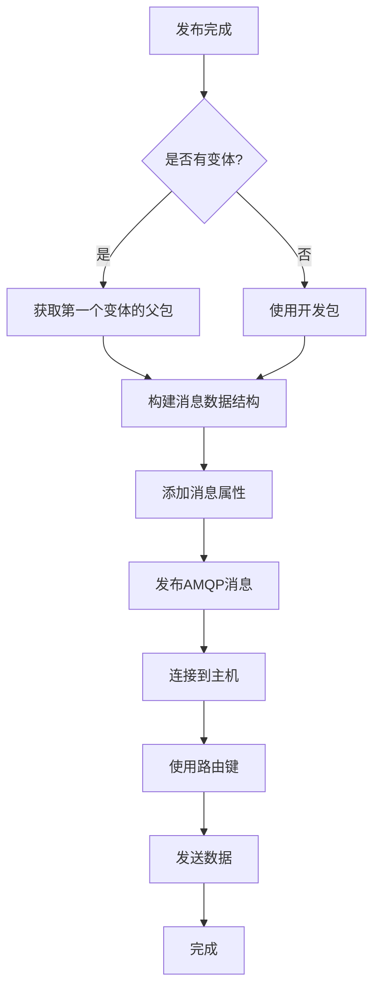
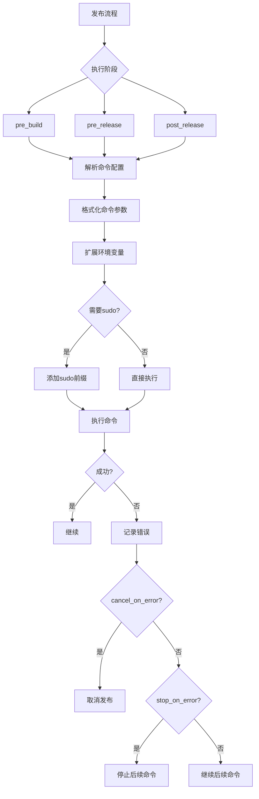
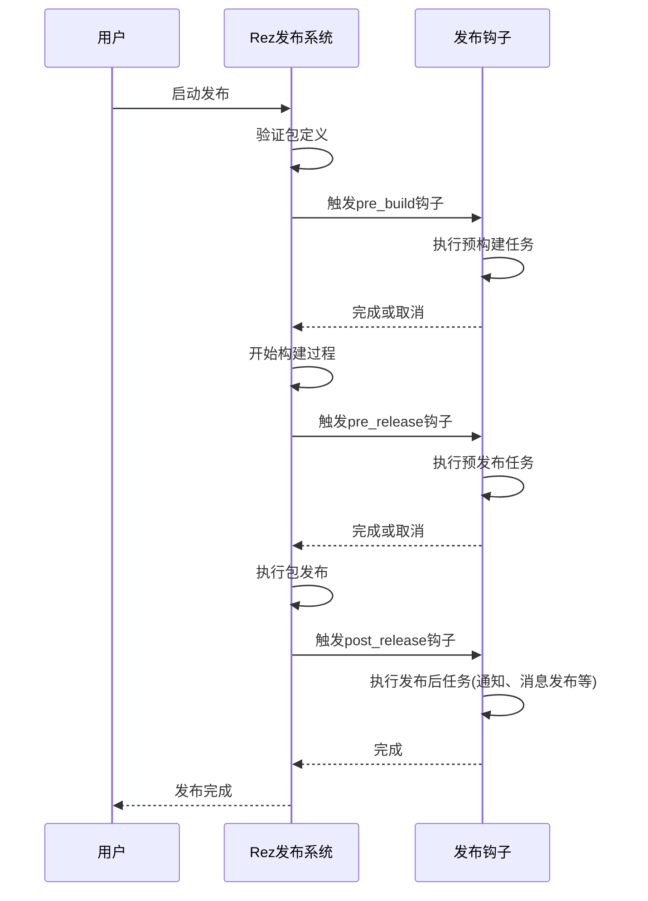
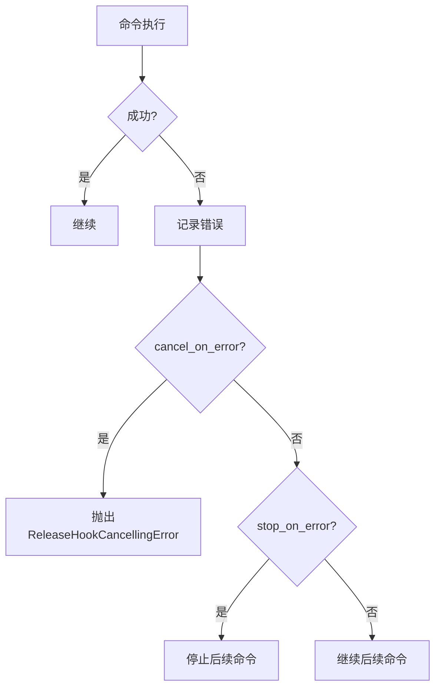

# 发布钩子插件

<cite>
**本文档引用的文件**  
- [release_hook.py](file://rez-3.3.0\src\rez\release_hook.py)
- [emailer.py](file://rez-3.3.0\src\rezplugins\release_hook\emailer.py)
- [amqp.py](file://rez-3.3.0\src\rezplugins\release_hook\amqp.py)
- [command.py](file://rez-3.3.0\src\rezplugins\release_hook\command.py)
- [rezconfig.py](file://rez-3.3.0\src\rezplugins\release_hook\rezconfig.py)
</cite>

## 目录
1. [简介](#简介)
2. [发布钩子架构](#发布钩子架构)
3. [核心钩子类型详解](#核心钩子类型详解)
4. [执行流程与触发时机](#执行流程与触发时机)
5. [异步执行与错误重试机制](#异步执行与错误重试机制)
6. [消息队列集成](#消息队列集成)
7. [安全性考虑](#安全性考虑)
8. [自定义插件开发指南](#自定义插件开发指南)
9. [外部系统集成示例](#外部系统集成示例)
10. [配置与最佳实践](#配置与最佳实践)

## 简介

发布钩子插件是Rez包管理系统中的关键扩展机制，允许在软件包发布过程的不同阶段注入自定义行为。这些钩子可用于发送通知、执行自动化任务、集成外部监控系统或实施发布策略。本文档详细说明了emailer、amqp和command等核心钩子的触发时机和执行流程，提供开发自定义通知或自动化任务插件的完整指南，并涵盖异步执行、错误重试、消息队列集成和安全性等关键方面。

## 发布钩子架构

Rez的发布钩子系统基于插件架构，通过定义标准化的钩子接口来实现可扩展性。核心架构由基类`ReleaseHook`和具体的钩子实现组成，通过插件管理器进行动态加载和实例化。



**图示来源**  
- [release_hook.py](file://rez-3.3.0\src\rez\release_hook.py#L37-L142)
- [emailer.py](file://rez-3.3.0\src\rezplugins\release_hook\emailer.py#L19-L157)
- [amqp.py](file://rez-3.3.0\src\rezplugins\release_hook\amqp.py#L14-L101)
- [command.py](file://rez-3.3.0\src\rezplugins\release_hook\command.py#L24-L211)

**本节来源**  
- [release_hook.py](file://rez-3.3.0\src\rez\release_hook.py#L37-L142)

## 核心钩子类型详解

### Emailer钩子

emailer钩子在包发布完成后发送电子邮件通知。它支持灵活的收件人配置，包括直接指定邮箱地址或通过YAML配置文件定义基于包属性的规则。



**图示来源**  
- [emailer.py](file://rez-3.3.0\src\rezplugins\release_hook\emailer.py#L37-L94)

### AMQP钩子

amqp钩子通过AMQP协议将发布事件发布到消息代理，实现与其他系统的松耦合集成。它将发布信息序列化为JSON格式的消息，包含包元数据和变体信息。



**图示来源**  
- [amqp.py](file://rez-3.3.0\src\rezplugins\release_hook\amqp.py#L51-L93)

### Command钩子

command钩子允许在发布过程的各个阶段执行自定义shell命令，支持预构建、预发布和发布后三个阶段的命令执行。



**图示来源**  
- [command.py](file://rez-3.3.0\src\rezplugins\release_hook\command.py#L98-L207)

**本节来源**  
- [emailer.py](file://rez-3.3.0\src\rezplugins\release_hook\emailer.py#L19-L157)
- [amqp.py](file://rez-3.3.0\src\rezplugins\release_hook\amqp.py#L14-L101)
- [command.py](file://rez-3.3.0\src\rezplugins\release_hook\command.py#L24-L211)

## 执行流程与触发时机

发布钩子的执行流程严格遵循Rez的发布生命周期，分为三个主要阶段：预构建、预发布和发布后。每个阶段都有明确的触发时机和执行上下文。



**图示来源**  
- [release_hook.py](file://rez-3.3.0\src\rez\release_hook.py#L60-L128)

**本节来源**  
- [release_hook.py](file://rez-3.3.0\src\rez\release_hook.py#L60-L128)

## 异步执行与错误重试机制

发布钩子系统通过配置选项提供了灵活的错误处理和执行控制机制，确保发布过程的可靠性和稳定性。

### 错误处理策略

不同钩子类型提供了不同的错误处理配置：

- **Command钩子**：通过`cancel_on_error`和`stop_on_error`参数控制错误行为
- **Emailer钩子**：失败时记录错误但不中断发布流程
- **AMQP钩子**：连接失败时记录错误但继续执行



**图示来源**  
- [command.py](file://rez-3.3.0\src\rezplugins\release_hook\command.py#L106-L123)

### 异步执行考虑

虽然核心钩子是同步执行的，但可以通过以下方式实现异步行为：

1. 在命令钩子中调用异步脚本
2. 使用AMQP钩子将任务发布到消息队列进行异步处理
3. 在自定义钩子中实现异步执行逻辑

**本节来源**  
- [command.py](file://rez-3.3.0\src\rezplugins\release_hook\command.py#L41-L46)
- [amqp.py](file://rez-3.3.0\src\rezplugins\release_hook\amqp.py#L80-L93)

## 消息队列集成

AMQP钩子提供了与消息代理的集成能力，支持RabbitMQ等AMQP协议兼容的消息系统。

### 消息结构

发布的消息包含完整的包发布信息：

```json
{
  "package": {
    "name": "package_name",
    "version": "1.0.0",
    "qualified_name": "package_name-1.0.0",
    "uri": "path/to/package",
    "user": "username",
    "handle": {}
  },
  "variants": [
    {"handle": {}},
    {"handle": {}}
  ]
}
```

### 配置参数

| 参数 | 类型 | 描述 |
|------|------|------|
| host | 字符串 | AMQP服务器主机 |
| userid | 字符串 | 认证用户名 |
| password | 字符串 | 认证密码 |
| connect_timeout | 整数 | 连接超时时间(秒) |
| exchange_name | 字符串 | 交换机名称 |
| exchange_routing_key | 字符串 | 路由键 |
| message_delivery_mode | 整数 | 消息传递模式 |
| message_attributes | 字典 | 附加消息属性 |

**本节来源**  
- [amqp.py](file://rez-3.3.0\src\rezplugins\release_hook\amqp.py#L34-L42)
- [rezconfig.py](file://rez-3.3.0\src\rezplugins\release_hook\rezconfig.py#L108-L132)

## 安全性考虑

发布钩子系统在设计时考虑了多个安全方面，确保发布过程的安全性和可控性。

### 认证与授权

- **Command钩子**：支持以不同用户身份执行命令，包括root权限
- **AMQP钩子**：需要配置用户名和密码进行认证
- **Emailer钩子**：通过SMTP服务器进行身份验证

### 配置安全

- 敏感信息如密码应通过环境变量或安全存储提供
- 命令执行前进行路径验证，防止命令注入
- 支持通过配置文件集中管理收件人规则

### 执行安全

- 所有外部命令执行都通过安全的子进程接口
- 环境变量扩展时进行适当的转义处理
- 提供详细的日志记录用于审计和故障排查

**本节来源**  
- [command.py](file://rez-3.3.0\src\rezplugins\release_hook\command.py#L80-L94)
- [amqp.py](file://rez-3.3.0\src\rezplugins\release_hook\amqp.py#L81-L83)
- [emailer.py](file://rez-3.3.0\src\rezplugins\release_hook\emailer.py#L69-L72)

## 自定义插件开发指南

开发自定义发布钩子插件需要遵循Rez的插件架构规范。

### 基本结构

```python
from rez.release_hook import ReleaseHook

class CustomReleaseHook(ReleaseHook):
    schema_dict = {
        # 配置模式定义
    }
    
    @classmethod
    def name(cls):
        return "custom_hook_name"
    
    def __init__(self, source_path):
        super(CustomReleaseHook, self).__init__(source_path)
    
    def pre_build(self, user, install_path, variants=None, **kwargs):
        # 预构建逻辑
        pass
    
    def pre_release(self, user, install_path, variants=None, **kwargs):
        # 预发布逻辑
        pass
    
    def post_release(self, user, install_path, variants, **kwargs):
        # 发布后逻辑
        pass

def register_plugin():
    return CustomReleaseHook
```

### 开发步骤

1. 继承`ReleaseHook`基类
2. 实现`name()`类方法返回钩子名称
3. 定义`schema_dict`配置模式
4. 实现所需的钩子方法
5. 提供`register_plugin()`函数

**本节来源**  
- [release_hook.py](file://rez-3.3.0\src\rez\release_hook.py#L37-L129)
- [emailer.py](file://rez-3.3.0\src\rezplugins\release_hook\emailer.py#L19-L33)

## 外部系统集成示例

### 集成Slack通知

通过command钩子调用curl命令发送Slack通知：

```yaml
command:
  post_release_commands:
    - command: curl
      args: 
        - -X POST
        - https://hooks.slack.com/services/TOKEN
        - -H Content-type: application/json
        - --data '{"text": "Package {package.qualified_name} released by {system.user}"}'
```

### 集成Jenkins构建

使用command钩子触发远程Jenkins构建：

```yaml
command:
  post_release_commands:
    - command: curl
      args:
        - -X POST
        - http://jenkins-server/job/build/job/{package.name}/build
        - --user {JENKINS_USER}:{JENKINS_TOKEN}
```

### 集成Prometheus监控

通过AMQP钩子将发布事件发送到监控系统：

```yaml
amqp:
  host: monitoring-broker.internal
  exchange_name: metrics
  exchange_routing_key: rez.release
  message_attributes:
    environment: production
    service: package-manager
```

**本节来源**  
- [command.py](file://rez-3.3.0\src\rezplugins\release_hook\command.py#L46-L48)
- [amqp.py](file://rez-3.3.0\src\rezplugins\release_hook\amqp.py#L34-L42)

## 配置与最佳实践

### 配置文件结构

发布钩子配置位于`rezconfig.py`文件中，按钩子类型组织：

```python
emailer = {
    "smtp_host": "mail.company.com",
    "smtp_port": 587,
    "sender": "{system.user}@company.com",
    "recipients": ["team@company.com"],
    "subject": "[发布] {package.qualified_name}",
    "body": "包 {package.qualified_name} 已由 {system.user} 发布"
}

amqp = {
    "host": "mq.company.com",
    "exchange_routing_key": "REZ.PACKAGE.RELEASED"
}

command = {
    "print_commands": true,
    "cancel_on_error": true,
    "pre_build_commands": [],
    "pre_release_commands": [],
    "post_release_commands": []
}
```

### 最佳实践

1. **错误处理**：合理配置`cancel_on_error`和`stop_on_error`参数
2. **安全性**：避免在配置文件中硬编码敏感信息
3. **性能**：长时间运行的任务应通过消息队列异步处理
4. **可维护性**：使用清晰的命名和详细的文档
5. **测试**：在生产环境前充分测试自定义钩子

**本节来源**  
- [rezconfig.py](file://rez-3.3.0\src\rezplugins\release_hook\rezconfig.py#L5-L132)