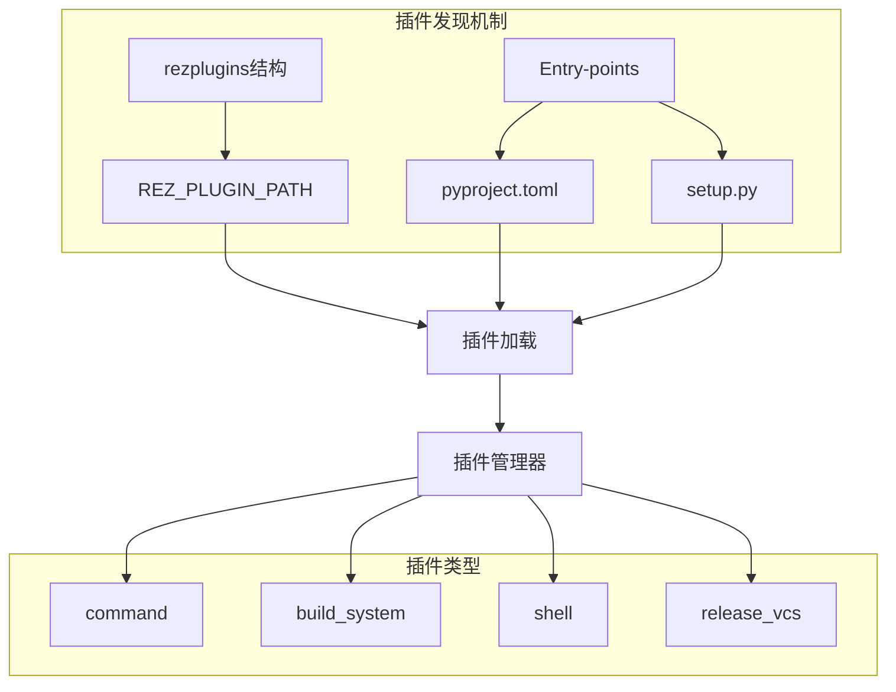
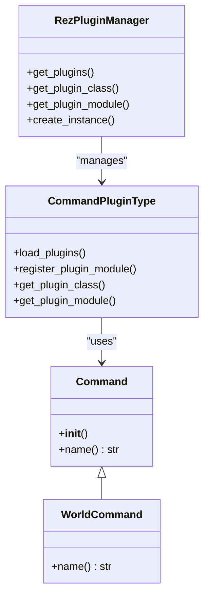
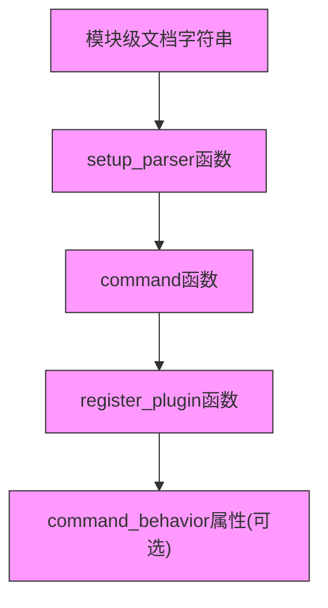
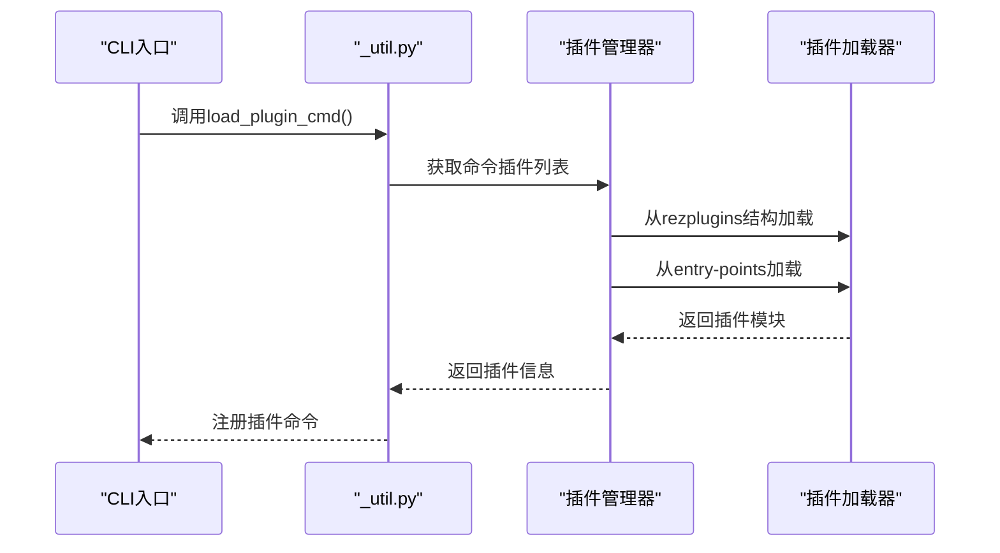
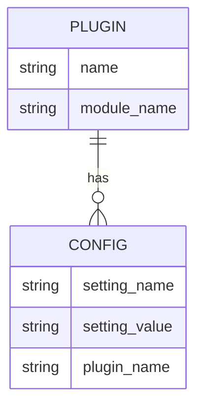
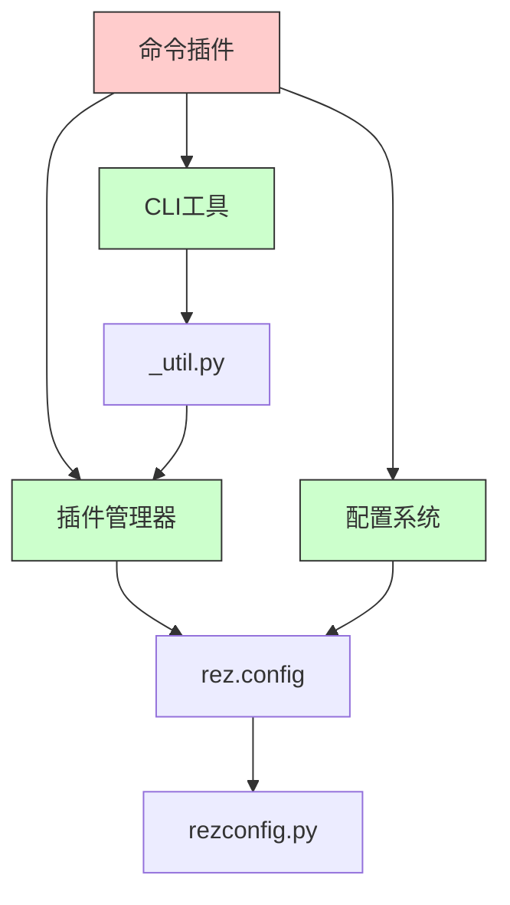

# 命令插件

<cite>
**本文档中引用的文件**  
- [world.py](file://rez-3.3.0\example_extensions\hello_cmd\rezplugins\command\world.py)
- [command.py](file://rez-3.3.0\src\rez\command.py)
- [hello_cmd\setup.py](file://rez-3.3.0\example_extensions\hello_cmd\setup.py)
- [hello_cmd\lib.py](file://rez-3.3.0\example_extensions\hello_cmd\lib.py)
- [hello_cmd\rezplugins\command\rezconfig.py](file://rez-3.3.0\example_extensions\hello_cmd\rezplugins\command\rezconfig.py)
- [_util.py](file://rez-3.3.0\src\rez\cli\_util.py)
- [plugin_managers.py](file://rez-3.3.0\src\rez\plugin_managers.py)
- [developing_your_own_plugin.rst](file://rez-3.3.0\docs\source\guides\developing_your_own_plugin.rst)
- [plugins.rst](file://rez-3.3.0\docs\source\plugins.rst)
</cite>

## 目录
1. [简介](#简介)
2. [项目结构](#项目结构)
3. [核心组件](#核心组件)
4. [架构概述](#架构概述)
5. [详细组件分析](#详细组件分析)
6. [依赖分析](#依赖分析)
7. [性能考虑](#性能考虑)
8. [故障排除指南](#故障排除指南)
9. [结论](#结论)

## 简介
本文档详细介绍了如何通过实现命令插件来扩展Rez CLI功能。以hello_cmd示例为基础，展示了自定义命令的注册与执行流程，包括插件发现机制、入口点配置和命令参数处理。文档还涵盖了插件接口定义、回调函数签名、上下文对象使用方法，以及错误处理、日志记录和单元测试的最佳实践。

## 项目结构
Rez命令插件系统采用模块化设计，通过特定的目录结构和配置文件来管理插件。核心插件位于`src/rezplugins`目录下，而自定义插件可以通过`rezplugins`命名空间包或entry-points机制进行扩展。

**Diagram sources**
- [plugins.rst](file://rez-3.3.0\docs\source\plugins.rst#L88-L153)
- [plugin_managers.py](file://rez-3.3.0\src\rez\plugin_managers.py#L284-L506)

**Section sources**
- [plugins.rst](file://rez-3.3.0\docs\source\plugins.rst#L1-L189)
- [plugin_managers.py](file://rez-3.3.0\src\rez\plugin_managers.py#L1-L506)

## 核心组件
命令插件的核心组件包括插件接口定义、回调函数签名和上下文对象。插件必须实现`setup_parser`、`command`和`register_plugin`函数，并可选择性地定义`command_behavior`属性来控制插件行为。

**Section sources**
- [command.py](file://rez-3.3.0\src\rez\command.py#L1-L59)
- [developing_your_own_plugin.rst](file://rez-3.3.0\docs\source\guides\developing_your_own_plugin.rst#L25-L31)

## 架构概述
Rez的命令插件架构基于插件管理器模式，通过统一的接口来加载和执行各种类型的插件。命令插件作为其中一种插件类型，允许用户扩展Rez CLI的功能。

**Diagram sources**
- [command.py](file://rez-3.3.0\src\rez\command.py#L8-L59)
- [plugin_managers.py](file://rez-3.3.0\src\rez\plugin_managers.py#L490-L494)

**Section sources**
- [command.py](file://rez-3.3.0\src\rez\command.py#L1-L59)
- [plugin_managers.py](file://rez-3.3.0\src\rez\plugin_managers.py#L490-L506)

## 详细组件分析
### hello_cmd示例分析
hello_cmd示例展示了如何创建一个完整的命令插件，包括插件注册、配置管理和功能实现。

#### 插件接口与回调函数
命令插件必须实现以下接口和回调函数：

**Diagram sources**
- [world.py](file://rez-3.3.0\example_extensions\hello_cmd\rezplugins\command\world.py#L5-L42)
- [command.py](file://rez-3.3.0\src\rez\command.py#L13-L18)

**Section sources**
- [world.py](file://rez-3.3.0\example_extensions\hello_cmd\rezplugins\command\world.py#L1-L42)
- [command.py](file://rez-3.3.0\src\rez\command.py#L1-L59)

#### 插件发现与加载流程
Rez通过两种机制发现和加载命令插件：rezplugins结构和entry-points。

**Diagram sources**
- [_util.py](file://rez-3.3.0\src\rez\cli\_util.py#L73-L118)
- [plugin_managers.py](file://rez-3.3.0\src\rez\plugin_managers.py#L117-L118)

**Section sources**
- [_util.py](file://rez-3.3.0\src\rez\cli\_util.py#L73-L118)
- [plugin_managers.py](file://rez-3.3.0\src\rez\plugin_managers.py#L117-L118)

### 配置管理
命令插件支持通过rezconfig.py文件进行配置管理，允许设置默认参数和行为。

**Diagram sources**
- [hello_cmd\rezplugins\command\rezconfig.py](file://rez-3.3.0\example_extensions\hello_cmd\rezplugins\command\rezconfig.py#L1-L8)
- [plugins.rst](file://rez-3.3.0\docs\source\plugins.rst#L154-L175)

**Section sources**
- [hello_cmd\rezplugins\command\rezconfig.py](file://rez-3.3.0\example_extensions\hello_cmd\rezplugins\command\rezconfig.py#L1-L8)
- [plugins.rst](file://rez-3.3.0\docs\source\plugins.rst#L154-L189)

## 依赖分析
命令插件系统依赖于多个核心组件，包括插件管理器、配置系统和CLI工具。

**Diagram sources**
- [plugin_managers.py](file://rez-3.3.0\src\rez\plugin_managers.py#L8-L18)
- [command.py](file://rez-3.3.0\src\rez\command.py#L5-L6)
- [_util.py](file://rez-3.3.0\src\rez\cli\_util.py#L88-L90)

**Section sources**
- [plugin_managers.py](file://rez-3.3.0\src\rez\plugin_managers.py#L1-L506)
- [command.py](file://rez-3.3.0\src\rez\command.py#L1-L59)
- [_util.py](file://rez-3.3.0\src\rez\cli\_util.py#L1-L248)

## 性能考虑
命令插件的性能主要受插件加载机制和配置解析的影响。建议在开发插件时遵循以下最佳实践：

1. **延迟加载**：使用懒加载机制，仅在需要时加载插件
2. **缓存配置**：缓存已解析的配置数据，避免重复解析
3. **最小化依赖**：减少插件的外部依赖，提高加载速度
4. **异步处理**：对于耗时操作，考虑使用异步处理

[无具体文件分析，因此不提供来源]

## 故障排除指南
### 常见问题及解决方案
1. **插件未被发现**
   - 检查`REZ_PLUGIN_PATH`环境变量是否正确设置
   - 确认插件目录结构符合`rezplugins`规范
   - 验证entry-points配置是否正确

2. **配置未生效**
   - 确认`rezconfig.py`文件位于正确位置
   - 检查配置文件格式是否正确
   - 验证配置项名称是否匹配

3. **命令执行失败**
   - 检查`setup_parser`和`command`函数是否正确定义
   - 验证`register_plugin`函数是否返回正确的类
   - 确认模块级文档字符串是否存在

**Section sources**
- [plugins.rst](file://rez-3.3.0\docs\source\plugins.rst#L99-L128)
- [developing_your_own_plugin.rst](file://rez-3.3.0\docs\source\guides\developing_your_own_plugin.rst#L80-L134)

## 结论
Rez的命令插件系统提供了一种灵活且强大的方式来扩展CLI功能。通过遵循文档中描述的接口规范和最佳实践，开发者可以轻松创建自定义命令，满足特定的项目需求。插件系统的设计考虑了可扩展性、易用性和性能，为Rez的持续发展奠定了坚实的基础。

[无具体文件分析，因此不提供来源]