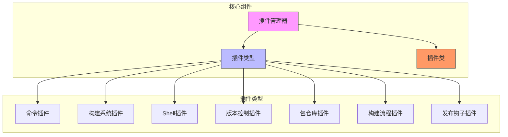
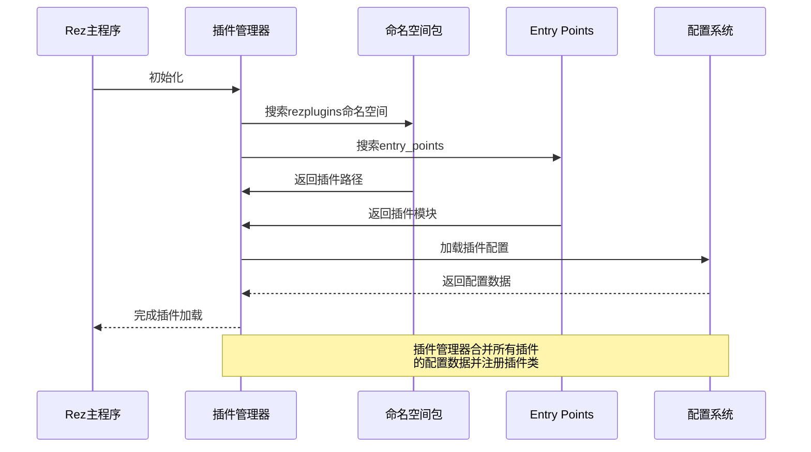
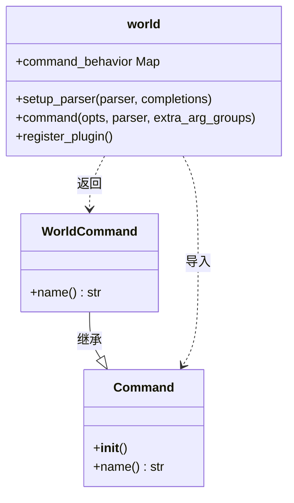
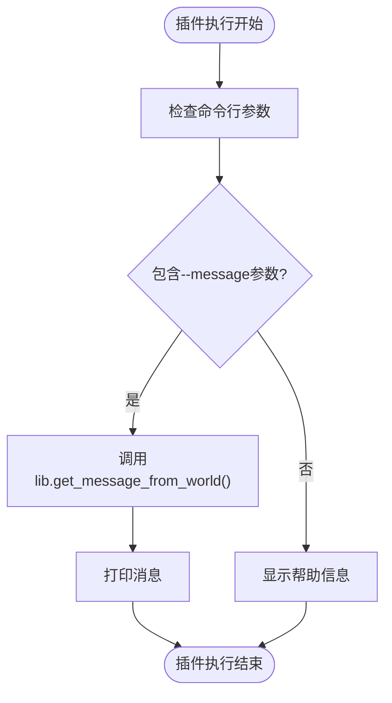
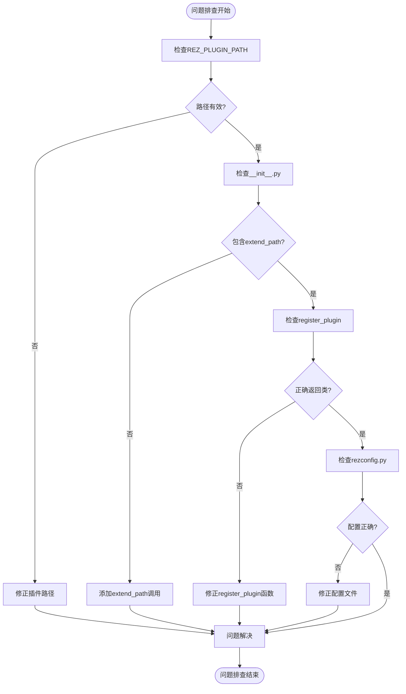

# 插件系统

<cite>
**本文档中引用的文件**  
- [developing_your_own_plugin.rst](file://rez-3.3.0\docs\source\guides\developing_your_own_plugin.rst)
- [world.py](file://rez-3.3.0\example_extensions\hello_cmd\rezplugins\command\world.py)
- [plugin_managers.py](file://rez-3.3.0\src\rez\plugin_managers.py)
- [command.py](file://rez-3.3.0\src\rez\command.py)
- [__init__.py](file://rez-3.3.0\src\rezplugins\command\__init__.py)
- [__init__.py](file://rez-3.3.0\src\rezplugins\shell\__init__.py)
- [__init__.py](file://rez-3.3.0\src\rezplugins\build_system\__init__.py)
- [__init__.py](file://rez-3.3.0\src\rezplugins\release_vcs\__init__.py)
- [__init__.py](file://rez-3.3.0\src\rezplugins\package_repository\__init__.py)
</cite>

## 目录
1. [简介](#简介)
2. [插件系统架构](#插件系统架构)
3. [插件类型](#插件类型)
4. [插件发现与加载机制](#插件发现与加载机制)
5. [命令插件开发示例](#命令插件开发示例)
6. [插件注册方法](#插件注册方法)
7. [最佳实践与调试技巧](#最佳实践与调试技巧)
8. [结论](#结论)

## 简介
Rez的插件系统提供了一个灵活的扩展机制，允许开发者通过插件扩展Rez的核心功能。本文档详细解释了Rez的插件架构、不同类型插件的功能、插件的发现和加载机制，并通过hello_cmd示例展示如何开发自定义插件。

**插件系统**支持多种扩展类型，包括命令、构建系统、shell、版本控制等。开发者可以通过`rezplugins`命名空间包或entry-points方法注册自定义插件，从而增强Rez的功能。

## 插件系统架构



**图示来源**  
- [plugin_managers.py](file://rez-3.3.0\src\rez\plugin_managers.py)

**本节来源**  
- [plugin_managers.py](file://rez-3.3.0\src\rez\plugin_managers.py)

## 插件类型

Rez支持多种类型的插件，每种类型对应不同的扩展功能：

### 命令插件
命令插件用于扩展Rez的命令行功能，添加新的子命令。这些插件位于`rezplugins/command/`目录下。

### 构建系统插件
构建系统插件支持不同的构建工具，如CMake、Make等。这些插件位于`rezplugins/build_system/`目录下。

### Shell插件
Shell插件支持不同的shell环境，如bash、zsh、cmd等。这些插件位于`rezplugins/shell/`目录下。

### 版本控制插件
版本控制插件支持不同的VCS系统，如Git、SVN、Mercurial等。这些插件位于`rezplugins/release_vcs/`目录下。

### 包仓库插件
包仓库插件支持从不同类型的仓库加载包，如文件系统、内存等。这些插件位于`rezplugins/package_repository/`目录下。

### 构建流程插件
构建流程插件支持不同的构建和发布流程，如本地构建、远程构建等。这些插件位于`rezplugins/build_process/`目录下。

### 发布钩子插件
发布钩子插件支持在发布过程中执行自定义操作，如发送邮件、AMQP消息等。这些插件位于`rezplugins/release_hook/`目录下。

**本节来源**  
- [plugin_managers.py](file://rez-3.3.0\src\rez\plugin_managers.py)
- [src\rezplugins](file://rez-3.3.0\src\rezplugins)

## 插件发现与加载机制



**图示来源**  
- [plugin_managers.py](file://rez-3.3.0\src\rez\plugin_managers.py)

**本节来源**  
- [plugin_managers.py](file://rez-3.3.0\src\rez\plugin_managers.py)

## 命令插件开发示例

### hello_cmd插件分析



**图示来源**  
- [world.py](file://rez-3.3.0\example_extensions\hello_cmd\rezplugins\command\world.py)
- [command.py](file://rez-3.3.0\src\rez\command.py)

**本节来源**  
- [world.py](file://rez-3.3.0\example_extensions\hello_cmd\rezplugins\command\world.py)
- [command.py](file://rez-3.3.0\src\rez\command.py)

### 插件开发要求
开发Rez命令插件需要满足以下要求：

- **必须**包含模块级文档字符串（用作命令帮助）
- **必须**提供`setup_parser()`函数
- **必须**提供`command()`函数
- **必须**提供`register_plugin()`函数
- **应该**定义模块级属性`command_behavior`

### 插件执行流程


**图示来源**  
- [world.py](file://rez-3.3.0\example_extensions\hello_cmd\rezplugins\command\world.py)

**本节来源**  
- [world.py](file://rez-3.3.0\example_extensions\hello_cmd\rezplugins\command\world.py)
- [developing_your_own_plugin.rst](file://rez-3.3.0\docs\source\guides\developing_your_own_plugin.rst)

## 插件注册方法

### 命名空间包方法
通过在`rezplugins`命名空间包中创建插件：

```python
# 创建目录结构
rezplugins/
  command/
    __init__.py
    mycommand.py
```

每个插件类型目录都包含`__init__.py`文件，其中使用`extend_path`函数扩展搜索路径：

```python
from rez.plugin_managers import extend_path
__path__ = extend_path(__path__, __name__)
```

**本节来源**  
- [__init__.py](file://rez-3.3.0\src\rezplugins\command\__init__.py)
- [__init__.py](file://rez-3.3.0\src\rezplugins\shell\__init__.py)
- [__init__.py](file://rez-3.3.0\src\rezplugins\build_system\__init__.py)

### Entry Points方法
通过在`pyproject.toml`或`setup.py`中定义entry points：

```toml
[project.entry-points."rez.plugins"]
mycommand = "mycommand"
```

或在`setup.py`中：

```python
setup(
    entry_points={
        'rez.plugins': [
            'mycommand = mycommand',
        ]
    }
)
```

**本节来源**  
- [developing_your_own_plugin.rst](file://rez-3.3.0\docs\source\guides\developing_your_own_plugin.rst)

## 最佳实践与调试技巧

### 开发最佳实践
1. **遵循命名约定**：插件文件名应与命令名一致
2. **提供清晰的文档**：模块级文档字符串应详细说明命令用途
3. **合理使用配置**：通过`rezconfig.py`文件提供插件配置
4. **错误处理**：在`register_plugin`函数中妥善处理异常

### 调试技巧
1. **启用调试模式**：设置`REZ_DEBUG=plugins`环境变量查看插件加载过程
2. **检查插件路径**：确保`REZ_PLUGIN_PATH`正确指向插件目录
3. **验证入口函数**：确认`register_plugin`函数正确返回插件类
4. **测试配置加载**：确保`rezconfig.py`文件被正确加载

### 常见问题排查


**本节来源**  
- [plugin_managers.py](file://rez-3.3.0\src\rez\plugin_managers.py)
- [developing_your_own_plugin.rst](file://rez-3.3.0\docs\source\guides\developing_your_own_plugin.rst)

## 结论
Rez的插件系统提供了一个强大而灵活的扩展机制，支持多种类型的插件来增强核心功能。通过`rezplugins`命名空间包和entry-points两种注册方法，开发者可以轻松地创建自定义插件。

插件系统采用模块化设计，每种插件类型都有明确的职责和接口规范。插件发现和加载机制确保了插件的动态性和可扩展性，同时提供了丰富的配置选项和调试支持。

开发者在创建插件时应遵循最佳实践，确保插件的稳定性、可维护性和用户体验。通过合理利用Rez的插件架构，可以有效地扩展和定制Rez的功能，满足特定的项目需求。