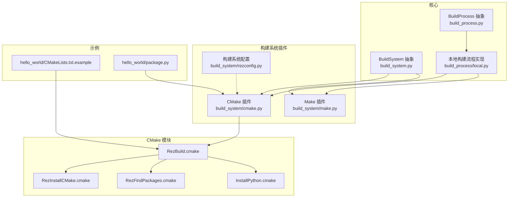
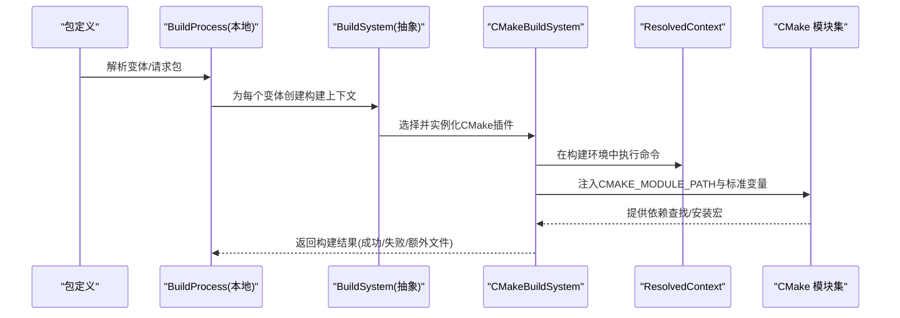
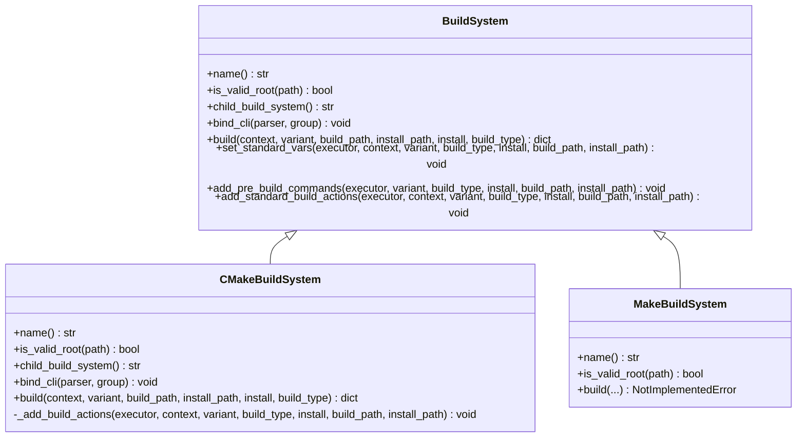
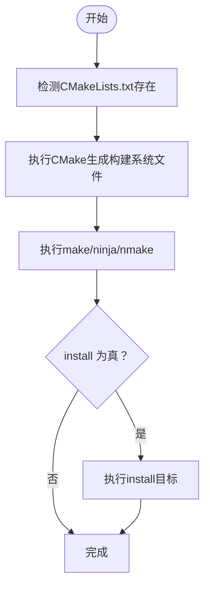

# 构建系统插件

<cite>
**本文引用的文件**
- [rez-3.3.0/src/rez/build_system.py](file://rez-3.3.0/src/rez/build_system.py)
- [rez-3.3.0/src/rezplugins/build_system/cmake.py](file://rez-3.3.0/src/rezplugins/build_system/cmake.py)
- [rez-3.3.0/src/rezplugins/build_system/make.py](file://rez-3.3.0/src/rezplugins/build_system/make.py)
- [rez-3.3.0/src/rezplugins/build_system/rezconfig.py](file://rez-3.3.0/src/rezplugins/build_system/rezconfig.py)
- [rez-3.3.0/src/rezplugins/build_system/cmake_files/RezBuild.cmake](file://rez-3.3.0/src/rezplugins/build_system/cmake_files/RezBuild.cmake)
- [rez-3.3.0/src/rezplugins/build_system/cmake_files/RezInstallCMake.cmake](file://rez-3.3.0/src/rezplugins/build_system/cmake_files/RezInstallCMake.cmake)
- [rez-3.3.0/src/rezplugins/build_system/cmake_files/RezFindPackages.cmake](file://rez-3.3.0/src/rezplugins/build_system/cmake_files/RezFindPackages.cmake)
- [rez-3.3.0/src/rezplugins/build_system/cmake_files/InstallPython.cmake](file://rez-3.3.0/src/rezplugins/build_system/cmake_files/InstallPython.cmake)
- [rez-3.3.0/src/rez/build_process.py](file://rez-3.3.0/src/rez/build_process.py)
- [rez-3.3.0/src/rezplugins/build_process/local.py](file://rez-3.3.0/src/rezplugins/build_process/local.py)
- [rez-3.3.0/src/rez/package_cache.py](file://rez-3.3.0/src/rez/package_cache.py)
- [rez-3.3.0/example_packages/hello_world/CMakeLists.txt.example](file://rez-3.3.0/example_packages/hello_world/CMakeLists.txt.example)
- [rez-3.3.0/example_packages/hello_world/package.py](file://rez-3.3.0/example_packages/hello_world/package.py)
</cite>

## 目录
1. [简介](#简介)
2. [项目结构](#项目结构)
3. [核心组件](#核心组件)
4. [架构总览](#架构总览)
5. [详细组件分析](#详细组件分析)
6. [依赖关系分析](#依赖关系分析)
7. [性能与可扩展性](#性能与可扩展性)
8. [故障排查指南](#故障排查指南)
9. [结论](#结论)
10. [附录：示例与最佳实践](#附录示例与最佳实践)

## 简介
本文件面向为CMake、Make等构建工具开发“构建系统插件”的工程师，系统阐述Rez构建系统中“build_system”插件的生命周期、钩子函数、环境变量注入、依赖传递与安装路径处理，并结合CMake插件示例（cmake.py）展示如何生成构建配置、传递Rez依赖、以及在不同平台上进行构建与安装。同时覆盖构建环境隔离、缓存机制与跨平台兼容性要点，帮助读者快速上手并安全扩展。

## 项目结构
围绕构建系统插件的关键目录与文件：
- 核心抽象与流程
  - [rez-3.3.0/src/rez/build_system.py](file://rez-3.3.0/src/rez/build_system.py)：定义BuildSystem抽象基类、检测可用构建系统、标准环境变量与预构建钩子。
  - [rez-3.3.0/src/rez/build_process.py](file://rez-3.3.0/src/rez/build_process.py)：构建流程抽象，负责变体迭代、环境解析、调用构建系统。
  - [rez-3.3.0/src/rezplugins/build_process/local.py](file://rez-3.3.0/src/rezplugins/build_process/local.py)：本地构建流程实现，串联BuildProcess与具体BuildSystem。
- 插件实现
  - [rez-3.3.0/src/rezplugins/build_system/cmake.py](file://rez-3.3.0/src/rezplugins/build_system/cmake.py)：CMake构建系统插件，支持多Generator、二次构建（make/ninja/nmake）、写入构建脚本。
  - [rez-3.3.0/src/rezplugins/build_system/make.py](file://rez-3.3.0/src/rezplugins/build_system/make.py)：Make构建系统插件骨架（占位）。
  - [rez-3.3.0/src/rezplugins/build_system/rezconfig.py](file://rez-3.3.0/src/rezplugins/build_system/rezconfig.py)：构建系统默认配置（CMake相关）。
- CMake宏与模板
  - [rez-3.3.0/src/rezplugins/build_system/cmake_files/RezBuild.cmake](file://rez-3.3.0/src/rezplugins/build_system/cmake_files/RezBuild.cmake)：包含所有Rez提供的CMake模块，设置版本与包变量，自动执行项目初始化。
  - [rez-3.3.0/src/rezplugins/build_system/cmake_files/RezInstallCMake.cmake](file://rez-3.3.0/src/rezplugins/build_system/cmake_files/RezInstallCMake.cmake)：自动生成被其他包find_package的.cmake文件，含自动扫描库、输出变量。
  - [rez-3.3.0/src/rezplugins/build_system/cmake_files/RezFindPackages.cmake](file://rez-3.3.0/src/rezplugins/build_system/cmake_files/RezFindPackages.cmake)：查找依赖包的CMake宏，支持.cmake模块与pkg-config两种来源。
  - [rez-3.3.0/src/rezplugins/build_system/cmake_files/InstallPython.cmake](file://rez-3.3.0/src/rezplugins/build_system/cmake_files/InstallPython.cmake)：安装Python文件与可选编译.pyc。
- 示例与验证
  - [rez-3.3.0/example_packages/hello_world/CMakeLists.txt.example](file://rez-3.3.0/example_packages/hello_world/CMakeLists.txt.example)：CMake示例工程，演示include(RezBuild)与安装Python/二进制。
  - [rez-3.3.0/example_packages/hello_world/package.py](file://rez-3.3.0/example_packages/hello_world/package.py)：示例包定义，展示自定义构建命令与工具路径。

图表来源
- [rez-3.3.0/src/rez/build_system.py](file://rez-3.3.0/src/rez/build_system.py#L1-L312)
- [rez-3.3.0/src/rez/build_process.py](file://rez-3.3.0/src/rez/build_process.py#L1-L200)
- [rez-3.3.0/src/rezplugins/build_process/local.py](file://rez-3.3.0/src/rezplugins/build_process/local.py#L252-L286)
- [rez-3.3.0/src/rezplugins/build_system/cmake.py](file://rez-3.3.0/src/rezplugins/build_system/cmake.py#L1-L308)
- [rez-3.3.0/src/rezplugins/build_system/make.py](file://rez-3.3.0/src/rezplugins/build_system/make.py#L1-L29)
- [rez-3.3.0/src/rezplugins/build_system/rezconfig.py](file://rez-3.3.0/src/rezplugins/build_system/rezconfig.py#L1-L36)
- [rez-3.3.0/src/rezplugins/build_system/cmake_files/RezBuild.cmake](file://rez-3.3.0/src/rezplugins/build_system/cmake_files/RezBuild.cmake#L1-L120)
- [rez-3.3.0/src/rezplugins/build_system/cmake_files/RezInstallCMake.cmake](file://rez-3.3.0/src/rezplugins/build_system/cmake_files/RezInstallCMake.cmake#L1-L269)
- [rez-3.3.0/src/rezplugins/build_system/cmake_files/RezFindPackages.cmake](file://rez-3.3.0/src/rezplugins/build_system/cmake_files/RezFindPackages.cmake#L1-L258)
- [rez-3.3.0/src/rezplugins/build_system/cmake_files/InstallPython.cmake](file://rez-3.3.0/src/rezplugins/build_system/cmake_files/InstallPython.cmake#L1-L133)
- [rez-3.3.0/example_packages/hello_world/CMakeLists.txt.example](file://rez-3.3.0/example_packages/hello_world/CMakeLists.txt.example#L1-L18)
- [rez-3.3.0/example_packages/hello_world/package.py](file://rez-3.3.0/example_packages/hello_world/package.py#L1-L29)

章节来源
- [rez-3.3.0/src/rez/build_system.py](file://rez-3.3.0/src/rez/build_system.py#L1-L312)
- [rez-3.3.0/src/rez/build_process.py](file://rez-3.3.0/src/rez/build_process.py#L1-L200)
- [rez-3.3.0/src/rezplugins/build_system/cmake.py](file://rez-3.3.0/src/rezplugins/build_system/cmake.py#L1-L308)

## 核心组件
- BuildSystem抽象基类
  - 负责声明插件名称、根目录校验、子构建系统（如CMake -> Make/Ninja/NMake）、CLI参数绑定、构建主流程与标准环境变量注入。
  - 关键方法与职责参见下节“详细组件分析”。

- CMakeBuildSystem插件
  - 支持多种CMake Generator（Unix Makefiles、Ninja、NMake、MinGW、Xcode），自动选择make二进制，按变体线程数并发构建，必要时执行install。
  - 通过CMAKE_MODULE_PATH注入Rez提供的CMake模块，提供依赖查找与安装宏。

- 配置与环境
  - 默认配置位于[rez-3.3.0/src/rezplugins/build_system/rezconfig.py](file://rez-3.3.0/src/rezplugins/build_system/rezconfig.py#L1-L36)，包含构建目标、构建系统、默认CMake参数、二进制路径与是否安装.pyc等。
  - 标准环境变量由BuildSystem.set_standard_vars统一注入，供CMake宏与用户脚本使用。

章节来源
- [rez-3.3.0/src/rez/build_system.py](file://rez-3.3.0/src/rez/build_system.py#L103-L312)
- [rez-3.3.0/src/rezplugins/build_system/cmake.py](file://rez-3.3.0/src/rezplugins/build_system/cmake.py#L1-L308)
- [rez-3.3.0/src/rezplugins/build_system/rezconfig.py](file://rez-3.3.0/src/rezplugins/build_system/rezconfig.py#L1-L36)

## 架构总览
从“包定义 -> 变体 -> 构建流程 -> 构建系统插件 -> CMake宏”的完整链路如下：

图表来源
- [rez-3.3.0/src/rez/build_process.py](file://rez-3.3.0/src/rez/build_process.py#L129-L200)
- [rez-3.3.0/src/rezplugins/build_process/local.py](file://rez-3.3.0/src/rezplugins/build_process/local.py#L252-L286)
- [rez-3.3.0/src/rezplugins/build_system/cmake.py](file://rez-3.3.0/src/rezplugins/build_system/cmake.py#L108-L244)
- [rez-3.3.0/src/rezplugins/build_system/cmake_files/RezBuild.cmake](file://rez-3.3.0/src/rezplugins/build_system/cmake_files/RezBuild.cmake#L1-L120)

## 详细组件分析

### BuildSystem 抽象与生命周期
- 生命周期阶段
  - 初始化与校验：构造函数校验工作目录有效性；读取包定义与选项。
  - 根目录检测：is_valid_root用于判定当前目录是否属于该构建系统。
  - 子构建系统：child_build_system声明是否存在二次构建（如CMake -> Make/Ninja/NMake）。
  - CLI绑定：bind_cli向解析器添加插件特定参数。
  - 标准动作：set_standard_vars注入标准环境变量；add_standard_build_actions统一前置动作。
  - 预构建钩子：add_pre_build_commands执行包内pre_build_commands。
  - 主构建：build执行实际构建，返回成功与否及额外文件信息。

- 关键钩子与数据流
  - 标准环境变量：REZ_BUILD_*系列、REZ_*_VERSION、REZ_*_ROOT等，供CMake宏与用户脚本使用。
  - 预构建钩子：将this与build命名空间绑定到执行器，允许在包定义中编写构建前逻辑。
  - 结果约定：build返回字典包含success、extra_files、build_env_script（可选）。

章节来源
- [rez-3.3.0/src/rez/build_system.py](file://rez-3.3.0/src/rez/build_system.py#L103-L312)

### CMakeBuildSystem 插件详解
- 插件特性
  - 多Generator支持：Unix Makefiles、Ninja、NMake、MinGW、Xcode（受限于平台）。
  - 自动二进制选择：优先使用配置中的cmake_binary/make_binary，否则通过ResolvedContext.which查找。
  - 二次构建：当使用非NMake/Ninja/MinGW时，默认二次调用make；支持传入child_build_args。
  - 写构建脚本：write_build_scripts为用户提供直接进入构建环境运行make的入口。
  - 安装行为：若install为真且未显式包含install，则追加install目标。

- CMake 命令组装与执行
  - 组装CMake命令：工作目录、CMAKE_INSTALL_PREFIX、CMAKE_MODULE_PATH、CMAKE_BUILD_TYPE、REZ_BUILD_*变量、Generator。
  - 执行上下文：通过ResolvedContext.execute_shell在受控环境中运行，支持actions_callback/post_actions_callback。
  - 并发控制：对非NMake场景，根据变体thread_count追加-j参数。

- CMake 模块生态
  - RezBuild.cmake：包含Colorize、Utils、RezProject、InstallFiles、InstallDirs、RezInstallCMake、RezFindPackages、RezInstallPython等模块，设置项目变量与权限。
  - RezFindPackages.cmake：支持通过包名查找.cmake或pkg-config，自动合并include、lib、definitions。
  - RezInstallCMake.cmake：自动生成<unversioned>.cmake，扫描已安装库，输出静态/动态库变量，便于下游find_package。
  - InstallPython.cmake：安装Python源码与可选.pyc，支持LOCAL_SYMLINK与BIN语法检查。

- 安装路径与依赖传递
  - 依赖传递：RezBuild.cmake将REZ_BUILD_REQUIRES_UNVERSIONED与各包版本变量注入CMake环境，下游可通过<UPPER_PKG>_VERSION等使用。
  - 安装路径：CMAKE_INSTALL_PREFIX来自install_path；文件权限与可执行位由RezBuild.cmake统一设置。

- 跨平台与缓存
  - 平台差异：Windows默认使用NMake Generator；Xcode仅在OSX可用。
  - 缓存：通过ResolvedContext与包缓存机制，可在构建前将包根重定向至缓存位置，减少I/O与路径规范化成本。

章节来源
- [rez-3.3.0/src/rezplugins/build_system/cmake.py](file://rez-3.3.0/src/rezplugins/build_system/cmake.py#L1-L308)
- [rez-3.3.0/src/rezplugins/build_system/cmake_files/RezBuild.cmake](file://rez-3.3.0/src/rezplugins/build_system/cmake_files/RezBuild.cmake#L1-L120)
- [rez-3.3.0/src/rezplugins/build_system/cmake_files/RezInstallCMake.cmake](file://rez-3.3.0/src/rezplugins/build_system/cmake_files/RezInstallCMake.cmake#L1-L269)
- [rez-3.3.0/src/rezplugins/build_system/cmake_files/RezFindPackages.cmake](file://rez-3.3.0/src/rezplugins/build_system/cmake_files/RezFindPackages.cmake#L1-L258)
- [rez-3.3.0/src/rezplugins/build_system/cmake_files/InstallPython.cmake](file://rez-3.3.0/src/rezplugins/build_system/cmake_files/InstallPython.cmake#L1-L133)
- [rez-3.3.0/src/rezplugins/build_system/rezconfig.py](file://rez-3.3.0/src/rezplugins/build_system/rezconfig.py#L1-L36)

### 构建流程与环境隔离
- 流程概览
  - BuildProcess.iterate变体 -> 为每个变体解析环境 -> 调用BuildSystem.build -> 可选安装与额外文件复制 -> 记录结果。
  - 本地实现中，若构建失败则清理可能部分安装的变体内容，避免污染。

- 环境隔离
  - 通过ResolvedContext.execute_shell在隔离环境中执行命令，确保构建只使用受控的包与工具链。
  - 标准变量注入与VariantBinding绑定，使包定义中的pre_build_commands能访问this与build命名空间。

- 包缓存
  - 包缓存守护进程异步写入，同步模式下在解析上下文时阻塞等待；缓存命中后，REZ_*_ROOT指向缓存payload，提升后续构建速度。

章节来源
- [rez-3.3.0/src/rez/build_process.py](file://rez-3.3.0/src/rez/build_process.py#L129-L200)
- [rez-3.3.0/src/rezplugins/build_process/local.py](file://rez-3.3.0/src/rezplugins/build_process/local.py#L252-L286)
- [rez-3.3.0/src/rez/package_cache.py](file://rez-3.3.0/src/rez/package_cache.py#L524-L631)

## 依赖关系分析

图表来源
- [rez-3.3.0/src/rez/build_system.py](file://rez-3.3.0/src/rez/build_system.py#L103-L312)
- [rez-3.3.0/src/rezplugins/build_system/cmake.py](file://rez-3.3.0/src/rezplugins/build_system/cmake.py#L1-L308)
- [rez-3.3.0/src/rezplugins/build_system/make.py](file://rez-3.3.0/src/rezplugins/build_system/make.py#L1-L29)

章节来源
- [rez-3.3.0/src/rez/build_system.py](file://rez-3.3.0/src/rez/build_system.py#L103-L312)
- [rez-3.3.0/src/rezplugins/build_system/cmake.py](file://rez-3.3.0/src/rezplugins/build_system/cmake.py#L1-L308)
- [rez-3.3.0/src/rezplugins/build_system/make.py](file://rez-3.3.0/src/rezplugins/build_system/make.py#L1-L29)

## 性能与可扩展性
- 并发与线程
  - 非NMake场景自动追加-jN，N由变体配置决定，提升多核利用率。
- 缓存与I/O
  - 包缓存守护进程异步写入，减少重复拷贝；同步模式下解析即缓存，降低首次构建延迟。
  - RezBuild.cmake统一设置文件权限与可执行位，避免多次chmod开销。
- 可扩展点
  - 新增构建系统：继承BuildSystem，实现name/is_valid_root/bind_cli/build等方法；如需二次构建，返回child_build_system。
  - CMake宏扩展：在cmake_files目录新增.cmake模块，通过RezBuild.cmake include即可全局使用。

[本节为通用建议，不直接分析具体文件]

## 故障排查指南
- 常见错误与定位
  - 未找到CMake二进制：检查配置cmake_binary或确保cmake在ResolvedContext中可解析。
  - Xcode生成器仅限OSX：在非OSX平台会抛出错误。
  - 二次构建失败：确认child_build_args与make_binary匹配；NMake不支持-j参数。
  - 依赖未找到：RezFindPackages.cmake会尝试.cmake模块与pkg-config，若均失败且标记REQUIRED则报错。
  - 安装路径异常：检查CMAKE_INSTALL_PREFIX与install_path一致性。

- 排查步骤
  - 启用write_build_scripts，运行生成的build-env脚本，手动在构建环境中复现问题。
  - 查看构建日志与extra_files，定位具体命令与环境变量。
  - 使用包缓存同步模式验证缓存命中与根路径重定向。

章节来源
- [rez-3.3.0/src/rezplugins/build_system/cmake.py](file://rez-3.3.0/src/rezplugins/build_system/cmake.py#L108-L244)
- [rez-3.3.0/src/rezplugins/build_system/cmake_files/RezFindPackages.cmake](file://rez-3.3.0/src/rezplugins/build_system/cmake_files/RezFindPackages.cmake#L1-L258)
- [rez-3.3.0/src/rezplugins/build_process/local.py](file://rez-3.3.0/src/rezplugins/build_process/local.py#L252-L286)

## 结论
Rez的构建系统插件体系以BuildSystem为核心抽象，通过标准环境变量注入、预构建钩子与二次构建机制，实现了对CMake/Make等工具的统一接入。配合CMake模块生态与包缓存，既能保证跨平台一致性，又能获得良好的性能与可维护性。开发者可基于此框架快速扩展新的构建系统或增强CMake宏能力。

[本节为总结，不直接分析具体文件]

## 附录：示例与最佳实践

### 使用CMake插件的完整流程（示例）
- 工程侧
  - 在CMakeLists中include(RezBuild)，使用rez_install_python、rez_install_files等宏安装产物。
  - 依赖查找：通过rez_find_packages自动合并各包的include、lib与definitions。
- 包定义侧
  - 指定build_system为cmake，或通过build_command自定义构建流程。
  - 在pre_build_commands中编写构建前逻辑（如生成配置文件）。
- 运行侧
  - 本地构建：BuildProcess遍历变体，逐个在受控环境中执行CMake与make/ninja/nmake。
  - 安装：install=True时自动执行install目标并复制额外文件。

图表来源
- [rez-3.3.0/src/rezplugins/build_system/cmake.py](file://rez-3.3.0/src/rezplugins/build_system/cmake.py#L108-L244)
- [rez-3.3.0/example_packages/hello_world/CMakeLists.txt.example](file://rez-3.3.0/example_packages/hello_world/CMakeLists.txt.example#L1-L18)

章节来源
- [rez-3.3.0/example_packages/hello_world/CMakeLists.txt.example](file://rez-3.3.0/example_packages/hello_world/CMakeLists.txt.example#L1-L18)
- [rez-3.3.0/example_packages/hello_world/package.py](file://rez-3.3.0/example_packages/hello_world/package.py#L1-L29)