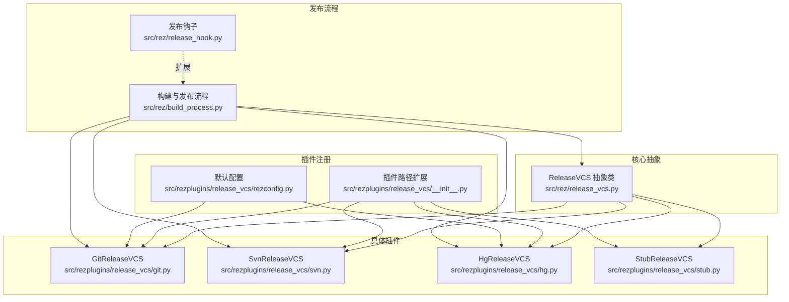
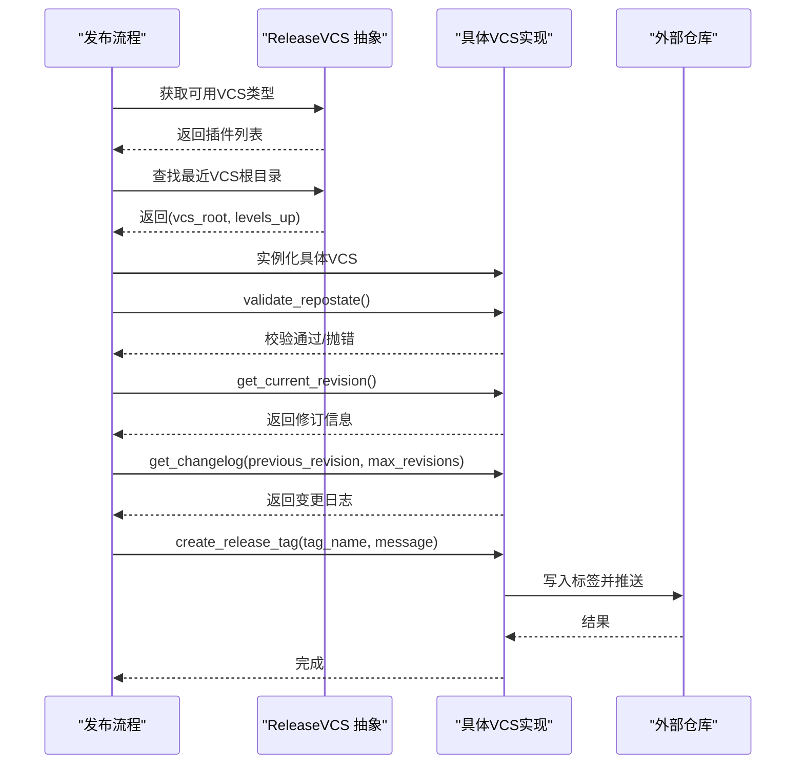
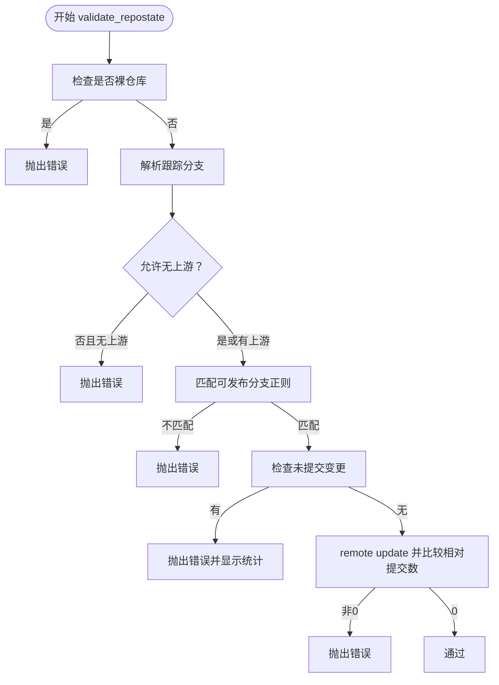
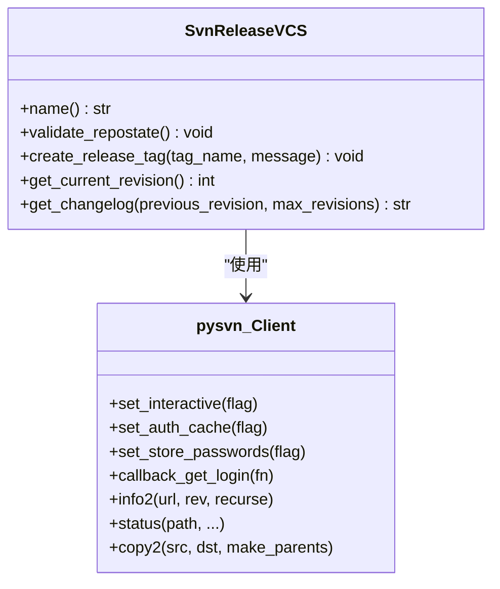
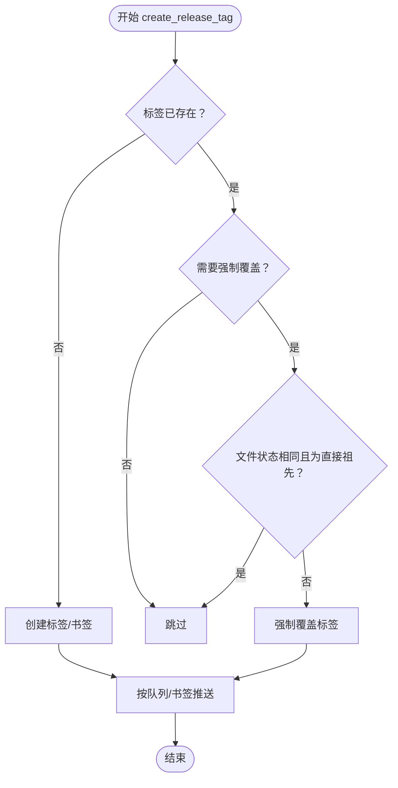
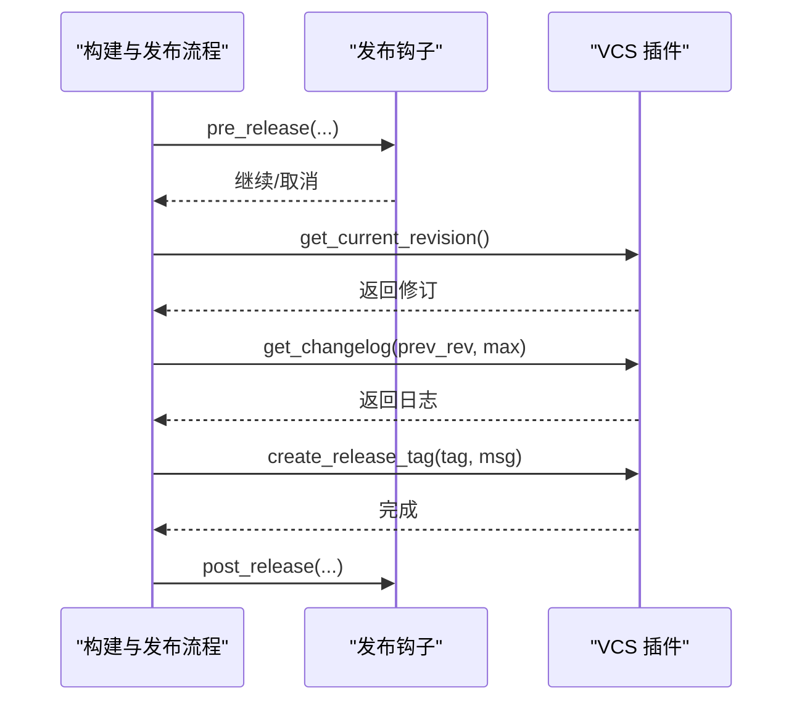
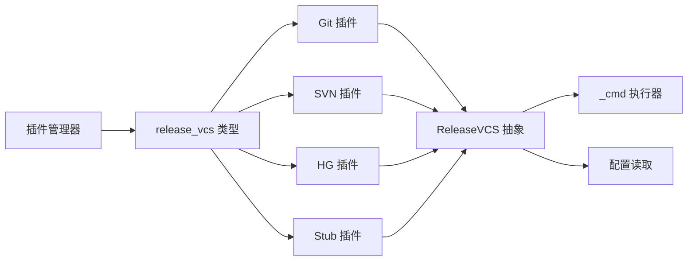

# 版本控制插件

<cite>
**本文引用的文件**
- [rez/release_vcs.py](file://rez-3.3.0/src/rez/release_vcs.py)
- [rezplugins/release_vcs/__init__.py](file://rez-3.3.0/src/rezplugins/release_vcs/__init__.py)
- [rezplugins/release_vcs/rezconfig.py](file://rez-3.3.0/src/rezplugins/release_vcs/rezconfig.py)
- [rezplugins/release_vcs/git.py](file://rez-3.3.0/src/rezplugins/release_vcs/git.py)
- [rezplugins/release_vcs/svn.py](file://rez-3.3.0/src/rezplugins/release_vcs/svn.py)
- [rezplugins/release_vcs/hg.py](file://rez-3.3.0/src/rezplugins/release_vcs/hg.py)
- [rezplugins/release_vcs/stub.py](file://rez-3.3.0/src/rezplugins/release_vcs/stub.py)
- [rez/build_process.py](file://rez-3.3.0/src/rez/build_process.py)
- [rez/release_hook.py](file://rez-3.3.0/src/rez/release_hook.py)
- [docs/source/guides/developing_your_own_plugin.rst](file://rez-3.3.0/docs/source/guides/developing_your_own_plugin.rst)
- [src/rez/tests/test_release.py](file://rez-3.3.0/src/rez/tests/test_release.py)
</cite>

## 目录
1. [简介](#简介)
2. [项目结构](#项目结构)
3. [核心组件](#核心组件)
4. [架构总览](#架构总览)
5. [组件详解](#组件详解)
6. [依赖关系分析](#依赖关系分析)
7. [性能考量](#性能考量)
8. [故障排查指南](#故障排查指南)
9. [结论](#结论)
10. [附录](#附录)

## 简介
本文件面向需要为 Rez 开发“版本控制插件”的工程师，系统性阐述如何在 Rez 中集成 Git、SVN、Mercurial 等 VCS，并覆盖以下主题：
- 版本标签创建、提交验证与分支策略的实现细节
- 新 VCS 系统支持的开发指南：认证机制、网络协议处理、性能优化建议
- 与 CI/CD 的集成模式

Rez 的发布流程通过“版本控制插件”抽象出不同 VCS 的差异，统一对外暴露一致的接口，供构建与发布流程调用。

## 项目结构
与版本控制插件直接相关的目录与文件如下：
- 核心抽象与工厂：src/rez/release_vcs.py
- 插件注册入口：src/rezplugins/release_vcs/__init__.py
- 插件默认配置：src/rezplugins/release_vcs/rezconfig.py
- 具体插件实现：git.py、svn.py、hg.py、stub.py
- 发布流程对接：src/rez/build_process.py
- 发布钩子扩展：src/rez/release_hook.py
- 插件开发指南：docs/source/guides/developing_your_own_plugin.rst
- 测试用例：src/rez/tests/test_release.py

图表来源
- [rez/release_vcs.py](file://rez-3.3.0/src/rez/release_vcs.py#L70-L231)
- [rezplugins/release_vcs/__init__.py](file://rez-3.3.0/src/rezplugins/release_vcs/__init__.py#L1-L7)
- [rezplugins/release_vcs/rezconfig.py](file://rez-3.3.0/src/rezplugins/release_vcs/rezconfig.py#L1-L48)
- [rezplugins/release_vcs/git.py](file://rez-3.3.0/src/rezplugins/release_vcs/git.py#L1-L242)
- [rezplugins/release_vcs/svn.py](file://rez-3.3.0/src/rezplugins/release_vcs/svn.py#L1-L140)
- [rezplugins/release_vcs/hg.py](file://rez-3.3.0/src/rezplugins/release_vcs/hg.py#L1-L280)
- [rezplugins/release_vcs/stub.py](file://rez-3.3.0/src/rezplugins/release_vcs/stub.py#L1-L81)
- [rez/build_process.py](file://rez-3.3.0/src/rez/build_process.py#L320-L450)
- [rez/release_hook.py](file://rez-3.3.0/src/rez/release_hook.py#L1-L142)

章节来源
- [rez/release_vcs.py](file://rez-3.3.0/src/rez/release_vcs.py#L15-L68)
- [rezplugins/release_vcs/__init__.py](file://rez-3.3.0/src/rezplugins/release_vcs/__init__.py#L1-L7)

## 核心组件
- ReleaseVCS 抽象基类：定义 VCS 插件必须实现的方法与通用能力（命令执行、根目录查找、工作副本状态校验、当前修订、变更日志、标签存在性、创建标签、导出等）。
- 具体插件：
  - GitReleaseVCS：基于 Git 命令行工具，支持上游分支检查、本地分支白名单、未提交变更检测、相对远程提交数、标签创建与推送。
  - SvnReleaseVCS：基于 pysvn 客户端，支持工作副本状态校验、标签复制到 tags 路径、登录回调处理密码。
  - HgReleaseVCS：基于 hg 命令行工具，支持 MQ 补丁队列、书签与标签、默认 URL 推送、祖先关系判断、变更日志范围查询。
  - StubReleaseVCS：用于测试的“空实现”，不实际写入任何仓库，便于单元测试。
- 配置项：默认标签名格式、可发布分支正则、是否允许无上游、是否检查已存在标签等。
- 发布流程对接：构建与发布流程在 post_release 阶段调用 VCS 创建标签；在获取变更日志与当前修订时调用 VCS。

章节来源
- [rez/release_vcs.py](file://rez-3.3.0/src/rez/release_vcs.py#L70-L231)
- [rezplugins/release_vcs/git.py](file://rez-3.3.0/src/rezplugins/release_vcs/git.py#L21-L242)
- [rezplugins/release_vcs/svn.py](file://rez-3.3.0/src/rezplugins/release_vcs/svn.py#L60-L140)
- [rezplugins/release_vcs/hg.py](file://rez-3.3.0/src/rezplugins/release_vcs/hg.py#L18-L280)
- [rezplugins/release_vcs/stub.py](file://rez-3.3.0/src/rezplugins/release_vcs/stub.py#L16-L81)
- [rezplugins/release_vcs/rezconfig.py](file://rez-3.3.0/src/rezplugins/release_vcs/rezconfig.py#L1-L48)
- [rez/build_process.py](file://rez-3.3.0/src/rez/build_process.py#L320-L450)

## 架构总览
Rez 的版本控制插件采用“插件化 + 抽象基类”的设计：
- 通过插件管理器加载 release_vcs 类型的插件，按路径向上查找最近的 VCS 根目录，选择最接近的 VCS 实现。
- 发布流程在合适阶段调用 VCS 的统一接口，完成标签创建、变更日志生成与当前修订信息获取。
- 可通过发布钩子扩展发布前后行为（如邮件通知、制品归档等）。

图表来源
- [rez/release_vcs.py](file://rez-3.3.0/src/rez/release_vcs.py#L15-L68)
- [rezplugins/release_vcs/git.py](file://rez-3.3.0/src/rezplugins/release_vcs/git.py#L93-L143)
- [rezplugins/release_vcs/hg.py](file://rez-3.3.0/src/rezplugins/release_vcs/hg.py#L181-L211)
- [rezplugins/release_vcs/svn.py](file://rez-3.3.0/src/rezplugins/release_vcs/svn.py#L83-L101)
- [rez/build_process.py](file://rez-3.3.0/src/rez/build_process.py#L325-L424)

## 组件详解

### ReleaseVCS 抽象层
- 职责：定义 VCS 插件的统一接口，包括根目录定位、命令执行、工作副本状态校验、当前修订、变更日志、标签操作、导出等。
- 关键点：
  - 根目录查找：支持向上遍历或仅在当前目录匹配。
  - 命令执行：封装 Popen，统一错误处理与调试输出。
  - 配置读取：从包配置中读取 release_vcs 类型设置与各插件设置。

章节来源
- [rez/release_vcs.py](file://rez-3.3.0/src/rez/release_vcs.py#L70-L231)

### GitReleaseVCS
- 分支与上游策略：
  - 支持通过配置项决定是否允许无上游分支。
  - 支持可发布分支的正则白名单，未匹配将拒绝发布。
- 提交验证：
  - 拒绝裸仓库发布。
  - 检查未提交变更，若有则列出统计并报错。
  - 若存在上游，先更新远程，再比较相对远程的提交数（领先/落后），不为零则拒绝发布。
- 标签创建与推送：
  - 若标签已存在则跳过；否则创建带注释的标签并推送到跟踪分支。
- 导出：
  - 使用 clone + checkout + 删除 .git 方式导出指定修订。

图表来源
- [rezplugins/release_vcs/git.py](file://rez-3.3.0/src/rezplugins/release_vcs/git.py#L93-L143)

章节来源
- [rezplugins/release_vcs/git.py](file://rez-3.3.0/src/rezplugins/release_vcs/git.py#L21-L242)
- [rezplugins/release_vcs/rezconfig.py](file://rez-3.3.0/src/rezplugins/release_vcs/rezconfig.py#L1-L48)

### SvnReleaseVCS
- 认证与网络协议：
  - 使用 pysvn 客户端，设置交互模式、禁用认证缓存与密码保存。
  - 通过回调提供用户名与密码，适用于交互式环境。
- 工作副本状态：
  - 检查工作副本状态，若存在未提交文件则拒绝发布。
- 标签创建：
  - 将当前 URL 复制到 tags/<name>，要求仓库包含 trunk 或 branches。
- 当前修订：
  - 读取当前工作副本的修订号。

图表来源
- [rezplugins/release_vcs/svn.py](file://rez-3.3.0/src/rezplugins/release_vcs/svn.py#L20-L140)

章节来源
- [rezplugins/release_vcs/svn.py](file://rez-3.3.0/src/rezplugins/release_vcs/svn.py#L1-L140)

### HgReleaseVCS
- MQ 补丁队列支持：
  - 在补丁队列存在时，对补丁仓库打标签并在主仓库打书签，避免直接修改主仓库。
- 标签策略：
  - 若标签已存在且指向当前提交的直接祖先且文件状态相同，则跳过强制创建，减少重复标签提交。
  - 否则强制覆盖标签。
- 推送策略：
  - 对每个创建的标签/书签，根据是否存在补丁队列选择不同的推送目标与参数。
- 变更日志：
  - 支持基于共同祖先的逆序日志输出，与 Git 行为保持一致。

图表来源
- [rezplugins/release_vcs/hg.py](file://rez-3.3.0/src/rezplugins/release_vcs/hg.py#L64-L144)
- [rezplugins/release_vcs/hg.py](file://rez-3.3.0/src/rezplugins/release_vcs/hg.py#L244-L277)

章节来源
- [rezplugins/release_vcs/hg.py](file://rez-3.3.0/src/rezplugins/release_vcs/hg.py#L1-L280)

### StubReleaseVCS（测试桩）
- 用途：用于单元测试，不实际写入仓库，标签写入 .stub 文件。
- 行为：时间戳作为当前修订，支持标签存在性检查与创建。

章节来源
- [rezplugins/release_vcs/stub.py](file://rez-3.3.0/src/rezplugins/release_vcs/stub.py#L16-L81)
- [src/rez/tests/test_release.py](file://rez-3.3.0/src/rez/tests/test_release.py#L68-L80)

### 发布流程对接与 CI/CD 集成
- 标签创建时机：在 post_release 阶段由构建与发布流程调用 VCS.create_release_tag。
- 变更日志与当前修订：在发布数据收集阶段调用 VCS.get_changelog 与 get_current_revision。
- 钩子扩展：可通过 release_hook 在 pre_release/post_release 等阶段注入自定义逻辑（如邮件、制品归档）。

图表来源
- [rez/build_process.py](file://rez-3.3.0/src/rez/build_process.py#L325-L424)
- [rez/release_hook.py](file://rez-3.3.0/src/rez/release_hook.py#L37-L142)

章节来源
- [rez/build_process.py](file://rez-3.3.0/src/rez/build_process.py#L320-L450)
- [rez/release_hook.py](file://rez-3.3.0/src/rez/release_hook.py#L1-L142)

## 依赖关系分析
- 插件发现与加载：通过插件管理器加载 release_vcs 类型的所有插件。
- 根目录定位：各插件实现 is_valid_root/search_parents_for_root/find_vcs_root，决定在多 VCS 并存时的选择优先级。
- 命令执行：ReleaseVCS._cmd 统一封装外部命令调用，统一错误处理。
- 配置耦合：各插件读取 package.config.plugins.release_vcs 下的类型设置（如 Git 的 allow_no_upstream、releasable_branches）。

图表来源
- [rez/release_vcs.py](file://rez-3.3.0/src/rez/release_vcs.py#L15-L68)
- [rezplugins/release_vcs/__init__.py](file://rez-3.3.0/src/rezplugins/release_vcs/__init__.py#L1-L7)

章节来源
- [rez/release_vcs.py](file://rez-3.3.0/src/rez/release_vcs.py#L15-L68)

## 性能考量
- 命令执行与 I/O：
  - Git/SVN/HG 插件均通过外部命令或客户端访问仓库，I/O 成本较高。建议：
    - 在 validate_repostate 中尽量减少命令次数（例如先检查跟踪分支，再决定是否 remote update）。
    - 变更日志截断：发布流程会限制最大字符数，避免超大日志影响包加载性能。
- 远程同步：
  - Git 在校验远程相对提交数前会执行 remote update，建议在 CI 环境提前缓存或复用镜像以降低网络延迟。
- 认证与交互：
  - SVN 登录回调为交互式输入，建议在 CI 环境配置凭据或使用非交互式认证方式（如密钥文件）。
- MQ 补丁队列：
  - HG 的 MQ 模式下可能产生额外的标签提交，应避免在短时间内重复创建相同标签，插件内部已做去重逻辑。

章节来源
- [rez/build_process.py](file://rez-3.3.0/src/rez/build_process.py#L414-L419)
- [rezplugins/release_vcs/git.py](file://rez-3.3.0/src/rezplugins/release_vcs/git.py#L133-L143)
- [rezplugins/release_vcs/svn.py](file://rez-3.3.0/src/rezplugins/release_vcs/svn.py#L45-L58)
- [rezplugins/release_vcs/hg.py](file://rez-3.3.0/src/rezplugins/release_vcs/hg.py#L118-L143)

## 故障排查指南
- 无法找到 VCS 根：
  - 现象：抛出“未找到对应 VCS 根”的错误。
  - 排查：确认 is_valid_root 与 search_parents_for_root 的实现是否正确；检查路径层级。
- 多 VCS 冲突：
  - 现象：同一路径同时存在多个 VCS 根，选择冲突。
  - 排查：使用 --vcs 显式指定；或调整目录结构避免嵌套。
- Git 无上游/分支不匹配/有未提交变更/相对远程非零：
  - 现象：发布被拒绝。
  - 排查：配置 allow_no_upstream、releasable_branches；清理工作区；确保与远程同步。
- SVN 登录失败：
  - 现象：交互式输入密码阻塞。
  - 排查：在 CI 环境配置非交互式认证或预置凭据。
- HG 标签重复创建：
  - 现象：产生多余标签提交。
  - 排查：插件内部已做祖先与文件状态检查，避免重复；如仍出现，检查工作副本状态与 MQ 队列。

章节来源
- [rez/release_vcs.py](file://rez-3.3.0/src/rez/release_vcs.py#L15-L68)
- [rezplugins/release_vcs/git.py](file://rez-3.3.0/src/rezplugins/release_vcs/git.py#L93-L143)
- [rezplugins/release_vcs/svn.py](file://rez-3.3.0/src/rezplugins/release_vcs/svn.py#L83-L101)
- [rezplugins/release_vcs/hg.py](file://rez-3.3.0/src/rezplugins/release_vcs/hg.py#L181-L211)

## 结论
Rez 的版本控制插件体系通过统一抽象与插件化设计，实现了对 Git、SVN、Mercurial 的一致接入。其关键特性包括：
- 可配置的分支策略与上游约束
- 严谨的工作副本状态校验
- 与发布流程的无缝衔接
- 可扩展的发布钩子机制

对于新 VCS 的支持，建议遵循现有插件的接口契约与错误处理模式，结合 CI/CD 环境特点优化认证与网络交互。

## 附录

### 新 VCS 插件开发指南
- 插件结构与注册：
  - 使用 rezplugins 命名空间包组织插件模块。
  - 在模块中提供 register_plugin() 函数返回插件类。
  - 参考插件开发指南文档了解注册与安装方式。
- 必须实现的方法：
  - name/is_valid_root/search_parents_for_root/find_vcs_root/validate_repostate/get_current_revision/get_changelog/tag_exists/create_release_tag/export。
- 认证与网络协议：
  - 如需交互式认证，提供非阻塞的凭据获取方式；在 CI 环境建议支持非交互式认证。
  - 对于远程仓库，考虑缓存与重试策略，避免频繁网络请求。
- 性能优化建议：
  - 合理减少命令调用次数；对变更日志进行截断；避免不必要的远程同步。
  - 在 MQ/队列模式下，尽量避免重复标签提交。
- 与 CI/CD 的集成模式：
  - 在 pre_release 阶段执行静态检查、权限校验；在 post_release 阶段触发制品归档与通知。
  - 使用 release_hook 注入自动化流程（如邮件、消息通知、制品上传）。

章节来源
- [docs/source/guides/developing_your_own_plugin.rst](file://rez-3.3.0/docs/source/guides/developing_your_own_plugin.rst#L1-L134)
- [rez/release_vcs.py](file://rez-3.3.0/src/rez/release_vcs.py#L70-L231)
- [rez/release_hook.py](file://rez-3.3.0/src/rez/release_hook.py#L37-L142)