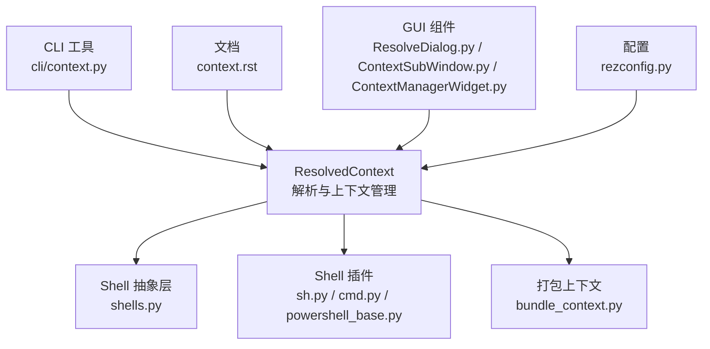
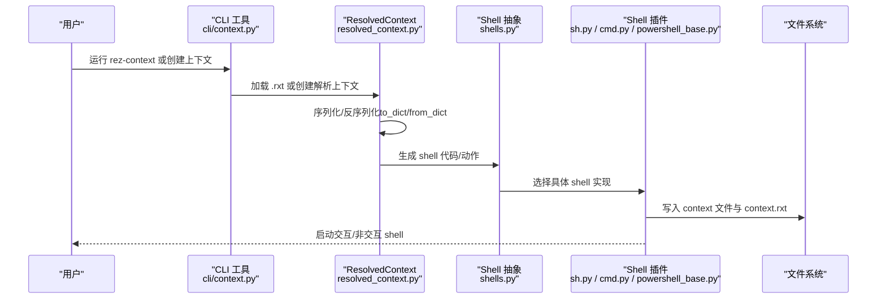
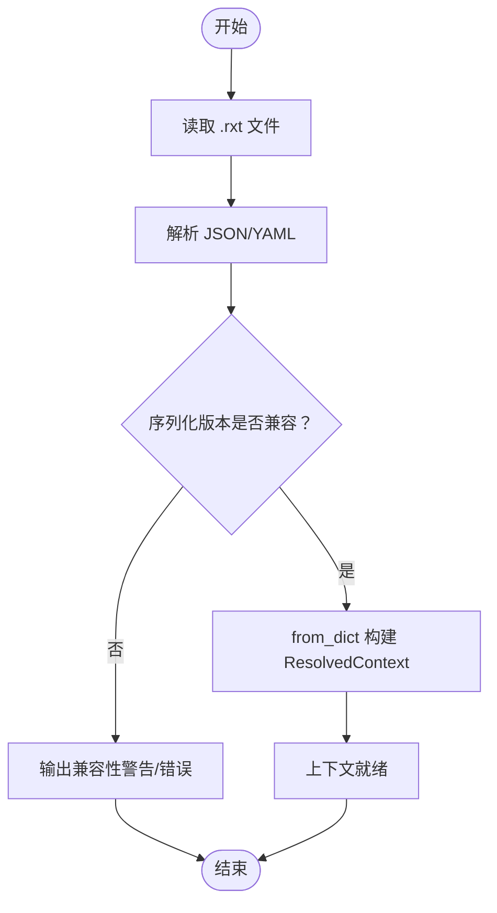
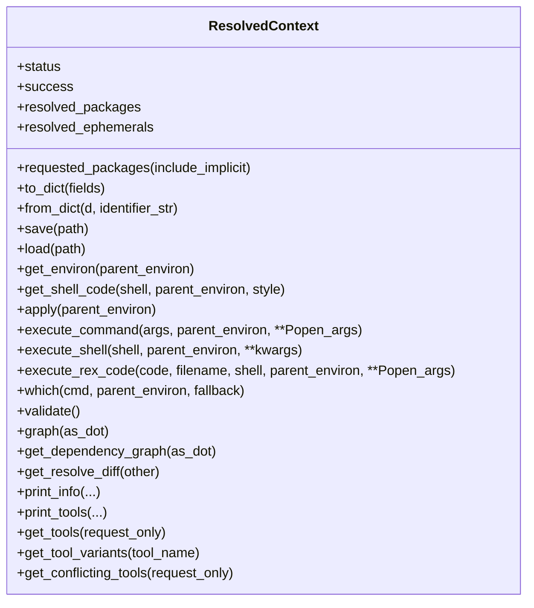
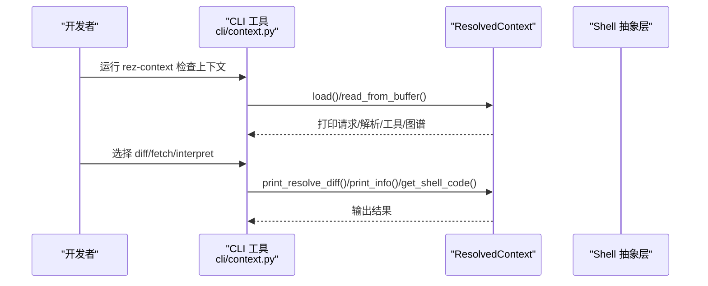
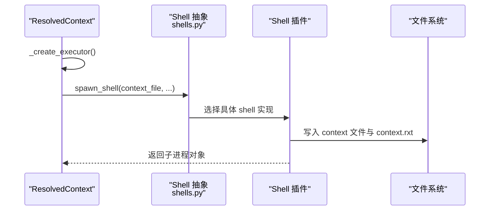
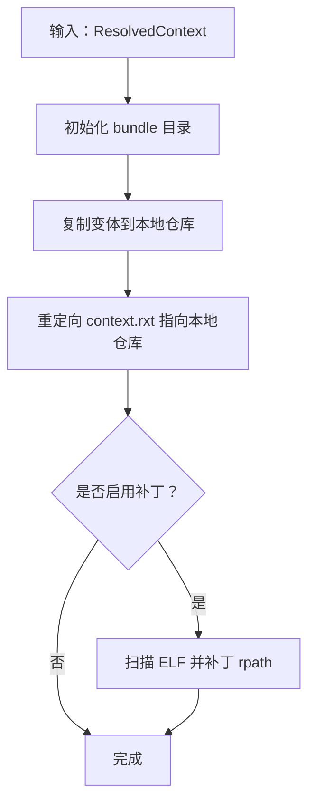
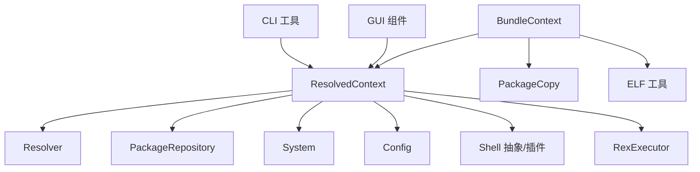

# 上下文 (Context)

<cite>
**本文引用的文件**
- [resolved_context.py](file://rez-3.3.0/src/rez/resolved_context.py)
- [context.rst](file://rez-3.3.0/docs/source/context.rst)
- [context.py](file://rez-3.3.0/src/rez/cli/context.py)
- [bundle_context.py](file://rez-3.3.0/src/rez/bundle_context.py)
- [shells.py](file://rez-3.3.0/src/rez/shells.py)
- [sh.py](file://rez-3.3.0/src/rezplugins/shell/sh.py)
- [cmd.py](file://rez-3.3.0/src/rezplugins/shell/cmd.py)
- [powershell_base.py](file://rez-3.3.0/src/rezplugins/shell/_utils/powershell_base.py)
- [test_shells.py](file://rez-3.3.0/src/rez/tests/test_shells.py)
- [rezconfig.py](file://rez-3.3.0/src/rez/rezconfig.py)
- [ResolveDialog.py](file://rez-3.3.0/src/rezgui/dialogs/ResolveDialog.py)
- [ContextSubWindow.py](file://rez-3.3.0/src/rezgui/widgets/ContextSubWindow.py)
- [ContextManagerWidget.py](file://rez-3.3.0/src/rezgui/widgets/ContextManagerWidget.py)
</cite>

## 目录
1. [引言](#引言)
2. [项目结构](#项目结构)
3. [核心组件](#核心组件)
4. [架构总览](#架构总览)
5. [详细组件分析](#详细组件分析)
6. [依赖关系分析](#依赖关系分析)
7. [性能考量](#性能考量)
8. [故障排查指南](#故障排查指南)
9. [结论](#结论)
10. [附录](#附录)

## 引言
本篇文档围绕 Rez 系统中的“上下文（Context）”展开，系统性阐述上下文作为解析结果的持久化表示，包含完全解析的包集合与环境配置；解释上下文文件（.rxt）的结构与用途，以及如何保存解析状态以便后续激活；梳理 resolved_context.py 如何管理已解析环境，包括环境变量设置、命令执行与资源加载；并给出通过命令行工具创建、保存、加载与验证上下文的操作流程；最后讨论上下文在团队协作与生产部署中的重要性与最佳实践。

## 项目结构
Rez 的上下文相关实现主要集中在以下模块：
- 解析与上下文管理：resolved_context.py
- 命令行工具：cli/context.py
- 文档：docs/source/context.rst
- 打包与捆绑：bundle_context.py
- Shell 适配层：shells.py 及各 shell 插件（如 sh.py、cmd.py、powershell_base.py）
- GUI 集成：ResolveDialog.py、ContextSubWindow.py、ContextManagerWidget.py
- 配置项：rezconfig.py 中与上下文追踪、路径规范化等相关的配置

图表来源
- [resolved_context.py](file://rez-3.3.0/src/rez/resolved_context.py#L1200-L1600)
- [context.py](file://rez-3.3.0/src/rez/cli/context.py#L1-L196)
- [bundle_context.py](file://rez-3.3.0/src/rez/bundle_context.py#L1-L120)
- [shells.py](file://rez-3.3.0/src/rez/shells.py#L224-L412)
- [sh.py](file://rez-3.3.0/src/rezplugins/shell/sh.py#L84-L121)
- [cmd.py](file://rez-3.3.0/src/rezplugins/shell/cmd.py#L84-L114)
- [powershell_base.py](file://rez-3.3.0/src/rezplugins/shell/_utils/powershell_base.py#L111-L143)
- [context.rst](file://rez-3.3.0/docs/source/context.rst#L1-L112)
- [ResolveDialog.py](file://rez-3.3.0/src/rezgui/dialogs/ResolveDialog.py#L313-L332)
- [ContextSubWindow.py](file://rez-3.3.0/src/rezgui/widgets/ContextSubWindow.py#L125-L141)
- [ContextManagerWidget.py](file://rez-3.3.0/src/rezgui/widgets/ContextManagerWidget.py#L232-L271)
- [rezconfig.py](file://rez-3.3.0/src/rez/rezconfig.py#L654-L692)

章节来源
- [context.rst](file://rez-3.3.0/docs/source/context.rst#L1-L112)

## 核心组件
- ResolvedContext：负责解析、存储与重建已解析环境；支持保存为 .rxt 文件、从 .rxt 文件加载、打印信息、差异比较、校验、执行命令与子进程、生成 shell 脚本、应用到当前 Python 会话等。
- CLI 工具（rez-context）：用于检查当前或指定上下文文件，打印请求、解析结果、工具列表、图谱、定位程序、解释上下文为环境字典或脚本等。
- Shell 抽象与插件：提供跨平台的 shell 启动、上下文脚本写入、RC 文件注入、提示符绑定、路径规范化等能力。
- 打包（bundle）：将上下文与其变体复制到本地仓库，生成可重定位的上下文包，便于离线分发与部署。
- GUI 集成：可视化地打开、保存、比较上下文，辅助研发与运维人员进行环境管理。

章节来源
- [resolved_context.py](file://rez-3.3.0/src/rez/resolved_context.py#L1200-L1600)
- [context.py](file://rez-3.3.0/src/rez/cli/context.py#L1-L196)
- [bundle_context.py](file://rez-3.3.0/src/rez/bundle_context.py#L1-L120)
- [shells.py](file://rez-3.3.0/src/rez/shells.py#L224-L412)

## 架构总览
上下文的生命周期从“解析”开始，到“持久化（.rxt）”，再到“加载与重建环境”。其关键流程如下：

图表来源
- [context.py](file://rez-3.3.0/src/rez/cli/context.py#L110-L196)
- [resolved_context.py](file://rez-3.3.0/src/rez/resolved_context.py#L1200-L1600)
- [shells.py](file://rez-3.3.0/src/rez/shells.py#L224-L412)
- [sh.py](file://rez-3.3.0/src/rezplugins/shell/sh.py#L84-L121)
- [cmd.py](file://rez-3.3.0/src/rezplugins/shell/cmd.py#L84-L114)
- [powershell_base.py](file://rez-3.3.0/src/rezplugins/shell/_utils/powershell_base.py#L111-L143)

## 详细组件分析

### 上下文文件（.rxt）结构与用途
- 结构：.rxt 是 JSON 格式的上下文文件，包含解析版本、请求包、隐式包、解析包句柄、临时包、搜索路径、时间戳、平台信息、解析统计、图数据等字段。序列化版本字段用于兼容新旧版本加载。
- 用途：保存解析状态，以便后续通过 rez-env --input 或 GUI/CLI 工具加载，重新构建等价环境；也可用于离线分发（配合 bundle）。
- 版本兼容：from_dict 在加载时会检查 serialize_version 并给出警告或错误提示，避免跨大版本不兼容导致的问题。

图表来源
- [resolved_context.py](file://rez-3.3.0/src/rez/resolved_context.py#L1597-L1742)
- [context.rst](file://rez-3.3.0/docs/source/context.rst#L1-L112)

章节来源
- [resolved_context.py](file://rez-3.3.0/src/rez/resolved_context.py#L1497-L1600)
- [context.rst](file://rez-3.3.0/docs/source/context.rst#L1-L112)

### resolved_context.py：上下文管理与执行
- 解析与存储
  - 构造函数完成解析，记录请求、隐式包、解析包、图、统计信息等；支持保存为 .rxt 与写入缓冲区。
  - 提供 to_dict/from_dict 将上下文转换为字典并持久化，支持字段裁剪以避免昂贵字段（如 graph）的重复构造。
- 环境与命令
  - get_environ：在 Python 解释器中解释上下文，返回环境字典。
  - get_shell_code：生成目标 shell 的脚本代码。
  - apply：将上下文应用到当前 Python 会话（更新 os.environ 与 sys.path）。
  - execute_command：在已配置的环境中运行子进程（非真正 shell）。
  - execute_shell：生成上下文脚本文件，写入 context 文件与 context.rxt，然后调用 shell 插件启动交互/非交互 shell。
  - execute_rex_code：在上下文中执行一段 Rex 代码。
- 工具与资源
  - get_tools/get_tool_variants/print_tools：列出可用工具及冲突检测。
  - which：在上下文中查找可执行程序。
  - validate：对解析包的数据进行校验。
- 图与差异
  - graph/get_dependency_graph：生成解析图或依赖图。
  - get_resolve_diff/print_resolve_diff：比较两个上下文的解析差异。
- 系统设置与路径
  - _execute：绑定系统变量（REZ_*）、包变量（REZ_PKG_ROOT/VERSION 等）、套件可见性、系统路径追加、Rez 工具可见性等。
  - _append_suite_paths：根据配置将套件 bin 目录加入 PATH。
- 包缓存与追踪
  - _update_package_cache：在满足条件时将解析包写入包缓存。
  - _track_context：将上下文使用情况上报到 AMQP（可选）。

图表来源
- [resolved_context.py](file://rez-3.3.0/src/rez/resolved_context.py#L1200-L2192)

章节来源
- [resolved_context.py](file://rez-3.3.0/src/rez/resolved_context.py#L1200-L2192)

### 命令行工具：创建、保存、加载与验证上下文
- 创建与保存
  - 使用 rez-env 输出到 .rxt 文件，或在 GUI 中保存上下文。
  - CLI 工具（rez-context）可用于检查上下文、打印请求/解析、工具列表、图谱、定位程序、解释为环境字典/脚本等。
- 加载与验证
  - 通过 --input 加载 .rxt 文件重建环境；或在 GUI 中打开 .rxt 文件。
  - 使用 diff/fetch 对比当前上下文与另一个上下文或重新解析的结果。
- 交互式 shell
  - execute_shell 支持交互/非交互 shell，block 参数控制阻塞行为；支持 pre/post 回调扩展上下文动作。

图表来源
- [context.py](file://rez-3.3.0/src/rez/cli/context.py#L110-L196)
- [resolved_context.py](file://rez-3.3.0/src/rez/resolved_context.py#L1200-L1600)

章节来源
- [context.py](file://rez-3.3.0/src/rez/cli/context.py#L1-L196)
- [ResolveDialog.py](file://rez-3.3.0/src/rezgui/dialogs/ResolveDialog.py#L313-L332)
- [ContextSubWindow.py](file://rez-3.3.0/src/rezgui/widgets/ContextSubWindow.py#L125-L141)
- [ContextManagerWidget.py](file://rez-3.3.0/src/rezgui/widgets/ContextManagerWidget.py#L232-L271)

### Shell 启动与上下文脚本生成
- Shell 抽象层
  - shells.py 定义了通用接口与启动序列，支持在启动时 source context 文件、设置提示符、处理 rc 文件等。
- Shell 插件
  - sh.py/cmd.py/powershell_base.py 分别实现不同 shell 的 token 转换、路径设置、提示符绑定、启动流程等。
- 上下文脚本写入
  - ResolvedContext.execute_shell 会生成 context 文件与 context.rxt，并通过 shell 插件写入临时目录后启动 shell。

图表来源
- [resolved_context.py](file://rez-3.3.0/src/rez/resolved_context.py#L1350-L1480)
- [shells.py](file://rez-3.3.0/src/rez/shells.py#L224-L412)
- [sh.py](file://rez-3.3.0/src/rezplugins/shell/sh.py#L84-L121)
- [cmd.py](file://rez-3.3.0/src/rezplugins/shell/cmd.py#L84-L114)
- [powershell_base.py](file://rez-3.3.0/src/rezplugins/shell/_utils/powershell_base.py#L111-L143)

章节来源
- [shells.py](file://rez-3.3.0/src/rez/shells.py#L224-L412)
- [sh.py](file://rez-3.3.0/src/rezplugins/shell/sh.py#L84-L121)
- [cmd.py](file://rez-3.3.0/src/rezplugins/shell/cmd.py#L84-L114)
- [powershell_base.py](file://rez-3.3.0/src/rezplugins/shell/_utils/powershell_base.py#L111-L143)

### 打包与重定位（Bundle）
- 功能概述
  - 将上下文使用的变体复制到本地仓库，生成可重定位的上下文包；可选择跳过不可重定位包或对动态库进行补丁。
- 关键步骤
  - 初始化 bundle 目录与 settings.yaml；
  - 复制变体到本地仓库；
  - 写入重定向后的 context.rxt；
  - 可选对 ELF 文件进行 rpath 补丁。

图表来源
- [bundle_context.py](file://rez-3.3.0/src/rez/bundle_context.py#L1-L120)
- [bundle_context.py](file://rez-3.3.0/src/rez/bundle_context.py#L184-L203)

章节来源
- [bundle_context.py](file://rez-3.3.0/src/rez/bundle_context.py#L1-L341)

### 上下文在团队协作与生产部署中的重要性
- 团队协作
  - 通过 .rxt 文件共享解析结果，确保团队成员在相同包版本与环境配置下工作，减少“在我机上能跑”的问题。
  - GUI/CLI 工具支持 diff/fetch，便于对比与同步环境变更。
- 生产部署
  - 使用 bundle 将上下文与变体打包为可重定位目录，便于离线部署与跨机器迁移。
  - 配合上下文追踪（AMQP）可在生产环境记录上下文使用情况，辅助审计与排障。

章节来源
- [context.rst](file://rez-3.3.0/docs/source/context.rst#L1-L112)
- [bundle_context.py](file://rez-3.3.0/src/rez/bundle_context.py#L1-L120)
- [rezconfig.py](file://rez-3.3.0/src/rez/rezconfig.py#L654-L692)

## 依赖关系分析
- ResolvedContext 依赖解析器（resolver）、包仓库（package_repository）、系统信息（system）、配置（config）、Shell 抽象与插件、REX 执行器（RexExecutor）等。
- CLI 工具依赖 ResolvedContext 与图工具（graph_utils），GUI 组件依赖 ResolvedContext 与对话框模型。
- 打包模块依赖包复制（package_copy）与 ELF 工具（elf）。

图表来源
- [resolved_context.py](file://rez-3.3.0/src/rez/resolved_context.py#L1200-L1600)
- [context.py](file://rez-3.3.0/src/rez/cli/context.py#L1-L196)
- [bundle_context.py](file://rez-3.3.0/src/rez/bundle_context.py#L1-L120)

章节来源
- [resolved_context.py](file://rez-3.3.0/src/rez/resolved_context.py#L1200-L1600)
- [context.py](file://rez-3.3.0/src/rez/cli/context.py#L1-L196)
- [bundle_context.py](file://rez-3.3.0/src/rez/bundle_context.py#L1-L120)

## 性能考量
- 解析与缓存
  - 解析阶段可启用缓存与异步包缓存，减少重复加载与网络访问。
  - 包缓存命中时，上下文会将包根目录重定向到缓存位置，提升加载速度。
- 字段裁剪
  - to_dict 支持仅导出必要字段，避免导出大型图数据等昂贵字段。
- Shell 启动
  - 非交互 shell 默认阻塞等待退出，交互 shell 可通过 block 控制；detached/new_session 等选项影响进程组与终端行为。
- GUI 与测试
  - GUI 提供上下文打开/保存/比较，测试覆盖多 shell 的执行与命令输出。

章节来源
- [resolved_context.py](file://rez-3.3.0/src/rez/resolved_context.py#L1497-L1600)
- [resolved_context.py](file://rez-3.3.0/src/rez/resolved_context.py#L1851-L1868)
- [test_shells.py](file://rez-3.3.0/src/rez/tests/test_shells.py#L168-L199)

## 故障排查指南
- 加载失败
  - from_dict 会在版本不兼容时发出警告或抛错；检查 serialize_version 与当前 Rez 版本。
- 命令执行错误
  - _execute 中对包的 commands/pre_commands/post_commands 执行时捕获异常并抛出详细错误信息，便于定位具体包与阶段。
- 环境变量缺失
  - get_environ/which 依赖父环境；若未传入 parent_environ，默认使用 os.environ。
- Shell 启动问题
  - shells.py 提供启动序列与 RC 文件注入逻辑；若提示符或环境变量异常，检查 shell 插件的 setenv/unsetenv/alias 等实现。
- 上下文追踪
  - 若配置了 context_tracking_host，上下文使用会被上报；若失败，会输出错误日志。

章节来源
- [resolved_context.py](file://rez-3.3.0/src/rez/resolved_context.py#L1932-L1950)
- [resolved_context.py](file://rez-3.3.0/src/rez/resolved_context.py#L2062-L2128)
- [shells.py](file://rez-3.3.0/src/rez/shells.py#L224-L412)
- [rezconfig.py](file://rez-3.3.0/src/rez/rezconfig.py#L654-L692)

## 结论
上下文（.rxt）是 Rez 解析结果的持久化载体，它将“请求包—解析包—环境配置—图信息”统一保存，既便于团队共享，也便于生产部署与离线使用。resolved_context.py 提供了从解析、序列化、环境应用、命令执行到 shell 启动的全链路能力；CLI/GUI 工具与打包模块进一步完善了上下文的创建、保存、加载、验证与重定位流程。通过合理的配置与最佳实践，上下文能够显著提升环境一致性与可维护性。

## 附录
- 常见命令与操作
  - 创建并保存上下文：使用 rez-env --output 生成 .rxt。
  - 加载上下文：使用 rez-env --input 或 GUI 打开 .rxt。
  - 检查上下文：使用 rez-context 打印请求/解析/工具/图谱。
  - 对比上下文：使用 --diff/--fetch。
  - 打包上下文：使用 bundle_context 将上下文与变体复制到本地仓库，生成可重定位包。

章节来源
- [context.rst](file://rez-3.3.0/docs/source/context.rst#L1-L112)
- [context.py](file://rez-3.3.0/src/rez/cli/context.py#L1-L196)
- [bundle_context.py](file://rez-3.3.0/src/rez/bundle_context.py#L1-L120)