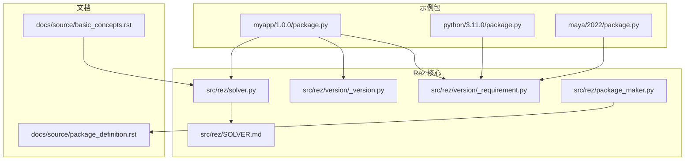
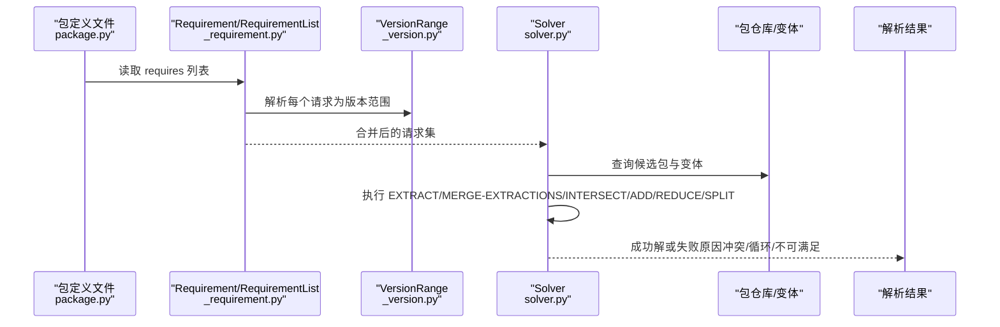
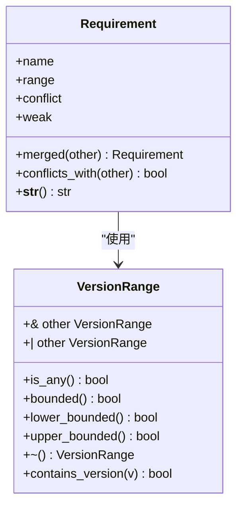
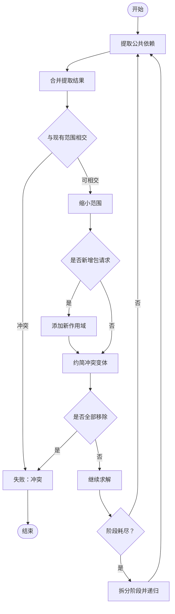
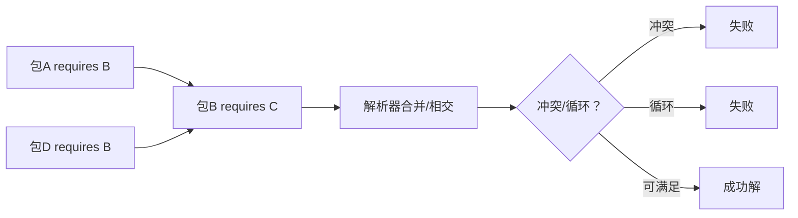

# 依赖项（Requires）

<cite>
**本文引用的文件**
- [myapp/1.0.0/package.py](file://my_packages/myapp/1.0.0/package.py)
- [python/3.11.0/package.py](file://my_packages/python/3.11.0/package.py)
- [maya/2022/package.py](file://my_packages/maya/2022/package.py)
- [package_definition.rst](file://rez-3.3.0/docs/source/package_definition.rst)
- [_requirement.py](file://rez-3.3.0/src/rez/version/_requirement.py)
- [_version.py](file://rez-3.3.0/src/rez/version/_version.py)
- [solver.py](file://rez-3.3.0/src/rez/solver.py)
- [SOLVER.md](file://rez-3.3.0/src/rez/SOLVER.md)
- [package_maker.py](file://rez-3.3.0/src/rez/package_maker.py)
- [basic_concepts.rst](file://rez-3.3.0/docs/source/basic_concepts.rst)
- [test_solver.py](file://rez-3.3.0/src/rez/tests/test_solver.py)
</cite>

## 目录
1. [引言](#引言)
2. [项目结构](#项目结构)
3. [核心组件](#核心组件)
4. [架构总览](#架构总览)
5. [详细组件分析](#详细组件分析)
6. [依赖关系分析](#依赖关系分析)
7. [性能考量](#性能考量)
8. [故障排查指南](#故障排查指南)
9. [结论](#结论)
10. [附录](#附录)

## 引言
本篇文档围绕 Rez 系统中的“依赖项”（requires）概念展开，系统性阐述 package.py 中 requires 字段的作用、依赖声明语法与语义、强依赖与弱依赖的区别、可选依赖的使用场景，并结合 myapp/1.0.0 的实际包定义展示依赖声明方式。同时，说明依赖解析如何基于这些声明构建完整环境，讨论冲突解决机制与版本兼容策略，并给出避免循环依赖与过度依赖的最佳实践建议。

## 项目结构
Rez 仓库包含大量与包定义、版本范围、解析器相关的源码与文档。本节聚焦与“依赖项”直接相关的文件与路径，帮助读者快速定位关键实现与用法说明。

图表来源
- [myapp/1.0.0/package.py](file://my_packages/myapp/1.0.0/package.py#L1-L33)
- [python/3.11.0/package.py](file://my_packages/python/3.11.0/package.py#L1-L8)
- [maya/2022/package.py](file://my_packages/maya/2022/package.py#L1-L9)
- [_requirement.py](file://rez-3.3.0/src/rez/version/_requirement.py#L106-L364)
- [_version.py](file://rez-3.3.0/src/rez/version/_version.py#L477-L772)
- [solver.py](file://rez-3.3.0/src/rez/solver.py#L1-L200)
- [SOLVER.md](file://rez-3.3.0/src/rez/SOLVER.md#L11-L57)
- [package_maker.py](file://rez-3.3.0/src/rez/package_maker.py#L35-L72)
- [package_definition.rst](file://rez-3.3.0/docs/source/package_definition.rst#L800-L860)
- [basic_concepts.rst](file://rez-3.3.0/docs/source/basic_concepts.rst#L254-L289)

章节来源
- [myapp/1.0.0/package.py](file://my_packages/myapp/1.0.0/package.py#L1-L33)
- [python/3.11.0/package.py](file://my_packages/python/3.11.0/package.py#L1-L8)
- [maya/2022/package.py](file://my_packages/maya/2022/package.py#L1-L9)
- [package_definition.rst](file://rez-3.3.0/docs/source/package_definition.rst#L800-L860)

## 核心组件
- requires 字段：在包定义文件中声明对其他包的依赖，支持版本范围与运算符（如冲突、弱引用等）。其类型为字符串列表，每个元素代表一个“包请求”。
- 版本与范围：Requirement/RequirementList 负责解析与合并包请求；VersionRange 定义版本边界与交并补运算。
- 解析器：Solver 基于请求与包依赖信息，执行提取、合并、相交、添加、约简、拆分等步骤，最终得到一组非冲突的包集合或失败原因。
- 文档与规范：package_definition.rst 明确定义 requires 的语义与示例；basic_concepts.rst 提供冲突与弱引用的概念说明。

章节来源
- [package_definition.rst](file://rez-3.3.0/docs/source/package_definition.rst#L800-L860)
- [_requirement.py](file://rez-3.3.0/src/rez/version/_requirement.py#L106-L364)
- [_version.py](file://rez-3.3.0/src/rez/version/_version.py#L477-L772)
- [solver.py](file://rez-3.3.0/src/rez/solver.py#L1-L200)
- [basic_concepts.rst](file://rez-3.3.0/docs/source/basic_concepts.rst#L254-L289)

## 架构总览
下图展示了从包定义到解析完成的关键流程：包定义文件中的 requires 被解析为 Requirement/RequirementList，随后由 Solver 驱动算法逐步收敛到最终解或失败状态。

图表来源
- [package_definition.rst](file://rez-3.3.0/docs/source/package_definition.rst#L800-L860)
- [_requirement.py](file://rez-3.3.0/src/rez/version/_requirement.py#L106-L364)
- [_version.py](file://rez-3.3.0/src/rez/version/_version.py#L477-L772)
- [solver.py](file://rez-3.3.0/src/rez/solver.py#L1181-L1522)
- [SOLVER.md](file://rez-3.3.0/src/rez/SOLVER.md#L11-L57)

## 详细组件分析

### requires 字段与包定义
- 位置与作用：在包定义文件中，requires 是一个字符串列表，用于声明该包运行或构建所需的其他包及其版本范围。
- 语法要点：
  - 每个元素为“包名 + 版本范围”，例如 “python-2.6+<3”。
  - 支持多种运算符与组合，详见 Requirement 的解析规则。
- 实际示例：
  - myapp/1.0.0/package.py 中将 requires 置为空列表，表示无依赖。
  - python/3.11.0/package.py 与 maya/2022/package.py 同样以空依赖作为最小示例。

章节来源
- [package_definition.rst](file://rez-3.3.0/docs/source/package_definition.rst#L800-L860)
- [myapp/1.0.0/package.py](file://my_packages/myapp/1.0.0/package.py#L1-L33)
- [python/3.11.0/package.py](file://my_packages/python/3.11.0/package.py#L1-L8)
- [maya/2022/package.py](file://my_packages/maya/2022/package.py#L1-L9)

### 版本与范围解析（Requirement/VersionRange）
- Requirement 类负责解析单个请求字符串，识别前缀（冲突/弱引用）、名称与版本范围，并支持合并、冲突检测与字符串化。
- VersionRange 定义了版本上下界、包含判断、交并补等运算，是解析器进行“相交/合并/约简”的基础数据结构。
- 关键能力：
  - 冲突运算：~foo 表示弱引用（否定范围），!foo 表示冲突范围。
  - 合并：多个同名请求可合并为更严格的范围，若冲突则返回失败。
  - 字符串化：输出安全且唯一的请求字符串。

图表来源
- [_requirement.py](file://rez-3.3.0/src/rez/version/_requirement.py#L106-L364)
- [_version.py](file://rez-3.3.0/src/rez/version/_version.py#L477-L772)

章节来源
- [_requirement.py](file://rez-3.3.0/src/rez/version/_requirement.py#L106-L364)
- [_version.py](file://rez-3.3.0/src/rez/version/_version.py#L477-L772)

### 依赖解析流程（Solver）
- 核心步骤（摘自 SOLVER.md）：
  - EXTRACT：从所有变体中抽取公共依赖，形成新的请求。
  - MERGE-EXTRACTIONS：合并多个提取结果，可能产生冲突。
  - INTERSECT：将新提取的依赖与现有范围相交，可能缩小或导致冲突。
  - ADD：新增一个未见过的包请求，创建新作用域。
  - REDUCE：移除与其它作用域冲突的变体，若全部被移除则整体失败。
  - SPLIT：当阶段耗尽但未解，选择一个多变体的作用域拆分为两个阶段继续递归。
- 失败类型：
  - 冲突（conflict）：请求之间存在不可满足的范围重叠。
  - 循环（cyclic）：存在包之间的循环依赖。
  - 不可满足（failed）：无法找到满足所有依赖的组合。

图表来源
- [SOLVER.md](file://rez-3.3.0/src/rez/SOLVER.md#L11-L57)
- [solver.py](file://rez-3.3.0/src/rez/solver.py#L1181-L1522)

章节来源
- [SOLVER.md](file://rez-3.3.0/src/rez/SOLVER.md#L11-L57)
- [solver.py](file://rez-3.3.0/src/rez/solver.py#L1181-L1522)

### 强依赖与弱依赖、可选依赖
- 强依赖（普通依赖）：包必须满足其声明的版本范围，否则解析失败。
- 弱依赖（~ 前缀）：不强制拉入该包，但如果存在，则必须满足范围。常用于“应用自带某库”的场景，避免重复拉入外部版本。
- 可选依赖：在 Rez 中通常通过弱引用或冲突表达“可有可无”的语义；也可通过变体（variants）与 late-bound 属性按需注入。
- 文档依据：basic_concepts.rst 对弱引用与冲突运算符进行了清晰说明。

章节来源
- [basic_concepts.rst](file://rez-3.3.0/docs/source/basic_concepts.rst#L254-L289)
- [_requirement.py](file://rez-3.3.0/src/rez/version/_requirement.py#L106-L184)

### myapp/1.0.0 的依赖声明示例
- myapp/1.0.0/package.py 将 requires 设为空列表，表示该应用不依赖其他包。这常用于“平台/系统已提供运行时”的场景，或作为最小可用示例。
- 实践建议：
  - 若应用确实依赖 python，请在 requires 中显式声明版本范围。
  - 若依赖可选（例如某些工具链），可考虑使用弱引用或变体策略。

章节来源
- [myapp/1.0.0/package.py](file://my_packages/myapp/1.0.0/package.py#L1-L33)

### 变体与依赖扩展
- 变体（variants）允许同一版本的不同依赖组合，从而在解析时选择最合适的变体。
- 文档示例展示了如何通过早期绑定函数动态生成变体要求，实现“按平台/工具链”扩展依赖。

章节来源
- [package_definition.rst](file://rez-3.3.0/docs/source/package_definition.rst#L400-L470)

## 依赖关系分析
- 耦合与内聚：
  - 包定义文件与解析器通过 Requirement/VersionRange 解耦，前者仅负责声明，后者负责计算。
  - Solver 与包仓库交互，通过查询候选变体推进 EXTRACT/INTERSECT/REDUCE/SPLIT。
- 直接与间接依赖：
  - 直接依赖来自 requires；间接依赖通过传递性传播。
- 冲突与循环：
  - 冲突检测在 RequirementList 合并阶段发生；循环检测在阶段完成时通过图算法判定。

图表来源
- [solver.py](file://rez-3.3.0/src/rez/solver.py#L1482-L1518)
- [_requirement.py](file://rez-3.3.0/src/rez/version/_requirement.py#L366-L477)

章节来源
- [solver.py](file://rez-3.3.0/src/rez/solver.py#L1482-L1518)
- [_requirement.py](file://rez-3.3.0/src/rez/version/_requirement.py#L366-L477)

## 性能考量
- 早期绑定 vs 晚绑定：
  - requires/build_requires/private_build_requires 支持晚绑定，可在解析时按上下文动态决定依赖，减少不必要的计算。
- 变体哈希与目录布局：
  - hashed_variants 可将高复杂度变体写入基于内容哈希的子目录，改善文件系统性能与缓存命中率。
- 解析优化：
  - 解析器采用“阶段栈 + 拆分”的策略，优先提取公共依赖以缩小搜索空间；测试用例覆盖了失败与成功路径，确保行为稳定。

章节来源
- [package_definition.rst](file://rez-3.3.0/docs/source/package_definition.rst#L700-L760)
- [test_solver.py](file://rez-3.3.0/src/rez/tests/test_solver.py#L82-L125)

## 故障排查指南
- 常见失败类型与定位：
  - 冲突：检查多个包对同一包的范围是否互斥；使用 RequirementList 的冲突检测辅助定位。
  - 循环：解析器会在阶段完成后检测循环依赖并报告；可通过依赖图重排与拆分策略缓解。
  - 不可满足：确认请求范围是否过严或与其他包的传递依赖冲突。
- 实战建议：
  - 使用测试用例风格的断言模式验证解析结果（成功/失败）。
  - 在复杂场景下，先简化请求，逐步增加依赖，定位问题包。

章节来源
- [solver.py](file://rez-3.3.0/src/rez/solver.py#L1482-L1518)
- [test_solver.py](file://rez-3.3.0/src/rez/tests/test_solver.py#L82-L125)

## 结论
- requires 是 Rez 包定义的核心契约，它将“包间依赖”转化为“版本范围请求”，并通过 Requirement/VersionRange 与 Solver 协作，最终得到可运行的环境。
- 弱引用与冲突运算符提供了灵活的可选依赖表达方式；变体机制进一步增强了在不同平台/工具链下的适配能力。
- 冲突与循环是解析过程中的两大失败原因，应通过合理的版本范围设计与依赖结构规避。

## 附录
- 术语对照
  - 强依赖：必须满足的依赖。
  - 弱依赖：可选依赖，存在时必须满足范围。
  - 冲突：! 前缀，表示排除某个范围。
  - 变体：同一版本的不同依赖组合。
- 最佳实践清单
  - 明确版本范围：尽量使用上/下界明确的范围，避免过于宽松导致解析不确定性。
  - 分离可选依赖：对“应用自带”的库使用弱引用，避免重复拉入外部版本。
  - 控制依赖深度：避免深层传递依赖链，必要时通过变体或 late-bound 属性按需注入。
  - 避免循环：定期审查依赖图，必要时拆分包或引入中间层。
  - 使用变体：对平台/工具链差异较大的场景，优先采用变体而非硬编码依赖。