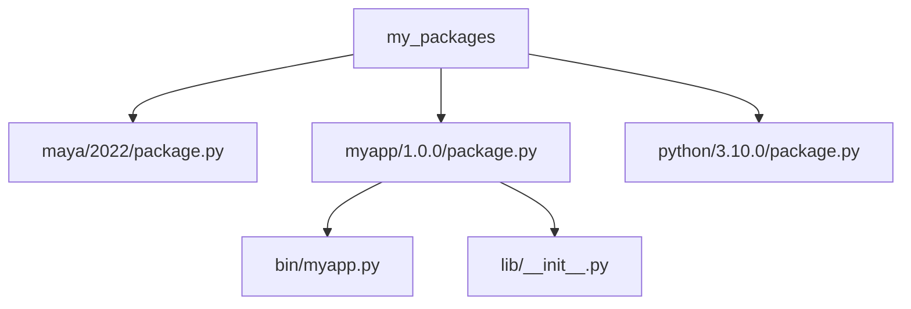
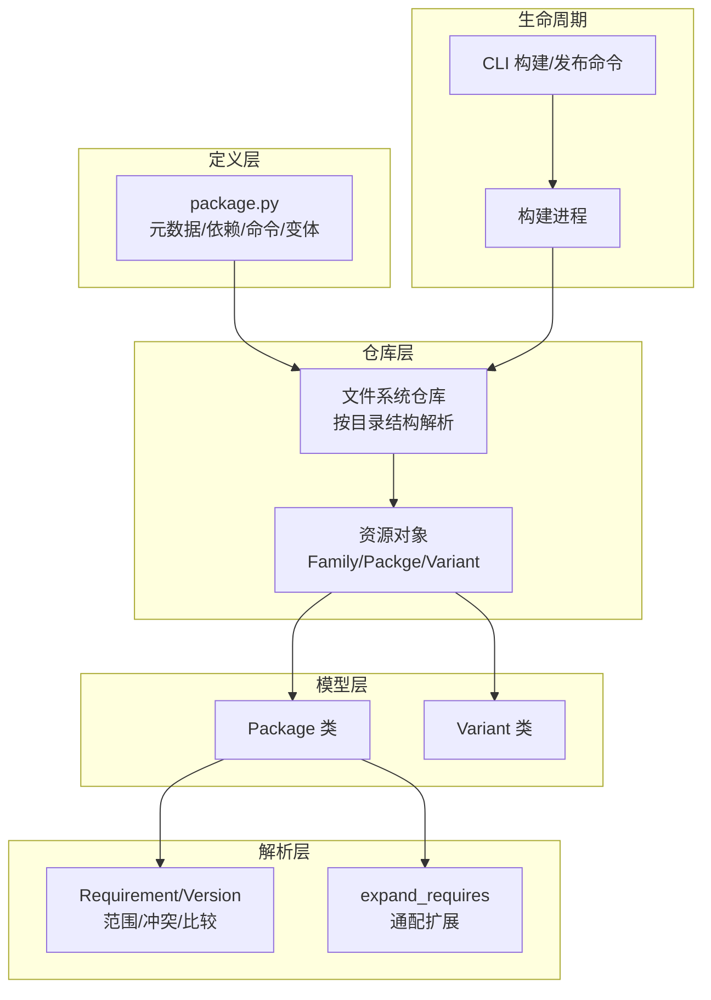
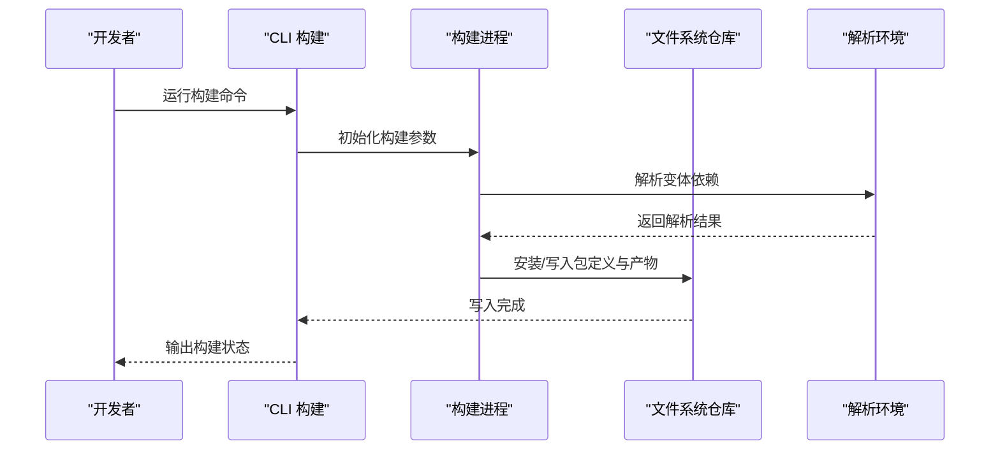
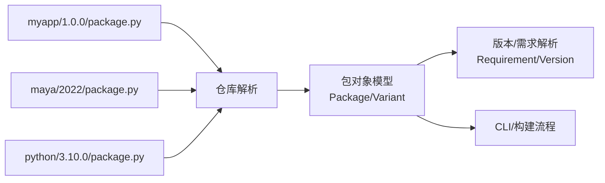

# 包（Package）

<cite>
**本文引用的文件**
- [my_packages/maya/2022/package.py](file://my_packages/maya/2022/package.py)
- [my_packages/myapp/1.0.0/package.py](file://my_packages/myapp/1.0.0/package.py)
- [my_packages/python/3.10.0/package.py](file://my_packages/python/3.10.0/package.py)
- [my_packages/myapp/1.0.0/bin/myapp.py](file://my_packages/myapp/1.0.0/bin/myapp.py)
- [my_packages/myapp/1.0.0/lib/__init__.py](file://my_packages/myapp/1.0.0/lib/__init__.py)
- [rez-3.3.0/docs/source/basic_concepts.rst](file://rez-3.3.0/docs/source/basic_concepts.rst)
- [rez-3.3.0/docs/source/package_definition.rst](file://rez-3.3.0/docs/source/package_definition.rst)
- [rez-3.3.0/src/rez/packages.py](file://rez-3.3.0/src/rez/packages.py)
- [rez-3.3.0/src/rez/package_py_utils.py](file://rez-3.3.0/src/rez/package_py_utils.py)
- [rez-3.3.0/src/rezplugins/package_repository/filesystem.py](file://rez-3.3.0/src/rezplugins/package_repository/filesystem.py)
- [rez-3.3.0/src/rez/version/_requirement.py](file://rez-3.3.0/src/rez/version/_requirement.py)
- [rez-3.3.0/src/rez/version/_version.py](file://rez-3.3.0/src/rez/version/_version.py)
- [rez-3.3.0/src/rez/cli/build.py](file://rez-3.3.0/src/rez/cli/build.py)
- [rez-3.3.0/src/rez/build_process.py](file://rez-3.3.0/src/rez/build_process.py)
- [rez-3.3.0/src/rez/data/tests/packages/developer_novar/package.yaml](file://rez-3.3.0/src/rez/data/tests/packages/developer_novar/package.yaml)
</cite>

## 目录
1. [简介](#简介)
2. [项目结构](#项目结构)
3. [核心组件](#核心组件)
4. [架构总览](#架构总览)
5. [详细组件分析](#详细组件分析)
6. [依赖关系分析](#依赖关系分析)
7. [性能考量](#性能考量)
8. [故障排查指南](#故障排查指南)
9. [结论](#结论)
10. [附录](#附录)

## 简介
本篇文档围绕 Rez 系统中的“包”概念展开，系统性阐述包作为软件分发基本单元的角色与实现细节。重点覆盖：
- 包的元数据定义（名称、版本、描述、作者、维护者等）
- 版本控制与依赖声明
- 文件结构与包仓库组织方式
- 包的生命周期：创建、构建、发布、使用
- 常见问题与最佳实践（命名规范、版本号格式、依赖表达式）

文档以 my_packages 中的实际 package.py 为依据，结合 Rez 源码与官方文档，帮助读者从入门到进阶全面掌握包的定义与使用。

## 项目结构
my_packages 是本地示例包仓库，每个子目录代表一个包族，版本号作为子目录名，根目录包含 package.py 定义文件。例如：
- myapp/1.0.0：包含可执行脚本与库模块，以及 package.py
- maya/2022：占位示例包
- python/3.10.0：占位示例包

图表来源
- [my_packages/myapp/1.0.0/package.py](file://my_packages/myapp/1.0.0/package.py#L1-L33)
- [my_packages/maya/2022/package.py](file://my_packages/maya/2022/package.py#L1-L9)
- [my_packages/python/3.10.0/package.py](file://my_packages/python/3.10.0/package.py#L1-L8)
- [my_packages/myapp/1.0.0/bin/myapp.py](file://my_packages/myapp/1.0.0/bin/myapp.py#L1-L6)
- [my_packages/myapp/1.0.0/lib/__init__.py](file://my_packages/myapp/1.0.0/lib/__init__.py#L1-L2)

章节来源
- [my_packages/myapp/1.0.0/package.py](file://my_packages/myapp/1.0.0/package.py#L1-L33)
- [my_packages/maya/2022/package.py](file://my_packages/maya/2022/package.py#L1-L9)
- [my_packages/python/3.10.0/package.py](file://my_packages/python/3.10.0/package.py#L1-L8)
- [rez-3.3.0/docs/source/basic_concepts.rst](file://rez-3.3.0/docs/source/basic_concepts.rst#L130-L171)

## 核心组件
- 包定义文件（package.py）：集中定义包元数据、依赖、变体、环境命令等。
- 包仓库（Package Repository）：文件系统插件负责按约定路径解析包族、版本与资源。
- 包对象模型：Package、Variant 等封装包与变体的属性与行为。
- 版本与依赖解析：Requirement/Version 提供版本范围与冲突表达能力。
- 构建与发布流程：CLI 与构建进程协调完成构建、安装与发布。

章节来源
- [rez-3.3.0/docs/source/package_definition.rst](file://rez-3.3.0/docs/source/package_definition.rst#L1-L120)
- [rez-3.3.0/src/rez/plugins/package_repository/filesystem.py](file://rez-3.3.0/src/rezplugins/package_repository/filesystem.py#L75-L131)
- [rez-3.3.0/src/rez/packages.py](file://rez-3.3.0/src/rez/packages.py#L186-L200)
- [rez-3.3.0/src/rez/version/_requirement.py](file://rez-3.3.0/src/rez/version/_requirement.py#L91-L122)
- [rez-3.3.0/src/rez/version/_version.py](file://rez-3.3.0/src/rez/version/_version.py#L181-L225)

## 架构总览
Rez 的包体系由“定义文件 + 仓库解析 + 对象模型 + 解析算法 + CLI/构建流程”构成。下图展示了关键交互：

图表来源
- [rez-3.3.0/src/rezplugins/package_repository/filesystem.py](file://rez-3.3.0/src/rezplugins/package_repository/filesystem.py#L75-L131)
- [rez-3.3.0/src/rez/packages.py](file://rez-3.3.0/src/rez/packages.py#L186-L200)
- [rez-3.3.0/src/rez/version/_requirement.py](file://rez-3.3.0/src/rez/version/_requirement.py#L91-L122)
- [rez-3.3.0/src/rez/package_py_utils.py](file://rez-3.3.0/src/rez/package_py_utils.py#L147-L165)
- [rez-3.3.0/src/rez/cli/build.py](file://rez-3.3.0/src/rez/cli/build.py#L76-L107)
- [rez-3.3.0/src/rez/build_process.py](file://rez-3.3.0/src/rez/build_process.py#L130-L165)

## 详细组件分析

### 包定义文件（package.py）详解
- 元数据字段
  - name：包名（必填），大小写敏感，字母数字与下划线允许
  - version：版本号，支持多令牌与分隔符
  - description：包描述
  - authors：作者列表
  - maintainers：维护者（如存在）
  - requires/system_requires：运行时/系统依赖
  - variants：变体列表，用于不同平台或工具链组合
  - tools：工具清单
  - commands/pre_commands/post_commands：环境注入逻辑
  - 其他任意自定义属性
- 函数属性
  - 早绑定（@early）：构建期计算，结果固化到安装包
  - 晚绑定（@late）：首次访问时惰性求值，支持 in_context、context、request 等上下文对象
  - 特殊函数：preprocess（预处理）、commands 等

示例要点（来自 my_packages）：
- myapp/1.0.0：定义了 name、version、description、authors、requires、variants、commands、tools 等；commands 中设置 MYAPP_ROOT、PATH、PYTHONPATH；variants 列表包含多个 python 变体
- maya/2022：最小化示例，定义 name、version、description、authors、requires、variants
- python/3.10.0：占位示例，定义 name、version、authors、description、requires、variants

章节来源
- [my_packages/myapp/1.0.0/package.py](file://my_packages/myapp/1.0.0/package.py#L1-L33)
- [my_packages/maya/2022/package.py](file://my_packages/maya/2022/package.py#L1-L9)
- [my_packages/python/3.10.0/package.py](file://my_packages/python/3.10.0/package.py#L1-L8)
- [rez-3.3.0/docs/source/package_definition.rst](file://rez-3.3.0/docs/source/package_definition.rst#L606-L800)

### 包仓库与文件结构
- 仓库布局
  - 包族目录：{repo}/{name}
  - 版本目录：{repo}/{name}/{version}
  - package.py 放置在版本目录根部
- 文件系统仓库解析
  - 遍历包族目录，读取版本子目录
  - 校验 package.py 存在性与格式
  - 将包族、包、变体映射为资源对象
- 资源对象
  - Family/Packge/Variant：统一的资源包装器，支持延迟绑定函数缓存与上下文绑定

章节来源
- [rez-3.3.0/docs/source/basic_concepts.rst](file://rez-3.3.0/docs/source/basic_concepts.rst#L130-L171)
- [rez-3.3.0/src/rezplugins/package_repository/filesystem.py](file://rez-3.3.0/src/rezplugins/package_repository/filesystem.py#L75-L131)
- [rez-3.3.0/src/rez/packages.py](file://rez-3.3.0/src/rez/packages.py#L186-L200)

### 版本与依赖解析
- 版本号规则
  - 字母数字下划线组合，令牌由点或短横分隔
  - 严格弱序：下划线 < 字母(a-z,A-Z) < 数字；大小写敏感；零填充优先
  - 令牌内含字母数字时拆分为更小组分后比较
- 依赖表达
  - Requirement 表达式支持范围、冲突（!）、弱引用（~）
  - 通配扩展：expand_requires/expand_requirement 支持尾随通配符与全版本通配符
- 实践建议
  - 使用语义化版本但注意排序差异
  - 依赖尽量使用范围表达，避免硬编码具体小版本

章节来源
- [rez-3.3.0/docs/source/basic_concepts.rst](file://rez-3.3.0/docs/source/basic_concepts.rst#L28-L88)
- [rez-3.3.0/src/rez/version/_requirement.py](file://rez-3.3.0/src/rez/version/_requirement.py#L91-L122)
- [rez-3.3.0/src/rez/package_py_utils.py](file://rez-3.3.0/src/rez/package_py_utils.py#L147-L165)
- [rez-3.3.0/src/rez/version/_version.py](file://rez-3.3.0/src/rez/version/_version.py#L181-L225)

### 包的生命周期：创建、构建、发布、使用
- 创建
  - 在 my_packages 下新增包族目录与版本目录，编写 package.py
  - package.py 中定义 name、version、requires、variants、commands 等
- 构建
  - 使用 CLI 构建命令进行解析与构建，支持清理、安装、生成脚本、查看预处理等选项
  - 构建过程会迭代变体，解析环境并在已解析环境中执行构建系统
- 发布
  - 将构建产物安装至发布仓库路径，遵循版本唯一性与顺序约束
  - 可配置发布钩子（如邮件、AMQP）与前置/后置命令
- 使用
  - 通过 rez-env 或其他工具请求包，系统解析依赖并注入环境命令
  - commands/pre_commands/post_commands 在进入环境时按阶段执行

图表来源
- [rez-3.3.0/src/rez/cli/build.py](file://rez-3.3.0/src/rez/cli/build.py#L76-L107)
- [rez-3.3.0/src/rez/build_process.py](file://rez-3.3.0/src/rez/build_process.py#L130-L165)
- [rez-3.3.0/src/rezplugins/package_repository/filesystem.py](file://rez-3.3.0/src/rezplugins/package_repository/filesystem.py#L1407-L1438)

章节来源
- [rez-3.3.0/src/rez/cli/build.py](file://rez-3.3.0/src/rez/cli/build.py#L76-L107)
- [rez-3.3.0/src/rez/build_process.py](file://rez-3.3.0/src/rez/build_process.py#L130-L165)
- [rez-3.3.0/src/rezplugins/package_repository/filesystem.py](file://rez-3.3.0/src/rezplugins/package_repository/filesystem.py#L1407-L1438)

### 包对象与命令执行
- Package/Variant 封装
  - 统一的资源包装器，支持延迟绑定函数缓存与上下文绑定
  - commands/pre_commands/post_commands 在进入环境时按阶段执行
- 上下文绑定
  - late-binding 时注入 in_context、context、request、system 等对象
  - this 可能指向 Package 或 Variant，需用 is_package/is_variant 区分

章节来源
- [rez-3.3.0/src/rez/packages.py](file://rez-3.3.0/src/rez/packages.py#L186-L200)
- [rez-3.3.0/docs/source/package_definition.rst](file://rez-3.3.0/docs/source/package_definition.rst#L250-L310)

## 依赖关系分析
- 包定义文件依赖于 Rez 的解析与仓库插件
- 仓库插件依赖版本与需求解析模块
- CLI/构建进程依赖仓库与解析模块
- 示例包（myapp/maya/python）彼此独立，通过 requires/variants 与其他包建立依赖关系

图表来源
- [my_packages/myapp/1.0.0/package.py](file://my_packages/myapp/1.0.0/package.py#L1-L33)
- [my_packages/maya/2022/package.py](file://my_packages/maya/2022/package.py#L1-L9)
- [my_packages/python/3.10.0/package.py](file://my_packages/python/3.10.0/package.py#L1-L8)
- [rez-3.3.0/src/rezplugins/package_repository/filesystem.py](file://rez-3.3.0/src/rezplugins/package_repository/filesystem.py#L75-L131)
- [rez-3.3.0/src/rez/packages.py](file://rez-3.3.0/src/rez/packages.py#L186-L200)
- [rez-3.3.0/src/rez/version/_requirement.py](file://rez-3.3.0/src/rez/version/_requirement.py#L91-L122)

章节来源
- [my_packages/myapp/1.0.0/package.py](file://my_packages/myapp/1.0.0/package.py#L1-L33)
- [rez-3.3.0/src/rezplugins/package_repository/filesystem.py](file://rez-3.3.0/src/rezplugins/package_repository/filesystem.py#L75-L131)
- [rez-3.3.0/src/rez/packages.py](file://rez-3.3.0/src/rez/packages.py#L186-L200)

## 性能考量
- 延迟绑定函数仅在首次访问时求值并缓存，减少运行时开销
- 早绑定函数在构建期计算，将昂贵操作移至构建阶段
- 使用 expand_requires/expand_requirement 时注意范围匹配与仓库查询成本
- 合理使用 hashed_variants 以优化高依赖变体的存储与查找

章节来源
- [rez-3.3.0/docs/source/package_definition.rst](file://rez-3.3.0/docs/source/package_definition.rst#L177-L248)
- [rez-3.3.0/src/rez/package_py_utils.py](file://rez-3.3.0/src/rez/package_py_utils.py#L147-L165)

## 故障排查指南
- 未找到包定义文件
  - 现象：仓库扫描不到 package.py
  - 排查：确认版本目录是否存在 package.py，路径是否正确
- 版本号不合法
  - 现象：版本令牌不符合规则导致比较失败
  - 排查：检查令牌分隔符、大小写与零填充
- 依赖冲突
  - 现象：解析失败，提示冲突
  - 排查：调整 requires 范围或使用冲突/弱引用表达式
- 发布失败
  - 现象：版本重复或路径不存在
  - 排查：更新版本号、确保发布路径存在

章节来源
- [rez-3.3.0/src/rezplugins/package_repository/filesystem.py](file://rez-3.3.0/src/rezplugins/package_repository/filesystem.py#L75-L85)
- [rez-3.3.0/src/rez/version/_version.py](file://rez-3.3.0/src/rez/version/_version.py#L181-L225)
- [rez-3.3.0/src/rez/version/_requirement.py](file://rez-3.3.0/src/rez/version/_requirement.py#L91-L122)
- [rez-3.3.0/src/rezplugins/release_hook/rezconfig.py](file://rez-3.3.0/src/rezplugins/release_hook/rezconfig.py#L76-L106)

## 结论
Rez 的包体系以 package.py 为核心，通过文件系统仓库与对象模型实现对包的统一管理。借助版本与依赖解析、变体机制、命令注入与构建发布流程，Rez 提供了灵活、可扩展且高性能的软件分发与环境管理能力。实践中应重视命名规范、版本号格式与依赖表达，合理利用早/晚绑定与通配扩展，以获得更好的可维护性与性能表现。

## 附录

### 常见问题与最佳实践
- 命名规范
  - 包名大小写敏感，建议使用小写与下划线
  - 避免特殊字符，保持简洁明确
- 版本号格式
  - 使用字母数字与下划线，令牌由点或短横分隔
  - 遵循严格弱序，注意大小写与零填充
  - 不强制语义化版本，但需考虑排序差异
- 依赖声明
  - 优先使用范围表达，避免硬编码具体小版本
  - 使用通配扩展时注意语法与仓库可用性
- 变体设计
  - 明确变体边界，避免过多冲突需求
  - 对高依赖变体启用 hashed_variants
- 环境命令
  - commands/pre_commands/post_commands 分阶段注入，避免重复工作
  - 将昂贵操作移至早绑定函数，降低运行时成本

章节来源
- [rez-3.3.0/docs/source/basic_concepts.rst](file://rez-3.3.0/docs/source/basic_concepts.rst#L28-L88)
- [rez-3.3.0/docs/source/package_definition.rst](file://rez-3.3.0/docs/source/package_definition.rst#L398-L431)
- [rez-3.3.0/src/rez/package_py_utils.py](file://rez-3.3.0/src/rez/package_py_utils.py#L147-L165)