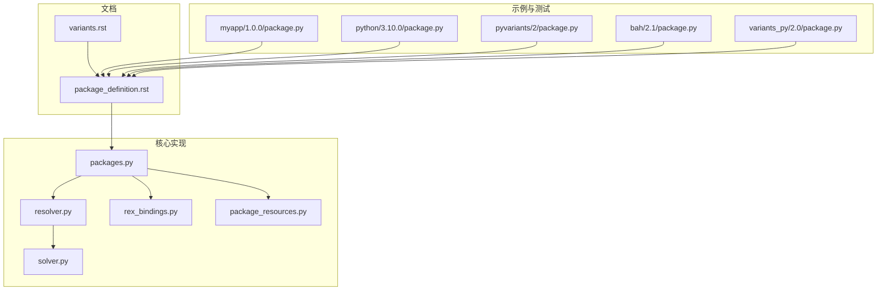
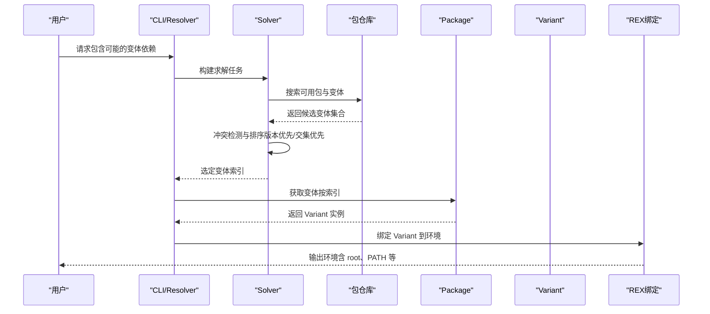
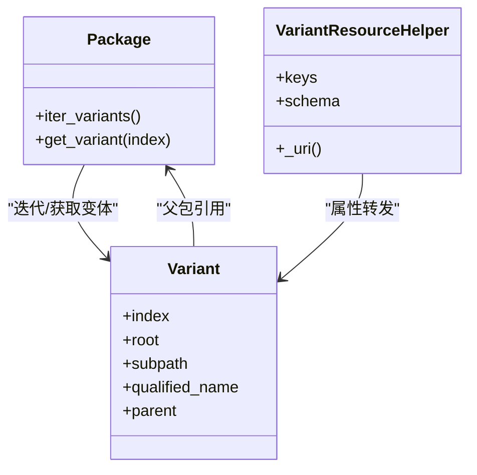
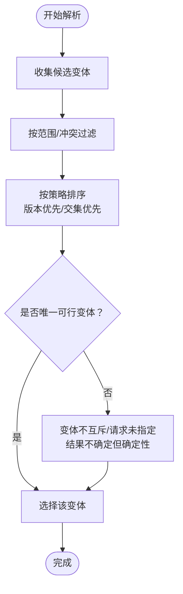

# 变体 (Variants)

<cite>
**本文引用的文件**
- [variants.rst](file://rez-3.3.0/docs/source/variants.rst)
- [package_definition.rst](file://rez-3.3.0/docs/source/package_definition.rst)
- [packages.py](file://rez-3.3.0/src/rez/packages.py)
- [resolver.py](file://rez-3.3.0/src/rez/resolver.py)
- [solver.py](file://rez-3.3.0/src/rez/solver.py)
- [rex_bindings.py](file://rez-3.3.0/src/rez/rex_bindings.py)
- [package_resources.py](file://rez-3.3.0/src/rez/package_resources.py)
- [myapp\1.0.0\package.py](file://my_packages/myapp/1.0.0/package.py)
- [python\3.10.0\package.py](file://my_packages/python/3.10.0/package.py)
- [pyvariants\2\package.py](file://rez-3.3.0/src/rez/data/tests/solver/packages/pyvariants/2/package.py)
- [bah\2.1\package.py](file://rez-3.3.0/src/rez/data/tests/builds/packages/bah/2.1/package.py)
- [variants_py\2.0\package.py](file://rez-3.3.0/src/rez/data/tests/packages/py_packages/variants_py/2.0/package.py)
</cite>

## 目录
1. [引言](#引言)
2. [项目结构](#项目结构)
3. [核心组件](#核心组件)
4. [架构总览](#架构总览)
5. [详细组件分析](#详细组件分析)
6. [依赖关系分析](#依赖关系分析)
7. [性能考量](#性能考量)
8. [故障排查指南](#故障排查指南)
9. [结论](#结论)
10. [附录](#附录)

## 引言
本篇文档围绕 Rez 系统中的“变体（Variants）”展开，系统性阐述：
- 变体如何让单个包存在多个不同配置或构建选项的版本（如不同编译器、Python 版本或功能开关）
- package.py 中 variants 字段的定义方式与语义
- 用户如何在请求包时选择特定变体（当前默认行为与限制）
- 变体如何影响依赖解析过程，以及 Rez 如何确保变体间的兼容性
- 变体与包版本的区别，以及何时应使用变体而非创建新包

## 项目结构
与变体相关的关键位置包括：
- 文档：variants.rst、package_definition.rst
- 核心实现：packages.py、resolver.py、solver.py、rex_bindings.py、package_resources.py
- 示例包：my_packages 下的 myapp、python 等；测试用例中包含大量 variants 的样例

图表来源
- [variants.rst](file://rez-3.3.0/docs/source/variants.rst#L1-L120)
- [package_definition.rst](file://rez-3.3.0/docs/source/package_definition.rst#L920-L940)
- [packages.py](file://rez-3.3.0/src/rez/packages.py#L304-L380)
- [resolver.py](file://rez-3.3.0/src/rez/resolver.py#L1-L120)
- [solver.py](file://rez-3.3.0/src/rez/solver.py#L429-L459)
- [rex_bindings.py](file://rez-3.3.0/src/rez/rex_bindings.py#L112-L156)
- [package_resources.py](file://rez-3.3.0/src/rez/package_resources.py#L438-L460)
- [myapp\1.0.0\package.py](file://my_packages/myapp/1.0.0/package.py#L24-L29)
- [python\3.10.0\package.py](file://my_packages/python/3.10.0/package.py#L1-L8)
- [pyvariants\2\package.py](file://rez-3.3.0/src/rez/data/tests/solver/packages/pyvariants/2/package.py#L3-L8)
- [bah\2.1\package.py](file://rez-3.3.0/src/rez/data/tests/builds/packages/bah/2.1/package.py#L8-L10)
- [variants_py\2.0\package.py](file://rez-3.3.0/src/rez/data/tests/packages/py_packages/variants_py/2.0/package.py#L8-L11)

章节来源
- [variants.rst](file://rez-3.3.0/docs/source/variants.rst#L1-L120)
- [package_definition.rst](file://rez-3.3.0/docs/source/package_definition.rst#L920-L940)

## 核心组件
- 变体定义与存储
  - variants 字段为二维列表，每个子列表代表一个变体的依赖集合，这些依赖会附加到包的 requires 上形成最终变体依赖集。
  - 变体安装路径通常以变体依赖集合命名，也可启用哈希变体避免路径过长或非法字符问题。
- 变体对象模型
  - Package 提供迭代变体的方法，Variant 是具体变体实例，具备 index、root、subpath 等属性，并可访问父包属性。
- 解析与选择
  - 解析器根据请求与变体依赖进行冲突检测与排序，采用“版本优先”或“交集优先”等策略选择最优变体。
- 绑定与上下文
  - 在环境绑定中，VariantBinding 将变体暴露给脚本与命令，支持缓存根目录与路径归一化。

章节来源
- [variants.rst](file://rez-3.3.0/docs/source/variants.rst#L1-L120)
- [package_definition.rst](file://rez-3.3.0/docs/source/package_definition.rst#L920-L940)
- [packages.py](file://rez-3.3.0/src/rez/packages.py#L304-L380)
- [resolver.py](file://rez-3.3.0/src/rez/resolver.py#L1-L120)
- [solver.py](file://rez-3.3.0/src/rez/solver.py#L429-L459)
- [rex_bindings.py](file://rez-3.3.0/src/rez/rex_bindings.py#L112-L156)
- [package_resources.py](file://rez-3.3.0/src/rez/package_resources.py#L438-L460)

## 架构总览
下图展示了从请求到变体选择与环境绑定的整体流程。

图表来源
- [resolver.py](file://rez-3.3.0/src/rez/resolver.py#L114-L171)
- [solver.py](file://rez-3.3.0/src/rez/solver.py#L429-L459)
- [packages.py](file://rez-3.3.0/src/rez/packages.py#L304-L380)
- [rex_bindings.py](file://rez-3.3.0/src/rez/rex_bindings.py#L112-L156)

## 详细组件分析

### 变体定义与声明（package.py）
- variants 字段
  - 类型为 list[list[str]]，每个子列表是一个变体的依赖集合。这些依赖会被追加到包的 requires，形成变体的完整依赖。
  - 变体条目与 requires 中的依赖语法一致，可包含范围、排除等。
- 示例
  - myapp 包定义了三种 Python 版本的变体，分别指向 python-3.7、python-3.9、python-3.11。
  - python 占位包定义了一个空依赖的变体，常用于仅占位的场景。
  - 测试包 pyvariants 展示了多变体与缺失依赖的组合。
- 早期绑定与动态生成
  - 可通过早期绑定函数动态生成 variants，结合 expand_requires 进行通配扩展，实现平台、架构、操作系统等维度的变体组合。

章节来源
- [package_definition.rst](file://rez-3.3.0/docs/source/package_definition.rst#L920-L940)
- [myapp\1.0.0\package.py](file://my_packages/myapp/1.0.0/package.py#L24-L29)
- [python\3.10.0\package.py](file://my_packages/python/3.10.0/package.py#L1-L8)
- [pyvariants\2\package.py](file://rez-3.3.0/src/rez/data/tests/solver/packages/pyvariants/2/package.py#L3-L8)
- [variants_py\2.0\package.py](file://rez-3.3.0/src/rez/data/tests/packages/py_packages/variants_py/2.0/package.py#L8-L11)

### 变体对象模型与资源转发
- Variant 类
  - 表示具体变体，提供 index、qualified_name、parent 等属性；可访问父包的非变体属性（如 requires、tools 等），但不包含 variants 自身。
- VariantResourceHelper
  - 通过元类将父包属性转发至变体，除 variants 与 requires 外，其他属性均透传。
- 变体与包的关系
  - 变体是包的一个“实例化视图”，其 root 与 subpath 由变体依赖决定；在未解析上下文中，this 可能指向包或变体，需通过 is_package/is_variant 区分。

图表来源
- [packages.py](file://rez-3.3.0/src/rez/packages.py#L304-L380)
- [package_resources.py](file://rez-3.3.0/src/rez/package_resources.py#L438-L460)

章节来源
- [packages.py](file://rez-3.3.0/src/rez/packages.py#L304-L380)
- [package_resources.py](file://rez-3.3.0/src/rez/package_resources.py#L438-L460)

### 变体选择与解析流程
- 选择策略
  - 默认“版本优先”：优先选择与请求中包匹配度高且版本更高的变体；若请求中未显式指定，则按变体中列出的顺序与版本进行偏好排序。
  - “交集优先”：优先选择与请求中包重叠最多的变体，其次考虑版本。
- 冲突与确定性
  - 若变体之间不互斥（如 Maya/Houdini），则结果不确定，但解析仍保持确定性；可通过请求显式指定目标变体依赖来规避歧义。
- 哈希变体与短链接
  - 对于复杂或非法字符较多的变体依赖，可启用 hashed_variants 并配合短链接，提升可读性与跨平台兼容性。

图表来源
- [variants.rst](file://rez-3.3.0/docs/source/variants.rst#L143-L262)
- [solver.py](file://rez-3.3.0/src/rez/solver.py#L429-L459)

章节来源
- [variants.rst](file://rez-3.3.0/docs/source/variants.rst#L143-L262)
- [solver.py](file://rez-3.3.0/src/rez/solver.py#L429-L459)

### 变体与包版本的区别
- 版本（Version）
  - 表示包的发布版本号，用于区分不同发布状态与功能集；版本比较遵循严格的令牌规则。
- 变体（Variant）
  - 表示同一版本包的不同“配置/构建选项”，通过 variants 字段声明；变体在同一环境中只选一个，且其依赖集合决定安装路径与运行时行为。
- 设计建议
  - 当需要在同一版本内支持多种依赖组合（如多 Python 版本、多 DCC 支持）时，使用变体；当依赖差异极大导致无法共存时，应考虑升级版本号并创建新版本包。

章节来源
- [variants.rst](file://rez-3.3.0/docs/source/variants.rst#L1-L120)
- [basic_concepts.rst](file://rez-3.3.0/docs/source/basic_concepts.rst#L32-L73)

### 变体在环境绑定中的呈现
- VariantBinding
  - 将 Variant 暴露给脚本与命令，支持缓存根目录与路径归一化，保证 resolve.<pkg>.root 等引用稳定可靠。
- this 对象
  - 在 late 绑定函数中，this 可能是包或变体，需通过 is_package/is_variant 区分；在上下文中 this 通常为变体。

章节来源
- [rex_bindings.py](file://rez-3.3.0/src/rez/rex_bindings.py#L112-L156)
- [package_definition.rst](file://rez-3.3.0/docs/source/package_definition.rst#L297-L310)

## 依赖关系分析
- 变体与解析器
  - 解析器在解决过程中对每个包维护变体条目，排序后选择首个可行变体；变体排序键综合考虑请求匹配度、额外依赖数量与版本。
- 变体与仓库
  - 仓库返回候选变体集合，变体依赖作为安装路径的一部分，影响变体定位与加载。
- 变体与命令
  - commands 等命令在变体上下文中执行，可利用 this.root、this.index 等属性进行差异化处理。

图表来源
- [resolver.py](file://rez-3.3.0/src/rez/resolver.py#L114-L171)
- [solver.py](file://rez-3.3.0/src/rez/solver.py#L429-L459)
- [rex_bindings.py](file://rez-3.3.0/src/rez/rex_bindings.py#L112-L156)

章节来源
- [resolver.py](file://rez-3.3.0/src/rez/resolver.py#L114-L171)
- [solver.py](file://rez-3.3.0/src/rez/solver.py#L429-L459)
- [rex_bindings.py](file://rez-3.3.0/src/rez/rex_bindings.py#L112-L156)

## 性能考量
- 变体数量与路径长度
  - 复杂变体依赖可能导致安装路径过长或包含非法字符，建议启用 hashed_variants 并使用短链接。
- 排序与缓存
  - 解析器对变体进行排序与缓存，合理设置 variant_select_mode 可减少不必要的回溯与冲突检查。
- 动态生成变体
  - 使用早期绑定函数动态生成 variants 可减少重复定义，但需注意预构建阶段的计算成本。

[本节为通用指导，无需列出具体文件来源]

## 故障排查指南
- 变体不可解析
  - 检查变体依赖是否存在、版本范围是否正确；确认请求中是否显式指定了目标变体依赖以消除歧义。
- 安装路径异常
  - 启用 hashed_variants 并开启短链接，避免路径过长或非法字符。
- 变体选择不符合预期
  - 调整 variant_select_mode 或在请求中显式指定目标变体依赖；核对变体列表顺序与版本优先级。
- late 绑定函数报错
  - 确保在 in_context 与非上下文两种情况下均能返回合理值；必要时区分 this.is_package 与 this.is_variant。

章节来源
- [variants.rst](file://rez-3.3.0/docs/source/variants.rst#L143-L262)
- [package_definition.rst](file://rez-3.3.0/docs/source/package_definition.rst#L297-L310)

## 结论
- 变体是 Rez 在“同一版本内支持多配置”的关键机制，通过 variants 字段声明不同依赖组合，使包能在同一版本下覆盖多平台、多工具链或多功能开关。
- 解析器基于“版本优先/交集优先”策略选择最优变体，同时通过哈希变体与短链接提升可维护性与跨平台兼容性。
- 设计包时，应优先评估是否可通过变体满足差异需求；当差异过大导致无法共存时，再考虑升级版本号并创建新版本包。

[本节为总结性内容，无需列出具体文件来源]

## 附录
- 实际代码示例路径（请参见对应文件）
  - 变体声明与使用：myapp/1.0.0/package.py、python/3.10.0/package.py、pyvariants/2/package.py、variants_py/2.0/package.py、bah/2.1/package.py
  - 变体选择策略与解析：solver.py（排序键）、resolver.py（求解流程）
  - 变体对象模型与资源转发：packages.py、package_resources.py
  - 环境绑定与 this 对象：rex_bindings.py、package_definition.rst

[本节为补充信息，无需列出具体文件来源]