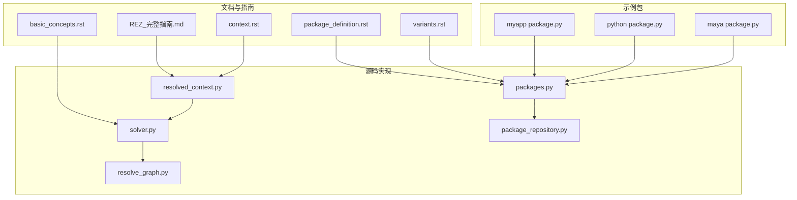
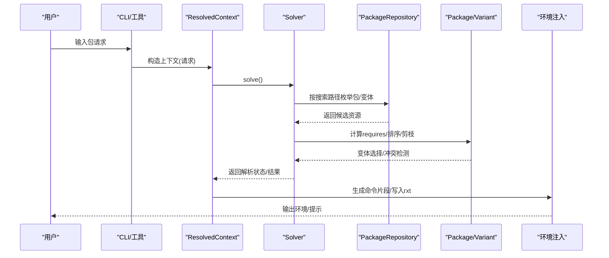
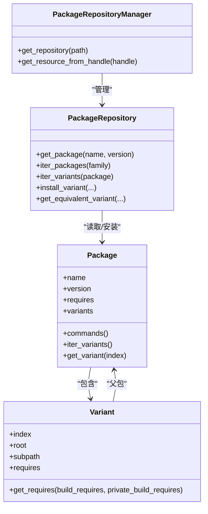
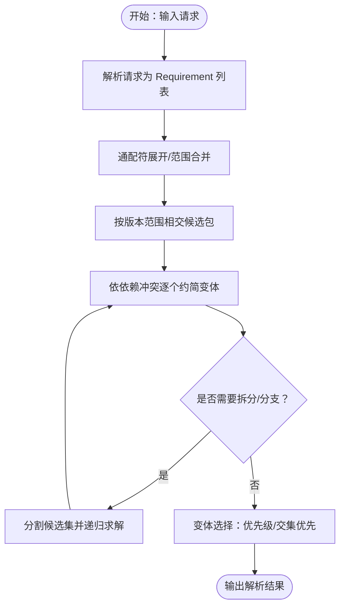
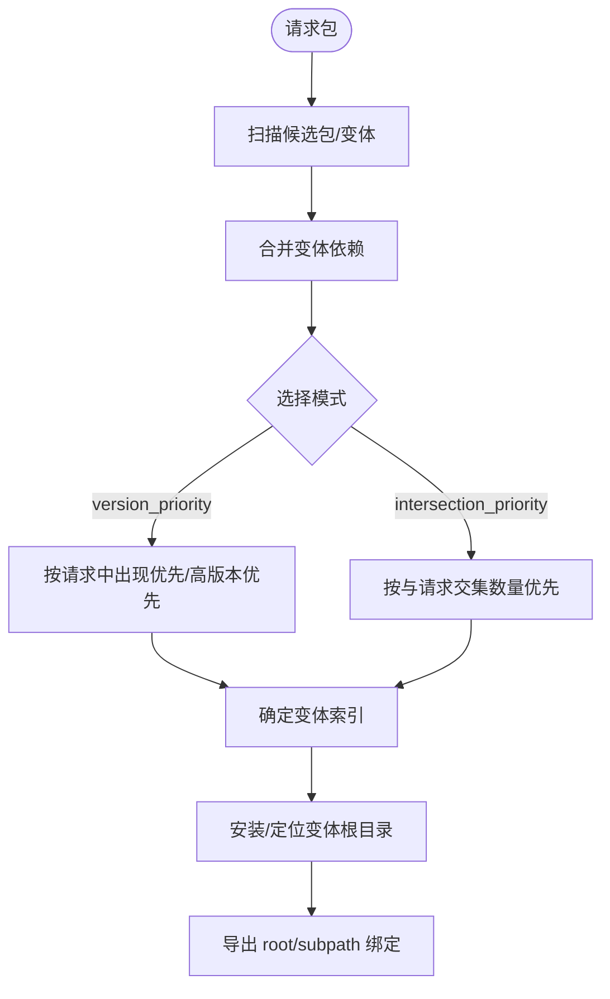
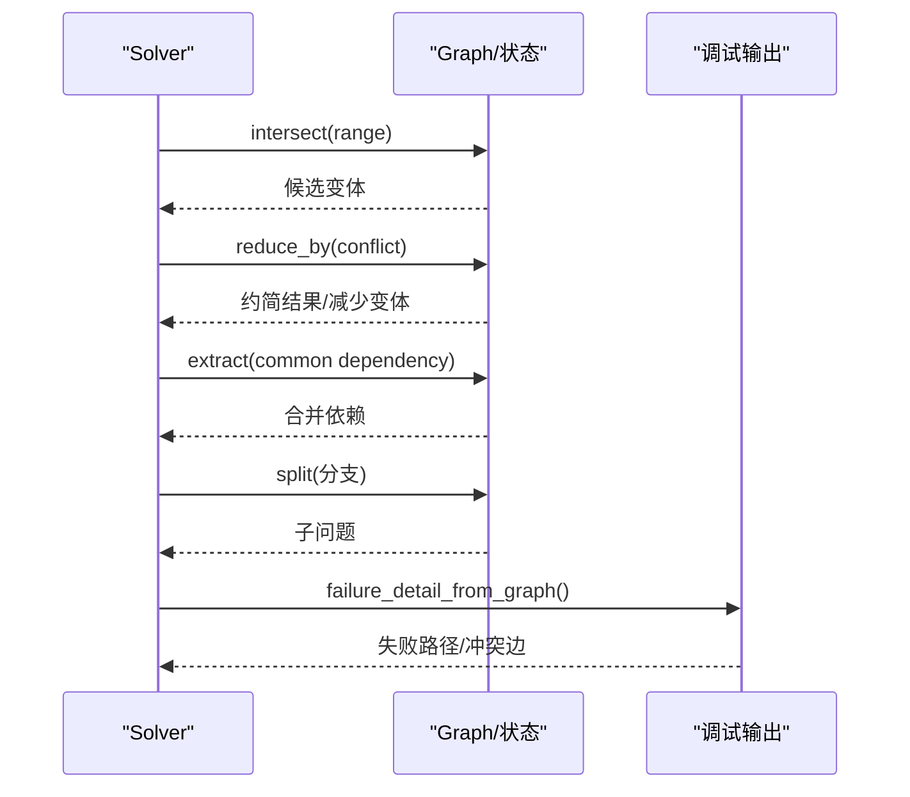
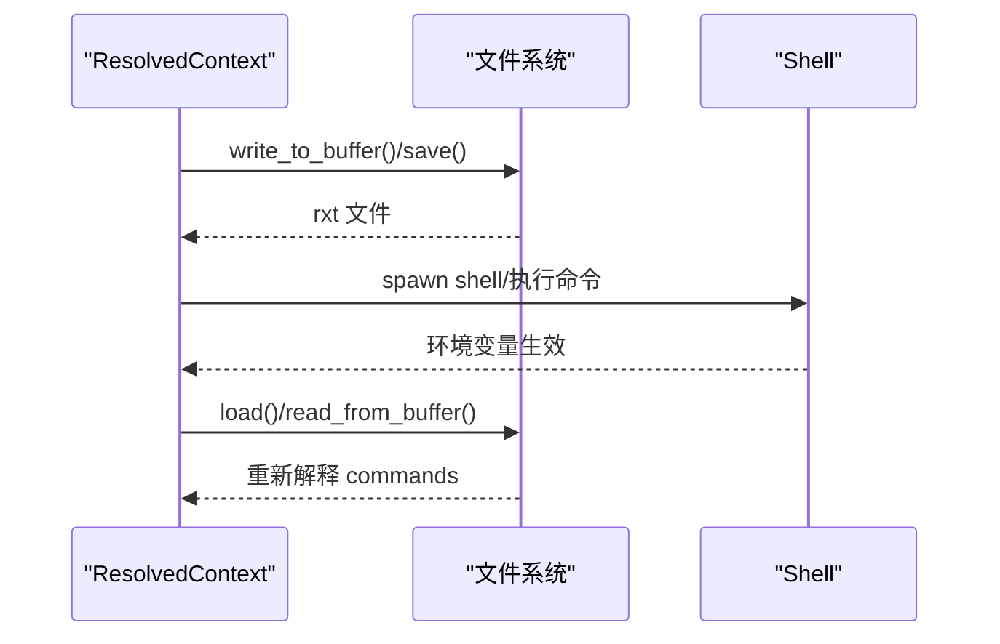
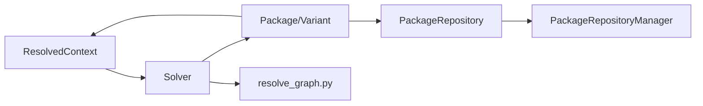

# 核心概念

<cite>
**本文引用的文件**
- [REZ_完整指南.md](file://REZ_完整指南.md)
- [basic_concepts.rst](file://rez-3.3.0/docs/source/basic_concepts.rst)
- [package_definition.rst](file://rez-3.3.0/docs/source/package_definition.rst)
- [variants.rst](file://rez-3.3.0/docs/source/variants.rst)
- [context.rst](file://rez-3.3.0/docs/source/context.rst)
- [resolved_context.py](file://rez-3.3.0/src/rez/resolved_context.py)
- [solver.py](file://rez-3.3.0/src/rez/solver.py)
- [packages.py](file://rez-3.3.0/src/rez/packages.py)
- [package_repository.py](file://rez-3.3.0/src/rez/package_repository.py)
- [resolve_graph.py](file://rez-3.3.0/src/rez/utils/resolve_graph.py)
- [myapp package.py](file://my_packages/myapp/1.0.0/package.py)
- [python package.py](file://my_packages/python/3.10.0/package.py)
- [maya package.py](file://my_packages/maya/2022/package.py)
</cite>

## 目录
1. [引言](#引言)
2. [项目结构](#项目结构)
3. [核心组件](#核心组件)
4. [架构总览](#架构总览)
5. [详细组件分析](#详细组件分析)
6. [依赖关系分析](#依赖关系分析)
7. [性能考量](#性能考量)
8. [故障排查指南](#故障排查指南)
9. [结论](#结论)
10. [附录](#附录)

## 引言
本篇文档围绕 Rez 包管理系统的核心概念展开，系统性地阐述“包（Package）”“依赖项（Requires）”“变体（Variants）”“解析（Resolve）”“上下文（Context）”五大概念，并结合仓库中的指南与源码，解释它们如何协同工作以实现高效、可复现的包与环境管理。文档同时提供概念关系图、使用场景与实践建议，帮助读者从入门到进阶掌握 Rez 的关键机制。

## 项目结构
- 文档与指南：位于仓库根目录与 docs/source 下，涵盖基础概念、包定义、变体、上下文等章节。
- 源码实现：位于 rez-3.3.0/src/rez 下，包含解析器、包模型、仓库抽象、上下文管理等核心模块。
- 示例包：位于 my_packages 下，包含示例包 myapp、python、maya，便于理解包定义与变体配置。

图表来源
- [REZ_完整指南.md](file://REZ_完整指南.md#L48-L70)
- [basic_concepts.rst](file://rez-3.3.0/docs/source/basic_concepts.rst#L1-L40)
- [package_definition.rst](file://rez-3.3.0/docs/source/package_definition.rst#L1-L40)
- [variants.rst](file://rez-3.3.0/docs/source/variants.rst#L1-L40)
- [context.rst](file://rez-3.3.0/docs/source/context.rst#L1-L40)
- [resolved_context.py](file://rez-3.3.0/src/rez/resolved_context.py#L126-L210)
- [solver.py](file://rez-3.3.0/src/rez/solver.py#L1-L60)
- [packages.py](file://rez-3.3.0/src/rez/packages.py#L186-L220)
- [package_repository.py](file://rez-3.3.0/src/rez/package_repository.py#L59-L120)
- [resolve_graph.py](file://rez-3.3.0/src/rez/utils/resolve_graph.py#L1-L40)
- [myapp package.py](file://my_packages/myapp/1.0.0/package.py#L1-L33)
- [python package.py](file://my_packages/python/3.10.0/package.py#L1-L8)
- [maya package.py](file://my_packages/maya/2022/package.py#L1-L9)

章节来源
- [REZ_完整指南.md](file://REZ_完整指南.md#L48-L70)

## 核心组件
- 包（Package）
  - 定义：自包含的软件单元，包含元数据与环境命令；必须有 package.py 配置文件，版本按目录组织。
  - 关键点：name、version、requires、variants、commands 等标准属性；支持早绑定/晚绑定函数属性。
- 依赖项（Requires）
  - 定义：声明包所需的其他包；支持版本约束、冲突/弱引用、隐式包等高级语法。
  - 关键点：PackageRequest 语义、范围匹配、通配符展开、构建期/运行期差异。
- 变体（Variants）
  - 定义：同一包版本的不同“口味”，通过变体列表表达差异化依赖；解析时选择唯一有效变体。
  - 关键点：变体选择优先级、互斥与非互斥、哈希变体与短链接、平台作为变体。
- 解析（Resolve）
  - 定义：根据请求与依赖关系生成无冲突的包组合；内置回溯/剪枝/排序策略。
  - 关键点：Solver 状态机、失败原因归因（冲突、循环、完全约简）、图输出与调试。
- 上下文（Context）
  - 定义：一次解析结果的持久化载体，包含初始请求、解析结果、图形化依赖图；可保存/加载。
  - 关键点：rxt 文件格式、命令片段重放、当前上下文查询、上下文差异比较。

章节来源
- [REZ_完整指南.md](file://REZ_完整指南.md#L48-L70)
- [basic_concepts.rst](file://rez-3.3.0/docs/source/basic_concepts.rst#L90-L171)
- [package_definition.rst](file://rez-3.3.0/docs/source/package_definition.rst#L606-L740)
- [variants.rst](file://rez-3.3.0/docs/source/variants.rst#L1-L40)
- [context.rst](file://rez-3.3.0/docs/source/context.rst#L1-L40)

## 架构总览
Rez 的核心流程是：用户输入包请求 → 解析器求解 → 生成上下文 → 输出环境命令。解析器基于包仓库扫描、依赖合并、冲突检测与变体选择，最终产出上下文对象，供后续 shell 注入或持久化。

图表来源
- [resolved_context.py](file://rez-3.3.0/src/rez/resolved_context.py#L126-L210)
- [solver.py](file://rez-3.3.0/src/rez/solver.py#L1-L60)
- [package_repository.py](file://rez-3.3.0/src/rez/package_repository.py#L59-L120)
- [packages.py](file://rez-3.3.0/src/rez/packages.py#L186-L220)

## 详细组件分析

### 包（Package）与包定义
- 核心职责
  - 描述包元数据与环境行为；commands 决定如何注入 PATH/PYTHONPATH 等。
  - 支持早绑定/晚绑定函数属性，动态生成 requires/tools 等。
- 关键实现
  - Package/Variant 类封装资源访问与缓存；late-binding 执行时注入上下文绑定。
  - PackageRepository 抽象仓库读取/安装变体，统一资源句柄与缓存。
- 实战示例
  - myapp 包定义展示了基本字段与变体数组；python/maya 包作为占位依赖，避免平台家族缺失导致解析失败。

图表来源
- [packages.py](file://rez-3.3.0/src/rez/packages.py#L186-L220)
- [packages.py](file://rez-3.3.0/src/rez/packages.py#L324-L433)
- [package_repository.py](file://rez-3.3.0/src/rez/package_repository.py#L59-L120)
- [package_repository.py](file://rez-3.3.0/src/rez/package_repository.py#L514-L593)

章节来源
- [package_definition.rst](file://rez-3.3.0/docs/source/package_definition.rst#L606-L740)
- [packages.py](file://rez-3.3.0/src/rez/packages.py#L186-L220)
- [packages.py](file://rez-3.3.0/src/rez/packages.py#L324-L433)
- [package_repository.py](file://rez-3.3.0/src/rez/package_repository.py#L514-L593)
- [myapp package.py](file://my_packages/myapp/1.0.0/package.py#L1-L33)
- [python package.py](file://my_packages/python/3.10.0/package.py#L1-L8)
- [maya package.py](file://my_packages/maya/2022/package.py#L1-L9)

### 依赖项（Requires）与请求语法
- 语义与规则
  - 支持精确/范围/多值/OR/冲突/弱引用等语法；隐式包默认附加平台/架构/操作系统约束。
  - 构建期与运行期依赖分离，支持私有构建依赖。
- 实现要点
  - PackageRequest/Requirement/RequirementList 提供解析与冲突检测；通配符 expand_requires 支持版本扩展。
  - 解析器在相交/约简阶段进行冲突判定与剪枝。
- 实践建议
  - 将公共依赖收敛到包定义，避免在命令行重复声明；利用弱引用确保应用内 Python 兼容性。

图表来源
- [basic_concepts.rst](file://rez-3.3.0/docs/source/basic_concepts.rst#L226-L331)
- [package_definition.rst](file://rez-3.3.0/docs/source/package_definition.rst#L397-L431)
- [solver.py](file://rez-3.3.0/src/rez/solver.py#L566-L760)

章节来源
- [basic_concepts.rst](file://rez-3.3.0/docs/source/basic_concepts.rst#L226-L331)
- [package_definition.rst](file://rez-3.3.0/docs/source/package_definition.rst#L397-L431)
- [solver.py](file://rez-3.3.0/src/rez/solver.py#L566-L760)

### 变体（Variants）与选择策略
- 设计动机
  - 用单一包版本表达多套依赖组合，避免分支维护；解析时仅选择一个变体。
- 存储与选择
  - 变体按子路径/哈希存储；支持短链接；选择策略受 variant_select_mode 影响。
  - 平台/架构/操作系统常作为变体的一部分，确保安装路径体现依赖。
- 高级特性
  - 单变体未来预留、哈希变体规避路径字符限制、非互斥变体的不确定性与预测性。

图表来源
- [variants.rst](file://rez-3.3.0/docs/source/variants.rst#L143-L206)
- [variants.rst](file://rez-3.3.0/docs/source/variants.rst#L206-L262)
- [packages.py](file://rez-3.3.0/src/rez/packages.py#L390-L433)

章节来源
- [variants.rst](file://rez-3.3.0/docs/source/variants.rst#L143-L206)
- [variants.rst](file://rez-3.3.0/docs/source/variants.rst#L206-L262)
- [packages.py](file://rez-3.3.0/src/rez/packages.py#L390-L433)

### 解析（Resolve）与失败归因
- 解析算法
  - 采用相交/约简/拆分/排序等策略；内置优化开关与统计计时。
  - 失败类型包括：冲突、循环、完全约简、不可达等；通过图边标签识别。
- 调试与可视化
  - 输出 DOT/紧凑图字符串；failure_detail_from_graph 可生成路径追踪文本。
- 性能与缓存
  - 支持包缓存、资源池、仓库状态指纹；可配置超时/失败上限回调。

图表来源
- [solver.py](file://rez-3.3.0/src/rez/solver.py#L600-L800)
- [resolve_graph.py](file://rez-3.3.0/src/rez/utils/resolve_graph.py#L1-L44)

章节来源
- [solver.py](file://rez-3.3.0/src/rez/solver.py#L600-L800)
- [resolve_graph.py](file://rez-3.3.0/src/rez/utils/resolve_graph.py#L1-L44)

### 上下文（Context）与持久化
- 定义与用途
  - 记录请求、解析结果、依赖图；rxt 文件以 JSON 存储；可烘焙/加载重建环境。
- 生命周期
  - 构造 → 解析 → 保存/加载 → 命令重放 → 当前上下文查询。
- 工具链
  - rez-env 创建临时上下文；rez-context 查看上下文；diff 比较解析差异。

图表来源
- [context.rst](file://rez-3.3.0/docs/source/context.rst#L1-L40)
- [context.rst](file://rez-3.3.0/docs/source/context.rst#L44-L92)
- [resolved_context.py](file://rez-3.3.0/src/rez/resolved_context.py#L652-L704)

章节来源
- [context.rst](file://rez-3.3.0/docs/source/context.rst#L1-L40)
- [context.rst](file://rez-3.3.0/docs/source/context.rst#L44-L92)
- [resolved_context.py](file://rez-3.3.0/src/rez/resolved_context.py#L652-L704)

## 依赖关系分析
- 组件耦合
  - ResolvedContext 依赖 Solver 与 PackageRepository；Solver 依赖 Package/Variant 与仓库扫描。
  - packages.py 中的 late-binding 机制依赖 ResolvedContext 的预解析绑定注入。
- 外部依赖
  - 图算法与可视化依赖第三方图库；资源池与缓存提升性能。
- 循环依赖与冲突
  - 解析器显式检测循环与冲突，并通过图输出辅助定位。

图表来源
- [resolved_context.py](file://rez-3.3.0/src/rez/resolved_context.py#L126-L210)
- [solver.py](file://rez-3.3.0/src/rez/solver.py#L1-L60)
- [packages.py](file://rez-3.3.0/src/rez/packages.py#L186-L220)
- [package_repository.py](file://rez-3.3.0/src/rez/package_repository.py#L514-L593)
- [resolve_graph.py](file://rez-3.3.0/src/rez/utils/resolve_graph.py#L1-L44)

章节来源
- [resolved_context.py](file://rez-3.3.0/src/rez/resolved_context.py#L126-L210)
- [solver.py](file://rez-3.3.0/src/rez/solver.py#L1-L60)
- [packages.py](file://rez-3.3.0/src/rez/packages.py#L186-L220)
- [package_repository.py](file://rez-3.3.0/src/rez/package_repository.py#L514-L593)
- [resolve_graph.py](file://rez-3.3.0/src/rez/utils/resolve_graph.py#L1-L44)

## 性能考量
- 缓存与资源池
  - 资源池缓存包与变体，减少磁盘/网络 IO；包缓存与异步缓存可显著缩短解析时间。
- 优化开关
  - 解析器内部存在未优化模式控制变量，便于定位回归；可配置超时/失败上限回调。
- 变体选择与排序
  - 通过自定义排序器与选择模式，平衡“最新版本优先”与“与请求交集优先”。

章节来源
- [solver.py](file://rez-3.3.0/src/rez/solver.py#L35-L57)
- [resolved_context.py](file://rez-3.3.0/src/rez/resolved_context.py#L240-L290)
- [package_repository.py](file://rez-3.3.0/src/rez/package_repository.py#L514-L593)

## 故障排查指南
- 常见问题
  - 找不到包：检查包搜索路径与仓库可见性；确认包名/版本是否存在。
  - 版本冲突：查看解析图与失败详情，定位冲突边与循环边；调整请求或放宽约束。
  - 解析耗时过长：启用包缓存、减少无效仓库、降低 verbosity。
- 工具与技巧
  - 使用 --print 查看环境变量；使用 --output 保存上下文；使用 failure_detail_from_graph 获取路径追踪。
  - 对于循环依赖，先从初始请求节点回溯，逐步缩小范围。

章节来源
- [REZ_完整指南.md](file://REZ_完整指南.md#L313-L363)
- [resolve_graph.py](file://rez-3.3.0/src/rez/utils/resolve_graph.py#L1-L44)
- [solver.py](file://rez-3.3.0/src/rez/solver.py#L600-L800)

## 结论
Rez 通过“包—依赖—变体—解析—上下文”的闭环设计，实现了跨平台、可扩展且可复现的包与环境管理。理解上述五大概念及其协作方式，有助于在复杂管线中稳定地管理依赖、加速解析并提升可维护性。建议在团队内统一包定义规范、变体策略与解析参数，配合上下文持久化与可视化工具，形成标准化的工作流。

## 附录
- 实际示例
  - myapp 包：演示基本字段、变体数组与 commands。
  - python/maya 包：作为占位依赖，避免平台家族缺失导致解析失败。
- 建议实践
  - 将公共依赖收敛到包定义；利用弱引用保证应用内兼容；必要时启用哈希变体与短链接。
  - 使用上下文烘焙与 diff 比较，保障环境一致性与可追溯性。

章节来源
- [myapp package.py](file://my_packages/myapp/1.0.0/package.py#L1-L33)
- [python package.py](file://my_packages/python/3.10.0/package.py#L1-L8)
- [maya package.py](file://my_packages/maya/2022/package.py#L1-L9)