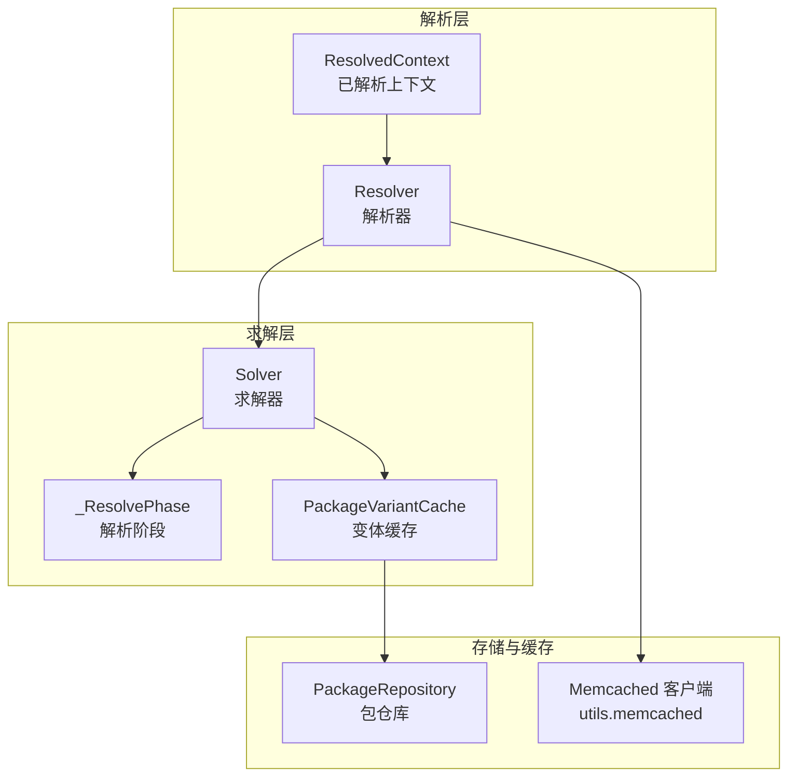
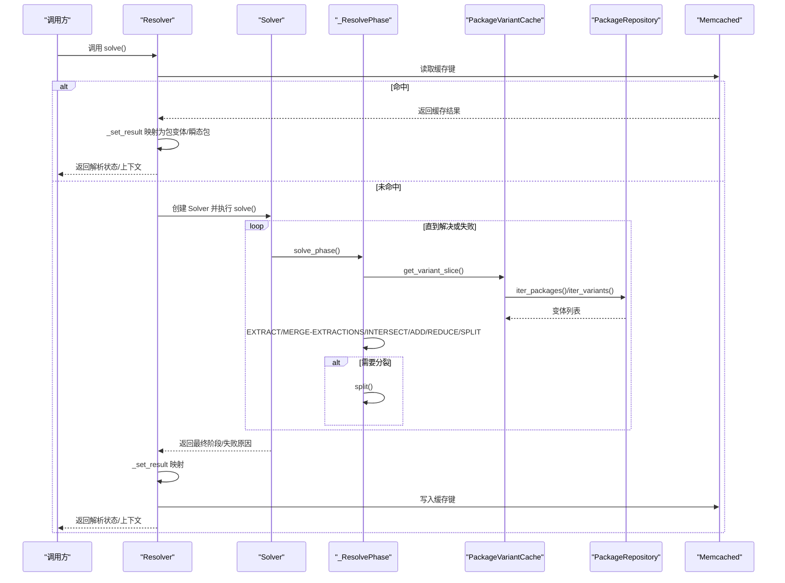
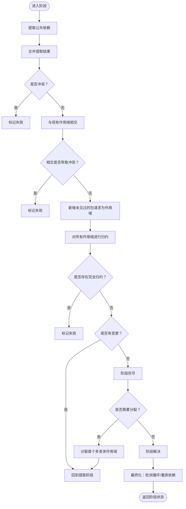
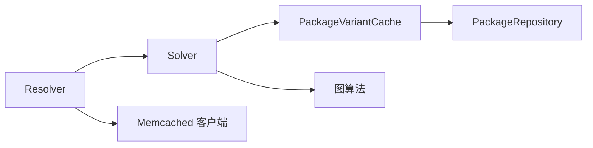

# 解析 (Resolve)

<cite>
**本文引用的文件**
- [resolver.py](file://rez-3.3.0/src/rez/resolver.py)
- [solver.py](file://rez-3.3.0/src/rez/solver.py)
- [memcached.py](file://rez-3.3.0/src/rez/utils/memcached.py)
- [package_repository.py](file://rez-3.3.0/src/rez/package_repository.py)
- [suite.py](file://rez-3.3.0/src/rez/suite.py)
- [resolved_context.py](file://rez-3.3.0/src/rez/resolved_context.py)
- [SOLVER.md](file://rez-3.3.0/src/rez/SOLVER.md)
- [variants.rst](file://rez-3.3.0/docs/source/variants.rst)
</cite>

## 目录
1. [引言](#引言)
2. [项目结构](#项目结构)
3. [核心组件](#核心组件)
4. [架构总览](#架构总览)
5. [详细组件分析](#详细组件分析)
6. [依赖分析](#依赖分析)
7. [性能考量](#性能考量)
8. [故障排查指南](#故障排查指南)
9. [结论](#结论)
10. [附录](#附录)

## 引言
本篇文档围绕 Rez 系统中的“解析”过程进行深入阐述，目标是帮助读者理解解析器如何根据用户请求的包及其依赖关系，计算出一组满足所有约束条件的具体包版本，并生成可复现、可诊断的解析上下文。我们将从输入与输出、算法流程、复杂依赖图与变体选择、失败原因与排查方法、以及性能优化策略等方面展开，重点基于 src/rez/resolver.py 与 src/rez/solver.py 的核心实现。

## 项目结构
与解析直接相关的模块主要位于 src/rez 下：
- 解析入口与上下文封装：resolver.py
- 核心求解算法：solver.py
- 缓存与连接池：utils/memcached.py
- 包仓库抽象与统计：package_repository.py
- 套件与已解析上下文：suite.py、resolved_context.py
- 算法说明文档：SOLVER.md
- 变体选择行为文档：variants.rst

图表来源
- [resolver.py](file://rez-3.3.0/src/rez/resolver.py#L114-L171)
- [solver.py](file://rez-3.3.0/src/rez/solver.py#L1883-L1977)
- [memcached.py](file://rez-3.3.0/src/rez/utils/memcached.py#L225-L246)
- [package_repository.py](file://rez-3.3.0/src/rez/package_repository.py#L1-L120)

章节来源
- [resolver.py](file://rez-3.3.0/src/rez/resolver.py#L114-L171)
- [solver.py](file://rez-3.3.0/src/rez/solver.py#L1883-L1977)

## 核心组件
- 解析器（Resolver）
  - 职责：整合缓存、回调、过滤器、排序器等，协调 Solver 执行；将 Solver 结果映射为具体包变体与“瞬态包”（ephemerals），并产出解析状态与图。
  - 关键属性：请求列表、包路径、时间戳、过滤器、排序器、构建/测试模式、缓存开关、打印级别等。
  - 关键方法：solve（带缓存）、_get_cached_solve/_set_cached_solve（memcached）、_solver_to_dict/_set_result（结果映射）。

- 求解器（Solver）
  - 职责：执行核心算法，维护“阶段栈”，推进 EXTRACT/MERGE-EXTRACTIONS/INTERSECT/ADD/REDUCE/SPLIT 循环，最终判定成功、失败或循环。
  - 关键数据：request_list、phase_stack、failed_phase_list、计时与统计、回调接口。

- 解析阶段（_ResolvePhase）
  - 职责：在单个阶段内反复尝试提取公共依赖、合并、相交、新增、归约，直至穷尽或需要分裂。

- 变体缓存（PackageVariantCache）
  - 职责：按需加载并缓存包变体，减少重复 IO；支持按范围交集筛选。

- 包仓库（PackageRepository）
  - 职责：抽象不同后端（文件系统/内存/数据库）的包发现与变体迭代；提供唯一标识用于缓存键。

- 缓存客户端（memcached）
  - 职责：统一连接池、键前缀、调试模式、统计与刷新；为解析提供持久化缓存能力。

章节来源
- [resolver.py](file://rez-3.3.0/src/rez/resolver.py#L32-L113)
- [resolver.py](file://rez-3.3.0/src/rez/resolver.py#L114-L171)
- [resolver.py](file://rez-3.3.0/src/rez/resolver.py#L397-L475)
- [solver.py](file://rez-3.3.0/src/rez/solver.py#L1883-L2399)
- [solver.py](file://rez-3.3.0/src/rez/solver.py#L1223-L1882)
- [solver.py](file://rez-3.3.0/src/rez/solver.py#L925-L954)
- [package_repository.py](file://rez-3.3.0/src/rez/package_repository.py#L1-L120)
- [memcached.py](file://rez-3.3.0/src/rez/utils/memcached.py#L225-L246)

## 架构总览
解析流程由 Resolver 驱动，内部委托 Solver 执行算法。Resolver 负责：
- 将请求列表合并为 RequirementList；
- 通过 PackageVariantCache 获取变体切片；
- 在 Solver 成功后，将变体句柄转换为具体 PackageVariant；
- 使用 memcached 进行缓存命中与失效策略；
- 生成解析图（包含提取、相交、归约、冲突、循环等信息）。

图表来源
- [resolver.py](file://rez-3.3.0/src/rez/resolver.py#L114-L171)
- [resolver.py](file://rez-3.3.0/src/rez/resolver.py#L397-L475)
- [solver.py](file://rez-3.3.0/src/rez/solver.py#L2094-L2399)
- [solver.py](file://rez-3.3.0/src/rez/solver.py#L1223-L1882)
- [solver.py](file://rez-3.3.0/src/rez/solver.py#L925-L954)
- [package_repository.py](file://rez-3.3.0/src/rez/package_repository.py#L140-L200)
- [memcached.py](file://rez-3.3.0/src/rez/utils/memcached.py#L225-L246)

## 详细组件分析

### 解析器（Resolver）工作流
- 输入
  - 请求列表：Requirement 对象列表（如 foo-1.2.3, bar>=2）。
  - 包路径：搜索包的目录列表。
  - 过滤器：PackageFilterList，可按时间规则等排除包。
  - 排序器：自定义包顺序函数，影响变体选择优先级。
  - 时间戳：用于缓存键与“锁定”解析。
  - 其他控制参数：构建模式、测试模式、缓存开关、打印级别等。

- 输出
  - 解析状态：ResolverStatus（pending/solved/failed/aborted）。
  - 已解析包：PackageVariant 列表。
  - 瞬态包（Ephemerals）：Requirement 列表。
  - 解析图：pygraph.digraph，展示提取、相交、归约、冲突、循环等。
  - 统计与耗时：solve_time/load_time。

- 缓存策略
  - 缓存键包含：请求字符串、仓库 UID、过滤器哈希、排序器哈希、构建/测试标志、裁剪失败图标志、可选时间戳。
  - 命中后直接映射为包变体；未命中则执行 Solver，并将结果写回缓存。
  - 支持“非时间戳”与“时间戳”两类缓存条目，依据包是否发布新版本、包状态是否变化决定复用或丢弃。

- 结果映射
  - 将 Solver 的变体句柄转换为具体 PackageVariant；
  - 将瞬态包（以点开头的包名）转换为 Requirement 列表。

章节来源
- [resolver.py](file://rez-3.3.0/src/rez/resolver.py#L32-L113)
- [resolver.py](file://rez-3.3.0/src/rez/resolver.py#L114-L171)
- [resolver.py](file://rez-3.3.0/src/rez/resolver.py#L175-L320)
- [resolver.py](file://rez-3.3.0/src/rez/resolver.py#L321-L374)
- [resolver.py](file://rez-3.3.0/src/rez/resolver.py#L375-L396)
- [resolver.py](file://rez-3.3.0/src/rez/resolver.py#L397-L475)

### 求解器（Solver）算法
- 阶段栈（phase_stack）
  - 采用显式栈管理“阶段”，每个阶段包含若干“作用域”（scope），代表一个包请求及其可能的变体集合。
  - solve_step 中，若阶段被判定为 exhausted，则进行 split 分裂，产生两个新阶段；若 solved 则进入 finalise 阶段，检查循环并重排依赖顺序。

- 解析阶段（_ResolvePhase.solve）
  - EXTRACT：对每个 scope 提取公共依赖，得到新的 Requirement 列表。
  - MERGE-EXTRACTIONS：合并提取结果，若出现冲突则失败。
  - INTERSECT：将提取结果与现有 scope 相交，可能缩小范围或导致冲突。
  - ADD：若提取出新的包请求（不在当前 scope 中），创建新 scope 加入。
  - REDUCE：对 scope 进行归约，移除与其它 scope 冲突的变体；若某 scope 完全被归约为空，则失败。
  - SPLIT：当阶段穷尽且仍有多个变体的 scope，选择第一个多变体 scope 进行分裂，保证后续能继续提取。

- 失败与图生成
  - failure_reason 记录失败类型（DependencyConflicts、TotalReduction、Cycle）。
  - get_graph/finalise 生成解析图，标注提取、相交、归约、冲突、循环边，支持裁剪无关节点。

图表来源
- [solver.py](file://rez-3.3.0/src/rez/solver.py#L1223-L1882)
- [SOLVER.md](file://rez-3.3.0/src/rez/SOLVER.md#L1-L146)

章节来源
- [solver.py](file://rez-3.3.0/src/rez/solver.py#L1223-L1882)
- [solver.py](file://rez-3.3.0/src/rez/solver.py#L1883-L2399)
- [SOLVER.md](file://rez-3.3.0/src/rez/SOLVER.md#L1-L146)

### 变体选择与排序
- 变体排序规则
  - version_priority：优先满足请求列表中的包，其次尽量选择更高版本，再考虑额外包数量与名称字典序。
  - intersection_priority：优先共享更多请求包，再按 version_priority 排序。
- 变体选择模式受配置项影响，可通过 package_orderers 自定义排序键。

章节来源
- [solver.py](file://rez-3.3.0/src/rez/solver.py#L418-L459)
- [variants.rst](file://rez-3.3.0/docs/source/variants.rst#L135-L192)

### 缓存与性能
- 缓存键构成
  - 请求字符串、仓库 UID、过滤器哈希、排序器哈希、构建/测试标志、裁剪失败图标志、可选时间戳。
- 命中策略
  - 若存在时间戳：优先尝试“非时间戳”缓存；若包状态变化或有新版本发布则丢弃；否则复用；否则尝试“时间戳”缓存。
  - 若无时间戳：仅使用“非时间戳”缓存。
- 写入策略
  - 仅在解析成功时写入；记录各包最新发布时间与变体状态句柄，用于后续命中校验。
- 连接池
  - 通过上下文管理器与线程局部实例管理，避免频繁连接/断开。

章节来源
- [resolver.py](file://rez-3.3.0/src/rez/resolver.py#L175-L320)
- [resolver.py](file://rez-3.3.0/src/rez/resolver.py#L321-L374)
- [resolver.py](file://rez-3.3.0/src/rez/resolver.py#L375-L396)
- [memcached.py](file://rez-3.3.0/src/rez/utils/memcached.py#L225-L246)

### 套件与已解析上下文
- 套件（Suite）：管理多个已解析上下文，提供工具包装脚本与别名、前缀/后缀等，便于批量环境切换。
- 已解析上下文（ResolvedContext）：承载一次解析的结果，包含解析状态、包列表、瞬态包、解析图、统计信息等；可作为 Resolver 的上下文传入。

章节来源
- [suite.py](file://rez-3.3.0/src/rez/suite.py#L1-L200)
- [resolved_context.py](file://rez-3.3.0/src/rez/resolved_context.py#L272-L308)

## 依赖分析
- 组件耦合
  - Resolver 依赖 Solver、PackageVariantCache、PackageRepository、memcached 客户端。
  - Solver 依赖 PackageVariantCache、PackageRepository、图算法库、回调接口。
  - PackageVariantCache 依赖 iter_packages/iter_variants，间接依赖 PackageRepository。
- 外部依赖
  - 图算法（cycles/accessibility）用于检测循环与可达性。
  - memcached 客户端用于分布式缓存。
  - 包仓库插件体系（filesystem/memory 等）。

图表来源
- [resolver.py](file://rez-3.3.0/src/rez/resolver.py#L397-L475)
- [solver.py](file://rez-3.3.0/src/rez/solver.py#L1883-L1977)
- [solver.py](file://rez-3.3.0/src/rez/solver.py#L925-L954)
- [package_repository.py](file://rez-3.3.0/src/rez/package_repository.py#L1-L120)
- [memcached.py](file://rez-3.3.0/src/rez/utils/memcached.py#L225-L246)

章节来源
- [resolver.py](file://rez-3.3.0/src/rez/resolver.py#L397-L475)
- [solver.py](file://rez-3.3.0/src/rez/solver.py#L1883-L1977)
- [solver.py](file://rez-3.3.0/src/rez/solver.py#L925-L954)

## 性能考量
- 使用缓存
  - 启用 resolve_caching 并配置 memcached_uri，可显著降低重复解析成本。
  - 合理设置时间戳可复用“非时间戳”缓存，避免频繁失效。
- 预热缓存
  - 通过 CLI 或工具预热可见包，减少首次解析的 IO。
- 控制请求规模
  - 合并冗余请求，减少作用域数量；利用包过滤器缩小搜索空间。
- 变体选择优化
  - 选择合适的 variant_select_mode，减少不必要的变体加载与比较。
- 统计与监控
  - 开启 print_stats 或 verbosity，观察提取/相交/归约次数与耗时，定位瓶颈。

章节来源
- [resolver.py](file://rez-3.3.0/src/rez/resolver.py#L114-L171)
- [resolver.py](file://rez-3.3.0/src/rez/resolver.py#L321-L374)
- [solver.py](file://rez-3.3.0/src/rez/solver.py#L2125-L2160)
- [memcached.py](file://rez-3.3.0/src/rez/utils/memcached.py#L225-L246)

## 故障排查指南
- 常见失败类型
  - 依赖冲突（DependencyConflicts）：提取结果与现有作用域冲突，或请求本身冲突。
  - 归约致空（TotalReduction）：某作用域被其它作用域归约至空。
  - 循环依赖（Cycle）：检测到包之间的循环引用。
  - 包缺失（PackageFamilyNotFoundError）：提取的新包请求找不到对应家族。
- 定位手段
  - 查看 failure_reason 与 involved_requirements，确定冲突涉及的包与范围。
  - 使用 get_graph/get_fail_graph 获取失败图，结合“裁剪失败图”选项聚焦关键节点。
  - 通过 print_stats 与 verbosity 观察各阶段耗时与次数。
- 排查步骤
  - 检查请求列表是否自相矛盾（如 foo-1 与 !foo）。
  - 检查包过滤器是否误排除了必要包。
  - 检查包仓库路径与权限，确认包可被正确发现与加载。
  - 临时关闭缓存或刷新缓存，排除缓存一致性问题。
  - 使用更严格的日志级别与统计输出，定位瓶颈阶段。

章节来源
- [solver.py](file://rez-3.3.0/src/rez/solver.py#L1883-L2399)
- [solver.py](file://rez-3.3.0/src/rez/solver.py#L1600-L1826)
- [solver.py](file://rez-3.3.0/src/rez/solver.py#L2125-L2160)

## 结论
Rez 的解析过程通过“阶段栈 + 五步法”的组合，实现了对复杂依赖图的高效求解。Resolver 负责将高层请求转化为可执行的 Solver 阶段，并通过缓存与统计提升性能与可观测性；Solver 则在阶段内反复执行 EXTRACT/MERGE-EXTRACTIONS/INTERSECT/ADD/REDUCE/SPLIT，直到穷尽或失败。借助解析图与失败原因，用户可以快速定位版本冲突、循环依赖与包缺失等问题，并通过缓存、预热与排序策略优化解析性能。

## 附录
- 相关文档
  - 算法说明：SOLVER.md
  - 变体选择行为：variants.rst
- 常用命令
  - memcache 管理：flush/stats/reset-stats/poll/warm
  - 解析统计：print_stats/verbosity

章节来源
- [SOLVER.md](file://rez-3.3.0/src/rez/SOLVER.md#L1-L146)
- [variants.rst](file://rez-3.3.0/docs/source/variants.rst#L135-L192)
- [memcached.py](file://rez-3.3.0/src/rez/utils/memcached.py#L1-L120)