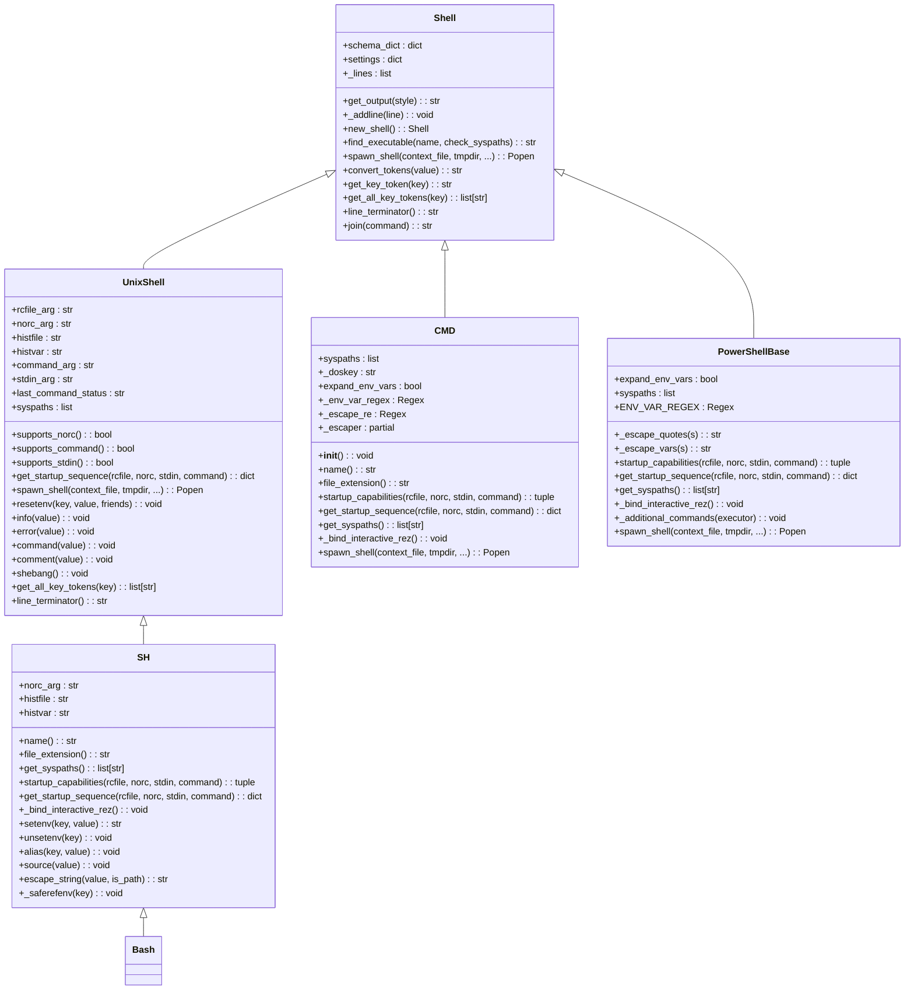
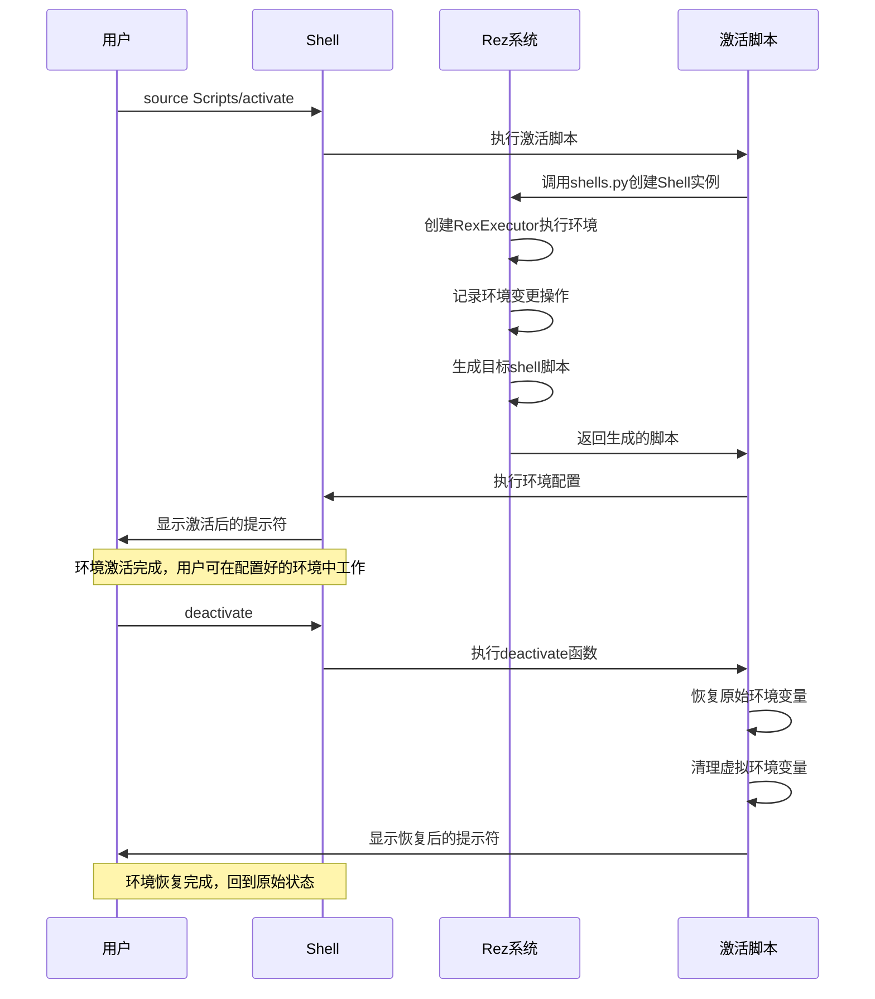
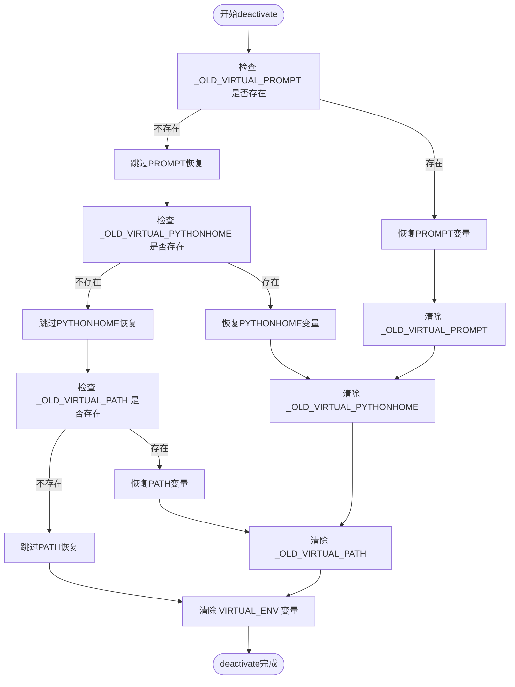

# 环境激活

<cite>
**本文档中引用的文件**  
- [Activate.ps1](file://Scripts/Activate.ps1)
- [activate](file://Scripts/activate)
- [activate.bat](file://Scripts/activate.bat)
- [deactivate.bat](file://Scripts/deactivate.bat)
- [complete.sh](file://completion/complete.sh)
- [shells.py](file://rez-3.3.0/src/rez/shells.py)
- [bash.py](file://rez-3.3.0/src/rezplugins/shell/bash.py)
- [cmd.py](file://rez-3.3.0/src/rezplugins/shell/cmd.py)
- [powershell.py](file://rez-3.3.0/src/rezplugins/shell/powershell.py)
- [_utils\powershell_base.py](file://rez-3.3.0/src/rezplugins/shell/_utils/powershell_base.py)
- [sh.py](file://rez-3.3.0/src/rezplugins/shell/sh.py)
</cite>

## 目录
1. [简介](#简介)
2. [激活脚本实现原理](#激活脚本实现原理)
3. [不同操作系统的激活机制差异](#不同操作系统的激活机制差异)
4. [deactivate.bat的环境恢复机制](#deactivatebat的环境恢复机制)
5. [命令自动补全集成](#命令自动补全集成)
6. [激活失败排查指南](#激活失败排查指南)
7. [企业级部署最佳实践](#企业级部署最佳实践)

## 简介
Rez环境激活系统通过一系列脚本和Python模块实现跨平台的环境管理。该系统允许用户在不同的shell环境中激活特定的软件包配置，通过修改环境变量和shell上下文来确保正确的工具和库版本被使用。核心机制涉及Activate.ps1（PowerShell）、activate（Unix shell）和activate.bat（Windows CMD）等脚本，这些脚本协同工作以提供一致的用户体验。

## 激活脚本实现原理
Rez的环境激活机制通过shells.py模块和shell插件系统实现。核心类Shell作为基类，定义了所有shell类型的基本行为，包括环境变量管理、命令执行和脚本生成。UnixShell类继承自Shell，为类Unix系统提供通用功能。

激活过程的核心是RexExecutor，它收集所有需要执行的环境修改操作，并将其编译成目标shell的脚本。当用户运行激活命令时，系统会创建一个Shell实例，通过该实例的API记录所有环境变更操作，然后生成相应的shell脚本并执行。



**图示来源**
- [shells.py](file://rez-3.3.0/src/rez/shells.py#L64-L553)
- [cmd.py](file://rez-3.3.0/src/rezplugins/shell/cmd.py#L21-L340)
- [powershell_base.py](file://rez-3.3.0/src/rezplugins/shell/_utils/powershell_base.py#L18-L339)
- [sh.py](file://rez-3.3.0/src/rezplugins/shell/sh.py#L19-L149)

**本节来源**
- [shells.py](file://rez-3.3.0/src/rez/shells.py#L1-L553)

## 不同操作系统的激活机制差异
Rez系统针对不同操作系统和shell环境提供了专门的激活机制。Windows系统主要使用PowerShell和CMD，而Linux/macOS系统则使用各种Unix shell。

### Windows激活机制
在Windows系统中，PowerShell和CMD使用不同的脚本格式和语法。PowerShell脚本（.ps1）使用PowerShell特有的语法，如`$env:PATH`来访问环境变量，而CMD批处理文件（.bat）使用`%PATH%`语法。

PowerShell的Activate.ps1脚本通过定义deactivate函数来管理环境状态，该函数在激活新环境前会先停用任何现有的虚拟环境。脚本使用`$env:VIRTUAL_ENV`变量来存储当前环境路径，并通过修改`$env:PATH`来优先使用虚拟环境中的可执行文件。

CMD的activate.bat脚本则使用批处理语法，通过`set`命令修改环境变量。它会保存原始的PROMPT和PATH变量，并在激活时设置新的PROMPT前缀和更新后的PATH。

### Unix系统激活机制
在Unix系统中，activate脚本使用shell脚本语法，兼容bash、zsh等shell。脚本通过`source`命令执行，这使得环境变量的更改在当前shell会话中生效。

Unix激活脚本的关键特点是使用`hash -r`命令来清除shell的命令缓存，确保PATH的更改立即生效。这对于确保使用正确的可执行文件版本至关重要。



**图示来源**
- [Activate.ps1](file://Scripts/Activate.ps1#L1-L438)
- [activate](file://Scripts/activate#L1-L67)
- [activate.bat](file://Scripts/activate.bat#L1-L34)
- [shells.py](file://rez-3.3.0/src/rez/shells.py#L1-L553)

**本节来源**
- [Activate.ps1](file://Scripts/Activate.ps1#L1-L438)
- [activate](file://Scripts/activate#L1-L67)
- [activate.bat](file://Scripts/activate.bat#L1-L34)

## deactivate.bat的环境恢复机制
deactivate.bat脚本负责恢复激活前的原始环境状态。其核心机制是保存和恢复关键环境变量，确保系统回到激活前的状态。

脚本通过检查和恢复以下环境变量来实现环境恢复：
- `_OLD_VIRTUAL_PROMPT`：恢复原始的命令提示符
- `_OLD_VIRTUAL_PYTHONHOME`：恢复原始的PYTHONHOME设置
- `_OLD_VIRTUAL_PATH`：恢复原始的PATH环境变量
- `VIRTUAL_ENV`：清除虚拟环境标识

恢复过程是原子性的，确保所有环境变量都被正确恢复。脚本首先检查这些"OLD"变量是否存在，如果存在则将其值复制回相应的环境变量，然后清除这些临时变量。



**图示来源**
- [deactivate.bat](file://Scripts/deactivate.bat#L1-L22)
- [Activate.ps1](file://Scripts/Activate.ps1#L73-L108)

**本节来源**
- [deactivate.bat](file://Scripts/deactivate.bat#L1-L22)

## 命令自动补全集成
Rez系统通过complete.sh脚本实现命令行自动补全功能。该功能在环境激活时自动集成到用户的shell环境中，提供对Rez命令的智能补全支持。

自动补全的集成机制如下：
1. 在shell激活过程中，系统会调用`_bind_interactive_rez()`方法
2. 该方法会source complete.sh脚本，将其加载到当前shell会话中
3. complete.sh定义了_rez_complete_fn函数，该函数调用_rez-complete工具获取补全建议
4. 使用`complete`命令将_rez_complete_fn函数绑定到各个Rez命令

```mermaid
flowchart LR
A[激活环境] --> B[调用 _bind_interactive_rez()]
B --> C[source complete.sh]
C --> D[定义 _rez_complete_fn 函数]
D --> E[绑定补全函数到Rez命令]
E --> F[用户输入命令时自动补全]
subgraph complete.sh
D --> G["COMPREPLY=($(COMP_LINE=${COMP_LINE} COMP_POINT=${COMP_POINT} _rez-complete))"]
G --> H[返回补全建议]
end
F --> I[显示补全选项]
```

**图示来源**
- [complete.sh](file://completion/complete.sh#L1-L22)
- [bash.py](file://rez-3.3.0/src/rezplugins/shell/bash.py#L87-L90)

**本节来源**
- [complete.sh](file://completion/complete.sh#L1-L22)

## 激活失败排查指南
环境激活可能因多种原因失败，以下是常见问题及其解决方案：

### PATH污染问题
当PATH环境变量过长或包含冲突路径时，可能导致激活失败。解决方案包括：
- 检查PATH长度，避免超过系统限制
- 移除重复或无效的路径条目
- 确保关键路径（如Python安装路径）在PATH中的正确位置

### 权限问题
在某些系统上，脚本执行可能受权限限制。解决方案包括：
- 确保脚本具有执行权限（Unix系统：chmod +x）
- 在Windows上以管理员权限运行或调整执行策略

### 脚本执行策略限制
Windows PowerShell有严格的执行策略，默认可能阻止脚本运行。解决方案：
- 临时设置执行策略：`Set-ExecutionPolicy -ExecutionPolicy RemoteSigned -Scope CurrentUser`
- 使用管理员权限运行PowerShell
- 数字签名脚本以符合组织安全策略

### 其他常见问题
- **编码问题**：确保脚本文件使用正确的编码（如UTF-8）
- **路径格式**：注意Windows和Unix路径分隔符的差异
- **shell兼容性**：确保使用的shell与激活脚本兼容
- **环境变量冲突**：检查是否存在与Rez环境变量冲突的自定义变量

**本节来源**
- [Activate.ps1](file://Scripts/Activate.ps1#L40-L48)
- [activate.bat](file://Scripts/activate.bat#L3-L9)
- [shells.py](file://rez-3.3.0/src/rez/shells.py#L1-L553)

## 企业级部署最佳实践
在企业环境中部署Rez环境激活系统时，应遵循以下最佳实践：

### 标准化部署流程
- 建立统一的环境激活脚本模板
- 使用版本控制系统管理脚本变更
- 实施自动化测试验证激活功能

### 安全性考虑
- 对所有脚本进行数字签名
- 实施最小权限原则
- 定期审计脚本内容和执行日志
- 使用安全的传输方式分发脚本

### 性能优化
- 最小化激活脚本的执行时间
- 缓存常用环境配置
- 优化PATH变量，减少搜索时间
- 使用异步加载非关键组件

### 用户体验
- 提供清晰的激活/停用状态提示
- 实现快速的环境切换功能
- 提供详细的错误信息和帮助文档
- 支持多种shell和操作系统

### 监控和维护
- 记录环境激活事件
- 监控激活成功率和性能指标
- 建立快速响应机制处理激活问题
- 定期更新和维护脚本库

**本节来源**
- [shells.py](file://rez-3.3.0/src/rez/shells.py#L1-L553)
- [Activate.ps1](file://Scripts/Activate.ps1#L1-L438)
- [activate](file://Scripts/activate#L1-L67)