# 环境管理

<cite>
**本文档中引用的文件**  
- [Activate.ps1](file://Scripts/Activate.ps1)
- [activate](file://Scripts/activate)
- [activate.bat](file://Scripts/activate.bat)
- [deactivate.bat](file://Scripts/deactivate.bat)
- [complete.sh](file://completion/complete.sh)
- [complete.zsh](file://completion/complete.zsh)
- [package.py](file://my_packages/myapp/1.0.0/package.py)
- [resolved_context.py](file://rez-3.3.0/src/rez/resolved_context.py)
</cite>

## 目录
1. [简介](#简介)
2. [开发环境创建与激活](#开发环境创建与激活)
3. [上下文解析过程](#上下文解析过程)
4. [环境变量与路径配置](#环境变量与路径配置)
5. [Shell集成与自动补全](#shell集成与自动补全)
6. [环境管理最佳实践](#环境管理最佳实践)
7. [结论](#结论)

## 简介
Rez环境管理系统提供了一套完整的开发环境隔离与管理解决方案。该系统通过脚本激活、上下文解析和环境变量管理等机制，实现了跨平台的开发环境一致性。本文档详细阐述了环境创建、激活、配置和管理的完整流程，重点关注核心组件的实现原理和最佳实践。

## 开发环境创建与激活

Rez系统通过多种脚本支持不同操作系统的环境激活，确保开发环境的一致性和可移植性。系统提供了针对PowerShell、Bash和Windows命令行的专用激活脚本，这些脚本共同实现了环境隔离的核心功能。

### PowerShell环境激活

`Activate.ps1`脚本是PowerShell环境的激活入口，它通过修改环境变量和命令提示符来标识当前激活的虚拟环境。该脚本首先定义了`deactivate`函数，用于恢复原始环境状态，包括还原`PATH`、`PYTHONHOME`等关键环境变量。激活过程中，脚本会读取`pyvenv.cfg`配置文件，获取环境配置信息，并根据命令行参数或配置文件设置环境提示符。

激活流程包括：确定脚本所在目录，读取虚拟环境配置，设置环境提示符，停用当前可能存在的虚拟环境，设置`VIRTUAL_ENV`环境变量，更新命令提示符以显示当前环境名称，清除`PYTHONHOME`变量，并将虚拟环境的执行路径添加到`PATH`环境变量的开头。

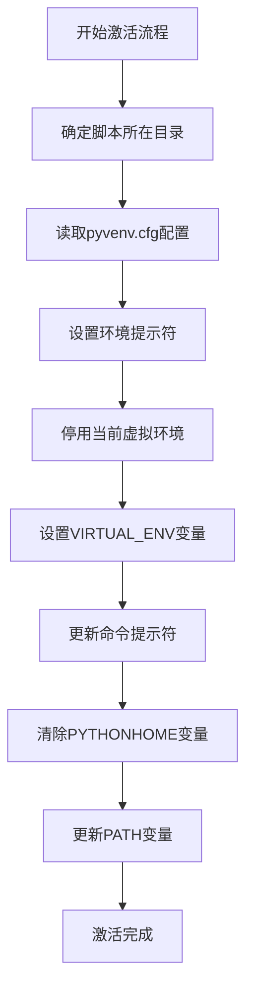

**Diagram sources**
- [Activate.ps1](file://Scripts/Activate.ps1#L164-L242)

**Section sources**
- [Activate.ps1](file://Scripts/Activate.ps1#L1-L438)

### Bash环境激活

`activate`脚本为Bash shell提供了环境激活功能。与PowerShell脚本类似，它也定义了`deactivate`函数来恢复环境状态。该脚本通过`source`命令加载，不能直接执行。激活过程中，脚本会设置`VIRTUAL_ENV`环境变量，保存原始`PATH`值到`_OLD_VIRTUAL_PATH`，将虚拟环境的脚本目录添加到`PATH`开头，并根据需要更新命令提示符。

脚本特别处理了Bash和Zsh shell的哈希命令，通过调用`hash -r`命令让shell重新识别可执行文件的位置变化。这种设计确保了环境变量更改后，shell能够正确找到新路径下的可执行文件。

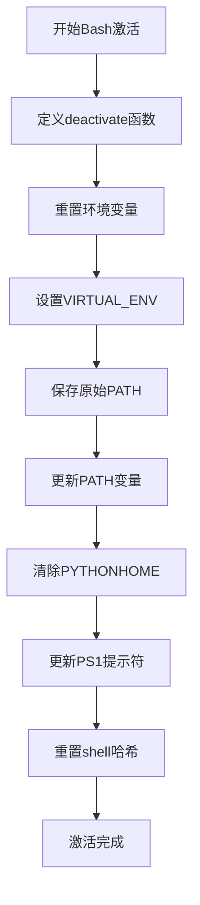

**Diagram sources**
- [activate](file://Scripts/activate#L1-L67)

**Section sources**
- [activate](file://Scripts/activate#L1-L67)

### Windows命令行激活

`activate.bat`批处理文件为Windows命令行环境提供了激活支持。该脚本首先处理代码页问题，确保UTF-8编码的正确显示。激活过程中，脚本会设置`VIRTUAL_ENV`变量，保存原始提示符到`_OLD_VIRTUAL_PROMPT`，更新提示符以显示环境名称，清除`PYTHONHOME`变量，并将虚拟环境的脚本目录添加到`PATH`环境变量中。

脚本还特别处理了代码页的恢复，在脚本执行结束后将代码页恢复到原始状态，确保系统环境的一致性。这种设计考虑到了Windows环境下字符编码的复杂性，提供了更好的用户体验。

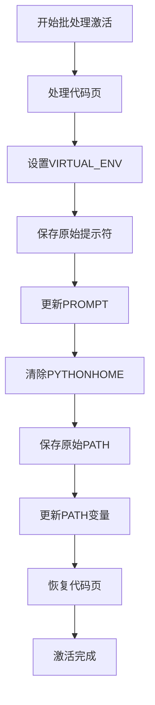

**Diagram sources**
- [activate.bat](file://Scripts/activate.bat#L1-L34)

**Section sources**
- [activate.bat](file://Scripts/activate.bat#L1-L34)

## 上下文解析过程

Rez系统的上下文解析是环境管理的核心机制，它通过解析包定义文件中的命令来构建最终的运行时环境。这一过程在`resolved_context.py`文件中实现，负责将包依赖关系转换为具体的环境配置操作。

### 包命令执行机制

包的环境配置通过`package.py`文件中的`commands()`函数定义。当解析上下文时，系统会执行这些命令来配置环境变量。例如，在`myapp`包中，`commands()`函数设置了`MYAPP_ROOT`环境变量，并将包的`bin`和`lib`目录添加到`PATH`和`PYTHONPATH`中。

环境变量的配置遵循特定的语法模式：`env.VARIABLE_NAME`用于访问环境变量，`append()`方法将值添加到变量末尾，`prepend()`方法将值添加到变量开头。系统还支持变量扩展，允许在值中引用其他环境变量，如`{root}`会被替换为包的根目录。

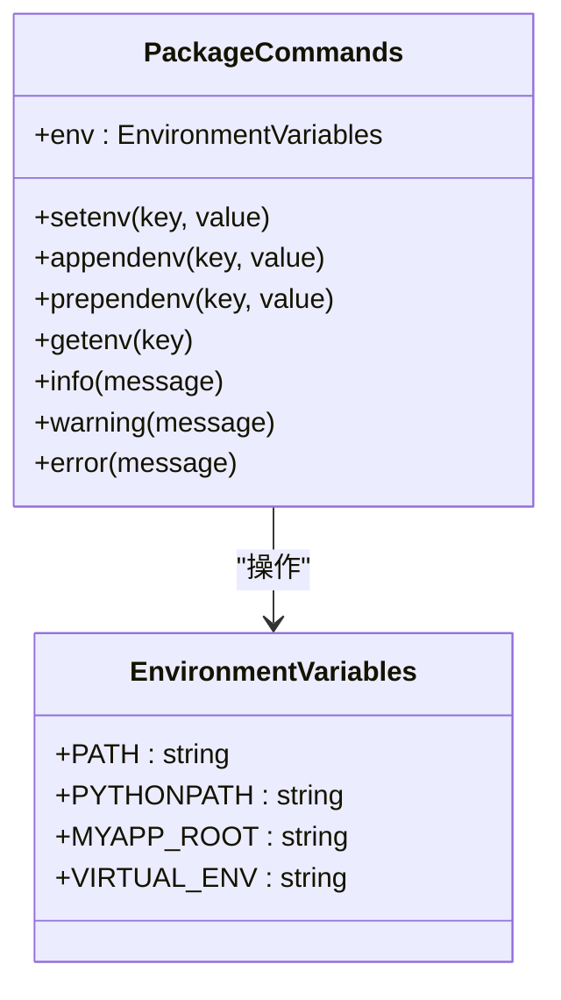

**Diagram sources**
- [package.py](file://my_packages/myapp/1.0.0/package.py#L17-L23)
- [resolved_context.py](file://rez-3.3.0/src/rez/resolved_context.py)

**Section sources**
- [package.py](file://my_packages/myapp/1.0.0/package.py#L1-L33)

### 环境变量操作类型

Rez系统支持多种环境变量操作类型，每种操作都有特定的语义和用途。`Setenv`操作用于设置环境变量的值，如果变量已存在则会被覆盖。`Appendenv`操作将值添加到现有变量值的末尾，使用平台特定的分隔符（如Windows的分号，Linux的冒号）。`Prependenv`操作将值添加到现有变量值的开头。

系统还支持自定义环境变量分隔符，允许为特定变量配置不同的分隔符。例如，可以为`FOO`变量配置逗号分隔符，为`BAH`变量配置空格分隔符。这种灵活性使得系统能够适应各种特殊需求的环境配置。

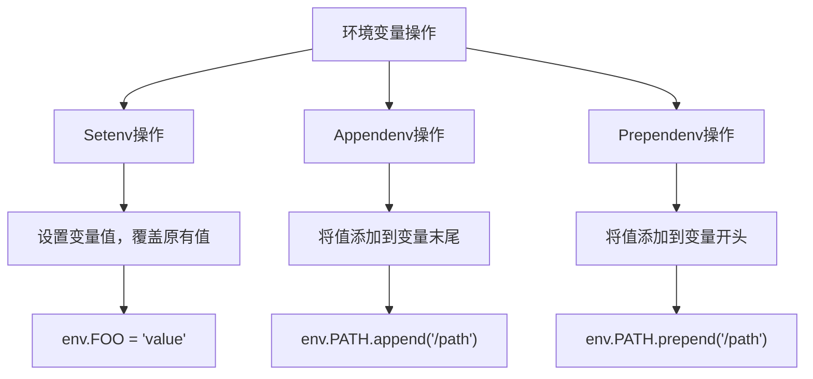

**Diagram sources**
- [resolved_context.py](file://rez-3.3.0/src/rez/resolved_context.py)
- [test_rex.py](file://rez-3.3.0/src/rez/tests/test_rex.py#L104-L150)

**Section sources**
- [resolved_context.py](file://rez-3.3.0/src/rez/resolved_context.py)

## 环境变量与路径配置

Rez系统的环境变量管理机制设计精巧，能够处理复杂的环境配置需求。系统通过一系列策略确保环境变量的正确设置和继承，同时避免常见的配置问题。

### 父环境变量继承

系统支持父环境变量的继承机制，允许新环境继承父shell中的特定环境变量。当配置`parent_variables`时，系统会在设置新变量前先检查父环境中是否存在同名变量。如果存在，则将其值作为新变量的初始值；如果不存在，则从空值开始。

这种机制特别适用于路径类变量（如`PATH`、`PYTHONPATH`），确保新环境既能包含所需的工具路径，又能保留用户自定义的路径设置。系统通过`_OLD_VIRTUAL_PATH`等临时变量保存原始值，为环境的正确恢复提供保障。

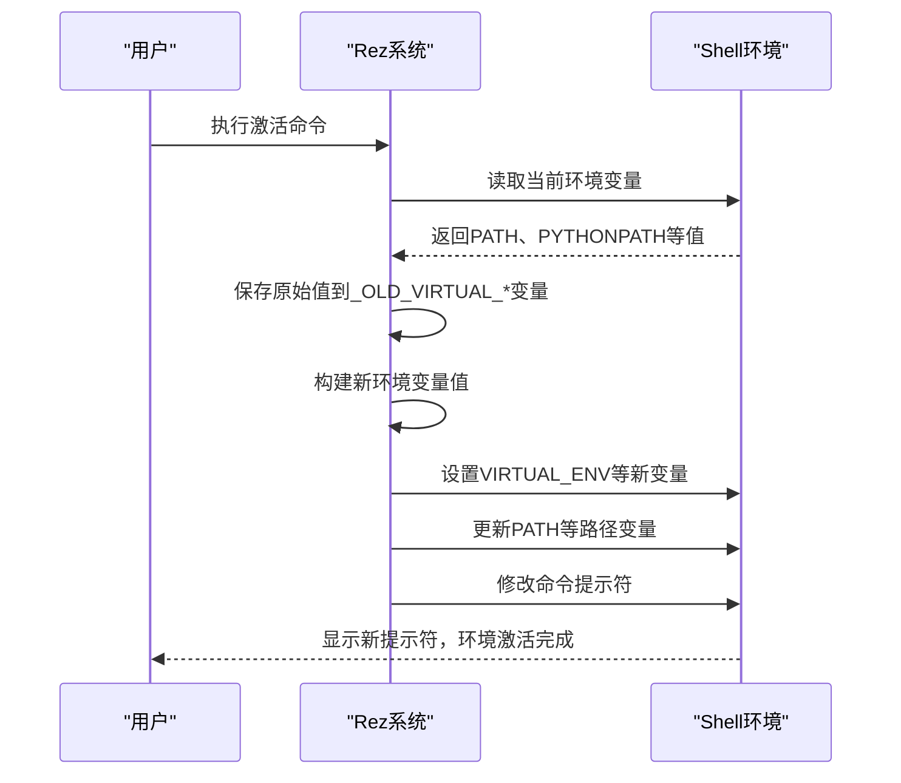

**Diagram sources**
- [Activate.ps1](file://Scripts/Activate.ps1#L73-L107)
- [activate](file://Scripts/activate#L4-L35)

**Section sources**
- [Activate.ps1](file://Scripts/Activate.ps1#L1-L438)
- [activate](file://Scripts/activate#L1-L67)

### 路径规范化处理

针对跨平台开发中的路径问题，Rez系统实现了路径规范化机制。特别是在Windows系统上使用Git Bash等非原生shell时，路径格式的差异可能导致环境配置失败。系统通过`pathed_env_vars`和`shell_pathed_env_vars`配置，区分平台特定路径和shell特定路径。

对于平台特定路径，系统使用标准的平台路径分隔符和格式；对于shell特定路径，则根据shell类型进行相应转换。例如，在Git Bash中，Windows路径会被转换为Unix风格路径（如`C:\path`转换为`/c/path`）。这种设计确保了环境配置在不同shell环境下的兼容性。

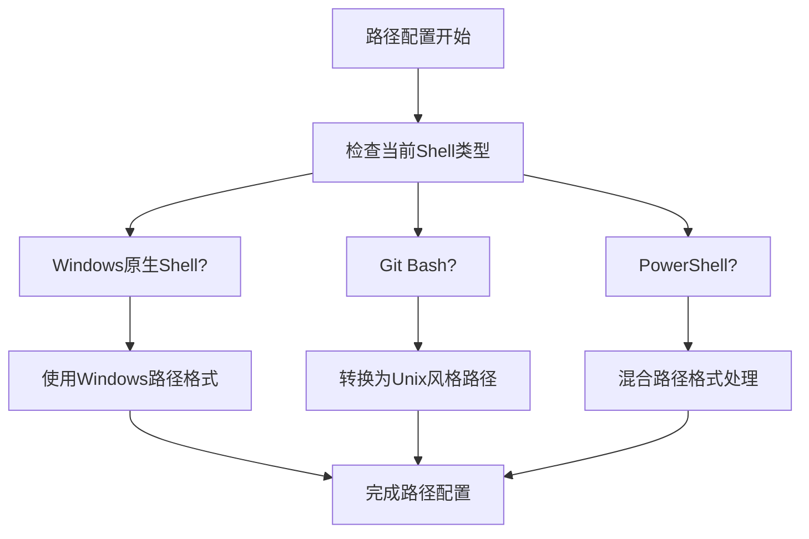

**Diagram sources**
- [shells.py](file://rez-3.3.0/src/rez/rezplugins/shell/__init__.py)
- [meeting-notes](file://rez-3.3.0/ASWF/TSC/meeting-notes/2022-11-17.md#L85-L461)

**Section sources**
- [meeting-notes](file://rez-3.3.0/ASWF/TSC/meeting-notes/2022-11-17.md#L85-L461)

## Shell集成与自动补全

Rez系统提供了完善的Shell集成功能，包括命令行自动补全，极大地提升了用户体验和工作效率。

### Bash自动补全

`complete.sh`脚本为Bash shell提供了Rez命令的自动补全功能。该脚本定义了`_rez_complete_fn`函数，通过调用`_rez-complete`工具获取补全建议。脚本为所有Rez相关命令（如`rez`、`rezolve`、`rez-build`等）注册了补全函数，确保在输入命令时能够获得智能提示。

补全机制通过环境变量`COMP_LINE`和`COMP_POINT`获取当前命令行内容和光标位置，然后调用后端工具生成补全建议。这种设计使得补全功能能够理解复杂的命令语法，提供精确的补全选项。

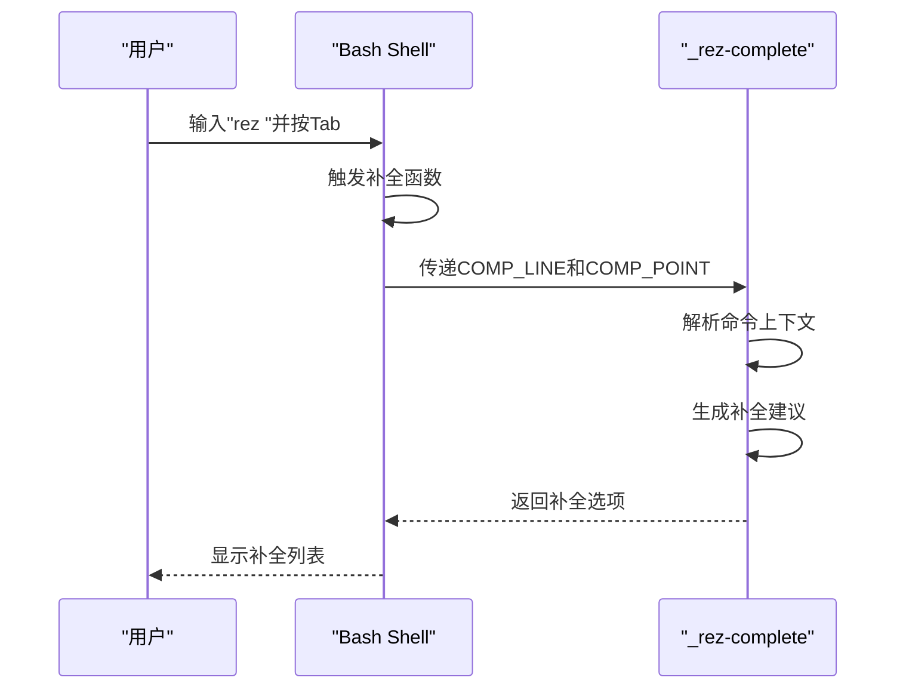

**Diagram sources**
- [complete.sh](file://completion/complete.sh#L1-L22)

**Section sources**
- [complete.sh](file://completion/complete.sh#L1-L22)

### Zsh自动补全

`complete.zsh`脚本为Zsh shell提供了类似的自动补全功能。与Bash使用`complete`命令不同，Zsh使用`compctl`命令来注册补全函数。脚本结构与Bash版本相似，同样定义了`_rez_complete_fn`函数并通过`_rez-complete`工具获取补全建议。

Zsh的补全系统更为强大，支持更复杂的补全逻辑和样式。Rez的Zsh补全脚本充分利用了这一优势，提供了更丰富的补全体验，包括参数描述、选项分组等功能。

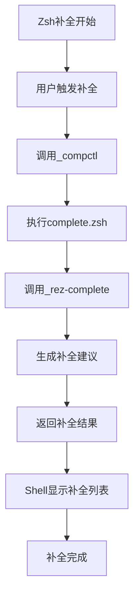

**Diagram sources**
- [complete.zsh](file://completion/complete.zsh#L1-L22)

**Section sources**
- [complete.zsh](file://completion/complete.zsh#L1-L22)

## 环境管理最佳实践

有效的环境管理需要遵循一系列最佳实践，以确保环境的稳定性、可维护性和可共享性。

### 环境共享策略

环境共享是团队协作的关键。Rez系统通过`.rxt`文件格式实现了环境的序列化和共享。这些文件包含了完整的环境解析信息，包括请求的包、解析结果、创建者信息和时间戳。团队成员可以通过共享`.rxt`文件确保所有人使用完全相同的环境配置。

为了有效共享环境，建议定期创建和版本化环境快照，特别是在项目里程碑或发布版本时。同时，应避免在共享环境中包含临时或个人特定的配置，确保环境的通用性和可移植性。

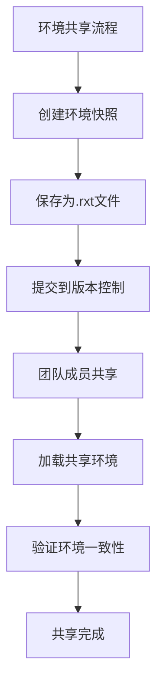

**Diagram sources**
- [context.rst](file://rez-3.3.0/docs/source/context.rst#L83-L111)

**Section sources**
- [context.rst](file://rez-3.3.0/docs/source/context.rst#L83-L111)

### 环境持久化与清理

环境持久化策略应平衡稳定性和灵活性。建议为长期项目创建稳定的环境配置，同时为实验性工作保留临时环境。可以使用环境命名约定来区分不同类型的环境，如`project-stable`、`project-experimental`等。

环境清理同样重要。应定期审查和清理不再使用的环境，避免磁盘空间浪费。对于临时环境，建议在使用后立即清理；对于长期环境，应建立定期审查机制，确保环境配置的时效性和安全性。

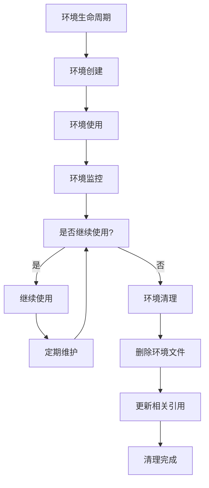

**Section sources**
- [resolved_context.py](file://rez-3.3.0/src/rez/resolved_context.py)
- [meeting-notes](file://rez-3.3.0/ASWF/TSC/meeting-notes/2023-01-19.md#L360-L400)

## 结论
Rez环境管理系统通过精心设计的脚本、上下文解析机制和环境管理策略，提供了一套完整的开发环境解决方案。系统支持多种Shell环境，实现了跨平台的环境一致性，并通过自动补全等功能提升了用户体验。遵循最佳实践，可以有效管理环境的创建、共享、持久化和清理，确保开发环境的稳定性和可维护性。