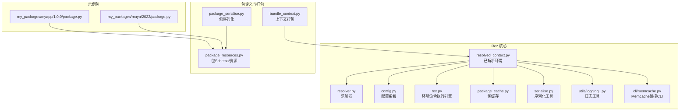
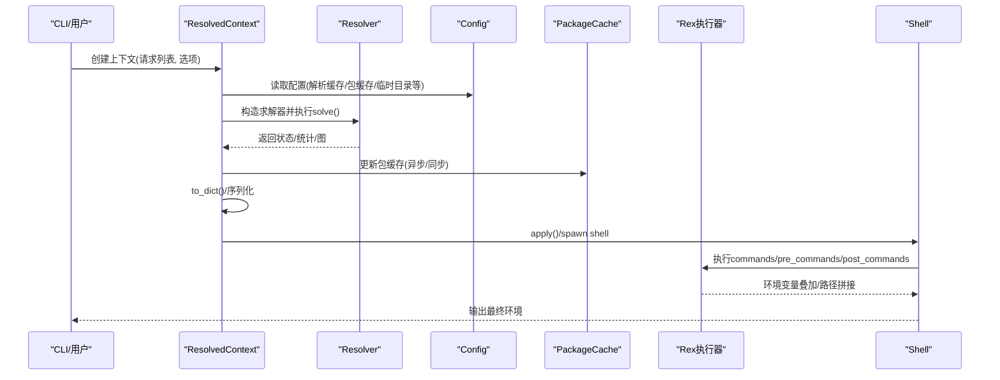
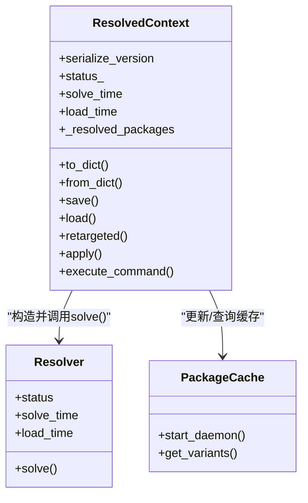
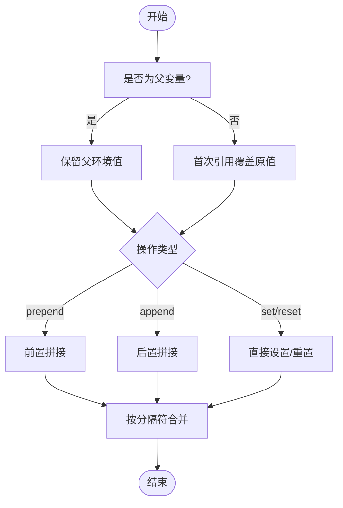
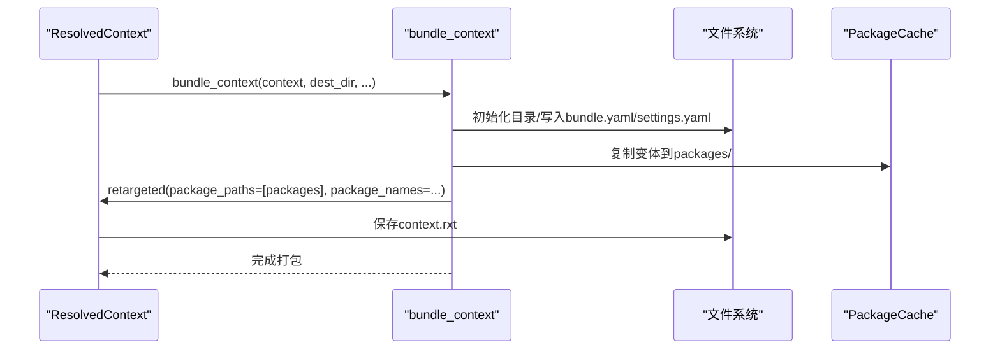
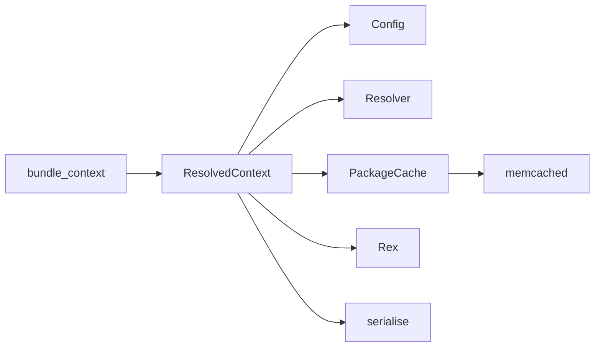

# 环境配置与管理

<cite>
**本文引用的文件**
- [resolved_context.py](file://rez-3.3.0/src/rez/resolved_context.py)
- [config.py](file://rez-3.3.0/src/rez/config.py)
- [bundle_context.py](file://rez-3.3.0/src/rez/bundle_context.py)
- [package_serialise.py](file://rez-3.3.0/src/rez/package_serialise.py)
- [package_resources.py](file://rez-3.3.0/src/rez/package_resources.py)
- [rex.py](file://rez-3.3.0/src/rez/rex.py)
- [rezconfig.py](file://rez-3.3.0/src/rez/rezconfig.py)
- [resolver.py](file://rez-3.3.0/src/rez/resolver.py)
- [package_cache.py](file://rez-3.3.0/src/rez/package_cache.py)
- [serialise.py](file://rez-3.3.0/src/rez/serialise.py)
- [logging_.py](file://rez-3.3.0/src/rez/utils/logging_.py)
- [memcache.py](file://rez-3.3.0/src/rez/cli/memcache.py)
- [package.py（示例）](file://my_packages/myapp/1.0.0/package.py)
- [package.py（示例）](file://my_packages/maya/2022/package.py)
</cite>

## 目录
1. [简介](#简介)
2. [项目结构](#项目结构)
3. [核心组件](#核心组件)
4. [架构总览](#架构总览)
5. [详细组件分析](#详细组件分析)
6. [依赖关系分析](#依赖关系分析)
7. [性能考虑](#性能考虑)
8. [故障排查指南](#故障排查指南)
9. [结论](#结论)
10. [附录](#附录)

## 简介
本文件围绕 Rez 的“已解析环境”（ResolvedContext）展开，系统性梳理其内部结构、包加载顺序、环境变量叠加规则与资源定位机制，并结合配置项（如 REZ_ENV_CACHE、REZ_DISABLE_CONTEXT_CACHE）给出调优策略；同时说明如何通过 package.py 中的 commands 字段自定义环境行为（如设置 PYTHONPATH 或启动初始化脚本），以及环境持久化、序列化（to_dict/from_dict）、共享（bundle）的实现方法。最后提供性能监控、内存占用分析与大规模环境下的稳定性保障建议。

## 项目结构
- Rez 核心位于 rez-3.3.0/src/rez 下，包含上下文解析、配置、包缓存、命令执行（Rex）等模块。
- 示例包位于 my_packages 下，用于演示 package.py 的 commands 字段与 variants 定义。

图表来源
- [resolved_context.py](file://rez-3.3.0/src/rez/resolved_context.py#L1-L200)
- [config.py](file://rez-3.3.0/src/rez/config.py#L1-L200)
- [rex.py](file://rez-3.3.0/src/rez/rex.py#L1-L200)
- [resolver.py](file://rez-3.3.0/src/rez/resolver.py#L200-L240)
- [package_cache.py](file://rez-3.3.0/src/rez/package_cache.py#L588-L631)
- [serialise.py](file://rez-3.3.0/src/rez/serialise.py#L156-L204)
- [logging_.py](file://rez-3.3.0/src/rez/utils/logging_.py#L1-L129)
- [memcache.py](file://rez-3.3.0/src/rez/cli/memcache.py#L42-L169)
- [package_serialise.py](file://rez-3.3.0/src/rez/package_serialise.py#L1-L120)
- [package_resources.py](file://rez-3.3.0/src/rez/package_resources.py#L131-L171)
- [bundle_context.py](file://rez-3.3.0/src/rez/bundle_context.py#L1-L120)
- [package.py（示例）](file://my_packages/myapp/1.0.0/package.py#L1-L33)
- [package.py（示例）](file://my_packages/maya/2022/package.py#L1-L9)

章节来源
- [resolved_context.py](file://rez-3.3.0/src/rez/resolved_context.py#L1-L200)
- [config.py](file://rez-3.3.0/src/rez/config.py#L1-L200)

## 核心组件
- 已解析环境（ResolvedContext）
  - 负责解析包请求、构建解决图、存储结果、生成 shell 环境、持久化/加载上下文、retarget 重定向等。
  - 关键能力：to_dict/from_dict 序列化、save/load 持久化、bundle 共享、resolve 统计与缓存控制。
- 配置系统（Config）
  - 提供 Setting 抽象，支持从文件、环境变量、JSON 环境变量、默认值等多源合并，具备覆盖与锁定机制。
  - 支持 REZ_CONFIG_FILE、REZ_DISABLE_HOME_CONFIG 等环境变量影响配置加载路径。
- 环境命令执行（Rex）
  - 提供 setenv、prependenv、appendenv、resetenv 等动作，支持父变量叠加、分隔符、变量扩展等。
- 包缓存与序列化
  - 支持异步/同步包缓存、memcached 缓存、包序列化为 Python/YAML 等格式。
- 上下文打包（Bundle）
  - 将上下文与其使用的变体复制到本地仓库，生成可重定位的 bundle，便于共享与离线使用。

章节来源
- [resolved_context.py](file://rez-3.3.0/src/rez/resolved_context.py#L126-L210)
- [config.py](file://rez-3.3.0/src/rez/config.py#L540-L775)
- [rex.py](file://rez-3.3.0/src/rez/rex.py#L161-L200)
- [package_cache.py](file://rez-3.3.0/src/rez/package_cache.py#L588-L631)
- [serialise.py](file://rez-3.3.0/src/rez/serialise.py#L156-L204)
- [bundle_context.py](file://rez-3.3.0/src/rez/bundle_context.py#L1-L120)

## 架构总览
下面以“已解析环境创建与执行”的主流程为例，展示关键组件交互。

图表来源
- [resolved_context.py](file://rez-3.3.0/src/rez/resolved_context.py#L296-L348)
- [resolver.py](file://rez-3.3.0/src/rez/resolver.py#L203-L238)
- [config.py](file://rez-3.3.0/src/rez/config.py#L754-L768)
- [package_cache.py](file://rez-3.3.0/src/rez/package_cache.py#L588-L631)
- [rex.py](file://rez-3.3.0/src/rez/rex.py#L161-L200)

## 详细组件分析

### 已解析环境（ResolvedContext）内部结构与生命周期
- 初始化阶段
  - 解析请求、隐式包、过滤器、排序器、时间戳、缓存开关等。
  - 构造 Resolver 并执行 solve，记录 solve/load 时间、失败原因、图信息。
- 结果转换
  - 将求解结果映射为 Variant 对象并绑定上下文。
- 执行阶段
  - 可通过 apply/spawn 进入交互/非交互 shell，执行 Rex 命令。
- 持久化与加载
  - to_dict()/from_dict 实现序列化/反序列化；save/load 支持文件持久化。
- 共享与重定向
  - retargeted 将上下文中的变体重定向到新的仓库路径，配合 bundle_context 生成可重定位 bundle。

图表来源
- [resolved_context.py](file://rez-3.3.0/src/rez/resolved_context.py#L126-L210)
- [resolved_context.py](file://rez-3.3.0/src/rez/resolved_context.py#L333-L348)
- [resolved_context.py](file://rez-3.3.0/src/rez/resolved_context.py#L520-L560)
- [resolved_context.py](file://rez-3.3.0/src/rez/resolved_context.py#L652-L701)
- [package_cache.py](file://rez-3.3.0/src/rez/package_cache.py#L588-L631)

章节来源
- [resolved_context.py](file://rez-3.3.0/src/rez/resolved_context.py#L126-L210)
- [resolved_context.py](file://rez-3.3.0/src/rez/resolved_context.py#L333-L348)
- [resolved_context.py](file://rez-3.3.0/src/rez/resolved_context.py#L520-L560)
- [resolved_context.py](file://rez-3.3.0/src/rez/resolved_context.py#L652-L701)

### 包加载顺序与资源定位机制
- 包加载顺序
  - ResolvedContext 在初始化时会根据 package_orderers、package_filter、timestamp 等参数构造 Resolver，随后按求解器策略确定变体选择与顺序。
  - 包的加载可能来自本地/远程仓库，支持 memcached 缓存加速。
- 资源定位
  - 变体 handle 的根目录、payload 文件、relocatable/cachable 标记等由包定义与缓存策略共同决定。
  - Rex 执行时对引用进行变量扩展，确保 PATH/PYTHONPATH 等路径正确拼接。

章节来源
- [resolved_context.py](file://rez-3.3.0/src/rez/resolved_context.py#L240-L258)
- [resolver.py](file://rez-3.3.0/src/rez/resolver.py#L203-L238)
- [package_cache.py](file://rez-3.3.0/src/rez/package_cache.py#L588-L631)
- [rex.py](file://rez-3.3.0/src/rez/rex.py#L161-L200)

### 环境变量叠加规则与父变量/重置变量
- 父变量（parent_variables/all_parent_variables）
  - 默认情况下，首次对某变量进行 append/prepend 会覆盖原值，避免污染外部环境。
  - 若将变量设为父变量，则后续操作会在原值基础上追加/前置，而非覆盖。
- 重置变量（resetting_variables/all_resetting_variables）
  - 当多个包试图设置同一变量时，默认视为冲突；可通过 resetenv 或将变量加入 resetting 列表来允许覆盖。
- 变量扩展与分隔符
  - Rex 支持变量扩展与分隔符拼接，确保 PATH 等路径正确合并。

图表来源
- [rex.py](file://rez-3.3.0/src/rez/rex.py#L328-L370)
- [rex.py](file://rez-3.3.0/src/rez/rex.py#L1086-L1123)
- [rezconfig.py](file://rez-3.3.0/src/rez/rezconfig.py#L480-L505)

章节来源
- [rex.py](file://rez-3.3.0/src/rez/rex.py#L328-L370)
- [rex.py](file://rez-3.3.0/src/rez/rex.py#L1086-L1123)
- [rezconfig.py](file://rez-3.3.0/src/rez/rezconfig.py#L480-L505)

### 配置项与调优策略（REZ_ENV_CACHE、REZ_DISABLE_CONTEXT_CACHE 等）
- 配置加载优先级（Setting 解析）
  - 环境变量 -> JSON 环境变量 -> 配置文件默认值 -> 程序默认值。
  - REZ_CONFIG_FILE 可指定额外配置文件路径；REZ_DISABLE_HOME_CONFIG 控制是否加载用户家目录配置。
- 与上下文相关的配置要点
  - resolve_caching：启用/禁用解析缓存（memcached）。
  - package_cache_during_build、package_cache_async：构建期包缓存与异步缓存。
  - context_tmpdir：上下文临时目录。
  - context_tracking_host/context_tracking_context_fields：上下文使用追踪。
  - parent_variables/all_parent_variables/resetting_variables/all_resetting_variables：环境变量叠加与冲突处理。
- 调优建议
  - 大规模环境：开启 resolve_caching 并配置 memcached；合理设置 package_cache_async 以降低首开延迟。
  - 稳定性：在 CI/离线场景关闭 context_tracking 或限制追踪字段，减少 IO 开销。
  - 父变量谨慎使用：避免将 PATH、PYTHONPATH 等设为父变量，防止污染。

章节来源
- [config.py](file://rez-3.3.0/src/rez/config.py#L540-L775)
- [config.py](file://rez-3.3.0/src/rez/config.py#L754-L768)
- [config.py](file://rez-3.3.0/src/rez/config.py#L364-L514)
- [resolved_context.py](file://rez-3.3.0/src/rez/resolved_context.py#L240-L258)

### 通过 package.py 的 commands 自定义环境行为
- commands 字段
  - 可在其中设置环境变量（如 PATH、PYTHONPATH），并按包依赖顺序执行。
  - 变体（variants）可限定依赖组合，从而影响 commands 的执行顺序与生效范围。
- 示例
  - myapp 包在 commands 中设置 MYAPP_ROOT、PATH、PYTHONPATH，并声明多种 python 变体。
  - maya 包作为占位示例，variants 留空以避免平台家族要求。

章节来源
- [package.py（示例）](file://my_packages/myapp/1.0.0/package.py#L1-L33)
- [package.py（示例）](file://my_packages/maya/2022/package.py#L1-L9)
- [package_resources.py](file://rez-3.3.0/src/rez/package_resources.py#L131-L171)
- [package_serialise.py](file://rez-3.3.0/src/rez/package_serialise.py#L71-L111)

### 环境持久化、序列化（to_dict/from_dict）与共享（bundle）
- 持久化与序列化
  - ResolvedContext 提供 to_dict()/from_dict()，保存为 JSON 文档；save()/load() 支持文件持久化。
- 共享（Bundle）
  - bundle_context 将上下文与其使用的变体复制到本地仓库，生成可重定位 bundle，包含 context.rxt 与 packages 子树。
  - bundle.yaml 记录元数据与日志；settings.yaml 内置禁用 memcached 以避免跨设备冲突。
  - retargeted 将上下文变体重定向至 bundle 内仓库，便于后续加载。

图表来源
- [bundle_context.py](file://rez-3.3.0/src/rez/bundle_context.py#L1-L120)
- [bundle_context.py](file://rez-3.3.0/src/rez/bundle_context.py#L184-L195)
- [resolved_context.py](file://rez-3.3.0/src/rez/resolved_context.py#L520-L560)

章节来源
- [resolved_context.py](file://rez-3.3.0/src/rez/resolved_context.py#L652-L701)
- [bundle_context.py](file://rez-3.3.0/src/rez/bundle_context.py#L1-L120)
- [bundle_context.py](file://rez-3.3.0/src/rez/bundle_context.py#L184-L195)

## 依赖关系分析
- 组件耦合
  - ResolvedContext 依赖 Config、Resolver、PackageCache、Rex、serialise 等模块。
  - Bundle 依赖 ResolvedContext 的 retargeted 能力与文件系统操作。
- 外部依赖
  - memcached（通过 resolver 与 package_cache 使用）。
  - YAML/JSON 序列化（serialise、package_serialise）。
  - Shell 插件（shells）用于 spawn/shell 环境。

图表来源
- [resolved_context.py](file://rez-3.3.0/src/rez/resolved_context.py#L126-L210)
- [resolver.py](file://rez-3.3.0/src/rez/resolver.py#L203-L238)
- [package_cache.py](file://rez-3.3.0/src/rez/package_cache.py#L588-L631)
- [bundle_context.py](file://rez-3.3.0/src/rez/bundle_context.py#L1-L120)

章节来源
- [resolved_context.py](file://rez-3.3.0/src/rez/resolved_context.py#L126-L210)
- [resolver.py](file://rez-3.3.0/src/rez/resolver.py#L203-L238)
- [package_cache.py](file://rez-3.3.0/src/rez/package_cache.py#L588-L631)
- [bundle_context.py](file://rez-3.3.0/src/rez/bundle_context.py#L1-L120)

## 性能考虑
- 解析缓存（resolve_caching）
  - 启用 memcached 缓存可显著缩短重复解析时间；注意缓存失效策略与包变更检测。
- 包缓存（package_cache）
  - 异步缓存可在上下文创建时后台填充缓存，减少首次访问延迟；同步模式保证立即可用但会阻塞。
- 日志与调试
  - 使用 utils/logging_.py 的日志工具记录耗时；CLI memcache.py 可查看命中率、连接数、GET/SET 速率等。
- 大规模环境稳定性
  - 合理设置 parent_variables/resetting_variables，避免冲突导致回溯。
  - 控制 context_tracking 与追踪字段数量，减少 IO 压力。
  - 在 CI/离线场景禁用 memcached 或限制缓存大小阈值。

章节来源
- [config.py](file://rez-3.3.0/src/rez/config.py#L364-L514)
- [resolver.py](file://rez-3.3.0/src/rez/resolver.py#L203-L238)
- [package_cache.py](file://rez-3.3.0/src/rez/package_cache.py#L588-L631)
- [logging_.py](file://rez-3.3.0/src/rez/utils/logging_.py#L1-L129)
- [memcache.py](file://rez-3.3.0/src/rez/cli/memcache.py#L42-L169)

## 故障排查指南
- 环境变量冲突
  - 现象：多个包尝试设置同一变量导致冲突。
  - 处理：将变量加入 resetting_variables，或在包内使用 resetenv。
- 父变量误用
  - 现象：PATH、PYTHONPATH 等被设为父变量导致外部模块污染。
  - 处理：避免将关键路径变量设为父变量；必要时仅对特定变量启用父变量。
- 缓存问题
  - 现象：解析结果陈旧或缓存未命中。
  - 处理：检查 memcached 连接与键空间；必要时清理缓存或禁用缓存验证。
- 上下文持久化异常
  - 现象：rxt 文件损坏或无法加载。
  - 处理：确认 to_dict/from_dict 版本兼容；检查序列化格式与字段完整性。

章节来源
- [rezconfig.py](file://rez-3.3.0/src/rez/rezconfig.py#L480-L505)
- [rex.py](file://rez-3.3.0/src/rez/rex.py#L328-L370)
- [serialise.py](file://rez-3.3.0/src/rez/serialise.py#L156-L204)
- [bundle_context.py](file://rez-3.3.0/src/rez/bundle_context.py#L1-L120)

## 结论
通过对 ResolvedContext 的深入分析，可以清晰地把握 Rez 在包解析、环境变量叠加、资源定位与持久化/共享方面的实现细节。结合配置系统的多源覆盖机制与 Rex 的命令执行模型，能够在复杂工程环境下实现高性能、可维护且稳定的环境管理。建议在大规模团队中统一配置策略、谨慎使用父变量、充分利用缓存与 bundle 能力，并通过日志与监控持续优化性能与稳定性。

## 附录
- 相关文档与示例
  - 包命令与执行顺序说明：见 docs/source/package_commands.rst。
  - 包序列化格式与 Schema：见 package_serialise.py、package_resources.py。
  - 上下文打包与重定位：见 bundle_context.py。

章节来源
- [package_serialise.py](file://rez-3.3.0/src/rez/package_serialise.py#L71-L111)
- [package_resources.py](file://rez-3.3.0/src/rez/package_resources.py#L131-L171)
- [bundle_context.py](file://rez-3.3.0/src/rez/bundle_context.py#L1-L120)