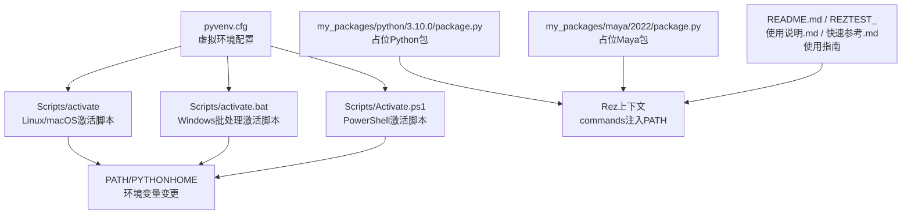
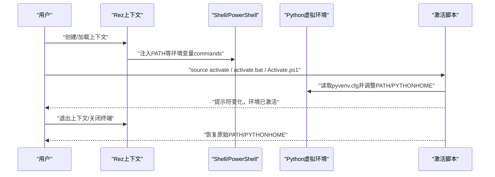
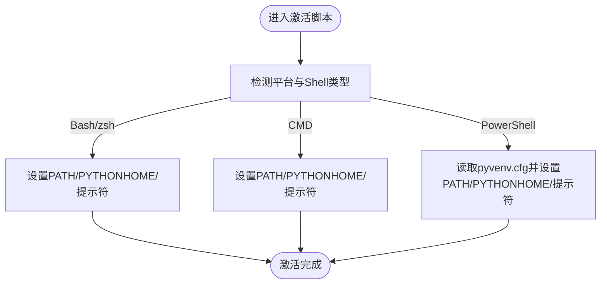
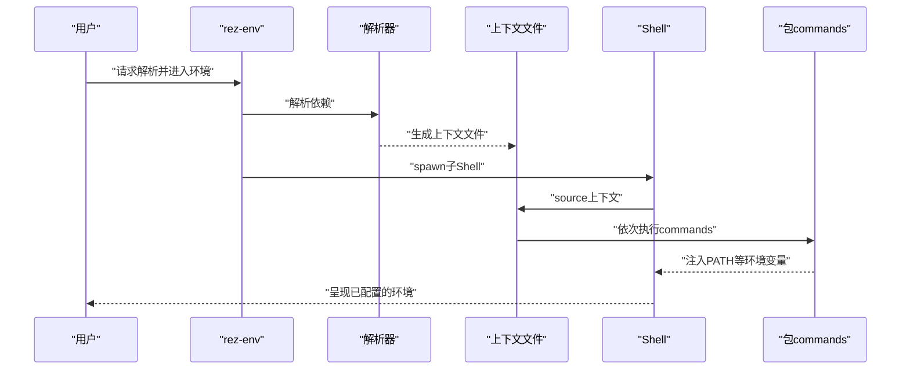
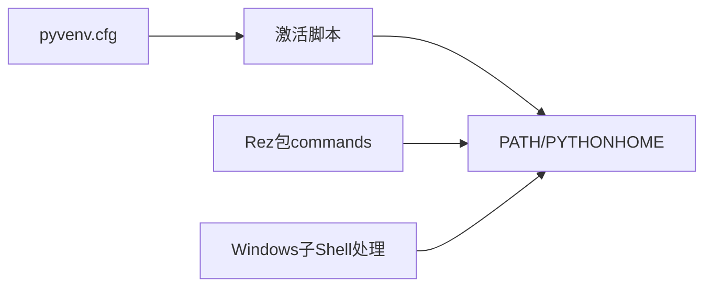

# 环境配置

<cite>
**本文引用的文件**
- [pyvenv.cfg](file://pyvenv.cfg)
- [Scripts/activate](file://Scripts/activate)
- [Scripts/activate.bat](file://Scripts/activate.bat)
- [Scripts/Activate.ps1](file://Scripts/Activate.ps1)
- [Scripts/deactivate.bat](file://Scripts/deactivate.bat)
- [README.md](file://README.md)
- [REZTEST_使用说明.md](file://REZTEST_使用说明.md)
- [快速参考.md](file://快速参考.md)
- [my_packages/python/3.10.0/package.py](file://my_packages/python/3.10.0/package.py)
- [my_packages/maya/2022/package.py](file://my_packages/maya/2022/package.py)
- [rez-3.3.0/src/rez/cli/selftest.py](file://rez-3.3.0/src/rez/cli/selftest.py)
- [rez-3.3.0/src/rezplugins/shell/cmd.py](file://rez-3.3.0/src/rezplugins/shell/cmd.py)
- [rez-3.3.0/docs/source/context.rst](file://rez-3.3.0/docs/source/context.rst)
</cite>

## 目录
1. [引言](#引言)
2. [项目结构](#项目结构)
3. [核心组件](#核心组件)
4. [架构总览](#架构总览)
5. [详细组件分析](#详细组件分析)
6. [依赖关系分析](#依赖关系分析)
7. [性能考量](#性能考量)
8. [故障排查指南](#故障排查指南)
9. [结论](#结论)
10. [附录](#附录)

## 引言
本文件围绕Python虚拟环境的配置展开，重点以pyvenv.cfg为核心，说明其在Rez环境隔离中的作用；并结合Scripts目录下的激活脚本（activate、activate.bat、Activate.ps1），解释环境变量（如PATH、PYTHONHOME）在激活过程中的修改机制。同时给出跨平台（Windows/Linux/macOS）最佳实践，以及如何与Rez的上下文（Context）集成，实现无缝的环境切换，并提供常见问题排查指南。

## 项目结构
本仓库包含一个Rez学习项目，其中包含：
- Python虚拟环境配置文件：pyvenv.cfg
- 跨平台激活脚本：Scripts/activate、Scripts/activate.bat、Scripts/Activate.ps1
- Rez相关文档与示例包：my_packages/python、my_packages/maya
- Rez CLI与Shell插件源码片段：用于理解Rez如何注入PATH等环境变量
- 项目使用说明与快速参考文档

图表来源
- [pyvenv.cfg](file://pyvenv.cfg#L1-L4)
- [Scripts/activate](file://Scripts/activate#L1-L66)
- [Scripts/activate.bat](file://Scripts/activate.bat#L1-L34)
- [Scripts/Activate.ps1](file://Scripts/Activate.ps1#L1-L243)
- [my_packages/python/3.10.0/package.py](file://my_packages/python/3.10.0/package.py#L1-L8)
- [my_packages/maya/2022/package.py](file://my_packages/maya/2022/package.py#L1-L9)
- [README.md](file://README.md#L1-L155)
- [REZTEST_使用说明.md](file://REZTEST_使用说明.md#L1-L316)
- [快速参考.md](file://快速参考.md#L1-L417)

章节来源
- [README.md](file://README.md#L1-L155)
- [REZTEST_使用说明.md](file://REZTEST_使用说明.md#L1-L316)
- [快速参考.md](file://快速参考.md#L1-L417)

## 核心组件
- pyvenv.cfg：定义虚拟环境的home、是否包含系统站点包、版本等关键信息，是Python venv激活脚本的重要输入。
- Scripts/activate（Bash/zsh）：设置/恢复PATH、PYTHONHOME、提示符等，支持非破坏性deactivate。
- Scripts/activate.bat（Windows CMD）：设置/恢复PATH、PYTHONHOME、提示符等。
- Scripts/Activate.ps1（PowerShell）：解析pyvenv.cfg，设置/恢复PATH、PYTHONHOME、提示符，并支持命令行参数覆盖。
- Rez上下文（Context）：由包的commands注入环境变量（如PATH），Rez通过上下文文件串行执行各包的命令片段，从而复现目标环境。

章节来源
- [pyvenv.cfg](file://pyvenv.cfg#L1-L4)
- [Scripts/activate](file://Scripts/activate#L1-L66)
- [Scripts/activate.bat](file://Scripts/activate.bat#L1-L34)
- [Scripts/Activate.ps1](file://Scripts/Activate.ps1#L1-L243)
- [rez-3.3.0/docs/source/context.rst](file://rez-3.3.0/docs/source/context.rst#L1-L112)

## 架构总览
下图展示了Rez上下文与Python虚拟环境激活脚本之间的协作关系：Rez通过解析包依赖生成上下文，上下文中的commands负责注入PATH等环境变量；而Python venv激活脚本则负责将虚拟环境的可执行与脚本置于PATH前端，并清理PYTHONHOME等，二者共同实现“隔离且可切换”的环境。

图表来源
- [Scripts/activate](file://Scripts/activate#L1-L66)
- [Scripts/activate.bat](file://Scripts/activate.bat#L1-L34)
- [Scripts/Activate.ps1](file://Scripts/Activate.ps1#L1-L243)
- [pyvenv.cfg](file://pyvenv.cfg#L1-L4)
- [rez-3.3.0/docs/source/context.rst](file://rez-3.3.0/docs/source/context.rst#L1-L112)

## 详细组件分析

### 组件A：pyvenv.cfg在Rez环境隔离中的作用
- home：指向Python解释器所在目录，激活脚本会将其加入PATH前端，确保优先使用该解释器。
- include-system-site-packages：控制是否包含系统站点包。在Rez隔离环境中通常设为false，避免污染。
- version：记录虚拟环境使用的Python版本，便于脚本判断与提示。

章节来源
- [pyvenv.cfg](file://pyvenv.cfg#L1-L4)

### 组件B：跨平台激活脚本对环境变量的影响
- Linux/macOS（activate）
  - 设置/恢复PATH：将虚拟环境的Scripts目录前置到PATH，使本地脚本优先被调用；同时备份旧值以便deactivate恢复。
  - 设置/恢复PYTHONHOME：若存在则清空，避免指向系统Python导致行为不一致。
  - 设置提示符：在PS1前加上环境标识，便于区分当前环境。
- Windows（activate.bat）
  - 设置/恢复PATH：同样将虚拟环境的Scripts目录前置到PATH。
  - 设置/恢复PYTHONHOME与提示符：逻辑与Bash类似。
- PowerShell（Activate.ps1）
  - 读取pyvenv.cfg：解析home、prompt等键值，支持命令行覆盖。
  - 设置/恢复PATH/PYTHONHOME：将虚拟环境目录加入PATH前端，清空PYTHONHOME。
  - 设置提示符：动态替换prompt函数，显示环境名。

图表来源
- [Scripts/activate](file://Scripts/activate#L1-L66)
- [Scripts/activate.bat](file://Scripts/activate.bat#L1-L34)
- [Scripts/Activate.ps1](file://Scripts/Activate.ps1#L1-L243)

章节来源
- [Scripts/activate](file://Scripts/activate#L1-L66)
- [Scripts/activate.bat](file://Scripts/activate.bat#L1-L34)
- [Scripts/Activate.ps1](file://Scripts/Activate.ps1#L1-L243)

### 组件C：Rez上下文与环境变量注入
- Rez通过解析包依赖生成上下文（Context），上下文文件存储解析结果与命令片段。
- 包的commands会在加载上下文时被执行，典型做法是env.PATH.prepend将工具链路径前置，从而实现“按需隔离”。
- Rez还支持在Windows子Shell中注入额外的PATH扩展（PATHEXT）等，保证可执行文件能被正确解析。

图表来源
- [rez-3.3.0/docs/source/context.rst](file://rez-3.3.0/docs/source/context.rst#L1-L112)
- [rez-3.3.0/src/rezplugins/shell/cmd.py](file://rez-3.3.0/src/rezplugins/shell/cmd.py#L84-L140)
- [rez-3.3.0/src/rez/cli/selftest.py](file://rez-3.3.0/src/rez/cli/selftest.py#L155-L168)

章节来源
- [rez-3.3.0/docs/source/context.rst](file://rez-3.3.0/docs/source/context.rst#L1-L112)
- [rez-3.3.0/src/rezplugins/shell/cmd.py](file://rez-3.3.0/src/rezplugins/shell/cmd.py#L84-L140)
- [rez-3.3.0/src/rez/cli/selftest.py](file://rez-3.3.0/src/rez/cli/selftest.py#L155-L168)

### 组件D：占位包与环境注入示例
- my_packages/python/3.10.0/package.py：作为占位Python包，配合Rez上下文commands注入PATH，确保在该上下文中优先使用对应Python。
- my_packages/maya/2022/package.py：作为占位Maya包，用于演示Rez上下文如何串联多工具链。

章节来源
- [my_packages/python/3.10.0/package.py](file://my_packages/python/3.10.0/package.py#L1-L8)
- [my_packages/maya/2022/package.py](file://my_packages/maya/2022/package.py#L1-L9)

## 依赖关系分析
- 激活脚本依赖pyvenv.cfg提供的home与prompt等信息，以决定PATH前缀与提示符。
- Rez上下文通过包的commands注入PATH，与激活脚本的PATH前置形成互补：前者实现“包级别隔离”，后者实现“解释器级别隔离”。
- Windows环境下，Rez还会在spawn子Shell时处理PATHEXT等细节，保证可执行文件解析稳定。

图表来源
- [pyvenv.cfg](file://pyvenv.cfg#L1-L4)
- [Scripts/activate](file://Scripts/activate#L1-L66)
- [Scripts/activate.bat](file://Scripts/activate.bat#L1-L34)
- [Scripts/Activate.ps1](file://Scripts/Activate.ps1#L1-L243)
- [rez-3.3.0/src/rezplugins/shell/cmd.py](file://rez-3.3.0/src/rezplugins/shell/cmd.py#L84-L140)

章节来源
- [pyvenv.cfg](file://pyvenv.cfg#L1-L4)
- [Scripts/activate](file://Scripts/activate#L1-L66)
- [Scripts/activate.bat](file://Scripts/activate.bat#L1-L34)
- [Scripts/Activate.ps1](file://Scripts/Activate.ps1#L1-L243)
- [rez-3.3.0/src/rezplugins/shell/cmd.py](file://rez-3.3.0/src/rezplugins/shell/cmd.py#L84-L140)

## 性能考量
- 激活脚本对PATH的修改是轻量级的，主要成本在于shell启动与命令执行；在大型PATH列表中，将虚拟环境目录前置有助于减少查找时间。
- Rez上下文的commands执行次数与包数量线性相关，尽量合并路径追加与条件判断，避免重复操作。
- Windows子Shell中对PATHEXT的处理可减少不必要的路径扫描，提升可执行文件定位效率。

## 故障排查指南
- 激活失败（PowerShell）
  - 症状：执行Activate.ps1报策略限制或无法导入。
  - 处理：根据脚本注释调整执行策略，或以管理员权限运行。
  - 参考：[Scripts/Activate.ps1](file://Scripts/Activate.ps1#L1-L60)
- 激活后命令不可用
  - 症状：PATH未正确前置或被其他脚本覆盖。
  - 处理：确认Scripts目录已在PATH前端；检查是否存在多层激活叠加。
  - 参考：[Scripts/activate](file://Scripts/activate#L40-L66)、[Scripts/activate.bat](file://Scripts/activate.bat#L21-L34)、[Scripts/Activate.ps1](file://Scripts/Activate.ps1#L233-L243)
- PYTHONHOME导致解释器行为异常
  - 症状：指向系统Python导致模块解析异常。
  - 处理：激活脚本会清空PYTHONHOME，若仍异常，手动unset或检查父Shell残留。
  - 参考：[Scripts/activate](file://Scripts/activate#L47-L53)、[Scripts/activate.bat](file://Scripts/activate.bat#L16-L23)、[Scripts/Activate.ps1](file://Scripts/Activate.ps1#L233-L237)
- Windows可执行文件无法解析
  - 症状：.exe/.bat等无法直接运行。
  - 处理：确认PATHEXT包含所需扩展；Rez在spawn子Shell时会处理PATHEXT。
  - 参考：[rez-3.3.0/src/rezplugins/shell/cmd.py](file://rez-3.3.0/src/rezplugins/shell/cmd.py#L137-L140)
- 上下文环境变量不符合预期
  - 症状：PATH未包含期望的工具链路径。
  - 处理：检查包的commands是否prepend了正确的路径；必要时在package.py中显式声明。
  - 参考：[快速参考.md](file://快速参考.md#L273-L299)、[my_packages/python/3.10.0/package.py](file://my_packages/python/3.10.0/package.py#L1-L8)

章节来源
- [Scripts/Activate.ps1](file://Scripts/Activate.ps1#L1-L60)
- [Scripts/activate](file://Scripts/activate#L40-L66)
- [Scripts/activate.bat](file://Scripts/activate.bat#L16-L34)
- [Scripts/Activate.ps1](file://Scripts/Activate.ps1#L233-L243)
- [Scripts/deactivate.bat](file://Scripts/deactivate.bat#L1-L21)
- [rez-3.3.0/src/rezplugins/shell/cmd.py](file://rez-3.3.0/src/rezplugins/shell/cmd.py#L137-L140)
- [快速参考.md](file://快速参考.md#L273-L299)
- [my_packages/python/3.10.0/package.py](file://my_packages/python/3.10.0/package.py#L1-L8)

## 结论
- pyvenv.cfg是Python venv激活脚本的关键输入，home、include-system-site-packages、version等字段直接影响PATH前置与解释器选择。
- 激活脚本在不同平台上均遵循统一原则：将虚拟环境目录前置到PATH，清空PYTHONHOME，设置提示符，确保环境隔离与可回溯。
- Rez上下文通过包的commands实现“包级别隔离”，与激活脚本的“解释器级别隔离”相辅相成，共同达成可复现、可切换的工程化环境。
- 建议在团队内统一使用Rez上下文与激活脚本，结合pyvenv.cfg规范，形成跨平台一致的环境配置流程。

## 附录
- 跨平台最佳实践
  - Windows：使用activate.bat或Activate.ps1；注意执行策略与PATHEXT。
  - Linux/macOS：使用activate；注意shell类型（bash/zsh）与hash -r。
  - Rez集成：在package.py的commands中prepend工具链路径；必要时在上下文文件中附加额外变量。
- 与Rez上下文集成
  - 使用ResolvedContext查看最终环境变量，定位PATH缺失或覆盖问题。
  - 参考：[快速参考.md](file://快速参考.md#L342-L353)、[REZTEST_使用说明.md](file://REZTEST_使用说明.md#L205-L216)