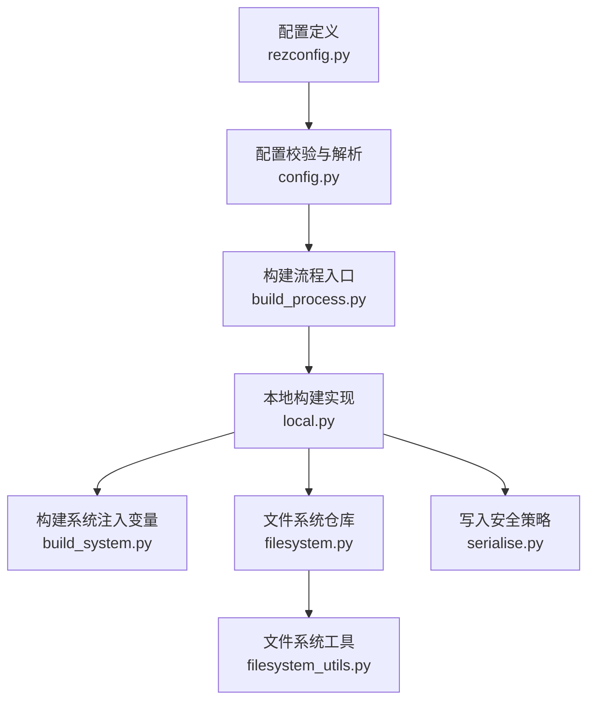
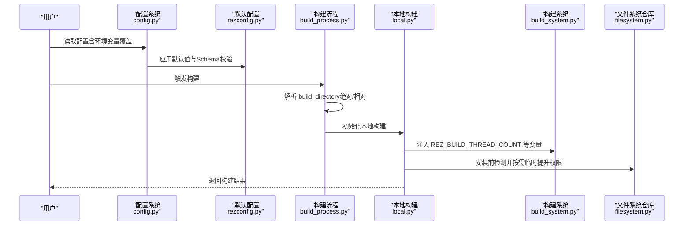
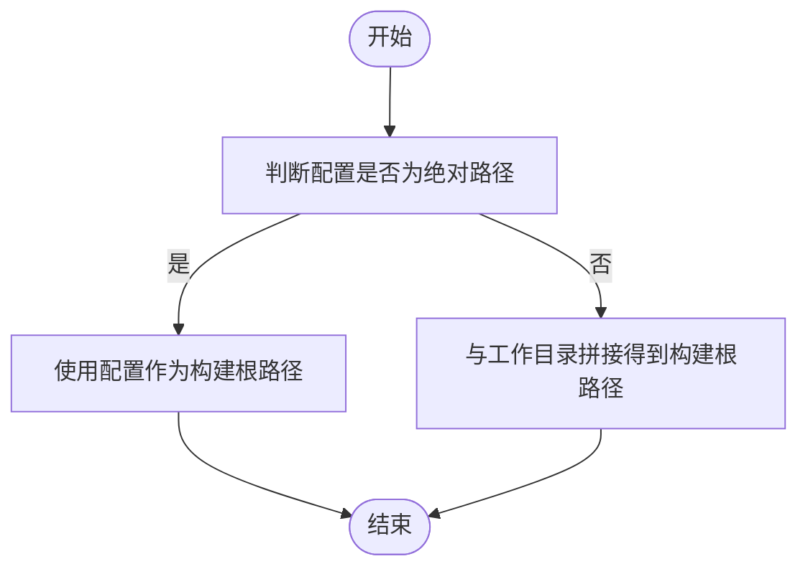
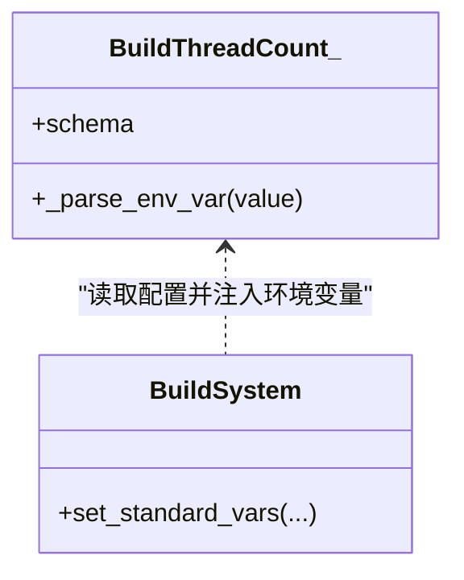
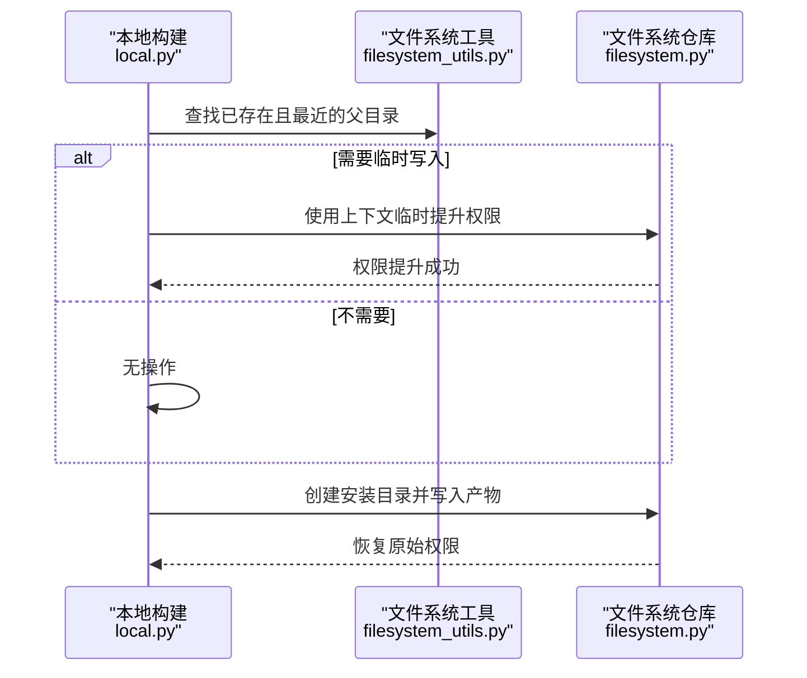
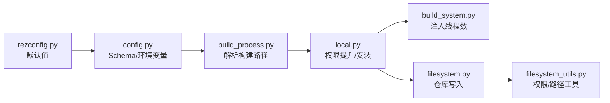

# 构建过程配置

<cite>
**本文引用的文件列表**
- [rezconfig.py](file://rez-3.3.0/src/rez/rezconfig.py)
- [config.py](file://rez-3.3.0/src/rez/config.py)
- [build_process.py](file://rez-3.3.0/src/rez/build_process.py)
- [build_system.py](file://rez-3.3.0/src/rez/build_system.py)
- [local.py](file://rez-3.3.0/src/rezplugins/build_process/local.py)
- [filesystem.py](file://rez-3.3.0/src/rezplugins/package_repository/filesystem.py)
- [serialise.py](file://rez-3.3.0/src/rez/serialise.py)
- [filesystem_utils.py](file://rez-3.3.0/src/rez/utils/filesystem.py)
</cite>

## 目录
1. [简介](#简介)
2. [项目结构](#项目结构)
3. [核心组件](#核心组件)
4. [架构总览](#架构总览)
5. [详细组件分析](#详细组件分析)
6. [依赖关系分析](#依赖关系分析)
7. [性能考量](#性能考量)
8. [故障排查指南](#故障排查指南)
9. [结论](#结论)

## 简介
本文件聚焦于 Rez 构建流程的关键配置项：build_directory、build_thread_count、make_package_temporarily_writable，以及 package_definition_build_python_paths 的协同使用。文档从配置来源、默认值、运行期行为、跨平台差异到常见问题排查进行系统化说明，并给出可直接定位到源码位置的“章节来源”和“图表来源”，帮助读者快速理解并正确配置构建流程。

## 项目结构
围绕构建过程的配置与实现主要分布在以下模块：
- 配置定义与默认值：rezconfig.py（全局默认）、config.py（Schema 校验与环境变量覆盖）
- 构建执行：build_process.py（构建流程基类与本地构建流程）、build_system.py（构建系统注入环境变量）
- 包仓库与权限：filesystem.py（文件系统仓库）、filesystem_utils.py（路径存在性与权限辅助）
- 写入安全：serialise.py（写文件时的临时缓存与权限提升）

图表来源
- [rezconfig.py](file://rez-3.3.0/src/rez/rezconfig.py#L764-L800)
- [config.py](file://rez-3.3.0/src/rez/config.py#L340-L362)
- [build_process.py](file://rez-3.3.0/src/rez/build_process.py#L110-L120)
- [local.py](file://rez-3.3.0/src/rezplugins/build_process/local.py#L140-L170)
- [build_system.py](file://rez-3.3.0/src/rez/build_system.py#L209-L258)
- [filesystem.py](file://rez-3.3.0/src/rezplugins/package_repository/filesystem.py#L1-L60)
- [serialise.py](file://rez-3.3.0/src/rez/serialise.py#L45-L85)

章节来源
- [rezconfig.py](file://rez-3.3.0/src/rez/rezconfig.py#L764-L800)
- [config.py](file://rez-3.3.0/src/rez/config.py#L340-L362)

## 核心组件
- build_directory：构建输出根目录，默认为相对路径“build”。本地构建流程会根据该设置决定变体构建目录与安装目录的最终落点。
- build_thread_count：构建线程数，默认为“physical_cores”。构建系统可通过环境变量 REZ_BUILD_THREAD_COUNT 获取该值，用于控制底层编译器/构建工具的并发度。
- make_package_temporarily_writable：当安装包到只读仓库或目标目录时，是否临时提升权限以完成写入。默认开启。
- package_definition_build_python_paths：仅在构建期间追加到 sys.path 的 Python 路径，便于在构建阶段复用共享工具脚本。

章节来源
- [rezconfig.py](file://rez-3.3.0/src/rez/rezconfig.py#L764-L800)
- [config.py](file://rez-3.3.0/src/rez/config.py#L340-L362)
- [build_system.py](file://rez-3.3.0/src/rez/build_system.py#L209-L258)
- [local.py](file://rez-3.3.0/src/rezplugins/build_process/local.py#L140-L170)

## 架构总览
下图展示了从配置到构建执行的关键链路，包括构建目录解析、线程数注入、权限提升与安装写入。

图表来源
- [config.py](file://rez-3.3.0/src/rez/config.py#L340-L362)
- [rezconfig.py](file://rez-3.3.0/src/rez/rezconfig.py#L764-L800)
- [build_process.py](file://rez-3.3.0/src/rez/build_process.py#L110-L120)
- [local.py](file://rez-3.3.0/src/rezplugins/build_process/local.py#L140-L170)
- [build_system.py](file://rez-3.3.0/src/rez/build_system.py#L209-L258)
- [filesystem.py](file://rez-3.3.0/src/rezplugins/package_repository/filesystem.py#L1-L60)

## 详细组件分析

### 1) 构建输出路径：build_directory
- 默认值与来源：默认值来自全局配置文件，类型为字符串，支持绝对路径或相对于包源目录的相对路径。
- 解析逻辑：本地构建流程在初始化时，若配置为绝对路径则直接使用；否则与工作目录拼接得到最终构建路径。
- 实际影响：变体构建目录与安装目录均受此路径影响，建议统一管理以便清理与调试。

图表来源
- [build_process.py](file://rez-3.3.0/src/rez/build_process.py#L110-L120)
- [rezconfig.py](file://rez-3.3.0/src/rez/rezconfig.py#L764-L782)

章节来源
- [build_process.py](file://rez-3.3.0/src/rez/build_process.py#L110-L120)
- [rezconfig.py](file://rez-3.3.0/src/rez/rezconfig.py#L764-L782)

### 2) 并发构建：build_thread_count
- 默认值与来源：默认值为“physical_cores”，表示使用物理核心数；也可设为“logical_cores”或具体正整数。
- 注入机制：构建系统在执行前会设置环境变量 REZ_BUILD_THREAD_COUNT，供底层构建工具使用。
- 性能建议：在多核机器上建议保持默认；若构建资源受限或需要串行化，可显式设置为较小数值。

图表来源
- [config.py](file://rez-3.3.0/src/rez/config.py#L340-L362)
- [build_system.py](file://rez-3.3.0/src/rez/build_system.py#L209-L258)
- [rezconfig.py](file://rez-3.3.0/src/rez/rezconfig.py#L764-L782)

章节来源
- [config.py](file://rez-3.3.0/src/rez/config.py#L340-L362)
- [build_system.py](file://rez-3.3.0/src/rez/build_system.py#L209-L258)
- [rezconfig.py](file://rez-3.3.0/src/rez/rezconfig.py#L764-L782)

### 3) 临时写入权限：make_package_temporarily_writable
- 默认值与来源：默认开启，允许在安装过程中对目标目录进行临时写权限提升。
- 执行时机：本地构建在创建安装目录前，会向上查找已存在的最深父目录，并在需要时通过上下文管理器临时提升权限。
- 安全性：权限提升在写入完成后自动恢复，避免长期暴露高权限。

图表来源
- [local.py](file://rez-3.3.0/src/rezplugins/build_process/local.py#L140-L170)
- [filesystem_utils.py](file://rez-3.3.0/src/rez/utils/filesystem.py#L108-L165)
- [filesystem.py](file://rez-3.3.0/src/rezplugins/package_repository/filesystem.py#L1-L60)

章节来源
- [local.py](file://rez-3.3.0/src/rezplugins/build_process/local.py#L140-L170)
- [filesystem_utils.py](file://rez-3.3.0/src/rez/utils/filesystem.py#L108-L165)
- [filesystem.py](file://rez-3.3.0/src/rezplugins/package_repository/filesystem.py#L1-L60)

### 4) 共享工具脚本：package_definition_build_python_paths
- 作用：仅在构建期间将指定路径加入 sys.path，便于在构建阶段调用共享工具函数。
- 使用场景：与 package_definition_build_python_paths 配合，可在构建命令或预处理函数中导入共享模块，实现跨包复用。
- 注意事项：该路径列表仅在构建时生效，不影响解析时的 sys.path。

章节来源
- [rezconfig.py](file://rez-3.3.0/src/rez/rezconfig.py#L83-L115)
- [build_system.py](file://rez-3.3.0/src/rez/build_system.py#L209-L258)

## 依赖关系分析
- 配置层：config.py 提供 Setting 类型与 Schema 校验，rezconfig.py 提供默认值与注释说明。
- 构建层：build_process.py 依据配置解析构建路径；local.py 在安装前按需临时提升权限；build_system.py 将线程数注入环境变量。
- 仓库层：filesystem.py 与 filesystem_utils.py 协作，确保安装目录存在并处理权限问题。

图表来源
- [rezconfig.py](file://rez-3.3.0/src/rez/rezconfig.py#L764-L800)
- [config.py](file://rez-3.3.0/src/rez/config.py#L340-L362)
- [build_process.py](file://rez-3.3.0/src/rez/build_process.py#L110-L120)
- [local.py](file://rez-3.3.0/src/rezplugins/build_process/local.py#L140-L170)
- [build_system.py](file://rez-3.3.0/src/rez/build_system.py#L209-L258)
- [filesystem.py](file://rez-3.3.0/src/rezplugins/package_repository/filesystem.py#L1-L60)
- [filesystem_utils.py](file://rez-3.3.0/src/rez/utils/filesystem.py#L108-L165)

章节来源
- [config.py](file://rez-3.3.0/src/rez/config.py#L340-L362)
- [build_process.py](file://rez-3.3.0/src/rez/build_process.py#L110-L120)
- [local.py](file://rez-3.3.0/src/rezplugins/build_process/local.py#L140-L170)
- [build_system.py](file://rez-3.3.0/src/rez/build_system.py#L209-L258)
- [filesystem.py](file://rez-3.3.0/src/rezplugins/package_repository/filesystem.py#L1-L60)
- [filesystem_utils.py](file://rez-3.3.0/src/rez/utils/filesystem.py#L108-L165)

## 性能考量
- 并发度选择：build_thread_count 建议使用“physical_cores”或“logical_cores”，以充分利用硬件能力；在共享存储或网络盘上，过高的并发可能引发锁争用，应适当降低。
- 构建目录布局：合理规划 build_directory，避免在单个目录下堆积大量中间文件，有助于减少磁盘 IO 抖动。
- 缓存与写入：写入流程包含临时缓存与原子写入策略，减少 NFS 等网络存储的读写一致性问题。

章节来源
- [rezconfig.py](file://rez-3.3.0/src/rez/rezconfig.py#L764-L782)
- [serialise.py](file://rez-3.3.0/src/rez/serialise.py#L45-L85)

## 故障排查指南
- 构建目录权限问题
  - 现象：安装阶段报权限错误或无法创建目录。
  - 排查要点：确认目标安装路径是否存在且具备写权限；若仓库位于只读介质，启用 make_package_temporarily_writable 并检查权限提升逻辑。
  - 参考实现：本地构建在安装前查找最近存在的父目录并按需临时提升权限。
  
  章节来源
  - [local.py](file://rez-3.3.0/src/rezplugins/build_process/local.py#L140-L170)
  - [filesystem_utils.py](file://rez-3.3.0/src/rez/utils/filesystem.py#L108-L165)

- 并发冲突与锁竞争
  - 现象：网络盘或共享存储上构建缓慢或失败。
  - 排查要点：降低 build_thread_count，或改为固定小数值；检查仓库文件锁目录配置。
  
  章节来源
  - [rezconfig.py](file://rez-3.3.0/src/rez/rezconfig.py#L764-L782)
  - [filesystem.py](file://rez-3.3.0/src/rezplugins/package_repository/filesystem.py#L815-L850)

- 构建脚本无法导入共享工具
  - 现象：构建时报模块导入错误。
  - 排查要点：确认 package_definition_build_python_paths 已包含共享脚本所在路径；注意该路径仅在构建时生效。
  
  章节来源
  - [rezconfig.py](file://rez-3.3.0/src/rez/rezconfig.py#L83-L115)
  - [build_system.py](file://rez-3.3.0/src/rez/build_system.py#L209-L258)

- 写入一致性与 NFS 行为
  - 现象：刚写入的文件立即读取失败或读到旧内容。
  - 排查要点：关注写入流程的临时缓存与原子写入策略，必要时调整 tmpdir 或禁用某些缓存行为。
  
  章节来源
  - [serialise.py](file://rez-3.3.0/src/rez/serialise.py#L45-L85)

## 结论
- build_directory、build_thread_count、make_package_temporarily_writable 是构建流程的三大关键开关：前者决定输出布局，后者决定并发强度，后者保障写入可行性。
- 结合 package_definition_build_python_paths 可在构建期共享工具脚本，提升包定义的可维护性。
- 在不同操作系统与存储介质上，应根据实际环境调整并发度与权限策略，优先使用默认值并按需微调。