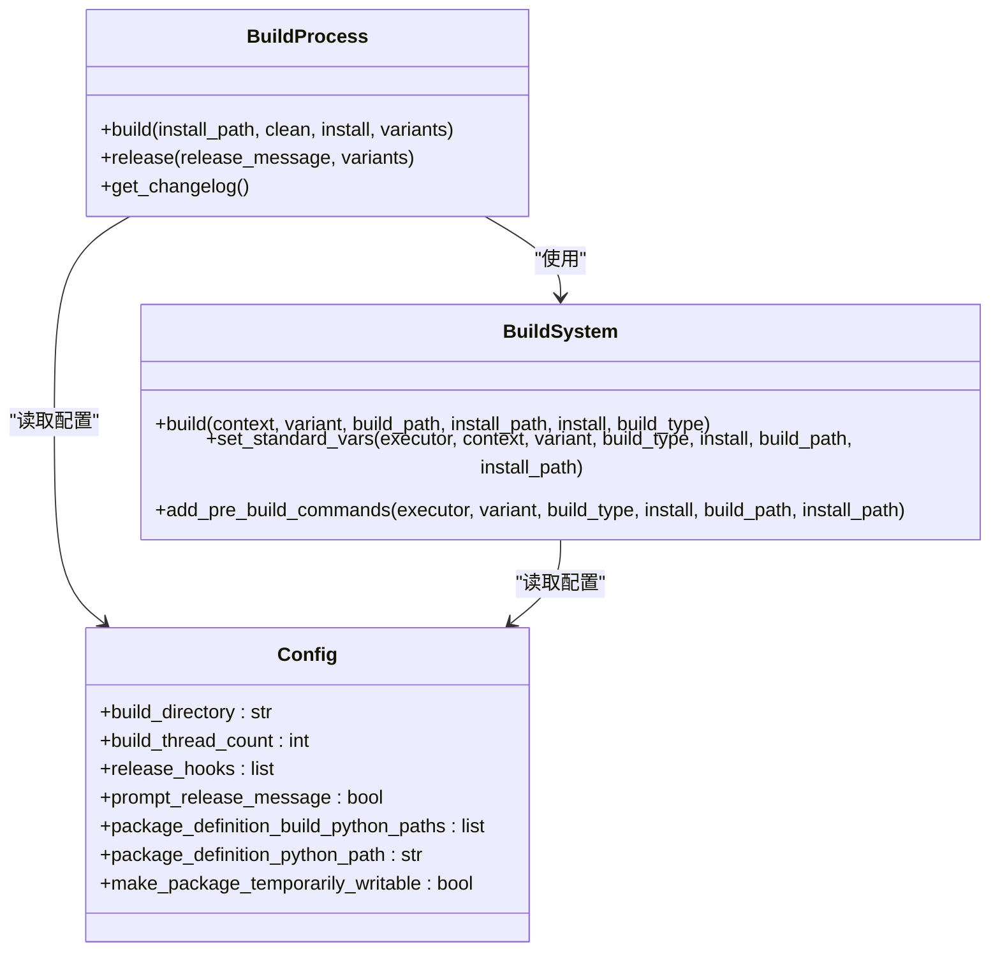
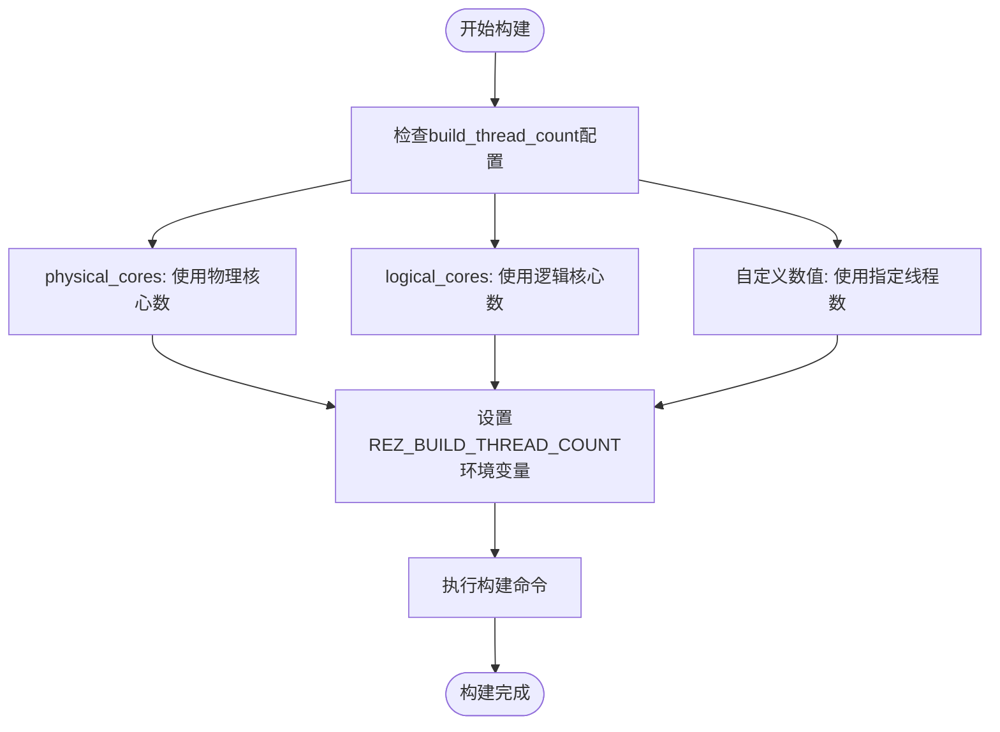
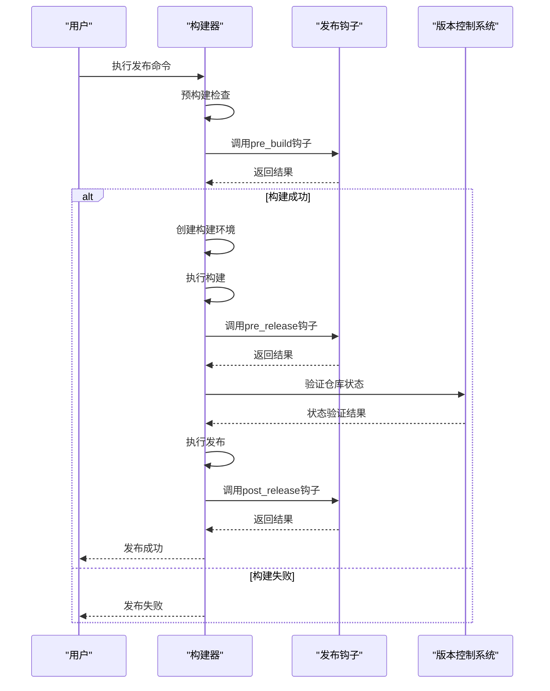
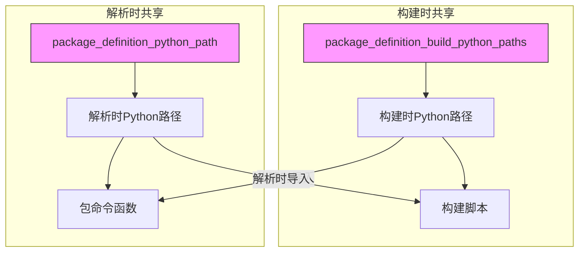
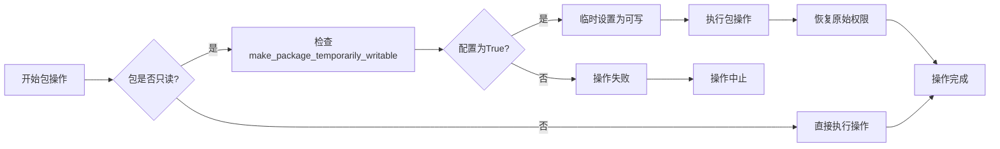
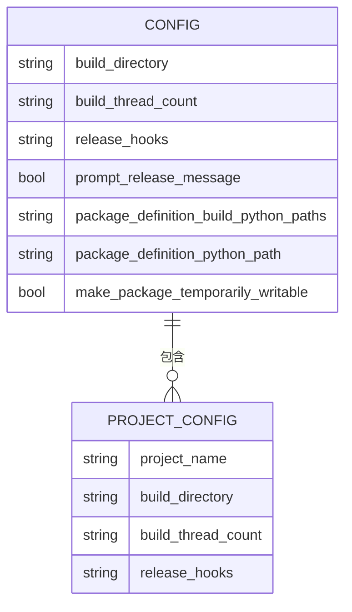

# 构建配置

<cite>
**本文档引用的文件**   
- [config.py](file://rez-3.3.0\src\rez\config.py)
- [build_process.py](file://rez-3.3.0\src\rez\build_process.py)
- [build_system.py](file://rez-3.3.0\src\rez\build_system.py)
- [release.py](file://rez-3.3.0\src\rez\cli\release.py)
- [release_hook.py](file://rez-3.3.0\src\rez\release_hook.py)
- [rezconfig.py](file://rez-3.3.0\src\rez\rezconfig.py)
- [local.py](file://rez-3.3.0\src\rezplugins\build_process\local.py)
- [cmake.py](file://rez-3.3.0\src\rezplugins\build_system\cmake.py)
- [command.py](file://rez-3.3.0\src\rezplugins\release_hook\command.py)
</cite>

## 目录
1. [构建配置概述](#构建配置概述)
2. [核心构建配置参数](#核心构建配置参数)
3. [构建线程数配置](#构建线程数配置)
4. [发布钩子配置](#发布钩子配置)
5. [包定义Python路径配置](#包定义python路径配置)
6. [高级选项配置](#高级选项配置)
7. [配置文件示例](#配置文件示例)

## 构建配置概述

Rez包管理系统的构建配置提供了丰富的选项来定制包的构建和发布过程。这些配置选项允许开发者优化构建性能、自动化发布流程，并在不同项目之间共享代码。构建配置主要通过`rezconfig.py`文件进行设置，该文件定义了构建目录、构建线程数、发布钩子等关键参数。

构建过程由`BuildProcess`类管理，它负责迭代包的变体，为每个变体创建正确的构建环境，并使用构建系统在每个解析的环境中运行。发布过程则通过`release`命令执行，它会构建并安装包到由`config.release_packages_path`确定的发布路径。

**Section sources**
- [build_process.py](file://rez-3.3.0\src\rez\build_process.py#L1-L100)
- [release.py](file://rez-3.3.0\src\rez\cli\release.py#L1-L50)

## 核心构建配置参数

Rez构建系统提供了多个核心配置参数来控制构建和发布行为。这些参数在`config.py`文件中定义，并通过`rezconfig.py`进行具体设置。

**Diagram sources **
- [build_process.py](file://rez-3.3.0\src\rez\build_process.py#L66-L165)
- [build_system.py](file://rez-3.3.0\src\rez\build_system.py#L103-L206)
- [config.py](file://rez-3.3.0\src\rez\config.py#L368-L496)

**Section sources**
- [config.py](file://rez-3.3.0\src\rez\config.py#L368-L496)
- [build_process.py](file://rez-3.3.0\src\rez\build_process.py#L66-L165)

## 构建线程数配置

`build_thread_count`参数用于控制构建系统使用的线程数，这对于优化构建性能至关重要。该参数在`config.py`中定义为`BuildThreadCount_`类型，支持正整数或特殊值"physical_cores"和"logical_cores"。

**Diagram sources **
- [config.py](file://rez-3.3.0\src\rez\config.py#L340-L363)
- [build_system.py](file://rez-3.3.0\src\rez\build_system.py#L225)

**Section sources**
- [config.py](file://rez-3.3.0\src\rez\config.py#L340-L363)
- [build_system.py](file://rez-3.3.0\src\rez\build_system.py#L225)

## 发布钩子配置

发布钩子（release hooks）允许在发布过程的不同阶段执行自定义行为。`release_hooks`参数在`config.py`中定义为`StrList`类型，用于指定要启用的钩子名称。

**Diagram sources **
- [release_hook.py](file://rez-3.3.0\src\rez\release_hook.py#L37-L132)
- [build_process.py](file://rez-3.3.0\src\rez\build_process.py#L345-L364)
- [command.py](file://rez-3.3.0\src\rezplugins\release_hook\command.py#L98-L123)

**Section sources**
- [release_hook.py](file://rez-3.3.0\src\rez\release_hook.py#L37-L132)
- [build_process.py](file://rez-3.3.0\src\rez\build_process.py#L345-L364)

## 包定义Python路径配置

Rez提供了两种机制来在构建时和解析时共享代码：`package_definition_build_python_paths`和`package_definition_python_path`。

**Diagram sources **
- [config.py](file://rez-3.3.0\src\rez\config.py#L368-L370)
- [developer_package.py](file://rez-3.3.0\src\rez\developer_package.py#L242)
- [rezconfig.py](file://rez-3.3.0\src\rez\rezconfig.py#L96-L125)

**Section sources**
- [config.py](file://rez-3.3.0\src\rez\config.py#L368-L370)
- [developer_package.py](file://rez-3.3.0\src\rez\developer_package.py#L242)
- [rezconfig.py](file://rez-3.3.0\src\rez\rezconfig.py#L96-L125)

## 高级选项配置

Rez提供了一些高级配置选项来处理特定的工作流需求。`make_package_temporarily_writable`选项允许在包被设置为只读时临时使其可写，这对于在现有包中发布变体或复制包时非常有用。

**Diagram sources **
- [config.py](file://rez-3.3.0\src\rez\config.py#L496)
- [local.py](file://rez-3.3.0\src\rezplugins\build_process\local.py#L158)
- [package_copy.py](file://rez-3.3.0\src\rez\package_copy.py#L282)

**Section sources**
- [config.py](file://rez-3.3.0\src\rez\config.py#L496)
- [local.py](file://rez-3.3.0\src\rezplugins\build_process\local.py#L158)

## 配置文件示例

以下是一个完整的`rezconfig.py`配置文件示例，展示了如何为不同项目定制构建流程：

**Diagram sources **
- [rezconfig.py](file://rez-3.3.0\src\rez\rezconfig.py#L771-L816)
- [config.py](file://rez-3.3.0\src\rez\config.py#L398-L440)

**Section sources**
- [rezconfig.py](file://rez-3.3.0\src\rez\rezconfig.py#L771-L816)