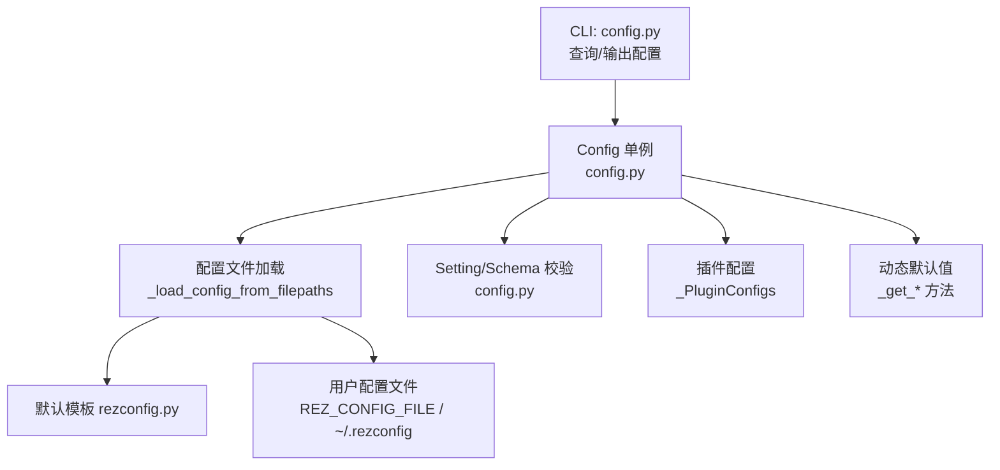
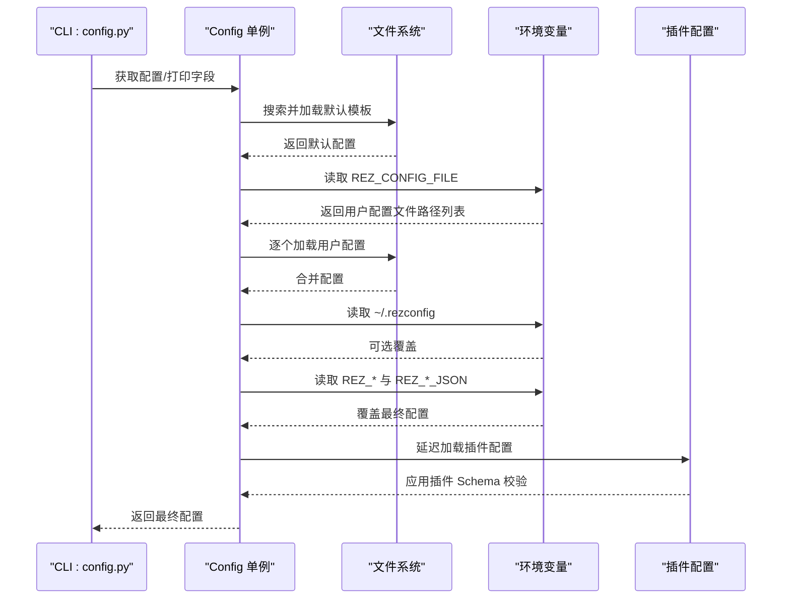
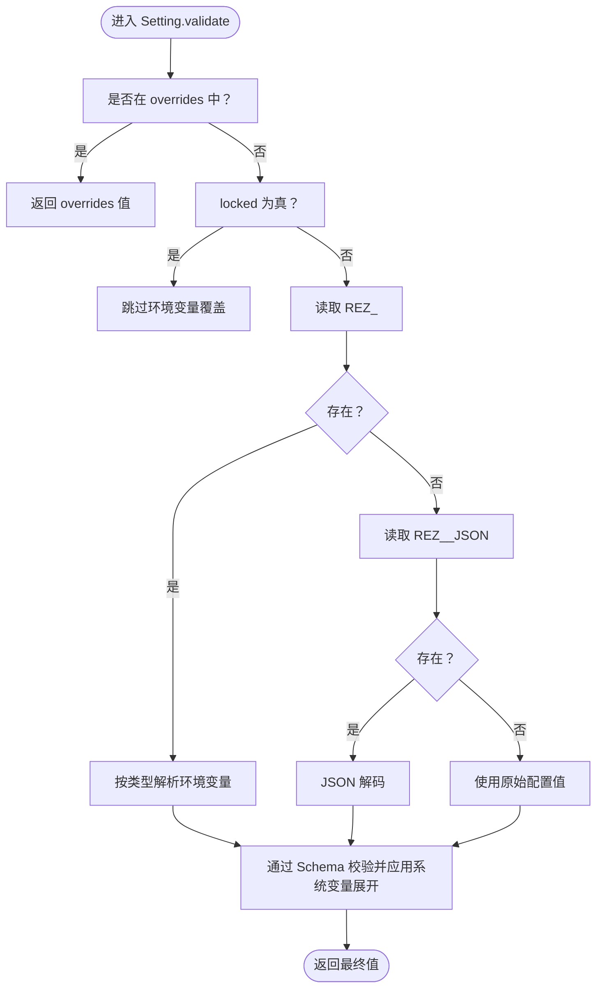
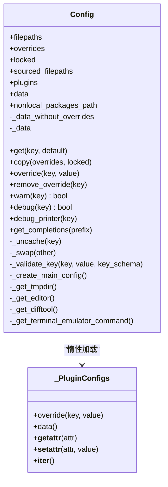
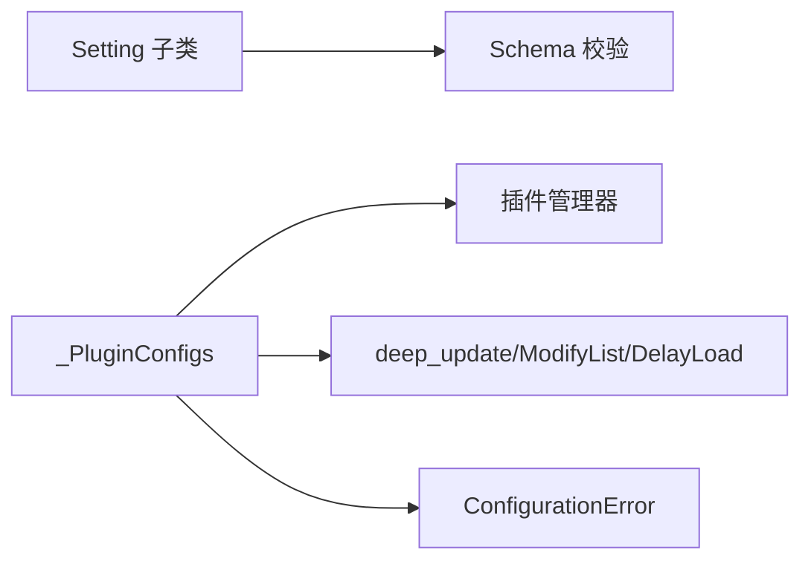

# 系统配置

<cite>
**本文引用的文件列表**
- [config.py](file://rez-3.3.0/src/rez/config.py)
- [rezconfig.py](file://rez-3.3.0/src/rez/rezconfig.py)
- [configuring_rez.rst](file://rez-3.3.0/docs/source/guides/configuring_rez.rst)
- [config.py（CLI）](file://rez-3.3.0/src/rez/cli/config.py)
- [logging_.py](file://rez-3.3.0/src/rez/utils/logging_.py)
- [data_utils.py](file://rez-3.3.0/src/rez/utils/data_utils.py)
- [exceptions.py](file://rez-3.3.0/src/rez/exceptions.py)
- [test_config.py](file://rez-3.3.0/src/rez/tests/test_config.py)
</cite>

## 目录
1. [简介](#简介)
2. [项目结构与入口](#项目结构与入口)
3. [核心组件](#核心组件)
4. [架构总览](#架构总览)
5. [详细组件分析](#详细组件分析)
6. [依赖关系分析](#依赖关系分析)
7. [性能与可扩展性](#性能与可扩展性)
8. [故障排查与调试](#故障排查与调试)
9. [结论](#结论)
10. [附录：配置项总览与分组](#附录配置项总览与分组)

## 简介
本文件系统化梳理 Rez 的系统配置机制，重点围绕两个关键模块：
- 配置定义与加载：config.py 中的 Setting、Config 类型系统与配置合并、优先级与动态默认值。
- 默认配置模板：rezconfig.py 提供的默认配置项与注释，覆盖路径、缓存、解析、环境、调试、构建/发布等主题。

同时结合 CLI 工具与测试用例，说明配置的动态加载、环境变量覆盖、JSON 覆盖、以及验证与错误处理流程；并给出调试与排障建议，帮助高级用户进行性能调优与安全加固。

## 项目结构与入口
- 配置定义与加载：位于 src/rez/config.py，包含 Setting 子类族、Config 主类、配置文件加载器与优先级规则。
- 默认配置模板：位于 src/rez/rezconfig.py，提供各功能域的默认配置项与注释说明。
- CLI 查询工具：位于 src/rez/cli/config.py，支持打印当前配置、搜索/来源文件列表、JSON 输出等。
- 日志与调试：位于 src/rez/utils/logging_.py，提供调试打印器与日志查看工具。
- 数据工具：位于 src/rez/utils/data_utils.py，提供 deep_update、ModifyList、DelayLoad 等数据结构与合并策略。
- 异常类型：位于 src/rez/exceptions.py，统一的 ConfigurationError 等异常类型。
- 测试用例：位于 src/rez/tests/test_config.py，覆盖环境变量覆盖、类型校验、插件配置等场景。

图表来源
- [config.py](file://rez-3.3.0/src/rez/config.py#L540-L805)
- [rezconfig.py](file://rez-3.3.0/src/rez/rezconfig.py#L1-L120)
- [config.py（CLI）](file://rez-3.3.0/src/rez/cli/config.py#L1-L66)

章节来源
- [config.py](file://rez-3.3.0/src/rez/config.py#L540-L805)
- [rezconfig.py](file://rez-3.3.0/src/rez/rezconfig.py#L1-L120)
- [config.py（CLI）](file://rez-3.3.0/src/rez/cli/config.py#L1-L66)

## 核心组件
- Setting/Setting 子类族：封装每种配置类型的解析与校验逻辑，支持从环境变量、JSON 环境变量、配置文件、动态默认值中获取值。
- Config：主配置类，负责多文件合并、覆盖、延迟加载插件配置、动态默认值、调试/警告开关、缓存属性等。
- 插件配置容器 _PluginConfigs：按需加载插件配置，应用 overrides 并进行插件特定 Schema 校验。
- 加载器：支持 .py 与 .yaml 两种格式，默认模板来自模块根目录的 rezconfig.py，用户配置可由 REZ_CONFIG_FILE 指定多个文件，且可禁用 ~/.rezconfig。
- 动态默认值：部分配置项在未显式设置时，根据平台或系统对象动态生成默认值。

章节来源
- [config.py](file://rez-3.3.0/src/rez/config.py#L51-L135)
- [config.py](file://rez-3.3.0/src/rez/config.py#L540-L805)
- [config.py](file://rez-3.3.0/src/rez/config.py#L807-L879)

## 架构总览
配置加载与优先级（高优先级覆盖低优先级）：
1) 默认模板（模块根目录的 rezconfig.py）
2) 多个用户配置文件（REZ_CONFIG_FILE 环境变量指定，以路径分隔符分隔）
3) 用户家目录配置（~/.rezconfig，除非设置了 REZ_DISABLE_HOME_CONFIG=1）
4) 环境变量覆盖（REZ_<SETTING>，列表/字典有特定格式；REZ_<SETTING>_JSON 支持 JSON 编码）
5) 包定义中的 config 段（仅对包构建/发布时生效）

图表来源
- [config.py](file://rez-3.3.0/src/rez/config.py#L754-L768)
- [config.py](file://rez-3.3.0/src/rez/config.py#L994-L1031)
- [config.py](file://rez-3.3.0/src/rez/config.py#L807-L879)
- [rezconfig.py](file://rez-3.3.0/src/rez/rezconfig.py#L1-L45)

章节来源
- [config.py](file://rez-3.3.0/src/rez/config.py#L754-L768)
- [config.py](file://rez-3.3.0/src/rez/config.py#L994-L1031)
- [rezconfig.py](file://rez-3.3.0/src/rez/rezconfig.py#L1-L45)

## 详细组件分析

### Setting/Setting 子类族与环境变量覆盖
- Setting 抽象基类：定义 validate 流程，依次检查 overrides、环境变量（REZ_<SETTING>）、JSON 环境变量（REZ_<SETTING>_JSON）、原始配置、动态默认值。
- 类型解析：
  - 字符串/字符：Str、Char
  - 列表：StrList、PathList（路径分隔符不同）
  - 数值：Int、Float
  - 布尔：Bool、OptionalBool、ForceOrBool（支持 "force"）
  - 字典：Dict、OptionalDict、OptionalDictOrDictList
  - 特殊枚举：SuiteVisibility_、VariantSelectMode_、RezToolsVisibility_、ExecutableScriptMode_、PreprocessMode_、BuildThreadCount_
- 环境变量解析：
  - 列表：逗号或空白分隔
  - 字典：逗号分隔键值对，冒号分隔键与值，数值会尝试转为 int/float
  - JSON：REZ_*_JSON 期望 JSON 字符串，失败抛出 ConfigurationError

图表来源
- [config.py](file://rez-3.3.0/src/rez/config.py#L80-L135)
- [config.py](file://rez-3.3.0/src/rez/config.py#L137-L295)

章节来源
- [config.py](file://rez-3.3.0/src/rez/config.py#L80-L135)
- [config.py](file://rez-3.3.0/src/rez/config.py#L137-L295)

### Config 主类与插件配置
- Config：
  - 多文件合并：_load_config_from_filepaths 逐个加载，支持 .py 与 .yaml，遇到不存在的扩展名自动尝试另一种格式。
  - 覆盖顺序：overrides > 文件合并 > 环境变量 > 动态默认值。
  - 插件配置：plugins 属性惰性加载，按插件类型获取配置并应用 deep_update 后进行插件 Schema 校验。
  - 动态默认值：_get_* 方法在未显式设置时提供默认值（如 tmpdir、editor 等）。
  - 调试/警告：warn/debug/debug_printer 统一控制调试输出。
- _PluginConfigs：
  - 读写保护：禁止直接 setattr，确保只读访问。
  - 惰性加载：首次访问某插件类型才加载并校验。
  - 覆盖：支持对插件配置进行 overrides 并清理缓存。

图表来源
- [config.py](file://rez-3.3.0/src/rez/config.py#L540-L805)
- [config.py](file://rez-3.3.0/src/rez/config.py#L807-L879)

章节来源
- [config.py](file://rez-3.3.0/src/rez/config.py#L540-L805)
- [config.py](file://rez-3.3.0/src/rez/config.py#L807-L879)

### 配置文件加载与优先级
- 默认模板：模块根目录的 rezconfig.py。
- 用户配置文件：REZ_CONFIG_FILE 可包含多个路径，以路径分隔符分隔；~/.rezconfig 在未设置 REZ_DISABLE_HOME_CONFIG=1 时生效。
- 环境变量覆盖：REZ_<SETTING> 与 REZ_<SETTING>_JSON。
- 包定义覆盖：在包定义文件的 config 段中覆盖所有其他配置（仅构建/发布阶段）。

章节来源
- [config.py](file://rez-3.3.0/src/rez/config.py#L754-L768)
- [config.py](file://rez-3.3.0/src/rez/config.py#L994-L1031)
- [rezconfig.py](file://rez-3.3.0/src/rez/rezconfig.py#L1-L45)

### CLI 查询与调试
- CLI 工具支持：
  - 打印指定字段值或完整配置（支持 JSON 输出）。
  - 列出搜索到的配置文件路径与实际来源文件路径。
- 调试输出：通过 warn/debug/debug_printer 控制，结合日志工具查看。

章节来源
- [config.py（CLI）](file://rez-3.3.0/src/rez/cli/config.py#L1-L66)
- [config.py](file://rez-3.3.0/src/rez/config.py#L612-L630)
- [logging_.py](file://rez-3.3.0/src/rez/utils/logging_.py#L1-L129)

## 依赖关系分析
- Setting/Schema：使用第三方 schema 库进行强类型校验，统一抛出 ConfigurationError。
- 数据工具：deep_update 支持 ModifyList 与嵌套字典合并；DelayLoad 支持从外部文件延迟加载。
- 插件管理：_PluginConfigs 通过插件管理器获取插件类型与 Schema，实现插件配置的独立校验。
- 异常体系：ConfigurationError 用于配置错误，便于定位配置文件与字段。

图表来源
- [config.py](file://rez-3.3.0/src/rez/config.py#L51-L135)
- [config.py](file://rez-3.3.0/src/rez/config.py#L807-L879)
- [data_utils.py](file://rez-3.3.0/src/rez/utils/data_utils.py#L1-L200)
- [exceptions.py](file://rez-3.3.0/src/rez/exceptions.py#L35-L40)

章节来源
- [config.py](file://rez-3.3.0/src/rez/config.py#L51-L135)
- [config.py](file://rez-3.3.0/src/rez/config.py#L807-L879)
- [data_utils.py](file://rez-3.3.0/src/rez/utils/data_utils.py#L1-L200)
- [exceptions.py](file://rez-3.3.0/src/rez/exceptions.py#L35-L40)

## 性能与可扩展性
- 惰性加载：Config 与 _PluginConfigs 使用缓存属性与惰性加载，避免不必要的开销。
- 缓存策略：本地资源缓存大小、memcached 压缩阈值、包缓存异步与空间缓冲等参数可调优。
- 线程与并发：构建线程数支持物理/逻辑核心数，避免过度并行导致资源争用。
- 插件隔离：插件配置独立 Schema 校验，避免全局配置影响插件稳定性。

章节来源
- [config.py](file://rez-3.3.0/src/rez/config.py#L340-L362)
- [rezconfig.py](file://rez-3.3.0/src/rez/rezconfig.py#L140-L184)
- [rezconfig.py](file://rez-3.3.0/src/rez/rezconfig.py#L222-L328)
- [rezconfig.py](file://rez-3.3.0/src/rez/rezconfig.py#L764-L800)

## 故障排查与调试
- 常见问题与定位：
  - 环境变量格式不正确：REZ_* 期望特定格式（列表/字典），REZ_*_JSON 期望 JSON 字符串。
  - 类型不匹配：Schema 校验失败会抛出 ConfigurationError，可通过 CLI 查看最终配置确认。
  - 插件配置错误：_PluginConfigs 对插件配置进行独立校验，错误信息包含插件类型。
  - 包定义覆盖：包定义中的 config 段仅在构建/发布时生效，注意区分运行时与构建时配置。
- 调试技巧：
  - 使用 CLI 打印完整配置或指定字段，配合 --json 输出便于设置 REZ_*_JSON。
  - 使用 debug_* 与 warn_* 开关控制调试输出。
  - 使用日志查看工具查看缓存与解析日志。

章节来源
- [config.py](file://rez-3.3.0/src/rez/config.py#L80-L135)
- [config.py](file://rez-3.3.0/src/rez/config.py#L807-L879)
- [config.py（CLI）](file://rez-3.3.0/src/rez/cli/config.py#L1-L66)
- [logging_.py](file://rez-3.3.0/src/rez/utils/logging_.py#L1-L129)
- [test_config.py](file://rez-3.3.0/src/rez/tests/test_config.py#L171-L214)

## 结论
Rez 的配置系统通过 Setting/Schema 类型系统、多文件合并与严格的优先级规则，提供了灵活、可扩展且可调试的配置能力。默认模板与用户配置文件共同构成完整的配置集，环境变量与 JSON 覆盖进一步增强了动态配置能力。插件配置的独立校验与惰性加载保证了系统的稳定性和性能。通过 CLI 与日志工具，用户可以高效地调试与优化配置。

## 附录：配置项总览与分组
以下配置项来源于默认模板与 Schema 定义，按功能分组（节选，非全部）：

- 路径与搜索
  - packages_path、local_packages_path、release_packages_path、tmpdir、context_tmpdir、package_definition_build_python_paths、package_definition_python_path、plugin_path、bind_module_path、standard_system_paths
  - 参考：[rezconfig.py](file://rez-3.3.0/src/rez/rezconfig.py#L56-L126)

- 缓存与资源
  - resolve_caching、cache_package_files、cache_listdir、resource_caching_maxsize、memcached_uri、memcached_package_file_min_compress_len、memcached_context_file_min_compress_len、memcached_listdir_min_compress_len、memcached_resolve_min_compress_len、cache_packages_path、read_package_cache、write_package_cache、package_cache_max_variant_days、package_cache_during_build、package_cache_local、package_cache_same_device、package_cache_async、package_cache_clean_limit、package_cache_log_days、package_cache_space_buffer、package_cache_used_threshold
  - 参考：[rezconfig.py](file://rez-3.3.0/src/rez/rezconfig.py#L140-L328)

- 包解析与策略
  - implicit_packages、platform_map、prune_failed_graph、variant_select_mode、package_filter、package_orderers、allow_unversioned_packages、error_on_missing_variant_requires
  - 参考：[rezconfig.py](file://rez-3.3.0/src/rez/rezconfig.py#L330-L473)

- 环境与命令注入
  - parent_variables、all_parent_variables、resetting_variables、all_resetting_variables、default_shell、terminal_emulator_command、new_session_popen_args、env_var_separators、pathed_env_vars、suite_visibility、rez_tools_visibility、package_commands_sourced_first、standard_system_paths
  - 参考：[rezconfig.py](file://rez-3.3.0/src/rez/rezconfig.py#L475-L570)

- 预处理与构建
  - package_preprocess_function、package_preprocess_mode、build_directory、build_thread_count、release_hooks、prompt_release_message、make_package_temporarily_writable
  - 参考：[rezconfig.py](file://rez-3.3.0/src/rez/rezconfig.py#L570-L800)

- 上下文跟踪与调试
  - context_tracking_host、context_tracking_amqp、context_tracking_context_fields、context_tracking_extra_fields、warn_shell_startup、warn_untimestamped、warn_all、warn_none、debug_file_loads、debug_plugins、debug_package_release、debug_bind_modules、debug_resources、debug_package_exclusions、debug_resolve_memcache、debug_memcache、debug_context_tracking、debug_all、debug_none、catch_rex_errors、shell_error_truncate_cap
  - 参考：[rezconfig.py](file://rez-3.3.0/src/rez/rezconfig.py#L635-L763)

- 颜色与样式（GUI）
  - critical_styles、error_styles、warning_styles、info_styles、debug_styles、heading_styles、local_styles、implicit_styles、ephemeral_styles、alias_styles、critical_fore、critical_back、error_fore、error_back、warning_fore、warning_back、info_fore、info_back、debug_fore、debug_back、heading_fore、heading_back、local_fore、local_back、implicit_fore、implicit_back、ephemeral_fore、ephemeral_back、alias_fore、alias_back、use_pyside、use_pyqt、gui_threads
  - 参考：[rezconfig.py](file://rez-3.3.0/src/rez/rezconfig.py#L390-L513)

- 其他通用
  - default_relocatable、default_relocatable_per_package、default_relocatable_per_repository、default_cachable、default_cachable_per_package、default_cachable_per_repository、dot_image_format、documentation_url、suite_alias_prefix_char、create_executable_script_mode、variant_shortlinks_dirname、set_prompt、prefix_prompt、optionvars
  - 参考：[rezconfig.py](file://rez-3.3.0/src/rez/rezconfig.py#L186-L328)

- 验证与错误处理
  - Schema 校验失败抛出 ConfigurationError；插件配置校验失败抛出 ConfigurationError；环境变量格式错误抛出 ConfigurationError。
  - 参考：[config.py](file://rez-3.3.0/src/rez/config.py#L70-L78)，[config.py](file://rez-3.3.0/src/rez/config.py#L807-L879)，[exceptions.py](file://rez-3.3.0/src/rez/exceptions.py#L35-L40)

- 实际使用示例（路径引用）
  - 设置缓存路径：参考 [rezconfig.py](file://rez-3.3.0/src/rez/rezconfig.py#L263-L266)
  - 设置日志级别：参考 [rezconfig.py](file://rez-3.3.0/src/rez/rezconfig.py#L700-L763)
  - 设置网络超时（AMQP）：参考 [rezconfig.py](file://rez-3.3.0/src/rez/rezconfig.py#L670-L679)
  - 设置解析器策略（variant_select_mode）：参考 [rezconfig.py](file://rez-3.3.0/src/rez/rezconfig.py#L396-L397)
  - 设置包预处理函数：参考 [rezconfig.py](file://rez-3.3.0/src/rez/rezconfig.py#L570-L633)
  - 通过 CLI 查询配置：参考 [config.py（CLI）](file://rez-3.3.0/src/rez/cli/config.py#L1-L66)
  - 通过环境变量覆盖配置：参考 [config.py](file://rez-3.3.0/src/rez/config.py#L80-L135)