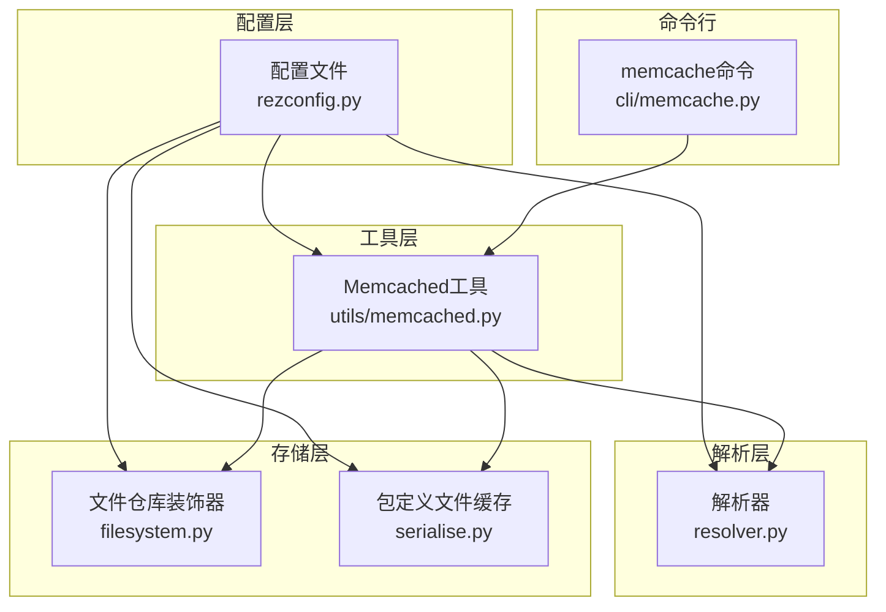
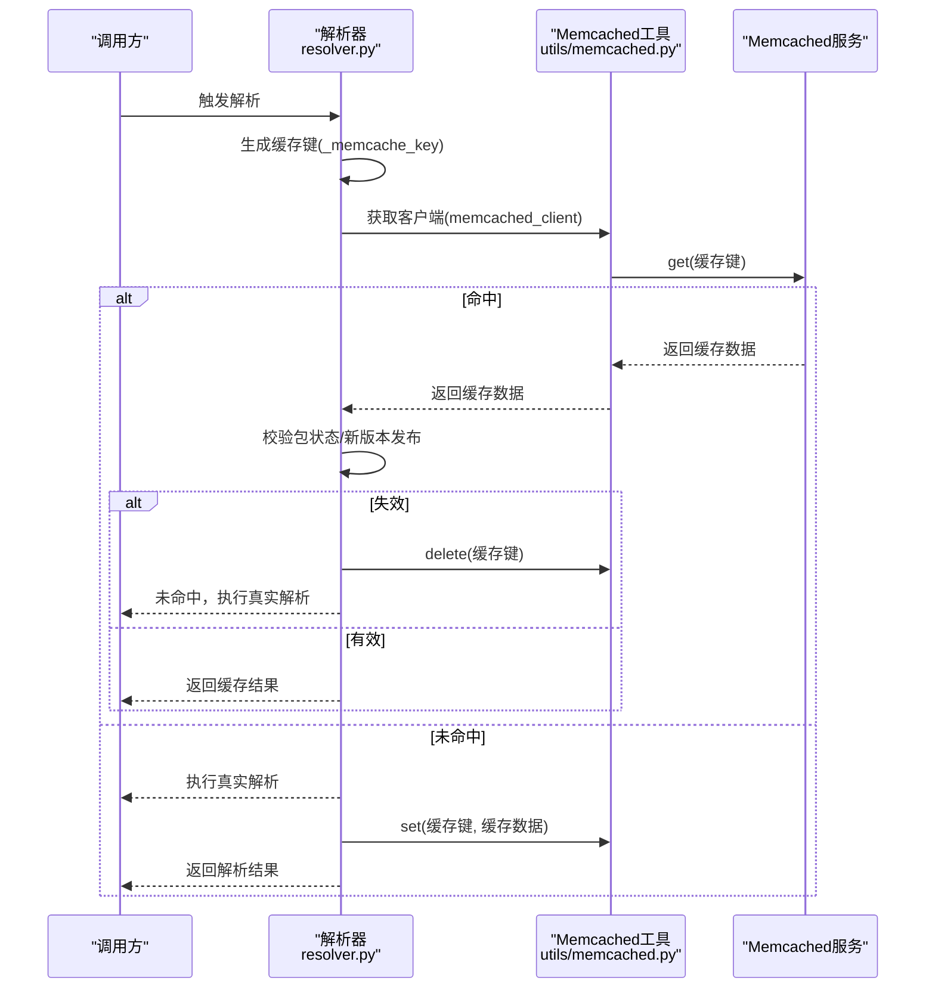
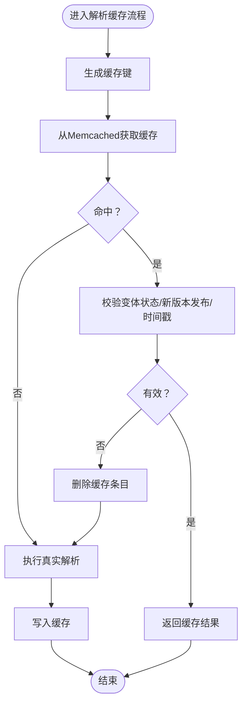
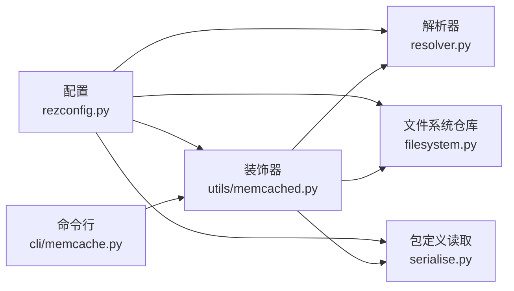

# Memcached元数据缓存

<cite>
**本文引用的文件列表**
- [caching.rst](file://rez-3.3.0/docs/source/caching.rst)
- [rezconfig.py](file://rez-3.3.0/src/rez/rezconfig.py)
- [memcached.py](file://rez-3.3.0/src/rez/utils/memcached.py)
- [resolver.py](file://rez-3.3.0/src/rez/resolver.py)
- [filesystem.py](file://rez-3.3.0/src/rezplugins/package_repository/filesystem.py)
- [serialise.py](file://rez-3.3.0/src/rez/serialise.py)
- [memcache.py](file://rez-3.3.0/src/rez/cli/memcache.py)
</cite>

## 目录
1. [简介](#简介)
2. [项目结构与定位](#项目结构与定位)
3. [核心组件总览](#核心组件总览)
4. [架构概览](#架构概览)
5. [关键组件详解](#关键组件详解)
6. [依赖关系分析](#依赖关系分析)
7. [性能与压缩策略](#性能与压缩策略)
8. [高并发配置与最佳实践](#高并发配置与最佳实践)
9. [故障排查与监控](#故障排查与监控)
10. [结论](#结论)

## 简介
本篇文档围绕Rez中基于Memcached的元数据缓存进行系统化说明，重点覆盖以下方面：
- 如何通过memcached_uri配置单个或多个Memcached服务器地址
- 如何使用memcached_resolve_min_compress_len、memcached_package_file_min_compress_len等参数优化缓存压缩策略
- 高并发场景下如何配置Memcached以提升resolve性能
- 缓存失效机制与监控调试的最佳实践

## 项目结构与定位
Rez的Memcached缓存能力由多处模块协同实现：
- 配置层：在配置文件中启用缓存并设置服务器地址与压缩阈值
- 工具层：封装Memcached客户端、连接池与装饰器，统一缓存入口
- 解析层：在解析流程中读取/写入缓存，并按规则校验缓存有效性
- 存储层：对包定义文件读取、目录遍历等进行缓存装饰
- 命令行工具：提供统计查询、预热、重置统计等运维能力

图表来源
- [rezconfig.py](file://rez-3.3.0/src/rez/rezconfig.py#L140-L184)
- [memcached.py](file://rez-3.3.0/src/rez/utils/memcached.py#L225-L330)
- [resolver.py](file://rez-3.3.0/src/rez/resolver.py#L200-L399)
- [filesystem.py](file://rez-3.3.0/src/rezplugins/package_repository/filesystem.py#L531-L564)
- [serialise.py](file://rez-3.3.0/src/rez/serialise.py#L123-L157)
- [memcache.py](file://rez-3.3.0/src/rez/cli/memcache.py#L77-L170)

章节来源
- [rezconfig.py](file://rez-3.3.0/src/rez/rezconfig.py#L140-L184)
- [caching.rst](file://rez-3.3.0/docs/source/caching.rst#L32-L58)

## 核心组件总览
- 配置项（配置文件）：resolve_caching、cache_package_files、cache_listdir、memcached_uri、各类min_compress_len
- 工具函数：memcached装饰器、memcached_client上下文管理器、pool_memcached_connections连接池装饰器、Client包装类
- 解析流程：在resolver中读取/写入缓存，校验包变更与新版本发布
- 存储装饰：对包定义文件读取、目录遍历进行缓存装饰
- 命令行：统计、预热、刷新、轮询

章节来源
- [rezconfig.py](file://rez-3.3.0/src/rez/rezconfig.py#L140-L184)
- [memcached.py](file://rez-3.3.0/src/rez/utils/memcached.py#L225-L330)
- [resolver.py](file://rez-3.3.0/src/rez/resolver.py#L200-L399)
- [filesystem.py](file://rez-3.3.0/src/rezplugins/package_repository/filesystem.py#L531-L564)
- [serialise.py](file://rez-3.3.0/src/rez/serialise.py#L123-L157)
- [memcache.py](file://rez-3.3.0/src/rez/cli/memcache.py#L77-L170)

## 架构概览
下面的序列图展示了“解析时从Memcached读取缓存”的典型流程，包括缓存键生成、命中/未命中处理、以及缓存失效校验逻辑。

图表来源
- [resolver.py](file://rez-3.3.0/src/rez/resolver.py#L200-L399)
- [memcached.py](file://rez-3.3.0/src/rez/utils/memcached.py#L225-L330)

## 关键组件详解

### 1) 配置项与启用方式
- 启用缓存：在配置文件中设置resolve_caching、cache_package_files、cache_listdir为True
- 服务器地址：memcached_uri支持字符串或字符串列表，形如["host:port"]或["host1:port","host2:port"]
- 压缩阈值：memcached_resolve_min_compress_len、memcached_package_file_min_compress_len、memcached_listdir_min_compress_len等

章节来源
- [rezconfig.py](file://rez-3.3.0/src/rez/rezconfig.py#L140-L184)
- [caching.rst](file://rez-3.3.0/docs/source/caching.rst#L32-L58)

### 2) memcached_uri配置方法
- 单机：memcached_uri = ["127.0.0.1:11211"]
- 多机：memcached_uri = ["192.168.1.10:11211","192.168.1.11:11211","192.168.1.12:11211"]
- 注意：配置需为列表格式；若为空列表则不启用Memcached缓存

章节来源
- [caching.rst](file://rez-3.3.0/docs/source/caching.rst#L32-L58)
- [rezconfig.py](file://rez-3.3.0/src/rez/rezconfig.py#L164-L167)

### 3) 缓存装饰器与连接池
- memcached装饰器：用于对函数进行缓存装饰，支持自定义key、压缩阈值、过期时间、调试模式
- memcached_client上下文管理器：共享同一进程内的Memcached实例，减少连接数
- pool_memcached_connections装饰器：对可能多次访问Memcached的函数进行连接池化

章节来源
- [memcached.py](file://rez-3.3.0/src/rez/utils/memcached.py#L225-L330)

### 4) 包定义文件缓存
- 对包定义文件读取进行缓存装饰，键由文件路径、格式、回调函数签名与文件状态构成
- 使用memcached装饰器，min_compress_len来自配置项memcached_package_file_min_compress_len

章节来源
- [serialise.py](file://rez-3.3.0/src/rez/serialise.py#L123-L157)
- [rezconfig.py](file://rez-3.3.0/src/rez/rezconfig.py#L169-L171)

### 5) 目录遍历缓存
- 文件系统仓库对族目录与版本目录的遍历进行缓存装饰
- 使用memcached装饰器，min_compress_len来自配置项memcached_listdir_min_compress_len
- 当cache_listdir为False时，装饰器不会使用Memcached

章节来源
- [filesystem.py](file://rez-3.3.0/src/rezplugins/package_repository/filesystem.py#L531-L564)
- [rezconfig.py](file://rez-3.3.0/src/rez/rezconfig.py#L154-L157)

### 6) 解析缓存与失效机制
- 解析缓存键包含请求包集合、仓库标识、过滤器哈希、排序器哈希、构建/测试标记、是否裁剪失败图等
- 读取缓存后，会校验：
  - 变体状态是否变化（文件修改时间等）
  - 是否有新版本发布导致结果改变
  - 若带时间戳且时间早于最新发布，则仅可复用相同时间戳的缓存
- 若任一条件不满足，删除该缓存条目并重新解析

图表来源
- [resolver.py](file://rez-3.3.0/src/rez/resolver.py#L200-L399)

章节来源
- [resolver.py](file://rez-3.3.0/src/rez/resolver.py#L200-L399)

## 依赖关系分析
- 配置依赖：所有缓存功能均依赖配置项resolve_caching、cache_package_files、cache_listdir、memcached_uri及各min_compress_len
- 工具依赖：解析器、文件系统仓库、包定义读取均依赖utils/memcached.py提供的装饰器与客户端
- 命令行依赖：CLI通过utils/memcached.py的Client接口进行统计、预热、刷新等操作

图表来源
- [rezconfig.py](file://rez-3.3.0/src/rez/rezconfig.py#L140-L184)
- [memcached.py](file://rez-3.3.0/src/rez/utils/memcached.py#L225-L330)
- [resolver.py](file://rez-3.3.0/src/rez/resolver.py#L200-L399)
- [filesystem.py](file://rez-3.3.0/src/rezplugins/package_repository/filesystem.py#L531-L564)
- [serialise.py](file://rez-3.3.0/src/rez/serialise.py#L123-L157)
- [memcache.py](file://rez-3.3.0/src/rez/cli/memcache.py#L77-L170)

## 性能与压缩策略
- 压缩阈值
  - memcached_resolve_min_compress_len：解析结果缓存的压缩阈值
  - memcached_package_file_min_compress_len：包定义文件缓存的压缩阈值
  - memcached_listdir_min_compress_len：目录遍历缓存的压缩阈值
  - memcached_context_file_min_compress_len：上下文文件缓存的压缩阈值
- 建议
  - 对大对象（包定义、解析结果）适当降低阈值以提升网络传输效率
  - 对小对象（目录列表）可提高阈值避免过度压缩带来的CPU开销
  - 在高并发场景下，建议开启连接池（pool_memcached_connections），减少连接建立成本

章节来源
- [rezconfig.py](file://rez-3.3.0/src/rez/rezconfig.py#L169-L183)
- [memcached.py](file://rez-3.3.0/src/rez/utils/memcached.py#L248-L265)

## 高并发配置与最佳实践

### 1) 连接池与共享客户端
- 使用memcached_client上下文管理器确保同一进程内共享Memcached实例，减少连接数
- 对频繁访问Memcached的函数使用pool_memcached_connections装饰器，集中管理连接生命周期

章节来源
- [memcached.py](file://rez-3.3.0/src/rez/utils/memcached.py#L225-L265)

### 2) 多服务器部署与一致性
- 在memcached_uri中配置多个服务器地址，形成冗余与负载分担
- 结合命令行工具进行健康检查与统计，确保服务可用性

章节来源
- [caching.rst](file://rez-3.3.0/docs/source/caching.rst#L32-L58)
- [memcache.py](file://rez-3.3.0/src/rez/cli/memcache.py#L77-L170)

### 3) 缓存预热
- 使用命令行工具对可见包进行预热，提前加载包定义到缓存，降低首次解析延迟

章节来源
- [memcache.py](file://rez-3.3.0/src/rez/cli/memcache.py#L102-L119)

### 4) 调试与日志
- 开启debug_memcache后，Memcached键将保持人类可读形式，便于在前台运行的memcached服务中查看
- 通过debug_resolve_memcache与debug_file_loads等配置项辅助定位问题

章节来源
- [rezconfig.py](file://rez-3.3.0/src/rez/rezconfig.py#L736-L743)
- [memcached.py](file://rez-3.3.0/src/rez/utils/memcached.py#L1-L120)

## 故障排查与监控

### 1) 常见问题
- 无法连接服务器：检查memcached_uri格式与端口连通性
- 缓存命中率低：确认min_compress_len设置是否合理，以及是否存在频繁的包变更导致缓存失效
- 高并发下连接抖动：启用连接池与共享客户端，减少连接创建频率

章节来源
- [memcache.py](file://rez-3.3.0/src/rez/cli/memcache.py#L115-L157)
- [memcached.py](file://rez-3.3.0/src/rez/utils/memcached.py#L225-L265)

### 2) 统计与诊断
- 使用命令行工具查看命中/未命中统计、内存使用率、命中率等
- 支持重置统计、持续轮询、预热等运维操作

章节来源
- [memcache.py](file://rez-3.3.0/src/rez/cli/memcache.py#L77-L170)

### 3) 缓存失效机制验证
- 新版本发布导致缓存失效：解析器会检测新版本并删除旧缓存条目
- 包文件变更导致缓存失效：解析器会检测变体状态变化并删除缓存条目

章节来源
- [resolver.py](file://rez-3.3.0/src/rez/resolver.py#L200-L399)

## 结论
通过合理配置memcached_uri与各类min_compress_len参数，并结合连接池、预热与统计监控，可在高并发场景下显著提升Rez解析性能。同时，解析器内置的失效机制确保了缓存结果的正确性与一致性。建议在生产环境中：
- 明确memcached_uri与min_compress_len的阈值策略
- 启用连接池与共享客户端
- 定期预热常用包定义
- 使用命令行工具进行统计与健康检查