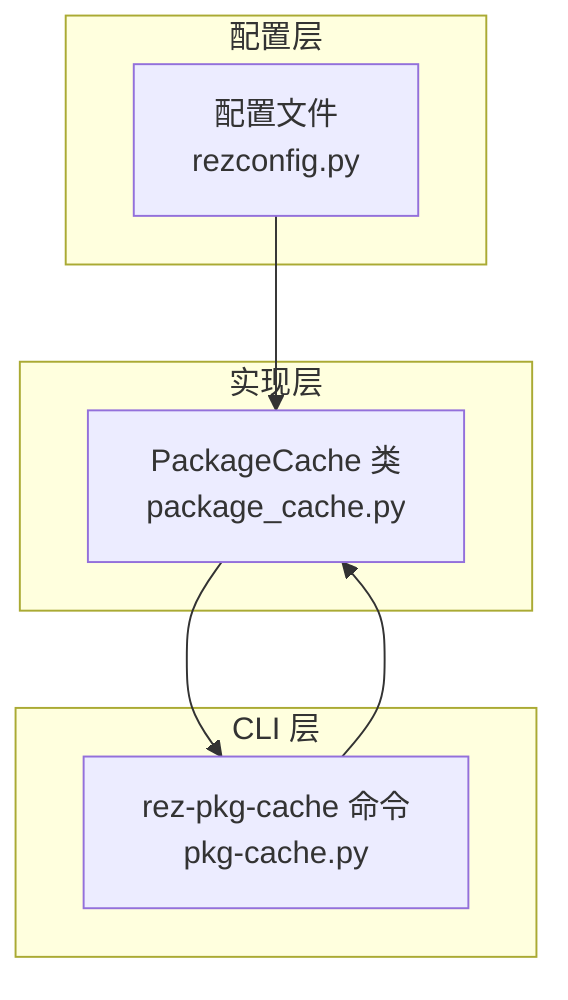
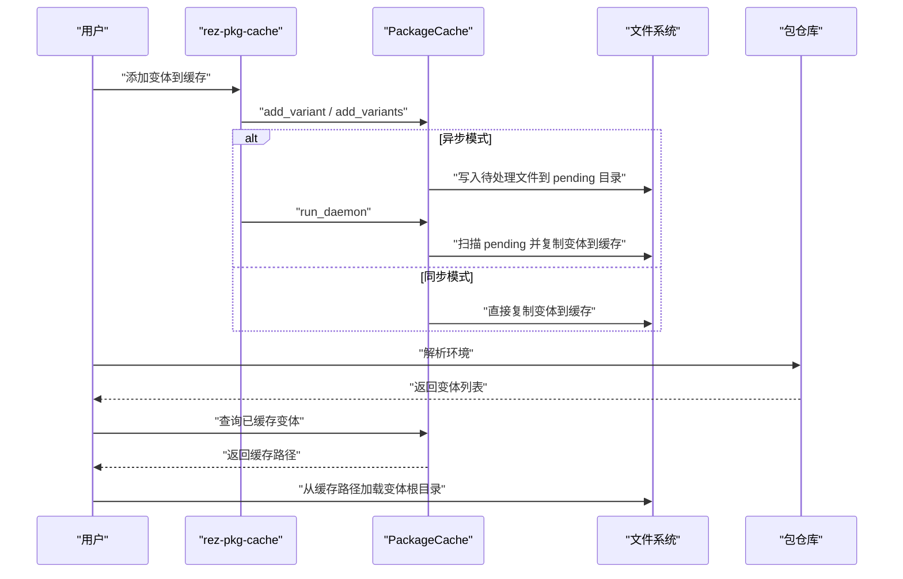
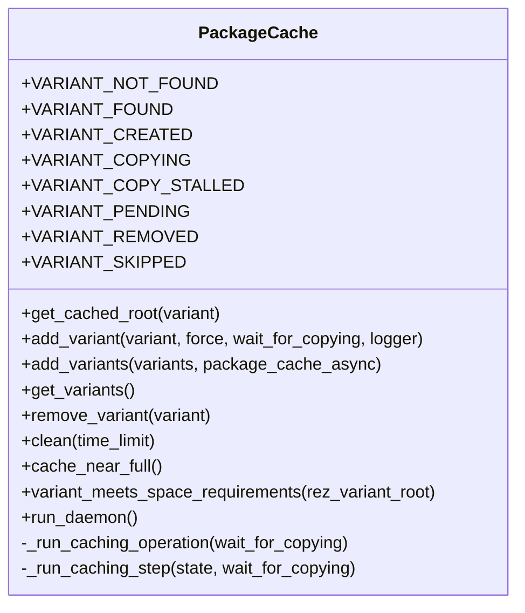
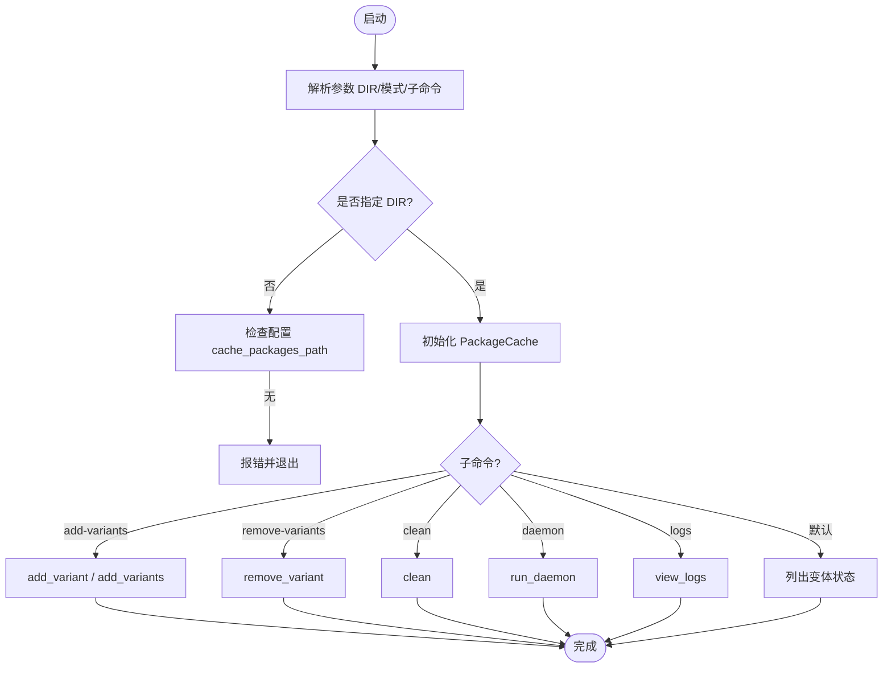
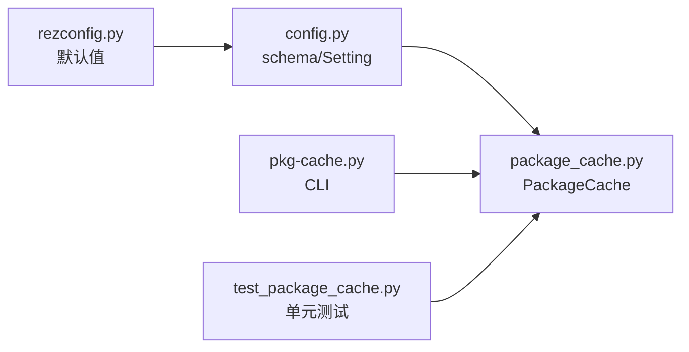
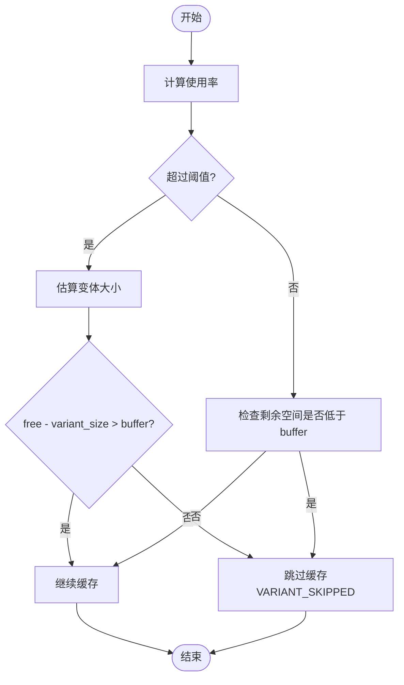

# 本地包内容缓存

<cite>
**本文引用的文件**
- [package_cache.py](file://rez-3.3.0/src/rez/package_cache.py)
- [pkg-cache.py](file://rez-3.3.0/src/rez/cli/pkg-cache.py)
- [caching.rst](file://rez-3.3.0/docs/source/caching.rst)
- [rezconfig.py](file://rez-3.3.0/src/rez/rezconfig.py)
- [config.py](file://rez-3.3.0/src/rez/config.py)
- [test_package_cache.py](file://rez-3.3.0/src/rez/tests/test_package_cache.py)
</cite>

## 目录
1. [简介](#简介)
2. [项目结构与定位](#项目结构与定位)
3. [核心组件与职责](#核心组件与职责)
4. [架构总览](#架构总览)
5. [详细组件分析](#详细组件分析)
6. [依赖关系分析](#依赖关系分析)
7. [性能与空间管理](#性能与空间管理)
8. [故障排查与日志](#故障排查与日志)
9. [结论与最佳实践](#结论与最佳实践)
10. [附录：配置参数速查](#附录配置参数速查)

## 简介
本文件面向需要在大规模环境中稳定、高效地使用 Rez 本地包内容缓存（Package Cache）的用户，系统性讲解以下关键主题：
- 如何启用并配置本地包内容缓存：cache_packages_path、read_package_cache、write_package_cache
- 如何通过 package_cache_clean_limit、package_cache_used_threshold 等参数进行磁盘空间控制
- 如何利用 package_cache_during_build、package_cache_async 等参数优化构建与解析流程
- 在大规模部署中减少共享存储 I/O 压力的实践
- 高级用户的缓存清理策略与性能调优建议

## 项目结构与定位
Rez 的本地包内容缓存由“缓存实现”“命令行工具”“配置项”三部分组成：
- 缓存实现：PackageCache 类负责变体拷贝、状态管理、异步守护进程、清理等
- 命令行工具：rez-pkg-cache 提供查看、添加、删除、清理、日志等功能
- 配置项：在配置文件中设置缓存路径、读写开关、阈值、异步模式等

图表来源
- [package_cache.py](file://rez-3.3.0/src/rez/package_cache.py#L1-L120)
- [pkg-cache.py](file://rez-3.3.0/src/rez/cli/pkg-cache.py#L140-L226)
- [rezconfig.py](file://rez-3.3.0/src/rez/rezconfig.py#L263-L300)

章节来源
- [package_cache.py](file://rez-3.3.0/src/rez/package_cache.py#L1-L120)
- [pkg-cache.py](file://rez-3.3.0/src/rez/cli/pkg-cache.py#L140-L226)
- [rezconfig.py](file://rez-3.3.0/src/rez/rezconfig.py#L263-L300)

## 核心组件与职责
- PackageCache：负责变体缓存的增删改查、状态机、异步守护、磁盘空间控制、清理策略
- CLI（rez-pkg-cache）：提供交互式查看、添加、删除、清理、日志查看能力
- 配置系统：提供 cache_packages_path、read_package_cache、write_package_cache、package_cache_* 系列参数

章节来源
- [package_cache.py](file://rez-3.3.0/src/rez/package_cache.py#L1-L120)
- [pkg-cache.py](file://rez-3.3.0/src/rez/cli/pkg-cache.py#L1-L120)
- [rezconfig.py](file://rez-3.3.0/src/rez/rezconfig.py#L263-L300)

## 架构总览
本地包内容缓存的整体工作流如下：
- 解析环境时，若开启 write_package_cache，则根据 package_cache_async 决定同步或异步触发缓存生成；缓存生成通过“待处理队列 + 守护进程”的方式执行
- 运行时，若开启 read_package_cache，则优先从本地缓存路径加载变体根目录，避免共享存储 I/O
- 清理策略通过 package_cache_clean_limit 或定期执行 --clean 控制缓存大小

图表来源
- [pkg-cache.py](file://rez-3.3.0/src/rez/cli/pkg-cache.py#L140-L226)
- [package_cache.py](file://rez-3.3.0/src/rez/package_cache.py#L495-L772)

章节来源
- [pkg-cache.py](file://rez-3.3.0/src/rez/cli/pkg-cache.py#L140-L226)
- [package_cache.py](file://rez-3.3.0/src/rez/package_cache.py#L495-L772)

## 详细组件分析

### PackageCache 类与状态机
PackageCache 负责：
- 变体缓存：add_variant/add_variants
- 状态查询：get_cached_root/get_variants
- 清理：clean/remove_variant
- 空间控制：cache_near_full/variant_meets_space_requirements
- 守护进程：run_daemon/_run_caching_operation/_run_caching_step

图表来源
- [package_cache.py](file://rez-3.3.0/src/rez/package_cache.py#L66-L120)
- [package_cache.py](file://rez-3.3.0/src/rez/package_cache.py#L178-L208)
- [package_cache.py](file://rez-3.3.0/src/rez/package_cache.py#L209-L416)
- [package_cache.py](file://rez-3.3.0/src/rez/package_cache.py#L418-L483)
- [package_cache.py](file://rez-3.3.0/src/rez/package_cache.py#L484-L772)

章节来源
- [package_cache.py](file://rez-3.3.0/src/rez/package_cache.py#L66-L120)
- [package_cache.py](file://rez-3.3.0/src/rez/package_cache.py#L178-L208)
- [package_cache.py](file://rez-3.3.0/src/rez/package_cache.py#L209-L416)
- [package_cache.py](file://rez-3.3.0/src/rez/package_cache.py#L418-L483)
- [package_cache.py](file://rez-3.3.0/src/rez/package_cache.py#L484-L772)

### 命令行工具（rez-pkg-cache）
- 查看缓存状态、添加/移除变体、清理、查看日志
- 支持覆盖全局配置的 package_cache_async 模式
- 当缓存接近阈值时会提示剩余空间与缓冲区

图表来源
- [pkg-cache.py](file://rez-3.3.0/src/rez/cli/pkg-cache.py#L140-L226)

章节来源
- [pkg-cache.py](file://rez-3.3.0/src/rez/cli/pkg-cache.py#L140-L226)

### 配置项与参数详解
以下参数均来自配置文件，支持环境变量覆盖（REZ_前缀）。

- 基础启用与路径
  - cache_packages_path：缓存根目录路径。未设置则禁用本地包内容缓存
  - read_package_cache：运行时是否从本地缓存读取变体
  - write_package_cache：创建/源上下文时是否写入本地缓存

- 空间与阈值控制
  - package_cache_space_buffer：缓存可用空间低于此值时停止新增缓存（字节）
  - package_cache_used_threshold：缓存使用率超过此百分比时启用“变体尺寸校验”，避免缓存越界
  - package_cache_max_variant_days：未使用天数超过该值的变体会被清理（0 表示不按时间清理）

- 清理与异步
  - package_cache_clean_limit：每次更新缓存时最多花费的时间（秒），用于“边写边清”
  - package_cache_async：是否异步缓存（True 推荐，避免阻塞解析）

- 构建行为
  - package_cache_during_build：是否在构建期间缓存变体

- 设备与本地限制
  - package_cache_local：是否允许缓存本地包（默认 False）
  - package_cache_same_device：是否允许与缓存位于同一物理设备上的包被缓存（默认 False）

章节来源
- [rezconfig.py](file://rez-3.3.0/src/rez/rezconfig.py#L263-L300)
- [config.py](file://rez-3.3.0/src/rez/config.py#L450-L460)

## 依赖关系分析
- PackageCache 依赖配置系统（config）读取上述参数
- CLI 依赖 PackageCache 执行缓存操作
- 测试用例验证了空间阈值、清理逻辑、异步/同步模式的行为

图表来源
- [config.py](file://rez-3.3.0/src/rez/config.py#L450-L460)
- [rezconfig.py](file://rez-3.3.0/src/rez/rezconfig.py#L263-L300)
- [package_cache.py](file://rez-3.3.0/src/rez/package_cache.py#L178-L208)
- [pkg-cache.py](file://rez-3.3.0/src/rez/cli/pkg-cache.py#L140-L226)
- [test_package_cache.py](file://rez-3.3.0/src/rez/tests/test_package_cache.py#L291-L342)

章节来源
- [config.py](file://rez-3.3.0/src/rez/config.py#L450-L460)
- [rezconfig.py](file://rez-3.3.0/src/rez/rezconfig.py#L263-L300)
- [package_cache.py](file://rez-3.3.0/src/rez/package_cache.py#L178-L208)
- [pkg-cache.py](file://rez-3.3.0/src/rez/cli/pkg-cache.py#L140-L226)
- [test_package_cache.py](file://rez-3.3.0/src/rez/tests/test_package_cache.py#L291-L342)

## 性能与空间管理

### 磁盘空间控制策略
- 使用 package_cache_used_threshold 和 package_cache_space_buffer 实现“两阶段”保护：
  - 当使用率超过阈值时，先估算目标变体大小，确保不会跌破缓冲区
  - 当可用空间低于缓冲区阈值时，拒绝新增缓存
- 通过 package_cache_clean_limit 在写入过程中“边写边清”，降低峰值占用
- 通过 package_cache_max_variant_days 定期清理长期未使用的变体

图表来源
- [package_cache.py](file://rez-3.3.0/src/rez/package_cache.py#L178-L208)
- [package_cache.py](file://rez-3.3.0/src/rez/package_cache.py#L209-L416)
- [pkg-cache.py](file://rez-3.3.0/src/rez/cli/pkg-cache.py#L96-L110)

章节来源
- [package_cache.py](file://rez-3.3.0/src/rez/package_cache.py#L178-L208)
- [package_cache.py](file://rez-3.3.0/src/rez/package_cache.py#L209-L416)
- [pkg-cache.py](file://rez-3.3.0/src/rez/cli/pkg-cache.py#L96-L110)

### 优化构建流程
- package_cache_during_build：构建期间启用缓存，可减少构建过程中的重复拷贝
- package_cache_async：推荐保持为 True，避免解析阻塞；如需调试可临时切换为同步模式

章节来源
- [caching.rst](file://rez-3.3.0/docs/source/caching.rst#L94-L121)
- [rezconfig.py](file://rez-3.3.0/src/rez/rezconfig.py#L278-L299)

### 大规模部署实践
- 将 cache_packages_path 指向本地 SSD 或高吞吐 NVMe，显著降低共享存储 I/O
- 设置合理的 package_cache_used_threshold 与 package_cache_space_buffer，避免缓存占满磁盘
- 使用 package_cache_clean_limit 与周期性 --clean，维持缓存健康大小
- 对于跨设备场景，合理设置 package_cache_same_device 与 package_cache_local，避免不必要的缓存

章节来源
- [caching.rst](file://rez-3.3.0/docs/source/caching.rst#L183-L208)
- [rezconfig.py](file://rez-3.3.0/src/rez/rezconfig.py#L263-L300)

## 故障排查与日志
- 查看缓存状态：使用 CLI 默认输出，关注“cached/copying/stalled/pending”等状态
- 查看日志：使用 --logs 查看守护进程日志，定位复制卡住或失败问题
- 常见问题
  - VARIANT_COPY_STALLED：通常由复制中断导致，需执行 --clean 清理后重试
  - VARIANT_SKIPPED：缓存空间不足或变体过大，调整阈值或清理后再试
  - VARIANT_COPYING：其他进程正在复制，等待或使用同步模式

章节来源
- [pkg-cache.py](file://rez-3.3.0/src/rez/cli/pkg-cache.py#L140-L226)
- [package_cache.py](file://rez-3.3.0/src/rez/package_cache.py#L624-L747)

## 结论与最佳实践
- 启用本地包内容缓存的核心在于：正确配置 cache_packages_path、read_package_cache、write_package_cache
- 通过 package_cache_used_threshold、package_cache_space_buffer、package_cache_clean_limit 组合，实现“动态阈值 + 边写边清”的稳健空间管理
- 在大规模部署中，优先将缓存路径置于本地高性能存储，并结合周期性清理策略
- 构建流程建议开启 package_cache_during_build，配合 package_cache_async 以提升整体吞吐

[无需章节来源：总结性内容]

## 附录：配置参数速查
- 基础启用与路径
  - cache_packages_path：缓存根目录（必配）
  - read_package_cache：运行时读取缓存（默认 True）
  - write_package_cache：写入缓存（默认 True）

- 空间与阈值
  - package_cache_space_buffer：可用空间阈值（字节）
  - package_cache_used_threshold：使用率阈值（百分比）
  - package_cache_max_variant_days：未使用天数阈值（0 表示禁用）

- 清理与异步
  - package_cache_clean_limit：每次写入最多耗时（秒）
  - package_cache_async：异步缓存（默认 True）

- 构建与设备
  - package_cache_during_build：构建期间缓存（默认 False）
  - package_cache_local：允许缓存本地包（默认 False）
  - package_cache_same_device：允许同设备包缓存（默认 False）

章节来源
- [rezconfig.py](file://rez-3.3.0/src/rez/rezconfig.py#L263-L300)
- [config.py](file://rez-3.3.0/src/rez/config.py#L450-L460)