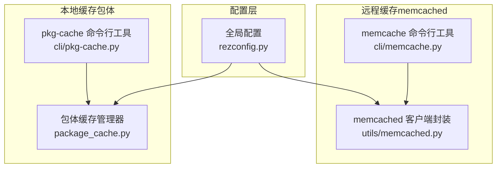
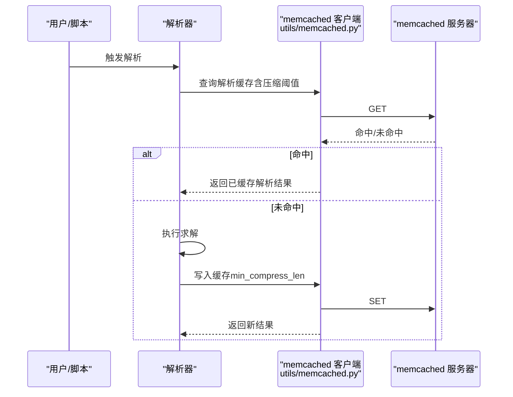
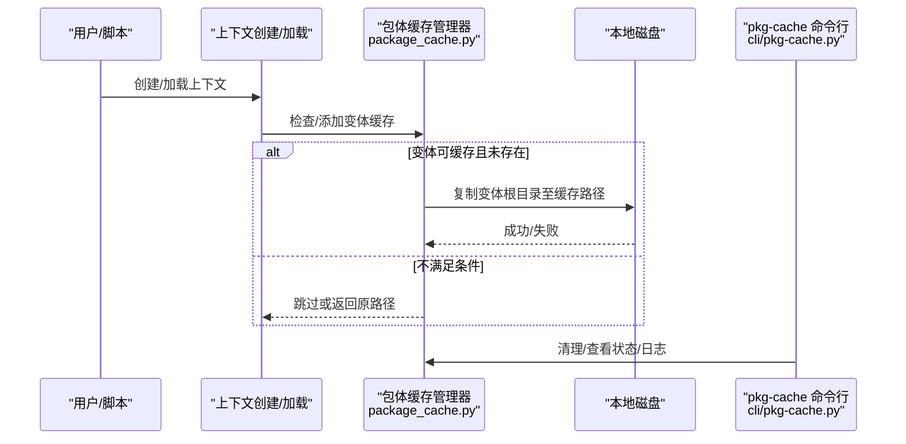
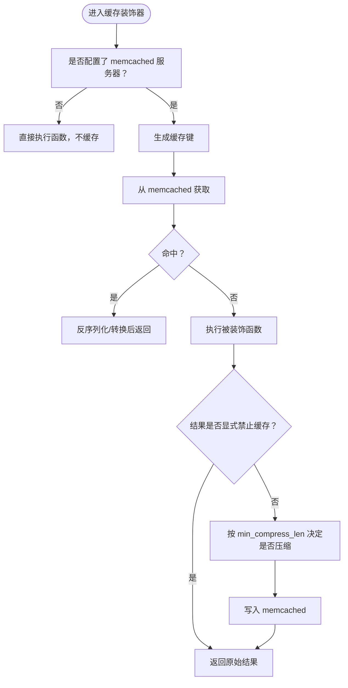
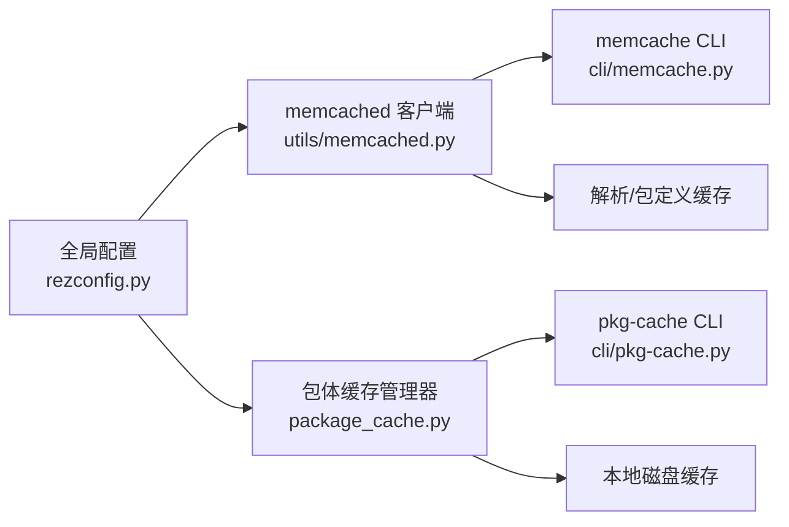

# 缓存性能与维护

<cite>
**本文引用的文件列表**
- [rezconfig.py](file://rez-3.3.0/src/rez/rezconfig.py)
- [caching.rst](file://rez-3.3.0/docs/source/caching.rst)
- [package_cache.py](file://rez-3.3.0/src/rez/package_cache.py)
- [memcached.py](file://rez-3.3.0/src/rez/utils/memcached.py)
- [memcache.py](file://rez-3.3.0/src/rez/cli/memcache.py)
- [pkg-cache.py](file://rez-3.3.0/src/rez/cli/pkg-cache.py)
- [test_package_cache.py](file://rez-3.3.0/src/rez/tests/test_package_cache.py)
</cite>

## 目录
1. [简介](#简介)
2. [项目结构](#项目结构)
3. [核心组件](#核心组件)
4. [架构总览](#架构总览)
5. [详细组件分析](#详细组件分析)
6. [依赖关系分析](#依赖关系分析)
7. [性能考量](#性能考量)
8. [故障排查指南](#故障排查指南)
9. [结论](#结论)
10. [附录](#附录)

## 简介
本文件聚焦于 Rez 的缓存性能与维护，围绕以下关键目标展开：
- 深入解析并给出配置建议：resource_caching_maxsize、package_cache_log_days、package_cache_space_buffer 等关键性能参数。
- 通过 memcached_resolve_min_compress_len 等压缩阈值优化网络传输。
- 利用 debug_resolve_memcache、debug_memcache 等调试参数进行问题定位。
- 提供生产环境监控与维护策略，包括日志、清理、统计与 CLI 工具使用。
- 给出高级用户的故障诊断与性能基准测试最佳实践。

## 项目结构
Rez 的缓存体系由“内存资源缓存”“memcached 远程缓存（包定义、目录遍历、解析结果）”“本地包体缓存（Package Caching）”三部分组成。核心配置位于全局配置文件中，运行时通过工具与模块读取并应用这些设置。

图表来源
- [rezconfig.py](file://rez-3.3.0/src/rez/rezconfig.py#L140-L210)
- [memcached.py](file://rez-3.3.0/src/rez/utils/memcached.py#L1-L120)
- [memcache.py](file://rez-3.3.0/src/rez/cli/memcache.py#L1-L170)
- [package_cache.py](file://rez-3.3.0/src/rez/package_cache.py#L1-L120)
- [pkg-cache.py](file://rez-3.3.0/src/rez/cli/pkg-cache.py#L1-L120)

章节来源
- [rezconfig.py](file://rez-3.3.0/src/rez/rezconfig.py#L140-L210)
- [caching.rst](file://rez-3.3.0/docs/source/caching.rst#L1-L120)

## 核心组件
- 全局配置（Caching 部分）
  - 资源本地缓存大小：resource_caching_maxsize
  - memcached 压缩阈值：memcached_package_file_min_compress_len、memcached_context_file_min_compress_len、memcached_listdir_min_compress_len、memcached_resolve_min_compress_len
  - 包体缓存控制：package_cache_log_days、package_cache_space_buffer、package_cache_used_threshold、package_cache_clean_limit、package_cache_max_variant_days
- memcached 客户端与装饰器
  - Client 封装、连接池、统计、flush、压缩阈值传递
  - memcached 装饰器用于函数级缓存
- 包体缓存管理器
  - 添加/移除/清理/状态查询；空间阈值与缓冲区保护；异步缓存守护进程
- CLI 工具
  - memcache：查看统计、重置统计、预热、轮询
  - pkg-cache：查看状态、添加/删除变体、清理日志、守护模式

章节来源
- [rezconfig.py](file://rez-3.3.0/src/rez/rezconfig.py#L140-L210)
- [rezconfig.py](file://rez-3.3.0/src/rez/rezconfig.py#L220-L330)
- [memcached.py](file://rez-3.3.0/src/rez/utils/memcached.py#L1-L120)
- [memcached.py](file://rez-3.3.0/src/rez/utils/memcached.py#L248-L405)
- [package_cache.py](file://rez-3.3.0/src/rez/package_cache.py#L1-L120)
- [package_cache.py](file://rez-3.3.0/src/rez/package_cache.py#L178-L208)
- [pkg-cache.py](file://rez-3.3.0/src/rez/cli/pkg-cache.py#L1-L120)
- [memcache.py](file://rez-3.3.0/src/rez/cli/memcache.py#L1-L170)

## 架构总览
下面的序列图展示了“解析结果缓存到 memcached”的典型流程，以及“包体缓存到本地磁盘”的流程。

图表来源
- [memcached.py](file://rez-3.3.0/src/rez/utils/memcached.py#L81-L119)
- [memcached.py](file://rez-3.3.0/src/rez/utils/memcached.py#L267-L399)
- [rezconfig.py](file://rez-3.3.0/src/rez/rezconfig.py#L140-L183)

图表来源
- [package_cache.py](file://rez-3.3.0/src/rez/package_cache.py#L209-L416)
- [package_cache.py](file://rez-3.3.0/src/rez/package_cache.py#L748-L800)
- [pkg-cache.py](file://rez-3.3.0/src/rez/cli/pkg-cache.py#L143-L226)

## 详细组件分析

### 1) 关键性能参数配置与调优

- resource_caching_maxsize（本地资源缓存上限）
  - 作用：限制进程内资源（包族、包、变体）缓存条目数量，避免内存膨胀。
  - 默认值：-1 表示无上限；设为 0 则禁用缓存。
  - 建议：在高并发场景下适度下调，结合业务热点包数量评估，防止 OOM。
  - 参考位置：[配置项定义](file://rez-3.3.0/src/rez/rezconfig.py#L159-L163)

- package_cache_log_days（包体缓存日志保留天数）
  - 作用：控制包体缓存日志文件的保留周期，便于审计与排障。
  - 默认值：7 天。
  - 建议：生产环境可适当延长，配合集中化日志收集。
  - 参考位置：[配置项定义](file://rez-3.3.0/src/rez/rezconfig.py#L301-L304)

- package_cache_space_buffer（包体缓存磁盘空间缓冲区）
  - 作用：保证缓存目录剩余空间不低于该阈值，避免写满导致异常与清理困难。
  - 默认值：约 100MB（字节常量）。
  - 建议：根据最大单变体体积与磁盘策略调整，确保不会因空间不足而阻塞新变体缓存。
  - 参考位置：[配置项定义](file://rez-3.3.0/src/rez/rezconfig.py#L305-L316)
  - 实现校验：[空间检查逻辑](file://rez-3.3.0/src/rez/package_cache.py#L178-L186)

- package_cache_used_threshold（包体缓存使用率阈值）
  - 作用：当缓存使用率超过阈值时，启用更严格的变体缓存决策，避免接近满载。
  - 默认值：80%。
  - 建议：结合业务峰值与磁盘配额，平衡吞吐与稳定性。
  - 参考位置：[配置项定义](file://rez-3.3.0/src/rez/rezconfig.py#L327-L328)
  - 实现校验：[使用率与缓冲区联合判断](file://rez-3.3.0/src/rez/package_cache.py#L187-L207)

- memcached_resolve_min_compress_len（解析结果压缩阈值）
  - 作用：对解析结果（如 .rxt 文件）达到该长度才触发压缩，减少网络传输开销。
  - 默认值：1 字节（几乎总是压缩）。
  - 建议：在大体量 .rxt 文件场景下提高阈值，降低 CPU 压力；小文件保持较低阈值提升命中率。
  - 参考位置：[配置项定义](file://rez-3.3.0/src/rez/rezconfig.py#L181-L183)
  - 传递路径：[装饰器 set 调用 min_compress_len](file://rez-3.3.0/src/rez/utils/memcached.py#L363-L377)

- 其他压缩阈值（包体/目录/包定义）
  - memcached_package_file_min_compress_len：包定义文件（如 package.py/yaml）压缩阈值，默认较大，适合文本类数据。
  - memcached_context_file_min_compress_len：上下文文件（.rxt）压缩阈值，默认较小。
  - memcached_listdir_min_compress_len：目录遍历结果压缩阈值。
  - 参考位置：[配置项定义](file://rez-3.3.0/src/rez/rezconfig.py#L169-L180)

章节来源
- [rezconfig.py](file://rez-3.3.0/src/rez/rezconfig.py#L159-L183)
- [rezconfig.py](file://rez-3.3.0/src/rez/rezconfig.py#L301-L316)
- [rezconfig.py](file://rez-3.3.0/src/rez/rezconfig.py#L327-L328)
- [package_cache.py](file://rez-3.3.0/src/rez/package_cache.py#L178-L207)
- [memcached.py](file://rez-3.3.0/src/rez/utils/memcached.py#L363-L377)

### 2) 压缩阈值优化网络传输（memcached_resolve_min_compress_len）

- 适用场景
  - 解析结果体积较大（多变体、复杂依赖），频繁跨节点传输。
  - CPU 资源紧张但带宽充足，优先降低网络负载。
- 调参策略
  - 小型解析结果：保持默认或更低阈值，提升命中率。
  - 大型解析结果：适当提高阈值，减少压缩带来的 CPU 开销。
- 参数来源与传递
  - 配置项：[解析压缩阈值](file://rez-3.3.0/src/rez/rezconfig.py#L181-L183)
  - 传递路径：[装饰器 set 调用 min_compress_len](file://rez-3.3.0/src/rez/utils/memcached.py#L363-L377)

图表来源
- [memcached.py](file://rez-3.3.0/src/rez/utils/memcached.py#L267-L399)

### 3) 调试参数与问题排查（debug_resolve_memcache、debug_memcache）

- debug_resolve_memcache
  - 作用：打印解析阶段使用 memcached 的调试信息，便于定位缓存命中/失效原因。
  - 使用方式：在配置中启用或通过环境变量覆盖。
  - 参考位置：[调试开关定义](file://rez-3.3.0/src/rez/rezconfig.py#L736-L743)
  - 文档说明：[调试 memcached 使用](file://rez-3.3.0/docs/source/caching.rst#L58-L78)

- debug_memcache
  - 作用：开启人类可读的 key 显示，便于在服务端使用 “memcached -vv” 直观观察键值。
  - 注意：可能增加 key 冲突风险，不建议长期开启。
  - 参考位置：[客户端 debug 模式](file://rez-3.3.0/src/rez/utils/memcached.py#L37-L51)
  - 文档说明：[调试 memcached 使用](file://rez-3.3.0/docs/source/caching.rst#L58-L78)

- memcache 命令行工具
  - 功能：查看统计、重置统计、预热缓存、轮询指标。
  - 参考位置：[命令行实现](file://rez-3.3.0/src/rez/cli/memcache.py#L77-L170)

章节来源
- [rezconfig.py](file://rez-3.3.0/src/rez/rezconfig.py#L736-L743)
- [caching.rst](file://rez-3.3.0/docs/source/caching.rst#L58-L78)
- [memcached.py](file://rez-3.3.0/src/rez/utils/memcached.py#L37-L51)
- [memcache.py](file://rez-3.3.0/src/rez/cli/memcache.py#L77-L170)

### 4) 生产环境监控与维护

- 日志与清理
  - 日志保留：通过 package_cache_log_days 控制日志文件保留天数。
  - 清理策略：定期执行清理，删除长时间未使用的变体与停滞变体；也可在更新时短时清理。
  - 参考位置：[清理实现](file://rez-3.3.0/src/rez/package_cache.py#L748-L800)
  - 文档说明：[清理与日志](file://rez-3.3.0/docs/source/caching.rst#L248-L273)

- 空间保护与阈值
  - 使用率阈值：package_cache_used_threshold，超过后对新变体进行更严格的空间评估。
  - 缓冲区：package_cache_space_buffer，确保剩余空间不低于阈值。
  - 参考位置：[阈值与缓冲区](file://rez-3.3.0/src/rez/rezconfig.py#L327-L316)
  - 实现校验：[空间检查与判定](file://rez-3.3.0/src/rez/package_cache.py#L178-L207)

- CLI 维护
  - pkg-cache：查看状态、添加/删除变体、清理、查看日志、守护模式。
  - 参考位置：[命令行实现](file://rez-3.3.0/src/rez/cli/pkg-cache.py#L143-L226)

章节来源
- [package_cache.py](file://rez-3.3.0/src/rez/package_cache.py#L748-L800)
- [rezconfig.py](file://rez-3.3.0/src/rez/rezconfig.py#L301-L316)
- [pkg-cache.py](file://rez-3.3.0/src/rez/cli/pkg-cache.py#L143-L226)
- [caching.rst](file://rez-3.3.0/docs/source/caching.rst#L248-L273)

### 5) 测试与验证（空间与阈值行为）

- 单元测试覆盖
  - cache_near_full：当可用空间低于缓冲区时返回 True。
  - variant_meets_space_requirements：在使用率超过阈值时，计算变体大小并判断是否会跌破缓冲区。
  - 参考位置：[测试用例](file://rez-3.3.0/src/rez/tests/test_package_cache.py#L237-L342)

章节来源
- [test_package_cache.py](file://rez-3.3.0/src/rez/tests/test_package_cache.py#L237-L342)

## 依赖关系分析

图表来源
- [rezconfig.py](file://rez-3.3.0/src/rez/rezconfig.py#L140-L210)
- [memcached.py](file://rez-3.3.0/src/rez/utils/memcached.py#L1-L120)
- [package_cache.py](file://rez-3.3.0/src/rez/package_cache.py#L1-L120)
- [memcache.py](file://rez-3.3.0/src/rez/cli/memcache.py#L1-L170)
- [pkg-cache.py](file://rez-3.3.0/src/rez/cli/pkg-cache.py#L1-L120)

章节来源
- [rezconfig.py](file://rez-3.3.0/src/rez/rezconfig.py#L140-L210)
- [memcached.py](file://rez-3.3.0/src/rez/utils/memcached.py#L1-L120)
- [package_cache.py](file://rez-3.3.0/src/rez/package_cache.py#L1-L120)
- [memcache.py](file://rez-3.3.0/src/rez/cli/memcache.py#L1-L170)
- [pkg-cache.py](file://rez-3.3.0/src/rez/cli/pkg-cache.py#L1-L120)

## 性能考量
- 缓存命中率与网络传输
  - 合理设置压缩阈值，避免小对象过度压缩带来的 CPU 开销。
  - 对大型 .rxt 或包定义文件，适当提高阈值，减少网络往返。
- 空间与稳定性
  - 通过 package_cache_used_threshold 与 package_cache_space_buffer 双重保护，避免缓存目录被写满。
  - 结合 package_cache_clean_limit 在更新时做短时清理，维持健康容量。
- 资源本地缓存
  - resource_caching_maxsize 控制进程内资源缓存规模，避免内存压力过大。
- 异步缓存
  - package_cache_async 与 pkg-cache 守护进程配合，减少解析阻塞时间。

[本节为通用指导，无需特定文件引用]

## 故障排查指南
- 常见症状与定位
  - 解析缓慢：检查 memcache 服务器连通性与命中率；使用 CLI 查看统计与轮询。
  - 缓存未生效：确认配置项是否启用（resolve_caching、cache_package_files、cache_listdir）。
  - 磁盘空间不足：关注 package_cache_space_buffer 与 package_cache_used_threshold 的交互。
- 排查步骤
  - 启用 debug_memcache 与 debug_resolve_memcache，观察键与命中情况。
  - 使用 memcache CLI 的 --stats/--reset-stats/--poll/--warm 进行验证。
  - 使用 pkg-cache CLI 查看状态、清理日志、执行清理。
- 参考位置
  - [memcache CLI](file://rez-3.3.0/src/rez/cli/memcache.py#L77-L170)
  - [pkg-cache CLI](file://rez-3.3.0/src/rez/cli/pkg-cache.py#L143-L226)
  - [包体缓存空间判定](file://rez-3.3.0/src/rez/package_cache.py#L178-L207)

章节来源
- [memcache.py](file://rez-3.3.0/src/rez/cli/memcache.py#L77-L170)
- [pkg-cache.py](file://rez-3.3.0/src/rez/cli/pkg-cache.py#L143-L226)
- [package_cache.py](file://rez-3.3.0/src/rez/package_cache.py#L178-L207)

## 结论
- 在生产环境中，应结合业务规模与硬件资源，合理设置压缩阈值与空间保护参数，确保缓存既高效又稳定。
- 通过 CLI 工具与调试开关，可以持续监控缓存命中率、磁盘使用与清理效果。
- 建议建立定期清理与容量预警机制，配合日志留存策略，形成闭环运维。

[本节为总结性内容，无需特定文件引用]

## 附录

### A. 关键参数一览与建议
- resource_caching_maxsize：根据进程内资源访问热点设定，避免无限增长。
- package_cache_log_days：按审计需求设定，建议保留至少 7-30 天。
- package_cache_space_buffer：建议不低于最大单变体体积，预留安全余量。
- package_cache_used_threshold：默认 80%，可根据峰值与磁盘配额微调。
- memcached_resolve_min_compress_len：大 .rxt 场景可适当提高，小对象保持较低。
- 其他压缩阈值：按对象类型与体量分别调优。

章节来源
- [rezconfig.py](file://rez-3.3.0/src/rez/rezconfig.py#L159-L183)
- [rezconfig.py](file://rez-3.3.0/src/rez/rezconfig.py#L301-L316)
- [rezconfig.py](file://rez-3.3.0/src/rez/rezconfig.py#L327-L328)

### B. 实际代码示例（以路径代替代码）
- 启用解析缓存并设置压缩阈值
  - 参考路径：[解析缓存开关与压缩阈值](file://rez-3.3.0/src/rez/rezconfig.py#L146-L183)
- 通过装饰器缓存解析结果（含 min_compress_len）
  - 参考路径：[装饰器实现与 set 调用](file://rez-3.3.0/src/rez/utils/memcached.py#L267-L399)
- 包体缓存空间保护与清理
  - 参考路径：[空间检查与清理](file://rez-3.3.0/src/rez/package_cache.py#L178-L207), [清理实现](file://rez-3.3.0/src/rez/package_cache.py#L748-L800)
- CLI 维护
  - 参考路径：[memcache CLI](file://rez-3.3.0/src/rez/cli/memcache.py#L77-L170), [pkg-cache CLI](file://rez-3.3.0/src/rez/cli/pkg-cache.py#L143-L226)