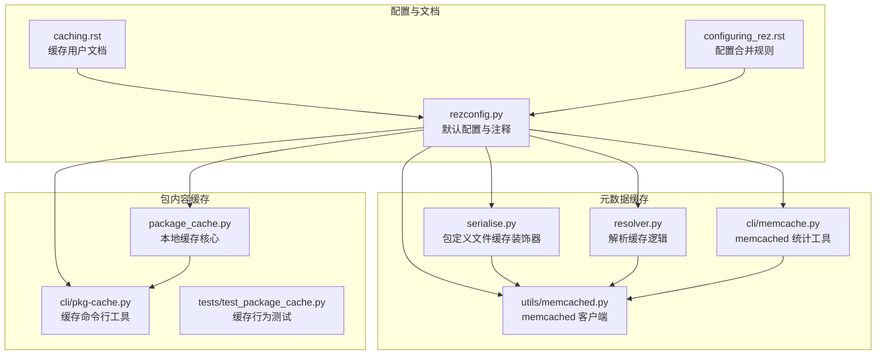
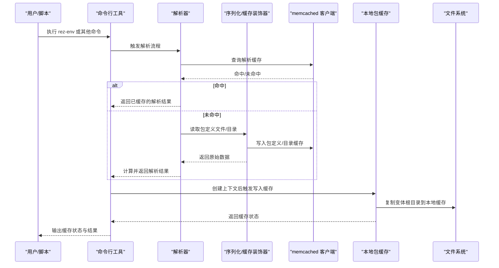
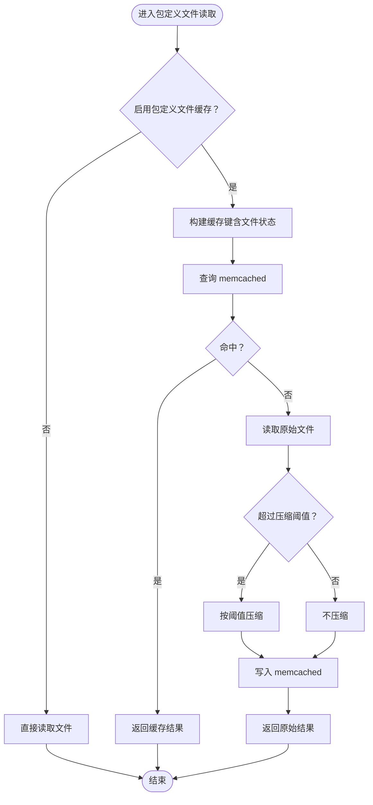
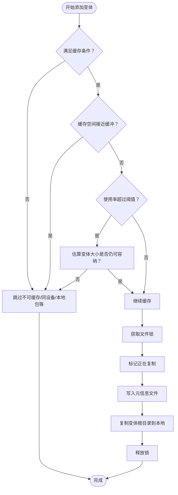
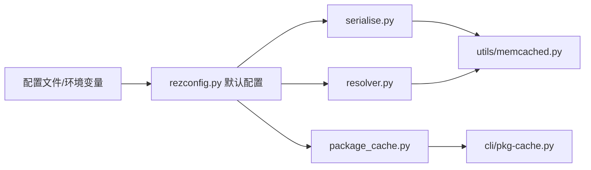

# 缓存配置

<cite>
**本文引用的文件**
- [caching.rst](file://rez-3.3.0/docs/source/caching.rst)
- [configuring_rez.rst](file://rez-3.3.0/docs/source/configuring_rez.rst)
- [rezconfig.py](file://rez-3.3.0/src/rez/rezconfig.py)
- [serialise.py](file://rez-3.3.0/src/rez/serialise.py)
- [resolver.py](file://rez-3.3.0/src/rez/resolver.py)
- [memcached.py](file://rez-3.3.0/src/rez/utils/memcached.py)
- [memcache.py](file://rez-3.3.0/src/rez/cli/memcache.py)
- [package_cache.py](file://rez-3.3.0/src/rez/package_cache.py)
- [pkg-cache.py](file://rez-3.3.0/src/rez/cli/pkg-cache.py)
- [test_package_cache.py](file://rez-3.3.0/src/rez/tests/test_package_cache.py)
</cite>

## 目录
1. [简介](#简介)
2. [项目结构](#项目结构)
3. [核心组件](#核心组件)
4. [架构总览](#架构总览)
5. [详细组件分析](#详细组件分析)
6. [依赖关系分析](#依赖关系分析)
7. [性能考量](#性能考量)
8. [故障排查指南](#故障排查指南)
9. [结论](#结论)
10. [附录](#附录)

## 简介
本章节聚焦于 Rez 系统中的两类缓存机制：
- 基于 memcached 的元数据缓存（解析缓存与包定义文件缓存）
- 基于本地磁盘的包内容缓存（Package Payload Cache）

我们将系统性地说明以下配置项的作用与调优方法：
- 元数据缓存：resolve_caching、cache_package_files、memcached_uri、memcached_package_file_min_compress_len 等
- 包内容缓存：cache_packages_path、read_package_cache、write_package_cache、package_cache_clean_limit、package_cache_used_threshold、package_cache_space_buffer 等
- 性能调优：压缩阈值、磁盘空间管理策略
- 实战示例与最佳实践：如何在大规模部署中优化缓存性能，以及监控与维护建议

## 项目结构
Rez 的缓存相关实现分布在多个模块中：
- 配置与文档：caching.rst、configuring_rez.rst、rezconfig.py
- 元数据缓存：serialise.py（包定义文件缓存）、resolver.py（解析缓存）、utils/memcached.py（memcached 客户端封装）、cli/memcache.py（memcached 统计工具）
- 包内容缓存：package_cache.py（核心逻辑）、cli/pkg-cache.py（命令行工具）、tests/test_package_cache.py（测试用例）

图表来源
- [caching.rst](file://rez-3.3.0/docs/source/caching.rst#L1-L273)
- [configuring_rez.rst](file://rez-3.3.0/docs/source/configuring_rez.rst#L1-L151)
- [rezconfig.py](file://rez-3.3.0/src/rez/rezconfig.py#L140-L339)
- [serialise.py](file://rez-3.3.0/src/rez/serialise.py#L123-L157)
- [resolver.py](file://rez-3.3.0/src/rez/resolver.py#L203-L325)
- [memcached.py](file://rez-3.3.0/src/rez/utils/memcached.py#L43-L330)
- [memcache.py](file://rez-3.3.0/src/rez/cli/memcache.py#L115-L157)
- [package_cache.py](file://rez-3.3.0/src/rez/package_cache.py#L172-L804)
- [pkg-cache.py](file://rez-3.3.0/src/rez/cli/pkg-cache.py#L1-L226)
- [test_package_cache.py](file://rez-3.3.0/src/rez/tests/test_package_cache.py#L237-L342)

章节来源
- [caching.rst](file://rez-3.3.0/docs/source/caching.rst#L1-L273)
- [configuring_rez.rst](file://rez-3.3.0/docs/source/configuring_rez.rst#L1-L151)
- [rezconfig.py](file://rez-3.3.0/src/rez/rezconfig.py#L140-L339)

## 核心组件
- 元数据缓存（memcached）：通过装饰器对包定义文件读取与目录遍历进行缓存；解析缓存通过 resolver 在 memcached 中存储解决信息、时间戳与变体状态。
- 包内容缓存（本地磁盘）：将变体的根目录内容复制到本地缓存路径，运行时从本地读取，避免共享存储网络开销。

章节来源
- [serialise.py](file://rez-3.3.0/src/rez/serialise.py#L123-L157)
- [resolver.py](file://rez-3.3.0/src/rez/resolver.py#L203-L325)
- [package_cache.py](file://rez-3.3.0/src/rez/package_cache.py#L172-L804)

## 架构总览
下图展示了缓存配置与调用链路，包括 memcached 元数据缓存与本地包内容缓存两条主线。

图表来源
- [resolver.py](file://rez-3.3.0/src/rez/resolver.py#L203-L325)
- [serialise.py](file://rez-3.3.0/src/rez/serialise.py#L123-L157)
- [memcached.py](file://rez-3.3.0/src/rez/utils/memcached.py#L43-L330)
- [package_cache.py](file://rez-3.3.0/src/rez/package_cache.py#L172-L804)
- [pkg-cache.py](file://rez-3.3.0/src/rez/cli/pkg-cache.py#L1-L226)

## 详细组件分析

### 元数据缓存（memcached）
- 启用与参数
  - resolve_caching：是否启用解析缓存（默认开启）
  - cache_package_files：是否启用包定义文件读取缓存（默认开启）
  - memcached_uri：memcached 服务器列表或 None（默认空列表）
  - memcached_package_file_min_compress_len：包定义文件缓存的最小压缩阈值（默认 16KB）
  - memcached_context_file_min_compress_len：上下文文件缓存的最小压缩阈值（默认 1B）
  - memcached_listdir_min_compress_len：目录遍历缓存的最小压缩阈值（默认 16KB）
  - memcached_resolve_min_compress_len：解析缓存的最小压缩阈值（默认 1B）
  - debug_memcache：调试 memcached 行为（可通过环境变量或设置控制）

- 关键实现点
  - 包定义文件缓存装饰器：在 serialise.py 中，当启用 cache_package_files 时，对包定义文件读取使用 memcached 装饰器，key 由文件路径、格式、回调函数签名与文件状态构成，确保文件变更时自动失效。
  - 解析缓存：resolver 在需要时生成缓存键，查询 memcached；若命中且变体状态未变化则直接复用；否则重新计算并写入缓存。
  - memcached 客户端：utils/memcached.py 提供统一客户端封装，支持连接池、统计、flush、压缩阈值等能力。
  - 调试与统计：cli/memcache.py 可打印命中率、内存占用等统计信息，便于性能评估。

图表来源
- [serialise.py](file://rez-3.3.0/src/rez/serialise.py#L123-L157)
- [memcached.py](file://rez-3.3.0/src/rez/utils/memcached.py#L43-L330)
- [rezconfig.py](file://rez-3.3.0/src/rez/rezconfig.py#L140-L184)

章节来源
- [serialise.py](file://rez-3.3.0/src/rez/serialise.py#L123-L157)
- [resolver.py](file://rez-3.3.0/src/rez/resolver.py#L203-L325)
- [memcached.py](file://rez-3.3.0/src/rez/utils/memcached.py#L43-L330)
- [memcache.py](file://rez-3.3.0/src/rez/cli/memcache.py#L115-L157)
- [caching.rst](file://rez-3.3.0/docs/source/caching.rst#L1-L90)

### 包内容缓存（本地磁盘）
- 启用与参数
  - cache_packages_path：本地缓存根路径（None 则禁用）
  - read_package_cache：创建/加载上下文时是否使用本地缓存
  - write_package_cache：创建/加载上下文时是否写入本地缓存
  - package_cache_max_variant_days：未使用变体保留天数（0 表示不清理）
  - package_cache_during_build：构建期间是否允许缓存（默认关闭）
  - package_cache_async：异步缓存（默认开启），可减少解析阻塞
  - package_cache_local：是否允许缓存本地包（默认关闭）
  - package_cache_same_device：是否允许缓存与缓存路径同设备的包（默认关闭）
  - package_cache_clean_limit：每次更新时最多清理耗时（秒，<=0 禁用）
  - package_cache_used_threshold：缓存使用率阈值（百分比），超过后开始节流
  - package_cache_space_buffer：缓存可用空间缓冲（字节），低于此值将拒绝新缓存

- 关键实现点
  - 变体复制与并发安全：package_cache.py 使用文件锁与“正在复制”标记，保证多进程/线程安全；支持等待复制完成或跳过。
  - 空间管理：当缓存接近空间缓冲或使用率超过阈值时，拒绝新增缓存；同时在清理阶段删除长时间未使用的变体与停滞变体。
  - 清理策略：支持按时间限制执行部分清理，或手动执行清理命令。
  - 命令行工具：cli/pkg-cache.py 支持查看状态、添加/移除变体、守护进程模式、日志查看与清理。

图表来源
- [package_cache.py](file://rez-3.3.0/src/rez/package_cache.py#L172-L804)
- [pkg-cache.py](file://rez-3.3.0/src/rez/cli/pkg-cache.py#L1-L226)
- [test_package_cache.py](file://rez-3.3.0/src/rez/tests/test_package_cache.py#L237-L342)

章节来源
- [package_cache.py](file://rez-3.3.0/src/rez/package_cache.py#L172-L804)
- [pkg-cache.py](file://rez-3.3.0/src/rez/cli/pkg-cache.py#L1-L226)
- [test_package_cache.py](file://rez-3.3.0/src/rez/tests/test_package_cache.py#L237-L342)
- [caching.rst](file://rez-3.3.0/docs/source/caching.rst#L90-L273)

## 依赖关系分析
- 配置来源与覆盖顺序：安装内默认配置 → 环境变量指定的配置文件 → 用户家目录配置 → 环境变量覆盖 → 包内配置覆盖（仅构建/发布阶段）。
- 元数据缓存依赖：
  - serialise.py 依赖 config.cache_package_files 与 memcached_uri 决定是否启用包定义文件缓存
  - resolver.py 依赖 config.resolve_caching 与 memcached_uri 决定是否启用解析缓存
  - utils/memcached.py 提供统一客户端，支持压缩阈值与统计
- 包内容缓存依赖：
  - package_cache.py 依赖 cache_packages_path、read_package_cache、write_package_cache 等配置
  - cli/pkg-cache.py 作为入口，调用 package_cache.py 并提供运维能力

图表来源
- [configuring_rez.rst](file://rez-3.3.0/docs/source/configuring_rez.rst#L1-L151)
- [rezconfig.py](file://rez-3.3.0/src/rez/rezconfig.py#L140-L339)
- [serialise.py](file://rez-3.3.0/src/rez/serialise.py#L123-L157)
- [resolver.py](file://rez-3.3.0/src/rez/resolver.py#L203-L325)
- [package_cache.py](file://rez-3.3.0/src/rez/package_cache.py#L172-L804)
- [pkg-cache.py](file://rez-3.3.0/src/rez/cli/pkg-cache.py#L1-L226)

章节来源
- [configuring_rez.rst](file://rez-3.3.0/docs/source/configuring_rez.rst#L1-L151)
- [rezconfig.py](file://rez-3.3.0/src/rez/rezconfig.py#L140-L339)

## 性能考量
- 压缩阈值调优
  - memcached_package_file_min_compress_len：默认 16KB，适合大体量包定义文件；可根据包定义平均大小调整，降低网络与 CPU 开销。
  - memcached_context_file_min_compress_len：默认 1B，适合小体量上下文文件；避免对极小对象进行压缩。
  - memcached_listdir_min_compress_len：默认 16KB，目录遍历缓存通常较大，建议保持较低阈值。
  - memcached_resolve_min_compress_len：默认 1B，解析缓存通常较小，可按需设置。
- 磁盘空间管理
  - package_cache_space_buffer：默认 100MB，用于避免缓存写满导致失败与清理困难。
  - package_cache_used_threshold：默认 80%，超过阈值后对即将缓存的变体进行大小校验，防止触及缓冲区。
  - package_cache_clean_limit：默认 0.5 秒，每次更新时做短时清理，避免缓存无限增长。
  - package_cache_max_variant_days：默认 30 天，未使用变体清理周期。
- 异步缓存
  - package_cache_async：默认开启，减少解析阻塞；如需严格一致性，可在特定场景切换为同步模式。

章节来源
- [rezconfig.py](file://rez-3.3.0/src/rez/rezconfig.py#L140-L339)
- [package_cache.py](file://rez-3.3.0/src/rez/package_cache.py#L172-L804)

## 故障排查指南
- memcached 连接与统计
  - 使用 cli/memcache.py 查看命中率、内存占用与统计重置；若无响应，检查 memcached_uri 与服务状态。
- 包内容缓存状态
  - 使用 cli/pkg-cache.py 查看缓存状态、日志与清理；关注“copying/stalled/pending”等状态。
- 常见问题定位
  - 缓存被跳过：检查 package_cache_space_buffer、package_cache_used_threshold、package_cache_local、package_cache_same_device 等配置。
  - 变体停滞：需执行清理以移除部分复制产物，再重新缓存。
  - 磁盘不足：增大缓存路径所在分区容量或缩短 package_cache_max_variant_days。

章节来源
- [memcache.py](file://rez-3.3.0/src/rez/cli/memcache.py#L115-L157)
- [pkg-cache.py](file://rez-3.3.0/src/rez/cli/pkg-cache.py#L1-L226)
- [test_package_cache.py](file://rez-3.3.0/src/rez/tests/test_package_cache.py#L237-L342)

## 结论
- 元数据缓存通过 memcached 将包定义文件读取与解析过程加速，适合跨节点共享的 Studio 环境。
- 包内容缓存通过本地磁盘复制变体根目录，显著降低运行时网络 IO 成本。
- 合理配置压缩阈值与磁盘空间策略，可在大规模部署中取得更佳性能与稳定性。
- 建议结合命令行工具与日志定期巡检缓存健康度，按需调整清理策略与异步缓存开关。

## 附录
- 配置项一览（节选）
  - 元数据缓存
    - resolve_caching（默认 True）
    - cache_package_files（默认 True）
    - memcached_uri（默认 []）
    - memcached_package_file_min_compress_len（默认 16384）
    - memcached_context_file_min_compress_len（默认 1）
    - memcached_listdir_min_compress_len（默认 16384）
    - memcached_resolve_min_compress_len（默认 1）
    - debug_memcache（默认 False）
  - 包内容缓存
    - cache_packages_path（默认 None）
    - read_package_cache（默认 True）
    - write_package_cache（默认 True）
    - package_cache_max_variant_days（默认 30）
    - package_cache_during_build（默认 False）
    - package_cache_async（默认 True）
    - package_cache_local（默认 False）
    - package_cache_same_device（默认 False）
    - package_cache_clean_limit（默认 0.5）
    - package_cache_used_threshold（默认 80）
    - package_cache_space_buffer（默认 104857600）

章节来源
- [rezconfig.py](file://rez-3.3.0/src/rez/rezconfig.py#L140-L339)
- [caching.rst](file://rez-3.3.0/docs/source/caching.rst#L90-L273)