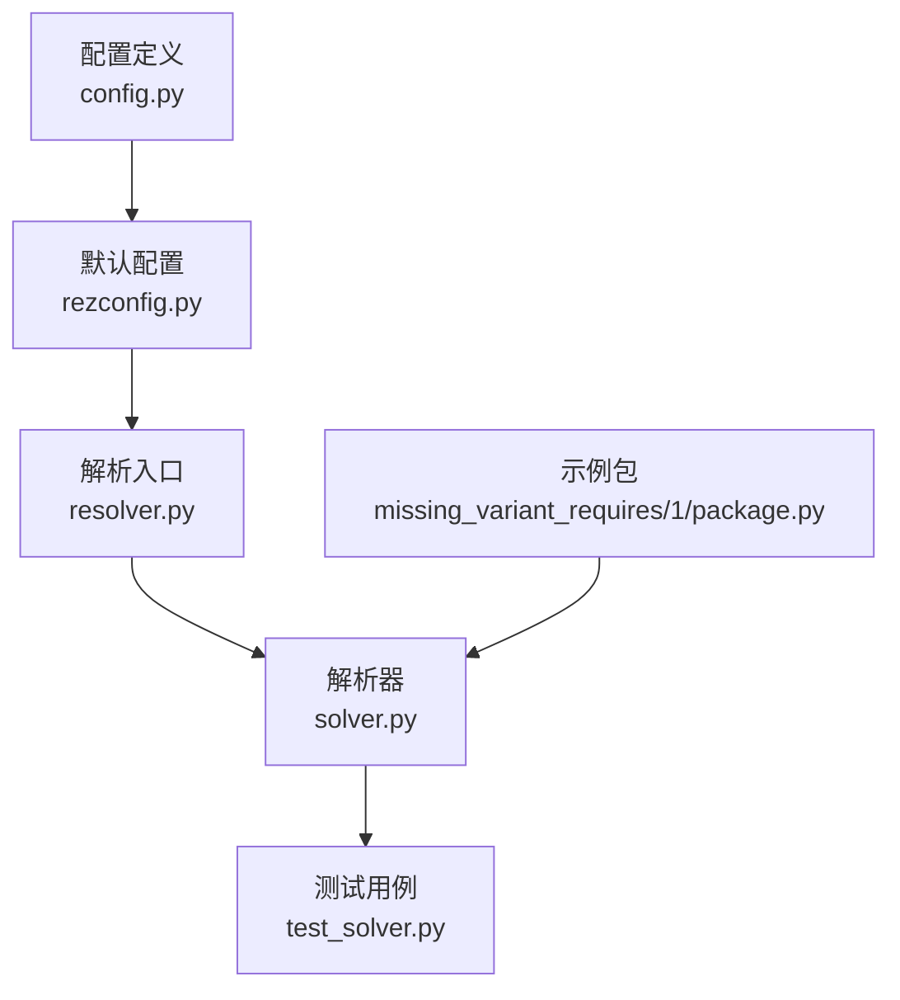
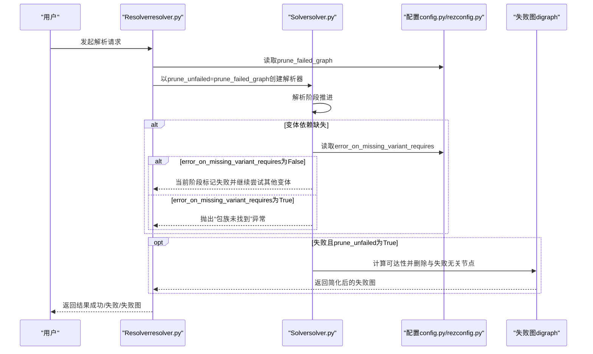
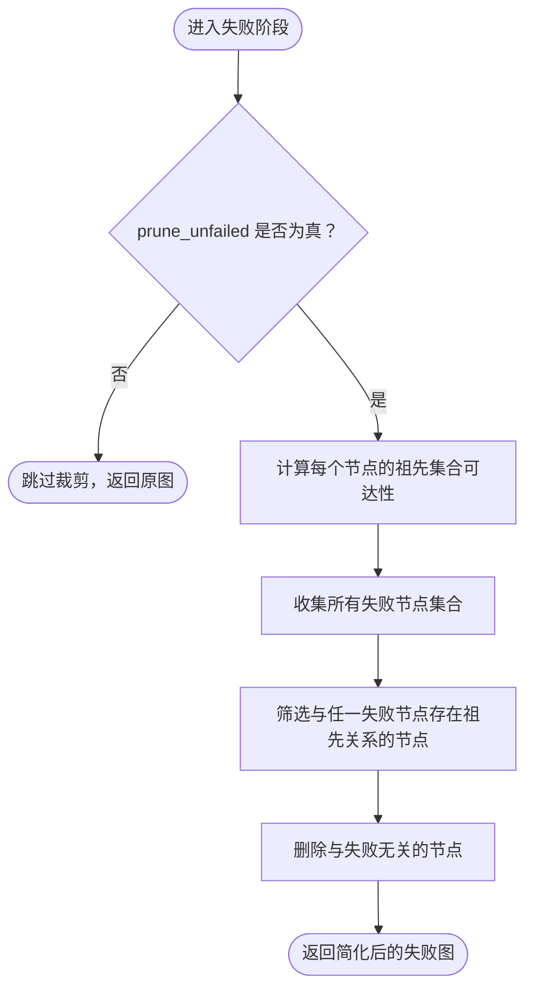
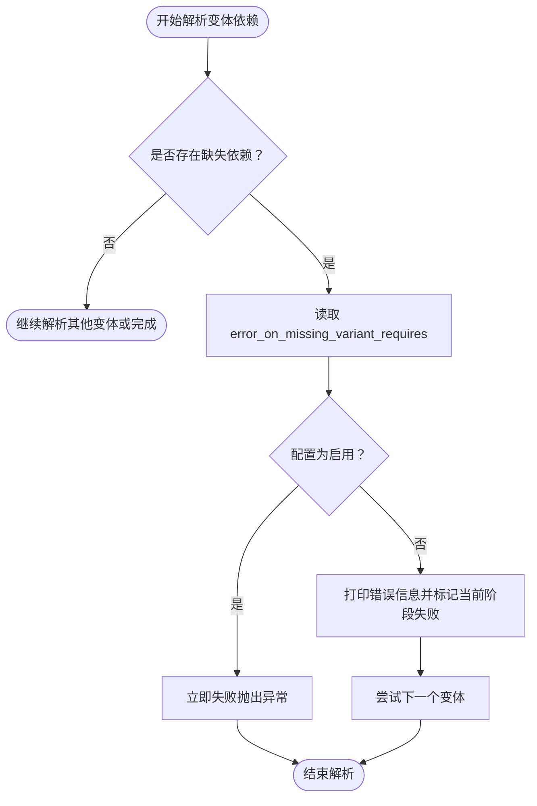
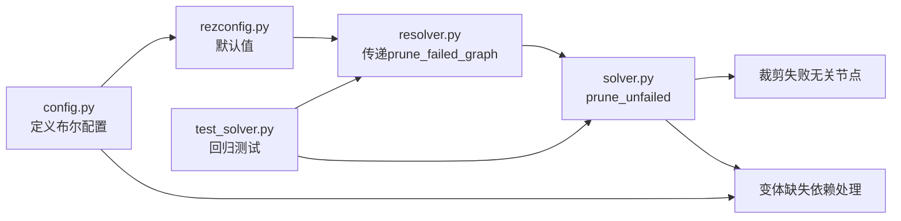

# 依赖解析策略

<cite>
**本文引用的文件**
- [config.py](file://rez-3.3.0/src/rez/config.py)
- [rezconfig.py](file://rez-3.3.0/src/rez/rezconfig.py)
- [resolver.py](file://rez-3.3.0/src/rez/resolver.py)
- [solver.py](file://rez-3.3.0/src/rez/solver.py)
- [test_solver.py](file://rez-3.3.0/src/rez/tests/test_solver.py)
- [CHANGELOG.md](file://rez-3.3.0/CHANGELOG.md)
- [package.py（缺失变体示例）](file://rez-3.3.0/src/rez/data/tests/solver/packages/missing_variant_requires/1/package.py)
</cite>

## 目录
1. [引言](#引言)
2. [项目结构](#项目结构)
3. [核心组件](#核心组件)
4. [架构总览](#架构总览)
5. [详细组件分析](#详细组件分析)
6. [依赖关系分析](#依赖关系分析)
7. [性能考量](#性能考量)
8. [故障排查指南](#故障排查指南)
9. [结论](#结论)
10. [附录](#附录)

## 引言
本文件聚焦于Rez依赖解析系统中的两项关键配置：prune_failed_graph与error_on_missing_variant_requires。前者用于在失败解析阶段移除与失败无关的节点，从而简化失败图，提升可诊断性；后者用于控制当变体声明了不可解析的依赖时，解析器是立即报错还是继续尝试其他变体。本文将结合源码与测试用例，系统阐述这两项配置的行为、影响与最佳实践，并给出面向高级用户的调试建议。

## 项目结构
围绕依赖解析策略的相关代码主要分布在以下模块：
- 配置定义与默认值：config.py、rezconfig.py
- 解析入口与参数传递：resolver.py
- 解析算法与失败图裁剪：solver.py
- 行为验证与回归测试：test_solver.py
- 变体缺失依赖的示例包：package.py（缺失变体示例）

图表来源
- [config.py](file://rez-3.3.0/src/rez/config.py#L437-L464)
- [rezconfig.py](file://rez-3.3.0/src/rez/rezconfig.py#L364-L368)
- [resolver.py](file://rez-3.3.0/src/rez/resolver.py#L397-L410)
- [solver.py](file://rez-3.3.0/src/rez/solver.py#L1814-L1826)
- [test_solver.py](file://rez-3.3.0/src/rez/tests/test_solver.py#L250-L258)
- [package.py（缺失变体示例）](file://rez-3.3.0/src/rez/data/tests/solver/packages/missing_variant_requires/1/package.py#L1-L10)

章节来源
- [config.py](file://rez-3.3.0/src/rez/config.py#L437-L464)
- [rezconfig.py](file://rez-3.3.0/src/rez/rezconfig.py#L364-L368)
- [resolver.py](file://rez-3.3.0/src/rez/resolver.py#L397-L410)
- [solver.py](file://rez-3.3.0/src/rez/solver.py#L1814-L1826)
- [test_solver.py](file://rez-3.3.0/src/rez/tests/test_solver.py#L250-L258)
- [package.py（缺失变体示例）](file://rez-3.3.0/src/rez/data/tests/solver/packages/missing_variant_requires/1/package.py#L1-L10)

## 核心组件
- 配置项定义与类型约束
  - error_on_missing_variant_requires：布尔型，决定当变体声明了缺失依赖时是否立即失败。
  - prune_failed_graph：布尔型，决定失败解析时是否移除与失败无关的节点。
- 解析入口参数传递
  - resolver将prune_failed_graph作为prune_unfailed传入Solver构造函数。
- 解析器实现
  - Solver在失败阶段根据prune_unfailed执行“未失败节点裁剪”。
  - 在变体依赖缺失时，依据error_on_missing_variant_requires决定抛出异常或继续尝试其他变体。
- 测试与示例
  - test_solver.py覆盖了error_on_missing_variant_requires两种模式的行为。
  - 示例包missing_variant_requires展示了变体声明不存在依赖的情形。

章节来源
- [config.py](file://rez-3.3.0/src/rez/config.py#L437-L464)
- [rezconfig.py](file://rez-3.3.0/src/rez/rezconfig.py#L364-L368)
- [resolver.py](file://rez-3.3.0/src/rez/resolver.py#L397-L410)
- [solver.py](file://rez-3.3.0/src/rez/solver.py#L1388-L1394)
- [solver.py](file://rez-3.3.0/src/rez/solver.py#L1814-L1826)
- [test_solver.py](file://rez-3.3.0/src/rez/tests/test_solver.py#L250-L258)
- [package.py（缺失变体示例）](file://rez-3.3.0/src/rez/data/tests/solver/packages/missing_variant_requires/1/package.py#L1-L10)

## 架构总览
下图展示了从配置到解析器再到失败图裁剪的整体流程，以及error_on_missing_variant_requires在变体依赖缺失时的决策点。

图表来源
- [resolver.py](file://rez-3.3.0/src/rez/resolver.py#L397-L410)
- [solver.py](file://rez-3.3.0/src/rez/solver.py#L1388-L1394)
- [solver.py](file://rez-3.3.0/src/rez/solver.py#L1814-L1826)
- [config.py](file://rez-3.3.0/src/rez/config.py#L437-L464)
- [rezconfig.py](file://rez-3.3.0/src/rez/rezconfig.py#L364-L368)

## 详细组件分析

### 配置项：prune_failed_graph
- 定义与默认值
  - 在默认配置中，prune_failed_graph默认启用，用于在失败解析时移除与失败无关的节点，从而简化失败图，便于定位问题。
- 作用机制
  - 解析器在失败阶段计算每个节点的可达祖先集合，仅保留与任何失败节点存在祖先关系的节点，其余节点被删除。
- 影响范围
  - 仅对失败状态有效；成功或循环检测等状态不触发该裁剪逻辑。
- 使用建议
  - 在复杂依赖冲突场景中开启，有助于快速聚焦问题根因；在需要保留完整上下文进行深入分析时可关闭。

章节来源
- [rezconfig.py](file://rez-3.3.0/src/rez/rezconfig.py#L364-L368)
- [resolver.py](file://rez-3.3.0/src/rez/resolver.py#L397-L410)
- [solver.py](file://rez-3.3.0/src/rez/solver.py#L1814-L1826)

### 配置项：error_on_missing_variant_requires
- 定义与默认值
  - 默认启用，表示当变体声明了缺失依赖时，解析器会立即失败，不再尝试其他变体。
- 行为差异
  - 启用时：遇到缺失依赖即失败，避免浪费资源尝试其他变体。
  - 关闭时：打印错误信息并标记当前阶段失败，继续尝试其他变体；若所有变体均失败，则整体失败。
- 变体缺失依赖的示例
  - 示例包声明了不存在的依赖列表，用于验证该配置在不同模式下的行为。

章节来源
- [rezconfig.py](file://rez-3.3.0/src/rez/rezconfig.py#L462-L472)
- [solver.py](file://rez-3.3.0/src/rez/solver.py#L1388-L1394)
- [test_solver.py](file://rez-3.3.0/src/rez/tests/test_solver.py#L250-L258)
- [package.py（缺失变体示例）](file://rez-3.3.0/src/rez/data/tests/solver/packages/missing_variant_requires/1/package.py#L1-L10)

### 失败图裁剪算法（prune_failed_graph）
该算法的核心思想是：仅保留与任何失败节点存在祖先关系的节点，从而去除“无关紧要”的节点，使失败图更简洁。

图表来源
- [solver.py](file://rez-3.3.0/src/rez/solver.py#L1814-L1826)

章节来源
- [solver.py](file://rez-3.3.0/src/rez/solver.py#L1814-L1826)

### 错误处理与变体缺失依赖（error_on_missing_variant_requires）
当解析器在加载变体时发现其声明的依赖无法解析，将依据配置决定后续动作。

图表来源
- [solver.py](file://rez-3.3.0/src/rez/solver.py#L1388-L1394)
- [config.py](file://rez-3.3.0/src/rez/config.py#L437-L440)
- [rezconfig.py](file://rez-3.3.0/src/rez/rezconfig.py#L462-L472)

章节来源
- [solver.py](file://rez-3.3.0/src/rez/solver.py#L1388-L1394)
- [config.py](file://rez-3.3.0/src/rez/config.py#L437-L440)
- [rezconfig.py](file://rez-3.3.0/src/rez/rezconfig.py#L462-L472)

### 实际使用与优化建议
- 复杂依赖冲突场景
  - 建议开启prune_failed_graph，以便在失败图中快速定位冲突根因。
  - 若某些依赖对部分用户不可见但不影响全局稳定性，可在受控环境下临时关闭error_on_missing_variant_requires，让解析器尝试其他变体。
- 环境隔离与受限访问
  - 对于跨团队或跨环境的包，若存在“部分变体对特定用户可见”的情况，可通过关闭error_on_missing_variant_requires，允许解析器在其他变体上继续推进，再由最终失败原因汇总工具定位问题。
- 调试与可视化
  - 结合失败图输出与prune_failed_graph，可以显著减少调试时间；必要时可关闭prune_failed_graph以保留完整上下文。

章节来源
- [CHANGELOG.md](file://rez-3.3.0/CHANGELOG.md#L277-L286)
- [test_solver.py](file://rez-3.3.0/src/rez/tests/test_solver.py#L250-L258)
- [solver.py](file://rez-3.3.0/src/rez/solver.py#L1814-L1826)

## 依赖关系分析
- 配置到解析器
  - resolver.py在创建Solver时，将prune_failed_graph映射为prune_unfailed传入。
- 解析器到算法
  - solver.py在失败阶段根据prune_unfailed执行节点裁剪。
- 配置到错误处理
  - solver.py在变体依赖缺失时读取error_on_missing_variant_requires决定失败策略。
- 测试到行为验证
  - test_solver.py通过显式覆盖配置验证两种模式的行为差异。

图表来源
- [config.py](file://rez-3.3.0/src/rez/config.py#L437-L464)
- [rezconfig.py](file://rez-3.3.0/src/rez/rezconfig.py#L364-L368)
- [resolver.py](file://rez-3.3.0/src/rez/resolver.py#L397-L410)
- [solver.py](file://rez-3.3.0/src/rez/solver.py#L1388-L1394)
- [solver.py](file://rez-3.3.0/src/rez/solver.py#L1814-L1826)
- [test_solver.py](file://rez-3.3.0/src/rez/tests/test_solver.py#L250-L258)

章节来源
- [config.py](file://rez-3.3.0/src/rez/config.py#L437-L464)
- [rezconfig.py](file://rez-3.3.0/src/rez/rezconfig.py#L364-L368)
- [resolver.py](file://rez-3.3.0/src/rez/resolver.py#L397-L410)
- [solver.py](file://rez-3.3.0/src/rez/solver.py#L1388-L1394)
- [solver.py](file://rez-3.3.0/src/rez/solver.py#L1814-L1826)
- [test_solver.py](file://rez-3.3.0/src/rez/tests/test_solver.py#L250-L258)

## 性能考量
- prune_failed_graph
  - 通过删除无关节点减少后续可视化与分析成本，尤其在大型依赖图中效果明显。
- error_on_missing_variant_requires
  - 启用时可尽早短路，避免无谓的变体尝试；关闭时可能增加尝试次数，但能容忍部分用户不可见的变体。

[本节为通用指导，无需列出具体文件来源]

## 故障排查指南
- 如何判断是否启用了prune_failed_graph
  - 检查配置文件中的prune_failed_graph默认值与当前生效值。
- 如何验证error_on_missing_variant_requires的行为
  - 使用测试用例中的覆盖方式切换配置，观察解析是否提前失败或继续尝试其他变体。
- 失败图过大难以定位
  - 开启prune_failed_graph后重新解析，查看简化后的失败图；如需保留完整上下文，可临时关闭该配置。
- 变体缺失依赖导致解析失败
  - 若目标环境确实不应看到某些变体，可考虑关闭error_on_missing_variant_requires，让解析器尝试其他变体；否则保持启用以尽早暴露问题。

章节来源
- [rezconfig.py](file://rez-3.3.0/src/rez/rezconfig.py#L364-L368)
- [test_solver.py](file://rez-3.3.0/src/rez/tests/test_solver.py#L250-L258)
- [solver.py](file://rez-3.3.0/src/rez/solver.py#L1814-L1826)

## 结论
- prune_failed_graph通过移除与失败无关的节点，显著提升失败图的可读性与可诊断性，适用于复杂依赖冲突场景。
- error_on_missing_variant_requires在受限访问或跨环境场景下提供了灵活的容错能力：启用时快速失败，关闭时允许尝试其他变体。
- 结合测试用例与示例包，可以系统地验证与优化这两种策略在不同环境下的适用性。

[本节为总结性内容，无需列出具体文件来源]

## 附录
- 变体缺失依赖示例包路径
  - [missing_variant_requires/1/package.py](file://rez-3.3.0/src/rez/data/tests/solver/packages/missing_variant_requires/1/package.py#L1-L10)
- 相关变更记录
  - [CHANGELOG.md（新增error_on_missing_variant_requires）](file://rez-3.3.0/CHANGELOG.md#L277-L286)

[本节为补充信息，无需列出具体文件来源]