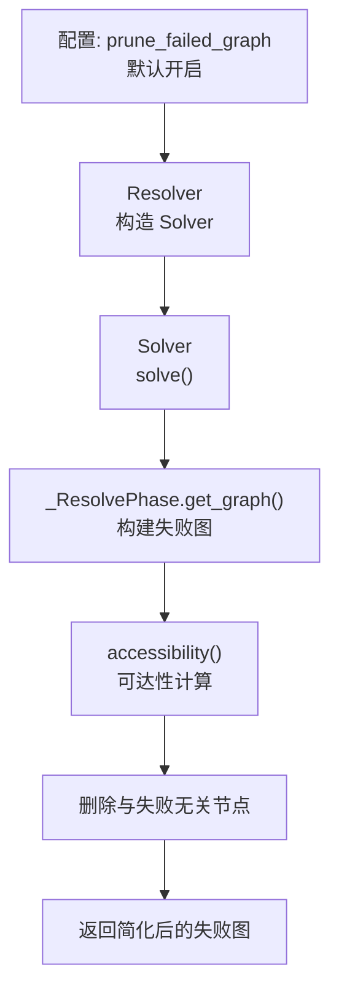
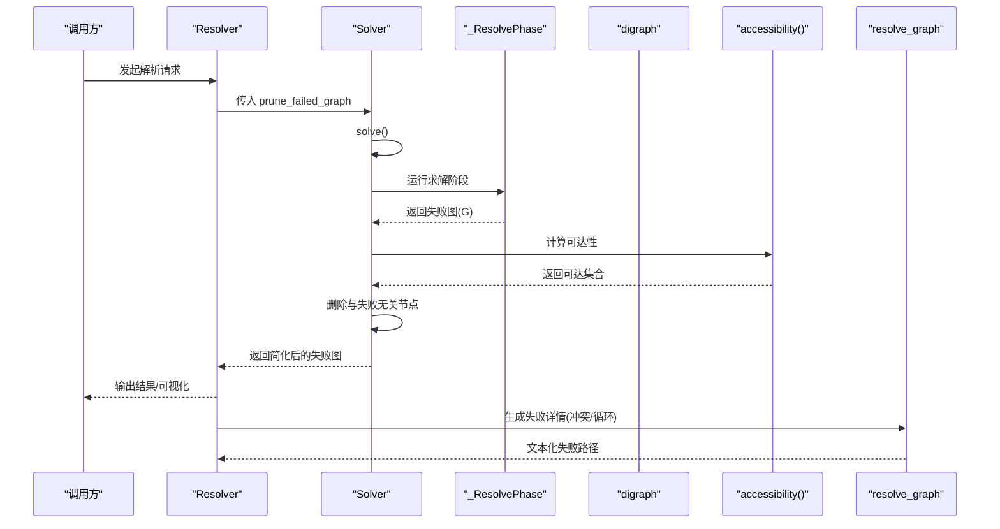
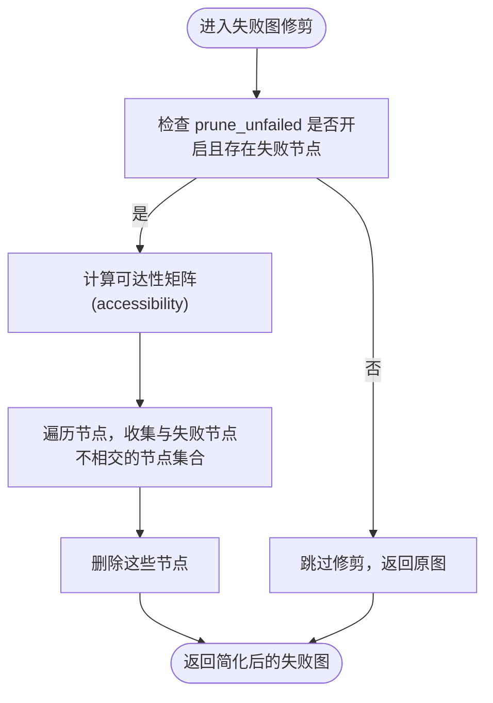
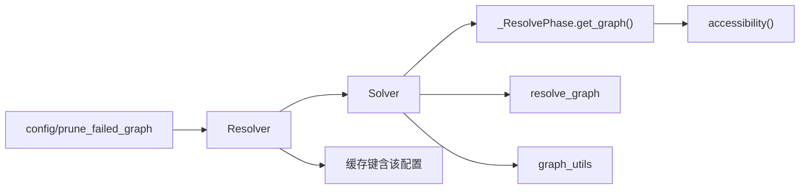

# 失败图修剪

<cite>
**本文引用的文件列表**
- [resolver.py](file://rez-3.3.0/src/rez/resolver.py)
- [solver.py](file://rez-3.3.0/src/rez/solver.py)
- [config.py](file://rez-3.3.0/src/rez/config.py)
- [rezconfig.py](file://rez-3.3.0/src/rez/rezconfig.py)
- [accessibility.py](file://rez-3.3.0/src/rez/vendor/pygraph/algorithms/accessibility.py)
- [resolve_graph.py](file://rez-3.3.0/src/rez/utils/resolve_graph.py)
- [graph_utils.py](file://rez-3.3.0/src/rez/utils/graph_utils.py)
- [SOLVER.md](file://rez-3.3.0/src/rez/SOLVER.md)
</cite>

## 目录
1. [简介](#简介)
2. [项目结构与定位](#项目结构与定位)
3. [核心组件与职责](#核心组件与职责)
4. [架构总览](#架构总览)
5. [详细组件分析](#详细组件分析)
6. [依赖关系分析](#依赖关系分析)
7. [性能与可扩展性](#性能与可扩展性)
8. [故障排查与调试](#故障排查与调试)
9. [结论与最佳实践](#结论与最佳实践)

## 简介
本篇文档围绕 Rez 解析器中的“失败图修剪”（prune_failed_graph）配置项展开，系统阐述其在依赖解析失败时如何通过移除与当前错误无关的节点，简化解析图，帮助开发者快速定位问题根因。文档将从配置项定义、调用链路、内部实现机制、可视化输出到调试辅助工具进行全链路解析，并给出在大型项目中的启用建议与使用场景。

## 项目结构与定位
- 配置项来源：全局配置对象中声明并默认开启失败图修剪。
- 调用入口：Resolver 在构造 Solver 时将配置值传入，Solver 在生成失败图后按策略执行修剪。
- 图算法：基于可达性（accessibility）计算每个节点的可达集合，删除与失败无关的节点。
- 可视化与诊断：提供从图中提取冲突路径、循环路径等细节信息的能力。

图表来源
- [resolver.py](file://rez-3.3.0/src/rez/resolver.py#L397-L413)
- [solver.py](file://rez-3.3.0/src/rez/solver.py#L1883-L1975)
- [accessibility.py](file://rez-3.3.0/src/rez/vendor/pygraph/algorithms/accessibility.py#L36-L61)

章节来源
- [resolver.py](file://rez-3.3.0/src/rez/resolver.py#L397-L413)
- [config.py](file://rez-3.3.0/src/rez/config.py#L460-L465)
- [rezconfig.py](file://rez-3.3.0/src/rez/rezconfig.py#L364-L368)

## 核心组件与职责
- 配置层
  - 配置键：prune_failed_graph（布尔）
  - 默认值：True
  - 作用：控制是否在失败时对解析图进行“失败无关节点”的修剪
- Resolver 层
  - 将配置值传递给 Solver
  - 缓存键包含该配置，确保缓存命中与行为一致
- Solver 层
  - 在失败阶段生成图
  - 按策略修剪失败无关节点
  - 提供失败详情（冲突/循环）的文本化描述
- 图算法与工具
  - accessibility 计算可达性矩阵
  - resolve_graph 从图中提取冲突/循环路径
  - graph_utils 支持点集修剪与渲染

章节来源
- [config.py](file://rez-3.3.0/src/rez/config.py#L460-L465)
- [rezconfig.py](file://rez-3.3.0/src/rez/rezconfig.py#L364-L368)
- [resolver.py](file://rez-3.3.0/src/rez/resolver.py#L397-L413)
- [solver.py](file://rez-3.3.0/src/rez/solver.py#L1883-L1975)
- [resolve_graph.py](file://rez-3.3.0/src/rez/utils/resolve_graph.py#L1-L45)
- [graph_utils.py](file://rez-3.3.0/src/rez/utils/graph_utils.py#L155-L201)

## 架构总览
下图展示了从请求到失败图生成与修剪的关键流程，以及与可视化工具的衔接。

图表来源
- [resolver.py](file://rez-3.3.0/src/rez/resolver.py#L397-L413)
- [solver.py](file://rez-3.3.0/src/rez/solver.py#L1883-L1975)
- [solver.py](file://rez-3.3.0/src/rez/solver.py#L1800-L1826)
- [resolve_graph.py](file://rez-3.3.0/src/rez/utils/resolve_graph.py#L1-L45)

## 详细组件分析

### 配置项：prune_failed_graph
- 定义位置与类型
  - 键名：prune_failed_graph
  - 类型：布尔
- 默认值与来源
  - 默认 True，位于默认配置文件中
- 行为说明
  - 当解析失败且该开关开启时，Solver 会在生成失败图后，删除与失败无关的节点，仅保留与冲突/循环直接相关的子图，便于聚焦问题根因

章节来源
- [config.py](file://rez-3.3.0/src/rez/config.py#L460-L465)
- [rezconfig.py](file://rez-3.3.0/src/rez/rezconfig.py#L364-L368)

### Resolver 如何传递配置
- Resolver 在构造 Solver 时，将配置项作为参数传入
- 同时，缓存键也包含该配置，保证缓存命中与行为一致

章节来源
- [resolver.py](file://rez-3.3.0/src/rez/resolver.py#L397-L413)
- [resolver.py](file://rez-3.3.0/src/rez/resolver.py#L375-L396)

### Solver 的失败图生成与修剪
- Solver 初始化时接收 prune_unfailed 参数（即来自配置的布尔值）
- 在失败阶段，_ResolvePhase.get_graph 会构建包含冲突/循环边的图
- 若 prune_unfailed 为真且存在失败节点，则使用 accessibility 计算可达性，删除与失败无关的节点

图表来源
- [solver.py](file://rez-3.3.0/src/rez/solver.py#L1883-L1975)
- [solver.py](file://rez-3.3.0/src/rez/solver.py#L1800-L1826)
- [accessibility.py](file://rez-3.3.0/src/rez/vendor/pygraph/algorithms/accessibility.py#L36-L61)

章节来源
- [solver.py](file://rez-3.3.0/src/rez/solver.py#L1883-L1975)
- [solver.py](file://rez-3.3.0/src/rez/solver.py#L1800-L1826)

### 失败详情与可视化辅助
- resolve_graph 从失败图中提取冲突或循环路径，生成人类可读的失败描述
- graph_utils 提供按节点向上游修剪图的能力，用于进一步聚焦问题范围

章节来源
- [resolve_graph.py](file://rez-3.3.0/src/rez/utils/resolve_graph.py#L1-L45)
- [resolve_graph.py](file://rez-3.3.0/src/rez/utils/resolve_graph.py#L46-L117)
- [graph_utils.py](file://rez-3.3.0/src/rez/utils/graph_utils.py#L155-L201)

### 解析算法背景与术语
- 解析器采用分阶段、抽取/合并/相交/归约/分裂的迭代策略
- 失败通常由请求冲突、相交冲突、归约导致的无解或循环依赖触发

章节来源
- [SOLVER.md](file://rez-3.3.0/src/rez/SOLVER.md#L11-L57)
- [solver.py](file://rez-3.3.0/src/rez/solver.py#L1983-L2023)

## 依赖关系分析
- 组件耦合
  - Resolver 依赖配置与缓存键，向 Solver 传递布尔开关
  - Solver 依赖图算法与可视化工具，负责最终输出
- 外部依赖
  - accessibility 来自第三方 vendor 包，提供可达性矩阵
- 潜在风险
  - 开启修剪可能影响某些调试场景对“全量上下文”的需求
  - accessibility 的递归限制与 DFS 实现对大图的性能有影响

图表来源
- [resolver.py](file://rez-3.3.0/src/rez/resolver.py#L375-L396)
- [resolver.py](file://rez-3.3.0/src/rez/resolver.py#L397-L413)
- [solver.py](file://rez-3.3.0/src/rez/solver.py#L1883-L1975)
- [accessibility.py](file://rez-3.3.0/src/rez/vendor/pygraph/algorithms/accessibility.py#L36-L61)
- [resolve_graph.py](file://rez-3.3.0/src/rez/utils/resolve_graph.py#L1-L45)
- [graph_utils.py](file://rez-3.3.0/src/rez/utils/graph_utils.py#L155-L201)

## 性能与可扩展性
- 计算复杂度
  - accessibility 基于 DFS，时间复杂度近似 O(V+E)，V 为节点数，E 为边数
  - 对于大型依赖图，修剪前的图规模越大，可达性计算成本越高
- 优化建议
  - 在大型项目中，优先开启修剪以减少输出体量
  - 结合 verbosity 与 suppress_passive 控制日志噪声
  - 使用缓存（resolve_caching）避免重复求解带来的开销

[本节为通用性能讨论，无需列出具体文件来源]

## 故障排查与调试
- 开启修剪的典型收益
  - 失败图显著瘦身，冲突/循环路径更清晰
  - resolve_graph 能从简化图中准确提取冲突链路
- 关闭修剪的适用场景
  - 需要观察“全量上下文”以确认边界条件
  - 排查跨包的隐式依赖传播路径
- 建议的调试步骤
  - 先以默认开启修剪查看失败摘要
  - 若仍需深入，临时关闭修剪，配合 resolve_graph 的冲突/循环路径输出定位根因
  - 使用 graph_utils 的按节点向上游修剪能力，进一步缩小范围

章节来源
- [resolve_graph.py](file://rez-3.3.0/src/rez/utils/resolve_graph.py#L1-L45)
- [graph_utils.py](file://rez-3.3.0/src/rez/utils/graph_utils.py#L155-L201)
- [solver.py](file://rez-3.3.0/src/rez/solver.py#L1800-L1826)

## 结论与最佳实践
- 默认开启修剪是推荐做法，尤其在大型项目中，能显著提升问题定位效率
- 在 CI 或自动化环境中，建议保持默认；在本地调试或需要“全量上下文”时再考虑关闭
- 结合 resolve_graph 的失败详情输出与 graph_utils 的图修剪工具，形成“先简化、后深挖”的调试闭环

[本节为总结性内容，无需列出具体文件来源]