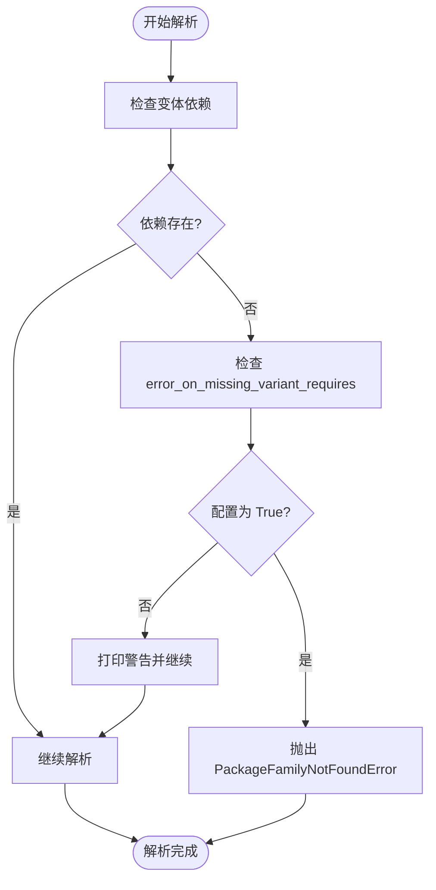

# 缺失变体处理

<cite>
**本文档中引用的文件**  
- [config.py](file://rez-3.3.0/src/rez/config.py#L437)
- [rezconfig.py](file://rez-3.3.0/src/rez/rezconfig.py#L471)
- [solver.py](file://rez-3.3.0/src/rez/solver.py#L1388)
- [test_solver.py](file://rez-3.3.0/src/rez/tests/test_solver.py#L251)
- [exceptions.py](file://rez-3.3.0/src/rez/exceptions.py#L44)
- [missing_variant_requires\1\package.py](file://rez-3.3.0/src/rez/data/tests/solver/packages/missing_variant_requires/1/package.py)
</cite>

## 目录
1. [配置项概述](#配置项概述)
2. [行为差异分析](#行为差异分析)
3. [访问策略影响](#访问策略影响)
4. [实际案例说明](#实际案例说明)
5. [内部处理流程](#内部处理流程)
6. [配置指导建议](#配置指导建议)

## 配置项概述

`error_on_missing_variant_requires` 是 Rez 包管理系统中的一个重要配置项，用于控制当一个包要求的变体不存在时的行为。该配置项定义在 `config.py` 文件中，其默认值为 `True`，表示在遇到缺失变体时抛出错误。

该配置项的主要作用是决定在解析依赖关系时，如果某个变体所需的包家族不存在，系统是应该严格报错还是静默忽略。这种机制对于确保开发环境和生产环境的一致性至关重要。

**Section sources**
- [config.py](file://rez-3.3.0/src/rez/config.py#L437)
- [rezconfig.py](file://rez-3.3.0/src/rez/rezconfig.py#L471)

## 行为差异分析

当 `error_on_missing_variant_requires` 设置为 `True` 时，如果在解析过程中发现某个变体所依赖的包家族不存在，系统将抛出 `PackageFamilyNotFoundError` 异常，并终止解析过程。这确保了依赖关系的完整性，防止潜在的运行时错误。

相反，当该配置设置为 `False` 时，系统会以警告形式输出错误信息，但不会中断解析过程。这意味着即使某些变体的依赖无法满足，解析器仍会尝试继续处理其他可用的变体。



**Diagram sources**
- [solver.py](file://rez-3.3.0/src/rez/solver.py#L1388)
- [exceptions.py](file://rez-3.3.0/src/rez/exceptions.py#L44)

**Section sources**
- [solver.py](file://rez-3.3.0/src/rez/solver.py#L1388)
- [test_solver.py](file://rez-3.3.0/src/rez/tests/test_solver.py#L251)

## 访问策略影响

在受限访问环境下，通常建议将 `error_on_missing_variant_requires` 设置为 `True`，以确保所有依赖都必须明确存在。这有助于维护环境的稳定性和可预测性，特别是在生产环境中。

而在开放访问或开发环境中，可以考虑将其设置为 `False`，以便允许更灵活的依赖解析。这种设置可以帮助开发者快速迭代和测试，而不必担心因缺少某些非关键依赖而导致构建失败。

需要注意的是，在使用 memcached 等缓存机制时，禁用此选项可能会导致不一致的解析结果，因为不同用户可能对包的访问权限不同。

**Section sources**
- [rezconfig.py](file://rez-3.3.0/src/rez/rezconfig.py#L471)
- [solver.py](file://rez-3.3.0/src/rez/solver.py#L1388)

## 实际案例说明

考虑一个名为 `missing_variant_requires` 的测试包，它定义了两个变体：`["noexist"]` 和 `["nada"]`。当 `error_on_missing_variant_requires` 为 `True` 时，尝试解析这个包会直接失败并抛出异常；而当该配置为 `False` 时，系统会输出警告信息但仍然能够成功解析到可用的变体。

```python
# 示例 package.py
name = "missing_variant_requires"
version = "1"

def commands():
    pass

variants = [
    ["noexist"],
    ["nada"]
]
```

在实际应用中，这种配置可以帮助团队在开发阶段容忍一些临时的依赖问题，同时在发布前通过启用严格模式来确保所有依赖都已正确配置。

**Section sources**
- [missing_variant_requires\1\package.py](file://rez-3.3.0/src/rez/data/tests/solver/packages/missing_variant_requires/1/package.py)
- [test_solver.py](file://rez-3.3.0/src/rez/tests/test_solver.py#L251)

## 内部处理流程

在 Rez 的求解器（solver）中，`error_on_missing_variant_requires` 配置项主要在 `_PackageScope` 类的初始化过程中发挥作用。当尝试创建一个新的包作用域时，如果目标包家族未找到，系统会根据该配置决定是抛出异常还是仅打印警告。

具体来说，在 `solver.py` 文件的第 1388 行附近，代码会检查 `config.error_on_missing_variant_requires` 的值。如果为 `False`，则打印错误消息并返回失败状态；否则，直接抛出 `PackageFamilyNotFoundError` 异常。

这一机制确保了依赖解析过程的可控性和可预测性，同时也为不同使用场景提供了灵活性。

**Section sources**
- [solver.py](file://rez-3.3.0/src/rez/solver.py#L1388)
- [config.py](file://rez-3.3.0/src/rez/config.py#L437)

## 配置指导建议

对于开发环境，推荐将 `error_on_missing_variant_requires` 设置为 `False`，以提高开发效率和容错能力。这样可以在不影响整体构建的情况下识别和修复依赖问题。

对于生产环境或 CI/CD 流水线，则强烈建议将其设置为 `True`，以确保所有依赖都必须显式存在且可访问。这有助于防止因隐式依赖缺失而导致的部署失败或运行时错误。

此外，在团队协作项目中，应通过版本控制统一管理此配置，避免因个人设置差异导致的不一致行为。

**Section sources**
- [rezconfig.py](file://rez-3.3.0/src/rez/rezconfig.py#L471)
- [test_solver.py](file://rez-3.3.0/src/rez/tests/test_solver.py#L251)