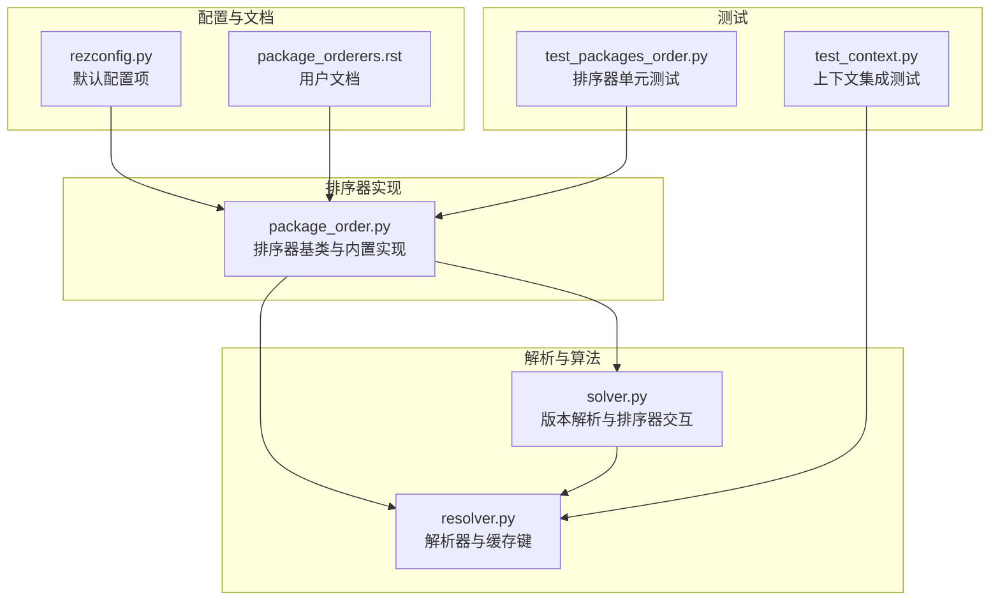
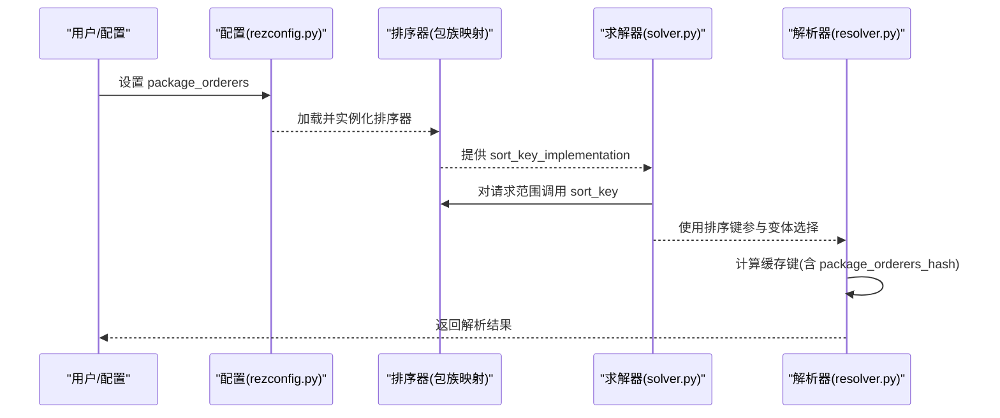
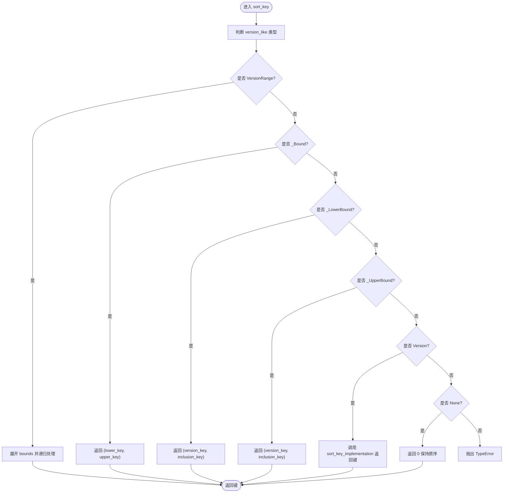
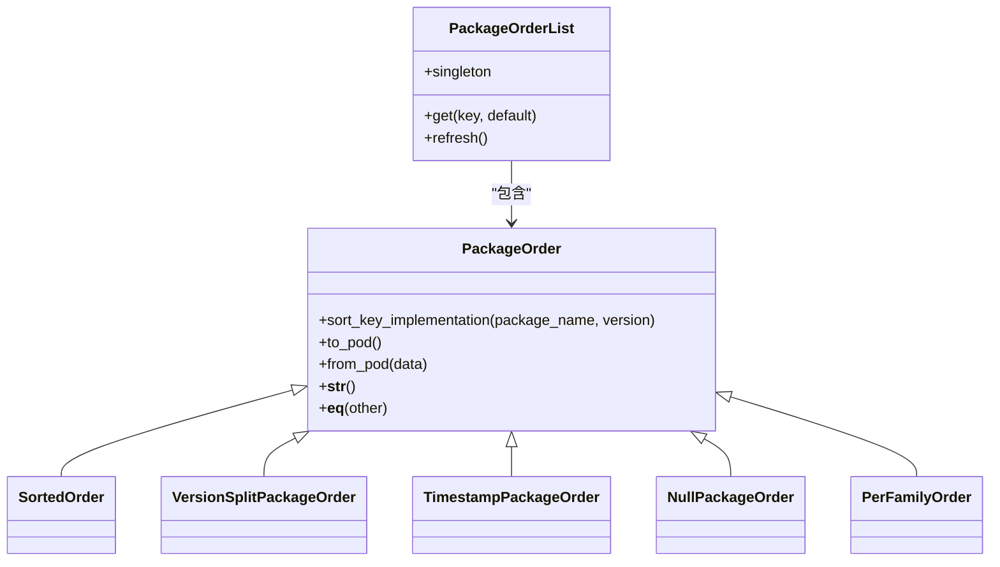
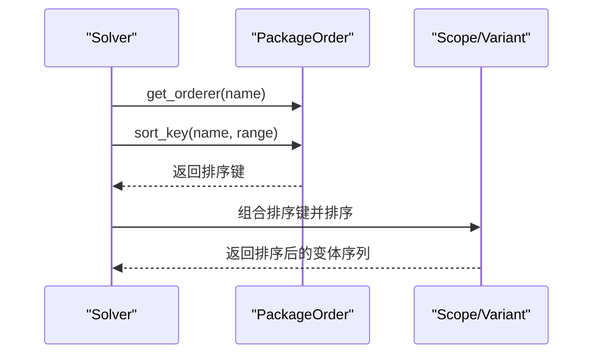

# 包排序策略

<cite>
**本文引用的文件**
- [package_order.py](file://rez-3.3.0/src/rez/package_order.py)
- [package_orderers.rst](file://rez-3.3.0/docs/source/package_orderers.rst)
- [rezconfig.py](file://rez-3.3.0/src/rez/rezconfig.py)
- [resolver.py](file://rez-3.3.0/src/rez/resolver.py)
- [solver.py](file://rez-3.3.0/src/rez/solver.py)
- [test_packages_order.py](file://rez-3.3.0/src/rez/tests/test_packages_order.py)
- [test_context.py](file://rez-3.3.0/src/rez/tests/test_context.py)
</cite>

## 目录
1. [简介](#简介)
2. [项目结构](#项目结构)
3. [核心组件](#核心组件)
4. [架构总览](#架构总览)
5. [详细组件分析](#详细组件分析)
6. [依赖分析](#依赖分析)
7. [性能考虑](#性能考虑)
8. [故障排查指南](#故障排查指南)
9. [结论](#结论)
10. [附录](#附录)

## 简介
本文件系统性阐述 Rez 的“包排序策略”，重点围绕配置项 package_orderers 如何影响版本解析优先级、自定义排序器的实现与注册机制、排序器与版本解析算法的交互关系，并给出性能影响评估与最佳实践建议。读者可据此在全局或按包族维度定制版本解析顺序，以优先选择稳定版本或特定分支的包。

## 项目结构
与包排序策略直接相关的代码主要分布在以下模块：
- 排序器定义与内置实现：src/rez/package_order.py
- 配置入口（默认值）：src/rez/rezconfig.py
- 解析流程与缓存键：src/rez/resolver.py
- 版本解析算法与排序器交互：src/rez/solver.py
- 文档与示例：docs/source/package_orderers.rst
- 单元测试：src/rez/tests/test_packages_order.py、src/rez/tests/test_context.py

图表来源
- [rezconfig.py](file://rez-3.3.0/src/rez/rezconfig.py#L450-L457)
- [package_order.py](file://rez-3.3.0/src/rez/package_order.py#L1-L120)
- [resolver.py](file://rez-3.3.0/src/rez/resolver.py#L375-L396)
- [solver.py](file://rez-3.3.0/src/rez/solver.py#L429-L458)
- [test_packages_order.py](file://rez-3.3.0/src/rez/tests/test_packages_order.py#L1-L120)
- [test_context.py](file://rez-3.3.0/src/rez/tests/test_context.py#L242-L273)

章节来源
- [rezconfig.py](file://rez-3.3.0/src/rez/rezconfig.py#L450-L457)
- [package_order.py](file://rez-3.3.0/src/rez/package_order.py#L1-L120)
- [resolver.py](file://rez-3.3.0/src/rez/resolver.py#L375-L396)
- [solver.py](file://rez-3.3.0/src/rez/solver.py#L429-L458)
- [test_packages_order.py](file://rez-3.3.0/src/rez/tests/test_packages_order.py#L1-L120)
- [test_context.py](file://rez-3.3.0/src/rez/tests/test_context.py#L242-L273)

## 核心组件
- 排序器基类与接口
  - 基类：PackageOrder
  - 关键方法：sort_key_implementation(package_name, version)、to_pod/from_pod、__str__/__eq__
  - 可重排序列：reorder(iterable, key=None)
- 内置排序器
  - SortedOrder：按版本升/降序
  - VersionSplitPackageOrder：将小于等于某版本的版本优先
  - TimestampPackageOrder：基于时间戳软优先，支持 rank 控制放宽范围
  - PerFamilyOrder：按包族应用不同排序器
  - NullPackageOrder/no_order：不改变顺序
- 排序器列表与查找
  - PackageOrderList：从配置加载、映射包名到排序器、单例缓存
  - get_orderer(package_name, orderers=None)：按包名查找排序器，支持通配符“*”
- 配置项
  - package_orderers：全局排序器配置，默认 None

章节来源
- [package_order.py](file://rez-3.3.0/src/rez/package_order.py#L43-L187)
- [package_order.py](file://rez-3.3.0/src/rez/package_order.py#L227-L279)
- [package_order.py](file://rez-3.3.0/src/rez/package_order.py#L397-L448)
- [package_order.py](file://rez-3.3.0/src/rez/package_order.py#L450-L615)
- [package_order.py](file://rez-3.3.0/src/rez/package_order.py#L617-L749)
- [rezconfig.py](file://rez-3.3.0/src/rez/rezconfig.py#L450-L457)

## 架构总览
排序器贯穿“配置—解析—缓存”链路，影响版本解析的优先级与缓存命中。

图表来源
- [rezconfig.py](file://rez-3.3.0/src/rez/rezconfig.py#L450-L457)
- [package_order.py](file://rez-3.3.0/src/rez/package_order.py#L617-L749)
- [solver.py](file://rez-3.3.0/src/rez/solver.py#L429-L458)
- [resolver.py](file://rez-3.3.0/src/rez/resolver.py#L375-L396)

## 详细组件分析

### 排序器基类与数据流
- sort_key_implementation 是排序器的核心，返回可用于排序的键对象；PackageOrder.sort_key 将 VersionRange/_Bound 等转换为可比较键，最终委托给 sort_key_implementation
- reorder 默认对同一包族内的候选版本进行排序，reverse=True 由上层传入
- FallbackComparable 支持主键比较失败时回退到备选键，保证稳定性

图表来源
- [package_order.py](file://rez-3.3.0/src/rez/package_order.py#L114-L149)

章节来源
- [package_order.py](file://rez-3.3.0/src/rez/package_order.py#L43-L187)

### 内置排序器详解
- SortedOrder
  - 按版本升/降序；descending=True 时等价于默认“最新版本优先”
- VersionSplitPackageOrder
  - 将 ≤ first_version 的版本优先，随后按默认排序
  - 典型用途：迁移语言版本时优先旧稳定版
- TimestampPackageOrder
  - 以时间戳 T 为界，先取 T 之前版本（降序），再取 T 之后版本
  - rank 控制放宽级别（如语义化版本的补丁位）
- PerFamilyOrder
  - 为不同包族指定不同排序器，支持 default_order
- NullPackageOrder/no_order
  - 不改变顺序，常用于在 per_family 中排除某些包族的重排序

章节来源
- [package_order.py](file://rez-3.3.0/src/rez/package_order.py#L227-L279)
- [package_order.py](file://rez-3.3.0/src/rez/package_order.py#L397-L448)
- [package_order.py](file://rez-3.3.0/src/rez/package_order.py#L450-L615)
- [package_order.py](file://rez-3.3.0/src/rez/package_order.py#L281-L375)
- [package_order.py](file://rez-3.3.0/src/rez/package_order.py#L189-L226)

### 排序器列表与查找机制
- PackageOrderList
  - 从配置加载（from_pod），维护“包名→排序器”的映射
  - refresh 时允许同名覆盖（后者生效），支持 packages 列表
- get_orderer
  - 优先按具体包名匹配，其次匹配通配符“*”，最后回退到默认排序器（版本降序）

图表来源
- [package_order.py](file://rez-3.3.0/src/rez/package_order.py#L43-L187)
- [package_order.py](file://rez-3.3.0/src/rez/package_order.py#L227-L615)
- [package_order.py](file://rez-3.3.0/src/rez/package_order.py#L617-L749)

章节来源
- [package_order.py](file://rez-3.3.0/src/rez/package_order.py#L617-L749)

### 自定义排序器实现与调用机制
- 实现步骤
  - 继承 PackageOrder，实现 sort_key_implementation、to_pod、from_pod、__str__、__eq__
  - 通过 register_orderer 注册新类型
  - 在配置中以 type 指定新类型，并传入必要参数
- 调用机制
  - 解析阶段通过 get_orderer 获取对应排序器
  - 对每个请求范围调用 sort_key，生成排序键参与变体选择
- 示例路径
  - 自定义排序器模板与注册：见文档示例路径
  - 集成测试：在上下文中传递自定义排序器并验证解析结果

章节来源
- [package_orderers.rst](file://rez-3.3.0/docs/source/package_orderers.rst#L188-L243)
- [package_order.py](file://rez-3.3.0/src/rez/package_order.py#L728-L749)
- [test_context.py](file://rez-3.3.0/src/rez/tests/test_context.py#L242-L273)

### 排序器与版本解析算法的交互
- solver 在变体选择时，会为每个请求范围计算排序键：
  - 对已请求范围：按 get_orderer(req.name).sort_key(...) 生成键
  - 对额外依赖：同样生成键并参与排序
- 最终排序键综合了“已请求范围优先级、额外依赖数量与名称、变体索引”等，排序器通过 sort_key 影响前半部分权重
- 这使得“稳定版本优先”“特定分支优先”等策略能以排序键形式体现

图表来源
- [solver.py](file://rez-3.3.0/src/rez/solver.py#L429-L458)

章节来源
- [solver.py](file://rez-3.3.0/src/rez/solver.py#L429-L458)

### 实际用例与示例路径
- 优先稳定版本（迁移场景）
  - 使用 version_split 对 python 包族设置 first_version，使 ≤ 2.7.16 的版本优先
  - 示例路径：[package_orderers.rst](file://rez-3.3.0/docs/source/package_orderers.rst#L58-L87)
- 按时间戳软优先（稳定窗口）
  - 使用 soft_timestamp 指定时间戳与 rank，优先 T 之前的版本，同时允许在 rank 上放宽
  - 示例路径：[package_orderers.rst](file://rez-3.3.0/docs/source/package_orderers.rst#L124-L176)
- per_family 精细化控制
  - 为不同包族分别指定排序器，未指定者回退 default_order
  - 示例路径：[package_orderers.rst](file://rez-3.3.0/docs/source/package_orderers.rst#L103-L122)
- 自定义排序器
  - 模板与注册方式参见文档示例路径
  - 集成测试验证排序器作用域与效果
  - 示例路径：[package_orderers.rst](file://rez-3.3.0/docs/source/package_orderers.rst#L188-L243)，[test_context.py](file://rez-3.3.0/src/rez/tests/test_context.py#L242-L273)

章节来源
- [package_orderers.rst](file://rez-3.3.0/docs/source/package_orderers.rst#L58-L176)
- [package_orderers.rst](file://rez-3.3.0/docs/source/package_orderers.rst#L188-L243)
- [test_context.py](file://rez-3.3.0/src/rez/tests/test_context.py#L242-L273)

## 依赖分析
- 配置到排序器
  - 配置项 package_orderers 默认 None，可在配置文件中设置
  - PackageOrderList.singleton 从 config.package_orderers 加载
- 排序器到解析器
  - get_orderer 从 PackageOrderList 查找排序器
  - solver 在变体选择时调用排序器生成排序键
- 缓存键与排序器
  - resolver 将 package_orderers_hash 纳入 memcache 键，确保不同排序策略的缓存隔离

图表来源
- [rezconfig.py](file://rez-3.3.0/src/rez/rezconfig.py#L450-L457)
- [package_order.py](file://rez-3.3.0/src/rez/package_order.py#L617-L749)
- [solver.py](file://rez-3.3.0/src/rez/solver.py#L429-L458)
- [resolver.py](file://rez-3.3.0/src/rez/resolver.py#L375-L396)

章节来源
- [rezconfig.py](file://rez-3.3.0/src/rez/rezconfig.py#L450-L457)
- [package_order.py](file://rez-3.3.0/src/rez/package_order.py#L617-L749)
- [resolver.py](file://rez-3.3.0/src/rez/resolver.py#L375-L396)
- [solver.py](file://rez-3.3.0/src/rez/solver.py#L429-L458)

## 性能考虑
- 排序器开销
  - 排序器本身仅在生成排序键时被调用，通常为 O(n log n) 的排序成本的一部分
  - 自定义排序器应避免昂贵的外部查询；可利用缓存（如 TimestampPackageOrder 内部缓存）
- 缓存隔离
  - resolver 将 package_orderers_hash 纳入缓存键，不同排序策略不会互相污染缓存
- 复杂度与稳定性
  - FallbackComparable 保证排序稳定性，避免因比较失败导致异常
- 最佳实践
  - 优先使用内置排序器（SortedOrder、VersionSplitPackageOrder、TimestampPackageOrder）
  - 自定义排序器需提供稳定的 __str__/__eq__ 与 to_pod/from_pod，便于序列化与缓存键生成
  - 合理设置 packages 参数，避免对全量包族施加不必要的重排序

[本节为通用指导，无需列出具体文件来源]

## 故障排查指南
- 排序器未生效
  - 检查配置项 package_orderers 是否正确设置
  - 确认包名匹配规则（精确包名 vs 通配符“*”）
  - 参考：[package_order.py](file://rez-3.3.0/src/rez/package_order.py#L716-L726)
- 自定义排序器无效
  - 确保已通过 register_orderer 注册
  - 确认 to_pod/from_pod 实现正确，且 type 名称一致
  - 参考：[package_orderers.rst](file://rez-3.3.0/docs/source/package_orderers.rst#L188-L243)
- 解析结果不符合预期
  - 使用测试用例验证排序器行为
  - 参考：[test_packages_order.py](file://rez-3.3.0/src/rez/tests/test_packages_order.py#L1-L120)
- 缓存命中异常
  - 检查 package_orderers_hash 是否随排序器变化而变化
  - 参考：[resolver.py](file://rez-3.3.0/src/rez/resolver.py#L375-L396)

章节来源
- [package_order.py](file://rez-3.3.0/src/rez/package_order.py#L716-L726)
- [package_orderers.rst](file://rez-3.3.0/docs/source/package_orderers.rst#L188-L243)
- [test_packages_order.py](file://rez-3.3.0/src/rez/tests/test_packages_order.py#L1-L120)
- [resolver.py](file://rez-3.3.0/src/rez/resolver.py#L375-L396)

## 结论
- package_orderers 通过“包族→排序器”的映射，将排序策略注入版本解析流程，从而影响最终解析优先级
- 内置排序器覆盖常见需求（稳定版本优先、时间窗口优先、按包族差异化），自定义排序器可满足特殊场景
- 排序器与解析器交互简洁清晰：排序器只负责生成排序键，最终由 solver 综合多因素决定变体选择
- 性能方面，排序器开销可控，且缓存键已考虑排序器差异，避免误命中

[本节为总结性内容，无需列出具体文件来源]

## 附录
- 配置项说明
  - package_orderers：全局排序器列表，默认 None
  - 参考：[rezconfig.py](file://rez-3.3.0/src/rez/rezconfig.py#L450-L457)
- 文档与示例
  - 用户文档：[package_orderers.rst](file://rez-3.3.0/docs/source/package_orderers.rst#L1-L244)
- 测试参考
  - 排序器行为验证：[test_packages_order.py](file://rez-3.3.0/src/rez/tests/test_packages_order.py#L1-L200)
  - 上下文集成测试：[test_context.py](file://rez-3.3.0/src/rez/tests/test_context.py#L242-L273)

章节来源
- [rezconfig.py](file://rez-3.3.0/src/rez/rezconfig.py#L450-L457)
- [package_orderers.rst](file://rez-3.3.0/docs/source/package_orderers.rst#L1-L244)
- [test_packages_order.py](file://rez-3.3.0/src/rez/tests/test_packages_order.py#L1-L200)
- [test_context.py](file://rez-3.3.0/src/rez/tests/test_context.py#L242-L273)