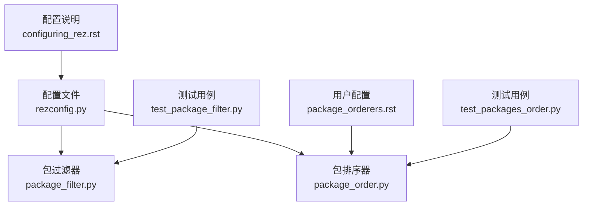
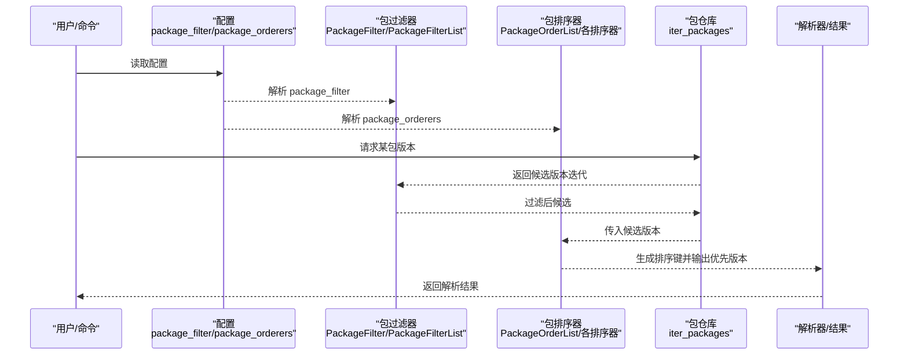
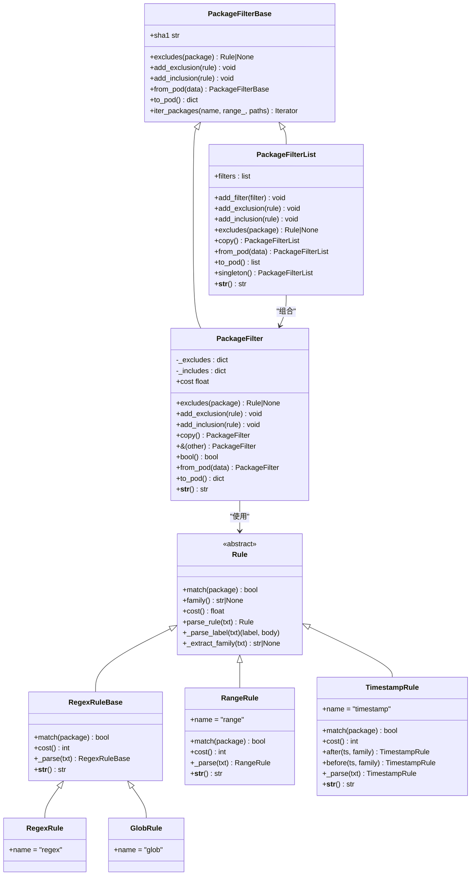
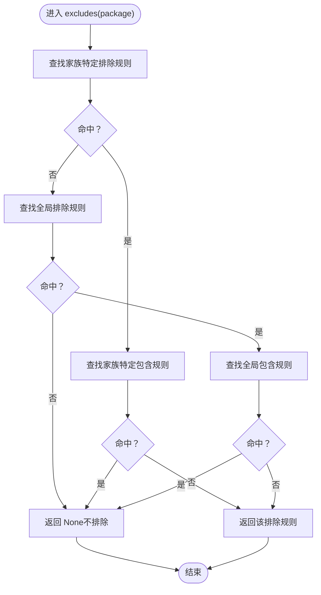
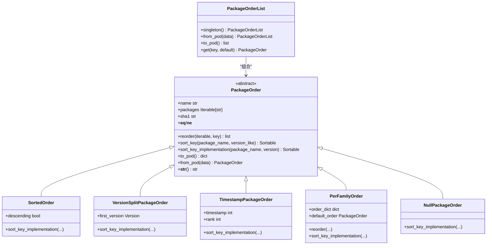
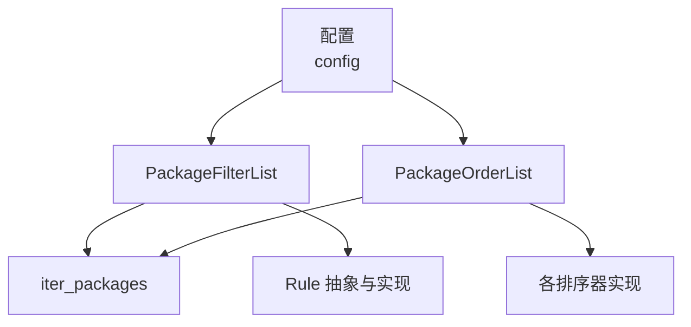

# 包过滤与排序

<cite>
**本文引用的文件**
- [package_filter.py](file://rez-3.3.0/src/rez/package_filter.py)
- [package_order.py](file://rez-3.3.0/src/rez/package_order.py)
- [test_package_filter.py](file://rez-3.3.0/src/rez/tests/test_package_filter.py)
- [test_packages_order.py](file://rez-3.3.0/src/rez/tests/test_packages_order.py)
- [package_orderers.rst](file://rez-3.3.0/docs/source/package_orderers.rst)
- [configuring_rez.rst](file://rez-3.3.0/docs/source/configuring_rez.rst)
- [rezconfig.py](file://rez-3.3.0/src/rez/rezconfig.py)
</cite>

## 目录
1. [简介](#简介)
2. [项目结构](#项目结构)
3. [核心组件](#核心组件)
4. [架构总览](#架构总览)
5. [详细组件分析](#详细组件分析)
6. [依赖关系分析](#依赖关系分析)
7. [性能考量](#性能考量)
8. [故障排查指南](#故障排查指南)
9. [结论](#结论)
10. [附录](#附录)

## 简介
本文件聚焦于 Rez 包管理中的“包过滤与排序”能力，系统讲解以下主题：
- package_filter 配置项：如何通过规则过滤包集合，支持 glob、regex、range、timestamp 等规则类型；解释排除与包含规则的优先级与组合逻辑。
- package_orderers 配置项：如何自定义版本解析顺序，优先选择特定版本或按时间软排序；涵盖内置排序器（sorted、version_split、per_family、soft_timestamp、no_order）及自定义扩展方法。
- 实战示例：如何在配置中排除测试版包、优先选择稳定版本、结合时间戳进行软排序等。
- 性能优化建议：基于规则成本与缓存策略的调优思路。

## 项目结构
围绕“包过滤与排序”的核心代码位于以下模块：
- 过滤器：package_filter.py
- 排序器：package_order.py
- 文档：package_orderers.rst
- 配置默认值：rezconfig.py
- 测试用例：test_package_filter.py、test_packages_order.py
- 配置说明：configuring_rez.rst

图表来源
- [rezconfig.py](file://rez-3.3.0/src/rez/rezconfig.py#L430-L457)
- [package_filter.py](file://rez-3.3.0/src/rez/package_filter.py#L1-L120)
- [package_order.py](file://rez-3.3.0/src/rez/package_order.py#L1-L120)
- [package_orderers.rst](file://rez-3.3.0/docs/source/package_orderers.rst#L1-L60)
- [test_package_filter.py](file://rez-3.3.0/src/rez/tests/test_package_filter.py#L1-L60)
- [test_packages_order.py](file://rez-3.3.0/src/rez/tests/test_packages_order.py#L1-L60)
- [configuring_rez.rst](file://rez-3.3.0/docs/source/configuring_rez.rst#L1-L60)

章节来源
- [package_filter.py](file://rez-3.3.0/src/rez/package_filter.py#L1-L120)
- [package_order.py](file://rez-3.3.0/src/rez/package_order.py#L1-L120)
- [package_orderers.rst](file://rez-3.3.0/docs/source/package_orderers.rst#L1-L60)
- [configuring_rez.rst](file://rez-3.3.0/docs/source/configuring_rez.rst#L1-L60)
- [rezconfig.py](file://rez-3.3.0/src/rez/rezconfig.py#L430-L457)

## 核心组件
- 包过滤器
  - PackageFilter：维护排除/包含规则集，按家族分组，支持从 POD 反序列化与序列化。
  - PackageFilterList：多个过滤器列表，按规则成本排序，短路匹配第一个排除规则。
  - Rule 抽象与具体规则：glob、regex、range、before/after（timestamp）。
- 包排序器
  - PackageOrder：排序器基类，定义 sort_key 生成与重排序流程。
  - 内置排序器：SortedOrder、VersionSplitPackageOrder、TimestampPackageOrder、PerFamilyOrder、NullPackageOrder。
  - PackageOrderList：从配置加载排序器链，按包族映射选择适用排序器。

章节来源
- [package_filter.py](file://rez-3.3.0/src/rez/package_filter.py#L90-L225)
- [package_filter.py](file://rez-3.3.0/src/rez/package_filter.py#L227-L325)
- [package_filter.py](file://rez-3.3.0/src/rez/package_filter.py#L326-L588)
- [package_order.py](file://rez-3.3.0/src/rez/package_order.py#L43-L187)
- [package_order.py](file://rez-3.3.0/src/rez/package_order.py#L189-L395)
- [package_order.py](file://rez-3.3.0/src/rez/package_order.py#L397-L749)

## 架构总览
下面的图展示了“包过滤与排序”的整体交互：配置驱动过滤器与排序器，解析阶段先应用过滤器缩小候选集，再由排序器对候选集进行优先级排序。

图表来源
- [package_filter.py](file://rez-3.3.0/src/rez/package_filter.py#L59-L120)
- [package_order.py](file://rez-3.3.0/src/rez/package_order.py#L618-L726)
- [test_package_filter.py](file://rez-3.3.0/src/rez/tests/test_package_filter.py#L30-L75)
- [test_packages_order.py](file://rez-3.3.0/src/rez/tests/test_packages_order.py#L38-L60)

## 详细组件分析

### 包过滤器（package_filter）
- 规则类型与语法规则
  - glob：通配符匹配，形如 glob(pattern)，可省略标签。
  - regex：正则表达式匹配，形如 regex(pattern)。
  - range：基于版本需求范围匹配，形如 range(requirement)。
  - before/after：基于时间戳过滤，形如 before(ts) 或 after(ts)，可带家族限定。
  - 自动推断：若未显式指定类型，会根据文本特征自动判定（含通配符走 glob，否则走 range）。
- 排除与包含规则优先级
  - 先按家族匹配排除规则，若无命中再尝试全局排除规则；若被排除，则检查是否被包含规则覆盖；只有当没有包含规则覆盖时才真正排除。
- 成本模型与排序
  - 每条规则有相对成本，过滤器内部按成本排序，家族特定规则成本除以 10，以鼓励更精确的规则优先执行。
- 序列化与反序列化
  - 支持 from_pod/to_pod，便于将规则存储到 rxt 文件或配置中。

图表来源
- [package_filter.py](file://rez-3.3.0/src/rez/package_filter.py#L15-L120)
- [package_filter.py](file://rez-3.3.0/src/rez/package_filter.py#L120-L225)
- [package_filter.py](file://rez-3.3.0/src/rez/package_filter.py#L227-L325)
- [package_filter.py](file://rez-3.3.0/src/rez/package_filter.py#L326-L588)

章节来源
- [package_filter.py](file://rez-3.3.0/src/rez/package_filter.py#L15-L120)
- [package_filter.py](file://rez-3.3.0/src/rez/package_filter.py#L160-L225)
- [package_filter.py](file://rez-3.3.0/src/rez/package_filter.py#L227-L325)
- [package_filter.py](file://rez-3.3.0/src/rez/package_filter.py#L326-L588)

#### 过滤规则语法与应用场景
- glob(*.beta)：排除所有以 .beta 结尾的版本，适合屏蔽测试版或预发布版本。
- regex(.*-\.beta$)：同上，但使用正则表达式，适合更复杂的命名模式。
- range(foo-5+)：仅保留满足需求范围的版本，适合限制最小版本或排除过旧版本。
- before(1429830188) / after(1429830188)：基于时间戳过滤，适合“软时间线”策略（见排序器部分）。
- 家族限定：规则可带家族前缀，如 foo-*.beta，仅作用于特定包族。

章节来源
- [package_filter.py](file://rez-3.3.0/src/rez/package_filter.py#L356-L434)
- [package_filter.py](file://rez-3.3.0/src/rez/package_filter.py#L434-L588)
- [test_package_filter.py](file://rez-3.3.0/src/rez/tests/test_package_filter.py#L75-L140)

#### 排除与包含规则的优先级流程

图表来源
- [package_filter.py](file://rez-3.3.0/src/rez/package_filter.py#L106-L134)

### 包排序器（package_order）
- 排序器基类
  - PackageOrder 定义了统一的排序接口 reorder 与 sort_key_implementation，支持从可迭代对象中提取包对象。
- 内置排序器
  - sorted：按版本升/降序排序，默认降序。
  - version_split：将小于等于给定版本的版本优先，其余按默认排序。
  - soft_timestamp（per_family）：按时间线软排序，允许在时间点之后的高一位版本（rank）内放宽。
  - per_family：按包族分别应用不同排序器，支持默认排序器。
  - no_order：不改变顺序（空操作），用于对特定包族禁用排序。
- 配置加载与映射
  - PackageOrderList.from_pod 将配置转换为排序器链；get(key) 基于包名映射到适用排序器；未命中的包族回退到 ALL_PACKAGES 或默认排序器（降序）。

图表来源
- [package_order.py](file://rez-3.3.0/src/rez/package_order.py#L43-L187)
- [package_order.py](file://rez-3.3.0/src/rez/package_order.py#L189-L395)
- [package_order.py](file://rez-3.3.0/src/rez/package_order.py#L397-L749)

章节来源
- [package_order.py](file://rez-3.3.0/src/rez/package_order.py#L43-L187)
- [package_order.py](file://rez-3.3.0/src/rez/package_order.py#L189-L395)
- [package_order.py](file://rez-3.3.0/src/rez/package_order.py#L397-L749)
- [package_orderers.rst](file://rez-3.3.0/docs/source/package_orderers.rst#L1-L120)

#### 排序器优先级与包族映射
- PackageOrderList 会将配置转换为排序器链，get(key) 会先按包名查找，未命中再回退到 ALL_PACKAGES，最后回退到默认排序器（降序）。
- per_family 可为不同包族设置不同的排序器，同时支持 default_order。

章节来源
- [package_order.py](file://rez-3.3.0/src/rez/package_order.py#L618-L726)

## 依赖关系分析
- 过滤器与排序器均依赖配置系统（config），从 package_filter 与 package_orderers 中读取配置。
- 过滤器通过 iter_packages 获取候选版本，排序器也依赖 iter_packages 提供的版本集合。
- 排序器之间存在继承关系，且通过注册表管理内置排序器。

图表来源
- [package_filter.py](file://rez-3.3.0/src/rez/package_filter.py#L312-L325)
- [package_order.py](file://rez-3.3.0/src/rez/package_order.py#L637-L726)
- [test_package_filter.py](file://rez-3.3.0/src/rez/tests/test_package_filter.py#L30-L75)
- [test_packages_order.py](file://rez-3.3.0/src/rez/tests/test_packages_order.py#L38-L60)

章节来源
- [package_filter.py](file://rez-3.3.0/src/rez/package_filter.py#L312-L325)
- [package_order.py](file://rez-3.3.0/src/rez/package_order.py#L637-L726)

## 性能考量
- 过滤器成本排序
  - 规则有相对成本，过滤器内部按成本排序，家族特定规则成本除以 10，优先执行低成本规则，减少不必要的匹配开销。
- 时间戳规则成本较高
  - TimestampRule 的成本远高于其他规则，因为需要加载包信息进行时间比较，应谨慎使用或限制在必要场景。
- 排序器缓存
  - TimestampPackageOrder 对“首个时间点之后版本”与排序键做了缓存，避免重复计算。
- 避免过度复杂正则
  - regex/glob 的复杂度会影响匹配性能，建议尽量使用简单明确的模式或范围约束。

章节来源
- [package_filter.py](file://rez-3.3.0/src/rez/package_filter.py#L160-L180)
- [package_filter.py](file://rez-3.3.0/src/rez/package_filter.py#L557-L588)
- [package_order.py](file://rez-3.3.0/src/rez/package_order.py#L506-L580)

## 故障排查指南
- 规则解析错误
  - 当规则字符串格式不正确时，会抛出配置错误，提示解析失败的具体原因与异常类型。
- 规则类型无效
  - 若使用了未知的规则类型标签，将报错提示该类型不存在。
- 时间戳规则注意事项
  - 使用 before/after 时需注意其与解析参数 timestamp 的区别：前者不会替代后者，且缓存机制不同；如需全局忽略时间点之后的包，可使用全局时间戳规则并配合包含规则微调例外。

章节来源
- [package_filter.py](file://rez-3.3.0/src/rez/package_filter.py#L382-L393)
- [package_filter.py](file://rez-3.3.0/src/rez/package_filter.py#L517-L529)

## 结论
- package_filter 提供灵活的包过滤能力，通过多种规则类型与家族限定，能够精准地排除或包含特定版本。
- package_orderers 则在候选集确定后，进一步对版本进行优先级排序，支持稳定版本优先、时间线软排序与按包族差异化策略。
- 合理配置与规则成本控制，可在保证解析正确性的同时提升性能与可维护性。

## 附录

### 实际配置示例与用法指引
- 排除测试版本包
  - 使用 glob(*.beta) 或 regex(.*-\.beta$) 排除以 .beta 结尾的版本；也可使用 before(ts) 排除晚于某时间发布的包。
  - 示例路径参考：[test_package_filter.py](file://rez-3.3.0/src/rez/tests/test_package_filter.py#L75-L140)
- 优先选择稳定版本
  - 使用 version_split(first_version) 将小于等于目标版本的版本优先；或使用 per_family 为特定包族设置 version_split。
  - 示例路径参考：[package_orderers.rst](file://rez-3.3.0/docs/source/package_orderers.rst#L58-L101)
- 时间线软排序
  - 使用 soft_timestamp(timestamp, rank) 在时间点之前优先，同时允许在指定位数（rank）内放宽到更高版本。
  - 示例路径参考：[package_orderers.rst](file://rez-3.3.0/docs/source/package_orderers.rst#L124-L176)
- 自定义排序器
  - 继承 PackageOrder 并实现 sort_key_implementation，注册后即可在 package_orderers 中使用。
  - 示例路径参考：[package_orderers.rst](file://rez-3.3.0/docs/source/package_orderers.rst#L188-L243)
- 配置入口与默认值
  - package_filter 与 package_orderers 的默认值与示例说明参见：
    - [rezconfig.py](file://rez-3.3.0/src/rez/rezconfig.py#L430-L457)
    - [configuring_rez.rst](file://rez-3.3.0/docs/source/configuring_rez.rst#L138-L151)

章节来源
- [test_package_filter.py](file://rez-3.3.0/src/rez/tests/test_package_filter.py#L75-L212)
- [test_packages_order.py](file://rez-3.3.0/src/rez/tests/test_packages_order.py#L131-L341)
- [package_orderers.rst](file://rez-3.3.0/docs/source/package_orderers.rst#L1-L244)
- [rezconfig.py](file://rez-3.3.0/src/rez/rezconfig.py#L430-L457)
- [configuring_rez.rst](file://rez-3.3.0/docs/source/configuring_rez.rst#L138-L151)