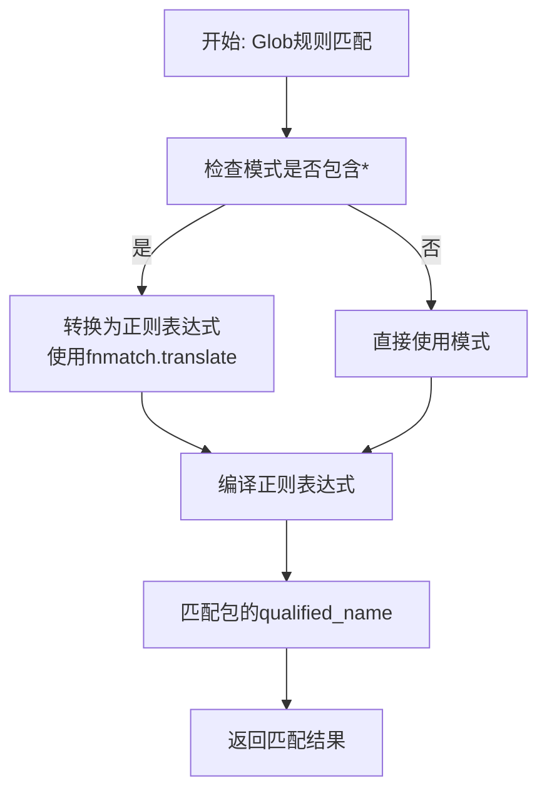
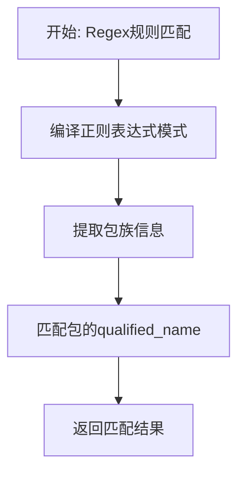
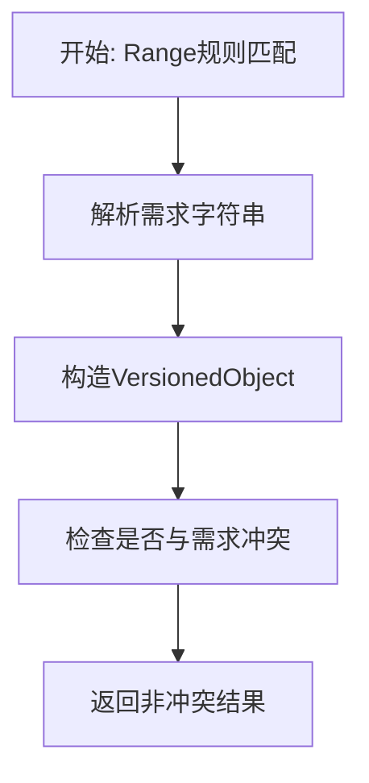
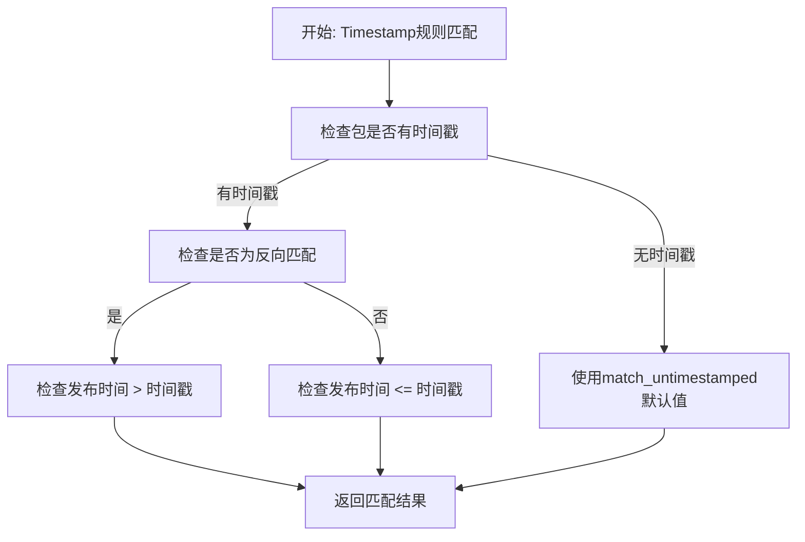
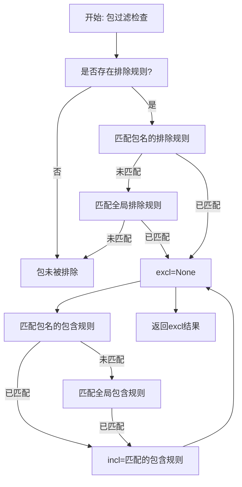
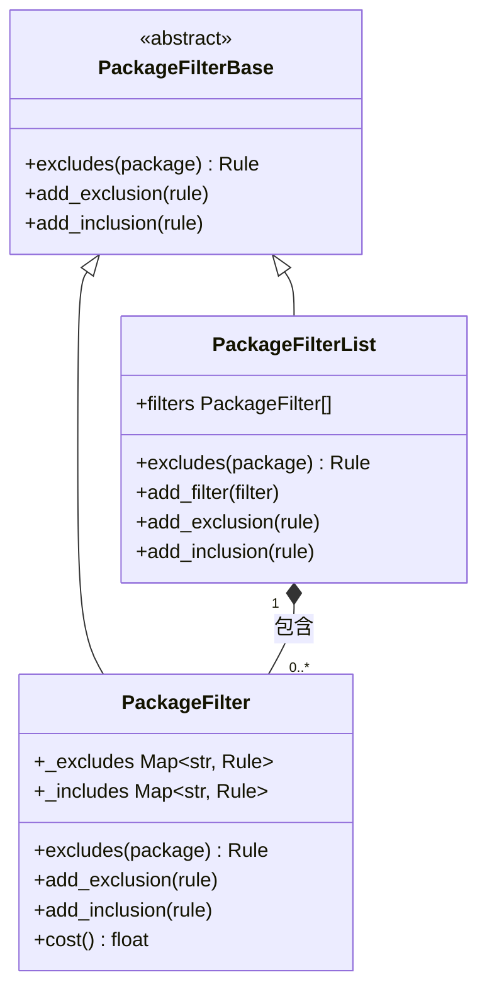
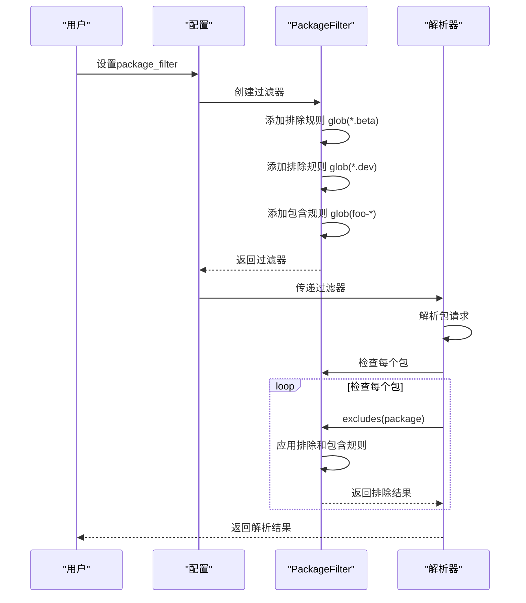
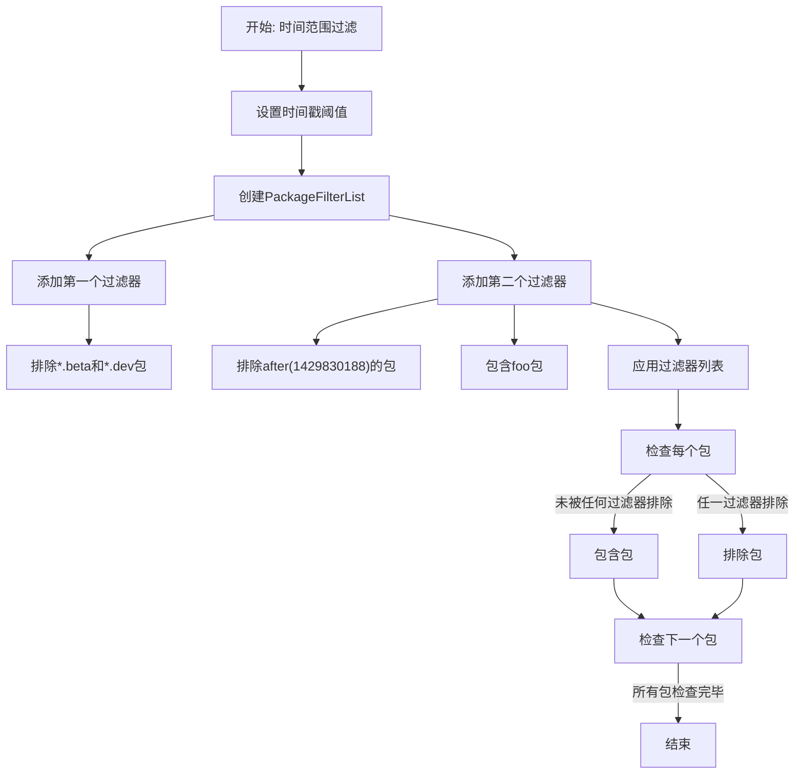
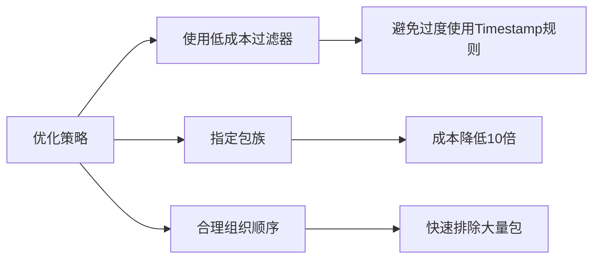

# 包过滤规则

<cite>
**本文档引用的文件**   
- [package_filter.py](file://rez-3.3.0\src\rez\package_filter.py)
- [test_package_filter.py](file://rez-3.3.0\src\rez\tests\test_package_filter.py)
- [rezconfig.py](file://rez-3.3.0\src\rez\config.py)
- [rezconfig.py](file://rez-3.3.0\src\rez\rezconfig.py)
- [env.py](file://rez-3.3.0\src\rez\cli\env.py)
</cite>

## 目录
1. [简介](#简介)
2. [包过滤规则类型](#包过滤规则类型)
3. [过滤规则的优先级和执行顺序](#过滤规则的优先级和执行顺序)
4. [组合过滤器的使用场景](#组合过滤器的使用场景)
5. [性能优化建议](#性能优化建议)
6. [常见问题排查指南](#常见问题排查指南)
7. [总结](#总结)

## 简介

包过滤规则是Rez系统中用于控制包可见性的重要机制。通过配置`package_filter`，用户可以定义哪些包在解析过程中应该被排除或包含。这种机制对于管理复杂的依赖关系、排除测试版本包或限制特定时间范围内的包参与解析非常有用。

包过滤系统基于`PackageFilter`和`PackageFilterList`类实现，支持多种过滤语法，包括glob、regex、range、before和after等。这些规则可以单独使用，也可以组合使用以实现复杂的过滤逻辑。

**Section sources**
- [package_filter.py](file://rez-3.3.0\src\rez\package_filter.py#L87-L105)
- [test_package_filter.py](file://rez-3.3.0\src\rez\tests\test_package_filter.py#L5-L17)

## 包过滤规则类型

### Glob规则

Glob规则使用通配符模式来匹配包名。它支持`*`和`?`等通配符，其中`*`匹配任意数量的字符，`?`匹配单个字符。



**Diagram sources**
- [package_filter.py](file://rez-3.3.0\src\rez\package_filter.py#L462-L478)

**Section sources**
- [package_filter.py](file://rez-3.3.0\src\rez\package_filter.py#L462-L478)

### Regex规则

Regex规则使用正则表达式来匹配包名。它提供了比Glob规则更强大的模式匹配能力。



**Diagram sources**
- [package_filter.py](file://rez-3.3.0\src\rez\package_filter.py#L444-L461)

**Section sources**
- [package_filter.py](file://rez-3.3.0\src\rez\package_filter.py#L444-L461)

### Range规则

Range规则基于版本需求来匹配包。它使用版本比较逻辑来确定包是否符合指定的范围。



**Diagram sources**
- [package_filter.py](file://rez-3.3.0\src\rez\package_filter.py#L480-L507)

**Section sources**
- [package_filter.py](file://rez-3.3.0\src\rez\package_filter.py#L480-L507)

### Timestamp规则

Timestamp规则基于包的发布时间戳来匹配包。它支持`before`和`after`两种操作，分别用于匹配在指定时间之前或之后发布的包。



**Diagram sources**
- [package_filter.py](file://rez-3.3.0\src\rez\package_filter.py#L508-L587)

**Section sources**
- [package_filter.py](file://rez-3.3.0\src\rez\package_filter.py#L508-L587)

## 过滤规则的优先级和执行顺序

包过滤规则的执行遵循特定的优先级和顺序。理解这些规则对于正确配置过滤器至关重要。

### 单个过滤器的执行逻辑

在一个`PackageFilter`中，排除规则和包含规则的执行顺序如下：

1. 首先检查包是否匹配任何排除规则
2. 如果匹配排除规则，则进一步检查是否匹配任何包含规则
3. 只有当包匹配排除规则但不匹配任何包含规则时，该包才会被排除



**Diagram sources**
- [package_filter.py](file://rez-3.3.0\src\rez\package_filter.py#L106-L133)

**Section sources**
- [package_filter.py](file://rez-3.3.0\src\rez\package_filter.py#L106-L133)

### 多个过滤器的执行顺序

当使用`PackageFilterList`时，多个过滤器的执行顺序遵循"或"逻辑：只要任何一个过滤器排除了包，该包就会被排除。



**Diagram sources**
- [package_filter.py](file://rez-3.3.0\src\rez\package_filter.py#L89-L285)

**Section sources**
- [package_filter.py](file://rez-3.3.0\src\rez\package_filter.py#L89-L285)

## 组合过滤器的使用场景

### 排除测试版本包

常见的使用场景是排除所有测试版本的包，但允许特定包的测试版本。



**Diagram sources**
- [rezconfig.py](file://rez-3.3.0\src\rez\rezconfig.py#L397-L432)
- [test_package_filter.py](file://rez-3.3.0\src\rez\tests\test_package_filter.py#L142-L153)

**Section sources**
- [rezconfig.py](file://rez-3.3.0\src\rez\rezconfig.py#L397-L432)
- [test_package_filter.py](file://rez-3.3.0\src\rez\tests\test_package_filter.py#L142-L153)

### 限制时间范围内的包

另一个常见场景是只允许特定时间范围内的包参与解析。



**Diagram sources**
- [rezconfig.py](file://rez-3.3.0\src\rez\rezconfig.py#L416-L431)
- [test_package_filter.py](file://rez-3.3.0\src\rez\tests\test_package_filter.py#L175-L211)

**Section sources**
- [rezconfig.py](file://rez-3.3.0\src\rez\rezconfig.py#L416-L431)
- [test_package_filter.py](file://rez-3.3.0\src\rez\tests\test_package_filter.py#L175-L211)

## 性能优化建议

### 过滤器成本计算

Rez系统为不同类型的过滤器分配了不同的成本值，以优化执行效率：

- Glob和Regex规则：成本为10
- Range规则：成本为10
- Timestamp规则：成本为1000（因为需要加载包信息）
- 特定包族的过滤器成本除以10

```python
def cost(self):
    """获取此过滤器的近似成本。
    
    成本是此过滤器中排除规则的总成本。特定包族过滤器
    的成本除以10。
    
    Returns:
        float: 过滤器的近似成本。
    """
    total = 0.0
    for family, rules in self._excludes.items():
        cost = sum(x.cost() for x in rules)
        if family:
            cost = cost / float(10)
        total += cost
    return total
```

**Section sources**
- [package_filter.py](file://rez-3.3.0\src\rez\package_filter.py#L165-L179)

### 优化策略

1. **优先使用低成本过滤器**：尽量使用Glob和Regex规则，避免过度使用Timestamp规则
2. **指定包族**：为过滤器指定具体的包族可以显著降低执行成本
3. **合理组织过滤器顺序**：将成本低的过滤器放在前面，可以快速排除大量包



**Diagram sources**
- [package_filter.py](file://rez-3.3.0\src\rez\package_filter.py#L173-L178)

**Section sources**
- [package_filter.py](file://rez-3.3.0\src\rez\package_filter.py#L173-L178)

## 常见问题排查指南

### 规则解析错误

当规则字符串格式不正确时，系统会抛出配置错误：

```python
@classmethod
def parse_rule(cls, txt):
    """从字符串解析规则。
    
    Args:
        txt (str): 要解析的字符串。
    
    Returns:
        Rule:
    """
    types = {"glob": GlobRule,
             "regex": RegexRule,
             "range": RangeRule,
             "before": TimestampRule,
             "after": TimestampRule}
    
    # 解析形式为'x(y)'的字符串
    label, txt = Rule._parse_label(txt)
    if label is None:
        if '*' in txt:
            label = "glob"
        else:
            label = "range"
    elif label not in types:
        raise ConfigurationError(
            "'%s'不是有效的包过滤器类型" % label)
    
    rule_cls = types[label]
    txt_ = "%s(%s)" % (label, txt)
    
    try:
        rule = rule_cls._parse(txt_)
    except Exception as e:
        raise ConfigurationError("解析包过滤器'%s'时出错：%s: %s"
                                 % (txt_, e.__class__.__name__, str(e)))
    return rule
```

**Section sources**
- [package_filter.py](file://rez-3.3.0\src\rez\package_filter.py#L357-L393)

### 调试技巧

可以通过命令行参数来调试过滤器：

```python
# 在env.py中处理命令行参数
if opts.no_filters:
    package_filter = PackageFilterList()
else:
    package_filter = PackageFilterList.singleton.copy()

for rule_str in (opts.exclude or []):
    rule = Rule.parse_rule(rule_str)
    package_filter.add_exclusion(rule)

for rule_str in (opts.include or []):
    rule = Rule.parse_rule(rule_str)
    package_filter.add_inclusion(rule)
```

**Section sources**
- [env.py](file://rez-3.3.0\src\rez\cli\env.py#L196-L207)

## 总结

包过滤规则是Rez系统中强大的功能，允许用户精细控制包的可见性。通过理解不同类型的过滤规则及其执行逻辑，用户可以创建复杂的过滤策略来满足各种需求。

关键要点：
- Glob和Regex规则适用于模式匹配
- Range规则基于版本需求进行匹配
- Timestamp规则基于发布时间进行过滤
- 排除规则和包含规则的组合提供了灵活的控制
- 多个过滤器按"或"逻辑组合
- 过滤器成本影响执行效率，应合理优化

正确使用包过滤规则可以帮助管理复杂的依赖关系，确保解析结果的稳定性和可预测性。

**Section sources**
- [package_filter.py](file://rez-3.3.0\src\rez\package_filter.py#L87-L588)
- [test_package_filter.py](file://rez-3.3.0\src\rez\tests\test_package_filter.py#L1-L211)
- [rezconfig.py](file://rez-3.3.0\src\rez\rezconfig.py#L397-L457)