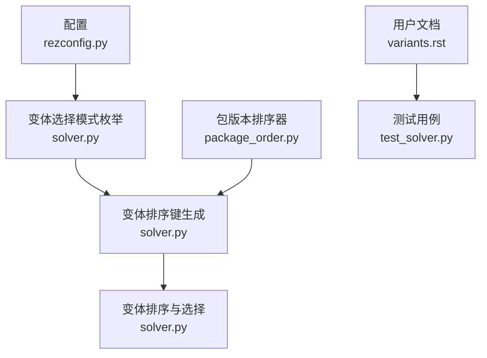
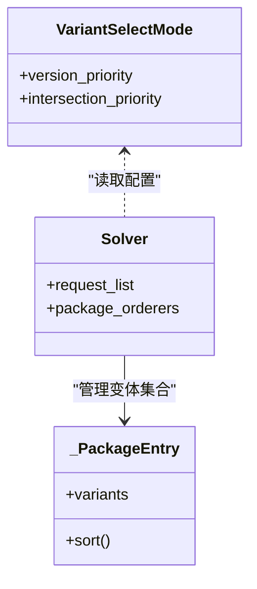
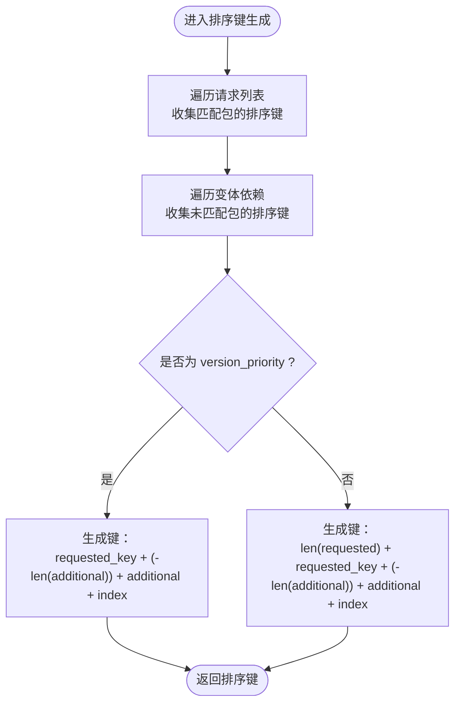
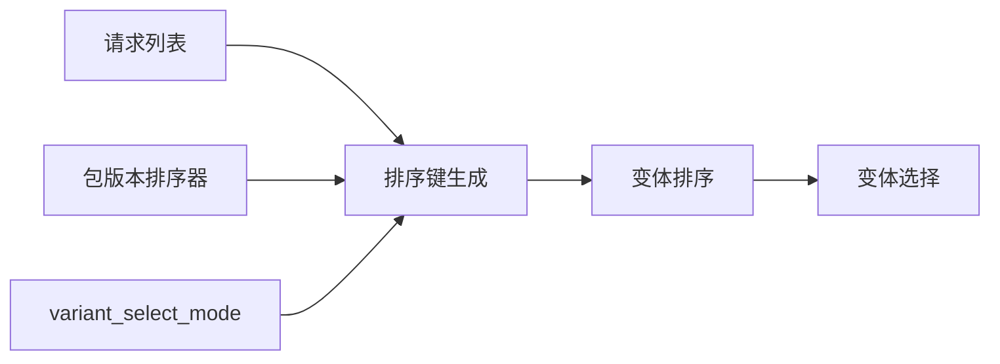

# 变体选择模式

<cite>
**本文引用的文件**
- [solver.py](file://rez-3.3.0/src/rez/solver.py)
- [rezconfig.py](file://rez-3.3.0/src/rez/rezconfig.py)
- [variants.rst](file://rez-3.3.0/docs/source/variants.rst)
- [test_solver.py](file://rez-3.3.0/src/rez/tests/test_solver.py)
- [package_order.py](file://rez-3.3.0/src/rez/package_order.py)
- [configuring_rez.rst](file://rez-3.3.0/docs/source/configuring_rez.rst)
</cite>

## 目录
1. [简介](#简介)
2. [项目结构](#项目结构)
3. [核心组件](#核心组件)
4. [架构总览](#架构总览)
5. [详细组件分析](#详细组件分析)
6. [依赖关系分析](#依赖关系分析)
7. [性能考量](#性能考量)
8. [故障排查指南](#故障排查指南)
9. [结论](#结论)
10. [附录](#附录)

## 简介
本文件围绕 Rez 的“变体选择模式”展开，系统性阐述 variant_select_mode 配置项的两种模式（version_priority 和 intersection_priority）在解析过程中的行为差异；并结合 allow_unversioned_packages 配置项对解析性能的影响，给出可操作的选择建议与优化策略。文档同时提供基于仓库源码的流程图、类图与序列图，帮助读者从代码层面理解变体排序与选择机制。

## 项目结构
与“变体选择模式”直接相关的代码主要集中在以下模块：
- 解析器与排序：solver.py 中定义了 VariantSelectMode 枚举与变体排序键生成逻辑
- 配置项：rezconfig.py 中定义了 variant_select_mode 与 allow_unversioned_packages 的默认值与说明
- 文档与示例：variants.rst 对模式差异有直观说明；test_solver.py 提供了模式切换的测试用例
- 包版本排序器：package_order.py 定义了包版本排序键生成，影响变体排序中的次序权重

图表来源
- [solver.py](file://rez-3.3.0/src/rez/solver.py#L59-L63)
- [solver.py](file://rez-3.3.0/src/rez/solver.py#L418-L459)
- [rezconfig.py](file://rez-3.3.0/src/rez/rezconfig.py#L370-L396)
- [package_order.py](file://rez-3.3.0/src/rez/package_order.py#L114-L149)
- [variants.rst](file://rez-3.3.0/docs/source/variants.rst#L160-L230)
- [test_solver.py](file://rez-3.3.0/src/rez/tests/test_solver.py#L231-L244)

章节来源
- [solver.py](file://rez-3.3.0/src/rez/solver.py#L59-L63)
- [solver.py](file://rez-3.3.0/src/rez/solver.py#L418-L459)
- [rezconfig.py](file://rez-3.3.0/src/rez/rezconfig.py#L370-L396)
- [variants.rst](file://rez-3.3.0/docs/source/variants.rst#L160-L230)
- [test_solver.py](file://rez-3.3.0/src/rez/tests/test_solver.py#L231-L244)
- [package_order.py](file://rez-3.3.0/src/rez/package_order.py#L114-L149)

## 核心组件
- 变体选择模式枚举：定义了 version_priority 与 intersection_priority 两种模式
- 变体排序键生成：根据请求列表、交集数量、附加包数量与版本范围生成稳定可比较的排序键
- 包版本排序器：为每个包族提供排序键，用于在同族内按版本优先级排序
- 配置项：variant_select_mode 控制主排序策略；allow_unversioned_packages 影响解析性能

章节来源
- [solver.py](file://rez-3.3.0/src/rez/solver.py#L59-L63)
- [solver.py](file://rez-3.3.0/src/rez/solver.py#L418-L459)
- [rezconfig.py](file://rez-3.3.0/src/rez/rezconfig.py#L370-L396)
- [rezconfig.py](file://rez-3.3.0/src/rez/rezconfig.py#L458-L460)
- [package_order.py](file://rez-3.3.0/src/rez/package_order.py#L114-L149)

## 架构总览
下面的类图展示了与变体选择模式相关的核心类型及其关系。

图表来源
- [solver.py](file://rez-3.3.0/src/rez/solver.py#L59-L63)
- [solver.py](file://rez-3.3.0/src/rez/solver.py#L396-L459)
- [solver.py](file://rez-3.3.0/src/rez/solver.py#L1-L120)

## 详细组件分析

### 变体选择模式：version_priority 与 intersection_priority
- 版本优先（version_priority）
  - 主要依据：与请求列表中包匹配的变体中，版本更高的包优先
  - 次要依据：若匹配包版本相同，则优先附加包更少的变体；再其次按附加包版本与名称排序；最后以变体索引保证确定性
- 交集优先（intersection_priority）
  - 主要依据：优先选择与请求列表交集数量更多的变体
  - 次要依据：当交集数量相同时，退化为 version_priority 的排序规则

排序键生成逻辑（简化）：
- 计算 requested_key：记录请求列表中出现的包名及对应版本范围的排序键
- 计算 additional_key：记录未出现在请求列表但存在于变体中的包的排序键
- 根据模式生成最终排序键：
  - version_priority：(requested_key, -len(additional_key), additional_key, variant.index)
  - intersection_priority：(len(requested_key), requested_key, -len(additional_key), additional_key, variant.index)

图表来源
- [solver.py](file://rez-3.3.0/src/rez/solver.py#L418-L459)

章节来源
- [solver.py](file://rez-3.3.0/src/rez/solver.py#L418-L459)
- [variants.rst](file://rez-3.3.0/docs/source/variants.rst#L160-L230)
- [test_solver.py](file://rez-3.3.0/src/rez/tests/test_solver.py#L231-L244)

### 包版本排序器对变体排序的影响
- 包版本排序器通过 sort_key 将版本范围转换为可比较的排序键，从而在变体排序时决定“更高版本”的含义
- 当多个变体在请求包版本上相同或交集数量相同时，排序器会进一步细化比较维度，确保稳定排序

章节来源
- [package_order.py](file://rez-3.3.0/src/rez/package_order.py#L114-L149)
- [solver.py](file://rez-3.3.0/src/rez/solver.py#L418-L459)

### 配置项：variant_select_mode
- 默认值：version_priority
- 可选值：version_priority、intersection_priority
- 作用：控制变体排序主策略，进而影响解析结果

章节来源
- [rezconfig.py](file://rez-3.3.0/src/rez/rezconfig.py#L370-L396)
- [variants.rst](file://rez-3.3.0/docs/source/variants.rst#L160-L230)

### 配置项：allow_unversioned_packages
- 默认值：True
- 性能说明：禁用未版本化包可略微提升解析速度
- 注意：该设置会影响解析器在处理未带版本号的包时的行为与性能

章节来源
- [rezconfig.py](file://rez-3.3.0/src/rez/rezconfig.py#L458-L460)

### 测试用例：模式差异验证
- version_priority 模式测试：当请求包含 python 时，解析结果优先选择更高版本的 python 所在变体
- intersection_priority 模式测试：当请求包含多个包时，解析结果优先选择与请求交集数量更多的变体

章节来源
- [test_solver.py](file://rez-3.3.0/src/rez/tests/test_solver.py#L231-L244)

## 依赖关系分析
- 变体排序依赖于：
  - 请求列表：决定 requested_key 的构建
  - 包版本排序器：决定版本范围到排序键的映射
  - 配置项：决定主排序策略（version_priority 或 intersection_priority）

图表来源
- [solver.py](file://rez-3.3.0/src/rez/solver.py#L418-L459)
- [rezconfig.py](file://rez-3.3.0/src/rez/rezconfig.py#L370-L396)
- [package_order.py](file://rez-3.3.0/src/rez/package_order.py#L114-L149)

章节来源
- [solver.py](file://rez-3.3.0/src/rez/solver.py#L418-L459)
- [rezconfig.py](file://rez-3.3.0/src/rez/rezconfig.py#L370-L396)
- [package_order.py](file://rez-3.3.0/src/rez/package_order.py#L114-L149)

## 性能考量
- allow_unversioned_packages
  - 默认启用（True），允许未版本化包参与解析，可能增加解析复杂度
  - 若项目中尽量避免未版本化包，将其设为 False 可能带来轻微性能收益
- 变体排序复杂度
  - 排序键生成涉及请求匹配与附加包统计，整体复杂度与请求规模、变体数量成正比
  - intersection_priority 在请求包较多时，可能因额外的交集计数而略增开销
- 建议
  - 明确项目对“未版本化包”的容忍度，如无必要尽量避免
  - 在大型解析场景中，优先使用 version_priority 以减少交集计算成本
  - 合理配置 package_orderers，减少不必要的版本回溯与冲突检测

章节来源
- [rezconfig.py](file://rez-3.3.0/src/rez/rezconfig.py#L458-L460)
- [solver.py](file://rez-3.3.0/src/rez/solver.py#L418-L459)

## 故障排查指南
- 症状：解析结果与预期不符（尤其在非互斥变体场景）
  - 排查要点：确认 variant_select_mode 设置；检查请求列表中各包的版本范围与交集数量
  - 参考文档：variants.rst 中关于“非互斥变体”的说明
- 症状：解析时间过长
  - 排查要点：检查 allow_unversioned_packages 是否为 True；评估请求规模与变体数量
  - 优化建议：减少未版本化包；拆分请求；调整 package_orderers
- 症状：解析失败或循环依赖
  - 排查要点：查看 solver 中的失败原因类型（TotalReduction、DependencyConflicts、Cycle 等）
  - 参考实现：solver.py 中 FailureReason 相关类与错误描述

章节来源
- [variants.rst](file://rez-3.3.0/docs/source/variants.rst#L160-L230)
- [solver.py](file://rez-3.3.0/src/rez/solver.py#L215-L289)

## 结论
- version_priority 更强调“与请求匹配的包的最高版本”，适合大多数明确版本约束的场景
- intersection_priority 更强调“与请求的交集数量”，适合多目标并存且希望优先满足更多请求的场景
- allow_unversioned_packages 的启用会引入额外的解析成本，建议在可控范围内尽量避免
- 实践中可根据项目规模与团队偏好选择模式，并配合合理的包版本排序器与请求设计，获得更稳定、更快的解析体验

## 附录

### 使用示例与最佳实践
- 选择 version_priority 的典型场景
  - 明确指定关键依赖（如 python、编译器）的版本
  - 追求稳定与可预测的解析结果
- 选择 intersection_priority 的典型场景
  - 多个工具链或平台支持在同一包中以变体形式存在
  - 希望优先满足尽可能多的请求包
- 配置与验证
  - 在配置文件中设置 variant_select_mode
  - 使用测试用例风格的断言验证解析结果（参考 test_solver.py 中的模式切换测试）

章节来源
- [test_solver.py](file://rez-3.3.0/src/rez/tests/test_solver.py#L231-L244)
- [configuring_rez.rst](file://rez-3.3.0/docs/source/configuring_rez.rst#L1-L151)