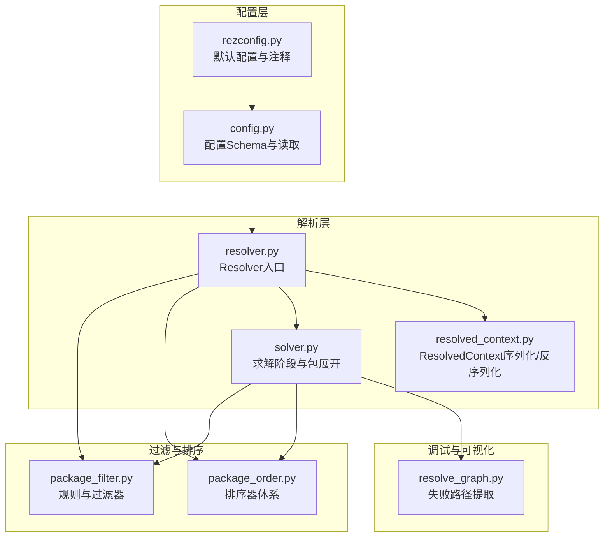
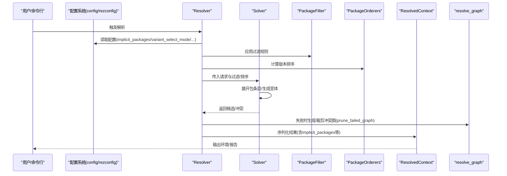
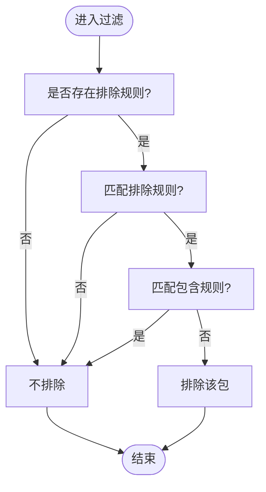
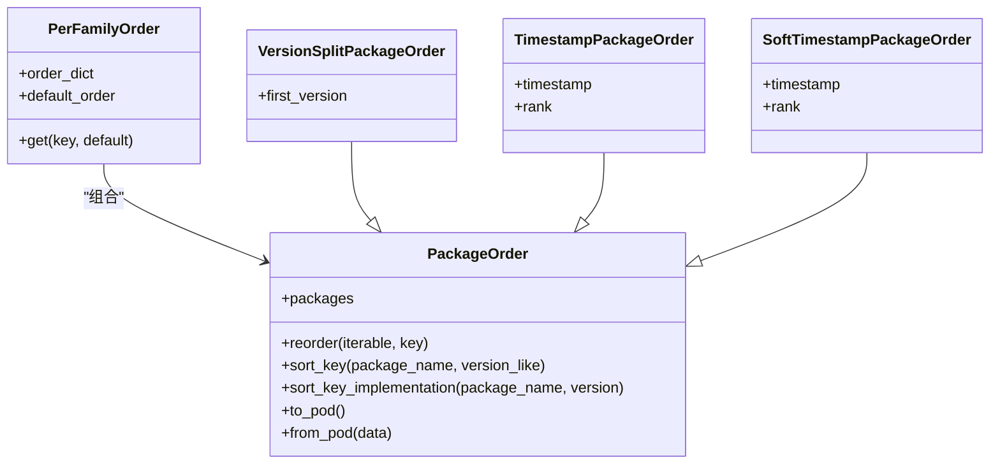
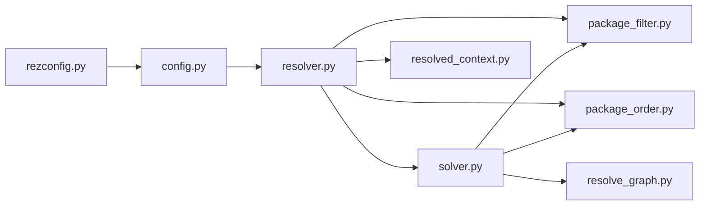

# 解析配置

<cite>
**本文引用的文件**
- [config.py](file://rez-3.3.0/src/rez/config.py)
- [rezconfig.py](file://rez-3.3.0/src/rez/rezconfig.py)
- [resolver.py](file://rez-3.3.0/src/rez/resolver.py)
- [resolved_context.py](file://rez-3.3.0/src/rez/resolved_context.py)
- [package_filter.py](file://rez-3.3.0/src/rez/package_filter.py)
- [package_order.py](file://rez-3.3.0/src/rez/package_order.py)
- [solver.py](file://rez-3.3.0/src/rez/solver.py)
- [resolve_graph.py](file://rez-3.3.0/src/rez/utils/resolve_graph.py)
- [configuring_rez.rst](file://rez-3.3.0/docs/source/configuring_rez.rst)
- [package_orderers.rst](file://rez-3.3.0/docs/source/package_orderers.rst)
</cite>

## 目录
1. [简介](#简介)
2. [项目结构](#项目结构)
3. [核心组件](#核心组件)
4. [架构总览](#架构总览)
5. [详细组件分析](#详细组件分析)
6. [依赖关系分析](#依赖关系分析)
7. [性能考量](#性能考量)
8. [故障排查指南](#故障排查指南)
9. [结论](#结论)
10. [附录](#附录)

## 简介
本篇文档聚焦于 Rez 的“解析配置”，系统阐述影响包解析与环境创建的关键配置项：implicit_packages、variant_select_mode、package_filter、package_orderers，并深入解释 prune_failed_graph 在解决依赖冲突时的调试价值，以及 error_on_missing_variant_requires 在处理受限访问包时的策略。同时给出通过配置过滤器排除测试版本包、通过排序器优先选择特定版本的实际示例路径，以及 allow_unversioned_packages 对解析性能的影响与优化建议。

## 项目结构
围绕解析配置的相关代码主要分布在以下模块：
- 配置定义与加载：config.py、rezconfig.py
- 解析流程与上下文：resolver.py、resolved_context.py、solver.py
- 过滤与排序：package_filter.py、package_order.py
- 冲突图与调试：resolve_graph.py
- 文档与示例：configuring_rez.rst、package_orderers.rst

图表来源
- [config.py](file://rez-3.3.0/src/rez/config.py#L364-L513)
- [rezconfig.py](file://rez-3.3.0/src/rez/rezconfig.py#L360-L559)
- [resolver.py](file://rez-3.3.0/src/rez/resolver.py#L1-L200)
- [resolved_context.py](file://rez-3.3.0/src/rez/resolved_context.py#L1500-L1699)
- [solver.py](file://rez-3.3.0/src/rez/solver.py#L490-L569)
- [package_filter.py](file://rez-3.3.0/src/rez/package_filter.py#L1-L200)
- [package_order.py](file://rez-3.3.0/src/rez/package_order.py#L1-L200)
- [resolve_graph.py](file://rez-3.3.0/src/rez/utils/resolve_graph.py#L40-L117)

章节来源
- [config.py](file://rez-3.3.0/src/rez/config.py#L364-L513)
- [rezconfig.py](file://rez-3.3.0/src/rez/rezconfig.py#L360-L559)

## 核心组件
- implicit_packages：在解析环境中自动注入的包请求列表，影响环境创建与解析初始状态。
- variant_select_mode：决定同一包内多个变体（variants）的选择策略，影响最终选型。
- package_filter：包级过滤规则集合，支持 glob、regex、range、before/after 等规则，可排除测试版、过期版本等。
- package_orderers：版本排序器，用于优先选择特定版本或按时间戳排序，影响解析顺序与结果稳定性。
- prune_failed_graph：在失败解析时裁剪无关节点，提升冲突诊断可读性。
- error_on_missing_variant_requires：当某变体的 requires 无法解析到可用包时，是否立即报错或尝试其他变体。
- allow_unversioned_packages：允许未带版本号的包参与解析，可能影响性能与缓存命中。

章节来源
- [rezconfig.py](file://rez-3.3.0/src/rez/rezconfig.py#L360-L559)
- [config.py](file://rez-3.3.0/src/rez/config.py#L364-L513)
- [resolver.py](file://rez-3.3.0/src/rez/resolver.py#L1-L200)
- [resolved_context.py](file://rez-3.3.0/src/rez/resolved_context.py#L1500-L1699)

## 架构总览
解析配置贯穿“配置加载—解析器—求解器—上下文—可视化”的链路，关键点如下：
- 配置层：config.py 定义 Schema；rezconfig.py 提供默认值与注释。
- 解析层：resolver.py 组合 package_filter、package_orderers、timestamp，生成缓存键并调用 Solver。
- 求解层：solver.py 展开包条目、应用过滤器、生成变体切片，输出候选集。
- 上下文层：resolved_context.py 序列化/反序列化包含 implicit_packages、package_filter、package_orderers 等字段。
- 调试层：resolve_graph.py 基于失败图提取路径，prune_failed_graph 控制图规模。

图表来源
- [resolver.py](file://rez-3.3.0/src/rez/resolver.py#L1-L200)
- [solver.py](file://rez-3.3.0/src/rez/solver.py#L490-L569)
- [resolved_context.py](file://rez-3.3.0/src/rez/resolved_context.py#L1500-L1699)
- [resolve_graph.py](file://rez-3.3.0/src/rez/utils/resolve_graph.py#L40-L117)

## 详细组件分析

### implicit_packages：隐式包注入
- 作用：在解析环境中自动加入一组包请求，常用于将系统工具、基础运行时等作为隐式依赖。
- 影响：改变解析初始请求集合，影响后续变体选择与环境变量设置。
- 关联字段：ResolvedContext 序列化中包含 implicit_packages 字段，用于记录最终生效的隐式包集合。

章节来源
- [resolved_context.py](file://rez-3.3.0/src/rez/resolved_context.py#L1500-L1699)

### variant_select_mode：变体选择模式
- 可选值：version_priority、intersection_priority。
- 行为差异：在多变体场景下，两种模式对“更高版本”与“与请求交集更大”的偏好不同，直接影响最终选型。
- 配置位置：位于默认配置文件中，可通过环境变量覆盖。

章节来源
- [rezconfig.py](file://rez-3.3.0/src/rez/rezconfig.py#L360-L559)

### package_filter：包过滤器
- 规则类型：glob、regex、range、before、after 等。
- 逻辑：先匹配排除规则，再检查包含规则；仅当满足“至少一条排除且无包含”时才排除。
- 性能成本：不同规则有不同代价，框架会按代价排序以优化匹配顺序。
- 时间戳规则：可与解析时间戳组合，形成“排除之后发布”的全局过滤。

图表来源
- [package_filter.py](file://rez-3.3.0/src/rez/package_filter.py#L90-L160)
- [package_filter.py](file://rez-3.3.0/src/rez/package_filter.py#L160-L210)
- [package_filter.py](file://rez-3.3.0/src/rez/package_filter.py#L326-L420)

章节来源
- [package_filter.py](file://rez-3.3.0/src/rez/package_filter.py#L1-L200)
- [resolver.py](file://rez-3.3.0/src/rez/resolver.py#L1-L200)

### package_orderers：版本排序器
- 作用：控制同一包家族版本的解析顺序，优先选择目标版本，同时保留显式请求的灵活性。
- 类型示例：version_split、sorted、timestamped、soft_timestamp 等。
- 配置方式：支持 per_family 分组与默认排序器，可从 YAML/Python 配置文件加载。

图表来源
- [package_order.py](file://rez-3.3.0/src/rez/package_order.py#L1-L200)
- [package_order.py](file://rez-3.3.0/src/rez/package_order.py#L319-L690)

章节来源
- [package_order.py](file://rez-3.3.0/src/rez/package_order.py#L1-L200)
- [package_order.py](file://rez-3.3.0/src/rez/package_order.py#L319-L690)
- [package_orderers.rst](file://rez-3.3.0/docs/source/package_orderers.rst#L135-L243)

### prune_failed_graph：失败图裁剪
- 作用：在失败解析时，仅保留与失败直接相关的节点，去除“无关”节点，便于定位冲突路径。
- 使用场景：结合 resolve_graph 的失败路径提取函数，输出更清晰的冲突报告。

章节来源
- [rezconfig.py](file://rez-3.3.0/src/rez/rezconfig.py#L360-L559)
- [resolve_graph.py](file://rez-3.3.0/src/rez/utils/resolve_graph.py#L40-L117)

### error_on_missing_variant_requires：受限访问包策略
- 作用：当某变体声明的 requires 无法解析到任何可用包时，是否立即失败，还是尝试其他变体。
- 默认开启：有助于保证解析确定性，但需注意不同用户可见包集差异可能导致缓存不一致。

章节来源
- [rezconfig.py](file://rez-3.3.0/src/rez/rezconfig.py#L360-L559)

### allow_unversioned_packages：未版本包
- 作用：允许未带版本号的包参与解析。
- 性能影响：关闭可略微提升解析速度与缓存命中率，但会限制某些场景下的灵活性。

章节来源
- [rezconfig.py](file://rez-3.3.0/src/rez/rezconfig.py#L360-L559)

## 依赖关系分析
- 配置层：config.py 定义 Schema 并负责合并、覆盖与延迟加载；rezconfig.py 提供默认值与注释。
- 解析层：resolver.py 将配置转换为解析器内部对象，组合 package_filter 与 package_orderers，生成缓存键。
- 求解层：solver.py 在包展开阶段应用过滤器与排序器，生成候选变体。
- 上下文层：resolved_context.py 在序列化时保存 implicit_packages、package_filter、package_orderers 等字段。
- 调试层：resolve_graph.py 与 prune_failed_graph 协作，输出冲突路径。

图表来源
- [config.py](file://rez-3.3.0/src/rez/config.py#L364-L513)
- [rezconfig.py](file://rez-3.3.0/src/rez/rezconfig.py#L360-L559)
- [resolver.py](file://rez-3.3.0/src/rez/resolver.py#L1-L200)
- [solver.py](file://rez-3.3.0/src/rez/solver.py#L490-L569)
- [resolved_context.py](file://rez-3.3.0/src/rez/resolved_context.py#L1500-L1699)
- [package_filter.py](file://rez-3.3.0/src/rez/package_filter.py#L1-L200)
- [package_order.py](file://rez-3.3.0/src/rez/package_order.py#L1-L200)
- [resolve_graph.py](file://rez-3.3.0/src/rez/utils/resolve_graph.py#L40-L117)

## 性能考量
- allow_unversioned_packages：关闭可减少解析不确定性，提高缓存命中率与解析速度。
- package_filter：合理使用 glob/regex/range 等规则，避免昂贵的时间戳规则（如 before/after）在大规模解析中频繁触发。
- package_orderers：通过 per_family 与默认排序器组合，尽量将热点版本排在前面，减少回溯。
- prune_failed_graph：开启后可显著降低失败图规模，提升调试效率，但不会改变解析过程本身。

章节来源
- [rezconfig.py](file://rez-3.3.0/src/rez/rezconfig.py#L360-L559)
- [package_filter.py](file://rez-3.3.0/src/rez/package_filter.py#L508-L588)
- [package_order.py](file://rez-3.3.0/src/rez/package_order.py#L1-L200)

## 故障排查指南
- 使用 prune_failed_graph 与 resolve_graph：在失败解析时，生成并裁剪冲突图，提取从初始请求到冲突/环的路径，辅助定位问题。
- 启用 debug_package_exclusions：在解析过程中打印被过滤掉的包及其规则，帮助确认过滤器是否误伤。
- 检查 error_on_missing_variant_requires：若存在部分用户可见包集差异，关闭此选项可尝试其他变体，但需关注缓存一致性风险。

章节来源
- [rezconfig.py](file://rez-3.3.0/src/rez/rezconfig.py#L360-L559)
- [solver.py](file://rez-3.3.0/src/rez/solver.py#L490-L569)
- [resolve_graph.py](file://rez-3.3.0/src/rez/utils/resolve_graph.py#L40-L117)

## 结论
解析配置是 Rez 解析行为的“总开关”。通过合理配置 implicit_packages、variant_select_mode、package_filter、package_orderers，可以稳定地控制解析顺序、排除不期望的版本与变体，并在失败时获得更清晰的诊断信息。prune_failed_graph 与 error_on_missing_variant_requires 则分别提升了调试效率与对受限访问包的容错能力。allow_unversioned_packages 在性能与灵活性之间提供权衡，建议根据团队实践进行取舍。

## 附录

### 实际示例路径（不含代码片段）
- 排除测试版本包（通过 package_filter）
  - 参考规则类型与语法：[package_filter.py](file://rez-3.3.0/src/rez/package_filter.py#L326-L420)
  - 默认配置注释与示例：[rezconfig.py](file://rez-3.3.0/src/rez/rezconfig.py#L398-L450)
  - 配置加载与合并规则：[configuring_rez.rst](file://rez-3.3.0/docs/source/configuring_rez.rst#L1-L151)

- 通过排序器优先选择特定版本（通过 package_orderers）
  - 排序器类型与示例：[package_order.py](file://rez-3.3.0/src/rez/package_order.py#L319-L690)
  - 文档示例（soft_timestamp）：[package_orderers.rst](file://rez-3.3.0/docs/source/package_orderers.rst#L135-L243)

- 在解析器中应用过滤与排序
  - 解析器初始化与缓存键：[resolver.py](file://rez-3.3.0/src/rez/resolver.py#L1-L200)
  - 包展开与过滤应用：[solver.py](file://rez-3.3.0/src/rez/solver.py#L490-L569)

- 失败图与调试
  - 失败路径提取：[resolve_graph.py](file://rez-3.3.0/src/rez/utils/resolve_graph.py#L40-L117)
  - 开启失败图裁剪：[rezconfig.py](file://rez-3.3.0/src/rez/rezconfig.py#L360-L559)