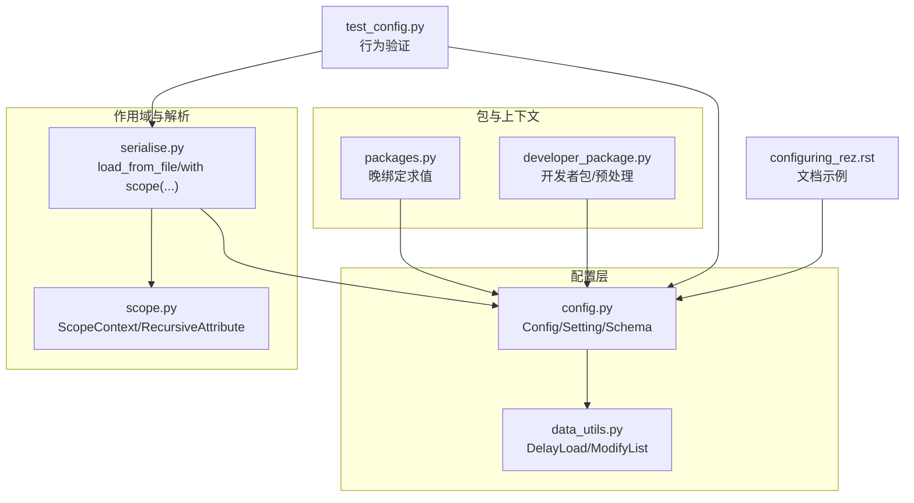
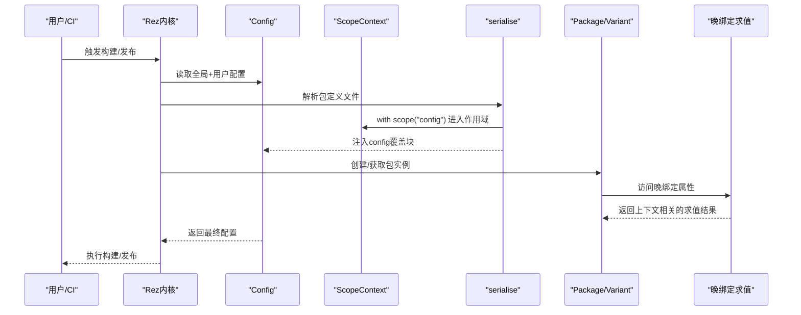
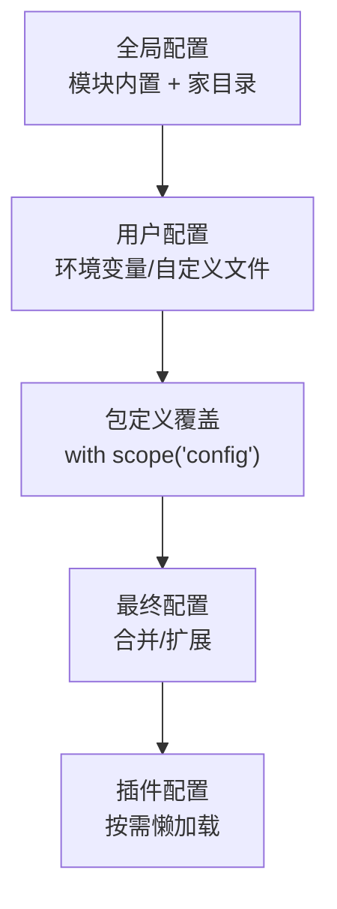
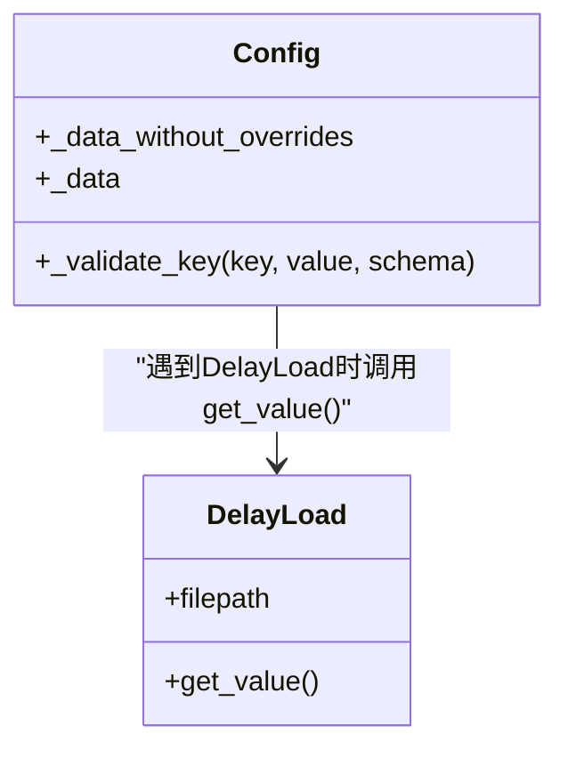
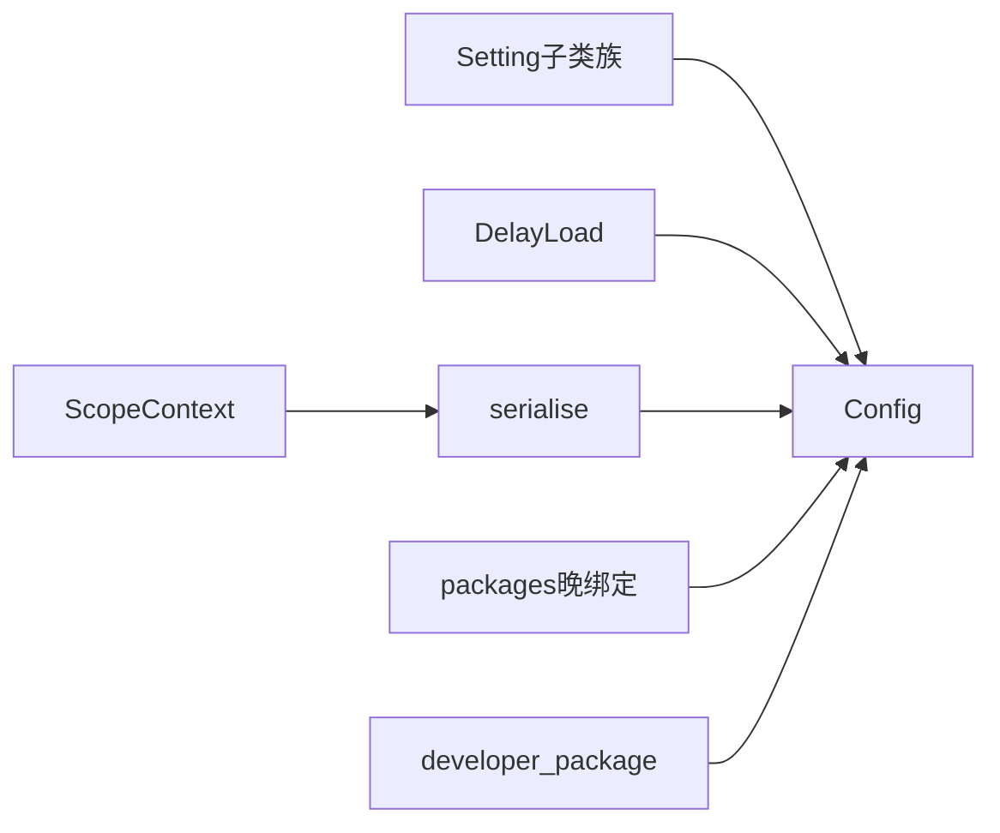

# 配置作用域与延迟加载

<cite>
**本文引用的文件**
- [config.py](file://rez-3.3.0/src/rez/config.py)
- [data_utils.py](file://rez-3.3.0/src/rez/utils/data_utils.py)
- [scope.py](file://rez-3.3.0/src/rez/utils/scope.py)
- [serialise.py](file://rez-3.3.0/src/rez/serialise.py)
- [packages.py](file://rez-3.3.0/src/rez/packages.py)
- [developer_package.py](file://rez-3.3.0/src/rez/developer_package.py)
- [configuring_rez.rst](file://rez-3.3.0/docs/source/configuring_rez.rst)
- [test_config.py](file://rez-3.3.0/src/rez/tests/test_config.py)
- [package.py（测试用包）](file://rez-3.3.0/src/rez/data/tests/config/package.py)
</cite>

## 目录
1. [简介](#简介)
2. [项目结构](#项目结构)
3. [核心组件](#核心组件)
4. [架构总览](#架构总览)
5. [详细组件分析](#详细组件分析)
6. [依赖关系分析](#依赖关系分析)
7. [性能考量](#性能考量)
8. [故障排查指南](#故障排查指南)
9. [结论](#结论)
10. [附录](#附录)

## 简介
本文件围绕 Rez 系统中的“配置作用域”与“延迟加载”两大主题展开，目标是帮助用户在复杂场景下正确管理配置：包括全局、用户、环境与包定义等多级作用域的优先级与隔离机制；在构建与发布期间，包定义文件中 config 部分的特殊覆盖行为；以及 DelayLoad 类如何实现配置的延迟求值，从而支持跨平台与动态环境下的灵活配置管理。文档同时提供可定位到源码的路径示例，便于进一步查阅。

## 项目结构
Rez 的配置体系由以下关键模块构成：
- 配置主入口与验证：config.py
- 延迟加载与列表修改工具：utils/data_utils.py
- 作用域上下文与嵌套字典：utils/scope.py
- 包定义解析与作用域注入：serialise.py
- 晚绑定求值与上下文绑定：packages.py
- 开发者包与预处理流程：developer_package.py
- 文档与示例：docs/source/configuring_rez.rst
- 单元测试与行为验证：src/rez/tests/test_config.py、data/tests/config/package.py

图表来源
- [config.py](file://rez-3.3.0/src/rez/config.py#L540-L800)
- [data_utils.py](file://rez-3.3.0/src/rez/utils/data_utils.py#L40-L120)
- [scope.py](file://rez-3.3.0/src/rez/utils/scope.py#L166-L233)
- [serialise.py](file://rez-3.3.0/src/rez/serialise.py#L247-L271)
- [packages.py](file://rez-3.3.0/src/rez/packages.py#L142-L182)
- [developer_package.py](file://rez-3.3.0/src/rez/developer_package.py#L138-L200)
- [configuring_rez.rst](file://rez-3.3.0/docs/source/configuring_rez.rst#L50-L113)
- [test_config.py](file://rez-3.3.0/src/rez/tests/test_config.py#L142-L175)

章节来源
- [config.py](file://rez-3.3.0/src/rez/config.py#L540-L800)
- [data_utils.py](file://rez-3.3.0/src/rez/utils/data_utils.py#L40-L120)
- [scope.py](file://rez-3.3.0/src/rez/utils/scope.py#L166-L233)
- [serialise.py](file://rez-3.3.0/src/rez/serialise.py#L247-L271)
- [packages.py](file://rez-3.3.0/src/rez/packages.py#L142-L182)
- [developer_package.py](file://rez-3.3.0/src/rez/developer_package.py#L138-L200)
- [configuring_rez.rst](file://rez-3.3.0/docs/source/configuring_rez.rst#L50-L113)
- [test_config.py](file://rez-3.3.0/src/rez/tests/test_config.py#L142-L175)

## 核心组件
- 配置对象与设置验证：Config 类负责合并多来源配置、环境变量覆盖、插件懒加载、缓存与校验；Setting 子类族提供类型化与环境变量解析能力。
- 延迟加载：DelayLoad 将大型配置值延迟到首次访问时从外部文件读取，支持 YAML/JSON。
- 列表修改：ModifyList 支持对列表型配置进行追加/前置而不完全覆盖。
- 作用域上下文：ScopeContext 提供 with scope(...) 的嵌套字典收集器，用于在包定义中声明 config 覆盖块。
- 晚绑定求值：packages.py 中对 late-bound 函数进行上下文绑定与缓存，确保在具体上下文（如构建/发布）中动态计算。

章节来源
- [config.py](file://rez-3.3.0/src/rez/config.py#L540-L800)
- [data_utils.py](file://rez-3.3.0/src/rez/utils/data_utils.py#L40-L120)
- [scope.py](file://rez-3.3.0/src/rez/utils/scope.py#L166-L233)
- [serialise.py](file://rez-3.3.0/src/rez/serialise.py#L247-L271)
- [packages.py](file://rez-3.3.0/src/rez/packages.py#L142-L182)

## 架构总览
Rez 配置的生效顺序与作用域规则如下：
- 全局配置：来自模块内置配置文件与用户家目录配置文件（受环境变量控制）。
- 用户配置：通过环境变量或自定义配置文件叠加。
- 包定义覆盖：在包定义文件中使用 with scope("config") 声明的配置仅在构建与发布期间生效，并覆盖同名设置。
- 插件配置：按需懒加载，避免不必要的开销。
- 字符串扩展：所有配置字符串均支持系统对象属性与环境变量占位符扩展。

图表来源
- [config.py](file://rez-3.3.0/src/rez/config.py#L540-L800)
- [serialise.py](file://rez-3.3.0/src/rez/serialise.py#L247-L271)
- [scope.py](file://rez-3.3.0/src/rez/utils/scope.py#L166-L233)
- [packages.py](file://rez-3.3.0/src/rez/packages.py#L142-L182)

## 详细组件分析

### 配置作用域与继承关系
- 全局配置：由模块内置配置与用户家目录配置组成，可通过环境变量指定额外配置文件路径。
- 用户配置：环境变量覆盖优先于文件配置；支持 JSON 编码的环境变量以表达复杂结构。
- 包定义覆盖：在包定义文件中使用 with scope("config") 声明的配置仅在构建与发布期间生效，覆盖同名设置；文档明确指出这些覆盖仅对构建/安装过程相关的设置有意义。
- 插件配置：Config 对插件配置采用懒加载，避免无谓的插件初始化。
- 字符串扩展：所有配置字符串支持环境变量与 system 对象属性扩展。

图表来源
- [config.py](file://rez-3.3.0/src/rez/config.py#L540-L800)
- [configuring_rez.rst](file://rez-3.3.0/docs/source/configuring_rez.rst#L50-L113)
- [test_config.py](file://rez-3.3.0/src/rez/tests/test_config.py#L142-L175)

章节来源
- [config.py](file://rez-3.3.0/src/rez/config.py#L540-L800)
- [configuring_rez.rst](file://rez-3.3.0/docs/source/configuring_rez.rst#L50-L113)
- [test_config.py](file://rez-3.3.0/src/rez/tests/test_config.py#L142-L175)

### 延迟加载机制（DelayLoad）
- 设计目的：将大型配置（如大型字典）延迟到首次访问时才从外部文件读取，减少启动时内存占用与解析成本。
- 文件格式：支持 YAML 与 JSON。
- 使用方式：在配置中以 DelayLoad 指定外部文件路径，首次访问该配置项时才读取并解析。
- 错误处理：读取与解析异常会被包装为错误信息抛出，便于定位问题。

图表来源
- [data_utils.py](file://rez-3.3.0/src/rez/utils/data_utils.py#L40-L120)
- [config.py](file://rez-3.3.0/src/rez/config.py#L728-L737)

章节来源
- [data_utils.py](file://rez-3.3.0/src/rez/utils/data_utils.py#L40-L120)
- [config.py](file://rez-3.3.0/src/rez/config.py#L728-L737)
- [configuring_rez.rst](file://rez-3.3.0/docs/source/configuring_rez.rst#L98-L113)

### 列表修改（ModifyList）与增量覆盖
- ModifyList 支持对列表型配置进行追加/前置，避免完全覆盖原有值。
- deep_update 在合并时识别 ModifyList 并将其应用到现有列表上。
- 在包定义覆盖中，可通过 ModifyList 对 release_hooks 等列表进行增量修改。

章节来源
- [data_utils.py](file://rez-3.3.0/src/rez/utils/data_utils.py#L98-L135)
- [test_config.py](file://rez-3.3.0/src/rez/tests/test_config.py#L142-L175)
- [package.py（测试用包）](file://rez-3.3.0/src/rez/data/tests/config/package.py#L1-L38)

### 作用域上下文（ScopeContext）与包定义覆盖
- ScopeContext 提供 with scope(...) 的上下文管理器，允许在包定义文件中声明嵌套字典，退出上下文后将变更合并回上层作用域。
- serialise 在加载包定义时会注入当前作用域，使包定义中的 config 块被收集并合并到最终配置中。
- 包定义覆盖仅在构建与发布期间生效，且只影响构建/安装相关的设置。

章节来源
- [scope.py](file://rez-3.3.0/src/rez/utils/scope.py#L166-L233)
- [serialise.py](file://rez-3.3.0/src/rez/serialise.py#L247-L271)
- [configuring_rez.rst](file://rez-3.3.0/docs/source/configuring_rez.rst#L50-L113)

### 晚绑定求值（Late Binding）与上下文绑定
- packages.py 对 late-binding 的 SourceCode 进行求值，若存在上下文则注入 context、in_context、this 等绑定，确保求值结果与当前上下文一致。
- 结果会被缓存，避免重复求值带来的性能损耗。
- 该机制支持在构建/发布阶段根据具体变体或上下文动态生成配置值。

章节来源
- [packages.py](file://rez-3.3.0/src/rez/packages.py#L142-L182)

### 实际代码示例（路径定位）
- 包定义中使用作用域覆盖的示例：[package.py（测试用包）](file://rez-3.3.0/src/rez/data/tests/config/package.py#L1-L38)
- 包定义覆盖生效的单元测试：[test_config.py](file://rez-3.3.0/src/rez/tests/test_config.py#L142-L175)
- 文档中关于包定义覆盖与字符串扩展的说明：[configuring_rez.rst](file://rez-3.3.0/docs/source/configuring_rez.rst#L50-L113)
- 延迟加载的文档示例：[configuring_rez.rst](file://rez-3.3.0/docs/source/configuring_rez.rst#L98-L113)

## 依赖关系分析
- Config 依赖 Setting 子类族完成类型校验与环境变量解析；依赖 DelayLoad 在验证阶段解包延迟值。
- serialise 依赖 ScopeContext 收集包定义中的作用域块，并将作用域字典注入最终数据。
- packages.py 依赖上下文对象进行 late-binding 求值，返回与上下文相关的最终值。
- developer_package.py 依赖配置中的预处理函数与包含路径，确保包定义预处理阶段可用。

图表来源
- [config.py](file://rez-3.3.0/src/rez/config.py#L540-L800)
- [data_utils.py](file://rez-3.3.0/src/rez/utils/data_utils.py#L40-L120)
- [scope.py](file://rez-3.3.0/src/rez/utils/scope.py#L166-L233)
- [serialise.py](file://rez-3.3.0/src/rez/serialise.py#L247-L271)
- [packages.py](file://rez-3.3.0/src/rez/packages.py#L142-L182)
- [developer_package.py](file://rez-3.3.0/src/rez/developer_package.py#L138-L200)

章节来源
- [config.py](file://rez-3.3.0/src/rez/config.py#L540-L800)
- [data_utils.py](file://rez-3.3.0/src/rez/utils/data_utils.py#L40-L120)
- [scope.py](file://rez-3.3.0/src/rez/utils/scope.py#L166-L233)
- [serialise.py](file://rez-3.3.0/src/rez/serialise.py#L247-L271)
- [packages.py](file://rez-3.3.0/src/rez/packages.py#L142-L182)
- [developer_package.py](file://rez-3.3.0/src/rez/developer_package.py#L138-L200)

## 性能考量
- 延迟加载：通过 DelayLoad 将大型配置延迟到首次访问，降低启动时的 IO 与解析成本。
- 插件懒加载：Config 对插件配置采用懒加载，避免不必要的插件初始化。
- 属性缓存：cached_property 与晚绑定结果缓存减少重复计算。
- 列表合并优化：deep_update 与 ModifyList 的扁平化与合并逻辑避免深层复制与多次遍历。

章节来源
- [data_utils.py](file://rez-3.3.0/src/rez/utils/data_utils.py#L40-L120)
- [config.py](file://rez-3.3.0/src/rez/config.py#L540-L800)
- [packages.py](file://rez-3.3.0/src/rez/packages.py#L142-L182)

## 故障排查指南
- 延迟加载文件格式不支持：检查文件扩展名是否为 .yaml 或 .json。
- 延迟加载文件读取失败：确认文件路径存在且可读，查看异常信息定位具体原因。
- 环境变量覆盖未生效：确认 locked 状态与环境变量命名（REZ_前缀），以及 JSON 编码格式是否正确。
- 包定义覆盖无效：确认覆盖仅在构建/发布期间生效，且只对构建/安装相关设置有意义。
- 晚绑定求值异常：检查上下文绑定是否正确，以及 late-binding 函数的返回值是否满足 schema 校验。

章节来源
- [data_utils.py](file://rez-3.3.0/src/rez/utils/data_utils.py#L40-L120)
- [config.py](file://rez-3.3.0/src/rez/config.py#L540-L800)
- [test_config.py](file://rez-3.3.0/src/rez/tests/test_config.py#L142-L175)

## 结论
Rez 的配置体系通过“作用域优先级 + 延迟加载 + 晚绑定求值”的组合，实现了在多平台与动态环境下对配置的精细化管理。全局/用户/包定义三类作用域清晰分离，包定义覆盖仅在构建/发布期间生效，既保证了灵活性又避免了对运行期环境的污染。DelayLoad 与 ModifyList 则分别解决了大体量配置的性能与增量覆盖的问题。结合上下文绑定的晚绑定求值，Rez 能够在不同平台与变体之间稳定地生成所需配置。

## 附录
- 参考文档：[configuring_rez.rst](file://rez-3.3.0/docs/source/configuring_rez.rst#L50-L113)
- 示例路径：
  - 包定义覆盖示例：[package.py（测试用包）](file://rez-3.3.0/src/rez/data/tests/config/package.py#L1-L38)
  - 行为验证测试：[test_config.py](file://rez-3.3.0/src/rez/tests/test_config.py#L142-L175)